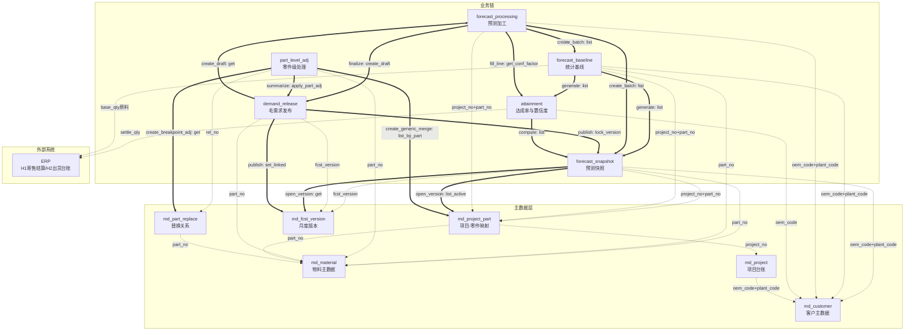

# 销售预测应用组 · 架构设计

> 产出技能：fde-aggregate-identification（第①步，规格 design-plus/架构设计.md）
> 输入：app/forecast/brd/销售预测详设.md
> 组名：`forecast`（逐字绑定，不改写）

---

## ① 聚合根清单总表

| # | 聚合根 | 应用名 | 类名 | 一句话定义 | 标识 | 是否主数据 |
|---|--------|--------|------|-----------|------|----------|
| 1 | 预测快照 | `forecast_snapshot` | `FcstSnapshot` | 客户 N+1~N+3 月度滚动预测的收集入口，版本化管理、行不可变 | `fcst_version + oem_code + plant_code + part_no + period` | 否 |
| 2 | 统计基线 | `forecast_baseline` | `FcstBaseline` | 基于干净需求历史生成的客观统计锚，系统计算+计划确认 | `base_batch + oem_code + plant_code + part_no + period` | 否 |
| 3 | 预测加工 | `forecast_processing` | `FcstProcessing` | 基线→各调整→独立需求的加工总账，计划与销售的制衡载体 | `prc_batch`（单头）+ `prc_batch + oem_code + plant_code + part_no + period`（明细） | 否 |
| 4 | 零件级处理 | `part_level_adj` | `PartLevelAdj` | 通用件合并/替换件合并/断点处理的零件级调整，产出 delta 作用回初步毛需求 | `adj_no` | 否 |
| 5 | 毛需求发布 | `demand_release` | `DemandRelease` | 加工链终点：已发布毛需求，物料×期间，净需求运算的唯一输入 | `rel_no`（单头）+ `rel_no + line_no`（明细） | 否 |
| 6 | 客户主数据 | `md_customer` | `MdCustomer` | 客户/OEM工厂基础信息与结算模式 | `oem_code + plant_code` | 是 |
| 7 | 物料主数据 | `md_material` | `MdMaterial` | 零件号/名称/单位基础信息 | `part_no` | 是 |
| 8 | 项目台账 | `md_project` | `MdProject` | 项目生命周期信息：阶段/SOP/EOP/责任销售 | `project_no` | 是 |
| 9 | 项目零件映射 | `md_project_part` | `MdProjectPart` | 项目×零件×车型的用量/份额/生效期间 | `project_no + part_no` | 是 |
| 10 | 替换关系 | `md_part_replace` | `MdPartReplace` | 零件间替换/替代关系与ECN依据 | `rel_no` | 是 |
| 11 | 月度版本 | `md_fcst_version` | `MdFcstVersion` | 计划周期节奏载体：触发自动生成行、期间折算、R版联动锁定 | `fcst_version`（YYYYMM） | 是 |
| 12 | 达成率与置信度 | `attainment` | `Attainment` | 客户预测达成率与置信系数，月度闭环产出，供下期加工使用 | `oem_code + period` | 否 |

> **未独立建模的实体及理由**：
> - **初步毛需求表（§8.4）**：纯派生汇总（同物料×期间各客户行独立需求之和），无独立用户操作，作为 `demand_release` 创建草稿时的内置计算步骤，不独立成聚合。
> - **寄售结算历史（H1）/ 出货台账（H2）**：来自 ERP 的外部数据，不建聚合；通过各应用的 `_` 前缀适配器方法访问（stub/HTTP）。
> - **模板/类比库（M6）**：知识库型数据，V1 以配置常量形式存在于基线应用中，后续可独立成 `md_template_lib`。
> - **外部数据台账（M7）**：可选增强，缺失时趋势交叉验证降级，V1 不建模。

---

## ② 聚合根卡

### 聚合根 1：预测快照（forecast_snapshot）

```
应用名 / 类名：forecast_snapshot / FcstSnapshot
业务定义：客户 N+1~N+3 月度滚动预测的唯一入口，按版本管理、行不可变，
         是达成率/置信度计算的基准，也是基线生成与加工表的客户预测来源。
标识（主键）：fcst_version + oem_code + plant_code + part_no + period

核心属性：
  - oem_code / plant_code: 文本 — 客户/OEM工厂（录入键）
  - part_no: 文本 — 物料号（录入键）
  - project_no: 文本 — 项目号（多值参考，自动带出，不拆行）
  - veh_model: 文本 — 客户车型（多值参考，自动带出）
  - period: 文本 — 会计期间 YYYY-MM（M+1~M+3）
  - offset: 文本 — 偏移标记 M+1/M+2/M+3
  - orig_qty: 数字 — 原始需求量（录入后永不修改）
  - data_flag: 枚举 — 正常 / OEM未提供（显式缺报≠0）
  - fcst_version: 文本 — V+YYYYMM
  - source_channel: 枚举 — EDI/OEM门户/邮件Excel/销售转录
  - recv_date: 日期 — 接收日期（系统自动盖章）
  - collector: 文本 — 收集人/一线销售

对外操作（将成公共方法）：
  - open_version(fcst_version) — 月度 opening：按活跃零件集自动生成 N+1~N+3 三行（标记"未提供"）
  - fill(part_no, oem_code, plant_code, period, orig_qty, data_flag) — 填/更新预测量
  - get(fcst_version, oem_code, plant_code, part_no, period) — 取单行
  - list(fcst_version, oem_code, plant_code, part_no, period, data_flag, page, size) — 列表查询
  - get_version_status(fcst_version) — 取版本状态（行数/未提供行数/接收渠道分布）
  - lock_version(fcst_version) — R版发布联动锁定

关键不变量（界定一致性边界）：
  - 同一客户+版本+物料+期间仅一条快照行（快照行唯一性）
  - orig_qty 录入后永不修改（行不可变——变更=新版本新行，是本聚合的存在前提）
  - 版本行集完整性：open_version 必须为每个活跃零件生成恰好 N+1/N+2/N+3 三行

引用的聚合（by ID 弱引用）：
  - md_customer.oem_code + plant_code
  - md_material.part_no
  - md_project_part.project_no + part_no（带出项目/车型参考）
  - md_fcst_version.fcst_version

跨应用调用（self.fde.call）：
  - open_version → md_fcst_version.get(fcst_version) 取版本信息
  - open_version → md_project_part.list_active() 取活跃零件集
  - fill → md_customer.get(oem_code, plant_code) 校验客户存在
  - fill → md_material.get(part_no) 校验物料存在

状态机：无显式状态列——最新月版本即活跃，更旧版本自动"已替代"；随 R 版发布联动锁定。
```

### 聚合根 2：统计基线（forecast_baseline）

```
应用名 / 类名：forecast_baseline / FcstBaseline
业务定义：基于寄售结算量（干净口径）的客观统计锚，系统预计算+计划确认；
         基线不因"不认可"调整，意见走加工表调整层。
标识（主键）：base_batch + oem_code + plant_code + part_no + period

核心属性：
  - base_batch: 文本 — B+YYYYMM（与同月 V 版 1:1）
  - oem_code / plant_code: 文本 — 客户/工厂
  - part_no: 文本 — 物料
  - period: 文本 — 期间 YYYY-MM
  - fcst_version: 文本 — 同月 V+YYYYMM，供 lineage
  - project_no / veh_model: 文本 — 项目/车型（多值参考，自动带出）
  - base_qty: 数字 — 统计基线值
  - base_path: 枚举 — 时序外推 / 借用
  - base_method: 文本 — 方法+参数+来源（如"指数平滑 α=0.3"）
  - cross_chk: 文本 — 外生变量交叉验证结果（可选）
  - generator: 文本 — 生成人
  - status: 枚举 — 预计算 / 已确认

对外操作（将成公共方法）：
  - generate(base_batch, fcst_version) — 按月生成基线行集
  - confirm(base_batch, oem_code, plant_code, part_no, period) — 计划确认单行
  - confirm_batch(base_batch) — 计划确认整批
  - update_method(base_batch, oem_code, plant_code, part_no, period, base_method) — 调整方法/参数（须登记依据）
  - get(base_batch, oem_code, plant_code, part_no, period) — 取单行
  - list(base_batch, oem_code, plant_code, part_no, period, status, base_path, page, size) — 列表查询
  - get_batch_status(base_batch) — 取批次状态

关键不变量（界定一致性边界）：
  - 基线批次与同月快照 V 版 1:1 对应（行集完整性）
  - 零历史零件必须走借用路径并登记来源（禁止无来源的基线值）
  - 历史批次保留不覆盖（基线行不可变）

引用的聚合（by ID 弱引用）：
  - forecast_snapshot.fcst_version + oem_code + plant_code + part_no + period
  - md_customer.oem_code + plant_code
  - md_material.part_no
  - md_project_part.project_no + part_no

跨应用调用（self.fde.call）：
  - generate → forecast_snapshot.list(fcst_version) 取客户预测行集（决定哪些行需生成基线）
  - generate → md_customer.get(oem_code, plant_code) 取结算模式（决定历史取 H1/H2）
  - generate → attainment.list(oem_code, period) 取历史达成率（供方法选择参考）

状态机：
  (系统生成) --计划确认--> 已确认
  预计算 --计划确认--> 已确认
```

### 聚合根 3：预测加工（forecast_processing）

```
应用名 / 类名：forecast_processing / FcstProcessing
业务定义：基线→各调整→独立需求的加工总账，计划与销售的制衡载体。
         单头-明细结构：明细行与单头必须同事务落库。
标识（主键）：prc_batch（单头）+ prc_batch + oem_code + plant_code + part_no + period（明细）

核心属性：
  [单头]
  - prc_batch: 文本 — PRC-YYYYMM-NNN
  - base_batch: 文本 — 绑定基线批次
  - fcst_version: 文本 — 绑定 V 版
  - status: 枚举 — 进行中 / 全部核定 / 已锁定
  - owner: 文本 — 加工负责人
  - created_at: 时间 — 系统生成

  [明细]
  - oem_code / plant_code: 文本 — 客户/工厂
  - part_no: 文本 — 物料
  - project_no / veh_model: 文本 — 项目/车型（多值参考）
  - period: 文本 — 期间
  - base_qty: 数字 — 基线值（§8.2 快照）
  - cust_qty: 数字 — 客户预测（=快照 orig_qty，未提供即空）
  - conf_adj: 数字 — 置信度调整 delta
  - conf_reason: 文本 — 置信度调整理由（人工覆写时必填）
  - trend_adj: 数字 — 趋势调整 delta
  - trend_reason: 文本 — 趋势调整理由（超阈时必填）
  - onetime_adj: 数字 — 一次性调整 delta
  - onetime_reason: 文本 — 一次性调整原因
  - onetime_tag: 枚举 — 一次性 / 大一次性 / 断点
  - indep_qty: 数字 — 独立需求（=基线+Σ调整，系统强制加和）
  - chk_result: 枚举 — 通过 / 退回
  - chk_comment: 文本 — 核对结论/退回理由

对外操作（将成公共方法）：
  - create_batch(base_batch, fcst_version) — 创建加工批次并自动生成明细行（从基线行集展开）
  - fill_line(prc_batch, oem_code, plant_code, part_no, period, conf_adj, conf_reason, trend_adj, trend_reason, onetime_adj, onetime_reason, onetime_tag) — 填写调整
  - review_line(prc_batch, oem_code, plant_code, part_no, period, chk_result, chk_comment) — 核定/退回单行
  - finalize(prc_batch) — 全部核定→锁定（联动：全部行通过方可锁定）
  - add_onetime_line(prc_batch, oem_code, plant_code, part_no, period, onetime_adj, onetime_reason, onetime_tag) — 月中附加一次性行（当期行）
  - get(prc_batch) — 取单头+全部明细
  - get_line(prc_batch, oem_code, plant_code, part_no, period) — 取单行
  - list_batches(fcst_version, status, page, size) — 批次列表
  - list_lines(prc_batch, oem_code, plant_code, part_no, period, chk_result, page, size) — 明细列表

关键不变量（界定一致性边界）：
  - 加工批次单头与其全部明细行必须同事务落库（明细是单头的值对象，随批次生死）
  - indep_qty 系统强制加和（= base_qty + conf_adj + trend_adj + onetime_adj），禁止手工改总量
  - 一次性调整只作用于归属期，不顺延、不外推
  - 全部行核定通过方可锁定（状态转换前置条件）

引用的聚合（by ID 弱引用）：
  - forecast_baseline.base_batch + oem_code + plant_code + part_no + period
  - forecast_snapshot.fcst_version + oem_code + plant_code + part_no + period
  - attainment.oem_code + period

跨应用调用（self.fde.call）：
  - create_batch → forecast_baseline.list(base_batch) 取基线行集（展开明细）
  - create_batch → forecast_snapshot.list(fcst_version) 取客户预测值
  - fill_line（置信度）→ attainment.get(oem_code, period) 取置信系数
  - finalize → demand_release.create_draft(prc_batch) 喂初步毛需求汇总

状态机：
  (新建) --create_batch--> 进行中 --全部行核定--> 全部核定 --finalize--> 已锁定
  进行中 --review_line(退回)--> 进行中（退回返工）
  已锁定 --不可逆--> [终态]
```

### 聚合根 4：零件级处理（part_level_adj）

```
应用名 / 类名：part_level_adj / PartLevelAdj
业务定义：通用件合并、替换件合并、断点处理三个独立功能；
         在初步毛需求表生成后顺序执行，输出为物料×期间的调整量（delta）。
标识（主键）：adj_no

核心属性：
  - adj_no: 文本 — PAD-YYYYMM-NNN
  - func_type: 枚举 — 通用件合并 / 替换件合并 / 断点处理
  - part_no: 文本 — 物料
  - fcst_version: 文本 — 版本
  - period: 文本 — 期间
  - adj_qty: 数字 — 调整量（delta，带符号）
  - basis: 文本 — 原因/依据（函件/ECN/历史折减系数/替换关系等）
  - pair_no: 文本 — 配对号（断点必填：关联旧/新件正负行）
  - owner: 文本 — 处理人
  - created_at: 时间 — 处理时间

对外操作（将成公共方法）：
  - create_generic_merge(fcst_version, period, part_no, adj_qty, basis) — 通用件合并调整
  - create_replace_merge(fcst_version, period, part_no, adj_qty, basis) — 替换件合并调整
  - create_breakpoint_adj(fcst_version, period, old_part, new_part, old_adj, new_adj, ecn_no) — 断点成对调整
  - get(adj_no) — 取单条
  - list(fcst_version, func_type, part_no, period, page, size) — 列表查询
  - summarize(fcst_version) — 汇总：按物料×期间聚合全部 delta

关键不变量（界定一致性边界）：
  - 断点处理必须成对（旧件截断负量 + 新件启动正量），同一 pair_no 关联
  - 执行顺序：通用→替换→断点（断点最后，基于最新量）

引用的聚合（by ID 弱引用）：
  - md_material.part_no
  - md_part_replace.rel_no（替换/断点关系）
  - demand_release（写入 delta 至发布单）

跨应用调用（self.fde.call）：
  - create_generic_merge → md_project_part.list_by_part(part_no) 识别通用件（≥2客户）
  - create_replace_merge → md_part_replace.get(rel_no) 取替换关系
  - create_breakpoint_adj → md_part_replace.get(rel_no) 取断点关系
  - summarize → demand_release.apply_part_adj(rel_no, adj_summary) 将汇总 delta 写入发布

状态机：无状态机——每条调整独立生效，执行即作用。
```

### 聚合根 5：毛需求发布（demand_release）

```
应用名 / 类名：demand_release / DemandRelease
业务定义：加工链终点——已发布毛需求（物料×期间），净需求运算的唯一输入。
         单头-明细结构：包含初步毛需求汇总+零件级处理量→最终发布量。
标识（主键）：rel_no（单头）+ rel_no + line_no（明细）

核心属性：
  [单头]
  - rel_no: 文本 — REL-YYYYMM-NNN
  - fcst_version: 文本 — R+YYYYMM(.x)
  - base_period: 文本 — 锚定期间
  - prev_rel_no: 文本 — 上一版本
  - publisher: 文本 — 发布人
  - published_at: 时间 — 发布日期
  - status: 枚举 — 草稿 / 已发布 / 已替代

  [明细]
  - line_no: 整数 — 行号
  - part_no: 文本 — 物料
  - period: 文本 — 期间
  - prelim_qty: 数字 — 初步毛需求（来自加工汇总）
  - part_adj: 文本 — 零件级处理量 JSON [{功能, 原因, 量}]
  - onetime_items: 文本 — 一次性调整明细 JSON [原因列示]
  - rel_qty: 数字 — 发布量（= 初步 + Σ 零件级处理量，系统强制）
  - basis: 文本 — 主要依据
  - lineage: 文本 — 链路线索 JSON（加工批次/零件级处理依据/预测版本）

对外操作（将成公共方法）：
  - create_draft(prc_batch) — 从已锁定加工批次创建发布草稿（汇总→初步毛需求）
  - apply_part_adj(rel_no, part_no, period, adj_qty, func_type, basis) — 应用零件级处理量
  - publish(rel_no) — 发布（状态→已发布；联动锁定快照V版与加工批次）
  - get(rel_no) — 取单头+全部明细
  - get_line(rel_no, line_no) — 取单行
  - list(fcst_version, part_no, period, status, page, size) — 列表查询
  - get_diff(rel_no) — R_n vs R_n−1 差异视图
  - add_onetime_item(rel_no, part_no, period, onetime_adj, reason) — 月中附加一次性调整

关键不变量（界定一致性边界）：
  - 发布单头与其全部明细行必须同事务落库
  - rel_qty 系统强制加和（= prelim_qty + Σ part_adj 量），禁止手工改总量
  - 三个预测行（N+1/N+2/N+3）发布后冻结；一次性调整可月中附加
  - 未发布口径不得外流（status≠已发布时外部不可消费）

引用的聚合（by ID 弱引用）：
  - forecast_processing.prc_batch
  - md_material.part_no
  - md_fcst_version.fcst_version

跨应用调用（self.fde.call）：
  - create_draft → forecast_processing.get(prc_batch) 取已锁定加工明细（汇总）
  - publish → forecast_snapshot.lock_version(fcst_version) 联动锁定快照
  - publish → forecast_processing（状态已锁定，无需回调）
  - publish → md_fcst_version.set_linked(fcst_version, rel_no) 更新版本关联

状态机：
  (新建) --create_draft--> 草稿 --publish--> 已发布 --新版本发布--> 已替代
```

### 聚合根 6：客户主数据（md_customer）

```
应用名 / 类名：md_customer / MdCustomer
业务定义：客户/OEM工厂基础信息与结算模式，决定历史数据取寄售结算(H1)还是出货台账(H2)
标识（主键）：oem_code + plant_code
数据来源类型：独立创建

核心属性：
  - oem_code: 文本 — 客户编码
  - oem_name: 文本 — 客户名称
  - plant_code: 文本 — OEM工厂编码
  - plant_name: 文本 — 工厂名称
  - settle_mode: 枚举 — 寄售 / 非寄售

对外操作（将成公共方法）：
  - create(oem_code, oem_name, plant_code, plant_name, settle_mode)
  - get(oem_code, plant_code)
  - list(oem_code, plant_code, settle_mode, page, size)
  - update(oem_code, plant_code, oem_name, plant_name, settle_mode)
  - import_batch(rows) — 批量导入/更新

关键不变量（界定一致性边界）：
  - 同一客户编码+工厂编码唯一
  - settle_mode 决定历史数据取数口径：寄售→H1、非寄售→H2

引用的聚合（by ID 弱引用）：无
跨应用调用（self.fde.call）：无
状态机：无
```

### 聚合根 7：物料主数据（md_material）

```
应用名 / 类名：md_material / MdMaterial
业务定义：零件号/名称/单位基础信息，被快照/基线/加工/零件级处理/发布全部引用
标识（主键）：part_no
数据来源类型：独立创建

核心属性：
  - part_no: 文本 — 零件号
  - part_name: 文本 — 零件名称
  - uom: 文本 — 单位（件/套/kg等）
  - mat_type: 枚举 — 成品 / 半成品（可选参考）

对外操作（将成公共方法）：
  - create(part_no, part_name, uom, mat_type)
  - get(part_no)
  - list(part_no, part_name, mat_type, page, size)
  - update(part_no, part_name, uom, mat_type)
  - import_batch(rows) — 批量导入/更新

关键不变量（界定一致性边界）：
  - part_no 全局唯一

引用的聚合（by ID 弱引用）：无
跨应用调用（self.fde.call）：无
状态机：无
```

### 聚合根 8：项目台账（md_project）

```
应用名 / 类名：md_project / MdProject
业务定义：项目生命周期信息：阶段/SOP/EOP，定义活跃行集（进行中项目），供快照 opening 自动生成行
标识（主键）：project_no
数据来源类型：独立创建

核心属性：
  - project_no: 文本 — 项目号
  - project_name: 文本 — 项目名称
  - stage: 枚举 — 待定点 / 定点中 / 进行中 / EOP关闭
  - oem_code / plant_code: 文本 — 客户/工厂（引用 M1）
  - veh_model / platform: 文本 — 车型/平台
  - sop / eop: 日期 — SOP/EOP 节点
  - owner: 文本 — 责任销售

对外操作（将成公共方法）：
  - create(project_no, project_name, stage, oem_code, plant_code, veh_model, platform, sop, eop, owner)
  - get(project_no)
  - list(project_no, stage, oem_code, plant_code, page, size)
  - update(project_no, ...)
  - list_active() — 取进行中项目（供快照 opening 用）

关键不变量（界定一致性边界）：
  - project_no 全局唯一
  - 进行中项目 = stage ∈ {进行中}，是活跃行集的定义来源

引用的聚合（by ID 弱引用）：
  - md_customer.oem_code + plant_code

跨应用调用（self.fde.call）：
  - create/update → md_customer.get(oem_code, plant_code) 校验客户存在

状态机：待定点 → 定点中 → 进行中 → EOP关闭
```

### 聚合根 9：项目零件映射（md_project_part）

```
应用名 / 类名：md_project_part / MdProjectPart
业务定义：项目×零件×车型的量纲关系（单车用量/供应份额/生效期间），
         是快照多值参考的来源、通用件识别（≥2客户）、断点/EOP定量的依据
标识（主键）：project_no + part_no
数据来源类型：独立创建

核心属性：
  - project_no: 文本 — 项目号
  - part_no: 文本 — 零件号
  - veh_model: 文本 — 客户车型（多值参考来源）
  - usage: 数字 — 单车用量
  - share: 数字 — 供应份额（0~1）
  - eff_from / eff_to: 日期 — 生效起/止

对外操作（将成公共方法）：
  - create(project_no, part_no, veh_model, usage, share, eff_from, eff_to)
  - get(project_no, part_no)
  - list(project_no, part_no, veh_model, page, size)
  - list_active() — 取进行中项目的全部零件映射（供快照 opening 用）
  - list_by_part(part_no) — 按零件查所有项目映射（通用件识别用）
  - update(...)

关键不变量（界定一致性边界）：
  - 同一项目+零件唯一（一对）
  - 通用件判定：同 part_no 出现在 ≥2 个不同客户的项目中

引用的聚合（by ID 弱引用）：
  - md_project.project_no
  - md_material.part_no

跨应用调用（self.fde.call）：
  - create/update → md_project.get(project_no) 校验项目存在
  - create/update → md_material.get(part_no) 校验物料存在

状态机：无显式状态机；生效期间（eff_from/eff_to）控制量纲版本
```

### 聚合根 10：替换关系（md_part_replace）

```
应用名 / 类名：md_part_replace / MdPartReplace
业务定义：零件间替换/替代关系与ECN依据，是替换件合并与断点处理的输入
标识（主键）：rel_no
数据来源类型：独立创建

核心属性：
  - rel_no: 文本 — 关系号
  - rel_type: 枚举 — 替换（旧→新）/ 替代
  - old_part: 文本 — 旧件号
  - new_part: 文本 — 新件号
  - switch_date: 日期 — 切换时点
  - ecn_no: 文本 — ECN 号
  - status: 枚举 — 生效 / 失效

对外操作（将成公共方法）：
  - create(rel_no, rel_type, old_part, new_part, switch_date, ecn_no)
  - get(rel_no)
  - list(rel_type, old_part, new_part, status, page, size)
  - update(...)
  - disable(rel_no) — 设为失效

关键不变量（界定一致性边界）：
  - rel_no 全局唯一
  - 替换关系（rel_type=替换）必须 old_part ≠ new_part

引用的聚合（by ID 弱引用）：
  - md_material.part_no（old_part, new_part）

跨应用调用（self.fde.call）：
  - create/update → md_material.get(old_part) 校验旧件存在
  - create/update → md_material.get(new_part) 校验新件存在

状态机：生效 → 失效
```

### 聚合根 11：月度版本（md_fcst_version）

```
应用名 / 类名：md_fcst_version / MdFcstVersion
业务定义：计划周期节奏载体，触发自动生成行、期间折算基准、R版发布联动锁定
标识（主键）：fcst_version（YYYYMM）
数据来源类型：独立创建

核心属性：
  - fcst_version: 文本 — YYYYMM
  - base_period: 文本 — 锚定期间
  - periods: 文本 — 对应期间 JSON ["YYYY-MM","YYYY-MM","YYYY-MM"]（M+1~M+3）
  - opening_date: 日期 — opening 日
  - status: 枚举 — 活跃 / 锁定
  - linked_batch: 文本 — 关联 B/PRC/R 号

对外操作（将成公共方法）：
  - create(fcst_version, base_period, periods, opening_date)
  - get(fcst_version)
  - list(page, size)
  - set_linked(fcst_version, rel_no) — R版发布联动锁定
  - get_active() — 取当前活跃版本

关键不变量（界定一致性边界）：
  - fcst_version 全局唯一
  - 同一时刻只有一个活跃版本

引用的聚合（by ID 弱引用）：无
跨应用调用（self.fde.call）：无
状态机：活跃 --R版发布--> 锁定
```

### 聚合根 12：达成率与置信度（attainment）

```
应用名 / 类名：attainment / Attainment
业务定义：客户预测达成率与置信系数，月度闭环自动生成（H1关账后），
         供下期加工表置信度调整使用
标识（主键）：oem_code + period
数据来源类型：自动参考创建（由月度闭环触发生成，禁止前端创建入口）

核心属性：
  - oem_code: 文本 — 客户编码
  - period: 文本 — 期间 YYYY-MM
  - horizon: 文本 — H1/H2/H3（同一目标月被预测三次，分 horizon 计算）
  - snap_qty: 数字 — V版快照原始量（该 horizon 对应的预测值）
  - settle_qty: 数字 — 结算实际量
  - attain_rate: 数字 — 达成率（= settle_qty / snap_qty）
  - conf_factor: 数字 — 置信系数（近3期滚动，截断[0.8,1.2]）
  - gen_batch: 文本 — 生成批次

对外操作（将成公共方法）：
  - compute(oem_code, period) — 按月+客户计算达成率与置信系数
  - compute_batch(fcst_version) — 批量计算（月度闭环触发）
  - get(oem_code, period)
  - list(oem_code, period, horizon, page, size)
  - get_conf_factor(oem_code, period) — 取置信系数（供加工表使用）

关键不变量（界定一致性边界）：
  - 达成率分 horizon 计算（同一目标月被预测三次）
  - conf_factor 截断 [0.8, 1.2]
  - 一次性调整量不混入达成率计算

引用的聚合（by ID 弱引用）：
  - forecast_snapshot.fcst_version + oem_code + period（取 snap_qty）
  - md_customer.oem_code

跨应用调用（self.fde.call）：
  - compute → forecast_snapshot.list(...) 取快照原始量
  - compute → md_customer.get(oem_code, plant_code) 取结算模式
  - 结算实际量（settle_qty）→ 通过 _load_settlement 适配器从 ERP H1/H2 获取

状态机：无
```

---

## ③ 聚合关系图



**关系说明**：
- 虚线（`-.->`）= ID 弱引用（by ID 引用，非事务耦合）
- 粗实线（`==>`）= 跨应用调用（`self.fde.call`）
- 外部系统 ERP 通过 `_` 前缀适配器访问，不建模为聚合

**主数据被引用矩阵**：

| 主数据 | 被引用的业务聚合 |
|--------|-----------------|
| md_customer | forecast_snapshot, forecast_baseline, forecast_processing, attainment, md_project |
| md_material | forecast_snapshot, forecast_baseline, forecast_processing, part_level_adj, demand_release, md_project_part, md_part_replace |
| md_project | md_project_part |
| md_project_part | forecast_snapshot, forecast_baseline, forecast_processing, part_level_adj |
| md_part_replace | part_level_adj |
| md_fcst_version | forecast_snapshot, demand_release |

---

## ④ 关键设计决策

| # | 决策 | 理由 |
|---|------|------|
| D1 | 初步毛需求表（§8.4）不独立成聚合 | 纯派生汇总（SUM GROUP BY），无独立用户操作；作为 `demand_release.create_draft()` 的内置计算步骤 |
| D2 | 模板/类比库（M6）V1 不独立建模 | 知识库型数据，V1 以基线应用内的配置常量/方法参数形式存在；后续可独立为 `md_template_lib` |
| D3 | 外部数据台账（M7）V1 不建模 | 可选增强，缺失时趋势交叉验证降级为不验证 |
| D4 | 寄售结算(H1)/出货台账(H2)不建聚合 | 来自 ERP 的外部数据；各应用通过 `_load_settlement_history` / `_load_shipment_history` 适配器访问 |
| D5 | 达成率/置信度独立为 `attainment` 聚合 | 有独立标识（客户×期间）、独立计算逻辑、被加工表跨应用调用；符合"独立列表/管理"判据 |
| D6 | 预测加工采用单头-明细结构 | 明细行随批次生死（同事务），符合聚合内值对象模式 |
| D7 | 毛需求发布采用单头-明细结构 | 同上；发布明细行随发布单生死 |
| D8 | 零件级处理每条独立、无单头 | 三个功能独立运行、无批次概念；每条调整独立生效 |
| D9 | 主数据全部独立建模为 `md_*` 应用 | 遵照 CONVENTION 规则 10（主数据铁律）：被多方引用的基础数据不在组内独立建模视为架构不完整；V1 以 Excel 导入起步 |
| D10 | 当期仅含一次性调整量（当期基础需求由未发订单承接） | 与《产销协同简化详设》§3 一致：预测与执行层互斥 |

---

## ⑤ 待确认清单

| # | 项 | 说明 |
|---|-----|------|
| Q1 | 历史数据接入方式 | H1/H2 的 ERP 接口规格未定；V1 以 stub/Excel 导入起步，接口规格在实施设计阶段补 |
| Q2 | 模板/类比库（M6）详细字段 | 当前仅确定最小字段（§9.3），具体知识表示形式（形状参数/类比对的 JSON schema）待业务方确认 |
| Q3 | 外部数据台账（M7）启用时机 | 可选增强；需确认 V1 是否需要预留接口位 |
| Q4 | P8 月度节奏时限默认值 | 当前为参考值（opening+3/+4/+6/+7），需业务方确认实际时限 |
| Q5 | 通用件历史折减系数 P4 初始值 | 当前默认 0.65，需基于实际历史数据回测校准 |
