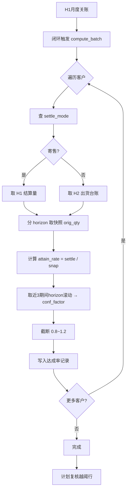

# 用户需求规格说明书 · 达成率与置信度

> **应用名**: `attainment`
> **类名**: `Attainment`
> **所属组**: `forecast`（销售预测应用组）
> **架构来源**: `app/forecast/architecture.md` 聚合根 #12
> **业务设计来源**: `app/forecast/brd/销售预测详设.md` §7.1、§9.4 H3、§10 P2
> **数据来源类型**: 自动参考创建（由月度闭环触发 compute_batch，禁止前端创建入口）

---

## 1. 需求概览

### 1.1 基本信息
- **需求名称**: 客户预测达成率与置信系数管理
- **需求编号**: REQ-FORECAST-ATTAIN-001
- **所属模块**: 销售预测-闭环分析
- **需求来源**: 业务方（总部计划、月度闭环流程）
- **创建日期**: 2026-08-12
- **优先级**: P1

### 1.2 需求背景

#### 1.2.1 为什么需要这个需求？

销售预测的质量取决于客户预测的准确度。不同的客户/OEM 有不同的预测行为模式：有的习惯多报（需打折），有的保守少报（需补足），有的高度准确（直接采用）。若没有系统化的达成率追踪和置信系数输出，预测加工表中的"置信度调整"将沦为拍脑袋数字，既不可解释也不可持续改进。

#### 1.2.2 期望达到什么目标？

建立自动化闭环指标计算能力：每月 H1 关账后，系统自动对比客户 V 版快照原始量与结算实际量，分 horizon（M+1/M+2/M+3）计算达成率，并滚动生成置信系数（conf_factor）供下期加工表自动带出。一次性调整量不混入达成率计算，保证指标纯粹反映预测本身的准确度。

### 1.3 需求范围

#### 1.3.1 包含哪些功能？

compute（按月+客户计算达成率与置信系数）、compute_batch（月度闭环批量计算）、get（单条查询）、list（分条件下查询）、get_conf_factor（供加工表取置信系数）

#### 1.3.2 不包含哪些功能？

- **前端创建入口**（数据来源类型为"自动参考创建"：达成率/置信度由月度闭环的 compute_batch 自动生成，用户无需手工触发）
- 人工覆写达成率（达成率是客观指标，覆写需求走月度复盘归因流程，不直接改数）
- 置信系数人工覆写（覆写走加工表 conf_adj + conf_reason 字段，不修改本聚合的 conf_factor）
- 达成率/置信度的删除

### 1.4 涉及角色

**谁会使用这个功能？**

- **系统自动（月度闭环）**: H1 关账后自动触发 compute_batch，生成当月全部客户×horizon 的达成率与置信系数
- **总部计划**: 查看达成率列表、越阈行复核（达成率 <90%）、月度复盘归因
- **forecast_processing（加工表应用）**: 通过 get_conf_factor() 获取置信系数，自动填入 conf_adj
- **forecast_baseline（基线应用）**: 通过 list() 获取历史达成率，供基线方法选择参考

---

## 2. 用户故事

### 2.1 核心用户故事

#### 2.1.1 `US-01` 用户故事 — 月度闭环自动批量计算（优先级：P1）

- **故事描述**: 作为月度闭环流程，我想要在 H1 关账后自动批量计算所有客户的达成率与置信系数，以便于为下期预测加工提供量化的客户预测可信度参考。
- **为何赋予此优先级**: 达成率/置信系数是整个预测加工链中"置信度调整"的唯一量化输入——无此数据，加工表 conf_adj 无法自动带出，所有置信度调整均需人工录入，质量和效率均不可接受。
- **独立测试**: 可通过准备快照数据和结算数据后调用 compute_batch(fcst_version)，验证所有客户×horizon 的达成率正确计算、conf_factor 在 [0.8, 1.2] 范围内来独立测试。
- **前置条件**: 对应 V 版快照数据已存在（forecast_snapshot）；H1/H2 结算数据已通过适配器就绪；md_customer 中该客户的 settle_mode 已知。
- **后置条件**: 该版本下所有客户×horizon 的 attain_rate 和 conf_factor 已生成；gen_batch 记录批次号。

**验收场景**：

1. `US-01-AC1` **正常批量计算**
   - **Given** V版快照存在客户A的 M+1/M+2/M+3 三行预测，H1 结算数据对应期间已就绪，**When** 调用 compute_batch("202608")，**Then** 客户A 生成 3 条记录（horizon=H1/H2/H3），每条含 snap_qty、settle_qty、attain_rate，conf_factor 基于近3期滚动。

2. `US-01-AC2` **一次性调整量不混入**
   - **Given** 客户A 的 M+1 快照 orig_qty=1150，但该月有一次性调整 +180，**When** 计算达成率时，**Then** snap_qty 取快照 orig_qty（1150），不包含一次性调整量（+180），达成率 = settle_qty / 1150。

3. `US-01-AC3` **快照数据缺失时降级**
   - **Given** 客户B 在 "202608" 版本中无快照数据（客户当月未提供预测），**When** 调用 compute_batch("202608")，**Then** 客户B 不生成达成率记录（跳过），不报错。

4. `US-01-AC4` **结算数据缺失时处理**
   - **Given** 客户C 有快照数据但结算数据未就绪（H1 未关账或 ERP 异常），**When** 调用 compute_batch("202608")，**Then** 客户C 对应 horizon 的 settle_qty 为空，attain_rate 为空，conf_factor 降级使用历史值或默认 1.0。

---

#### 2.1.2 `US-02` 用户故事 — 分 horizon 达成率计算（优先级：P1）

- **故事描述**: 作为月度闭环流程，我想要对同一目标月按照预测 horizon（H1=M+1、H2=M+2、H3=M+3）分三档计算达成率，以便于反映预测信息随提前期衰减的规律，支持不同 horizon 采用不同的置信度策略。
- **为何赋予此优先级**: 分 horizon 是核心设计——同一目标月被预测三次（连续三个版本中分别作为 M+3、M+2、M+1 出现），分 horizon 准确率反映信息衰减，是置信度策略和模式假设复盘的基础。
- **独立测试**: 可通过准备同一目标月三个版本的快照数据，验证 H1/H2/H3 三条记录各自对应不同版本的 snap_qty，达成率各自独立计算来独立测试。
- **前置条件**: 目标月的快照在三个连续版本中均已录入。
- **后置条件**: 三条达成率记录（同一客户+同一期间，不同 horizon）各自独立存在。

**验收场景**：

1. `US-02-AC1` **同一目标月三 horizon 正确**
   - **Given** 目标月 2026-09 的快照：V202608 中作为 M+1=2026-09（orig_qty=1150），V202607 中作为 M+2=2026-09（orig_qty=1100），V202606 中作为 M+3=2026-09（orig_qty=1050），**When** 计算达成率（settle_qty=1120），**Then** H1 达成率=1120/1150≈97.4%，H2 达成率=1120/1100≈101.8%，H3 达成率=1120/1050≈106.7%。

2. `US-02-AC2` **horizon 标记正确性**
   - **Given** 客户A + 2026-09 期间，**When** 查询 list(oem_code="A", period="2026-09")，**Then** 返回至多 3 条记录，horizon 分别为 H1、H2、H3，每条关联不同的 fcst_version。

---

#### 2.1.3 `US-03` 用户故事 — 置信系数 conf_factor 计算（优先级：P1）

- **故事描述**: 作为月度闭环流程，我想要基于近 3 期滚动达成率自动计算置信系数（截断 [0.8, 1.2]），以便于加工表可直接取用而不需每次人工判断。
- **为何赋予此优先级**: conf_factor 是加工表"置信度调整"的自动带出值，直接决定 delta（基线 → 独立需求的调整量）；若不可靠或不自动，加工效率严重受损。
- **独立测试**: 可通过准备客户近 3 期达成率数据，调用 compute() 后验证 conf_factor 为近 3 期滚动值且在 [0.8, 1.2] 范围内来独立测试。
- **前置条件**: 客户至少已有 1 期达成率历史数据（不足 3 期的用已有期数滚动）。
- **后置条件**: conf_factor 生成，范围 [0.8, 1.2]。

**验收场景**：

1. `US-03-AC1` **高达成率直采**
   - **Given** 客户A 近 3 期达成率分别为 97%、98%、97%，**When** 计算 conf_factor，**Then** conf_factor = 1.0（达成率 ≥95%，直接采用，对应 P2 规则）。

2. `US-03-AC2` **一贯多报打折**
   - **Given** 客户A 近 3 期达成率分别为 85%、82%、88%，**When** 计算 conf_factor，**Then** conf_factor = (85%+82%+88%)/3 ≈ 0.85（一贯多报，系数 <1 打折）。

3. `US-03-AC3` **一贯少报补足**
   - **Given** 客户A 近 3 期达成率分别为 112%、108%、115%，**When** 计算 conf_factor，**Then** conf_factor = min((112%+108%+115%)/3, 1.2) ≈ 1.117（一贯少报，系数 >1 补足）。

4. `US-03-AC4` **截断下限**
   - **Given** 客户A 近 3 期达成率分别为 60%、65%、70%，滚动均值 = 65%，**When** 计算 conf_factor，**Then** conf_factor = 0.8（截断下限，不得低于 0.8）。

5. `US-03-AC5` **截断上限**
   - **Given** 客户A 近 3 期达成率分别为 130%、125%、135%，滚动均值 = 130%，**When** 计算 conf_factor，**Then** conf_factor = 1.2（截断上限，不得高于 1.2）。

6. `US-03-AC6` **不足 3 期历史**
   - **Given** 客户A 仅有 2 期达成率（90%、92%），**When** 计算 conf_factor，**Then** conf_factor = (90%+92%)/2 = 0.91（用已有期数滚动）。

7. `US-03-AC7` **无历史数据**
   - **Given** 客户A 无任何达成率历史（新客户），**When** 计算 conf_factor，**Then** conf_factor = 1.0（默认值，不做调整）。

---

#### 2.1.4 `US-04` 用户故事 — 查询达成率与置信系数（优先级：P1）

- **故事描述**: 作为总部计划/加工表应用，我想要查询达成率和置信系数数据（单条/列表/置信系数），以便于月度复盘归因和加工表自动取用。
- **为何赋予此优先级**: 查询是所有消费者的入口——加工表 get_conf_factor() 和月度复盘 list() 均为 P0 路径。
- **独立测试**: 可通过 compute 生成记录后调用 get()/list()/get_conf_factor() 验证返回数据完整性来独立测试。
- **前置条件**: 系统中已存在达成率数据。
- **后置条件**: 无（只读操作）。

**验收场景**：

1. `US-04-AC1` **按客户+期间查询**
   - **Given** 客户A 的 2026-09 达成率已生成，**When** 调用 get("A", "2026-09")，**Then** 返回全部 horizon（H1/H2/H3）记录。

2. `US-04-AC2` **按 horizon 筛选列表**
   - **Given** 客户A 多个期间的达成率已生成，**When** 调用 list(oem_code="A", horizon="H1")，**Then** 仅返回 H1 记录。

3. `US-04-AC3` **get_conf_factor**
   - **Given** 客户A + 2026-09 的 conf_factor=0.85，**When** 调用 get_conf_factor("A", "2026-09")，**Then** 返回 0.85。

---

#### 2.1.5 `US-05` 用户故事 — 指定客户重算（优先级：P2）

- **故事描述**: 作为总部计划，当某个客户的结算数据在 H1 关账后发生修正（如 ERP 调整），我想要对该客户单独重算达成率与置信系数，以便于保持指标准确而不必全量重跑。
- **为何赋予此优先级**: 数据修正场景低频但关键；多数月份 compute_batch 批量即可覆盖，此处提供兜底能力。
- **独立测试**: 可通过准备修正后的结算数据后调用 compute(oem_code, period)，验证达成率更新正确来独立测试。
- **前置条件**: 对应客户的快照数据已存在；修正后的结算数据已就绪。
- **后置条件**: 该客户该期间的达成率和 conf_factor 已更新。

**验收场景**：

1. `US-05-AC1` **单客户重算覆盖**
   - **Given** 客户A 2026-09 已有达成率记录（settle_qty=1120, attain_rate=97.4%），结算数据修正为 settle_qty=1150，**When** 调用 compute("A", "2026-09")，**Then** 达成率更新为 1150/1150=100%，conf_factor 联动重算。

2. `US-05-AC2` **不存在的客户拒绝**
   - **Given** 客户X 在 md_customer 中不存在，**When** 调用 compute("X", "2026-09")，**Then** 返回错误"客户不存在"。

---

## 3. 业务场景

### 3.1 业务流程描述

#### 3.1.1 场景1: 月度闭环 → 自动生成达成率与置信系数

1. H1（寄售仓）月度关账完成，结算数据就绪
2. 月度闭环流程触发 compute_batch(fcst_version="202608")
3. 系统遍历该版本下所有有快照数据的客户
4. 对每个客户，按 settle_mode 决定取数源：寄售→H1 结算量，非寄售→H2 出货台账
5. 对每个客户×期间，按 M+1/M+2/M+3 三 horizon 分别计算：
   - 找到该目标月在对应 horizon 版本中的快照 orig_qty → snap_qty
   - 从 H1/H2 获取对应期间的 settle_qty（一次性调整量已从结算侧剔除）
   - 计算 attain_rate = settle_qty / snap_qty
   - 取近 3 期同 horizon 达成率滚动值 → conf_factor（截断 [0.8, 1.2]）
6. 批量写入达成率记录（oem_code + period + horizon 唯一）
7. 计划复核越阈行（达成率 <90% → 归因），复核不影响自动生成的数值



#### 3.1.2 场景2: 加工表取用置信系数

1. forecast_processing.fill_line() 填写加工明细
2. 加工表调用 attainment.get_conf_factor(oem_code, period)
3. 取回 conf_factor（如 0.85）
4. 加工表计算 conf_adj = base_qty * (conf_factor - 1)（带符号 delta，可人工覆写）
5. 人工覆写须登记 conf_reason

#### 3.1.3 场景3: 月度复盘中的归因

1. 总部计划进入达成率列表，筛选本月越阈行（attain_rate < 0.9）
2. 逐行归因：区分"我方多报"（计划/销售失误）与"客户需求塌方"（外部减产/销量骤降）
3. 归因结论入月度复盘表（协调层），不修改达成率原始值
4. 归因识别的一次性调整反哺登记纪律

### 3.2 业务规则

#### 3.2.1 `BR-01` 达成率分 horizon 计算
- **规则描述**: 同一目标月被预测三次（在连续三个版本中分别作为 M+3、M+2、M+1），达成率必须分 horizon 独立计算，不得跨 horizon 混算。每条记录由 oem_code + period + horizon 唯一标识。
- **适用场景**: compute() / compute_batch() 时
- **计算方式**: attain_rate(H_n) = settle_qty(目标月) / snap_qty(该月作为 M+n 时的快照 orig_qty)
- **示例**: 目标月 2026-09，H1 取 V202608.M+1 的 orig_qty，H2 取 V202607.M+2 的 orig_qty，H3 取 V202606.M+3 的 orig_qty

#### 3.2.2 `BR-02` 一次性调整量不混入达成率
- **规则描述**: 达成率的分母 snap_qty 取快照原始量（orig_qty），不包含一次性调整量（onetime_adj）；分子 settle_qty 也剔除一次性调整导致的大额结算（>20% 期量）。此规则确保达成率纯粹反映预测本身的准确度，不被特殊事件污染。
- **适用场景**: compute() 取 snap_qty 和 settle_qty 时
- **计算方式**: snap_qty = forecast_snapshot.orig_qty（不 + onetime_adj）；settle_qty = 结算量 − 标记为"大一次性"的结算尖峰量
- **示例**: 客户快照 orig_qty=1150，onetime_adj=+180，settle_qty=1300（含大一次性尖峰 150），则 snap_qty=1150，有效 settle_qty=1300-150=1150，达成率=1150/1150=100%（而非 1300/1150=113%，也不是 1300/1330=97.7%）

#### 3.2.3 `BR-03` conf_factor 近 3 期滚动截断
- **规则描述**: conf_factor 取同客户同 horizon 近 3 期达成率的滚动均值；不足 3 期的用已有期数；无历史时默认 1.0。最终值截断在 [0.8, 1.2] 范围内。达成率 ≥95% 时 conf_factor 直接取 1.0（直采）。
- **适用场景**: compute() 计算 conf_factor 时
- **计算方式**:
  1. 取同客户+同 horizon 最近 3 期 attain_rate
  2. 均值为 raw = AVG(最近 N 期 attain_rate)，N = min(3, 已有期数)
  3. 如果 raw ≥ 0.95 → conf_factor = 1.0
  4. 否则 conf_factor = CLAMP(raw, 0.8, 1.2)
- **示例**: 近 3 期 H1 达成率 [85%, 82%, 88%] → raw=85% → conf_factor=0.85（<1，打折）；近 3 期 [97%, 98%, 97%] → raw≥95% → conf_factor=1.0（直采）；近 3 期 [60%, 65%, 70%] → raw=65% → clamp→0.8（下限保护）

#### 3.2.4 `BR-04` 结算数据取数口径
- **规则描述**: 结算实际量（settle_qty）的取数源由客户主数据的 settle_mode 决定：寄售客户取 H1（寄售仓月度结算表），非寄售客户取 H2（出货台账）。
- **适用场景**: compute() 加载 settle_qty 时
- **计算方式**: 通过 md_customer.get(oem_code, plant_code).settle_mode 判断 → 寄售走 _load_settlement(oem_code, plant_code, period) → 非寄售走 _load_shipment(oem_code, plant_code, period)
- **示例**: 客户A settle_mode="寄售" → settle_qty 取 H1 结算量；客户B settle_mode="非寄售" → settle_qty 取 H2 出货量

#### 3.2.5 `BR-05` 记录幂等覆盖
- **规则描述**: 同一 oem_code + period + horizon 的达成率记录在重算时覆盖更新（不产生重复行）。compute_batch 对已存在的记录做 upsert。
- **适用场景**: compute() / compute_batch() 写入时
- **计算方式**: ON CONFLICT (oem_code, period, horizon) DO UPDATE
- **示例**: 月度闭环 compute_batch("202608") 后，若某客户因 ERP 数据修正需重算，compute("A", "2026-09") 覆盖原 H1/H2/H3 记录

#### 3.2.6 `BR-06` 前端禁止创建入口
- **规则描述**: 数据来源类型为"自动参考创建"，达成率/置信度由月度闭环的 compute_batch 自动生成。前端不得提供"新建达成率"按钮或手工录入表单。
- **适用场景**: 前端 UI 设计时
- **示例**: 前端仅展示达成率列表（只读），无新增/编辑/删除按钮

### 3.3 业务数据

#### 3.3.1 数据1: 达成率（attain_rate）
- **数据描述**: 客户预测的准确性指标，衡量快照原始量与实际结算量的比值
- **数据类型**: 数字（小数，如 0.974 表示 97.4%）
- **数据来源**: 系统自动计算（settle_qty / snap_qty）
- **示例值**: 0.974

#### 3.3.2 数据2: 置信系数（conf_factor）
- **数据描述**: 基于历史达成率滚动的调权系数，供加工表自动带入置信度调整量
- **数据类型**: 数字（范围 [0.8, 1.2]）
- **数据来源**: 系统自动计算（近3期达成率滚动截断）
- **示例值**: 0.85（一贯多报 → 打折）

#### 3.3.3 数据3: 快照原始量（snap_qty）
- **数据描述**: 该 horizon 对应的 V 版快照原始需求量（orig_qty），不含一次性调整
- **数据类型**: 数字
- **数据来源**: forecast_snapshot.orig_qty
- **示例值**: 1150

#### 3.3.4 数据4: 结算实际量（settle_qty）
- **数据描述**: 对应期间的实际结算/出货量，大一次性尖峰已剔除
- **数据类型**: 数字
- **数据来源**: ERP H1/H2（通过 _load_settlement 适配器），按 settle_mode 选取
- **示例值**: 1120

#### 3.3.5 数据5: horizon
- **数据描述**: 预测提前期标记：H1=M+1（最近）、H2=M+2、H3=M+3（最远）
- **数据类型**: 枚举（H1 / H2 / H3）
- **数据来源**: 系统根据快照 offset 推导
- **示例值**: "H1"

### 3.4 状态机

无状态机。每条达成率记录独立存在，计算即生效，重算即覆盖。

---

## 4. 功能描述

### 4.1 功能清单

| 一级菜单/模块 | 一级模块编号 | 二级模块 | 二级模块编号 | 三级功能 | 三级功能编号 | 功能类型 | 优先级 | 三级功能简述 |
|---|---|---|---|---|---|---|---|---|
| 闭环分析 | E01 | 达成率与置信度 | E01-01 | 批量计算 | FUNC-01 | 接口（定时任务） | P1 | 月度闭环触发：批量计算全部客户的达成率与置信系数 |
| 闭环分析 | E01 | 达成率与置信度 | E01-01 | 指定客户重算 | FUNC-02 | 接口 | P2 | 对指定客户+期间重算达成率与置信系数（数据修正用） |
| 闭环分析 | E01 | 达成率与置信度 | E01-01 | 单条查询 | FUNC-03 | 接口 | P1 | 按客户+期间查询该期间全部 horizon 的达成率详情 |
| 闭环分析 | E01 | 达成率与置信度 | E01-01 | 列表查询 | FUNC-04 | 接口（列表页） | P1 | 多条件筛选查询达成率列表，供月度复盘使用 |
| 闭环分析 | E01 | 达成率与置信度 | E01-01 | 置信系数查询 | FUNC-05 | 接口 | P1 | 供加工表调用：取指定客户+期间的 conf_factor |

### 4.2 功能模块结构图

```
闭环分析 E01
└── 达成率与置信度 E01-01
    ├── FUNC-01 批量计算（接口/定时任务，P1）
    ├── FUNC-02 指定客户重算（接口，P2）
    ├── FUNC-03 单条查询（接口，P1）
    ├── FUNC-04 列表查询（接口/列表页，P1）
    └── FUNC-05 置信系数查询（接口，P1）
```

**注意**: 本聚合无"创建"功能——数据来源类型为"自动参考创建"，前端不提供创建入口。FUNC-01 compute_batch 和 FUNC-02 compute 为系统内部/闭环触发的计算逻辑。

### 4.3 功能详细说明

#### 4.3.1 FUNC-01 批量计算（compute_batch）

**功能描述**:
月度闭环流程在 H1 关账后触发。遍历指定版本下所有有快照数据的客户，分 horizon 计算达成率与置信系数，批量写入。此功能为系统内部调用，前端无独立触发按钮。

**用户操作流程**:
1. 月度闭环流程确认 H1 关账完成、结算数据就绪
2. 闭环流程调用 compute_batch(fcst_version="202608")
3. 系统查询该版本下所有快照记录的去重 oem_code 列表
4. 对每个客户，遍历其快照中出现的所有 period（目标月）
5. 对每个 period，确定该目标月在三个连续版本中对应的 horizon：
   - 如果该 period 在当前 fcst_version 的 periods[0]（即 M+1）→ horizon = H1
   - 如果该 period 在上一个版本的 periods[1]（即当时的 M+2）→ horizon = H2
   - 如果该 period 在上上个版本的 periods[2]（即当时的 M+3）→ horizon = H3
6. 对每个 horizon，从对应版本的 forecast_snapshot 取 orig_qty → snap_qty
7. 通过 _load_settlement 适配器取 settle_qty（按 settle_mode 选 H1/H2）
8. 计算 attain_rate = settle_qty / snap_qty
9. 查该客户+horizon 近 3 期历史 attain_rate，计算 conf_factor
10. UPSERT 写入达成率记录

**输入数据**:
- fcst_version: 版本号 - YYYYMM - 示例："202608"

**输出数据**:
- gen_batch: 生成批次号 - 标识本次批量计算的批次

**业务规则**:
- BR-01: 分 horizon 计算
- BR-02: 一次性调整量不混入
- BR-03: conf_factor 近 3 期滚动截断
- BR-04: 结算数据按 settle_mode 取数
- BR-05: 记录幂等覆盖（UPSERT）

**特殊处理**:
- 快照数据缺失的客户跳过不报错
- 结算数据未就绪时 settle_qty 为空，attain_rate 为空，conf_factor 降级用历史值或默认 1.0
- 须校验 md_customer 中客户存在性；不存在的客户跳过并记录日志
- 通过 `self.fde.call("forecast_snapshot", "list", ...)` 获取快照原始量
- 通过 `self.fde.call("md_customer", "get", ...)` 获取 settle_mode
- 通过内部适配器 `_load_settlement(oem_code, plant_code, period)` 获取结算量

**业务实体**:
- **达成率记录（Attainment）**: 客户×期间×horizon 维度的预测准确度与置信系数

**达成率记录字段**

| 字段名称 | 字段代码 | 字段类型 | 是否必填 | 默认值 | 业务逻辑 |
|---|---|---|---|---|---|
| 客户编码 | oem_code | 文本 | 是 | - | PK 组成之一；来源：forecast_snapshot 的快照行；须关联 md_customer 校验存在性 |
| 期间 | period | 文本 | 是 | - | PK 组成之一；YYYY-MM 格式，目标预测月 |
| 预测提前期 | horizon | 文本 | 是 | - | PK 组成之一；枚举 H1/H2/H3；H1=M+1（归档前最后一次预测），H2=M+2，H3=M+3（最早预测） |
| 快照原始量 | snap_qty | 数字 | 条件 | - | 该 horizon 对应 V 版快照的 orig_qty；不含一次性调整量（BR-02）；若快照行不存在则为空 |
| 结算实际量 | settle_qty | 数字 | 条件 | - | 从 ERP H1/H2 获取（按 settle_mode 选源）；大一次性尖峰已剔除（BR-02）；数据未就绪时为空 |
| 达成率 | attain_rate | 数字 | 否 | - | = settle_qty / snap_qty；分子或分母为空则为空；值域 (0, +∞) |
| 置信系数 | conf_factor | 数字 | 否 | 1.0 | 近 3 期同 horizon 达成率滚动均值，截断 [0.8, 1.2]（BR-03）；达成率≥95% 时直接取 1.0；无历史时默认 1.0 |
| 生成批次 | gen_batch | 文本 | 否 | - | 记录本次计算的批次标识，如 "AT-202608" |

---

#### 4.3.2 FUNC-02 指定客户重算（compute）

**功能描述**:
对指定客户+期间单独重算达成率与置信系数，用于 ERP 结算数据修正后的指标更新。覆盖已有记录。

**用户操作流程**:
1. 总部计划确认结算数据已修正
2. 调用 compute(oem_code, period)
3. 系统按 BR-01~BR-04 规则对该客户×期间全部 horizon（H1/H2/H3）重新计算
4. UPSERT 覆盖已有记录

**输入数据**:
- oem_code: 客户编码 - 文本 - 示例："OEM-A"
- period: 期间 - YYYY-MM - 示例："2026-09"

**输出数据**:
- 重算后的达成率记录（H1/H2/H3 各一条）

**业务规则**:
- BR-01~BR-05 全部适用
- 客户不存在于 md_customer 中时拒绝

**特殊处理**:
- 重算后 conf_factor 联动重算（滚动取最近 3 期包含本次重算结果）
- 如果该客户该期间尚未有达成率记录（如之前快照缺失，后来补了），本次也正常生成

---

#### 4.3.3 FUNC-03 单条查询（get）

**功能描述**:
按客户编码 + 期间查询该期间全部 horizon（H1/H2/H3）的达成率详情。

**用户操作流程**:
1. 调用方传入 oem_code + period
2. 系统返回该客户该期间全部 horizon 的达成率记录

**输入数据**:
- oem_code: 客户编码 - 文本 - 示例："OEM-A"
- period: 期间 - YYYY-MM - 示例："2026-09"

**输出数据**:
- 至多 3 条记录（H1/H2/H3），每条含全部字段

**业务规则**:
- 无该客户+期间的记录时返回空列表

**特殊处理**:
- 无

---

#### 4.3.4 FUNC-04 列表查询（list）

**功能描述**:
多条件筛选查询达成率列表，支持按客户、期间范围、horizon 筛选，分页返回。供月度复盘使用（如筛选达成率 <90% 的越阈行）。

**用户操作流程**:
1. 总部计划进入达成率列表页
2. 设置筛选条件：客户、期间范围、horizon
3. 系统分页返回匹配记录

**输入数据**:
- oem_code: 客户编码 - 文本 - 可选
- period: 期间 - YYYY-MM - 可选
- horizon: 预测提前期 - H1/H2/H3 - 可选
- page: 页码 - 整数 - 默认 1
- size: 每页条数 - 整数 - 默认 20

**输出数据**:
- 达成率记录列表
- 总数 total

**业务规则**:
- 按 period 降序 + horizon 排序（最近期间在前、H1→H2→H3）
- 支持按 oem_code 模糊匹配

**特殊处理**:
- 无

---

#### 4.3.5 FUNC-05 置信系数查询（get_conf_factor）

**功能描述**:
供加工表应用（forecast_processing）调用，获取指定客户+期间的置信系数。通常是 get() 的简化版，返回标量 conf_factor 值。

**用户操作流程**:
1. forecast_processing.fill_line() 调用 get_conf_factor(oem_code, period)
2. 系统查询该客户该期间的 H1 conf_factor（加工表默认使用 H1 最近期置信系数）
3. 加工表据此计算 conf_adj = base_qty * (conf_factor - 1)

**输入数据**:
- oem_code: 客户编码 - 文本 - 示例："OEM-A"
- period: 期间 - YYYY-MM - 示例："2026-09"

**输出数据**:
- conf_factor: 置信系数 - 数字 - 示例：0.85

**业务规则**:
- 返回 H1 horizon 的 conf_factor（H1 是最接近当前的预测，置信度最有参考价值）
- 无记录时返回默认值 1.0

**特殊处理**:
- 此方法专为加工表设计，返回单值而非记录列表，减少调用方解析成本
- 如果 H1 不存在（极端情况，如新客户无历史），降级取 H2→H3，全部无则返回 1.0

---

## 5. 权限要求

### 5.1 功能权限

| 功能名称 | 权限标识 | 系统自动（闭环） | 总部计划 | 一线销售 |
|---|---|---|---|---|
| 批量计算 compute_batch | `forecast:attainment:compute-batch` | 可访问 | 不可访问（系统内部） | 不可访问 |
| 指定客户重算 compute | `forecast:attainment:compute` | 可访问 | 可访问 | 不可访问 |
| 单条查询 get | `forecast:attainment:query` | 可访问 | 可访问 | 可访问 |
| 列表查询 list | `forecast:attainment:list` | 可访问 | 可访问 | 可访问 |
| 置信系数查询 get_conf_factor | `forecast:attainment:get-conf-factor` | 可访问 | 可访问 | 可访问 |

### 5.2 数据权限

#### 5.2.1 系统自动（闭环）
- 可调用 compute_batch 和 compute
- 可读取全部达成率数据

#### 5.2.2 总部计划
- 可查看全部客户的全部达成率数据
- 可调用 compute 对指定客户重算（数据修正场景）
- 不可调用 compute_batch（批量计算由闭环流程自动触发）

#### 5.2.3 一线销售
- 只读：可查看自己负责客户的达成率数据（按 md_project.owner 过滤）
- 不可调用 compute / compute_batch

---

## 6. 验收标准

### 6.1 功能验收标准

#### 6.1.1 标准1: 批量计算正确性
- **关联用户故事**: US-01, US-02
- **关联业务规则**: BR-01, BR-02, BR-04
- **验证方式**: 准备完整测试数据（快照 + 结算），调用 compute_batch，逐条验证
- **测试数据**: 客户A，3 个版本快照（V202606/202607/202608 中分别有 2026-09 的 M+3/M+2/M+1），结算 settle_qty=1120
- **预期结果**: 生成 3 条 H1/H2/H3 记录，snap_qty 分别取 3 个版本的 orig_qty，attain_rate 各自正确

#### 6.1.2 标准2: 一次性调整不混入
- **关联用户故事**: US-01-AC2
- **关联业务规则**: BR-02
- **验证方式**: 准备含 onetime_adj 的快照数据和含大一次性尖峰的结算数据
- **测试数据**: snap_qty 取 orig_qty=1150（不含 +180 onetime_adj），settle_qty 剔除大一次性尖峰
- **预期结果**: 达成率纯粹基于原始预测 vs 干净结算

#### 6.1.3 标准3: conf_factor 计算与截断
- **关联用户故事**: US-03
- **关联业务规则**: BR-03
- **验证方式**: 准备不同达成率历史（高达成率/多报/少报/极低/极高/无历史）
- **测试数据**: 见 US-03 各 AC 场景
- **预期结果**: conf_factor 在 [0.8, 1.2] 内，≥95%达成率时=1.0，无历史时=1.0

#### 6.1.4 标准4: 前端无创建入口
- **关联用户故事**: 全部
- **关联业务规则**: BR-06
- **验证方式**: 检查前端 UI——达成率页面不应有"新建"按钮
- **预期结果**: 达成率列表页为只读展示，无新增/编辑/删除按钮

#### 6.1.5 标准5: 加工表取用置信系数
- **关联用户故事**: US-04
- **验证方式**: 计算完成后，forecast_processing 调用 get_conf_factor()，验证返回值
- **测试数据**: 客户A + 2026-09，conf_factor=0.85
- **预期结果**: 返回 0.85

### 6.2 非功能验收标准

**性能要求**: compute_batch 对 1000 客户×3 期数据（~9000 条）应在 30 秒内完成
**可靠性要求**: _load_settlement 适配器不可用时，不应导致 compute_batch 整体失败——缺失数据的客户跳过并记录日志，其他客户正常计算
**数据完整性要求**: 唯一键约束 oem_code + period + horizon 保证不重复；conf_factor 永远在 [0.8, 1.2] 范围内（由计算逻辑保证）

### 6.3 已知问题或限制

- H1/H2 的 ERP 接口规格未定，V1 以 stub/Excel 导入起步
- _load_settlement 适配器在 V1 阶段为 mock/stub 实现，仅返回预设测试数据
- 置信系数当前仅支持"近 3 期滚动均值"一种算法，未来可能需要支持加权平均或指数衰减
- 非寄售客户的 H2 出货台账可能无"订单原因"字段，干净量拆分精度受限
- 达成率 <90% 的越阈阈值（P3）可配置，当前默认 0.9

---

## 7. 参考资料

### 7.1 相关文档
- `app/forecast/architecture.md` 聚合根 #12 - 达成率与置信度聚合根卡
- `app/forecast/brd/销售预测详设.md` §7.1 - 闭环指标与计算口径（达成率/置信度/基线偏差率/发布偏差率）
- `app/forecast/brd/销售预测详设.md` §7.2 - 月度复盘流程（入站回校）
- `app/forecast/brd/销售预测详设.md` §9.4 H3 - 客户达成率/置信度表字段设计
- `app/forecast/brd/销售预测详设.md` §10 P2 - 置信系数 conf_factor 缺省规则与回校通道

### 7.2 相关功能
- **forecast_snapshot.list()**: 获取快照原始量（snap_qty 来源）
- **forecast_processing.fill_line()**: 消费 conf_factor 计算 conf_adj
- **md_customer.get()**: 获取客户 settle_mode，决定 settle_qty 取数源
- **月度闭环流程（协调层）**: 触发 compute_batch 的上游调度者

### 7.3 外部依赖

| 依赖 | 系统/服务 | 依赖描述 |
|---|---|---|
| forecast_snapshot | 域内 | 通过 `self.fde.call("forecast_snapshot", "list", ...)` 获取各版本快照原始量 |
| md_customer | 域内 | 通过 `self.fde.call("md_customer", "get", ...)` 获取 settle_mode |
| H1 寄售仓月度结算表 | ERP 外部 | 通过 `_load_settlement(oem_code, plant_code, period)` 适配器获取寄售客户结算量 |
| H2 出货台账 | ERP 外部 | 通过 `_load_shipment(oem_code, plant_code, period)` 适配器获取非寄售客户出货量 |

### 7.4 备注

- D5 设计决策：达成率/置信度独立为 `attainment` 聚合——有独立标识（客户×期间×horizon）、独立计算逻辑、被加工表跨应用调用
- 本聚合的 conf_factor 是加工表 conf_adj 的"自动带出值"，不是唯一值。加工表允许人工覆写（须登记 conf_reason），但不修改本聚合的 conf_factor 原始值
- V1 的 _load_settlement / _load_shipment 适配器为 stub 实现，返回预设测试数据；接口规格在实施设计阶段补
