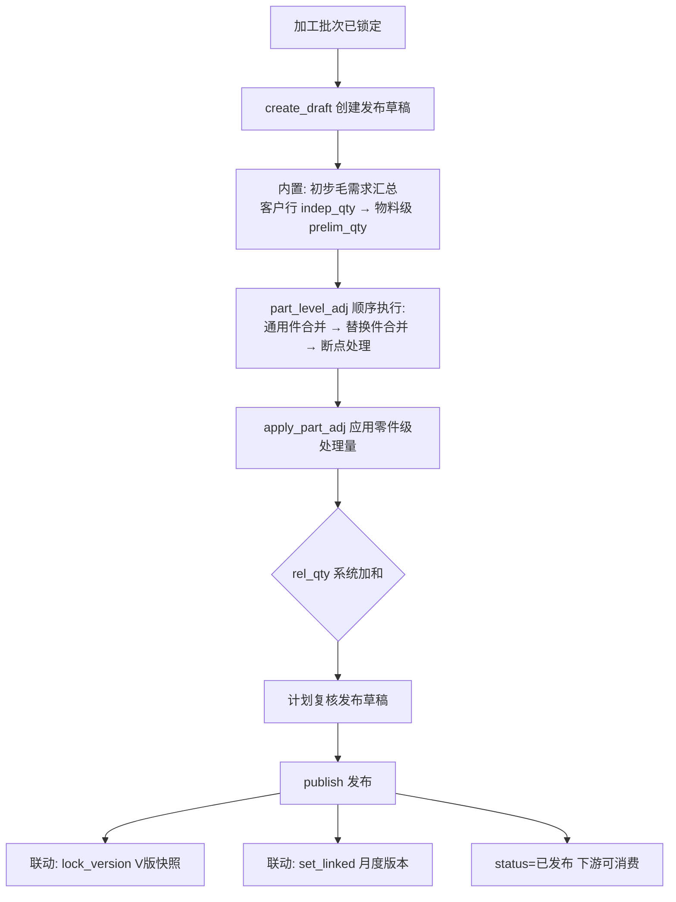

# 毛需求发布 · 应用详设

> 应用名：`demand_release` | 聚合根类名：`DemandRelease`
> 数据来源类型：**手工参考创建**（基于已锁定加工批次，由计划手工决定何时创建发布草稿）
> 产出技能：fde-aggregate-application-design（第②步）

---

## 1. 需求概览

### 1.1 基本信息
- **需求名称**: 毛需求发布管理
- **需求编号**: FC-DR-001
- **所属模块**: 销售预测-毛需求发布
- **需求来源**: 产品经理 / 业务方
- **创建日期**: 2026-08-12
- **优先级**: P0

### 1.2 需求背景
#### 1.2.1 为什么需要这个需求？

预测加工链的最终产出是已发布毛需求（物料 x 期间），它将作为净需求运算的**唯一输入**。当前缺乏一个结构化的发布机制，无法保证口径冻结、版本追溯、差异可视。未发布口径可能被下游误用，导致计划与执行脱节。

#### 1.2.2 期望达到什么目标？

建立毛需求发布的正式流程：从已锁定加工批次创建发布草稿 -> 内置初步毛需求汇总 -> 应用零件级处理量 -> 发布冻结。保证已发布毛需求是可追溯、可审计、不可篡改的下游唯一输入。

### 1.3 需求范围
#### 1.3.1 包含哪些功能？

从已锁定加工批次创建发布草稿（内置初步毛需求汇总）、应用零件级处理量（delta 写入发布行）、发布（状态 -> 已发布 + 联动锁定快照）、月中附加一次性调整、发布单与明细查询、R_n vs R_n-1 差异视图

#### 1.3.2 不包含哪些功能？

- 净需求运算（库存策略、生产排程、调拨执行）——由协调层负责
- 初步毛需求表的独立维护——本聚合内置计算，不开放独立编辑
- 客户行级别的独立需求管理——由 forecast_processing 负责
- 零件级处理 delta 的计算——由 part_level_adj 负责

### 1.4 涉及角色

- **总部计划**：创建发布草稿、应用零件级处理量、发布决策、差异复核；唯一操作角色
- **一线销售**：发布数据只读（了解最终毛需求）

---

## 2. 用户故事

### 2.1 核心用户故事

#### 2.1.1 `US-01` 用户故事 -- 从锁定加工批次创建发布草稿（优先级：P1）

- **故事描述**: 作为总部计划，我想要从已锁定的加工批次创建毛需求发布草稿，以便于系统自动汇总客户行独立需求为物料级初步毛需求，作为发布的起点。
- **为何赋予此优先级**：发布草稿是整个发布流程的起点，承载加工链的最终产出。无草稿则无法发布。
- **独立测试**：可通过指定已锁定加工批次创建草稿，验证初步毛需求是否正确汇总。
- **前置条件**: 加工批次已锁定（status="已锁定"）；同月版本尚未发布过（同一 fcst_version 只能有一个发布单）。
- **后置条件**: 发布草稿生成，status="草稿"，明细行包含 prelim_qty（物料级汇总）。

**验收场景**：

1. `US-01-AC1` **正常创建发布草稿**：
   - **Given** PRC-202608-001 已锁定（30 条独立需求行，涉及 15 种物料），**When** 系统执行 `create_draft("PRC-202608-001")`，**Then** 生成 REL-202608-001，status="草稿"，明细行 15 条（按物料 x 期间去重汇总），每条 prelim_qty = 该物料同期间各客户 indep_qty 之和。

2. `US-01-AC2` **加工批次未锁定拒绝**：
   - **Given** PRC-202608-001 status="进行中"，**When** 尝试 create_draft，**Then** 系统拒绝并提示"加工批次未锁定，无法创建发布"。

3. `US-01-AC3` **专用件仅一个来源行**：
   - **Given** 8210001 仅被一个客户使用，indep_qty=1150，**When** create_draft 汇总，**Then** 该物料行 prelim_qty=1150（直接引用，无需合并）。

4. `US-01-AC4` **当期行仅含一次性调整**：
   - **Given** 加工批次有当期一次性行（period=2026-08，base_qty=null, onetime_adj=+60），**When** create_draft 汇总，**Then** 当期行 prelim_qty=60（仅一次性调整量），N+1~N+3 行的 prelim_qty 不含当期量。

---

#### 2.1.2 `US-02` 用户故事 -- 应用零件级处理量（优先级：P1）

- **故事描述**: 作为总部计划，我想要将零件级处理（通用件合并/替换件合并/断点处理）的汇总 delta 应用到发布草稿行上，以便于 rel_qty = prelim_qty + 零件级处理量，得到最终发布量。
- **为何赋予此优先级**：零件级处理量是最终毛需求的重要组成部分，不应用则发布量不完整。
- **独立测试**：可通过应用已知 delta，验证 rel_qty 是否正确计算。
- **前置条件**: 发布草稿已创建；零件级处理已执行且 summarize 已就绪。
- **后置条件**: 明细行的 part_adj 字段更新，rel_qty 自动重算。

**验收场景**：

1. `US-02-AC1` **正常应用零件级处理量**：
   - **Given** REL-202608-001 草稿，STD-M6/2026-09 的 prelim_qty=29600，零件级处理汇总 delta=-1600，**When** 执行 `apply_part_adj(rel_no, "STD-M6", "2026-09", -1600, "通用件合并", "口头加码按历史系数0.65折减")`，**Then** part_adj=[{功能:"通用件合并", 原因:"口头加码按历史系数0.65折减", 量:-1600}]，rel_qty=28000。

2. `US-02-AC2` **多项零件级处理叠加**：
   - **Given** 某物料同时有通用件折减（-500）和替换件扣减（-200），**When** 依次应用，**Then** part_adj 数组包含两条记录，rel_qty = prelim_qty + (-500) + (-200)。

3. `US-02-AC3` **rel_qty 强制加和、禁止手工改**：
   - **Given** rel_qty 系统计算 = 28000，**When** 尝试手工改为 28500，**Then** 系统拒绝并提示"rel_qty 系统强制加和，禁止手工修改"。

---

#### 2.1.3 `US-03` 用户故事 -- 发布毛需求（优先级：P1）

- **故事描述**: 作为总部计划，我想要在确认发布草稿无误后正式发布毛需求，以便于冻结该版本口径，并联动锁定快照 V 版和加工批次，使下游（净需求运算）可以消费。
- **为何赋予此优先级**：发布是加工链的终点，是净需求运算的唯一输入。未发布则下游无法工作。
- **独立测试**：可通过执行 publish，验证状态变更和联动锁定。
- **前置条件**: 发布草稿 status="草稿"，零件级处理量已全部应用。
- **后置条件**: status="已发布"，联动锁定 V 版快照，更新 md_fcst_version 关联。

**验收场景**：

1. `US-03-AC1` **正常发布**：
   - **Given** REL-202608-001 status="草稿"，所有零件级处理量已应用，**When** 计划执行 `publish("REL-202608-001")`，**Then** status="已发布"，published_at=系统时间，publisher=当前用户。联动：`forecast_snapshot.lock_version("V202608")` 锁定快照，`md_fcst_version.set_linked("V202608", "REL-202608-001")`。

2. `US-03-AC2` **发布后不可修改**：
   - **Given** REL-202608-001 已发布，**When** 尝试修改明细行、重新应用零件级处理、或再次 publish，**Then** 全部拒绝。

3. `US-03-AC3` **未发布口径不得外流**：
   - **Given** REL-202608-002 status="草稿"，**When** 下游净需求运算尝试读取，**Then** 系统不返回该草稿数据（仅返回 status="已发布"的版本）。

---

#### 2.1.4 `US-04` 用户故事 -- R_n vs R_n-1 差异视图（优先级：P2）

- **故事描述**: 作为总部计划，我想要查看当前发布版本与上一版本的差异对比，以便于识别重大变化并补充说明。
- **为何赋予此优先级**：差异视图是复盘和管理决策的支撑工具。
- **独立测试**：通过对比两个发布版本，验证差异数据。
- **前置条件**: 至少存在两个已发布版本。
- **后置条件**: 无变化。

**验收场景**：

1. `US-04-AC1` **正常差异对比**：
   - **Given** R202608 和 R202607 均已发布，**When** 调用 `get_diff("REL-202608-001")`，**Then** 返回按物料 x 期间并排展示的发布量及差异（差值、变化率），重大变化（如 >20%）标红提示。

2. `US-04-AC2` **无上一版本时降级**：
   - **Given** R202608 为首个版本（prev_rel_no=null），**When** 调用 get_diff，**Then** 返回提示"无上一版本，无法对比"。

---

#### 2.1.5 `US-05` 用户故事 -- 月中附加一次性调整（优先级：P2）

- **故事描述**: 作为总部计划，我想要在发布后月中附加一次性调整（如突发促销、客户追加），以便于在不冻结既有发布行的前提下补充登记当期一次性量。
- **为何赋予此优先级**：一次性事件不等人，需随时登记。N+1~N+3 已冻结，但一次性行可附加。
- **独立测试**：通过在已发布版本下添加一次性行。
- **前置条件**: 发布单存在（草稿或已发布均可）。
- **后置条件**: 新增明细行（仅含 onetime_items 和 rel_qty）。

**验收场景**：

1. `US-05-AC1` **月中附加一次性行**：
   - **Given** REL-202608-001 已发布，**When** 计划执行 `add_onetime_item("REL-202608-001", "8210001", "2026-08", +30, "紧急促销追加")`，**Then** 新增明细行，onetime_items=[{原因:"紧急促销追加", 量:+30}]，rel_qty=30，prelim_qty=null。

---

#### 2.1.6 `US-06` 用户故事 -- 发布单与明细查询（优先级：P3）

- **故事描述**: 作为总部计划/一线销售，我想要查询发布单列表和明细行，查看已发布的毛需求数据。
- **为何赋予此优先级**：查询是日常操作支撑。
- **独立测试**：通过筛选条件查询。
- **前置条件**: 发布数据已存在。
- **后置条件**: 无变化。

**验收场景**：

1. `US-06-AC1` **按版本+状态查询发布单**：
   - **Given** 存在多个发布版本，**When** 查询 `list(fcst_version="V202608", status="已发布")`，**Then** 返回发布单列表。

2. `US-06-AC2` **按物料查询明细**：
   - **Given** 多个发布版本均含 8210001，**When** 查询 `list(part_no="8210001")`，**Then** 返回所有含该物料的明细行。

---

## 3. 业务场景

### 3.1 业务流程描述

#### 3.1.1 场景1: 完整发布流程



1. 加工批次（forecast_processing）锁定后，系统自动触发或计划手动触发 `create_draft(prc_batch)`
2. 系统内置执行初步毛需求汇总：同物料 x 期间各客户行 indep_qty 之和 -> prelim_qty
3. 计划执行零件级处理（通用件合并 -> 替换件合并 -> 断点处理）
4. 系统通过 `apply_part_adj()` 将 delta 应用到对应物料行
5. rel_qty = prelim_qty + 零件级处理量（系统强制加和）
6. 计划复核无误后执行 `publish()`
7. 发布联动：锁定 V 版快照、更新月度版本关联、状态变更为已发布
8. 下游净需求运算可消费已发布毛需求

#### 3.1.2 场景2: 版本替代与新版本发布

1. 当月 R 版（R202608）已发布
2. 下月加工完成后创建新发布草稿 REL-202609-001
3. 发布 REL-202609-001 时：
   - REL-202609-001 status="已发布"
   - REL-202608-001 status 自动变更为"已替代"
4. 下游始终消费最新 status="已发布"的版本

### 3.2 业务规则

#### 3.2.1 `BR-01` 发布单头-明细同事务落库
- **规则描述**: 发布单头与其全部明细行必须在同一事务中创建、更新。明细行是单头的值对象，随发布单生死。
- **适用场景**: create_draft、publish。
- **示例**: 创建发布草稿时，单头 + 15 行明细同事务写入；任意一行写入失败则全部回滚。

#### 3.2.2 `BR-02` rel_qty 系统强制加和
- **规则描述**: rel_qty = prelim_qty + Σ part_adj 各调整量。系统强制计算，禁止手工改总量。
- **适用场景**: apply_part_adj 时。
- **示例**: prelim=29600, part_adj=[{量:-1600}] -> rel_qty=28000。手工改为 28500 被拒绝。

#### 3.2.3 `BR-03` 三个预测行发布后冻结、一次性调整可月中附加
- **规则描述**: N+1/N+2/N+3 三个预测行的 rel_qty 发布后不可修改。但一次性调整可随时附加登记（新增行，不改既有行）。
- **适用场景**: publish 后。
- **示例**: 发布后 2026-09 行 rel_qty=28000 不可改；月中新增加 onetime_item 行 period=2026-08（当期），rel_qty=+30。

#### 3.2.4 `BR-04` 未发布口径不得外流
- **规则描述**: status != "已发布"的发布单，其明细数据不得被下游（净需求运算）消费。查询接口需根据 status 过滤。
- **适用场景**: 下游消费毛需求数据时。
- **示例**: 净需求运算模块查询毛需求时，只返回 status="已发布"的发布行。

#### 3.2.5 `BR-05` 发布联动锁定
- **规则描述**: publish 时须联动执行：① `forecast_snapshot.lock_version(fcst_version)` 锁定 V 版快照；② `md_fcst_version.set_linked(fcst_version, rel_no)` 更新版本关联。
- **适用场景**: publish 时系统自动执行。
- **示例**: 发布 REL-202608-001 后，V202608 快照锁定、md_fcst_version 记录的 linked_batch 更新。

#### 3.2.6 `BR-06` 初步毛需求汇总 = 同物料 x 期间各客户 indep_qty 之和
- **规则描述**: 初步毛需求表从加工明细行汇总而来：同一 part_no + period 下，不同客户行的 indep_qty 直接相加。专用件仅一个来源行，初步值 = 该行 indep_qty。
- **适用场景**: create_draft 时内置计算。
- **示例**: 8210001 只有客户 A 的 indep_qty=1150 -> prelim_qty=1150；STD-M6 有客户 A(15000) + B(14600) -> prelim=29600。

#### 3.2.7 `BR-07` 同一 fcst_version 只有一个发布单
- **规则描述**: 同一月度版本（fcst_version）只能创建一个发布单（REL-YYYYMM-NNN）。存在草稿或已发布时不可重复创建。
- **适用场景**: create_draft 时校验。

#### 3.2.8 `BR-08` R_n vs R_n-1 差异自动生成
- **规则描述**: 发布时系统自动关联上一版本（prev_rel_no），支持通过 get_diff() 生成差异视图。重大变化（如 >20%）须标出提示。
- **适用场景**: publish 时和 get_diff 时。

#### 3.2.9 `BR-09` lineage 链路线索可钻取
- **规则描述**: 每条明细行须记录 lineage（JSON），包含加工批次号、零件级处理依据号、预测版本号，支持下游追溯钻取到原始加工数据。
- **适用场景**: create_draft 和 apply_part_adj 时自动填充。

#### 3.2.10 `BR-10` 当期列仅含一次性调整量
- **规则描述**: 当前月的发布行仅含一次性调整量（prelim_qty=null, rel_qty=onetime_adj）。当期基础需求由未发订单承接，与预测互斥。
- **适用场景**: create_draft 和 add_onetime_item 时。

### 3.3 业务数据

#### 3.3.1 数据1: 初步毛需求 (prelim_qty)
- **数据描述**: 同物料 x 期间各客户独立需求之和。系统在 create_draft 时自动汇总。
- **数据类型**: 数字
- **数据来源**: 加工表明细行 indep_qty 汇总
- **示例值**: 29600

#### 3.3.2 数据2: 发布量 (rel_qty)
- **数据描述**: 最终发布毛需求 = prelim_qty + 零件级处理量之总和。系统强制加和。
- **数据类型**: 数字
- **数据来源**: 系统自动计算
- **示例值**: 28000

#### 3.3.3 数据3: 零件级处理量 (part_adj)
- **数据描述**: 零件级处理（通用/替换/断点）的各调整量明细。
- **数据类型**: JSON 数组 [{功能, 原因, 量}]
- **数据来源**: part_level_adj.apply_part_adj() 写入
- **示例值**: [{"功能":"通用件合并","原因":"口头加码按历史系数0.65折减","量":-1600}]

#### 3.3.4 数据4: 链路线索 (lineage)
- **数据描述**: 追溯链路的 JSON，包含加工批次、零件级处理依据、预测版本。
- **数据类型**: JSON
- **数据来源**: 系统自动填充
- **示例值**: {"prc_batch":"PRC-202608-001","part_adjs":["PAD-202608-001"],"fcst_version":"V202608"}

### 3.4 状态机

```
(新建) --create_draft--> 草稿 --publish--> 已发布 --新版本发布--> 已替代
```

| 当前状态 | 目标状态 | 触发动作 | 前置条件 |
|----------|----------|----------|----------|
| (新建) | 草稿 | create_draft | 加工批次已锁定，同一 fcst_version 无已有发布单 |
| 草稿 | 已发布 | publish | 零件级处理量已全部应用 |
| 已发布 | 已替代 | 新版本 publish | 新版本同 fcst_version 的下一月版本发布 |

---

## 4. 功能描述

### 4.1 功能清单

| 一级菜单/模块 | 一级模块编号 | 二级菜单/模块 | 二级模块编号 | 三级功能 | 三级功能编号 | 功能类型 | 优先级 | 三级功能简述 |
|---|---|---|---|---|---|---|---|---|
| 毛需求发布 | F05 | 发布管理 | F05-01 | 创建发布草稿 | FUNC-01 | 接口/表单页 | P1 | 从已锁定加工批次创建草稿，内置初步毛需求汇总 |
| 毛需求发布 | F05 | 发布管理 | F05-01 | 应用零件级处理量 | FUNC-02 | 接口 | P1 | 将零件级处理 delta 写入发布明细行 |
| 毛需求发布 | F05 | 发布管理 | F05-01 | 发布 | FUNC-03 | 表单页 | P1 | 发布冻结毛需求，联动锁定快照与版本 |
| 毛需求发布 | F05 | 发布管理 | F05-01 | 月中附加一次性调整 | FUNC-04 | 表单页 | P2 | 发布后月中附加当期一次性调整 |
| 毛需求发布 | F05 | 发布查询 | F05-02 | 发布单列表 | FUNC-05 | 列表页 | P3 | 按版本/物料/状态查询发布单 |
| 毛需求发布 | F05 | 发布查询 | F05-02 | 发布单详情 | FUNC-06 | 详情页 | P3 | 查看单头+全部明细 |
| 毛需求发布 | F05 | 差异分析 | F05-03 | 版本差异视图 | FUNC-07 | 报表 | P2 | R_n vs R_n-1 差异对比 |

### 4.2 功能模块结构图

```
毛需求发布 (F05)
├── 发布管理 (F05-01)
│   ├── FUNC-01 创建发布草稿 (接口/表单页, P1)
│   ├── FUNC-02 应用零件级处理量 (接口, P1)
│   ├── FUNC-03 发布 (表单页, P1)
│   └── FUNC-04 月中附加一次性调整 (表单页, P2)
├── 发布查询 (F05-02)
│   ├── FUNC-05 发布单列表 (列表页, P3)
│   └── FUNC-06 发布单详情 (详情页, P3)
└── 差异分析 (F05-03)
    └── FUNC-07 版本差异视图 (报表, P2)
```

### 4.3 功能详细说明

#### 4.3.1 F05-01 发布管理

##### FUNC-01 创建发布草稿

**功能描述**:
从已锁定加工批次创建毛需求发布草稿。系统内置执行初步毛需求汇总（同物料 x 期间各客户行 indep_qty 之和），生成物料级明细行。当期行仅含一次性调整量。

**用户操作流程**:
1. 加工批次锁定后，系统自动触发或计划手动点击"创建发布草稿"
2. 系统从 `forecast_processing.get(prc_batch)` 取已锁定加工明细
3. 系统按 (part_no, period) 汇总 indep_qty（客户维度 -> 物料维度），生成 prelim_qty
4. 生成发布单号 REL-YYYYMM-NNN，status="草稿"
5. 明细行自动填充 lineage（加工批次号 + fcst_version）

**业务规则**:
- 加工批次必须已锁定
- 同 fcst_version 不能有多个发布单（草稿或已发布）
- 专用件 prelim_qty = 该客户 indep_qty
- 初步毛需求表是本聚合的内置计算步骤，不独立暴露

**特殊处理**:
- 跨应用调用：`forecast_processing.get(prc_batch)` 取已锁定加工明细（汇总用）

**业务实体**:
- **发布单头 (DemandRelease)**: 毛需求发布的主记录
- **发布明细行 (DemandReleaseLine)**: 物料 x 期间的毛需求行

**发布单头字段**

| 字段名称 | 字段类型 | 是否必填 | 默认值 | 业务逻辑 |
|---|---|---|---|---|
| rel_no | 文本 | 是 | - | REL-YYYYMM-NNN，系统自动生成 |
| fcst_version | 文本 | 是 | - | R+YYYYMM(.x)，发布版本号 |
| base_period | 文本 | 是 | - | 锚定期间，取自 md_fcst_version |
| prev_rel_no | 文本 | 否 | - | 上一版本发布单号，publish 时自动关联 |
| publisher | 文本 | 是 | 当前用户 | 发布人（总部计划），publish 时记录 |
| published_at | 时间 | 是 | publish 时 | 发布日期，publish 时系统盖章 |
| status | 枚举 | 是 | 草稿 | 草稿 / 已发布 / 已替代 |

**发布明细行字段**

| 字段名称 | 字段类型 | 是否必填 | 默认值 | 业务逻辑 |
|---|---|---|---|---|
| rel_no | 文本 | 是 | - | 关联发布单头 |
| line_no | 整数 | 是 | - | 行号，系统自动递增 |
| part_no | 文本 | 是 | - | 物料号；来源：`md_material.list` 下拉选择 |
| period | 文本 | 是 | - | 期间 YYYY-MM |
| prelim_qty | 数字 | 是（非当期行）/ 否（当期行） | - | 初步毛需求（物料级汇总），create_draft 时计算 |
| part_adj | 文本(JSON) | 否 | [] | 零件级处理量 [{功能, 原因, 量}]，apply_part_adj 时写入 |
| onetime_items | 文本(JSON) | 否 | [] | 一次性调整明细 [原因列示]，已含在 prelim 内；月中附加行时独立记录 |
| rel_qty | 数字 | 是 | 系统计算 | = prelim_qty + Σ part_adj 量，系统强制加和 |
| basis | 文本 | 是 | - | 主要依据（基线来源 + 调整要点 + 核对结论） |
| lineage | 文本(JSON) | 是 | - | 链路线索 {prc_batch, part_adjs, fcst_version}，可钻取 |

##### FUNC-02 应用零件级处理量

**功能描述**:
将 `part_level_adj.summarize()` 的汇总结果逐条应用到发布草稿的对应明细行。更新 part_adj 字段，自动重算 rel_qty。

**用户操作流程**:
1. 零件级处理执行完毕后，系统/计划调用 `apply_part_adj()`
2. 系统将 delta 写入对应物料 x 期间行的 part_adj 字段
3. rel_qty 自动重算 = prelim_qty + 新 delta

**业务规则**:
- rel_qty 系统强制加和，禁止手工修改
- 多次 apply 时 part_adj 数组累加

**特殊处理**:
- 由 `part_level_adj.summarize()` 的结果驱动，不在本聚合内计算 delta

##### FUNC-03 发布

**功能描述**:
计划确认发布草稿无误后正式发布。状态变更为"已发布"，联动锁定 V 版快照、更新月度版本关联。发布后 N+1~N+3 行冻结不可修改。

**用户操作流程**:
1. 计划复核发布草稿中各物料行的 rel_qty
2. 确认无误后点击"发布"
3. 系统执行 publish：
   - status="已发布"，published_at/publisher 记录
   - `forecast_snapshot.lock_version(fcst_version)` 锁定 V 版
   - `md_fcst_version.set_linked(fcst_version, rel_no)` 更新关联
   - 如有上一版本，prev_rel_no 关联

**业务规则**:
- 零件级处理量应已全部应用（建议校验，但 V1 不做强制门禁）
- 发布不可逆
- 发布后 N+1~N+3 行冻结
- 同一 fcst_version 不可重复发布
- 新版本发布时，旧版本 status="已替代"

**特殊处理**:
- 跨应用调用：`forecast_snapshot.lock_version(fcst_version)` 联动锁定快照
- 跨应用调用：`md_fcst_version.set_linked(fcst_version, rel_no)` 更新版本关联

##### FUNC-04 月中附加一次性调整

**功能描述**:
发布后（或草稿阶段），月中附加当期一次性调整行。仅含 onetime_items 和 rel_qty，prelim_qty 为空。

**用户操作流程**:
1. 计划在发布单详情页点击"附加一次性调整"
2. 选择物料、填写调整量和原因
3. period 自动设为当前月
4. 保存，新增明细行

**业务规则**:
- 当期行 prelim_qty=null（当期基础需求由未发订单承接）
- rel_qty = onetime_adj
- 可应用于草稿或已发布状态

---

#### 4.3.2 F05-02 发布查询

##### FUNC-05 发布单列表

按 fcst_version、part_no、period、status 筛选查询发布单，支持分页。

##### FUNC-06 发布单详情

查看单头 + 全部明细行，含 lineage 钻取链接（可跳转到加工批次和零件级处理记录）。

---

#### 4.3.3 F05-03 差异分析

##### FUNC-07 版本差异视图

对比当前版本与上一版本（prev_rel_no），按物料 x 期间并排展示两版本的 rel_qty 及差异（差值、变化率）。重大变化（>20%）标红。

**输出数据**:
[{part_no, period, prev_rel_qty, curr_rel_qty, diff, diff_pct, is_significant}]

---

## 5. 权限要求

### 5.1 功能权限

| 功能名称 | 权限标识 | 总部计划 | 一线销售 |
|---|---|---|---|
| 创建发布草稿 | `forecast:release:create-draft` | 可访问 | 不可访问 |
| 应用零件级处理量 | `forecast:release:apply-part-adj` | 可访问 | 不可访问 |
| 发布 | `forecast:release:publish` | 可访问 | 不可访问 |
| 月中附加一次性调整 | `forecast:release:add-onetime` | 可访问 | 不可访问 |
| 发布单列表/详情 | `forecast:release:query` | 可访问 | 可访问 |
| 版本差异视图 | `forecast:release:diff` | 可访问 | 可访问 |

### 5.2 数据权限

#### 5.2.1 总部计划
- 可以查看和操作全部发布单（创建、应用、发布、差异分析）
- 发布数据可被下游净需求运算消费

#### 5.2.2 一线销售
- 可以查看已发布的毛需求数据（只读）
- 不可创建、修改、发布
- 不可查看草稿状态的发布单（未发布口径不外流）

---

## 6. 验收标准

### 6.1 功能验收标准

#### 6.1.1 标准1: 初步毛需求汇总正确
- **关联用户故事**: US-01
- **关联业务规则**: BR-06, BR-10
- **验证方式**: 用已锁定加工批次创建发布草稿
- **测试数据**: 加工批次有 30 行（15 种物料），含 STD-M6 两客户 indep_qty=15000 和 14600
- **预期结果**: 发布草稿 15 行明细，STD-M6 的 prelim_qty=29600（=15000+14600），8210001 prelim_qty=1150（专用件）。

#### 6.1.2 标准2: rel_qty 强制加和
- **关联用户故事**: US-02
- **关联业务规则**: BR-02
- **验证方式**: 应用零件级处理 delta=-1600 后验证 rel_qty，再尝试手工修改
- **预期结果**: rel_qty=29600+(-1600)=28000；手工改为 28500 被拒绝。

#### 6.1.3 标准3: 发布联动锁定
- **关联用户故事**: US-03
- **关联业务规则**: BR-03, BR-04, BR-05
- **验证方式**: 发布后验证联动效果
- **预期结果**: status="已发布"；V 版快照已锁定；md_fcst_version 关联已更新；downstream 可读取 rel_qty。

#### 6.1.4 标准4: 版本差异视图
- **关联用户故事**: US-04
- **关联业务规则**: BR-08
- **验证方式**: 对两个连续版本调用 get_diff
- **预期结果**: 返回并排对比数据，重大变化（>20%）标出。

### 6.2 非功能验收标准
- **性能要求**: create_draft 汇总 500 行加工数据应在 3 秒内完成
- **安全性要求**: rel_qty 不可手工篡改；未发布口径不得被下游消费
- **兼容性要求**: 支持 Chrome、Edge 浏览器

### 6.3 已知问题或限制
- 初步毛需求表是内置计算步骤，不独立为聚合——不暴露独立的增删改查
- 同一 fcst_version 仅一个发布单是目前 V1 的设计，后续如需支持多版本草稿需调整
- 零件级处理量全部应用的强制性校验 V1 不做强制门禁（依赖计划规范操作）
- 发布后的"已替代"状态由新版本发布自动触发，不提供手动替代操作

---

## 7. 参考资料

### 7.1 相关文档
- `app/forecast/architecture.md` -- 聚合根清单与聚合根卡（第①步产物）
- `app/forecast/brd/销售预测详设.md` -- §5 毛需求发布、§8.4 初步毛需求表、§8.6 毛需求发布单详设

### 7.2 相关功能
- **预测加工 (forecast_processing)**: create_draft 时取已锁定加工明细（汇总用）
- **零件级处理 (part_level_adj)**: 提供物料 x 期间汇总 delta，apply_part_adj 消费
- **预测快照 (forecast_snapshot)**: publish 时联动锁定快照
- **月度版本 (md_fcst_version)**: publish 时更新关联批次

### 7.3 外部依赖
- **md_material (物料主数据)**: 物料存在性校验
- **md_fcst_version (月度版本)**: 取锚定期间、publish 时 set_linked 更新关联
- **forecast_snapshot (预测快照)**: publish 时 lock_version 联动锁定
- **forecast_processing (预测加工)**: create_draft 时取加工明细

### 7.4 备注
- 数据来源类型为"手工参考创建"：发布草稿基于已锁定加工批次，由计划手工决定何时创建；前端保留创建入口，但须展示上游加工批次摘要（状态/行数/锁定时间等）
- 已发布毛需求是净需求运算的**唯一输入**，这是整个销售预测域的最终交付物
- 当期列仅含一次性调整量——这是《产销协同简化详设》§3 的核心约定：预测与执行层互斥
- 考核/复盘只引用版本快照（V/R），不引用当前值（保证数据一致性）
