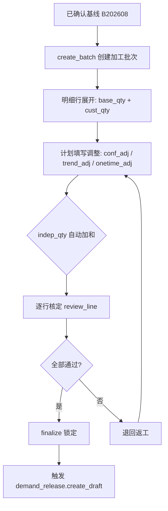

# 预测加工 · 应用详设

> 应用名：`forecast_processing` | 聚合根类名：`FcstProcessing`
> 数据来源类型：**手工参考创建**（基于已确认基线批次 + 同月 V 版快照，由计划手工决定何时创建加工批次）
> 产出技能：fde-aggregate-application-design（第②步）

---

## 1. 需求概览

### 1.1 基本信息
- **需求名称**: 预测加工管理
- **需求编号**: FC-FP-001
- **所属模块**: 销售预测-预测加工
- **需求来源**: 产品经理 / 业务方
- **创建日期**: 2026-08-12
- **优先级**: P0

### 1.2 需求背景
#### 1.2.1 为什么需要这个需求？

基线和客户预测之间存在差距，需要一个系统化的"加工总账"来承载从基线到独立需求的各种调整（置信度调整、趋势调整、一次性调整），作为计划与销售的制衡载体，保证调整过程可追溯、可审计。

#### 1.2.2 期望达到什么目标？

建立基线 -> 各调整 -> 独立需求的加工总账，独立需求系统强制加和，各方调整有据可查。计划与销售在加工表上完成制衡，争议不大时当场解决，无法达成共识时升级月度产销平衡会。

### 1.3 需求范围
#### 1.3.1 包含哪些功能？

创建加工批次（从基线行集自动展开明细）、填写各层调整（置信度/趋势/一次性）、核定/退回单行、全部核定后锁定批次、月中附加一次性行、加工批次与明细查询

#### 1.3.2 不包含哪些功能？

- 零件级合并（通用/替换/断点）——独立运行于 `part_level_adj`，不进本表
- 初步毛需求汇总——由 `demand_release.create_draft()` 内置计算，不在此处
- 客户预测值的直接管理（由 forecast_snapshot 负责）
- 达成率/置信系数的计算（由 attainment 负责，加工表只消费结果）

### 1.4 涉及角色

- **总部计划**：加工批次创建、置信度/趋势/一次性调整确认、核对结论（通过/退回）、锁定批次
- **一线销售**：提供调整意见（口头加码/减码、事件线索），但不直接操作加工表；争议时由计划执行调整

---

## 2. 用户故事

### 2.1 核心用户故事

#### 2.1.1 `US-01` 用户故事 -- 创建加工批次并自动展开明细（优先级：P1）

- **故事描述**: 作为总部计划，我想要基于已确认基线批次创建加工批次，以便于系统自动从基线行集展开明细行（含基线值和客户预测值），启动本月的预测加工流程。
- **为何赋予此优先级**：加工批次是加工链的容器，没有批次就无法进行任何调整。是加工流程的起点。
- **独立测试**：可通过指定已确认的基线批次和 V 版创建加工批次，验证明细行是否正确展开。
- **前置条件**: 基线批次已确认（status="已确认"）；同月 V 版快照已存在。
- **后置条件**: 加工批次 prc_batch 生成，status="进行中"，明细行包含 base_qty 和 cust_qty。

**验收场景**：

1. `US-01-AC1` **正常创建加工批次**：
   - **Given** B202608 已确认（30 行基线），V202608 快照已就绪，**When** 计划执行 `create_batch("B202608", "V202608")`，**Then** 生成 PRC-202608-001，status="进行中"，明细 30 行，每行 base_qty 取自基线、cust_qty 取自快照 orig_qty。

2. `US-01-AC2` **基线未确认时拒绝**：
   - **Given** B202608 基线有部分行 status="预计算"，**When** 尝试 create_batch，**Then** 系统拒绝并提示"基线批次未全部确认，请先确认基线"。

3. `US-01-AC3` **客户未提供预测时 cust_qty 为空**：
   - **Given** 快照某行 data_flag="OEM 未提供"，**When** create_batch 时，**Then** 该行 cust_qty 为空，后续置信度调整步骤自动跳过。

---

#### 2.1.2 `US-02` 用户故事 -- 填写调整值（优先级：P1）

- **故事描述**: 作为总部计划，我想要在加工明细行上填写置信度调整、趋势调整、一次性调整，以便于将各方修正意见系统化记录，产出独立需求值。
- **为何赋予此优先级**：调整填写是加工表的核心功能，直接影响最终独立需求和毛需求发布。
- **独立测试**：可通过填写各调整字段，验证 indep_qty 是否正确加和、超阈时是否要求理由。
- **前置条件**: 加工批次已创建，status="进行中"。
- **后置条件**: 调整值已记录，indep_qty 自动重算。

**验收场景**：

1. `US-02-AC1` **置信度调整自动带出**：
   - **Given** 客户 OEM-A 2026-09 的 conf_factor=0.975，**When** 计划打开该行调整，**Then** 系统自动带入 conf_adj（= base_qty * (conf_factor - 1) 或类似计算），可人工覆写但须理由。

2. `US-02-AC2` **趋势调整超阈须理由**：
   - **Given** P3 阈值 θ_exo=10%，**When** 计划填写 trend_adj 偏离超过基线 10% 且未提供 trend_reason，**Then** 系统拒绝保存并提示"趋势调整超过阈值，须填写调整理由"。

3. `US-02-AC3` **一次性调整标标签**：
   - **Given** 计划为 2026-09 期添加 onetime_adj=+180（客户促销），**When** 填写 onetime_tag="一次性" 和 onetime_reason="客户加库存"，**Then** 保存成功。>20% 期量时系统提示标"大一次性"。

4. `US-02-AC4` **独立需求强制加和**：
   - **Given** base_qty=960, conf_adj=+10, trend_adj=0, onetime_adj=+180，**When** 保存调整，**Then** indep_qty 自动 = 960+10+0+180 = 1150，禁止手工修改。

---

#### 2.1.3 `US-03` 用户故事 -- 核定/退回明细行（优先级：P1）

- **故事描述**: 作为总部计划，我想要逐行核定或退回明细行，以便于确保每行的调整合理、独立需求值可接受后进入锁定状态。
- **为何赋予此优先级**：核定是加工流程的质量门禁，全部行通过方可锁定。
- **独立测试**：可通过核定/退回行，验证状态和结论是否正确记录。
- **前置条件**: 加工明细行已填写调整。
- **后置条件**: chk_result="通过" 或 "退回"，退回时含 chk_comment。

**验收场景**：

1. `US-03-AC1` **核定通过**：
   - **Given** 行 8210001/2026-09 调整已填写，**When** 计划执行 `review_line(chk_result="通过")`，**Then** chk_result="通过"。

2. `US-03-AC2` **退回返工**：
   - **Given** 行 8210002/2026-09 置信度调整无理由，**When** 计划执行 `review_line(chk_result="退回", chk_comment="置信度调整理由不充分")`，**Then** chk_result="退回"，chk_comment 记录退回理由。该行可重新填写调整后再次核定。

3. `US-03-AC3` **2轮无共识升级**：
   - **Given** 某行退回 2 轮仍无共识，**When** 计划标记"升级月度会"，**Then** 系统记录升级标记，该行暂不移入"已核定"状态，待月度会后人工处理。

---

#### 2.1.4 `US-04` 用户故事 -- 锁定加工批次（优先级：P2）

- **故事描述**: 作为总部计划，我想要在全部行核定通过后锁定加工批次，以便于防止后续篡改，并触发初步毛需求汇总（喂给 demand_release）。
- **为何赋予此优先级**：锁定是加工流程的终点，全部行通过是前置条件。
- **独立测试**：可通过尝试在有退回行时锁定 → 拒绝；全部通过时锁定 → 成功。
- **前置条件**: 加工批次下所有行的 chk_result="通过"。
- **后置条件**: status="已锁定"，触发 demand_release.create_draft()。

**验收场景**：

1. `US-04-AC1` **全部通过锁定成功**：
   - **Given** PRC-202608-001 下 30 行全部 chk_result="通过"，**When** 计划执行 `finalize(prc_batch)`，**Then** status="已锁定"，触发 `demand_release.create_draft(prc_batch)`。

2. `US-04-AC2` **有退回行时锁定拒绝**：
   - **Given** 30 行中 1 行 chk_result="退回"，**When** 执行 finalize，**Then** 系统拒绝并提示"存在退回行（X 行），请先全部核定通过"。

---

#### 2.1.5 `US-05` 用户故事 -- 月中附加一次性行（优先级：P2）

- **故事描述**: 作为总部计划，我想要在加工批次锁定后（或进行中时）附加当期一次性调整行，以便于记录月中突发的一次性事件（如促销、断点、客户加库存），不受月度冻结限制。
- **为何赋予此优先级**：一次性事件不等人，需随时登记。当期基础行（N+1~N+3）已冻结，但一次性行可附加。
- **独立测试**：可通过在已锁定批次下添加当期一次性行，验证是否成功。
- **前置条件**: 加工批次已创建（进行中或已锁定均可）。
- **后置条件**: 新增明细行（仅含 onetime_adj，base_qty/cust_qty 为空）。

**验收场景**：

1. `US-05-AC1` **附加当期一次性行**：
   - **Given** PRC-202608-001 已锁定，**When** 计划执行 `add_onetime_line(..., onetime_adj=+60, onetime_reason="展会备料", onetime_tag="一次性")`，**Then** 新增明细行 period="2026-08"（当期），base_qty=null, cust_qty=null, onetime_adj=+60, indep_qty=60。

---

#### 2.1.6 `US-06` 用户故事 -- 加工批次与明细查询（优先级：P3）

- **故事描述**: 作为总部计划/一线销售，我想要查询加工批次列表和明细行，以便于了解加工进度和结果。
- **为何赋予此优先级**：查询是日常操作支撑。
- **独立测试**：通过筛选条件查询。
- **前置条件**: 加工数据已存在。
- **后置条件**: 无变化。

**验收场景**：

1. `US-06-AC1` **按版本+状态查批次**：
   - **Given** 存在多个加工批次，**When** 查询 `list_batches(fcst_version="V202608", status="进行中")`，**Then** 返回符合条件的批次。

2. `US-06-AC2` **按核定结果查明细**：
   - **Given** 批次下存在通过和退回行，**When** 查询 `list_lines(chk_result="退回")`，**Then** 仅返回退回行。

---

## 3. 业务场景

### 3.1 业务流程描述

#### 3.1.1 场景1: 月度加工完整流程



1. 总部计划确认基线后，创建加工批次 `create_batch(base_batch, fcst_version)`
2. 系统自动展开明细行：base_qty 取自基线、cust_qty 取自快照
3. 计划逐行或批量填写调整：
   - 置信度调整（conf_adj）：参考 attainment 的 conf_factor
   - 趋势调整（trend_adj）：参考外生变量交叉验证
   - 一次性调整（onetime_adj）：登记事件原因和标签
4. indep_qty 系统强制加和
5. 计划逐行核定：通过或退回
6. 全部行通过后锁定批次
7. 锁定触发 `demand_release.create_draft(prc_batch)`

#### 3.1.2 场景2: 计划与销售争议处理

1. 销售认为某行独立需求值不合理（如基线偏低、客户口头有增量）
2. 销售向计划提出调整意见
3. 计划在加工表中填写调整（如 onetime_adj=+X），登记原因（"销售反馈客户口头加量"）
4. 计划核定评估：证据充分则通过，不充分则退回
5. 2 轮无共识 → 升级月度产销平衡会

### 3.2 业务规则

#### 3.2.1 `BR-01` 加工批次单头-明细同事务落库
- **规则描述**: 加工批次单头与其全部明细行必须在同一事务中创建、更新、锁定。明细行是单头的值对象，随批次生死。
- **适用场景**: create_batch、finalize。
- **示例**: create_batch 时，单头 + 30 行明细同事务写入；任意一行写入失败则全部回滚。

#### 3.2.2 `BR-02` indep_qty 系统强制加和
- **规则描述**: indep_qty = base_qty + conf_adj + trend_adj + onetime_adj。系统强制计算，禁止手工改总量。
- **适用场景**: fill_line 保存时。
- **示例**: base=960, conf=+10, trend=0, onetime=+180 → indep=1150。不可手动改为 1100。

#### 3.2.3 `BR-03` 一次性调整只作用于归属期
- **规则描述**: 一次性调整（onetime_adj）只加在归属期行上，不自动顺延至后续各期。事件完成后需求回落是预期，不作新的负调整登记。
- **适用场景**: fill_line 填写 onetime_adj 时。
- **示例**: 2026-09 期添加 onetime_adj=+180（客户促销），2026-10 期不受影响（不会自动 +180）。

#### 3.2.4 `BR-04` 全部行核定通过方可锁定
- **规则描述**: finalize 的前置条件：批次下所有明细行 chk_result="通过"。存在任何退回行时拒绝锁定。
- **适用场景**: finalize 时。
- **示例**: 30 行中 29 行通过、1 行退回 → finalize 拒绝。

#### 3.2.5 `BR-05` 退回返工须附理由
- **规则描述**: chk_result="退回" 时 chk_comment 必填，说明哪个调整视角不通过及原因。
- **适用场景**: review_line(chk_result="退回") 时。
- **示例**: "置信度调整偏离系数过大且理由不充分"。

#### 3.2.6 `BR-06` 置信度自动带出、人工覆写须理由
- **规则描述**: 置信度调整（conf_adj）系统自动从 attainment 取 conf_factor 计算，填写时自动带出。人工覆写时必须填写 conf_reason。
- **适用场景**: fill_line 时。
- **示例**: 系统自动带出 conf_adj=+10（系数 0.975），计划改为 conf_adj=+30 时须填理由。

#### 3.2.7 `BR-07` 趋势调整超阈须理由
- **规则描述**: trend_adj 的绝对值超过 P3 阈值（默认基线 10%）时，trend_reason 必填。
- **适用场景**: fill_line 填写 trend_adj 时。
- **示例**: 基线 1000，trend_adj=-150（15% > 10%）→ 须填理由。

#### 3.2.8 `BR-08` 一次性调整重大性标记
- **规则描述**: onetime_adj 绝对值 > 20% 同期期量，或属于断点/大事件 → 标记 onetime_tag="大一次性"。供历史扣除与复盘使用。
- **适用场景**: fill_line 填写 onetime_adj 时。
- **示例**: 期量 960，onetime_adj=+200（20.8%）> 20% → 提示标"大一次性"。

#### 3.2.9 `BR-09` 已锁定批次不可逆
- **规则描述**: status="已锁定"后，不可再做任何调整、核定、退回操作。已锁定是终态。
- **适用场景**: finalize 后。

#### 3.2.10 `BR-10` 零件级合并不进本表
- **规则描述**: 通用件合并、替换件合并、断点处理的调整量独立运行于 `part_level_adj`，作用于初步毛需求表（而非加工表明细）。
- **适用场景**: 区分加工表调整（客户行粒度）与零件级处理（物料级粒度）。

### 3.3 业务数据

#### 3.3.1 数据1: 独立需求 (indep_qty)
- **数据描述**: 加工后的最终客户行需求值 = 基线 + 各调整量之和。系统强制加和。
- **数据类型**: 数字
- **数据来源**: 系统自动计算
- **示例值**: 1150

#### 3.3.2 数据2: 置信度调整 (conf_adj)
- **数据描述**: 基于客户历史达成率的调整量（delta）。达成率高直接采用（conf_factor≈1），一贯多报打折（<1），一贯少报补足（>1）。
- **数据类型**: 数字（带符号 delta）
- **数据来源**: 系统自动从 attainment 取 conf_factor 计算，可人工覆写
- **示例值**: +10

#### 3.3.3 数据3: 一次性调整 (onetime_adj)
- **数据描述**: 特定事件（促销、客户加库存、断点等）的一次性需求增量。只作用于归属期、不顺延。
- **数据类型**: 数字（带符号 delta）
- **数据来源**: 总部计划手动填写
- **示例值**: +180

#### 3.3.4 数据4: 核对结论 (chk_result)
- **数据描述**: 计划对该行调整结果的核定结论。
- **数据类型**: 枚举值（通过 / 退回）
- **数据来源**: 计划手动核定

### 3.4 状态机

```
(新建) --create_batch--> 进行中 --全部行核定--> 全部核定 --finalize--> 已锁定
 进行中 --review_line(退回)--> 进行中（退回返工）
 已锁定 --不可逆--> [终态]
```

| 当前状态 | 目标状态 | 触发动作 | 前置条件 |
|----------|----------|----------|----------|
| (新建) | 进行中 | create_batch | 基线批次已确认、V 版快照已就绪 |
| 进行中 | 进行中 | review_line(退回) | 退回返工，明细行重新填写调整 |
| 进行中 | 全部核定 | review_line(通过)全部行 | 所有明细行 chk_result="通过" |
| 全部核定 | 已锁定 | finalize | 全部行已核定通过 |
| 已锁定 | (终态) | 不可逆 | - |

---

## 4. 功能描述

### 4.1 功能清单

| 一级菜单/模块 | 一级模块编号 | 二级菜单/模块 | 二级模块编号 | 三级功能 | 三级功能编号 | 功能类型 | 优先级 | 三级功能简述 |
|---|---|---|---|---|---|---|---|---|
| 预测加工 | F03 | 批次管理 | F03-01 | 创建加工批次 | FUNC-01 | 表单页 | P1 | 基于已确认基线创建批次并自动展开明细 |
| 预测加工 | F03 | 调整填写 | F03-02 | 填写调整值 | FUNC-02 | 表单页 | P1 | 填写置信度/趋势/一次性调整 |
| 预测加工 | F03 | 核定管理 | F03-03 | 核定/退回行 | FUNC-03 | 表单页 | P1 | 逐行核定通过或退回返工 |
| 预测加工 | F03 | 批次管理 | F03-01 | 锁定批次 | FUNC-04 | 表单页 | P2 | 全部核定后锁定，触发下游 |
| 预测加工 | F03 | 调整填写 | F03-02 | 月中附加一次性行 | FUNC-05 | 表单页 | P2 | 月中附加当期一次性调整 |
| 预测加工 | F03 | 批次查询 | F03-04 | 批次列表 | FUNC-06 | 列表页 | P3 | 按版本/状态查询加工批次 |
| 预测加工 | F03 | 明细查询 | F03-05 | 明细列表 | FUNC-07 | 列表页 | P3 | 按批次/核定结果查询明细行 |
| 预测加工 | F03 | 明细查询 | F03-05 | 批次详情 | FUNC-08 | 详情页 | P3 | 查看单头+全部明细 |

### 4.2 功能模块结构图

```
预测加工 (F03)
├── 批次管理 (F03-01)
│   ├── FUNC-01 创建加工批次 (表单页, P1)
│   └── FUNC-04 锁定批次 (表单页, P2)
├── 调整填写 (F03-02)
│   ├── FUNC-02 填写调整值 (表单页, P1)
│   └── FUNC-05 月中附加一次性行 (表单页, P2)
├── 核定管理 (F03-03)
│   └── FUNC-03 核定/退回行 (表单页, P1)
├── 批次查询 (F03-04)
│   └── FUNC-06 批次列表 (列表页, P3)
└── 明细查询 (F03-05)
    ├── FUNC-07 明细列表 (列表页, P3)
    └── FUNC-08 批次详情 (详情页, P3)
```

### 4.3 功能详细说明

#### 4.3.1 F03-01 批次管理

##### FUNC-01 创建加工批次

**功能描述**:
总部计划选择已确认的基线批次和对应 V 版，创建加工批次。系统自动从基线行集展开明细行，同时带出客户预测值（来自快照表）。

**用户操作流程**:
1. 计划进入加工批次创建页面
2. 选择基线批次（下拉列表，仅显示 status="已确认"的批次）
3. 系统自动匹配对应的 V 版
4. 点击"创建批次"
5. 系统生成 PRC-YYYYMM-NNN，status="进行中"，明细行自动展开

**业务规则**:
- 基线批次必须全部确认
- 同一基线批次只能创建一个加工批次
- 单头与明细同事务创建
- cust_qty 取自快照 orig_qty，未提供即为空

**特殊处理**:
- 跨应用调用：`forecast_baseline.list(base_batch)` 取基线行集
- 跨应用调用：`forecast_snapshot.list(fcst_version)` 取客户预测值
- 批次号格式：PRC-YYYYMM-NNN（NNN 为当月自增序号）

**业务实体**:
- **加工批次单头 (FcstProcessing)**: 加工批次的容器，记录批次状态和负责人
- **加工明细行 (FcstProcessingLine)**: 单头下的值对象，一条基线行展开为一条明细行

**加工批次单头字段**

| 字段名称 | 字段类型 | 是否必填 | 默认值 | 业务逻辑 |
|---|---|---|---|---|
| prc_batch | 文本 | 是 | - | PRC-YYYYMM-NNN，系统自动生成 |
| base_batch | 文本 | 是 | - | 绑定基线批次 B+YYYYMM |
| fcst_version | 文本 | 是 | - | 绑定 V 版 V+YYYYMM |
| status | 枚举 | 是 | 进行中 | 进行中 / 全部核定 / 已锁定 |
| owner | 文本 | 是 | 当前用户 | 加工负责人（总部计划） |
| created_at | 时间 | 是 | 系统时间 | 系统自动生成 |

**加工明细行字段**

| 字段名称 | 字段类型 | 是否必填 | 默认值 | 业务逻辑 |
|---|---|---|---|---|
| prc_batch | 文本 | 是 | - | 关联单头 |
| oem_code | 文本 | 是 | - | 客户编码；来源：`md_customer.list` |
| plant_code | 文本 | 是 | - | OEM工厂编码；来源：`md_customer.list` |
| part_no | 文本 | 是 | - | 物料号；来源：`md_material.list` |
| project_no | 文本 | 否 | - | 项目号（多值参考） |
| veh_model | 文本 | 否 | - | 客户车型（多值参考） |
| period | 文本 | 是 | - | 期间 YYYY-MM |
| base_qty | 数字 | 是 | - | 基线值，取自基线表 |
| cust_qty | 数字 | 否 | - | 客户预测值，取自快照 orig_qty；未提供即空 |
| conf_adj | 数字 | 否 | 0 | 置信度调整 delta，自动带出，人工覆写须理由 |
| conf_reason | 文本 | 条件必填 | - | 人工覆写 conf_adj 时必填 |
| trend_adj | 数字 | 否 | 0 | 趋势调整 delta |
| trend_reason | 文本 | 条件必填 | - | trend_adj 超 P3 阈值时必填 |
| onetime_adj | 数字 | 否 | 0 | 一次性调整 delta |
| onetime_reason | 文本 | 是（有 onetime_adj 时） | - | 一次性调整原因 |
| onetime_tag | 枚举 | 条件必填 | - | 一次性 / 大一次性 / 断点；有 onetime_adj 时必填 |
| indep_qty | 数字 | 是 | 系统计算 | = base_qty + conf_adj + trend_adj + onetime_adj，系统强制加和 |
| chk_result | 枚举 | 否 | - | 通过 / 退回 |
| chk_comment | 文本 | 条件必填 | - | 核定结论/退回理由；退回时必填 |

##### FUNC-04 锁定批次

**功能描述**:
全部明细行核定通过后，计划锁定加工批次。锁定不可逆，触发 `demand_release.create_draft(prc_batch)`。

**用户操作流程**:
1. 计划确认全部行 chk_result="通过"
2. 点击"锁定批次"
3. 系统校验全部行通过 → status="已锁定"
4. 触发 demand_release 创建发布草稿

**业务规则**:
- 存在退回行时拒绝锁定
- 锁定不可逆
- 锁定后触发下游

**特殊处理**:
- 跨应用调用：`demand_release.create_draft(prc_batch)` 喂初步毛需求汇总

---

#### 4.3.2 F03-02 调整填写

##### FUNC-02 填写调整值

**功能描述**:
计划在明细行上填写三层调整（置信度/趋势/一次性），系统自动加和计算 indep_qty。所有调整均为带符号 delta。

**用户操作流程**:
1. 计划进入加工明细列表，选择目标行
2. 系统展示 base_qty 和 cust_qty（快照）
3. 系统自动带出 conf_adj（从 attainment 取 conf_factor）
4. 计划填写 trend_adj（如有）和 trend_reason（超阈必填）
5. 计划填写 onetime_adj、onetime_reason、onetime_tag
6. 保存时系统自动计算 indep_qty

**业务规则**:
- conf_adj 自动带出，人工覆写须 conf_reason
- trend_adj 超 P3 阈值（默认 10%）须 trend_reason
- onetime_adj 有值时 onetime_reason 和 onetime_tag 必填
- onetime_adj > 20% 期量提示标"大一次性"
- indep_qty 禁止手工修改

**特殊处理**:
- 置信度自动带出：跨应用调用 `attainment.get_conf_factor(oem_code, period)` 取 conf_factor

##### FUNC-05 月中附加一次性行

**功能描述**:
在加工批次进行中或已锁定后，附加当期（当前月）一次性调整行。该行仅含 onetime_adj，base_qty 为空（当期基础需求由未发订单承接）。

**用户操作流程**:
1. 计划在批次详情页点击"附加一次性行"
2. 选择物料、填写 onetime_adj、onetime_reason、onetime_tag
3. period 自动设为当前月
4. 保存，新增明细则行

**业务规则**:
- 当期行 base_qty 和 cust_qty 为空
- 适用于任一状态的批次（进行中/全部核定/已锁定）

---

#### 4.3.3 F03-03 核定管理

##### FUNC-03 核定/退回行

**功能描述**:
计划逐行核定加工明细。通过 = 认可调整结果；退回 = 需返工（须附理由）。

**用户操作流程**:
1. 计划进入明细行核定页面
2. 选择 chk_result="通过" 或 "退回"
3. 退回时填写 chk_comment（理由）
4. 保存

**业务规则**:
- 退回时 chk_comment 必填
- 已锁定批次不可核定
- 2 轮退回无共识 → 标记升级月度会

---

#### 4.3.4 F03-04/F03-05 查询功能

##### FUNC-06 批次列表

按 fcst_version、status 筛选查询加工批次，支持分页。

##### FUNC-07 明细列表

按 prc_batch、oem_code、plant_code、part_no、period、chk_result 筛选查询明细行，支持分页。

##### FUNC-08 批次详情

查看单头（prc_batch, base_batch, fcst_version, status, owner, created_at）+ 全部明细行。

---

## 5. 权限要求

### 5.1 功能权限

| 功能名称 | 权限标识 | 总部计划 | 一线销售 |
|---|---|---|---|
| 创建加工批次 | `forecast:processing:create-batch` | 可访问 | 不可访问 |
| 填写调整值 | `forecast:processing:fill-line` | 可访问 | 不可访问 |
| 核定/退回行 | `forecast:processing:review` | 可访问 | 不可访问 |
| 锁定批次 | `forecast:processing:finalize` | 可访问 | 不可访问 |
| 月中附加一次性行 | `forecast:processing:add-onetime` | 可访问 | 不可访问 |
| 批次列表/详情 | `forecast:processing:query` | 可访问 | 可访问 |
| 明细列表 | `forecast:processing:query-line` | 可访问 | 可访问 |

### 5.2 数据权限

#### 5.2.1 总部计划
- 可以查看和操作全部加工批次和明细行

#### 5.2.2 一线销售
- 可以查看加工批次和明细行（只读）
- 不可创建、调整、核定、锁定
- 调整意见通过口头/函件传达给计划，由计划执行

---

## 6. 验收标准

### 6.1 功能验收标准

#### 6.1.1 标准1: 加工批次创建与明细展开
- **关联用户故事**: US-01
- **关联业务规则**: BR-01
- **验证方式**: 用已确认基线批次创建加工批次
- **预期结果**: prc_batch 生成，status="进行中"，明细行数与基线行数一致，每行 base_qty 和 cust_qty 正确带出。

#### 6.1.2 标准2: 独立需求强制加和
- **关联用户故事**: US-02
- **关联业务规则**: BR-02
- **验证方式**: 填写各调整值后保存，验证 indep_qty
- **测试数据**: base=960, conf=+10, trend=0, onetime=+180
- **预期结果**: indep_qty=1150，手工改 indep_qty 被拒绝。

#### 6.1.3 标准3: 全部核定方可锁定
- **关联用户故事**: US-04
- **关联业务规则**: BR-04
- **验证方式**: 存在退回行时执行 finalize
- **预期结果**: 拒绝锁定；全部通过后锁定成功。

#### 6.1.4 标准4: 退回返工流程
- **关联用户故事**: US-03
- **关联业务规则**: BR-05
- **验证方式**: 退回一行，不填理由 → 拒绝；填理由 → 成功
- **预期结果**: 退回后该行可重新填写调整、重新核定。

### 6.2 非功能验收标准
- **性能要求**: 创建含 500 行明细的批次应在 3 秒内完成
- **安全性要求**: indep_qty 不可手工篡改（应用层 + 数据库层约束）
- **兼容性要求**: 支持 Chrome、Edge 浏览器

### 6.3 已知问题或限制
- conf_factor 的计算逻辑在 attainment 聚合中，加工表只消费结果
- 初步毛需求汇总不在加工表内执行（由 demand_release.create_draft 内置）
- 2 轮退回无共识的"升级月度会"标记为人工备注，V1 无自动化升级流程
- 零件级合并（通用/替换/断点）不进本表，独立运行于 part_level_adj

---

## 7. 参考资料

### 7.1 相关文档
- `app/forecast/architecture.md` -- 聚合根清单与聚合根卡（第①步产物）
- `app/forecast/brd/销售预测详设.md` -- §3 基线加工→独立需求、§8.3 预测加工表详设

### 7.2 相关功能
- **统计基线 (forecast_baseline)**: 提供 base_qty，create_batch 时取基线行集
- **预测快照 (forecast_snapshot)**: 提供 cust_qty（客户预测值）
- **达成率 (attainment)**: 提供 conf_factor（置信系数），供自动计算 conf_adj
- **毛需求发布 (demand_release)**: finalize 后触发 create_draft

### 7.3 外部依赖
- **md_customer (客户主数据)**: 客户/工厂键校验
- **md_material (物料主数据)**: 物料存在性校验
- **md_project_part (项目零件映射)**: 项目/车型自动带出
- **attainment (达成率与置信度)**: 获取 conf_factor，用于自动计算 conf_adj

### 7.4 备注
- 数据来源类型为"手工参考创建"：加工批次基于已确认基线和 V 版快照，由计划手工决定何时创建；前端保留创建入口，但须展示上游数据摘要（基线批次状态、快照行数等）
- 调整列均为带符号 delta，indep_qty 由系统强制加和——这是保证数据一致性的核心约束
- 当期一次性行不受月度冻结限制，但当期基础需求由未发订单承接（与预测互斥）
