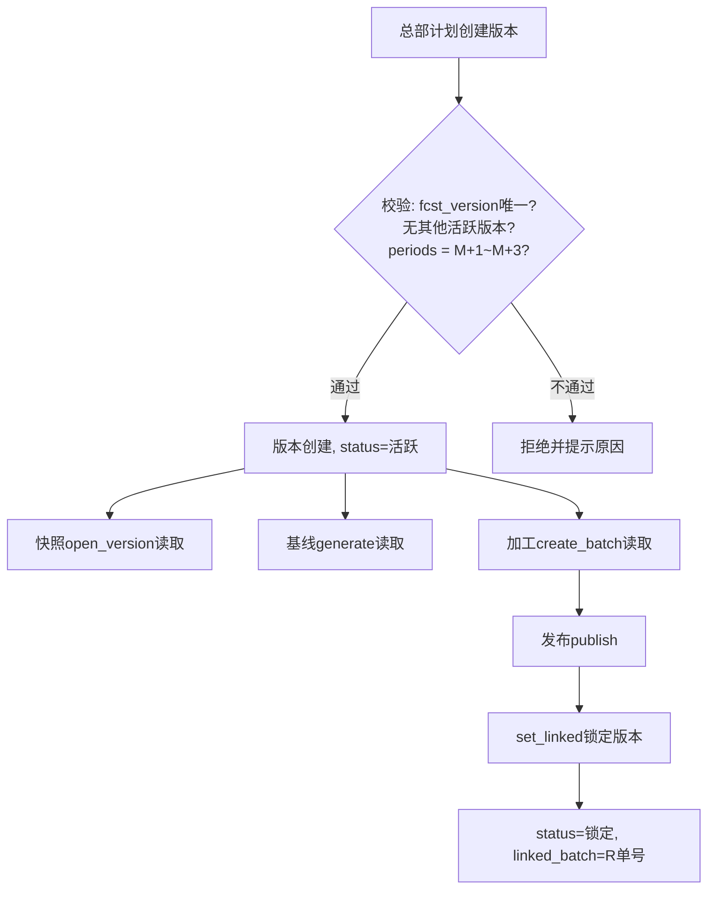

# 用户需求规格说明书 · 月度版本主数据

> **应用名**: `md_fcst_version`
> **类名**: `MdFcstVersion`
> **所属组**: `forecast`（销售预测应用组）
> **架构来源**: `app/forecast/architecture.md` 聚合根 #11
> **业务设计来源**: `app/forecast/brd/销售预测详设.md` §9.3 M8、§8.1 规则8、§10 P8
> **数据来源类型**: 独立创建

---

## 1. 需求概览

### 1.1 基本信息
- **需求名称**: 月度版本主数据管理
- **需求编号**: REQ-FORECAST-MD-FCST-VERSION-001
- **所属模块**: 销售预测-主数据
- **需求来源**: 业务方（总部计划）
- **创建日期**: 2026-08-12
- **优先级**: P1

### 1.2 需求背景

#### 1.2.1 为什么需要这个需求？

销售预测以自然月为版本节奏运行：每月 opening 时，系统需知道"当前是哪个版本、对应哪些预测期间（M+1~M+3）"。若无统一的月度版本主数据，快照 opening、基线生成、加工批次创建、R版发布等环节将各自硬编码节奏，导致版本不一致、跨月衔接断裂。

#### 1.2.2 期望达到什么目标？

建立唯一的月度版本主数据源，作为整个预测周期的节奏中枢：驱动快照 opening 的自动行生成、提供期间折算基准（base_period → M+1/M+2/M+3 会计月）、在 R 版发布时联动锁定版本，并确保同一时刻只有一个活跃版本。

### 1.3 需求范围

#### 1.3.1 包含哪些功能？

月度版本创建、版本查询（单条/列表）、活跃版本查询、R版发布联动锁定（set_linked）

#### 1.3.2 不包含哪些功能？

- 版本自动创建（V1 由总部计划手工创建版本，后续可扩展为 cron 自动建版）
- 版本删除
- 版本间差异对比

### 1.4 涉及角色

**谁会使用这个功能？**

- **总部计划**: 负责每月创建新版本、设置 opening 日期、管理版本状态；监控 R 版发布后的版本锁定
- **系统自动**: forecast_snapshot.open_version() 读取活跃版本进行行生成；demand_release.publish() 联动 set_linked 锁定版本
- **一线销售**: 只读（了解当前版本对应的预测期间范围）

---

## 2. 用户故事

### 2.1 核心用户故事

#### 2.1.1 `US-01` 用户故事 — 创建月度版本（优先级：P1）

- **故事描述**: 作为总部计划，我想要创建新的月度预测版本，以便于启动当月预测周期的 opening、基线生成和后续加工发布流程。
- **为何赋予此优先级**: 所有下游业务链（快照 opening、基线生成、加工、发布）均依赖版本信息驱动，无版本则整个月度周期无法启动。
- **独立测试**: 可通过创建一条版本记录并验证 get_active() 返回该版本、其 periods 正确展开为 M+1~M+3 三个会计月来独立测试。
- **前置条件**: 当前不存在其他活跃版本（同一时刻只有一个活跃版本）。
- **后置条件**: 新版本状态为"活跃"，可通过 get_active() 查询到；forecast_snapshot 可据此版本号调用 open_version()。

**验收场景**：

1. `US-01-AC1` **合法参数创建成功**
   - **Given** 当前无活跃版本，**When** 总部计划创建 fcst_version="202608"、base_period="2026-08"、periods=["2026-09","2026-10","2026-11"]、opening_date="2026-08-05"，**Then** 版本创建成功，状态为"活跃"。

2. `US-01-AC2` **重复版本号被拒绝**
   - **Given** 版本 "202608" 已存在，**When** 再次创建 fcst_version="202608"，**Then** 系统拒绝并提示"版本号已存在"。

3. `US-01-AC3` **存在活跃版本时创建被拒绝**
   - **Given** 版本 "202608" 当前为活跃状态，**When** 创建新版本 "202609"，**Then** 系统拒绝并提示"当前存在活跃版本 XXXX，请先锁定后再创建"。

4. `US-01-AC4` **periods 不合法被拒绝**
   - **Given** base_period="2026-08"，**When** 创建版本时 periods 不是恰好三个连续月份（如 ["2026-09","2026-10"] 或 ["2026-09","2026-10","2026-11","2026-12"]），**Then** 系统拒绝并提示"periods 必须恰好包含 M+1~M+3 三个会计月"。

5. `US-01-AC5` **periods 与 base_period 不匹配被拒绝**
   - **Given** base_period="2026-08"，**When** periods=["2026-10","2026-11","2026-12"]（不是 M+1 起算），**Then** 系统拒绝并提示"periods 必须从 base_period 的次月开始连续三个月"。

---

#### 2.1.2 `US-02` 用户故事 — 查询版本（优先级：P1）

- **故事描述**: 作为总部计划/一线销售，我想要查询版本信息（单条/列表/活跃版本），以便于了解当前预测周期状态和已发布的版本历史。
- **为何赋予此优先级**: 查询是下游应用（快照 opening、基线生成）获取版本信息的唯一入口，也是总部计划管理版本的日常操作。
- **独立测试**: 可通过创建一条版本后调用 get()/list()/get_active() 验证返回数据完整性来独立测试。
- **前置条件**: 系统中已存在版本数据。
- **后置条件**: 无（只读操作）。

**验收场景**：

1. `US-02-AC1` **按版本号查询**
   - **Given** 版本 "202608" 已存在，**When** 调用 get("202608")，**Then** 返回该版本的完整信息（base_period、periods、opening_date、status、linked_batch）。

2. `US-02-AC2` **查询活跃版本**
   - **Given** 版本 "202608" 状态为"活跃"，**When** 调用 get_active()，**Then** 返回该版本完整信息。

3. `US-02-AC3` **无活跃版本时**
   - **Given** 系统中无活跃版本（所有版本均已锁定），**When** 调用 get_active()，**Then** 返回空或抛出明确提示"当前无活跃版本"。

4. `US-02-AC4` **版本列表分页查询**
   - **Given** 系统中存在 25 条版本记录，**When** 调用 list(page=1, size=10)，**Then** 返回前 10 条（按 fcst_version 降序），总数 25。

---

#### 2.1.3 `US-03` 用户故事 — R版发布联动锁定（优先级：P1）

- **故事描述**: 作为系统自动流程，当 R 版（毛需求发布单）发布时，系统自动将对应月度版本锁定，以便于确保已发布周期的数据不可回溯修改。
- **为何赋予此优先级**: 锁定是"发布即冻结"策略的关键执行环节——一旦 R 版发布，作为其基石的 V 版（快照）和版本主数据本身都不可再变更；缺失此步骤会导致已发布数据被后续操作破坏。
- **独立测试**: 可通过创建活跃版本后调用 set_linked() 验证状态变为"锁定"、linked_batch 正确记录来独立测试。
- **前置条件**: 版本状态为"活跃"；R 版发布单（rel_no）已生成。
- **后置条件**: 版本状态变为"锁定"；linked_batch 记录关联的 R 版单号。

**验收场景**：

1. `US-03-AC1` **活跃版本正常锁定**
   - **Given** 版本 "202608" 状态为"活跃"，**When** 调用 set_linked("202608", "REL-202608-001")，**Then** 版本状态变为"锁定"，linked_batch 记录 "REL-202608-001"。

2. `US-03-AC2` **已锁定版本再次锁定被拒绝**
   - **Given** 版本 "202608" 状态为"锁定"，**When** 调用 set_linked("202608", "REL-202608-002")，**Then** 系统拒绝并提示"版本已锁定，不可重复操作"。

3. `US-03-AC3` **不存在的版本锁定被拒绝**
   - **Given** 版本 "209999" 不存在，**When** 调用 set_linked("209999", "REL-209999-001")，**Then** 系统返回错误"版本不存在"。

---

## 3. 业务场景

### 3.1 业务流程描述

#### 3.1.1 场景1: 月度版本创建 → 下游消费

1. 总部计划根据 P8 月度节奏时限，在每月 opening 日前创建新版本
2. 系统校验 fcst_version 唯一性、当前无其他活跃版本
3. 系统校验 periods 恰好为 base_period 的 M+1~M+3 三个连续会计月
4. 版本创建成功，状态 = "活跃"
5. forecast_snapshot 调用 md_fcst_version.get_active() 获取活跃版本
6. forecast_snapshot.open_version() 使用该版本信息生成 N+1~N+3 快照行
7. forecast_baseline.generate() 使用该版本信息生成基线
8. forecast_processing.create_batch() 使用该版本信息绑定加工批次
9. demand_release.publish() 发布时调用 md_fcst_version.set_linked() 锁定版本
10. 总部计划下月创建新版本（前一个已锁定，允许创建新活跃版本）



#### 3.1.2 场景2: 异常——版本遗漏时的降级处理

1. 总部计划忘记创建当月版本，但已到 opening 日
2. forecast_snapshot.open_version() 调用 get_active() 返回空
3. 系统提示"当前无活跃版本，请先创建月度版本"
4. 总部计划补建版本后，快照 opening 正常执行
5. 后续环节不受影响（版本创建无时间窗口限制，只要在加工 finalize 前完成即可）

### 3.2 业务规则

#### 3.2.1 `BR-01` 版本号唯一性
- **规则描述**: fcst_version（YYYYMM 格式）必须全局唯一。同一个自然月不能有两条版本记录。
- **适用场景**: create() 时校验
- **示例**: 已存在版本 "202608"，再次创建同号版本 → 拒绝。

#### 3.2.2 `BR-02` 同一时刻只有一个活跃版本
- **规则描述**: 系统中最多存在一个状态为"活跃"的版本。创建新版本前，旧活跃版本必须已被锁定（通过 R 版发布触发）。
- **适用场景**: create() 时前置校验
- **计算方式**: 查询 COUNT(status='活跃') = 0，通过后方可创建。
- **示例**: 版本 "202608" 活跃中 → 创建 "202609" 被拒绝 → 须等 "202608" 发布锁定后再创建。

#### 3.2.3 `BR-03` periods 必须为 M+1~M+3
- **规则描述**: periods 必须是恰好三个元素 ["YYYY-MM", "YYYY-MM", "YYYY-MM"]，且依次为 base_period 的下一个月、下两个月、下三个月。
- **适用场景**: create() 时校验
- **计算方式**: periods.length == 3 AND periods[0] == base_period + 1 month AND periods[1] == base_period + 2 months AND periods[2] == base_period + 3 months
- **示例**: base_period="2026-08" → periods 必须为 ["2026-09","2026-10","2026-11"]

#### 3.2.4 `BR-04` 状态转换规则
- **规则描述**: 版本状态仅支持单向转换："活跃" → "锁定"（由 R 版发布触发）。锁定后不可逆。
- **适用场景**: set_linked() 时校验
- **示例**: 状态="活跃" → set_linked() → 状态="锁定"；状态="锁定" → set_linked() → 拒绝。

#### 3.2.5 `BR-05` opening_date 合法性
- **规则描述**: opening_date 必须是一个有效日期，且不应晚于 base_period 的当月最后一日之后的合理范围。
- **适用场景**: create() 时校验
- **示例**: base_period="2026-08"，opening_date="2026-09-15" → 拒绝（open 不应晚于锚定月的合理范围）。

#### 3.2.6 `BR-06` fcst_version 格式
- **规则描述**: fcst_version 必须为 6 位数字（YYYYMM），如 "202608"。
- **适用场景**: create() 时校验
- **示例**: "2026-08"、"v202608" → 拒绝；"202608" → 通过。

### 3.3 业务数据

#### 3.3.1 数据1: 版本号（fcst_version）
- **数据描述**: 月度预测版本标识，格式 YYYYMM，如 202608 表示 2026 年 8 月版本
- **数据类型**: 文本（6 位数字字符串）
- **数据来源**: 总部计划手工录入
- **示例值**: "202608"

#### 3.3.2 数据2: 锚定期间（base_period）
- **数据描述**: 版本对应的基准月份，YYYY-MM 格式；periods 以此为锚计算 M+1~M+3
- **数据类型**: 文本（YYYY-MM）
- **数据来源**: 总部计划录入
- **示例值**: "2026-08"

#### 3.3.3 数据3: 对应预测期间（periods）
- **数据描述**: JSON 数组 ["YYYY-MM","YYYY-MM","YYYY-MM"]，对应 N+1/N+2/N+3 三个预测月份
- **数据类型**: 文本（JSON 数组）
- **数据来源**: 系统根据 base_period 自动推算（总部计划可确认/修正）
- **示例值**: ["2026-09","2026-10","2026-11"]

#### 3.3.4 数据4: 版本状态（status）
- **数据描述**: 活跃 = 当前正在进行的月度周期；锁定 = R 版已发布，版本不可再变更
- **数据类型**: 枚举（活跃 / 锁定）
- **数据来源**: 系统自动维护
- **示例值**: "活跃"

#### 3.3.5 数据5: 关联批次（linked_batch）
- **数据描述**: R 版发布时记录的关联发布单号
- **数据类型**: 文本
- **数据来源**: set_linked() 时由 demand_release 传入
- **示例值**: "REL-202608-001"

### 3.4 状态机

```
(新建) ──create──▶ 活跃 ──set_linked──▶ 锁定 [终态]
```

**状态转换规则矩阵：**

| 当前状态 | 目标状态 | 触发动作 | 前置条件 |
|----------|----------|----------|----------|
| (新建) | 活跃 | create() | fcst_version 唯一；当前无其他活跃版本；periods 合法 |
| 活跃 | 锁定 | set_linked() | 关联的 R 版发布单（rel_no）已生成且有效 |
| 锁定 | — | 不可逆 | 终态，不可再转换为任何状态 |

---

## 4. 功能描述

### 4.1 功能清单

| 一级菜单/模块 | 一级模块编号 | 二级模块 | 二级模块编号 | 三级功能 | 三级功能编号 | 功能类型 | 优先级 | 三级功能简述 |
|---|---|---|---|---|---|---|---|---|
| 主数据管理 | M01 | 月度版本 | M01-05 | 版本创建 | FUNC-01 | 接口（表单页） | P1 | 总部计划创建新的月度预测版本，系统校验唯一性与 periods 合法性 |
| 主数据管理 | M01 | 月度版本 | M01-05 | 版本查询（单条） | FUNC-02 | 接口 | P1 | 按 fcst_version 查询单条版本完整信息 |
| 主数据管理 | M01 | 月度版本 | M01-05 | 版本列表 | FUNC-03 | 接口（列表页） | P1 | 分页查询全部版本（按版本号降序），含状态筛选 |
| 主数据管理 | M01 | 月度版本 | M01-05 | 活跃版本查询 | FUNC-04 | 接口 | P1 | 返回当前唯一活跃版本，供下游应用调用 |
| 主数据管理 | M01 | 月度版本 | M01-05 | R版发布联动锁定 | FUNC-05 | 接口 | P1 | 系统自动：R版发布时锁定对应版本，记录关联批次号 |

### 4.2 功能模块结构图

```
主数据管理 M01
└── 月度版本 M01-05
    ├── FUNC-01 版本创建（接口/表单页，P1）
    ├── FUNC-02 版本查询-单条（接口，P1）
    ├── FUNC-03 版本列表（接口/列表页，P1）
    ├── FUNC-04 活跃版本查询（接口，P1）
    └── FUNC-05 R版发布联动锁定（接口，P1）
```

### 4.3 功能详细说明

#### 4.3.1 FUNC-01 版本创建

**功能描述**:
总部计划每月创建新的月度预测版本。系统校验 fcst_version 唯一性、当前无其他活跃版本、periods 合法性后，创建版本记录（状态初始为"活跃"）。

**用户操作流程**:
1. 总部计划进入"月度版本管理"页面，点击"新建版本"
2. 填写版本号 fcst_version（YYYYMM）、锚定期间 base_period
3. 系统自动推算 periods = [base_period+1月, base_period+2月, base_period+3月] 并展示
4. 总部计划确认 periods 无误，填写 opening_date
5. 点击"保存"
6. 系统校验通过后创建版本，状态="活跃"

**输入数据**:
- fcst_version: 版本号 - 6 位数字 YYYYMM - 示例："202608"
- base_period: 锚定期间 - YYYY-MM - 示例："2026-08"
- periods: 对应预测期间 - JSON 数组 ["YYYY-MM","YYYY-MM","YYYY-MM"] - 示例：系统自动推算 ["2026-09","2026-10","2026-11"]
- opening_date: opening 日 - 日期 - 示例："2026-08-05"

**输出数据**:
- fcst_version: 版本号 - 创建的版本标识
- base_period: 锚定期间
- periods: 对应预测期间
- opening_date: opening 日
- status: "活跃"
- linked_batch: null（创建时无关联批次）

**业务规则**:
- BR-01: fcst_version 唯一性校验
- BR-02: 当前无其他活跃版本
- BR-03: periods 必须为 M+1~M+3 恰好三个连续月
- BR-05: opening_date 合法性
- BR-06: fcst_version 格式校验

**特殊处理**:
- periods 由系统根据 base_period 自动推算，减少手工错误
- 创建后下游应用（forecast_snapshot）即可通过 get_active() 消费该版本

**业务实体**:
- **月度版本（MdFcstVersion）**: 计划周期节奏载体，一条记录对应一个自然月的预测版本

**月度版本字段**

| 字段名称 | 字段代码 | 字段类型 | 是否必填 | 默认值 | 业务逻辑 |
|---|---|---|---|---|---|
| 版本号 | fcst_version | 文本 | 是 | - | PK，格式 YYYYMM（6位数字），全局唯一 |
| 锚定期间 | base_period | 文本 | 是 | - | YYYY-MM 格式，版本对应的基准月份 |
| 对应预测期间 | periods | 文本 | 是 | - | JSON 数组，恰好3个元素 ["YYYY-MM","YYYY-MM","YYYY-MM"]，依次为 base_period 的 M+1/M+2/M+3 |
| opening 日 | opening_date | 日期 | 是 | - | 触发自动生成行的日期；不应晚于 base_period 当月最后一日 + 合理偏移（默认+7天） |
| 状态 | status | 枚举 | 否 | 活跃 | 活跃 / 锁定；新建默认为"活跃"，R版发布联动变为"锁定" |
| 关联批次 | linked_batch | 文本 | 否 | null | R版发布时记录关联的 REL-YYYYMM-NNN 单号；活跃状态时为 null |

---

#### 4.3.2 FUNC-02 版本查询（单条）

**功能描述**:
按 fcst_version 查询单条版本的完整信息，供下游应用（快照 opening、基线生成、加工）获取版本详情。

**用户操作流程**:
1. 调用方传入 fcst_version
2. 系统返回该版本的完整字段（base_period、periods、opening_date、status、linked_batch）
3. 版本不存在时返回错误

**输入数据**:
- fcst_version: 版本号 - YYYYMM - 示例："202608"

**输出数据**:
- 完整版本对象（所有字段）

**业务规则**:
- 版本不存在时返回明确错误信息，不返回 null

**特殊处理**:
- 无

---

#### 4.3.3 FUNC-03 版本列表

**功能描述**:
分页查询全部版本记录，支持按状态筛选，按版本号降序排列（最新版本在前）。

**用户操作流程**:
1. 调用方传入可选筛选条件（status）和分页参数（page, size）
2. 系统返回符合条件的版本列表及总数

**输入数据**:
- status: 状态筛选 - 枚举（活跃/锁定）- 可选 - 示例："锁定"
- page: 页码 - 整数 - 默认 1
- size: 每页条数 - 整数 - 默认 20

**输出数据**:
- 版本列表（每个版本含完整字段）
- 总数 total

**业务规则**:
- 按 fcst_version 降序排列（最新版本排在前面）
- 无记录时返回空列表 + total=0

**特殊处理**:
- 无

---

#### 4.3.4 FUNC-04 活跃版本查询

**功能描述**:
返回当前系统中唯一活跃版本。这是下游应用（forecast_snapshot.open_version、forecast_baseline.generate 等）获取当前版本信息的标准入口。

**用户操作流程**:
1. 调用方调用 get_active()
2. 系统查询 status='活跃' 的唯一记录并返回
3. 无活跃版本时返回明确错误

**输入数据**:
- 无

**输出数据**:
- 活跃版本完整对象（含 fcst_version、base_period、periods、opening_date）

**业务规则**:
- BR-02: 同一时刻最多一个活跃版本
- 无活跃版本时返回错误"当前无活跃版本"

**特殊处理**:
- 这是整个预测链的"心跳"入口——若无活跃版本，所有下游操作（快照 opening、基线生成）均应中断并提示

---

#### 4.3.5 FUNC-05 R版发布联动锁定

**功能描述**:
由 demand_release.publish() 在 R 版发布时自动调用，将对应版本状态从"活跃"变更为"锁定"并记录关联的发布单号。此操作为系统内部调用，前端无独立入口。

**用户操作流程**:
1. demand_release.publish() 发布 R 版后，系统自动调用 set_linked(fcst_version, rel_no)
2. 系统校验版本状态为"活跃"
3. 更新 status="锁定"、linked_batch=rel_no
4. 版本锁定后，下月才可创建新版本

**输入数据**:
- fcst_version: 版本号 - YYYYMM - 示例："202608"
- rel_no: R版发布单号 - 文本 - 示例："REL-202608-001"

**输出数据**:
- 锁定成功的版本对象

**业务规则**:
- BR-04: 仅"活跃"→"锁定"，锁定后不可逆
- 版本不存在时返回错误
- 重复锁定（status 已是"锁定"）时拒绝

**特殊处理**:
- 此操作是联动锁定链的关键一环：R版发布 → 锁定快照V版（forecast_snapshot.lock_version）→ 锁定加工批次 → 锁定版本主数据（本方法）。以上操作应在同一业务事务或补偿逻辑中保证最终一致性。
- 如果 demand_release.publish() 中某一步失败，已执行的锁定操作应有回滚或补偿机制。

**业务实体**:
- **R版发布联动记录**: 在版本记录的 linked_batch 字段中留痕，可追溯每个版本对应哪个 R 版发布单

---

## 5. 权限要求

### 5.1 功能权限

| 功能名称 | 权限标识 | 总部计划 | 一线销售 | 系统自动 |
|---|---|---|---|---|
| 版本创建 | `forecast:md-fcst-version:create` | 可访问 | 不可访问 | 不可访问 |
| 版本查询（单条） | `forecast:md-fcst-version:query` | 可访问 | 可访问 | 可访问 |
| 版本列表 | `forecast:md-fcst-version:list` | 可访问 | 可访问 | 可访问 |
| 活跃版本查询 | `forecast:md-fcst-version:get-active` | 可访问 | 可访问 | 可访问 |
| R版发布联动锁定 | `forecast:md-fcst-version:set-linked` | 不可访问 | 不可访问 | 可访问（内部调用） |

### 5.2 数据权限

#### 5.2.1 总部计划
- 可创建、查询所有版本记录
- 不可直接修改版本状态（状态仅由系统联动变更）
- 不可删除版本

#### 5.2.2 一线销售
- 只读：可查看活跃版本和版本列表
- 不可创建、修改、锁定版本

#### 5.2.3 系统自动
- 可读取活跃版本（供快照 opening 等使用）
- 可执行 set_linked() 锁定版本（由 demand_release.publish() 触发）

---

## 6. 验收标准

### 6.1 功能验收标准

#### 6.1.1 标准1: 版本创建成功并成为活跃版本
- **关联用户故事**: US-01
- **关联业务规则**: BR-01, BR-02, BR-03, BR-05, BR-06
- **验证方式**: 创建版本后调用 get_active() 验证返回该版本
- **测试数据**: fcst_version="202608", base_period="2026-08", periods=["2026-09","2026-10","2026-11"], opening_date="2026-08-05"
- **预期结果**: 创建成功，status="活跃"，get_active() 返回该版本

#### 6.1.2 标准2: 重复版本号与活跃版本冲突拦截
- **关联用户故事**: US-01-AC2, US-01-AC3
- **关联业务规则**: BR-01, BR-02
- **验证方式**: 创建已存在的版本号；在活跃版本存在时创建新版本
- **测试数据**: 先创建 "202608"，再创建 "202608"；"202608" 活跃时创建 "202609"
- **预期结果**: 两次均被拒绝并有明确提示

#### 6.1.3 标准3: periods 合法性校验
- **关联用户故事**: US-01-AC4, US-01-AC5
- **关联业务规则**: BR-03
- **验证方式**: 传入不合法 periods（数量不对 / 不从 M+1 起算）尝试创建
- **测试数据**: periods=["2026-09","2026-10"]；periods=["2026-10","2026-11","2026-12"]（base_period="2026-08"）
- **预期结果**: 均被拒绝并有明确提示

#### 6.1.4 标准4: R版发布联动锁定
- **关联用户故事**: US-03
- **关联业务规则**: BR-04
- **验证方式**: 活跃版本调用 set_linked() 后验证 status="锁定"、linked_batch 正确记录
- **测试数据**: fcst_version="202608", rel_no="REL-202608-001"
- **预期结果**: status="锁定", linked_batch="REL-202608-001"

#### 6.1.5 标准5: 版本列表查询
- **关联用户故事**: US-02
- **验证方式**: 创建多个版本后调用 list() 验证返回结果及排序
- **测试数据**: 创建 "202607"、"202608"、"202609" 三个版本
- **预期结果**: 按版本号降序返回 "202609"→"202608"→"202607"

### 6.2 非功能验收标准

**性能要求**: 版本查询（get/list/get_active）响应时间 < 100ms
**可靠性要求**: set_linked() 在 R 版发布事务中须保证最终一致性（与快照锁定、加工锁定联动）
**数据完整性要求**: fcst_version 主键约束、periods JSON 格式完整（永远可反序列化为合法数组）

### 6.3 已知问题或限制

- V1 由总部计划手工创建版本，后续可扩展为 cron 定时任务在每月 1 日自动创建
- 版本不支持删除（历史版本永久保留）
- 版本不支持修改（创建后除 set_linked() 外无其他修改入口）
- BR-05 opening_date 的合理范围上限以 P8 为参考（opening+3 收集毕），具体数值待业务方确认
- periods 当前固定为 M+1~M+3 三个元素（仅支持 N+3 滚动模式），若未来扩展为其他滚动窗口需调整校验逻辑

---

## 7. 参考资料

### 7.1 相关文档
- `app/forecast/architecture.md` 聚合根 #11 - 月度版本聚合根卡
- `app/forecast/brd/销售预测详设.md` §9.3 M8 - 月度版本主数据字段设计
- `app/forecast/brd/销售预测详设.md` §8.1 规则8 - 版本节奏与 R 版发布联动锁定
- `app/forecast/brd/销售预测详设.md` §10 P8 - 月度节奏时限参数

### 7.2 相关功能
- **forecast_snapshot.open_version()**: 读取活跃版本信息生成快照行
- **forecast_snapshot.lock_version()**: R版发布时联动锁定快照（与 set_linked 同事务）
- **demand_release.publish()**: R版发布入口，触发 set_linked()
- **forecast_baseline.generate()**: 读取活跃版本生成基线
- **forecast_processing.create_batch()**: 读取活跃版本创建加工批次

### 7.3 外部依赖

- 无外部系统依赖（本聚合为独立主数据，不引用其他聚合）

### 7.4 备注

- 本聚合属于主数据层，遵循 CONVENTION 规则 10（主数据铁律）：被 forecast_snapshot 和 demand_release 两方引用，必须独立建模
- 版本号 fcst_version 在整个预测链中作为 lineage 线索贯穿：快照.V版 → 基线.B版 → 加工.PRC版 → 发布.R版，全部可追溯到同一个 fcst_version
- V1 以 Excel 导入 / 手工创建的简单界面起步，后续可对接 MDM 自动同步
