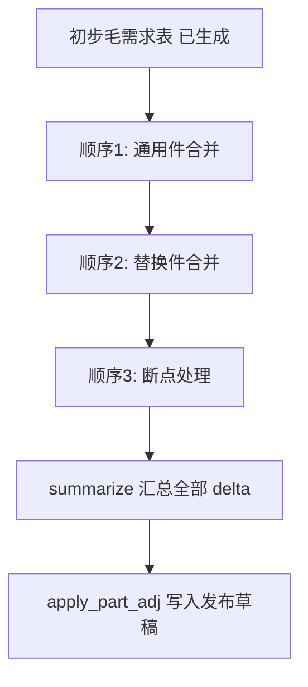

# 零件级处理 · 应用详设

> 应用名：`part_level_adj` | 聚合根类名：`PartLevelAdj`
> 数据来源类型：**独立创建**（每条调整由总部计划独立创建，在初步毛需求表生成后顺序执行）
> 产出技能：fde-aggregate-application-design（第②步）

---

## 1. 需求概览

### 1.1 基本信息
- **需求名称**: 零件级处理
- **需求编号**: FC-PLA-001
- **所属模块**: 销售预测-零件级处理
- **需求来源**: 产品经理 / 业务方
- **创建日期**: 2026-08-12
- **优先级**: P0

### 1.2 需求背景
#### 1.2.1 为什么需要这个需求？

初步毛需求表（物料级汇总）仅完成了客户行层面的独立需求加总，未处理跨客户的零件级合并问题。通用件多客户需求有重复计算、替换件分别下单可能造成超储、断点变更需要成对调整。这些均需在零件级别统一处理。

#### 1.2.2 期望达到什么目标？

在初步毛需求表生成后，提供通用件合并、替换件合并、断点处理三个独立的零件级处理功能。每个功能输出物料 x 期间的调整量（delta），作用回初步表得最终毛需求。保证物料级总量的准确性。

### 1.3 需求范围
#### 1.3.1 包含哪些功能？

通用件合并调整（汇总去重折减）、替换件合并调整（统一扣减库存）、断点成对调整（旧件截断 + 新件启动）、调整记录查询与列表、按物料 x 期间汇总全部 delta

#### 1.3.2 不包含哪些功能？

- 客户行级别的调整（由 forecast_processing 负责）
- 最终毛需求的发布（由 demand_release 负责）
- 初步毛需求表的生成（由 demand_release.create_draft 内置计算）
- 拆回客户维度——预测侧只给物料级总量，发运侧按实际调拨单执行

### 1.4 涉及角色

- **总部计划**：通用件合并判断、替换件合并扣减执行、断点成对调整登记；唯一操作角色
- **一线销售**：不参与零件级处理

---

## 2. 用户故事

### 2.1 核心用户故事

#### 2.1.1 `US-01` 用户故事 -- 通用件合并调整（优先级：P1）

- **故事描述**: 作为总部计划，我想要对通用件（>=2 客户使用同一零件）的初步毛需求进行汇总去重折减，以便于防止多客户口头加码叠加导致总量虚高。
- **为何赋予此优先级**：通用件合并是零件级处理的第一步，直接影响最终的物料级发布量，防止超量采购。
- **独立测试**：可通过识别通用件、创建合并调整，验证 delta 计算和依据记录。
- **前置条件**: 初步毛需求表已生成（来自 demand_release 草稿）。
- **后置条件**: 生成调整记录（adj_no），delta 写入发布草稿。

**验收场景**：

1. `US-01-AC1` **通用件有证据加码保留**：
   - **Given** STD-M6 被客户 A 和 B 使用，A 有函件加码、B 为口头加码，**When** 计划执行通用件合并，**Then** A 的函件加码保留、B 的口头加码按历史折减系数 0.65 折减，delta=-(B的口头加码部分)，basis 记录依据。

2. `US-01-AC2` **非通用件不触发合并**：
   - **Given** 8210001 仅被 1 个客户使用，**When** 计划尝试创建通用件合并调整，**Then** 系统提示"该零件非通用件（<2 客户），无需合并处理"。

3. `US-01-AC3` **通用件无加码时直接去重**：
   - **Given** STD-M6 两客户均无加码量，**When** 执行通用件合并，**Then** delta 为初步汇总的重复部分去重（常 <=0），basis 记录"无加码，汇总去重"。

---

#### 2.1.2 `US-02` 用户故事 -- 替换件合并调整（优先级：P1）

- **故事描述**: 作为总部计划，我想要对存在替换/替代关系的零件进行需求合并计算，并统一扣减可用库存（含被替换件库存），以便于防止分别下单造成超储。
- **为何赋予此优先级**：替换件管理是库存成本控制的关键，分别下单会直接导致超储和资金占用。
- **独立测试**：可通过查询替换关系、创建替换合并调整，验证 delta 和依据。
- **前置条件**: 替换关系主数据 (`md_part_replace`) 中该零件存在生效的替换关系；初步毛需求表已生成。
- **后置条件**: 生成调整记录。

**验收场景**：

1. `US-01-AC1` **替换件合并扣减**：
   - **Given** 零件 8210001-A（旧）与 8210001-B（新）存在替换关系，旧件有库存 100，**When** 计划创建替换合并调整，**Then** 新件初步毛需求扣减被替换件可用库存后生成 delta，basis 记录替换关系号和扣减逻辑。

2. `US-01-AC2` **无替换关系时拒绝**：
   - **Given** 零件 8210001 无生效的替换关系，**When** 尝试 create_replace_merge，**Then** 系统提示"该零件无生效替换关系"。

---

#### 2.1.3 `US-03` 用户故事 -- 断点成对调整（优先级：P1）

- **故事描述**: 作为总部计划，我想要在工程变更断点时，对旧件截断（负量）和新件启动（正量）进行成对调整，以便于正确反映变更前后的需求转移。
- **为何赋予此优先级**：断点处理直接影响 ECN 变更后的供需匹配，不成对会导致旧件多采、新件缺料。
- **独立测试**：可通过创建断点成对调整（同一 pair_no），验证正负行关联、pair_no 必填。
- **前置条件**: 替换关系主数据中存在断点关系（old_part 和 new_part 均有记录）；初步毛需求表已生成。
- **后置条件**: 生成成对调整记录（同一 pair_no），旧件负量 + 新件正量。

**验收场景**：

1. `US-03-AC1` **断点成对调整**：
   - **Given** 8210001-A 在 2026-10 断点（切换为新件 8210001-B），ECN-A-118，**When** 计划执行 `create_breakpoint_adj("V202608", "2026-10", "8210001-A", "8210001-B", -420, +400, "ECN-A-118")`，**Then** 生成两条记录（PAD-...-002 和 PAD-...-003），同一 pair_no="BP-202608-01"，basis="ECN-A-118 旧件截断/新件启动"。

2. `US-03-AC2` **不成对拒绝**：
   - **Given** 计划只创建旧件截断负量而不创建新件正量，**When** 调用 create_breakpoint_adj，**Then** 系统拒绝或要求同时提供 old_adj 和 new_adj。

3. `US-03-AC3` **旧件尾量呆滞预警**：
   - **Given** 8210001-A 截断后残余量 50 + 在途 30，库存 100，**When** 断点处理完成，**Then** 系统提示"旧件库存+在途(130)超出截断残余量(50)，超出部分(80)建议转呆滞预警"。

---

#### 2.1.4 `US-04` 用户故事 -- 调整查询与汇总（优先级：P2）

- **故事描述**: 作为总部计划，我想要按版本、功能类型、物料、期间查询零件级处理记录，并按物料 x 期间汇总全部 delta，以便于了解各调整的影响量和最终汇总结果。
- **为何赋予此优先级**：查询和汇总是操作支撑功能。
- **独立测试**：通过筛选条件和汇总查询验证。
- **前置条件**: 调整记录已存在。
- **后置条件**: 无变化。

**验收场景**：

1. `US-04-AC1` **按功能类型筛选**：
   - **Given** V202608 存在通用件合并和断点记录，**When** 查询 `list(func_type="通用件合并")`，**Then** 仅返回通用件合并相关的调整记录。

2. `US-04-AC2` **按物料 x 期间汇总**：
   - **Given** STD-M6 2026-09 有通用件 delta=-1600、无替换/断点调整，**When** 调用 `summarize("V202608")`，**Then** 返回按 (part_no, period) 聚合的 delta 汇总量。

---

## 3. 业务场景

### 3.1 业务流程描述

#### 3.1.1 场景1: 零件级处理执行顺序



1. 初步毛需求表（物料级汇总）在 `demand_release.create_draft()` 中生成
2. 总部计划执行通用件合并：对 >=2 客户使用的零件进行汇总去重折减
3. 总部计划执行替换件合并：对存在替换关系的零件合并需求、扣减库存
4. 总部计划执行断点处理：对 ECN 变更零件进行成对调整（最后执行，基于最新量）
5. 调用 `summarize()` 获取按物料 x 期间的全部 delta 汇总
6. 通过 `demand_release.apply_part_adj()` 将汇总 delta 写入发布草稿

#### 3.1.2 场景2: 通用件合并详细流程

1. 计划识别通用件（>=2 客户使用的零件），从 `md_project_part.list_by_part()` 确认
2. 检查该通用件的初步毛需求中各客户的加码情况
3. 有证据加码（函件/促销）→ 保留
4. 口头加码 → 按历史折减系数（初始 0.65）折减
5. 无加码 → 汇总去重（取正确总量）
6. 创建调整记录：`create_generic_merge()`，记录 delta 和 basis

### 3.2 业务规则

#### 3.2.1 `BR-01` 断点处理必须成对
- **规则描述**: 断点处理的旧件截断（负 delta）与新件启动（正 delta）必须同时创建，以同一 pair_no 关联。不允许只创建一端的调整。
- **适用场景**: create_breakpoint_adj 时。
- **示例**: 旧件 8210001-A 截断 -420 → 新件 8210001-B 启动 +400，pair_no="BP-202608-01"。

#### 3.2.2 `BR-02` 执行顺序固定
- **规则描述**: 三个功能的执行顺序为：通用件合并 → 替换件合并 → 断点处理。断点处理必须最后执行（基于前两步处理后的最新量）。
- **适用场景**: 零件级处理整体流程。
- **示例**: 不可先执行断点再合并通用件。

#### 3.2.3 `BR-03` 功能只写 delta、不改原表
- **规则描述**: 零件级处理只产生调整量（delta），不直接修改初步毛需求表或客户行加工表。最终毛需求 = 初步 + Σ delta。
- **适用场景**: 所有调整创建时。
- **示例**: 通用件合并产生 adj_qty=-1600，初步表 STD-M6 原值 29600 不变，发布时发布量 = 29600 + (-1600) = 28000。

#### 3.2.4 `BR-04` 每条 delta 登记原因/依据
- **规则描述**: 每条调整记录的 basis 字段必填，记录调整的原因或依据（函件/ECN/历史折减系数/替换关系号等），保证可追溯。
- **适用场景**: 所有调整创建时。
- **示例**: basis="口头加码按历史系数 0.65 折减；函件加码保留"。

#### 3.2.5 `BR-05` 通用件判定标准
- **规则描述**: 同一 part_no 出现在 >=2 个不同客户（不同 oem_code）的项目中 → 识别为通用件，触发通用件合并处理。
- **适用场景**: create_generic_merge 时。
- **计算方式**: `md_project_part.list_by_part(part_no)` 返回的项目数 >= 2。

#### 3.2.6 `BR-06` 通用件折减系数
- **规则描述**: 口头加码按历史折减系数折减（初始 0.65，按近 6 期"口头加码 vs 实际用量"回归比例，季度重算）。有证据加码（函件/促销）保留不折减。
- **适用场景**: create_generic_merge 时。
- **示例**: 客户口头加码 1000 → 折减后 adj_qty = -350（1000 * (1-0.65)），即仅算入 650。

#### 3.2.7 `BR-07` 替换件库存扣减范围
- **规则描述**: 替换件合并的库存扣减范围为自有仓 + 寄售仓可用库存（含被替换件库存）。
- **适用场景**: create_replace_merge 时。
- **参考**: P5 配置。

#### 3.2.8 `BR-08` 通用件不做客户拆回
- **规则描述**: 预测侧只给物料级总量。发运侧按实际调拨单执行客户级分配（执行层），预测域不拆回客户维度。
- **适用场景**: 通用件合并后的结果消费。

### 3.3 业务数据

#### 3.3.1 数据1: 调整量 (adj_qty)
- **数据描述**: 零件级处理的调整量，带符号 delta。正值 = 增加、负值 = 减少。
- **数据类型**: 数字（带符号）
- **数据来源**: 计划根据业务判断手动输入
- **示例值**: -1600（通用件折减）、+400（新件启动）

#### 3.3.2 数据2: 功能类型 (func_type)
- **数据描述**: 标识该调整属于哪个零件级处理功能。
- **数据类型**: 枚举值（通用件合并 / 替换件合并 / 断点处理）
- **数据来源**: 计划选择

#### 3.3.3 数据3: 配对号 (pair_no)
- **数据描述**: 断点处理时关联旧件截断和新件启动的配对标识。
- **数据类型**: 文本（BP-YYYYMM-NN）
- **数据来源**: 系统在断点处理时自动生成，旧/新行共享同一 pair_no

### 3.4 状态机

无状态机。每条调整记录独立生效，创建即作用。调整记录不单独发布或审批——最终效果通过 `summarize()` 汇总后写入毛需求发布单（`demand_release`），随 R 版发布生效。

---

## 4. 功能描述

### 4.1 功能清单

| 一级菜单/模块 | 一级模块编号 | 二级菜单/模块 | 二级模块编号 | 三级功能 | 三级功能编号 | 功能类型 | 优先级 | 三级功能简述 |
|---|---|---|---|---|---|---|---|---|
| 零件级处理 | F04 | 通用件合并 | F04-01 | 创建通用件合并调整 | FUNC-01 | 表单页 | P1 | 对>=2客户通用件汇总去重折减 |
| 零件级处理 | F04 | 替换件合并 | F04-02 | 创建替换件合并调整 | FUNC-02 | 表单页 | P1 | 对替换关系零件合并需求扣减库存 |
| 零件级处理 | F04 | 断点处理 | F04-03 | 创建断点成对调整 | FUNC-03 | 表单页 | P1 | 旧件截断+新件启动成对调整 |
| 零件级处理 | F04 | 调整查询 | F04-04 | 调整记录列表 | FUNC-04 | 列表页 | P2 | 按版本/功能类型/物料/期间查询 |
| 零件级处理 | F04 | 调整查询 | F04-04 | 汇总视图 | FUNC-05 | 报表 | P2 | 按物料x期间聚合全部delta |

### 4.2 功能模块结构图

```
零件级处理 (F04)
├── 通用件合并 (F04-01)
│   └── FUNC-01 创建通用件合并调整 (表单页, P1)
├── 替换件合并 (F04-02)
│   └── FUNC-02 创建替换件合并调整 (表单页, P1)
├── 断点处理 (F04-03)
│   └── FUNC-03 创建断点成对调整 (表单页, P1)
└── 调整查询 (F04-04)
    ├── FUNC-04 调整记录列表 (列表页, P2)
    └── FUNC-05 汇总视图 (报表, P2)
```

### 4.3 功能详细说明

#### 4.3.1 F04-01 通用件合并

##### FUNC-01 创建通用件合并调整

**功能描述**:
对通用件（同一零件被 >=2 个不同客户使用）的初步毛需求进行汇总去重折减。有证据加码保留、口头加码按历史折减系数折减。输出为物料 x 期间的负 delta（常 <=0）。

**用户操作流程**:
1. 计划在初步毛需求列表中识别通用件（系统标记"通用"标签）
2. 点击"通用件合并"
3. 系统展示该零件各客户的独立需求贡献
4. 计划判断各客户的加码性质（有证据/口头）
5. 口头加码部分按折减系数折减
6. 系统计算 delta，计划确认
7. 保存调整记录

**业务规则**:
- 仅 >=2 客户的零件才能触发通用件合并
- 有证据加码（函件/促销）保留
- 口头加码按历史折减系数（初始 0.65）折减
- basis 须记录折减依据

**特殊处理**:
- 跨应用调用：`md_project_part.list_by_part(part_no)` 识别通用件（返回 >=2 个不同客户的项目）

**业务实体**:
- **零件级处理记录 (PartLevelAdj)**: 一条零件级处理调整记录。不带单头，每条独立生效。

**零件级处理记录字段**

| 字段名称 | 字段类型 | 是否必填 | 默认值 | 业务逻辑 |
|---|---|---|---|---|
| adj_no | 文本 | 是 | - | PAD-YYYYMM-NNN，系统自动生成 |
| func_type | 枚举 | 是 | - | 通用件合并 / 替换件合并 / 断点处理 |
| part_no | 文本 | 是 | - | 物料号；来源：`md_material.list` 下拉选择 |
| fcst_version | 文本 | 是 | - | 预测版本 V+YYYYMM |
| period | 文本 | 是 | - | 期间 YYYY-MM |
| adj_qty | 数字 | 是 | - | 调整量（delta，带符号） |
| basis | 文本 | 是 | - | 原因/依据（函件/ECN/历史折减系数/替换关系等） |
| pair_no | 文本 | 条件必填 | - | 配对号，断点必填；关联旧/新件正负行，格式 BP-YYYYMM-NN |
| owner | 文本 | 是 | 当前用户 | 处理人（总部计划） |
| created_at | 时间 | 是 | 系统时间 | 处理时间 |

---

#### 4.3.2 F04-02 替换件合并

##### FUNC-02 创建替换件合并调整

**功能描述**:
对存在替换/替代关系的零件，合并新旧件的需求，统一扣减可用库存（含被替换件库存）。防分别下单造成超储。

**用户操作流程**:
1. 计划选择存在替换关系的零件
2. 系统展示替换关系详情（旧件/新件、切换时点、ECN 号）
3. 系统计算可用库存（自有仓 + 寄售仓，含被替换件）
4. 计划确认扣减量
5. 保存调整记录

**业务规则**:
- 需存在生效的替换关系（`md_part_replace` status="生效"）
- 扣减范围 = 自有仓 + 寄售仓可用库存
- basis 须记录替换关系号

**特殊处理**:
- 跨应用调用：`md_part_replace.get(rel_no)` 取替换关系

---

#### 4.3.3 F04-03 断点处理

##### FUNC-03 创建断点成对调整

**功能描述**:
工程变更断点时，对旧件截断（负 delta）和新件启动（正 delta）进行成对调整。旧件残余量与库存+在途比对，超出转呆滞预警。

**用户操作流程**:
1. 计划选择断点涉及的旧件和新件
2. 系统从 `md_part_replace` 取断点关系（ECN/切换时点）
3. 计划填写旧件截断量和旧件剩余期量
4. 计划填写新件启动量
5. 系统生成成对调整（同一 pair_no）
6. 系统检查旧件库存+在途是否超出残余量，超限时预警

**业务规则**:
- 必须成对创建（同一 pair_no）
- 旧件截断负量、新件启动正量
- 断点定量参考：旧件截断 = -Σ(该项目份额 x 剩余期间初步量)；新件启动按 M4/ECN 启动量
- 旧件尾量与库存比对，超出转呆滞预警

**特殊处理**:
- 跨应用调用：`md_part_replace.get(rel_no)` 取断点关系
- 跨应用调用：`md_project_part.get(project_no, part_no)` 取份额/用量（定量参考）

---

#### 4.3.4 F04-04 调整查询

##### FUNC-04 调整记录列表

按 fcst_version、func_type、part_no、period 筛选查询调整记录，支持分页。

##### FUNC-05 汇总视图

按 fcst_version 汇总全部调整记录：按 (part_no, period) 聚合 adj_qty，返回各物料 x 期间的净调整量。供 `demand_release.apply_part_adj()` 使用。

**输出数据**: [{part_no, period, total_adj_qty, details: [{adj_no, func_type, adj_qty, basis}]}]

---

## 5. 权限要求

### 5.1 功能权限

| 功能名称 | 权限标识 | 总部计划 | 一线销售 |
|---|---|---|---|
| 创建通用件合并 | `forecast:part-adj:generic-merge` | 可访问 | 不可访问 |
| 创建替换件合并 | `forecast:part-adj:replace-merge` | 可访问 | 不可访问 |
| 创建断点成对调整 | `forecast:part-adj:breakpoint` | 可访问 | 不可访问 |
| 调整记录列表 | `forecast:part-adj:list` | 可访问 | 可访问 |
| 汇总视图 | `forecast:part-adj:summarize` | 可访问 | 可访问 |

### 5.2 数据权限

#### 5.2.1 总部计划
- 可以查看和操作全部零件级处理记录
- 创建、查询、汇总等所有操作

#### 5.2.2 一线销售
- 可以查看调整记录和汇总（只读）
- 不可创建/修改调整

---

## 6. 验收标准

### 6.1 功能验收标准

#### 6.1.1 标准1: 通用件合并正确
- **关联用户故事**: US-01
- **关联业务规则**: BR-05, BR-06, BR-08
- **验证方式**: 对 >=2 客户的通用件创建合并调整
- **测试数据**: STD-M6，客户 A 函件加码保留、客户 B 口头加码 1000 折减系数 0.65
- **预期结果**: adj_qty = -(1000*(1-0.65)) = -350（仅折减口头部分），basis 记录"口头加码按历史系数0.65折减；函件加码保留"。

#### 6.1.2 标准2: 断点成对创建
- **关联用户故事**: US-03
- **关联业务规则**: BR-01
- **验证方式**: 创建断点调整，验证成对记录
- **测试数据**: 旧件 8210001-A adj=-420，新件 8210001-B adj=+400
- **预期结果**: 两条记录同一 pair_no，旧件 adj_qty=-420，新件 adj_qty=+400。

#### 6.1.3 标准3: 汇总正确
- **关联用户故事**: US-04
- **关联业务规则**: BR-03
- **验证方式**: 创建多条调整后执行 summarize
- **预期结果**: 按 (part_no, period) 聚合的 total_adj_qty = Σ 各调整的 adj_qty。

### 6.2 非功能验收标准
- **性能要求**: summarize 处理 1000 条调整记录应在 2 秒内完成
- **安全性要求**: 调整记录创建后不可被非计划角色修改
- **兼容性要求**: 支持 Chrome、Edge 浏览器

### 6.3 已知问题或限制
- 通用件历史折减系数（P4）初始值 0.65，需基于实际历史数据回测校准——V1 以固定值起步
- 替换件合并的可用库存数据来源（ERP WMS）接口规格未定，V1 以 stub 或手工输入起步
- 断点定量计算依赖 M4 的份额/用量数据准确性
- 三条处理功能的执行顺序由业务流程约束，V1 不强制技术上的顺序锁定（由计划按规范操作）

---

## 7. 参考资料

### 7.1 相关文档
- `app/forecast/architecture.md` -- 聚合根清单与聚合根卡（第①步产物）
- `app/forecast/brd/销售预测详设.md` -- §4 合并加工（零件级处理功能）、§8.5 零件级处理功能详设

### 7.2 相关功能
- **毛需求发布 (demand_release)**: summarize 后通过 apply_part_adj 写入发布草稿
- **初步毛需求汇总**: 由 demand_release.create_draft 内置计算，是本功能的输入
- **预测加工 (forecast_processing)**: 加工表的一次性/断点调整记录（客户行粒度），供零件级处理的断点处理参考

### 7.3 外部依赖
- **md_material (物料主数据)**: 物料存在性校验
- **md_part_replace (替换关系)**: 替换件合并和断点处理的替换/替代/断点关系来源
- **md_project_part (项目零件映射)**: 通用件识别（list_by_part 判断 >=2 客户）；断点/EOP 定量（份额/用量）

### 7.4 备注
- 数据来源类型为"独立创建"：每条调整由计划在初步毛需求表生成后独立创建，前端保留各功能的创建入口
- 三个功能独立运行、无批次概念、每条调整独立生效
- 最终效果（delta 写入发布单）通过 `demand_release.apply_part_adj()` 实现，不在本聚合内修改其他聚合的数据
