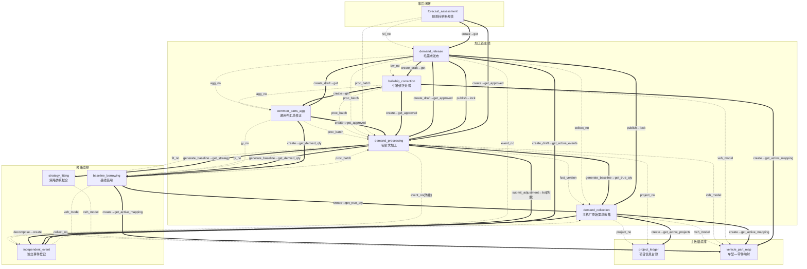

# parts-fc · 架构设计（聚合根识别）

> **第①步产出**：聚合根清单 + 聚合根卡 + 聚合关系图
> **输入**：`app/parts-fc/brd/毛需求管理详设.md`（11 张业务单据完整详设）
> **日期**：2026-08-08

---

## 一、聚合根清单总表

| # | 聚合根 | 应用名 | 类名 | 一句话定义 | 标识 | 是否主数据 |
|---|--------|--------|------|-----------|------|----------|
| 1 | 项目信息台账 | `project_ledger` | `ProjectLedger` | 项目×零件的六维主数据底座，记录项目阶段与客户/产品/车型/量纲/生命周期/责任人 | `project_no` + `part_no`（联合业务键） | 是 |
| 2 | 车型—零件映射 | `vehicle_part_map` | `VehiclePartMap` | 车型↔零件量纲映射的权威源，单车用量/份额的唯一维护点 | `part_no` + `veh_model`（联合业务键） | 是 |
| 3 | 主机厂原始需求收集 | `demand_collection` | `DemandCollection` | OEM 滚动预测的收集入口，含版本快照与信号拆解（滤噪声/剥脉冲/留真实消耗） | `collect_no`（COL-YYYYMM-NNN） | 否 |
| 4 | 毛需求加工 | `demand_processing` | `DemandProcessing` | 毛需求加工总账：统计基线→销售修正→修正核对，产出核定毛需求 | `proc_batch`（PRC-YYYYMM-NNN） | 否 |
| 5 | 基线借用 | `baseline_borrowing` | `BaselineBorrowing` | 历史不足零件的基线例外登记（五种借法），保证"借来的基线"可复核可回溯 | `jy_no`（JY-YYYYMM-NNN） | 否 |
| 6 | 独立事件登记 | `independent_event` | `IndependentEvent` | 水位脉冲/断点/其他一次性事件的独立台账，叠加结构中"事件项"的唯一载体 | `event_no`（EVT-YYYYMM-NNN） | 否 |
| 7 | 通用件汇总修正 | `common_parts_agg` | `CommonPartsAgg` | 通用件跨销售汇总去重，总部计划对总量负责，对抗"公地悲剧" | `agg_no`（AGG-YYYYMM-NNN） | 否 |
| 8 | 牛鞭修正处理 | `bullwhip_correction` | `BullwhipCorrection` | 下游派生需求 vs 终端消耗口径的对比修正，锚定终端需求 | `bw_no`（BW-YYYYMM-NNN） | 否 |
| 9 | 毛需求发布 | `demand_release` | `DemandRelease` | 加工链终点：消耗量+事件加项的最终合成与冻结发布（R版），净需求/S&OP 唯一输入 | `rel_no`（REL-YYYYMM-NNN） | 否 |
| 10 | 策略仿真拟合 | `strategy_fitting` | `StrategyFitting` | 历史回测为每物料选最优预测策略（方法+参数+配套库存策略），基线方法军火库 | `fit_no`（D10-YYYYQN-NNN） | 否 |
| 11 | 预测转单率考核 | `forecast_assessment` | `ForecastAssessment` | 事后闭环：转单率/FVA/达成率考核与归因，反哺信任折扣/策略重拟合/参数校准 | `fa_no`（FA-YYYYMM-NNN） | 否 |

> **外部依赖（非本组应用）**：客户主数据、物料主数据、车型主数据、组织用户、日历——权威源在外部 MDM/ERP/HR，本域通过接口同步本地冗余后只读引用（BRD §2.17），**不创建为 parts-fc 应用**。
>
> **系统级配置（非聚合根）**：参数配置表、生命周期模板库/类比库/信任折扣库（沉淀库）、外部数据源台账——属系统级配置与知识沉淀，不建模为业务聚合根（BRD §2.15–§2.16）。

---

## 二、聚合根卡

### 聚合根 1：项目信息台账

```
应用名 / 类名：project_ledger / ProjectLedger
业务定义：项目×零件的六维主数据底座，记录项目阶段与客户/产品/车型/量纲/生命周期/责任人
标识（主键）：project_no + part_no（联合业务键）

核心属性：
  - project_no: String — 项目号
  - part_no: Ref — 零件号（引用物料主数据）
  - stage: Enum — 项目阶段（待定点/定点中/进行中/EOP关闭）
  - award_prob: Decimal — 定点概率（待定点/定点中项目用）
  - oem_code / plant_code: Ref — 客户·工厂（引用客户主数据）
  - veh_model / platform: Ref — 车型/平台（引用 vehicle_part_map）
  - part_kind: Enum — 专用/通用（决定是否走 D07 汇总）
  - usage / share: Decimal — 单车用量/份额（引用展示，权威源在 vehicle_part_map）
  - sop / eop: Date — SOP/EOP
  - lc_shape: Enum — 生命周期形态标签（传统/上市高后下滑）
  - owner: Ref(User) — 责任销售
  - change_log: [子表] — 变更日志（字段/前值/后值/原因/日期）

对外操作（将成公共方法）：
  - create(project_no, part_no, ...) — 新建项目台账行
  - get(project_no, part_no) — 取项目详情
  - list(stage?, oem_code?, owner?, ...) — 按条件筛选项目列表
  - update(project_no, part_no, ...) — 更新项目属性（触发变更日志）
  - set_stage(project_no, part_no, new_stage, reason) — 阶段迁移（定点/ SOP/ EOP）
  - get_active_projects(oem_code?) — 取进行中项目清单（供 D03 录入校验）

关键不变量（界定一致性边界，2–5 条）：
  - 项目号+零件号唯一标识一条台账记录（联合主键唯一性）
  - 阶段迁移必须登记变更日志（字段/前值/后值/原因/日期，可审计）
  - 通用件须关联 ≥2 客户或显式标记单一客户通用（part_kind 一致性）
  - 进行中项目的零件必须在 vehicle_part_map 中存在生效映射行（映射完备性）

引用的聚合（by ID 弱引用）：
  - vehicle_part_map.veh_model（车型映射引用）
  - 客户主数据.oem_code / plant_code（外部 MDM）
  - 物料主数据.part_no（外部 MDM）

跨应用调用（self.fde.call）：
  - 无（纯主数据，被其他聚合引用）

状态机：
  (新建) --定点立项--> 待定点 --获得定点--> 定点中 --SOP--> 进行中 --EOP--> EOP关闭
  各阶段均可因商务变化直接迁移，每次迁移登记变更日志
```

### 聚合根 2：车型—零件映射

```
应用名 / 类名：vehicle_part_map / VehiclePartMap
业务定义：车型↔零件量纲映射的权威源，单车用量/份额的唯一维护点，外部数据桥接的前提
标识（主键）：part_no + veh_model（联合业务键）

核心属性：
  - part_no: Ref — 零件号（引用物料主数据）
  - veh_model: Ref — 车型（引用车型主数据）
  - platform: Ref — 平台（上移预测/池化的层级参照）
  - usage: Decimal — 单车用量（量纲，设变→新版本）
  - share: Decimal — 供应份额（%，商务变化→新版本）
  - lc_stage: Enum — 生命周期阶段（爬坡/成熟/衰退/EOP临近）
  - lc_shape: Enum — 生命周期形态（传统/上市高后下滑）
  - sop / eop: Date — SOP/EOP（计划）
  - status: Enum — 生效/停用（设变替代）
  - source: Text — 映射依据（BOM/设变通知/商务确认）
  - usage_history: [子表] — 量纲历史版本（生效起止期间/数值/变更依据）

对外操作（将成公共方法）：
  - create(part_no, veh_model, ...) — 新建映射行
  - get(part_no, veh_model) — 取映射详情
  - list(part_no?, veh_model?, status?) — 筛选映射列表
  - update(part_no, veh_model, ...) — 更新映射属性
  - set_usage(part_no, veh_model, new_usage, effective_date, basis) — 变更单车用量（生成历史版本）
  - set_share(part_no, veh_model, new_share, effective_date, basis) — 变更份额（生成历史版本）
  - disable(part_no, veh_model, reason) — 停用映射（设变替代）
  - get_active_mapping(part_no) — 取零件当前生效的车型映射

关键不变量（界定一致性边界）：
  - 零件号+车型唯一标识一条映射（联合主键唯一性）
  - 单车用量/份额变更必须生成历史版本（旧版本按生效期间保留，保证"当时的口径"可回溯）
  - 进行中项目零件必须有生效映射行（映射完备性，缺失则外部数据不可用）
  - "上市高后下滑"形态必须显式标注（驱动基线衰减模型选择）

引用的聚合（by ID 弱引用）：
  - 物料主数据.part_no（外部 MDM）
  - 车型主数据.veh_model（外部 MDM）

跨应用调用（self.fde.call）：
  - 无（纯主数据，被多方引用）

状态机：
  生效 --设变替代--> 停用
  （量纲历史版本随 usage/share 变更自动生成，旧版本不删除）
```

### 聚合根 3：主机厂原始需求收集

```
应用名 / 类名：demand_collection / DemandCollection
业务定义：OEM 滚动预测的收集入口，含版本快照（V版）与信号拆解（滤噪声/剥脉冲/留真实消耗），是需求信息进入体系的唯一入口
标识（主键）：collect_no（COL-YYYYMM-NNN）

核心属性：
  【单头 D03-H】
  - collect_no: String — 收集单号 PK
  - oem_code / plant_code: Ref — 客户·工厂
  - fcst_version: String — 预测版本 V+YYYYMM(.x)，客户+工厂+版本唯一
  - base_period: YYYY-MM — 锚定期间（M0 对应会计期间）
  - demand_type: Enum — 月度滚动预测/年度需求
  - source_channel: Enum — EDL/EDI·OEM门户·邮件Excel·销售转录
  - recv_date: Date — 接收日期
  - collector: Ref(User) — 收集人（一线销售）
  - status: Enum — 草稿/已拆解/已锁定/已替代
  - prev_version: String — 上一版本（跨版本比对基线）
  - remark: Text — 备注
  【明细 D03-D】（子实体，1:N）
  - line_no: Int — 明细行号
  - part_no: Ref — 零件号
  - project_no: Ref — 项目号（→ project_ledger）
  - veh_model: Ref — 客户车型（→ vehicle_part_map）
  - proj_stage: Enum — 项目阶段（默认进行中）
  - period: YYYY-MM — 期间（M0~M+N 按锚定期间折算）
  - orig_qty: Decimal — 原始需求量（录入后永不修改）
  - uom: Enum — 计量单位
  - data_flag: Enum — 正常/OEM未提供（显式缺报≠0）
  【拆解快照 D03-S】（子实体，1:1 对 D03-D）
  - noise_adj: Decimal — 噪声调整量（带符号，Σ窗口内=0）
  - pulse_qty: Decimal — 水位脉冲量（带符号）
  - true_qty: Decimal — 真实消耗量（= orig_qty − pulse_qty − noise_adj）
  - has_pulse: Bool — 是否识别出一次性脉冲
  - event_no: Ref — 事件登记号（→ independent_event）
  - method: Enum — 拆解方法
  - basis: Text — 拆解依据
  - decomposer / decompose_date: Ref/Date — 拆解人/日期

对外操作（将成公共方法）：
  - create(oem_code, plant_code, fcst_version, base_period, ...) — 新建收集单头
  - add_detail(collect_no, part_no, project_no, period, orig_qty, ...) — 录入收集明细行
  - get(collect_no) — 取收集单全貌（含明细+快照）
  - list(oem_code?, status?, period?) — 筛选收集单列表
  - decompose(collect_no) — 执行信号拆解（算法预计算→人工确认）
  - confirm_decompose(collect_no) — 拆解确认（版本冻结，状态→已拆解）
  - lock(collect_no) — 锁定（D09 R版发布后联动）
  - cancel(collect_no, reason) — 作废（须填原因）
  - get_version_diff(collect_no) — 版本比对（V_n vs V_{n−1} 逐零件×期间差异）
  - get_true_qty(collect_no, part_no?, period?) — 取真实消耗量（供 D04 基线取数）

关键不变量（界定一致性边界）：
  - 收集单头+明细+拆解快照同事务（明细和快照随收集单生死，不可独立存在）
  - orig_qty 录入后永不修改，任何改动只能产生新版本（快照不可变，是考核与阶跃检测的前提）
  - true_qty = orig_qty − pulse_qty − noise_adj（系统强制恒等式）
  - 拆解窗口内 Σnoise_adj = 0（噪声总额守恒，违反则拆解不通过）
  - 客户+工厂+预测版本唯一（同客户同工厂同版本不重复收集）

引用的聚合（by ID 弱引用）：
  - project_ledger.project_no（项目阶段校验）
  - vehicle_part_map.veh_model（车型映射校验）
  - independent_event.event_no（脉冲事件回写）
  - 客户主数据.oem_code / plant_code（外部）
  - 物料主数据.part_no（外部）

跨应用调用（self.fde.call）：
  - decompose → 调 independent_event.create（脉冲确认后生成事件，event_no 回写 D03-S）
  - create → 调 project_ledger.get_active_projects（录入校验）
  - create → 调 vehicle_part_map.get_active_mapping（量纲校验）

状态机：
  草稿 --拆解确认--> 已拆解 --D09 R版发布--> 已锁定
  草稿 --作废--> 已作废（须填原因）
  已拆解/已锁定 --新版本确认替代--> 已替代（快照永久保留）
```

### 聚合根 4：毛需求加工

```
应用名 / 类名：demand_processing / DemandProcessing
业务定义：毛需求加工总账，记录"统计基线→销售修正→修正核对"全过程，把 D03 产出的真实消耗加工为核定毛需求
标识（主键）：proc_batch（PRC-YYYYMM-NNN）

核心属性：
  【单头 D04-H】
  - proc_batch: String — 加工批次 PK
  - oem_code / plant_code: Ref — 客户·工厂
  - fcst_version: String — 绑定收集 V 版本
  - status: Enum — 进行中/全部核定/已锁定
  - start_time / finish_time: DateTime
  【基线明细 D04-B】（子实体，零件×车型×期间）
  - base_qty: Decimal — 统计基线值
  - base_path: Enum — 时序外推/因果推演/借用
  - base_method: String — 方法+参数（如"指数平滑 α=0.3"）
  - source_ref: String — D10 拟合单号 或 D05 借用单号
  - causal_qty: Decimal — 路径B 参考值（车型产量×单车用量×份额）
  - deviation: Decimal — 交叉偏差 |A−B|/A
  - deviation_reason: Text — 超阈原因
  - generator / gen_time: Ref/DateTime — 生成人·时间
  【修正明细 D04-A】（子实体，零件×车型×期间）
  - base_qty: Decimal — 统计基线（快照，来自 D04-B）
  - adj_qty: Decimal — 销售修正值
  - adj_delta / adj_pct: Decimal — 修正幅度/幅度率
  - adj_reason_cat: Enum — 原因类别（客户侧情报/份额量纲/生命周期/节奏/外部验证背离/水位校准/其他）
  - adj_evidence: Text — 数据依据（幅度率超 θ_rev 强制举证）
  - adj_owner: Ref(User) — 责任人（操作销售）
  - submit_status: Enum — 待提交/已提交/逾期
  - submit_time: DateTime
  【核对明细 D04-C】（子实体，零件×车型×期间×轮次）
  - chk_round: Int — 核对轮次
  - chk_result: Enum — 通过/退回
  - chk_reason: Text — 退回理由（退回必填：视角+所需证据）
  - chk_adj_qty: Decimal — 核对人校准调整值
  - approved_qty: Decimal — 核定毛需求（消耗口径）
  - checker / chk_time: Ref/DateTime
  【调整登记 D04-L】（子实体，所有改数动作的日志）
  - adj_seq: Int — 序号
  - actor_role: Enum — 销售/核对人
  - before_qty / after_qty: Decimal — 前值/后值
  - reason_cat: Enum — 原因类别
  - evidence: Text — 数据依据
  - actor / action_time: Ref/DateTime

对外操作（将成公共方法）：
  - create_batch(oem_code, plant_code, fcst_version) — 创建加工批次（D03 拆解确认后触发）
  - generate_baseline(proc_batch) — 生成基线（双路径+交叉验证）
  - get_baseline(proc_batch, part_no?, period?) — 取基线明细
  - submit_adjustment(proc_batch, part_no, period, adj_qty, reason_cat, evidence) — 销售提交修正（三件套强制）
  - review(proc_batch, part_no, period, chk_result, chk_reason?, chk_adj_qty?) — 核对（通过/退回）
  - get_approved(proc_batch, part_no?, period?) — 取核定毛需求（供 D07/D08/D09）
  - get_status(proc_batch) — 取批次整体状态
  - lock(proc_batch) — 锁定（D09 R版发布联动）

关键不变量（界定一致性边界）：
  - 加工批次+基线+修正+核对+调整登记同事务（五层明细属同一加工单元，不可拆分）
  - 任何数值调整（销售修正或核对人校准）必须在 D04-L 生成三件套记录（原因类别+数据依据+责任人）
  - 修正仅限销售本人负责零件（owner 校验）
  - 退回必须书面理由（哪个视角不通过+需要什么证据）
  - 核定毛需求为消耗口径，不含独立事件加项（事件在 D09 汇合）

引用的聚合（by ID 弱引用）：
  - demand_collection.fcst_version（绑定收集版本）
  - strategy_fitting.fit_no（基线方法来源）
  - baseline_borrowing.jy_no（借用基线来源）
  - project_ledger.project_no（修正权限、生命周期视角）
  - vehicle_part_map.veh_model（量纲校准视角）
  - independent_event.event_no（防重校验视角）
  - 客户主数据.oem_code、物料主数据.part_no（外部）

跨应用调用（self.fde.call）：
  - generate_baseline → 调 strategy_fitting.get_strategy（取选定方法+参数）
  - generate_baseline → 调 baseline_borrowing.get_derived_qty（历史不足时取借用基线）
  - generate_baseline → 调 demand_collection.get_true_qty（取真实消耗作为外推原料）
  - submit_adjustment → 调 independent_event.list（防重校验：修正量不得与事件重复）

状态机（行级：零件×车型×期间）：
  待生成基线 --基线生成--> 待修正 --销售提交--> 待核对 --核对通过--> 已核定
                                                    待核对 --退回--> 已退回·待重报 --重报--> 待核对（轮次+1）
  待修正 --逾期未修正--> 按基线上报
  已退回·待重报 --2轮无共识--> 升级产销平衡会

状态机（批次级）：
  进行中 --全部行核定--> 全部核定 --D09 R版发布--> 已锁定
```

### 聚合根 5：基线借用

```
应用名 / 类名：baseline_borrowing / BaselineBorrowing
业务定义：历史不足零件的基线例外登记（五种借法），保证"借来的基线"可复核、可回溯
标识（主键）：jy_no（JY-YYYYMM-NNN）

核心属性：
  - jy_no: String — 借用单号 PK
  - part_no / veh_model: Ref — 零件号/适用车型
  - hist_months: Int — 可用清洗历史月数（不足判定依据）
  - borrow_method: Enum — 先导指标/类比/模板拟合/上移/池化
  - borrow_source: Text — 借用来源（相似车型/模板编号/OEM预测版本/平台层级）
  - source_params: Text — 来源参数（峰值/衰减率/曲线层级/分摊权重）
  - calibration: Text — 早期校准（自身早期数据→参数调整记录）
  - derived_qty: Json — 推导基线 M0~M+N 各期值
  - proc_batch: Ref — 关联 D04 加工批次
  - status: Enum — 待审核/生效/已转自产/已关闭
  - reviewer / review_date: Ref/Date — 核对人·日期

对外操作（将成公共方法）：
  - create(part_no, veh_model, borrow_method, borrow_source, ...) — 登记借用单
  - get(jy_no) — 取借用详情
  - list(part_no?, status?) — 筛选借用单
  - review(jy_no, approved, ...) — 审核（通过→生效/驳回→待审核）
  - calibrate(jy_no, calibration_text, new_params?) — 早期校准
  - get_derived_qty(jy_no) — 取推导基线值（供 D04 使用）
  - close(jy_no, reason) — 关闭（已转自产/不再需要）

关键不变量（界定一致性边界）：
  - 历史不足判定为真时方可登记借用（hist_months < 12 或无完整季节周期）
  - 有自身早期数据必须校准参数，纯照搬模板不予审核通过
  - 以 OEM 滚动预测做先导指标时，必须取拆解后真实消耗（true_qty），不取原始要货量
  - 历史转充足后系统提示切换自产策略，防止"永久借用"脱离数据闭环

引用的聚合（by ID 弱引用）：
  - vehicle_part_map.veh_model（生命周期形态、相似车型选源）
  - demand_collection.fcst_version（先导指标取 true_qty）
  - demand_processing.proc_batch（关联加工批次）

跨应用调用（self.fde.call）：
  - create → 调 vehicle_part_map.get_active_mapping（取生命周期形态，类比选源）
  - create → 调 demand_collection.get_true_qty（先导指标法取拆解后真实消耗）
  - 被 demand_processing.generate_baseline 调用（取借用基线值）

状态机：
  待审核 --审核通过--> 生效 --历史转充足--> 已转自产
  待审核 --审核驳回--> 待审核（修改后重审）
  生效 --不再需要--> 已关闭
```

### 聚合根 6：独立事件登记

```
应用名 / 类名：independent_event / IndependentEvent
业务定义：水位脉冲/断点/其他一次性事件的独立台账，"趋势归趋势、事件归事件"的叠加结构中"事件项"的唯一载体
标识（主键）：event_no（EVT-YYYYMM-NNN）

核心属性：
  - event_no: String — 事件编号 PK（断点用 bp_batch 关联成对）
  - event_type: Enum — 水位脉冲/断点·旧件截断/断点·新件启动/其他
  - part_no: Ref — 零件号
  - oem_code / veh_model: Ref — 客户·车型
  - period: YYYY-MM — 归属期间（一次性，不滚动）
  - event_qty: Decimal — 事件量（带符号）
  - in_demand: Bool — 计入当期毛需求（恒"是"，系统常量）
  - in_trend: Bool — 进趋势外推（恒"否"，系统常量）
  - source_basis: Enum+Text — 来源依据（阶跃检测/发运−结算倒推/设变通知/人工登记+说明）
  - source_ref: Ref — 关联单据（D03收集单号·期间/设变通知号/客户函件号）
  - bp_batch: String — 断点批次 BP-YYYYMM-NN（旧/新件两行共用，成对关联）
  - bp_date: Date — 断点时点（断点类必填）
  - status: Enum — 待确认/生效/持续中/已回落/已关闭/已取消
  - creator / create_date: Ref/Date — 登记人·日期
  - close_basis: Text — 关闭依据（关闭/回落/取消时必填）

对外操作（将成公共方法）：
  - create(event_type, part_no, period, event_qty, source_basis, ...) — 登记事件
  - get(event_no) — 取事件详情
  - list(part_no?, event_type?, status?, period?) — 筛选事件列表
  - confirm(event_no) — 确认（待确认→生效）
  - mark_sustained(event_no) — 标记持续中（水位未补足）
  - mark_subsided(event_no, close_basis) — 标记已回落（水位达标关闭，不登记新负脉冲）
  - close(event_no, close_basis) — 关闭（断点切换完成/事件履约完成）
  - cancel(event_no, close_basis) — 取消（误判留痕，反哺拆解参数）
  - get_active_events(part_no?, period?) — 取生效事件清单（供 D09 发布加项）
  - create_bp_pair(old_part_no, new_part_no, bp_date, old_qty, new_qty, ...) — 成对登记断点

关键不变量（界定一致性边界）：
  - in_demand 恒"是"、in_trend 恒"否"（系统常量，界面不可改——叠加结构的数据层落锁）
  - 断点必须成对登记（bp_batch 关联旧件截断+新件启动），禁止单边登记
  - 脉冲"持续中"期间后续版本不得重复登记；回落不得登记为新的负向脉冲
  - 人工登记必须附依据（函件/设变通知/倒推计算）；系统生成的疑似项须计划确认后才生效
  - 事件量只计入归属期间，不自动滚动、不进外推

引用的聚合（by ID 弱引用）：
  - demand_collection.collect_no（source_ref，脉冲来源追溯）
  - 物料主数据.part_no（外部）

跨应用调用（self.fde.call）：
  - 被 demand_collection.decompose 调用 create（脉冲确认后生成事件）
  - 被 demand_release 调用 get_active_events（发布加项取数）
  - 被 demand_processing.submit_adjustment 调用 list（防重校验）

状态机（水位脉冲）：
  待确认 --计划确认--> 生效 --水位已补足--> 已回落 --关闭--> 已关闭
  生效 --水位未补足--> 持续中（不重复登记）
  待确认 --误判--> 已取消（留痕+反哺拆解参数）

状态机（断点）：
  登记 --设变生效--> 生效 --切换完成--> 已关闭
  （旧件截断+新件启动成对，同一 bp_batch）

状态机（其他事件）：
  待确认 --确认--> 生效 --履约完成--> 已关闭
```

### 聚合根 7：通用件汇总修正

```
应用名 / 类名：common_parts_agg / CommonPartsAgg
业务定义：通用件跨销售汇总去重修正，总部计划对总量负责，对抗"公地悲剧"——多个销售各自加码、汇总必然虚高
标识（主键）：agg_no（AGG-YYYYMM-NNN）

核心属性：
  【单头】
  - agg_no: String — 汇总单号 PK
  - part_no / period: Ref — 通用件号/期间（汇总粒度）
  - sum_qty: Decimal — 汇总合计 Σ各份额核定值
  - anchor_ref: Json — 锚参照（历史实际用量/池化预测/因果合计）
  - dedup_qty: Decimal — 去重修正值（总部修正后的总量）
  - dedup_pct: Decimal — 修正率
  - dedup_reason: Text — 修正说明（折减逻辑+数据依据）
  - split_qty: Json — 拆回分配（落回客户维度的量及分摊依据）
  - status: Enum — 待汇总/已修正/已确认（转 D08）
  - reviser / revise_time: Ref — 修正人·时间
  【明细】（子实体，各客户份额）
  - oem_code: Ref — OEM
  - owner: Ref(User) — 责任销售
  - approved_qty: Decimal — D04 核定值
  - evidence_qty: Decimal — 有证据加码量
  - oral_qty: Decimal — 口头加码量

对外操作（将成公共方法）：
  - create(part_no, period) — 创建汇总单（自动汇总各客户 D04 核定值）
  - get(agg_no) — 取汇总详情（含锚对照+证据结构）
  - list(part_no?, period?, status?) — 筛选汇总单
  - revise(agg_no, dedup_qty, dedup_reason, split_qty?) — 去重修正（差异化折减）
  - confirm(agg_no) — 确认（转 D08）

关键不变量（界定一致性边界）：
  - 仅通用件经过（专用件系统自动分流，不进本单据）
  - 折减必有依据（锚对照+证据清单，不得拍脑袋折减）
  - 函件/承诺量保护（有证据加码不参与折减）
  - 总量层修正不回退个体 D04 核定值（各份额已过核对，只调总量）
  - 修正人对修正后的总量负责（通用件呆滞考核上移至总量层面）

引用的聚合（by ID 弱引用）：
  - demand_processing.proc_batch（各客户 D04 核定值）
  - baseline_borrowing.jy_no（池化预测锚参照）
  - 物料主数据.part_no（外部）

跨应用调用（self.fde.call）：
  - create → 调 demand_processing.get_approved（取通用件各客户份额核定值）
  - create → 调 baseline_borrowing.get_derived_qty（取池化预测作为锚参照）

状态机：
  待汇总 --汇总完成--> 待修正 --修正完成--> 已修正 --确认--> 已确认（转 D08）
```

### 聚合根 8：牛鞭修正处理

```
应用名 / 类名：bullwhip_correction / BullwhipCorrection
业务定义：下游派生需求 vs 终端消耗口径的对比修正，把毛需求锚定终端需求——发布前的最后一道口径修正
标识（主键）：bw_no（BW-YYYYMM-NNN）

核心属性：
  - bw_no: String — 处理单号 PK
  - part_no / period: Ref — 零件号/期间
  - tier: Enum — Tier 1 直供/Tier 2/Tier 3
  - derived_qty: Decimal — 下游订单（派生需求）
  - end_qty: Decimal — 终端需求（消耗口径）
  - end_source: Enum — 结算/OEM消耗/外部映射/排产（来源优先级）
  - amp_factor: Decimal — 放大系数 = derived/end（系统计算）
  - amp_verdict: Enum — 容忍内·维持/超阈·修正
  - corr_action: Enum+Text — 修正动作（机制菜单+说明，超阈必填）
  - final_qty: Decimal — 修正后预测（终端口径预测）
  - checker / chk_date: Ref/Date — 核对人·日期
  - status: Enum — 待处理/维持/已修正/已确认（转发布）

对外操作（将成公共方法）：
  - create(part_no, period, tier, derived_qty) — 创建处理单（自动取终端需求、计算放大系数）
  - get(bw_no) — 取处理详情
  - list(part_no?, period?, status?) — 筛选处理单
  - maintain(bw_no) — 容忍内维持
  - correct(bw_no, corr_action, final_qty) — 修正（必须登记机制+依据）
  - confirm(bw_no) — 确认（转发布）

关键不变量（界定一致性边界）：
  - 全覆盖、分轨处理：Tier 1 直供且已拆解→简化确认；Tier 2/Tier 3→强制修正分析
  - 终端来源不可跳级：有结算不用外部映射（精度递减）
  - 修正不改合理修订：D08 调的是口径锚，不推翻 D04 有据修正
  - 禁止"无机制纯减数"——修正必须登记所落机制与依据（留痕三要素）

引用的聚合（by ID 弱引用）：
  - demand_processing.proc_batch（核定链值）
  - common_parts_agg.agg_no（通用件修正总量）
  - vehicle_part_map.veh_model（外部映射取终端需求）

跨应用调用（self.fde.call）：
  - create → 调 demand_processing.get_approved（取核定值作为派生需求）
  - create → 调 common_parts_agg.get（通用件场景取修正总量）
  - create → 调 vehicle_part_map.get_active_mapping（外部映射取终端需求）

状态机：
  待处理 --放大系数≤θ_amp--> 维持 --> 已确认（转发布）
  待处理 --放大系数>θ_amp--> 已修正 --> 已确认（转发布）
```

### 聚合根 9：毛需求发布

```
应用名 / 类名：demand_release / DemandRelease
业务定义：加工链终点——消耗驱动量（D08 终端口径）+ 独立事件加项（D06）的最终合成与冻结发布（R版），净需求计算与产销平衡会的唯一输入
标识（主键）：rel_no（REL-YYYYMM-NNN）

核心属性：
  【单头 D09-H】
  - rel_no: String — 发布单号 PK
  - rel_version: String — 发布版本 R+YYYYMM(.x)
  - base_period: YYYY-MM — 锚定期间
  - prev_version: String — 上一版本（差异比对基线）
  - status: Enum — 草稿/待发布/已发布/已替代
  - publisher / publish_date: Ref/Date — 发布人·日期
  【明细 D09-D】（子实体，零件×期间，纵表存储）
  - line_no: Int — 行号
  - part_no / veh_model: Ref — 零件号/客户·车型
  - period: YYYY-MM — 期间
  - cons_qty: Decimal — 消耗驱动量（D08 修正后预测，消耗口径）
  - event_items: Json — 事件加项 [{event_no, qty}]（仅生效事件）
  - rel_qty: Decimal — 发布量 = cons_qty + Σ事件量（系统强制）
  - split_qty: Json — 通用件客户拆回量
  - basis: Text — 主要依据（基线来源+修正/核对要点+客户对齐结论）
  - lineage: Json — 链路线索（D04批次/D07单号/D08单号，可追溯）

对外操作（将成公共方法）：
  - create_draft(base_period) — 生成发布草稿（自动汇总 D04/D06/D07/D08）
  - get(rel_no) — 取发布单全貌（含构成列示）
  - list(status?, period?) — 筛选发布单
  - run_checklist(rel_no) — 执行发布前 checklist 五项校验
  - publish(rel_no) — 发布（R版冻结+联动锁定 D04/D03）
  - revise(rel_no, reason, adjustments) — 版本修订（产生子版本 R x.1）
  - get_version_diff(rel_no) — 版本比对 R_n vs R_{n−1}

关键不变量（界定一致性边界）：
  - 发布单头+明细同事务（明细随发布单生死）
  - rel_qty = cons_qty + Σ事件量（系统强制，禁止手工改总量造成口径隐含）
  - 待确认/疑似事件不得进入发布加项（只计入 D06 生效事件）
  - 发布即冻结：R版发布→D04批次锁定→D03 V版锁定，三层同时冻结
  - checklist 五项全部通过方可发布（D04核定齐套/D08全结论/D06状态齐备/客户对齐完成/版本差异完整）

引用的聚合（by ID 弱引用）：
  - demand_processing.proc_batch（消耗量来源+联动锁定）
  - independent_event.event_no（事件加项）
  - common_parts_agg.agg_no（通用件修正总量）
  - bullwhip_correction.bw_no（终端口径预测）
  - demand_collection.collect_no（联动锁定）

跨应用调用（self.fde.call）：
  - create_draft → 调 demand_processing.get_approved（取核定消耗量）
  - create_draft → 调 bullwhip_correction.get（取终端口径修正结果）
  - create_draft → 调 common_parts_agg.get（通用件取修正总量）
  - create_draft → 调 independent_event.get_active_events（取生效事件加项）
  - publish → 调 demand_processing.lock（联动锁定加工批次）
  - publish → 调 demand_collection.lock（联动锁定收集版本）

状态机：
  草稿（汇总生成） --checklist通过+客户对齐--> 待发布 --发布确认--> 已发布
  已发布 --重大变化修订--> 已替代（产生新版本 R x.1，旧版永久保留）
```

### 聚合根 10：策略仿真拟合

```
应用名 / 类名：strategy_fitting / StrategyFitting
业务定义：在历史数据上滚动回测，为每个物料选出拟合最优的预测策略（方法+参数+配套库存策略），基线方法的"军火库"
标识（主键）：fit_no（D10-YYYYQN-NNN）

核心属性：
  【单头 D10-H】
  - fit_no: String — 拟合单号 PK
  - part_no / veh_model: Ref — 零件号/客户·车型
  - demand_shape: Enum — 需求形态（稳定/波动/季节/短生命周期/断续）
  - data_range: Text — 历史数据区间（清洗后可用的历史范围）
  - backtest_spec: Text — 回测规格（训练窗口/验证步长/滚动次数）
  - status: Enum — 拟合中/已选定/生效中/已替代
  - fitter / fit_date: Ref/Date — 拟合人·日期
  【候选明细 D10-D】（子实体，一候选一行）
  - cand_no: Int — 候选序号
  - strategy: Text — 策略（方法+参数，如"指数平滑 α=0.3"）
  - inv_policy: Text — 配套库存策略（安全库存天数/补货频率）
  - mape / bias: Decimal — 回测 MAPE/Bias
  - service_level / inv_cost: Decimal — 服务水平/库存代价
  - score / rank: Decimal/Int — 综合分/排名
  - selected: Bool — 选定标记

对外操作（将成公共方法）：
  - create(part_no, veh_model, demand_shape, data_range, ...) — 创建拟合单
  - add_candidate(fit_no, strategy, inv_policy, ...) — 添加候选策略
  - run_backtest(fit_no) — 执行滚动回测（各候选打分排名）
  - select(fit_no, cand_no) — 选定策略
  - get(fit_no) — 取拟合详情（含候选全集+得分）
  - get_strategy(part_no, veh_model) — 取当前生效策略（供 D04 基线生成引用）
  - refit(fit_no) — 重拟合（新数据重估参数或重选）
  - shadow_compare(fit_no, new_fit_no) — 新旧策略影子并行对比

关键不变量（界定一致性边界）：
  - 回测数据必须清洗（脉冲/断点/异常已标记剔除），否则方法学到噪声
  - 滚动回测严格按时间序，验证段只用当时点可见信息（严禁未来信息泄漏）
  - 最优候选综合分低于可接受线→不强行选定，转借用基线或人工判断
  - 候选全集、得分、选定理由全留存（支持复盘与 FVA 归因）

引用的聚合（by ID 弱引用）：
  - 物料主数据.part_no（外部）
  - vehicle_part_map.veh_model（需求形态分类输入）

跨应用调用（self.fde.call）：
  - 被 demand_processing.generate_baseline 调用 get_strategy（取选定方法+参数）
  - 被 baseline_borrowing 反哺（拟合结论沉淀为模板库/类比库条目）

状态机：
  拟合中 --回测完成--> 已选定 --确认生效--> 生效中 --重拟合--> 已替代（新单号替代）
  拟合中 --无可接受候选--> 转借用基线（不选定）
```

### 聚合根 11：预测转单率考核

```
应用名 / 类名：forecast_assessment / ForecastAssessment
业务定义：事后闭环——转单率/FVA/达成率考核与归因，反哺信任折扣/策略重拟合/参数校准，是控制层"不断把缺乏考虑的因素纳入体系"的数据依据
标识（主键）：fa_no（FA-YYYYMM-NNN）

核心属性：
  - fa_no: String — 考核单号 PK
  - part_no / veh_model: Ref — 零件号/客户·车型（通用件可用总量行）
  - period: YYYY-MM — 被考核期间
  - fcst_qty: Decimal — 预测值（核定毛需求发布口径，含事件加项）
  - actual_qty: Decimal — 实际转单值（调拨/发运量，发运口径）
  - conv_rate / dev_qty: Decimal — 转单率/偏差量（系统计算）
  - settle_qty: Decimal — 结算实际（消耗口径，准确率/FVA用）
  - base_qty / adj_qty: Decimal — 基线值/修正值（FVA计算用，快照自 D04）
  - attribution: Enum+Text — 归因（销售多报/OEM需求塌方/事件影响/基线方法失准+证据）
  - result: Enum — 考核结论（计入考核/免责剔除/归因流程·策略）
  - cycle / assessor: Ref — 考核期/考核人

对外操作（将成公共方法）：
  - create(part_no, period, ...) — 创建考核记录（系统自动取快照+实际）
  - get(fa_no) — 取考核详情
  - list(part_no?, period?, cycle?) — 筛选考核记录
  - attribute(fa_no, attribution, evidence) — 归因认定
  - conclude(fa_no, result) — 考核结论
  - get_trust_discount(oem_code, part_no?) — 取信任折扣（供 D04 信任校准视角）
  - get_fva(part_no, period) — 取 FVA 数据（基线误差−核定误差）

关键不变量（界定一致性边界）：
  - 考核引用发布快照（R版）与实际结算（"当时报了什么、实际是什么"不可变）
  - 可控性原则：只追可控、剔除不可控（OEM需求塌方免责，须举证）
  - 双口径各评各的：转单率（发运口径）评报数质量，FVA/准确率（消耗口径）评预测能力
  - 通用件考核上移到总量/后端层面，不下沉到个别销售

引用的聚合（by ID 弱引用）：
  - demand_release.rel_no（预测快照）
  - demand_processing.proc_batch（基线/修正快照）
  - 物料主数据.part_no（外部）

跨应用调用（self.fde.call）：
  - create → 调 demand_release.get（取发布快照作为预测基准）
  - create → 调 demand_processing.get_approved（取基线/修正快照用于 FVA 计算）

状态机：
  (实际到达) --对账--> 待归因 --归因认定--> 待结论 --结论--> 已归档
  已归档 --申诉--> 待归因（附证据重审）
```

---

## 三、聚合关系图

### 3.1 引用与调用关系（Mermaid）



### 3.2 ASCII 关系图（文本版）

```
                        ┌──────────────────────┐
                        │  project_ledger      │  主数据底座
                        │  vehicle_part_map    │
                        └───────┬──────────────┘
                                │ (被全部单据 by ID 引用)
                                │
    ┌───────────────────────────┼───────────────────────────┐
    │                           │                           │
    ▼                           ▼                           ▼
┌──────────────┐   ┌──────────────────┐   ┌──────────────────┐
│demand_       │   │  demand_         │   │  independent_    │
│collection    │◄──│  processing      │──►│  event           │
│ (D03)        │   │  (D04)           │   │  (D06)           │
│              │   │                  │   │                  │
│ V版快照+拆解 │   │  基线→修正→核对   │   │  脉冲/断点/其他   │
└──────┬───────┘   └────────┬─────────┘   └────────┬─────────┘
       │                    │                      │
       │ true_qty           │ approved_qty         │ 生效事件
       │                    │                      │
       │            ┌───────┼───────┐              │
       │            ▼       ▼       ▼              │
       │   ┌──────────┐ ┌──────────┐ ┌──────────┐ │
       │   │baseline_ │ │strategy_ │ │common_   │ │
       │   │borrowing │ │fitting   │ │parts_agg │ │
       │   │(D05)     │ │(D10)     │ │(D07)     │ │
       │   │借基线     │ │选策略     │ │通用件汇总 │ │
       │   └──────────┘ └──────────┘ └────┬─────┘ │
       │                                  │       │
       │                                  ▼       │
       │                          ┌──────────────┐│
       │                          │bullwhip_     ││
       │                          │correction    ││
       │                          │(D08)         ││
       │                          │牛鞭口径修正   ││
       │                          └──────┬───────┘│
       │                                 │        │
       │                                 ▼        │
       │                          ┌──────────────────────┐
       │                          │  demand_release      │
       │                          │  (D09)               │
       │                          │  消耗量+事件=发布量    │
       │                          │  R版冻结·唯一出口      │
       │                          └──────────┬───────────┘
       │                                     │
       │                                     ▼
       │                          ┌──────────────────────┐
       └──────────────────────────┤  forecast_           │
                                  │  assessment (D12)    │
                                  │  事后闭环·反哺        │
                                  └──────────────────────┘
```

### 3.3 主数据流向（简化版）

```
OEM 滚动预测
    │
    ▼
demand_collection ──脉冲──► independent_event
    │ true_qty                  │ 生效事件
    ▼                           │
demand_processing ◄── strategy_fitting（方法）
    │ baseline_borrowing（借用）  │
    │ approved_qty               │
    ├── 专用件 ──────────────────┤
    │                            │
    ▼                            │
common_parts_agg（通用件）       │
    │                            │
    ▼                            │
bullwhip_correction              │
    │ final_qty                  │
    ▼                            ▼
demand_release（消耗量 + 事件加项 = 发布量）
    │
    ▼
净需求 / S&OP / 库存推移表 ──事后──► forecast_assessment
                                        │
                                        └── 反哺：信任折扣 → D04
                                                 策略重拟合 → D10
                                                 参数校准 → §2.16
```

---

## 四、关键设计决策

| # | 决策 | 理由 |
|---|------|------|
| 1 | D03 收集单头+明细+拆解快照归入同一聚合 `demand_collection` | 明细随单头生死、拆解快照 1:1 绑定明细行；true_qty 恒等式跨三者强制——必须同事务 |
| 2 | D04 五层（单头+基线+修正+核对+调整登记）归入同一聚合 `demand_processing` | 五层属同一加工批次的不同阶段产物，调整登记是修正/核对的内嵌日志——拆散则三件套登记无法事务性保证 |
| 3 | D06 独立成聚合 `independent_event`，不进 D03 或 D04 | 事件有独立生命周期（生效→持续中→回落→关闭），被 D03/D04/D09 多方引用；叠加结构中"事件项"是独立维度，混入任何单据都会破坏"趋势归趋势、事件归事件" |
| 4 | D07 通用件汇总与 D08 牛鞭修正各自独立成聚合 | 处理对象不同（通用件汇总 vs 全件口径修正）、触发条件不同（仅通用件 vs 全覆盖）、责任角色不同；可各自独立演进 |
| 5 | D05 基线借用与 D10 策略拟合各自独立成聚合 | 触发条件互斥（历史不足 vs 历史充足）、方法不同（借 vs 回测自产）；二者共同决定步骤2基线但各有独立生命周期 |
| 6 | D09 发布单独立成聚合 | 加工链终点、R版冻结、联动锁定 D04/D03——是独立的一致性边界（发布即冻结，修订走新版本） |
| 7 | D12 考核独立成聚合 | 事后闭环、独立考核周期（T+1月）、反哺多条链路——与加工主链时间解耦 |
| 8 | D01 项目台账与 D02 车型-零件映射各自独立成聚合 | 主键不同（项目×零件 vs 零件×车型）、维护节奏不同、D02有量纲历史版本子表——视角互补但生命周期独立 |
| 9 | 信号拆解不独立成聚合 | 拆解是算法过程（非单据），结果承载于 D03-S 拆解快照、事件承载于 D06——已由这两个聚合覆盖 |
| 10 | 客户对齐不独立成聚合 | BRD 明确"客户对齐是动作不是单据"，结论记入 D09 主要依据 |
| 11 | 外部主数据（客户/物料/车型/用户/日历）不建模为 parts-fc 应用 | 权威源在外部 MDM/ERP/HR，本域只引用不维护（BRD §2.17）；本地冗余表属接口层，非业务聚合根 |
| 12 | 系统级配置（参数表/沉淀库/外部数据源台账）不建模为业务聚合根 | 属系统级配置与知识沉淀，非业务单据；参数被各应用只读引用 |

---

## 五、待确认清单

| # | 事项 | 说明 |
|---|------|------|
| 1 | 外部主数据应用归属 | 客户/物料/车型/用户/日历主数据是否需要作为独立 FDE 应用组（如 `mdm/`）创建？还是完全依赖外部系统接口、不做本地 FDE 应用？BRD §2.17 设计了本地冗余机制，若走 FDE 应用落地需明确归属组 |
| 2 | 沉淀库（模板库/类比库/信任折扣库）的承载形式 | BRD §2.16 设计了三个知识库，当前按系统级配置处理；若后续需要独立管理界面与生命周期，可考虑建模为独立应用 |
| 3 | 参数配置表的维护界面 | 参数配置（θ 系列阈值等）当前归为系统级配置；若需应用内维护界面，建议独立为 `sys_config` 应用 |
