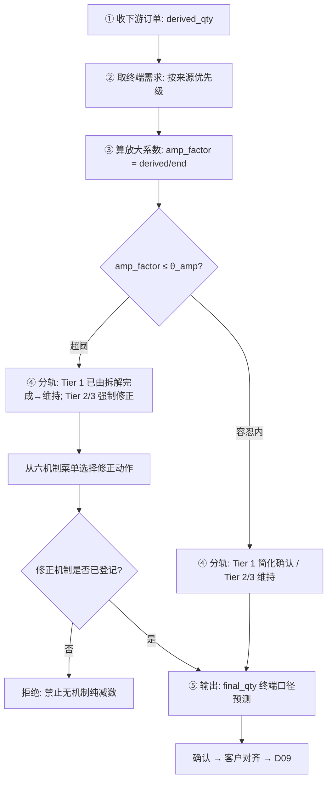

# bullwhip_correction · 应用详设（牛鞭修正处理）

> **来源**：聚合根识别第①步 `architecture.md` 聚合根 8
> **日期**：2026-08-08
> **对应 BRD**：`brd/毛需求管理详设.md` §2.7 D08 牛鞭修正处理表

---

## 1. 需求概览

### 1.1 基本信息
- **需求名称**: 牛鞭修正处理
- **需求编号**: REQ-parts-fc-D08
- **所属模块**: parts-fc · 毛需求加工链
- **需求来源**: BRD §2.7
- **创建日期**: 2026-08-08
- **优先级**: P0

### 1.2 需求背景
#### 1.2.1 为什么需要这个需求？

需求波动沿供应链向上游逐层放大——OEM 终端消耗波动约 +/-10%，而 Tier 3 供应商面对的订单波动可达 +/-50%。上游基于直接下游的订单（派生需求）而非终端需求做预测，订单已含下游的预测修正、安全库存调整与批量下单，层层放大失真。这是发布前的最后一道口径修正，必须把毛需求锚定终端需求。

#### 1.2.2 期望达到什么目标？

通过"收下游订单 → 取终端需求 → 算放大系数 → 按机制修正 → 输出终端口径预测"五步流程，让每一层基于终端需求预测而非派生需求，消除牛鞭效应放大。修正后的终端口径预测直接进入客户对齐与 D09 发布。

### 1.3 需求范围
#### 1.3.1 包含哪些功能？

牛鞭处理单创建（自动取派生需求+终端需求+算放大系数）、处理单详情查看、列表筛选查询、容忍内维持、超阈修正（六机制菜单+留痕）、确认流转

#### 1.3.2 不包含哪些功能？

D04 修正逻辑（D08 调的是口径锚，不推翻 D04 有据修正）、客户对齐（发布前动作非单据）、D09 发布合成（由 demand_release 负责）

### 1.4 涉及角色
**谁会使用这个功能？**

- **总部计划（核对人）**: 取终端数据、算放大系数、判定与修正、对终端口径负责
- **一线销售**: 推动客户协同渠道（消耗数据获取、信息共享协议），不直接操作 D08
- **系统**: 自动计算放大系数、超阈预警、终端来源按优先级自动带出

---

## 2. 用户故事

### 2.1 核心用户故事

#### 2.1.1 `US-01` 用户故事 — 创建牛鞭处理单（优先级：P1）

- **故事描述**: 作为总部计划，我想要创建牛鞭处理单，以便于系统自动取派生需求和终端需求、计算放大系数、判定是否需要修正
- **为何赋予此优先级**：处理单是所有后续操作的起点——没有处理单无法进行口径修正
- **独立测试**：可通过指定零件号+期间+层级创建处理单，验证系统自动汇总派生需求、终端需求并按优先级取终端来源来独立测试
- **前置条件**: D04 核定值可用（通用件场景须 D07 已确认）；终端需求数据源可访问
- **后置条件**: 处理单状态为"待处理"；derived_qty / end_qty / end_source / amp_factor 已自动填充；amp_verdict 已自动判定

**验收场景**：

1. `US-01-AC1` **场景**: Tier 1 直供正常创建
   - **Given** 零件 8210001, Tier 1, period 2026-09, D04 核定值=990, OEM 结算消耗=970, **When** 总部计划执行 `create("8210001", "2026-09", "Tier 1", derived_qty=990)`，**Then** amp_factor=1.02, amp_verdict="容忍内·维持", end_source="结算", 状态="待处理"

2. `US-01-AC2` **场景**: Tier 2 场景终端来源按优先级取
   - **Given** 零件 8220010, Tier 2, 既有结算数据又有外部映射数据，**When** 创建处理单，**Then** end_source="结算"（有结算不用外部映射），end_qty 取自结算数据

3. `US-01-AC3` **场景**: 通用件引用 D07 修正总量
   - **Given** 通用件 STD-M6, D07 已确认修正总量=82000，**When** 创建处理单，**Then** derived_qty=82000（取 D07 修正总量而非各客户 D04 核定值之和）

---

#### 2.1.2 `US-02` 用户故事 — 查看牛鞭处理单详情（优先级：P1）

- **故事描述**: 作为总部计划，我想要查看牛鞭处理单详情，以便于了解派生需求、终端需求、放大系数、修正动作与最终预测
- **为何赋予此优先级**：查看是判定与修正决策的前置步骤
- **独立测试**：可通过 bw_no 查询处理单全貌来独立测试
- **前置条件**: 处理单已创建
- **后置条件**: 无变化（只读）

**验收场景**：

1. `US-02-AC1` **场景**: 查看处理单
   - **Given** 处理单 BW-202609-001 已创建，**When** 总部计划执行 `get("BW-202609-001")`，**Then** 返回全部字段（含派生需求、终端需求及来源、放大系数、判定结果、修正动作、最终预测）

---

#### 2.1.3 `US-03` 用户故事 — 筛选牛鞭处理单列表（优先级：P2）

- **故事描述**: 作为总部计划，我想要按零件号、期间、层级、状态等条件筛选处理单列表
- **为何赋予此优先级**：列表查询是日常管理操作，不直接影响修正流程
- **独立测试**：可通过不同筛选条件查询处理单列表来独立测试
- **前置条件**: 系统中存在处理单
- **后置条件**: 无变化（只读）

**验收场景**：

1. `US-03-AC1` **场景**: 按层级筛选
   - **Given** 系统中存在 Tier 1 / Tier 2 / Tier 3 的处理单，**When** 筛选 `tier="Tier 2"`，**Then** 列表仅展示 Tier 2 处理单

2. `US-03-AC2` **场景**: 按判定结果筛选
   - **Given** 系统中存在"容忍内·维持"和"超阈·修正"的处理单，**When** 筛选 `amp_verdict="超阈·修正"`，**Then** 列表仅展示超阈需修正的处理单

---

#### 2.1.4 `US-04` 用户故事 — 容忍内维持（优先级：P1）

- **故事描述**: 作为总部计划，对于放大系数在容忍区间内的处理单，我想要执行维持操作，确认派生需求无需口径修正
- **为何赋予此优先级**：维持是 Tier 1 场景的主要路径，也是分流处理的关键判断
- **独立测试**：可通过维持操作验证状态流转来独立测试
- **前置条件**: 处理单状态为"待处理"；amp_verdict="容忍内·维持"
- **后置条件**: 状态 → "维持"；final_qty = derived_qty（或按口径取终端值）

**验收场景**：

1. `US-04-AC1` **场景**: Tier 1 直供维持
   - **Given** 零件 8210001, amp_factor=1.02 < θ_amp(1.10), amp_verdict="容忍内·维持"，**When** 总部计划执行 `maintain("BW-202609-001")`，**Then** 状态→"维持", final_qty=990（或取终端口径值）, corr_action 留空

---

#### 2.1.5 `US-05` 用户故事 — 超阈修正·六机制菜单（优先级：P0）

- **故事描述**: 作为总部计划，对于放大系数超阈的处理单，我想要从六机制菜单中选择修正动作并登记，以便于系统性地消除牛鞭放大
- **为何赋予此优先级**：修正是本应用的核心价值——Tier 2/3 场景的主战场
- **独立测试**：可通过修正操作验证机制选择、留痕三要素、final_qty 落定来独立测试
- **前置条件**: 处理单状态为"待处理"；amp_verdict="超阈·修正"；corr_action 机制已选择
- **后置条件**: 状态 → "已修正"；final_qty 已填写；corr_action 含机制+说明；留痕三要素齐全

**验收场景**：

1. `US-05-AC1` **场景**: 切换终端需求口径（治本）
   - **Given** 零件 8220010, Tier 2, derived_qty=1350, end_qty=1000, amp_factor=1.35 > θ_amp(1.10)，**When** 总部计划执行 `correct("BW-202609-002", corr_action="切换终端需求口径 + 信息共享上传", final_qty=1000)`，**Then** 状态→"已修正", final_qty=1000, corr_action 含机制+说明, checker+chk_date 已记录

2. `US-05-AC2` **场景**: 禁止无机制纯减数
   - **Given** 处理单超阈需修正，**When** 总部计划仅填写 final_qty 而不选择 corr_action 机制，**Then** 系统拒绝并提示"修正必须登记所落机制与依据，禁止无机制纯减数"

3. `US-05-AC3` **场景**: 组合机制修正
   - **Given** 零件 STD-M8, Tier 3, derived_qty=50000, end_qty=40000, amp_factor=1.25，**When** 总部计划选择"减小批量/平准化 + 安全库存协同"组合机制，final_qty=40000，**Then** corr_action 记录两个机制及各自说明，留痕三要素完整

---

#### 2.1.6 `US-06` 用户故事 — 确认牛鞭处理单（优先级：P1）

- **故事描述**: 作为总部计划，我想要确认处理单，以便于终端口径预测流转至 D09 发布
- **为何赋予此优先级**：确认是牛鞭修正的最终关口，未确认的结果不得进入发布
- **独立测试**：可通过确认操作验证状态流转来独立测试
- **前置条件**: 状态为"维持"或"已修正"；final_qty 已确定
- **后置条件**: 状态 → "已确认（转发布）"；终端口径预测可被 D09 引用

**验收场景**：

1. `US-06-AC1` **场景**: 维持后确认
   - **Given** 处理单 BW-202609-001 状态为"维持", final_qty=990，**When** 总部计划执行 `confirm("BW-202609-001")`，**Then** 状态→"已确认（转发布）"

2. `US-06-AC2` **场景**: 修正后确认
   - **Given** 处理单 BW-202609-002 状态为"已修正", final_qty=1000, corr_action 已登记，**When** 总部计划执行 `confirm("BW-202609-002")`，**Then** 状态→"已确认（转发布）"

3. `US-06-AC3` **场景**: 待处理不可确认
   - **Given** 处理单状态为"待处理"（尚未 maintain 或 correct），**When** 执行 confirm，**Then** 系统拒绝并提示"请先完成维持或修正操作"

---

## 3. 业务场景

### 3.1 业务流程描述

#### 3.1.1 场景1: 牛鞭修正五步完整流程



1. **收下游订单**：直接下游客户的订单/要货（Tier 1 场景 = D04/D07 核定的消耗口径链值；Tier 2/3 取实际下游订单）
2. **取终端需求**，来源优先级：OEM 结算（寄售领用）> OEM 消耗数据（客户协同）> 外部数据（上险数/整车销量 x D02 映射）> OEM 排产
3. **算放大系数**：`amp_factor = derived_qty / end_qty`（系统自动计算）
4. **判定**：amp_factor <= theta_amp（容忍区间）-> 维持；超阈 -> 从修正机制菜单选择动作并登记
5. **输出**：final_qty（终端口径预测）-> 客户对齐 -> D09

#### 3.1.2 场景2: 分层治理——Tier 1 vs Tier 2/3

1. 所有零件过层级判定（按客户关系/供应链位置）
2. Tier 1 直供且已拆解（D03 信号拆解已完成大部分放大修正）：
   - amp_factor ≈ 1.0（通常在 0.95~1.10 之间）-> 简化确认（maintain）
   - D08 只做确认不做深度修正
3. Tier 2/Tier 3：
   - 派生需求层层放大 -> 强制修正分析（correct）
   - 须显式取终端口径、选择修正机制、登记留痕

### 3.2 业务规则

#### 3.2.1 `BR-01` 规则: 全覆盖、分轨处理
- **规则描述**: 所有零件必须经过层级判定（Tier 1 / Tier 2 / Tier 3）；Tier 1 直供且已拆解 -> 简化确认；Tier 2/Tier 3 -> 强制修正分析
- **适用场景**: create 时的层级判定与路径分流
- **示例**: 零件 8210001 Tier 1 -> maintain 路径；零件 8220010 Tier 2 -> correct 路径

#### 3.2.2 `BR-02` 规则: 终端来源优先级不可跳级
- **规则描述**: 取终端需求时严格按优先级：结算 > OEM 消耗 > 外部映射 > 排产；有高优先级数据源时不得使用低优先级来源
- **适用场景**: create 时自动取终端需求
- **示例**: 既有结算数据又有外部映射 -> end_source 必须取"结算"，不可因外部映射值更大而选用

#### 3.2.3 `BR-03` 规则: 放大系数容忍阈值
- **规则描述**: 放大系数 <= theta_amp（容忍区间，建议值 1.10，可按层级/客户配置）-> 维持；超阈 -> 修正
- **适用场景**: create 时系统自动判定 amp_verdict；参数 theta_amp 来自系统配置
- **示例**: amp_factor=1.02 <= 1.10 -> "容忍内·维持"；amp_factor=1.35 > 1.10 -> "超阈·修正"

#### 3.2.4 `BR-04` 规则: 修正必须登记所落机制与依据（留痕三要素）
- **规则描述**: 超阈修正必须填写 corr_action（机制菜单 + 说明）；禁止"无机制纯减数"——只改 final_qty 不选机制则拒绝
- **适用场景**: correct 操作
- **示例**: corr_action="切换终端需求口径（终端需求可见机制）+ 信息共享上传", final_qty=1000 -> 通过；仅 final_qty=1000 不选机制 -> 拒绝

#### 3.2.5 `BR-05` 规则: 修正不改合理修订
- **规则描述**: D08 调的是口径锚（派生 vs 终端），不推翻 D04 有据修正；终端需求与修正结论冲突时记录冲突、升级产销平衡会
- **适用场景**: correct 操作中 D04 修正与终端需求分歧时
- **示例**: D04 销售修正有充分证据支持 1200，但终端需求口径仅 1000 -> 不推翻 D04，记录冲突原因并升级

#### 3.2.6 `BR-06` 规则: 输出纪律
- **规则描述**: 修正后预测（final_qty）= 毛需求消耗部分的最终口径，直接进客户对齐与 D09；未确认的处理单结果不得被下游引用
- **适用场景**: final_qty 的生命周期管理
- **示例**: D09 create_draft 可通过 `self.fde.call` 取已确认的 final_qty 作为 cons_qty

#### 3.2.7 `BR-07` 规则: 零件号 × 期间唯一
- **规则描述**: 同一零件号 + 同一期间不可重复创建牛鞭处理单
- **适用场景**: create 时唯一性校验
- **示例**: 已存在 8210001 × 2026-09 的处理单 -> 再次创建拒绝

#### 3.2.8 `BR-08` 规则: 字段级校验规则
- **bw_no**: 必填，格式 `BW-YYYYMM-NNN`，唯一
- **part_no**: 必填，引用物料主数据
- **period**: 必填，格式 YYYY-MM
- **tier**: 必填，Enum: Tier 1 直供 / Tier 2 / Tier 3
- **derived_qty**: 必填，Decimal > 0，通用件场景取 D07 修正总量
- **end_qty**: 必填，Decimal > 0，按来源优先级自动取数
- **end_source**: 必填，Enum: 结算 / OEM 消耗 / 外部映射 / 排产
- **amp_factor**: 必填，Decimal > 0，系统计算 = derived_qty / end_qty
- **amp_verdict**: 必填，Enum: 容忍内·维持 / 超阈·修正（系统自动判定）
- **corr_action**: 条件必填（correct 时），Enum+Text: 六机制菜单 + 说明文字
- **final_qty**: 必填，Decimal > 0，终端口径预测值
- **checker / chk_date**: 必填，Ref(User) / Date，核对人与核对日期
- **status**: 必填，Enum: 待处理 / 维持 / 已修正 / 已确认（转发布）

### 3.3 业务数据

#### 3.3.1 数据1: 下游订单（派生需求 derived_qty）
- **数据描述**: 直接下游客户的订单/要货量，Tier 1 场景 = D04/D07 核定的消耗口径链值
- **数据类型**: Decimal
- **数据来源**: `demand_processing.get_approved`（专用件）/ `common_parts_agg.get`（通用件取 D07 修正总量）
- **示例值**: 990

#### 3.3.2 数据2: 终端需求（end_qty）
- **数据描述**: OEM 终端消耗口径的需求量，用于与派生需求对比
- **数据类型**: Decimal
- **数据来源**: 按优先级自动取——结算（寄售领用）> OEM 消耗数据（客户协同）> 外部数据（上险数/整车销量 × D02 映射）> OEM 排产
- **示例值**: 970

#### 3.3.3 数据3: 放大系数（amp_factor）
- **数据描述**: 反映牛鞭放大程度的量化指标
- **数据类型**: Decimal
- **数据来源**: 系统自动计算 = derived_qty / end_qty
- **示例值**: 1.02

#### 3.3.4 数据4: 修正动作（corr_action）
- **数据描述**: 从六机制菜单选择的修正动作及说明
- **数据类型**: Enum + Text
- **数据来源**: 核对人选择 + 填写
- **示例值**: `{"mechanism": "终端需求可见", "action": "切换终端需求口径 + 信息共享上传", "detail": "..."}`

#### 3.3.5 数据5: 修正后预测（final_qty）
- **数据描述**: 终端口径预测值，毛需求消耗部分的最终口径
- **数据类型**: Decimal
- **数据来源**: 维持时 = derived_qty（或终端值）；修正时 = 核对人按机制确定
- **示例值**: 1000

#### 3.3.6 数据6: 六机制菜单
- **数据描述**: 牛鞭修正的六种可选机制
- **数据类型**: Enum
- **数据来源**: 系统配置固定菜单
- **可选值**: 终端需求可见 / 信息共享上传 / 按预测准确率分配 / 减小批量·平准化 / 安全库存协同 / 缩短提前期

### 3.4 状态机

```
(新建) --create()--> 待处理
待处理 --amp_factor ≤ θ_amp, maintain()--> 维持 --confirm()--> 已确认（转发布）
待处理 --amp_factor > θ_amp, correct()--> 已修正 --confirm()--> 已确认（转发布）
```

**状态转换规则矩阵：**

| 当前状态 | 目标状态 | 触发动作 | 前置条件 |
|----------|----------|----------|----------|
| (新建) | 待处理 | create(part_no, period, tier, derived_qty) | 零件+期间唯一；derived_qty > 0；终端数据源可用 |
| 待处理 | 维持 | maintain(bw_no) | amp_factor ≤ θ_amp（容忍区间）；final_qty 可确定 |
| 待处理 | 已修正 | correct(bw_no, corr_action, final_qty) | amp_factor > θ_amp（超阈）；corr_action 必须包含机制菜单+说明；final_qty > 0 |
| 维持 | 已确认 | confirm(bw_no) | final_qty 已确定 |
| 已修正 | 已确认 | confirm(bw_no) | corr_action 留痕三要素完整；checker 已记录 |
| 已确认 | (转发布) | 下游 demand_release.create_draft 引用 | — |

---

## 4. 功能描述

### 4.1 功能清单

| 一级菜单/模块 | 一级模块编号 | 二级菜单/模块 | 二级模块编号 | 三级功能 | 三级功能编号 | 功能类型 | 优先级 | 三级功能简述 |
|--------------|------------|--------------|------------|---------|------------|--------|-------|------------|
| 牛鞭修正处理 | F01 | — | — | 创建牛鞭处理单 | F01-01 | 接口 | P1 | 指定零件+期间+层级，自动取派生/终端需求并算放大系数 |
| 牛鞭修正处理 | F01 | — | — | 查看处理单详情 | F01-02 | 详情页 | P1 | 查看派生需求、终端需求、放大系数、修正动作与最终预测 |
| 牛鞭修正处理 | F01 | — | — | 处理单列表查询 | F01-03 | 列表页 | P2 | 按零件号/期间/层级/状态筛选处理单 |
| 牛鞭修正处理 | F01 | — | — | 容忍内维持 | F01-04 | 接口 | P1 | Amp在容忍区间内→维持，确认终端口径无需修正 |
| 牛鞭修正处理 | F01 | — | — | 超阈修正·六机制 | F01-05 | 表单页 | P0 | 从六机制菜单选修正动作+登记留痕，输出终端口径预测 |
| 牛鞭修正处理 | F01 | — | — | 确认处理单 | F01-06 | 接口 | P1 | 确认后终端口径预测流转至D09发布 |

### 4.2 功能模块结构图

```
牛鞭修正处理 (F01, P0)
├── F01-01 创建牛鞭处理单 (接口, P1)
├── F01-02 查看处理单详情 (详情页, P1)
├── F01-03 处理单列表查询 (列表页, P2)
├── F01-04 容忍内维持 (接口, P1)
├── F01-05 超阈修正·六机制 (表单页, P0)
└── F01-06 确认处理单 (接口, P1)
```

### 4.3 功能详细说明

#### 4.3.1 F01-01 创建牛鞭处理单

**功能描述**:
总部计划指定零件号、期间和层级，系统自动取下游订单（派生需求，通过 `self.fde.call` 调用 `demand_processing.get_approved` 或 `common_parts_agg.get`），自动按优先级取终端需求数据，计算放大系数并判定 amp_verdict。

**用户操作流程**:
1. 用户选择零件号、期间、层级（Tier 1/2/3）
2. 系统校验：同零件+期间无重复处理单
3. 系统取派生需求：专用件 -> `demand_processing.get_approved`；通用件 -> `common_parts_agg.get`（取 D07 修正总量）
4. 系统按优先级取终端需求：结算 > OEM 消耗 > 外部映射 > 排产，确定 end_qty / end_source
5. 系统计算 amp_factor = derived_qty / end_qty
6. 系统自动判定 amp_verdict（对 theta_amp）
7. 创建成功，状态 → "待处理"

**业务实体**:
- **BullwhipCorrection（单实体，无子表）**: 牛鞭处理单，聚合根

**BullwhipCorrection 字段**

| 字段名称 | 字段类型 | 是否必填 | 默认值 | 业务逻辑 |
|----------|---------|---------|--------|---------|
| bw_no | 文本 | 否（自动生成） | BW-YYYYMM-NNN | 系统自动生成，全局唯一；格式 BW+8位年月+3位流水 |
| part_no | 引用 | 是 | — | 引用物料主数据 |
| period | 文本(YYYY-MM) | 是 | — | 处理粒度，同零件+期间唯一 |
| tier | 枚举 | 是 | — | Tier 1 直供 / Tier 2 / Tier 3，按客户关系判定 |
| derived_qty | Decimal | 是 | — | 下游订单/核定链值，通用件取 D07 修正总量 |
| end_qty | Decimal | 是 | — | 终端需求（消耗口径），按来源优先级自动取数 |
| end_source | 枚举 | 是 | — | 结算 / OEM 消耗 / 外部映射 / 排产（不可跳级） |
| amp_factor | Decimal | 否（自动计算） | — | derived_qty / end_qty，系统自动计算，不可手动编辑 |
| amp_verdict | 枚举 | 否（自动判定） | — | 容忍内·维持 / 超阈·修正；amp_factor ≤ θ_amp → 维持，否则修正 |
| corr_action | 文本(Enum+Text) | 条件必填 | — | correct 时必填；六机制菜单 + 说明文字；格式 `{"mechanisms": [...], "detail": "..."}` |
| final_qty | Decimal | 是 | — | 终端口径预测值；维持时=derived_qty（或终端值），修正时由核对人确定 |
| checker | 引用(User) | 是 | — | 核对人，须为总部计划角色 |
| chk_date | Date | 是 | — | 核对日期，系统自动记录 |
| status | 枚举 | 是 | 待处理 | 待处理 / 维持 / 已修正 / 已确认（转发布） |

**特殊处理**:
- `create` 内部：专用件调 `demand_processing.get_approved(proc_batch, part_no, period)` 取派生需求
- `create` 内部：通用件调 `common_parts_agg.get(agg_no)` 取 D07 修正总量作为 derived_qty
- `create` 内部：取终端需求时可通过 `vehicle_part_map.get_active_mapping` 获取外部映射数据
- theta_amp 初始值 1.10，可按层级/客户从系统配置读取
- 自动判定 amp_verdict：amp_factor <= theta_amp -> "容忍内·维持"；amp_factor > theta_amp -> "超阈·修正"

---

#### 4.3.2 F01-02 查看处理单详情

**功能描述**:
返回处理单全部字段（派生需求、终端需求及来源、放大系数、判定结果、修正动作、最终预测）。总部计划可查看全貌。

**用户操作流程**:
1. 用户提供 bw_no
2. 系统返回全部字段

---

#### 4.3.3 F01-03 处理单列表查询

**功能描述**:
按零件号、期间、层级（tier）、状态、判定结果（amp_verdict）等条件筛选处理单列表，支持分页。

**用户操作流程**:
1. 用户输入筛选条件（可选）：part_no / period / tier / status / amp_verdict
2. 系统返回符合条件的处理单列表（分页）

---

#### 4.3.4 F01-04 容忍内维持

**功能描述**:
对于放大系数在容忍区间（amp_factor <= theta_amp）的处理单，核对人确认终端口径无需修正，维持当前值。

**用户操作流程**:
1. 用户指定 bw_no
2. 系统校验：status="待处理"；amp_verdict="容忍内·维持"
3. 确定 final_qty：通常 = derived_qty 或取终端口径值（Tier 1 直供可取 derived_qty）
4. 记录 checker / chk_date
5. 状态 → "维持"

**特殊处理**:
- Tier 1 直供且已拆解（D03 信号拆解已完成放大修正）：简化确认即过，是批量化高频路径
- Tier 2/3 即使判定"容忍内·维持"也应审慎确认（小概率场景）

---

#### 4.3.5 F01-05 超阈修正·六机制

**功能描述**:
对于放大系数超阈（amp_factor > theta_amp）的处理单，核对人从六机制菜单中选择修正动作并登记留痕三要素（机制+依据+核对人），确定终端口径预测值 final_qty。这是本应用的核心功能——Tier 2/3 的主战场。

**用户操作流程**:
1. 用户打开处理单详情（含派生需求、终端需求、放大系数）
2. 审阅放大系数与超阈警告
3. 从六机制菜单选择一个或多个修正机制：
   - 终端需求可见（治本）：基于 OEM 实际消耗/整车销量预测，而非下游订单
   - 信息共享上传：真实消耗信息向上游逐层共享
   - 按预测准确率分配：不按报单量分配，消除短缺博弈
   - 减小批量/平准化：小批量高频补货，降低批量放大
   - 安全库存协同：避免各层独立叠加
   - 缩短提前期：降低需用预测覆盖的不确定性
4. 填写修正说明（detail，描述具体做法与依据）
5. 确定 final_qty（终端口径预测值，通常锚定 end_qty）
6. 提交，系统校验：corr_action 非空且含机制枚举 + 说明；final_qty > 0
7. 记录 checker / chk_date
8. 状态 → "已修正"

**业务规则**:
- 修正动作以口径切换为首选（治本），批量/安全库存/提前期措施为配套
- 禁止"无机制纯减数"——只改 final_qty 不选 corr_action 机制时系统拒绝
- 修正不改 D04 合理修订：D08 调的是口径锚，如终端需求与 D04 修正结论冲突，记录冲突并升级产销平衡会

**特殊处理**:
- 六机制支持多选组合（如"终端需求可见 + 信息共享上传"）
- 通用件场景：修正动作考虑通用件的总量特性

---

#### 4.3.6 F01-06 确认处理单

**功能描述**:
核对人确认处理单，状态流转至"已确认（转发布）"，终端口径预测可供 D09 发布引用。

**用户操作流程**:
1. 用户指定 bw_no
2. 系统校验：status 为"维持"或"已修正"；final_qty 已确定；checker 已记录
3. 确认成功，状态 → "已确认（转发布）"
4. D09 create_draft 可通过 `self.fde.call` 调 `get(bw_no)` 取 final_qty 作为 cons_qty

---

## 5. 权限要求

### 5.1 功能权限

| 功能名称 | 权限标识 | 总部计划 | 一线销售 | 系统 |
|----------|---------|---------|---------|------|
| 创建牛鞭处理单 | `parts-fc:bullwhip-correction:create` | 可访问 | 不可访问 | 可访问(自动触发) |
| 查看处理单详情 | `parts-fc:bullwhip-correction:query` | 可访问 | 可访问(只读) | 可访问 |
| 处理单列表查询 | `parts-fc:bullwhip-correction:list` | 可访问 | 可访问 | 可访问 |
| 容忍内维持 | `parts-fc:bullwhip-correction:maintain` | 可访问 | 不可访问 | 不可访问 |
| 超阈修正·六机制 | `parts-fc:bullwhip-correction:correct` | 可访问 | 不可访问 | 不可访问 |
| 确认处理单 | `parts-fc:bullwhip-correction:confirm` | 可访问 | 不可访问 | 不可访问 |

### 5.2 数据权限

#### 5.2.1 总部计划（核对人）
- 可查看和操作所有零件的牛鞭处理单（全量）
- 可执行 maintain / correct / confirm
- 对终端口径预测（final_qty）负责

#### 5.2.2 一线销售
- 只可查看牛鞭处理单详情（只读），用于了解本客户相关零件的终端口径修正结论
- 不可执行任何写操作
- 职责：推动客户协同渠道（消耗数据获取、信息共享协议），提供终端需求数据源

---

## 6. 验收标准

### 6.1 功能验收标准

#### 6.1.1 标准1: 牛鞭处理单创建与自动计算
- **关联用户故事**: US-01
- **关联业务规则**: BR-01, BR-02, BR-03, BR-07
- **验证方式**: Tier 1 / Tier 2 两种场景分别创建
- **测试数据**: Tier 1: 8210001, derived_qty=990, end_qty=970 -> amp_factor=1.02；Tier 2: 8220010, derived_qty=1350, end_qty=1000 -> amp_factor=1.35
- **预期结果**: Tier 1 amp_verdict="容忍内·维持"；Tier 2 amp_verdict="超阈·修正"；end_source 按优先级正确取值

#### 6.1.2 标准2: 终端来源优先级不可跳级
- **关联用户故事**: US-01
- **关联业务规则**: BR-02
- **验证方式**: 同时有结算和外部映射数据时
- **测试数据**: 结算数据=970，外部映射数据=980
- **预期结果**: end_source="结算", end_qty=970（有结算不用外部映射）

#### 6.1.3 标准3: 超阈修正·留痕三要素
- **关联用户故事**: US-05
- **关联业务规则**: BR-04
- **验证方式**: 超阈处理单执行 correct，验证机制+依据+核对人完整
- **测试数据**: bw_no=BW-202609-002, corr_action="切换终端需求口径 + 信息共享上传", final_qty=1000
- **预期结果**: 修正成功，状态→"已修正"，corr_action 含机制菜单+说明，checker+chk_date 已记录

#### 6.1.4 标准4: 禁止无机制纯减数
- **关联用户故事**: US-05
- **关联业务规则**: BR-04
- **验证方式**: 仅填 final_qty 不选 corr_action
- **测试数据**: final_qty=800, corr_action 为空
- **预期结果**: 系统拒绝，提示"修正必须登记所落机制与依据，禁止无机制纯减数"

#### 6.1.5 标准5: 分轨处理验证
- **关联用户故事**: US-04, US-05
- **关联业务规则**: BR-01
- **验证方式**: Tier 1 执行 maintain、Tier 2 执行 correct
- **测试数据**: Tier 1: amp_factor=1.02 -> maintain；Tier 2: amp_factor=1.35 -> correct
- **预期结果**: Tier 1 维持成功（简化确认）；Tier 2 强制修正分析入口激活

#### 6.1.6 标准6: 状态流转完整性
- **关联用户故事**: US-04, US-05, US-06
- **关联业务规则**: 状态机
- **验证方式**: 容忍内路径和超阈路径分别验证
- **测试数据**: 两条处理单分别走 maintain+confirm 和 correct+confirm
- **预期结果**: 待处理→维持→已确认；待处理→已修正→已确认

### 6.2 非功能验收标准
- **性能要求**: 处理单创建（含跨应用取参）响应时间 < 10 秒
- **安全性要求**: 修正操作仅总部计划可执行；corr_action 登记后不可被一线销售修改
- **数据准确性**: amp_factor 由系统计算不可手动编辑；final_qty > 0

### 6.3 已知问题或限制
- theta_amp 初始建议值 1.10，需历史回测校准后按层级/客户精细配置
- 外部数据（上险数/整车销量）的爬取与清洗不在本应用范围，由外部数据源台账提供
- Tier 2/3 场景终端需求取数可能依赖外部映射（D02），映射精度影响修正效果
- 终端需求与 D04 修正结论冲突升级到产销平衡会——本应用不做最终仲裁

---

## 7. 参考资料

### 7.1 相关文档
- 聚合根识别: `app/parts-fc/architecture.md` 聚合根 8
- BRD 原始需求: `app/parts-fc/brd/毛需求管理详设.md` §2.7 (行 1309-1410)
- 模板规格: `design/应用设计.md`

### 7.2 相关功能
- **demand_processing (D04)**: 提供专用件核定链值（derived_qty 来源之一）
- **common_parts_agg (D07)**: 提供通用件修正总量（derived_qty 来源之一）
- **vehicle_part_map (D02)**: 提供外部映射数据（终端需求来源之一）
- **demand_release (D09)**: 消费本应用的 final_qty 作为 cons_qty（消耗驱动量）
- **demand_collection (D03)**: Tier 1 直供场景的信号拆解已完成大部分放大修正

### 7.3 外部依赖
| 依赖 | 调用方式 | 说明 |
|------|---------|------|
| demand_processing.get_approved | `self.fde.call` | 取专用件核定值作为派生需求（create 时调用） |
| common_parts_agg.get | `self.fde.call` | 通用件场景取 D07 修正总量（create 时调用） |
| vehicle_part_map.get_active_mapping | `self.fde.call` | 外部映射场景取终端需求（create 时调用） |
| 物料主数据 | 接口只读引用 | 零件号权威源在外部 MDM |
| 外部数据源台账 | 接口只读引用 | 上险数/整车销量等外部数据 |
| 系统配置（θ_amp） | 只读 | 容忍阈值的参数配置 |

### 7.4 备注
- 六机制菜单为固定枚举（终端需求可见/信息共享上传/按预测准确率分配/减小批量·平准化/安全库存协同/缩短提前期），不支持动态扩展——新增机制走系统配置变更
- 修正动作以口径切换为首选（治本），批量/安全库存/提前期措施为配套
- 牛鞭修正是发布前的最后一道口径修正，未确认的结论不得进入 D09
