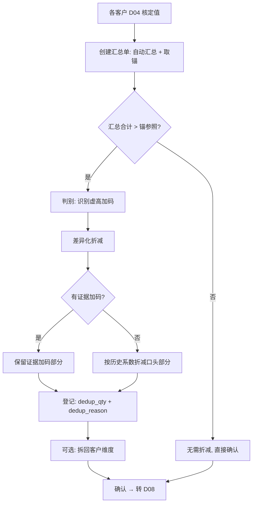

# common_parts_agg · 应用详设（通用件汇总修正）

> **来源**：聚合根识别第①步 `architecture.md` 聚合根 7
> **日期**：2026-08-08
> **对应 BRD**：`brd/毛需求管理详设.md` §2.6 D07 通用件汇总修正表

---

## 1. 需求概览

### 1.1 基本信息
- **需求名称**: 通用件汇总修正
- **需求编号**: REQ-parts-fc-D07
- **所属模块**: parts-fc · 毛需求加工链
- **需求来源**: BRD §2.6
- **创建日期**: 2026-08-08
- **优先级**: P0

### 1.2 需求背景
#### 1.2.1 为什么需要这个需求？

通用件跨多个客户/车型使用，多家一线销售各自从自身客户立场加码（缓冲、筹码、考核），且各自默认"我的加码不会被折"。D04 逐个核对只看到各客户维度、看不见总量虚高。个体理性导致集体虚高——汇总必然大于真实需求，产生"公地悲剧"。

#### 1.2.2 期望达到什么目标？

在总量层面对通用件进行跨销售汇总去重修正，以锚参照（历史实际/池化预测/因果合计）为基准，通过差异化折减把虚高部分剔除，产出可进入 D08 的修正总量。总部计划对总量负责，对抗公地悲剧。

### 1.3 需求范围
#### 1.3.1 包含哪些功能？

通用件汇总单创建（自动汇总各客户 D04 核定值）、汇总详情查看（含锚对照+证据结构）、列表筛选查询、去重修正（差异化折减）、修正确认（转 D08）

#### 1.3.2 不包含哪些功能？

专用件处理（系统自动分流跳过本单据）、各客户 D04 核定值的修改（只调总量不回退个体）、D08 牛鞭修正（由 bullwhip_correction 负责）、客户对齐（发布前动作，非单据）

### 1.4 涉及角色
**谁会使用这个功能？**

- **总部计划（修正人）**: 执行汇总、取锚、折减修正、对修正后的总量负责；通用件呆滞考核上移至总量/后端层面
- **一线销售**: 提供加码的客户侧证据（继承 D04 举证）；查看本客户份额与拆回结果
- **系统**: 自动汇总计算、锚自动带出、折减系数建议、专用件分流

---

## 2. 用户故事

### 2.1 核心用户故事

#### 2.1.1 `US-01` 用户故事 — 创建通用件汇总单（优先级：P1）

- **故事描述**: 作为总部计划，我想要创建通用件汇总单，以便于系统自动汇总各客户 D04 核定值并带出锚参照，为去重修正提供决策基础
- **为何赋予此优先级**：汇总单是整个去重修正流程的起点，没有汇总单则无法进行任何修正
- **独立测试**：可通过指定通用件号和期间创建汇总单，验证系统自动汇总各客户 D04 核定值、自动带出三类锚参照来独立测试
- **前置条件**: D04 加工批次中该通用件各客户份额已全部核定（approved_qty 可用）；零件号在 D01/D02 中标记为"通用"
- **后置条件**: 汇总单状态为"待汇总"；sum_qty 已计算；anchor_ref 已填充三类锚参照

**验收场景**：

1. `US-01-AC1` **场景**: 通用件正常汇总
   - **Given** 通用件 STD-M6 在 2026-09 期间有三个客户份额（A: 32000, B: 28000, C: 25000）均已核定，**When** 总部计划创建汇总单 `create("STD-M6", "2026-09")`，**Then** 系统自动汇总 sum_qty=85000，自动填充三类锚参照（历史实际/池化预测/因果合计），状态为"待汇总"

2. `US-01-AC2` **场景**: 专用件被拒绝
   - **Given** 零件 8210001 在 D01/D02 中标记为"专用"，**When** 尝试创建汇总单，**Then** 系统拒绝并提示"该零件为专用件，不进通用件汇总修正流程"

3. `US-01-AC3` **场景**: 部分客户未核定时报错
   - **Given** 通用件 STD-M6 主机厂 B 的 D04 修正尚未核定，**When** 创建汇总单，**Then** 系统提示"以下客户份额尚未核定：主机厂B"，阻止创建

---

#### 2.1.2 `US-02` 用户故事 — 查看通用件汇总单（优先级：P1）

- **故事描述**: 作为总部计划或一线销售，我想要查看通用件汇总单详情，以便于了解汇总合计、锚对照、证据结构以及拆回分配
- **为何赋予此优先级**：查看是修正决策和一线销售了解份额变化的基础操作
- **独立测试**：可通过 agg_no 查询汇总单全貌（含单头汇总+锚对照+明细证据结构）来独立测试
- **前置条件**: 汇总单已创建
- **后置条件**: 无变化（只读）

**验收场景**：

1. `US-02-AC1` **场景**: 总部计划查看汇总单全貌
   - **Given** 汇总单 AGG-202609-001 已创建，**When** 总部计划执行 `get("AGG-202609-001")`，**Then** 返回单头汇总信息 + 锚对照三锚 + 各客户证据结构明细 + 拆回分配（如有）

2. `US-02-AC2` **场景**: 一线销售查看本客户份额
   - **Given** 汇总单 AGG-202609-001 已创建，**When** 销售张三查询，**Then** 返回汇总单信息，其中明细仅展示张三负责的主机厂A份额行（数据权限过滤），不展示其他客户份额

---

#### 2.1.3 `US-03` 用户故事 — 筛选通用件汇总单列表（优先级：P2）

- **故事描述**: 作为总部计划，我想要按通用件号、期间、状态等条件筛选汇总单列表，以便于快速定位需要处理的汇总单
- **为何赋予此优先级**：列表查询是日常管理操作，但不直接影响修正流程
- **独立测试**：可通过不同筛选条件查询汇总单列表来独立测试
- **前置条件**: 系统中存在汇总单
- **后置条件**: 无变化（只读）

**验收场景**：

1. `US-03-AC1` **场景**: 按状态筛选
   - **Given** 系统中存在"待修正"和"已修正"状态的汇总单，**When** 筛选 `status="待修正"`，**Then** 列表仅展示待修正的汇总单

2. `US-03-AC2` **场景**: 按期间筛选
   - **Given** 系统中存在 2026-09 和 2026-10 期间的汇总单，**When** 筛选 `period="2026-09"`，**Then** 列表仅展示 2026-09 期间的汇总单

---

#### 2.1.4 `US-04` 用户故事 — 去重修正（差异化折减）（优先级：P0）

- **故事描述**: 作为总部计划，我想要对通用件汇总单执行去重修正（差异化折减），以便于产出合理的修正总量，对抗公地悲剧
- **为何赋予此优先级**：去重修正是本应用的核心价值——没有修正就没有总量把关
- **独立测试**：可通过执行 revise 操作、验证差异化折减逻辑来独立测试
- **前置条件**: 汇总单状态为"待修正"或"待汇总"；判别已触发（汇总合计显著高于锚参照）
- **后置条件**: dedup_qty / dedup_pct / dedup_reason 已填写；split_qty 可选填写；状态 → "已修正"；修正人与时间已记录

**验收场景**：

1. `US-04-AC1` **场景**: 差异化折减——有证据保留、口头折减
   - **Given** 汇总合计=85000, 锚参照≈79000, 其中主机厂B有函件加码1200, 三家口头加码合计4700, 历史回测折减系数约64%，**When** 总部计划执行 `revise("AGG-202609-001", dedup_qty=82000, dedup_reason="函件加码保留；口头加码按历史实际用量折减约65%")`，**Then** dedup_qty=82000, dedup_pct≈−3.53%, 函件加码1200未被折减, 口头加码4700折减3000, 状态→"已修正"

2. `US-04-AC2` **场景**: 折减不得低于承诺量
   - **Given** 某客户有已确认承诺量5000（函件锁定），**When** 修正拟将总量折减至低于各客户承诺量合计，**Then** 系统拒绝并提示"折减后总量不得低于已确认承诺量合计"

3. `US-04-AC3` **场景**: 无依据不得拍脑袋折减
   - **Given** 汇总单的 anchor_ref 尚未完整填写（三锚中至少一锚缺失），**When** 执行 revise 操作，**Then** 系统拒绝并提示"请先完成锚参照取数，折减必须有数据依据"

---

#### 2.1.5 `US-05` 用户故事 — 确认通用件汇总修正（优先级：P1）

- **故事描述**: 作为总部计划，我想要确认已修正的汇总单，以便于修正总量流转至 D08 牛鞭修正
- **为何赋予此优先级**：确认是汇总单流转至下游的关键门槛
- **独立测试**：可通过确认操作验证状态流转来独立测试
- **前置条件**: 状态为"已修正"；dedup_qty / dedup_reason 已完整填写
- **后置条件**: 状态 → "已确认"；修正总量可被 D08 引用

**验收场景**：

1. `US-05-AC1` **场景**: 正常确认
   - **Given** 汇总单 AGG-202609-001 已修正（dedup_qty=82000, dedup_reason 已填写），**When** 总部计划执行 `confirm("AGG-202609-001")`，**Then** 状态→"已确认"，D08 可引用该修正总量

2. `US-05-AC2` **场景**: 未修正不可确认
   - **Given** 汇总单状态为"待汇总"（尚未执行 revise），**When** 执行 confirm，**Then** 系统拒绝并提示"请先完成去重修正后再确认"

---

## 3. 业务场景

### 3.1 业务流程描述

#### 3.1.1 场景1: 通用件汇总修正完整流程



1. 系统自动取各客户 D04 核定值（通过 `self.fde.call` 调 `demand_processing.get_approved`），汇总为 sum_qty
2. 系统自动取三类锚参照：历史实际用量、池化预测（通过 `self.fde.call` 调 `baseline_borrowing.get_derived_qty`）、因果合计（车型产量 x 单车用量 x 份额）
3. 总部计划审阅锚对照，判别：汇总合计显著高于锚且加码缺乏需求侧证据 → 触发折减
4. 差异化折减：有证据加码（客户函件/促销/上市，继承 D04 举证）保留；口头/无证据加码按历史折减系数折减；下限不低于已确认承诺量
5. 登记修正结论（dedup_qty / dedup_pct / dedup_reason）+ 可选拆回分配（split_qty）
6. 确认，修正总量进入 D08

#### 3.1.2 场景2: 专用件自动分流

1. 系统在 D04 核定完成后，按 D01/D02 标记自动判断零件类型
2. 专用件 → 直接从 D04 直入 D08，跳过本应用
3. 通用件 → 进入本应用，执行汇总修正流程

### 3.2 业务规则

#### 3.2.1 `BR-01` 规则: 仅通用件进入
- **规则描述**: 仅 D01/D02 中标记为"通用"的零件经过本单据；专用件系统自动分流，直接从 D04 直入 D08
- **适用场景**: 创建汇总单时的入口校验
- **示例**: 零件 STD-M6（通用）→ 进入 D07；零件 8210001（专用）→ 系统拒绝创建汇总单，自动跳过

#### 3.2.2 `BR-02` 规则: 汇总粒度唯一性
- **规则描述**: 通用件号 × 期间唯一标识一张汇总单，同一通用件同一期间不可重复创建
- **适用场景**: 创建汇总单时
- **示例**: 已存在 STD-M6 × 2026-09 的汇总单，再次创建 → 拒绝，提示"该通用件该期间已存在汇总单"

#### 3.2.3 `BR-03` 规则: 折减必有依据
- **规则描述**: 去重修正必须基于锚参照对照（三锚至少引用其一）和证据清单；无锚、无证据清单不得执行折减
- **适用场景**: revise 操作
- **示例**: 三锚均未填写时执行 revise → 系统拒绝并提示"请先完成锚参照取数"

#### 3.2.4 `BR-04` 规则: 承诺量保护
- **规则描述**: 有函件/承诺/合同的加码部分不参与折减；折减后总量不得低于已确认承诺量合计
- **适用场景**: revise 操作的下限校验
- **示例**: 三个客户承诺量合计 80000，修正拟折减至 78000 → 系统拒绝

#### 3.2.5 `BR-05` 规则: 总量层修正不回退个体
- **规则描述**: 各客户份额 D04 核定值在此只读引用，不做修改；折减只在总量层进行；个别份额确有错误的按记录追溯，不整单返工
- **适用场景**: 所有操作
- **示例**: 总部计划认为主机厂A的核定值有问题 → 不可在 D07 中修改 D04 核定值，须回 D04 走修正流程

#### 3.2.6 `BR-06` 规则: 差异化折减系数来自历史回测
- **规则描述**: 口头加码的折减系数来自历史"加码 vs 实际用量"回测，定期重估；系统给出建议系数，修正人可调整但须说明理由
- **适用场景**: revise 操作
- **示例**: 历史回测显示口头加码平均虚高 35%，系统建议折减系数 0.65，修正人可采纳或调整并在 dedup_reason 中说明

#### 3.2.7 `BR-07` 规则: sum_qty 系统计算不可手动修改
- **规则描述**: sum_qty = Σ 各客户份额 D04 核定值（approved_qty），由系统自动计算，界面不可手工编辑
- **适用场景**: create 时自动计算；D04 核定值变更时不回溯（汇总单为当时快照）
- **示例**: 汇总单创建时 sum_qty=85000，后续 D04 中某客户核定值变更为 33000 → 汇总单 sum_qty 保持 85000 不变（快照原则）

#### 3.2.8 `BR-08` 规则: 字段级校验规则
- **agg_no**: 必填，格式 `AGG-YYYYMM-NNN`，唯一
- **part_no**: 必填，须为 D01/D02 中标记的通用件
- **period**: 必填，格式 YYYY-MM
- **sum_qty**: 必填，Decimal > 0，系统自动计算
- **anchor_ref**: 必填（revise 时），Json 包含至少一个锚参照来源
- **dedup_qty**: 条件必填（revise 时），Decimal > 0，≥ 承诺量合计
- **dedup_pct**: 条件必填（revise 时），系统计算 = (dedup_qty − sum_qty) / sum_qty × 100
- **dedup_reason**: 条件必填（revise 时），至少填写折减逻辑和数据依据
- **split_qty**: 可选，Json，如填写则总量 = Σ 拆回量
- **status**: 必填，Enum: 待汇总 / 已修正 / 已确认（转 D08）
- **reviser / revise_time**: 条件必填（revise 时），修正人与时间

### 3.3 业务数据

#### 3.3.1 数据1: 汇总单号 (agg_no)
- **数据描述**: 通用件汇总修正单的唯一标识
- **数据类型**: 文本 String
- **数据来源**: 系统自动生成，格式 `AGG-YYYYMM-NNN`
- **示例值**: `AGG-202609-001`

#### 3.3.2 数据2: 汇总合计 (sum_qty)
- **数据描述**: Σ 各客户份额 D04 核定值，跨销售汇总总量
- **数据类型**: Decimal
- **数据来源**: 系统自动汇总，从 demand_processing.get_approved 取各客户核定值加总
- **示例值**: 85000

#### 3.3.3 数据3: 锚参照 (anchor_ref)
- **数据描述**: 总量合理性基准，三类锚对照
- **数据类型**: Json
- **数据来源**: 历史实际用量（近 N 月结算汇总）/ 池化预测（baseline_borrowing.get_derived_qty）/ 因果合计（车型产量 × 单车用量 × 份额）
- **示例值**: `{"hist_actual": 78500, "pool_forecast": {"jy_no": "JY-202607-005", "value": 79000}, "causal_sum": 79100}`

#### 3.3.4 数据4: 去重修正值 (dedup_qty)
- **数据描述**: 总部计划修正后的通用件总量
- **数据类型**: Decimal
- **数据来源**: 修正人录入
- **示例值**: 82000

#### 3.3.5 数据5: 修正率 (dedup_pct)
- **数据描述**: (修正值 − 合计) / 合计 × 100，反映折减幅度
- **数据类型**: Decimal（百分比）
- **数据来源**: 系统自动计算
- **示例值**: −3.53%

#### 3.3.6 数据6: 拆回分配 (split_qty)
- **数据描述**: 修正总量按客户维度的拆分，供发运参考
- **数据类型**: Json
- **数据来源**: 修正人按证据强度/历史份额比例分摊后录入
- **示例值**: `{"OEM_A": 30500, "OEM_B": 27500, "OEM_C": 24000}`

#### 3.3.7 数据7: 状态 (status)
- **数据描述**: 汇总单生命周期状态
- **数据类型**: Enum
- **数据来源**: 系统自动流转
- **示例值**: `已修正`

#### 3.3.8 数据8: 明细-证据加码量 (evidence_qty)
- **数据描述**: 有客户函件/促销/上市等证据支持的加码量
- **数据类型**: Decimal
- **数据来源**: 继承 D04 修正中的举证
- **示例值**: 1200

#### 3.3.9 数据9: 明细-口头加码量 (oral_qty)
- **数据描述**: 口头/无书面证据的加码量
- **数据类型**: Decimal
- **数据来源**: D04 核定值 − 基线值 − 证据加码量（系统计算）
- **示例值**: 2400

### 3.4 状态机

```
(新建) --创建汇总单--> 待汇总 --汇总完成自动流转--> 待修正 --revise()--> 已修正 --confirm()--> 已确认（转D08）
```

**状态转换规则矩阵：**

| 当前状态 | 目标状态 | 触发动作 | 前置条件 |
|----------|----------|----------|----------|
| (新建) | 待汇总 | create(part_no, period) | 零件为通用件；各客户 D04 均核定；同零件+期间无重复汇总单 |
| 待汇总 | 待修正 | 系统自动流转 | sum_qty 已计算；anchor_ref 三类锚已填充 |
| 待修正 | 已修正 | revise(agg_no, dedup_qty, dedup_reason, split_qty?) | 锚参照完整；折减有依据；修正后总量≥承诺量合计 |
| 已修正 | 已确认 | confirm(agg_no) | dedup_qty / dedup_reason 已完整填写；修正人可对总量负责 |
| 已确认 | (转 D08) | 下游 bullwhip_correction.create 引用 | — |

---

## 4. 功能描述

### 4.1 功能清单

| 一级菜单/模块 | 一级模块编号 | 二级菜单/模块 | 二级模块编号 | 三级功能 | 三级功能编号 | 功能类型 | 优先级 | 三级功能简述 |
|--------------|------------|--------------|------------|---------|------------|--------|-------|------------|
| 通用件汇总修正 | F01 | — | — | 创建通用件汇总单 | F01-01 | 接口 | P1 | 指定通用件+期间，自动汇总各客户D04核定值并取锚 |
| 通用件汇总修正 | F01 | — | — | 查看汇总单详情 | F01-02 | 详情页 | P1 | 查看汇总单全貌：单头汇总+锚对照+证据结构 |
| 通用件汇总修正 | F01 | — | — | 汇总单列表查询 | F01-03 | 列表页 | P2 | 按零件号/期间/状态筛选汇总单列表 |
| 通用件汇总修正 | F01 | — | — | 去重修正（差异化折减） | F01-04 | 表单页 | P0 | 基于锚对照执行差异化折减，登记修正结论 |
| 通用件汇总修正 | F01 | — | — | 确认汇总修正 | F01-05 | 接口 | P1 | 确认修正结论，修正总量流转至D08 |

### 4.2 功能模块结构图

```
通用件汇总修正 (F01, P0)
├── F01-01 创建通用件汇总单 (接口, P1)
├── F01-02 查看汇总单详情 (详情页, P1)
├── F01-03 汇总单列表查询 (列表页, P2)
├── F01-04 去重修正·差异化折减 (表单页, P0)
└── F01-05 确认汇总修正 (接口, P1)
```

### 4.3 功能详细说明

#### 4.3.1 F01-01 创建通用件汇总单

**功能描述**:
总部计划指定通用件号和期间，系统自动汇总各客户 D04 核定值（通过 `self.fde.call` 调用 `demand_processing.get_approved`），自动填充三类锚参照（历史实际用量 / 池化预测 / 因果合计），创建汇总单。

**用户操作流程**:
1. 用户选择通用件号和期间
2. 系统校验：零件须为通用件（D01/D02 标记）；同零件+期间无重复汇总单；各客户 D04 均核定
3. 系统调用 `demand_processing.get_approved` 取各客户份额核定值，汇总为 sum_qty
4. 系统调用 `baseline_borrowing.get_derived_qty` 取池化预测锚参照
5. 系统取历史实际用量（近 N 月结算汇总）、因果合计（车型产量 × 单车用量 × 份额）
6. 系统填充明细行（各客户 oem_code / owner / approved_qty / evidence_qty / oral_qty）
7. 创建成功，状态 → "待汇总"

**业务实体**:
- **CommonPartsAggEntry（单头）**: 通用件汇总修正单头，聚合根
- **CommonPartsAggDetail（明细）**: 各客户份额明细，随单头生死

**CommonPartsAggEntry（单头）字段**

| 字段名称 | 字段类型 | 是否必填 | 默认值 | 业务逻辑 |
|----------|---------|---------|--------|---------|
| agg_no | 文本 | 否（自动生成） | AGG-YYYYMM-NNN | 系统自动生成，全局唯一；格式 AGG+8位年月+3位流水 |
| part_no | 引用 | 是 | — | 引用物料主数据，必须在 D01/D02 中标记为"通用" |
| period | 文本(YYYY-MM) | 是 | — | 汇总粒度维度之一，格式 YYYY-MM |
| sum_qty | Decimal | 否（自动计算） | — | Σ 各客户份额 D04 核定值（approved_qty），系统自动计算，界面不可编辑 |
| anchor_ref | Json | 否 | — | 三类锚参照：历史实际(hist_actual: Decimal, months: Int) / 池化预测(pool_forecast: jy_no, value) / 因果合计(causal_sum: {veh_model, production, usage, share, subtotal}[]) |
| dedup_qty | Decimal | 条件必填(revise时) | — | 总部修正后的总量，≥承诺量合计，>0 |
| dedup_pct | Decimal | 条件必填(revise时) | — | 系统计算：(dedup_qty − sum_qty) / sum_qty × 100 |
| dedup_reason | 文本 | 条件必填(revise时) | — | 折减逻辑 + 数据依据，至少50字符 |
| split_qty | Json | 否 | — | 拆回客户维度: [{oem_code, qty, basis}]，总量=Σqty |
| status | 枚举 | 是 | 待汇总 | 待汇总 / 待修正 / 已修正 / 已确认 |
| reviser | 引用(User) | 条件必填(revise时) | — | 修正人，须为总部计划角色 |
| revise_time | DateTime | 条件必填(revise时) | — | 修正时间，系统自动记录 |

**CommonPartsAggDetail（明细）字段**

| 字段名称 | 字段类型 | 是否必填 | 默认值 | 业务逻辑 |
|----------|---------|---------|--------|---------|
| agg_no | 引用 | 是 | — | 关联单头，FK |
| oem_code | 引用 | 是 | — | 客户编码，引用客户主数据 |
| owner | 引用(User) | 是 | — | 该客户份额的责任销售 |
| approved_qty | Decimal | 是 | — | 取自 D04 该客户该零件的核定值（快照，创建时取值） |
| evidence_qty | Decimal | 是 | 0 | 有证据加码量（函件/促销/上市），继承 D04 举证 |
| oral_qty | Decimal | 是 | 0 | 口头加码量 = approved_qty − 基线值 − evidence_qty；系统计算 |

**特殊处理**:
- `create` 内部：调 `demand_processing.get_approved(proc_batch, part_no)` 取各客户核定值
- `create` 内部：调 `baseline_borrowing.get_derived_qty(jy_no)` 取池化预测锚参照
- `create` 内部：按 D01/D02 标记自动分流——专用件直接拒绝创建并提示
- sum_qty / anchor_ref 由系统自动填充，不可手动编辑
- evidence_qty 继承 D04 修正中的举证（有函件/促销/上市 → evidence_qty > 0）

---

#### 4.3.2 F01-02 查看汇总单详情

**功能描述**:
返回单头汇总信息 + 锚对照三锚 + 各客户证据结构明细 + 拆回分配（如有）。总部计划和一线销售均可查看（数据权限不同）。

**用户操作流程**:
1. 用户提供 agg_no
2. 系统校验：汇总单存在；用户有读取权限（总部计划看全部，一线销售只看自己负责的客户份额）
3. 系统返回单头信息 + 明细行 + 锚对照

**特殊处理**:
- 总部计划：可查看汇总单全貌（所有客户份额）
- 一线销售：仅展示自己为 owner 的客户份额行，其他客户 desensitize

---

#### 4.3.3 F01-03 汇总单列表查询

**功能描述**:
按零件号、期间、状态等条件筛选通用件汇总单列表，支持分页。

**用户操作流程**:
1. 用户输入筛选条件（可选）：part_no / period / status
2. 系统返回符合条件的汇总单列表（分页），每条含 agg_no / part_no / period / sum_qty / dedup_qty / status
3. 用户可点击进入详情

---

#### 4.3.4 F01-04 去重修正·差异化折减

**功能描述**:
总部计划基于锚对照判别虚高加码，针对证据结构执行差异化折减——有证据加码保留、口头加码按历史系数折减，登记修正结论（总量层三件套）。

**用户操作流程**:
1. 用户打开汇总单详情（含锚对照）
2. 审阅锚对照，判断：汇总合计是否显著高于锚参照？加码是否缺乏需求侧证据？
3. 若触发修正：在明细中识别 evidence_qty（保留）和 oral_qty（折减）
4. 系统给出历史折减系数建议（来自历史"加码 vs 实际用量"回测）
5. 用户确认或调整折减系数，系统预览修正总量
6. 用户填写 dedup_reason（折减逻辑+数据依据）
7. 可选：分配拆回客户维度 split_qty（按证据强度/历史份额比例）
8. 提交，系统校验：dedup_qty ≥ 承诺量合计；dedup_reason 非空
9. 保存成功，状态 → "已修正"

**业务规则**:
- 差异化折减：evidence_qty 原值保留；oral_qty 按历史折减系数折减（建议系数系统自动带出，修正人可调整但须说明理由）
- dedup_qty = Σ(evidence_qty) + Σ(oral_qty × (1 − 折减率))，且 ≥ 承诺量合计
- dedup_reason 需包含：折减逻辑 + 数据依据（锚对照结论 + 证据清单 + 折减系数来源）
- 系统自动计算 dedup_pct = (dedup_qty − sum_qty) / sum_qty × 100

**特殊处理**:
- 批量折减：一次 revise 操作可同时填写 dedup_qty 和 split_qty
- 若需要重新修正：状态为"已修正"时仍可再次 revise（覆盖），但每次修订登记 reviser / revise_time

---

#### 4.3.5 F01-05 确认汇总修正

**功能描述**:
总部计划确认修正结论，状态流转至"已确认"，修正总量可供 D08 牛鞭修正引用。

**用户操作流程**:
1. 用户指定 agg_no
2. 系统校验：状态必须为"已修正"；dedup_qty / dedup_reason 已完整
3. 流转状态 → "已确认"
4. 系统记录：该修正总量现在可被 bullwhip_correction.create 引用

**特殊处理**:
- 确认后不可回退（不可从"已确认"退至"已修正"）

---

## 5. 权限要求

### 5.1 功能权限

| 功能名称 | 权限标识 | 总部计划 | 一线销售 | 系统 |
|----------|---------|---------|---------|------|
| 创建通用件汇总单 | `parts-fc:common-parts-agg:create` | 可访问 | 不可访问 | 可访问(自动触发) |
| 查看汇总单详情 | `parts-fc:common-parts-agg:query` | 可访问(全貌) | 可访问(仅本客户份额) | 可访问 |
| 汇总单列表查询 | `parts-fc:common-parts-agg:list` | 可访问 | 可访问 | 可访问 |
| 去重修正·差异化折减 | `parts-fc:common-parts-agg:revise` | 可访问 | 不可访问 | 不可访问 |
| 确认汇总修正 | `parts-fc:common-parts-agg:confirm` | 可访问 | 不可访问 | 不可访问 |

### 5.2 数据权限

#### 5.2.1 总部计划
- 可查看和操作所有通用件的汇总修正单（全量）
- 可修正任意通用件的总量（总量责任制）
- 可确认修正结论

#### 5.2.2 一线销售
- 只可查看汇总单中自己负责的客户份额行（明细按 owner 过滤）
- 不可执行 revise / confirm（修正权在总部计划）
- 可通过汇总单了解本客户份额被折减情况

---

## 6. 验收标准

### 6.1 功能验收标准

#### 6.1.1 标准1: 通用件汇总创建
- **关联用户故事**: US-01
- **关联业务规则**: BR-01, BR-02, BR-07
- **验证方式**: 指定通用件+期间创建汇总单
- **测试数据**: 零件 STD-M6（通用）, period 2026-09, 三个客户均已核定
- **预期结果**: agg_no 格式正确，sum_qty=85000，anchor_ref 三类锚全部填充，状态"待汇总"

#### 6.1.2 标准2: 专用件拒绝
- **关联用户故事**: US-01
- **关联业务规则**: BR-01
- **验证方式**: 指定专用零件尝试创建汇总单
- **测试数据**: 零件 8210001（专用）
- **预期结果**: 系统拒绝创建，提示"该零件为专用件，不进通用件汇总修正流程"

#### 6.1.3 标准3: 差异化折减
- **关联用户故事**: US-04
- **关联业务规则**: BR-03, BR-04, BR-06
- **验证方式**: 对汇总单执行 revise，验证证据加码保留、口头加码折减
- **测试数据**: 合计 85000，证据加码 1200，口头加码 4700，历史折减系数 0.64
- **预期结果**: dedup_qty=82000，证据加码 1200 未被折，口头加码折减 3000，dedup_pct≈−3.53%

#### 6.1.4 标准4: 承诺量保护拦截
- **关联用户故事**: US-04
- **关联业务规则**: BR-04
- **验证方式**: 修正值低于承诺量合计时提交
- **测试数据**: 承诺量合计 80000，修正值拟定 78000
- **预期结果**: 系统拒绝，提示"折减后总量不得低于已确认承诺量合计"

#### 6.1.5 标准5: 状态流转
- **关联用户故事**: US-05
- **关联业务规则**: 状态机
- **验证方式**: 按 create→revise→confirm 顺序操作
- **测试数据**: 汇总单 AGG-202609-001
- **预期结果**: 状态依次流转：待汇总→待修正→已修正→已确认

### 6.2 非功能验收标准
- **性能要求**: 汇总单创建（含跨应用调取 D04 核定值）响应时间 < 10 秒
- **安全性要求**: 修正操作仅总部计划可执行；修正结论不可被一线销售篡改
- **数据一致性**: sum_qty / dedup_pct 由系统计算，不可手动修改；汇总单创建时 D04 核定值为快照，后续 D04 变更不回溯

### 6.3 已知问题或限制
- 汇总单为 D04 核定值快照，后续 D04 核定值变更不自动反映到已创建的汇总单——若需更新须重新创建
- 拆回分配（split_qty）为可选功能，仅在需落回客户维度供发运参考时填写
- 历史折减系数需外部回测体系支撑，初始阶段可使用人工经验系数并在 dedup_reason 中记录

---

## 7. 参考资料

### 7.1 相关文档
- 聚合根识别: `app/parts-fc/architecture.md` 聚合根 7
- BRD 原始需求: `app/parts-fc/brd/毛需求管理详设.md` §2.6 (行 1207-1308)
- 模板规格: `design/应用设计.md`

### 7.2 相关功能
- **demand_processing (D04)**: 提供各客户份额 D04 核定值（approved_qty），是本应用的输入数据源
- **baseline_borrowing (D05)**: 提供池化预测锚参照（get_derived_qty）
- **bullwhip_correction (D08)**: 消费本应用的修正总量（通用件以整体进入终端口径修正）
- **demand_release (D09)**: 间接消费——D08 → 客户对齐 → D09
- **project_ledger (D01) / vehicle_part_map (D02)**: 提供专用/通用判定依据

### 7.3 外部依赖
| 依赖 | 调用方式 | 说明 |
|------|---------|------|
| demand_processing.get_approved | `self.fde.call` | 取通用件各客户份额的 D04 核定值（create 时调用） |
| baseline_borrowing.get_derived_qty | `self.fde.call` | 取池化预测作为锚参照之一（create 时调用） |
| 物料主数据 | 接口只读引用 | 零件号的权威源在外部 MDM |
| 客户主数据 | 接口只读引用 | oem_code 的权威源在外部 MDM/ERP |

### 7.4 备注
- 通用件呆滞考核上移至总量/后端层面，不下沉到个别销售（与 BR-05 一致）
- 修正人对修正后的总量负责，是通用件总量层面的唯一责任人
- 汇总单创建时 D04 核定值为快照——这是设计决策，避免 D04 后续变更导致汇总单回溯性不一致
