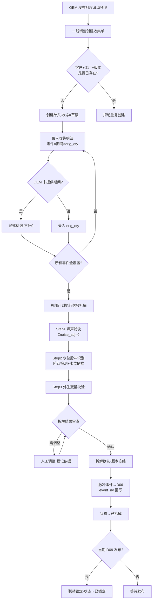

# 主机厂原始需求收集 · 应用详设

> **应用组**：parts-fc | **应用名**：demand_collection | **类名**：DemandCollection
> **聚合根编号**：3 | **对应单据**：D03 主机厂原始需求收集表
> **日期**：2026-08-08 | **版本**：v1.0
> **上游输入**：`app/parts-fc/architecture.md` 聚合根卡 + `app/parts-fc/brd/毛需求管理详设.md` §2.1 + §2.2

---

## 1. 需求概览

### 1.1 基本信息
- **需求名称**: 主机厂原始需求收集（Demand Collection）
- **需求编号**: REQ-PARTS-FC-DC-001
- **所属模块**: parts-fc / demand_collection
- **需求来源**: 业务方（产销协同框架 §1.1.2 步骤1）
- **创建日期**: 2026-08-08
- **优先级**: P0

### 1.2 需求背景
#### 1.2.1 为什么需要这个需求？

OEM（主机厂）每期向零部件供应商发布滚动预测（月度/年度），这些原始需求是整个毛需求加工链的起点。如果没有统一、规范、可追溯的收集入口，预测数据将散落在邮件、Excel、门户等各地，无从保证数据质量，更无从支撑后续的信号拆解（滤噪声/剥脉冲/留真实消耗）以及跨版本阶跃检测与信任折扣考核。

#### 1.2.2 期望达到什么目标？

建立 OEM 滚动预测的**唯一收集入口**，实现：
- 每期预测独立成版、快照不可变 —— 支撑跨版本比对、阶跃检测与考核追责；
- 信号拆解结果随版本冻结留存 —— 真实消耗（true_qty）成为下游基线的唯一取数口径；
- 版本链路完整可追溯 —— 从收集到发布的每个口径均可回溯。

### 1.3 需求范围
#### 1.3.1 包含哪些功能？

新建收集单、录入收集明细行、查看收集单全貌（含明细+拆解快照）、按条件筛选收集单列表、执行信号拆解（算法预计算+人工确认）、拆解确认与版本冻结、锁定（D09 发布联动）、作废（须填原因）、版本比对（V_n vs V_{n-1}）、取真实消耗量（供下游基线取数）。

#### 1.3.2 不包含哪些功能？

- 基线生成、销售修正、修正核对（归 D04 demand_processing）；
- 通用件汇总去重（归 D07 common_parts_agg）；
- 独立事件的生命周期管理（归 D06 independent_event，本应用仅生成/关联事件号）；
- 周度发货指示录入（属调拨单管理域，独立于产销协同机制）；
- 客户对齐动作（是动作不是单据，结论记入 D09 发布单）。

### 1.4 涉及角色
**谁会使用这个功能？**

- **一线销售**：录入/提交 OEM 原始滚动预测，提供客户侧佐证情报；不直接操作拆解。
- **总部计划**：执行信号拆解（算法预计算 + 人工确认）、拆解确认与版本冻结、锁定。
- **系统**：自动预计算信号拆解建议（噪声滤波、阶跃检测、水位倒推）、自动生成版本比对视图、形式一致性与完整性校验。

---

## 2. 用户故事

### 2.1 核心用户故事

#### 2.1.1 `US-01` 用户故事 — 新建收集单 (优先级: P1)

- **故事描述**: 作为一线销售，我想要新建一份 OEM 滚动预测收集单（含单头信息），以便于以客户+工厂+版本为单元启动本期需求收集。
- **为何赋予此优先级**：收集单是 D03 数据的顶层容器，是所有明细录入与后续拆解的前提，无此功能则整个需求收集流程无法启动。
- **独立测试**：可通过调用 `create(oem_code, plant_code, fcst_version, base_period, ...)` 创建收集单头，验证 collect_no 自动生成、客户+工厂+版本唯一性约束生效，返回完整的单头数据。
- **前置条件**: 客户主数据、工厂主数据已存在；当前客户+工厂+版本组合未被占用。
- **后置条件**: 收集单头创建成功，状态为"草稿"，collect_no 按规则生成，系统自动带出 prev_version。

**验收场景**：

1. `US-01-AC1` **场景**: 合法参数创建成功
   - **Given** 客户"主机厂A"、工厂"一工厂"、预测版本"V2026-08"未被收集，**When** 一线销售调用 create 方法并提交全部必填字段，**Then** 系统返回新创建的收集单头，collect_no 格式为 `COL-YYYYMM-NNN`，status="草稿"，prev_version 自动带出上一版本号。

2. `US-01-AC2` **场景**: 重复版本被拒绝
   - **Given** 已存在客户"主机厂A"+工厂"一工厂"+版本"V2026-08"的收集单，**When** 再次以相同组合调用 create，**Then** 系统拒绝创建并返回错误"该客户+工厂+版本已存在收集单"。

3. `US-01-AC3` **场景**: 必填字段缺失被拒绝
   - **Given** 一线销售已登录，**When** 调用 create 但缺少 oem_code 或 fcst_version，**Then** 系统返回校验错误，指明缺失的必填字段。

---

#### 2.1.2 `US-02` 用户故事 — 录入收集明细行 (优先级: P1)

- **故事描述**: 作为一线销售，我想要向收集单中逐行录入零件×期间的原始需求量（orig_qty），以便于完整记录 OEM 的本期滚动预测数据。
- **为何赋予此优先级**：明细是收集单的核心数据载体，无明细则收集单元意义。是所有下游加工的数据源头。
- **独立测试**：可对已有草稿收集单调用 `add_detail(collect_no, part_no, project_no, period, orig_qty, ...)` 录入明细行，验证 orig_qty 成功写入、项目阶段校验、OEM 未提供标记、期间折算正确。
- **前置条件**: 收集单存在且状态为"草稿"；零件号在物料主数据中存在；项目号在 D01 中存在且为进行中（非进行中触发警告）。
- **后置条件**: 明细行写入成功，line_no 自动递增，数据标记（data_flag）正确设置。

**验收场景**：

1. `US-02-AC1` **场景**: 正常录入明细行
   - **Given** 存在草稿状态收集单 COL-202608-001，零件 8210001 在 D01 中为进行中项目，**When** 调用 add_detail 录入 period="2026-09" orig_qty=1150，**Then** 系统写入明细行，line_no 自动递增，返回完整明细数据。

2. `US-02-AC2` **场景**: 非进行中项目录入触发警告
   - **Given** 零件关联项目阶段为"定点中"（非进行中），**When** 调用 add_detail，**Then** 系统返回警告信息"项目非进行中阶段，请确认是否录入"，但仍允许录入（不硬阻断）。

3. `US-02-AC3` **场景**: OEM 未提供期间显式标记
   - **Given** OEM 未提供 2026-10 的数据，**When** 调用 add_detail 设置 data_flag="OEM未提供"、orig_qty 留空或为 null，**Then** 系统写入明细行，data_flag="OEM未提供"，不允许将 orig_qty 隐式设为 0。

4. `US-02-AC4` **场景**: 已锁定/已拆解状态拒绝录入
   - **Given** 收集单状态为"已拆解"，**When** 调用 add_detail，**Then** 系统拒绝并返回错误"收集单已冻结，不可编辑"。

---

#### 2.1.3 `US-03` 用户故事 — 查看收集单全貌 (优先级: P1)

- **故事描述**: 作为一线销售或总部计划，我想要查看某份收集单的完整数据（单头+所有明细行+每行的拆解快照），以便于全面了解本期收集情况与拆解结果。
- **为何赋予此优先级**：查看是全流程中各方了解数据状态的基础操作，拆解确认、版本比对都依赖此视图。
- **独立测试**：可通过调用 `get(collect_no)` 获取收集单全貌，验证返回单头、所有明细行、每行对应的拆解快照数据。
- **前置条件**: 收集单存在。
- **后置条件**: 返回完整数据，含单头信息、明细列表（每行含对应的 D03-S 快照）。

**验收场景**：

1. `US-03-AC1` **场景**: 获取已拆解收集单全貌
   - **Given** COL-202608-001 状态为"已拆解"、含 7 行明细及对应拆解快照，**When** 调用 get("COL-202608-001")，**Then** 返回单头信息 + 7 行明细 + 每行对应的拆解快照（noise_adj/pulse_qty/true_qty 等）。

2. `US-03-AC2` **场景**: 收集单不存在
   - **Given** 收集单号 "COL-999999-999" 不存在，**When** 调用 get，**Then** 返回空或明确的"收集单不存在"错误。

---

#### 2.1.4 `US-04` 用户故事 — 筛选收集单列表 (优先级: P2)

- **故事描述**: 作为一线销售或总部计划，我想要按客户、状态、期间等条件筛选收集单列表，以便于快速定位目标收集单。
- **为何赋予此优先级**：列表查询是日常操作的辅助功能，相对核心增删改查优先级略低，但对管理多客户多版本场景必不可少。
- **独立测试**：可通过调用 `list(oem_code?, status?, period?, ...)` 筛选，验证返回符合条件的结果集。
- **前置条件**: 系统中存在多条收集单记录。
- **后置条件**: 返回满足筛选条件的收集单列表（摘要信息，不含全量明细）。

**验收场景**：

1. `US-04-AC1` **场景**: 按客户+状态筛选
   - **Given** 系统中存在主机厂A的 3 条收集单（草稿1、已拆解2），**When** 调用 list(oem_code="主机厂A", status="已拆解")，**Then** 返回 2 条收集单摘要。

2. `US-04-AC2` **场景**: 无匹配结果
   - **Given** 系统中不存在主机厂C的收集单，**When** 调用 list(oem_code="主机厂C")，**Then** 返回空列表。

---

#### 2.1.5 `US-05` 用户故事 — 执行信号拆解 (优先级: P1)

- **故事描述**: 作为总部计划，我想要对收集单执行信号拆解（系统算法预计算噪声滤波、阶跃检测、水位倒推，我确认或调整后落库），以便于将混杂的 OEM 要货信号拆分为真实消耗、噪声、水位脉冲三个成分。
- **为何赋予此优先级**：信号拆解是 D03 的核心增值环节——不拆解则噪声和脉冲混入基线导致虚高超储，是整个"趋势归趋势、事件归事件"叠加结构的数据基础。
- **独立测试**：可对草稿收集单调用 `decompose(collect_no)` 触发预计算，验证系统返回逐行的 noise_adj/pulse_qty/true_qty 建议值及置信度；人工调整后调用 `confirm_decompose` 冻结。
- **前置条件**: 收集单存在且状态为"草稿"；明细行至少有一行有数据；寄售仓数据可得（否则脉冲识别降级为"疑似·未确认"）。
- **后置条件**: 拆解快照写入 D03-S（如已有则更新），但状态仍为"草稿"（待 confirm_decompose 冻结）；确认的脉冲 event_no 关联 D06（如适用）。

**验收场景**：

1. `US-05-AC1` **场景**: 正常拆解（有上一版本 + 寄售仓数据）
   - **Given** COL-202608-001 明细已录入完毕，存在上一版本 V2026-07，寄售仓数据可得，**When** 总部计划调用 decompose，**Then** 系统执行 Step 0~2 预计算，返回逐行的 noise_adj（Σ=0）、pulse_qty、true_qty、has_pulse、事件号（如生成），method 与 basis 自动填充。

2. `US-05-AC2` **场景**: 首版无对比基线
   - **Given** 收集单为首版（prev_version 为空），**When** 调用 decompose，**Then** 阶跃检测不可用，method 补充标记"首版，无对比基线"，仅靠水位倒推+外生变量判定。

3. `US-05-AC3` **场景**: 寄售仓数据不可得
   - **Given** 寄售仓数据不可得，**When** 调用 decompose，**Then** 脉冲识别降级，标记"脉冲疑似·未确认"转人工，不自动剥离；拆解快照仍生成但 has_pulse 标记待确认。

4. `US-05-AC4` **场景**: 非寄售件免拆解
   - **Given** 零件为非寄售件（无寄售仓水位变量），**When** 拆解该行，**Then** 标记"免拆解"，true_qty = orig_qty，noise_adj=0，pulse_qty=0。

---

#### 2.1.6 `US-06` 用户故事 — 拆解确认（版本冻结） (优先级: P1)

- **故事描述**: 作为总部计划，我想要在审查确认拆解结果后正式冻结版本，以便于锁定的拆解快照成为下游基线的可靠输入，且不可随后篡改。
- **为何赋予此优先级**：拆解确认是整个收集流程的里程碑节点——确认后版本不可变、true_qty 成为下游取数口径，是阶跃检测与考核追责的数据前提。
- **独立测试**：对已拆解的草稿收集单调用 `confirm_decompose(collect_no)`，验证状态变为"已拆解"，所有 D03-S 快照随版本冻结，再次编辑被拒绝。
- **前置条件**: 收集单状态为"草稿"且已完成 decompose（至少所有行都有拆解快照）；恒等式 `true_qty = orig_qty − pulse_qty − noise_adj` 全部通过；Σnoise_adj ≈ 0 校验通过。
- **后置条件**: 状态→"已拆解"，整版冻结；确认的脉冲生成/关联 D06 事件，event_no 回写 D03-S。

**验收场景**：

1. `US-06-AC1` **场景**: 正常确认
   - **Given** 拆解完成且恒等式全部通过、守恒校验通过，**When** 调用 confirm_decompose，**Then** 状态→"已拆解"，全版冻结；确认的脉冲事件号回写 D03-S.event_no。

2. `US-06-AC2` **场景**: 噪声守恒校验失败被拒绝
   - **Given** 某拆解窗口内 Σnoise_adj ≠ 0（如人工调整导致），**When** 调用 confirm_decompose，**Then** 系统拒绝并返回"拆解窗口内噪声总额不守恒（Σnoise_adj ≠ 0），请修正后重试"。

3. `US-06-AC3` **场景**: 恒等式不通过被拒绝
   - **Given** 某行 true_qty ≠ orig_qty − pulse_qty − noise_adj，**When** 调用 confirm_decompose，**Then** 系统拒绝，指明违反恒等式的具体行号与期别。

---

#### 2.1.7 `US-07` 用户故事 — 锁定收集单 (优先级: P2)

- **故事描述**: 作为系统（由 D09 发布联动触发），我想要在 D09 发布 R 版后自动锁定对应的收集单，以便于发布口径下的收集版本不再被任何操作改动。
- **为何赋予此优先级**：锁定是 D09 发布的联动动作，非用户直接操作；但它是三层冻结（D09→D04→D03）的关键环节，保证全链路口径一致。
- **独立测试**：对"已拆解"收集单调用 `lock(collect_no)`，验证状态→"已锁定"，所有编辑操作被拒绝。
- **前置条件**: 收集单状态为"已拆解"；关联的 D09 发布单已发布。
- **后置条件**: 状态→"已锁定"，任何修改操作禁止。

**验收场景**：

1. `US-07-AC1` **场景**: 正常锁定
   - **Given** COL-202608-001 状态为"已拆解"，**When** 系统（由 D09 publish 联动触发）调用 lock，**Then** 状态→"已锁定"，后续任何编辑/拆解/确认操作均被拒绝。

2. `US-07-AC2` **场景**: 非已拆解状态锁定被拒绝
   - **Given** 收集单状态为"草稿"，**When** 调用 lock，**Then** 系统拒绝并返回"仅已拆解状态的收集单可锁定"。

---

#### 2.1.8 `US-08` 用户故事 — 作废收集单 (优先级: P2)

- **故事描述**: 作为一线销售或总部计划，我想要在录入错误或本期收集不再需要时作废收集单，以便于纳入及时性考核且不污染下游数据。
- **为何赋予此优先级**：作废是异常流程的必要出口；须填原因，防止随意作废。
- **独立测试**：对"草稿"收集单调用 `cancel(collect_no, reason)`，验证状态→"已作废"，reason 写入备注。
- **前置条件**: 收集单状态为"草稿"（已拆解/已锁定的收集单不可直接作废，需走版本替代）。
- **后置条件**: 状态→"已作废"，作废原因记录在案。

**验收场景**：

1. `US-08-AC1` **场景**: 正常作废
   - **Given** COL-202608-999 状态为"草稿"，**When** 调用 cancel(reason="OEM 撤回本期预测")，**Then** 状态→"已作废"，备注记录作废原因，操作人与时间自动记录。

2. `US-08-AC2` **场景**: 未填原因被拒绝
   - **Given** 收集单状态为"草稿"，**When** 调用 cancel 但 reason 为空，**Then** 系统拒绝并返回"作废原因不能为空"。

3. `US-08-AC3` **场景**: 已锁定状态拒绝作废
   - **Given** 收集单状态为"已锁定"，**When** 调用 cancel，**Then** 系统拒绝并返回"已锁定收集单不可作废，请走版本替代流程"。

---

#### 2.1.9 `US-09` 用户故事 — 版本比对 (优先级: P1)

- **故事描述**: 作为总部计划或一线销售，我想要并排查看 V_n 与 V_{n-1} 的逐零件×期间差异，以便于一站式识别水位脉冲的阶跃信号，并作为信任折扣与考核的数据输入。
- **为何赋予此优先级**：版本比对是阶跃检测的入口，直接决定脉冲识别的质量；也是达成率跟踪的基础数据源。
- **独立测试**：对已拆解收集单调用 `get_version_diff(collect_no)`，验证返回并排的 V_n vs V_{n-1} 逐期差异及系统判定标注。
- **前置条件**: 当前版本存在且 prev_version 指向一个已存在的上一版本。
- **后置条件**: 返回逐零件×期间的差异对照表，含 V_n 值、V_{n-1} 值、差异量、系统判定（正常修订/阶跃疑似/趋势修订等）。

**验收场景**：

1. `US-09-AC1` **场景**: 有上一版本正常比对
   - **Given** COL-202608-001 (V2026-08) 的 prev_version=V2026-07 且该版本存在，**When** 调用 get_version_diff，**Then** 返回逐期对照：如 2026-09 差异 +200 判定为"阶跃疑似：单期跳增、后续各期未随动"。

2. `US-09-AC2` **场景**: 首版无比对基线
   - **Given** 当前版本为首版（prev_version 为空），**When** 调用 get_version_diff，**Then** 返回提示"首版，无对比基线"，不报错。

---

#### 2.1.10 `US-10` 用户故事 — 取真实消耗量 (优先级: P1)

- **故事描述**: 作为 D04 毛需求加工模块（或其他下游消费者），我想要按收集单号获取某一零件×期间的真实消耗量（true_qty），以便于作为基线生成的唯一取数口径。
- **为何赋予此优先级**：true_qty 是整个加工链的数据枢纽——D04 基线只取 true_qty 不取 orig_qty，这是"脉冲不进趋势外推"在数据层的落锁。
- **独立测试**：对已拆解收集单调用 `get_true_qty(collect_no, part_no?, period?)`，验证返回正确的 true_qty 值。
- **前置条件**: 收集单状态为"已拆解"或"已锁定"（草稿状态的 true_qty 不稳定，不应被下游引用）。
- **后置条件**: 返回满足筛选条件的 true_qty 记录。

**验收场景**：

1. `US-10-AC1` **场景**: 按零件+期间精确取数
   - **Given** COL-202608-001 已拆解，8210001 的 2026-09 true_qty=970，**When** 调用 get_true_qty(collect_no="COL-202608-001", part_no="8210001", period="2026-09")，**Then** 返回 true_qty=970。

2. `US-10-AC2` **场景**: 草稿状态拒绝下游取数
   - **Given** 收集单状态为"草稿"，**When** 下游调用 get_true_qty，**Then** 返回空或提示"收集单尚未完成拆解确认，true_qty 不可用"。

---

## 3. 业务场景

### 3.1 业务流程描述

#### 3.1.1 场景1: 月度滚动预测收集全流程（主流程）



1. **OEM 发布预测**：主机厂通过 EDL/EDI、OEM 门户、邮件 Excel 等渠道发布月度滚动预测（或年度需求）。
2. **一线销售创建收集单**：在系统中新建收集单头，指定客户、工厂、预测版本、锚定期间、需求口径、来源渠道等。
3. **系统校验唯一性**：检查客户+工厂+版本组合是否已存在，若存在则拒绝重复创建。
4. **录入明细**：按零件×期间逐行录入原始需求量（orig_qty），系统校验零件是否存在于 D01/D02、项目阶段（非进行中警告）、量纲一致性。
5. **OEM 未提供处理**：OEM 未提供的期间必须显式标记 data_flag="OEM未提供"，禁止隐式补 0。
6. **总部计划执行拆解**：系统自动预计算噪声滤波（Step 1）、水位脉冲识别（Step 2）、外生变量校验（Step 3），总部计划审查确认或人工调整。
7. **拆解确认**：恒等式与守恒校验通过后，总部计划确认，版本冻结（状态→已拆解），脉冲事件写入 D06 并回写 event_no。
8. **等待发布**：已拆解版本等待 D09 R 版发布后联动锁定（状态→已锁定）。

#### 3.1.2 场景2: OEM 月中修订（子版本流程）

1. OEM 在月中对本期预测进行修订（如排产调整），一线销售收到修订通知。
2. 系统检查当前版本状态：如为"已拆解"且已过一段时间，则创建子版本（如 `V2026-08.1`），prev_version 指向父版本。
3. 子版本的明细以父版本为底稿，仅修改变动期间的数据；未变动期间沿用父版本快照。
4. 对子版本执行增量拆解——仅重拆变动期间，未变动期间快照直接继承。
5. 子版本确认后，父版本自动置"已替代"（快照永久保留，仅供历史查询与考核）。

#### 3.1.3 场景3: 版本比对与达成率跟踪（事后闭环）

1. 结算实际到达后，系统自动生成达成率跟踪视图：各版本 true_qty vs 结算实际。
2. 达成率数据反哺信任折扣库——达成率高的客户下期直接采用，一贯高报的按偏差方向打折。
3. 跨版本比对（V_n vs V_{n-1}）的差异数据同时作为阶跃检测参数的校准输入（回测 θ_step 阈值）。

### 3.2 业务规则

#### `BR-01` 客户+工厂+版本唯一性
- **规则描述**: 同一客户（oem_code）+同一工厂（plant_code）+同一预测版本（fcst_version）只能存在一份收集单。创建时系统检查唯一性，重复则拒绝。
- **适用场景**: create 新建收集单时。
- **示例**: 主机厂A·一工厂·V2026-08 已存在 → 再次创建同组合时系统拒绝。

#### `BR-02` orig_qty 不可变（改即新版）
- **规则描述**: 收集明细的原始需求量（orig_qty）一旦录入，永不直接修改。任何对 orig_qty 的变动只能通过创建新版本（子版本）实现。这是阶跃检测、信任折扣、考核追责的数据前提。
- **适用场景**: 明细录入后、拆解期间、锁定后——全过程。
- **示例**: COL-202608-001 的 8210001/2026-09 orig_qty=1150 已录入；OEM 月中修订为 1100 → 必须创建子版本 COL-202608-002 (V2026-08.1)，而非直接修改原值。

#### `BR-03` true_qty 恒等式（系统强制）
- **规则描述**: `true_qty = orig_qty − pulse_qty − noise_adj`，系统在拆解快照写入时强制校验；恒等式不通过则拒绝保存。确认拆解时再次全量校验。
- **适用场景**: decompose 写入快照时、confirm_decompose 确认时。
- **示例**: orig_qty=1150, pulse_qty=+180, noise_adj=0 → true_qty 必须 = 1150−180−0 = 970。

#### `BR-04` 噪声总额守恒（Σnoise_adj = 0）
- **规则描述**: 拆解窗口内所有期间的噪声调整量之和必须为 0（平滑只改形状、不改总量）。违反则拆解确认不通过。
- **适用场景**: confirm_decompose 确认时校验。
- **计算方式**: Σnoise_adj（拆解窗口内所有行·期间）≈ 0（容忍浮点误差 ±0.01）。
- **示例**: 8210001 的 M+2 noise_adj=−15, M+3 noise_adj=+15 → Σ=0，通过。

#### `BR-05` OEM未提供显式标记、禁止补0
- **规则描述**: OEM 未提供数据的期间，必须显式设置 data_flag="OEM未提供"，orig_qty 可为空或特殊值；系统禁止将未提供隐式处理为 orig_qty=0。
- **适用场景**: add_detail 录入明细时。
- **示例**: 8210002 M+2/M+3 OEM 未提供 → data_flag="OEM未提供"，不设 orig_qty=0。

#### `BR-06` 零件必须存在于 D01/D02 且为进行中项目
- **规则描述**: 录入明细时校验 part_no 必须存在于 D01（项目信息台账）且 proj_stage 为"进行中"；非进行中项目允许录入但触发警告（不硬阻断）。
- **适用场景**: add_detail 录入明细时。
- **示例**: 某零件阶段为"定点中" → 系统返回警告"零件关联项目非进行中阶段，请确认"。

#### `BR-07` 通用件不汇总
- **规则描述**: 通用件按客户/主机厂分别收集，不在 D03 层面做任何汇总；汇总去重是 D07 common_parts_agg 的职责。
- **适用场景**: add_detail 录入时、list 查询时。
- **示例**: STD-M6 在主机厂A·车型A/B/C 通用 → D03 按 A/B/C 分别收集三行，不合并。

#### `BR-08` 期间折算规则
- **规则描述**: M0~M+N 按锚定期间（base_period）折算为会计期间（YYYY-MM），跨年滚动自然延续。M0 = 锚定期间当月，M+1 = 次月，以此类推。
- **适用场景**: add_detail 录入时系统自动换算、展示层横表透视时。
- **示例**: base_period="2026-08" → M0=2026-08, M+1=2026-09, M+2=2026-10, M+3=2026-11。

#### `BR-09` 拆解快照随版本冻结
- **规则描述**: 拆解确认（confirm_decompose）后，整版冻结——所有 D03-S 快照不可修改。任何对拆解结果的修改只能走人工调整登记（留痕：操作人/时点/原因/前后值）或产生新版本。
- **适用场景**: confirm_decompose 后。
- **示例**: 已拆解版本发现噪声调整有误 → 由授权人在拆解修订记录中登记调整，或创建子版本重新拆解。

#### `BR-10` 已锁定收集单禁止任何修改
- **规则描述**: 状态为"已锁定"的收集单，任何编辑操作（含单头、明细、拆解快照）全部禁止。
- **适用场景**: lock 后的所有操作。
- **示例**: 已锁定收集单尝试 add_detail → 系统拒绝"收集单已锁定，不可编辑"。

#### `BR-11` 非寄售件免拆解
- **规则描述**: 非寄售模式零件（无寄售仓水位变量），拆解时直接标记"免拆解"：true_qty = orig_qty, noise_adj = 0, pulse_qty = 0（噪声滤波可选做）。
- **适用场景**: decompose 时逐行判定。
- **示例**: STD-M6 标准紧固件无寄售仓 → 拆解时标记"免拆解"，true_qty 直接等于 orig_qty。

#### `BR-12` 首版无对比基线的拆解降级
- **规则描述**: 当收集单为首版（prev_version 为空）时，阶跃检测不可用，脉冲识别仅靠水位倒推+外生变量。拆解结果标记"首版，无对比基线"。
- **适用场景**: decompose 且 prev_version 为空时。
- **示例**: 新建客户的首期收集 → decompose 返回结果含"首版，无对比基线"标注。

#### `BR-13` 拆解修订必须留痕
- **规则描述**: 任何对拆解结果的人工调整（修改 noise_adj/pulse_qty/true_qty）必须登记修订记录：操作人、时点、原因类别、调整前后值。修订记录与版本同冻结，可审计。
- **适用场景**: decompose 人工调整时、已拆解版本确需调整时。
- **示例**: 总部计划将系统预计算的 pulse_qty 从 +180 调整为 +200 → 登记修订记录（操作人:王五, 原因:水位倒推算幅度更可靠, 前值:+180, 后值:+200）。

#### `BR-14` 及时性考核
- **规则描述**: OEM 预测发布后，一线销售须在规定时限内完成收集录入与提交。逾期纳入销售线考核。
- **适用场景**: 创建收集单后至明细录入完毕期间。
- **示例**: OEM 8月5日发布预测 → 销售须在 3 个工作日内完成收集。

#### `BR-15` 合理性提示不硬阻断
- **规则描述**: 系统计算 零件量 vs（车型量 × 单车用量 × 份额）偏离参考值，超阈值时提示人工确认，但不硬阻断录入。
- **适用场景**: add_detail 录入时。
- **示例**: 8210001 的 2026-09 orig_qty=1150，但（车型A排产900 × 单车用量1.2 × 份额90%）= 972 → 偏离 +18.3%，系统提示"需求量与因果推演偏离较大，请确认"。

### 3.3 业务数据

#### 3.3.1 数据1: 收集单头（D03-H）

| 数据 | 代码 | 数据类型 | 数据来源 | 说明 |
|------|------|----------|----------|------|
| 收集单号 | collect_no | String(20) | 系统生成 | PK，格式 `COL-YYYYMM-NNN` |
| 客户编码 | oem_code | Ref | 外部 MDM（客户主数据） | 主机厂 |
| OEM 工厂 | plant_code | Ref | 外部 MDM（客户主数据） | 同一主机厂多工厂分别收集 |
| 预测版本 | fcst_version | String(20) | 用户输入 | `V+YYYYMM(.x)` |
| 锚定期间 | base_period | String(7) | 用户输入 | YYYY-MM，M0 对应会计期间 |
| 需求口径 | demand_type | Enum | 用户选择 | 月度滚动预测（默认）/ 年度需求 |
| 来源渠道 | source_channel | Enum | 用户选择 | EDL/EDI / OEM门户 / 邮件Excel / 销售转录 |
| 接收日期 | recv_date | Date | 系统默认当天 | 可修改 |
| 收集人 | collector | Ref(User) | 系统自动 | 当前操作人，及时性责任人 |
| 版本状态 | status | Enum | 系统维护 | 草稿 / 已拆解 / 已锁定 / 已替代 / 已作废 |
| 上一版本 | prev_version | String(20) | 系统自动 | 取同客户+工厂的最新非草稿版本号 |
| 备注 | remark | Text | 用户输入 | OEM 中途修订说明、口径变化等 |

#### 3.3.2 数据2: 收集明细（D03-D）

| 数据 | 代码 | 数据类型 | 数据来源 | 说明 |
|------|------|----------|----------|------|
| 收集单号 | collect_no | Ref | FK → D03-H | 所属收集单 |
| 明细行号 | line_no | Int | 系统自动递增 | 单号内唯一 |
| 零件号 | part_no | Ref | 物料主数据（外部 MDM） | 带出零件名称 |
| 项目号 | project_no | Ref | FK → D01 project_ledger | 关联项目 |
| 客户车型 | veh_model | Ref | FK → D02 vehicle_part_map | 车型 |
| 项目阶段 | proj_stage | Enum | 默认"进行中" | 非进行中录入触发警告 |
| 期间 | period | String(7) | 系统折算 | YYYY-MM |
| 原始需求量 | orig_qty | Decimal(18,4) | OEM 报数量 | **录入后永不修改** |
| 计量单位 | uom | Enum | 件/套 | 须与 D02 单车用量量纲一致 |
| 数据标记 | data_flag | Enum | 正常 / OEM未提供 | OEM 未提供时显式标记 |

#### 3.3.3 数据3: 拆解快照（D03-S）

| 数据 | 代码 | 数据类型 | 数据来源 | 说明 |
|------|------|----------|----------|------|
| 关联明细 | (collect_no, line_no, period) | FK | 1:1 → D03-D | 逐行逐期快照 |
| 噪声调整量 | noise_adj | Decimal(18,4) | 系统/人工 | 带符号，Σ窗口内=0 |
| 水位脉冲量 | pulse_qty | Decimal(18,4) | 系统/人工 | 带符号，总额不守恒 |
| 真实消耗量 | true_qty | Decimal(18,4) | 系统计算 | = orig_qty − pulse_qty − noise_adj |
| 脉冲标记 | has_pulse | Bool | 系统判定 | 是否识别出一次性脉冲 |
| 事件登记号 | event_no | Ref | 系统生成 | FK → D06 independent_event |
| 拆解方法 | method | Enum | 系统/人工 | 移动平均/指数平滑/阶跃检测/发运−结算倒推/免拆解 |
| 拆解依据 | basis | Text | 系统/人工 | 如"V07→V08 M+1 跳增 200，水位差估算 +180" |
| 拆解人 | decomposer | Ref(User) | 系统自动 | 总部计划 |
| 拆解日期 | decompose_date | Date | 系统自动 | 操作日期 |

### 3.4 状态机

```
草稿 ──拆解确认──→ 已拆解 ──D09 R版发布──→ 已锁定
  │                  │
  └─作废(须填原因)    └─新版本确认替代──→ 已替代（快照永久保留）
      ↓
    已作废
```

**状态转换规则矩阵：**

| 当前状态 | 目标状态 | 触发动作 | 前置条件 | 后置条件 |
|----------|----------|----------|----------|----------|
| (新建) | 草稿 | create 创建收集单 | 客户+工厂+版本唯一性通过 | collect_no 生成，prev_version 自动带出 |
| 草稿 | 已拆解 | confirm_decompose 拆解确认 | 所有明细行完成拆解、恒等式全部通过、Σnoise_adj≈0 | 整版冻结，脉冲事件关联 D06 |
| 草稿 | 已作废 | cancel 作废 | 须填写作废原因 | 备注记录原因、操作人、时间 |
| 已拆解 | 已锁定 | lock（D09 发布联动） | 关联 D09 发布单已发布 | 任何修改操作禁止 |
| 已拆解 | 已替代 | 子版本确认替代 | 存在新版本且已确认 | 旧版本永久保留只读 |
| 已锁定 | 已替代 | 新版本确认替代 | 存在新版本且已确认 | 旧版本永久保留只读 |

**各状态可编辑性：**

| 状态 | 单头编辑 | 明细编辑 | 拆解快照编辑 | 备注 |
|------|----------|----------|-------------|------|
| 草稿 | 可 | 可 | 可（拆解结果可调整） | — |
| 已拆解 | 不可 | 不可 | 授权人可调整（须留修订记录） | 整版冻结 |
| 已锁定 | 不可 | 不可 | 不可 | 任何修改禁止 |
| 已替代 | 不可 | 不可 | 不可 | 只读 |
| 已作废 | 不可 | 不可 | 不可 | 只读 |

---

## 4. 功能描述

### 4.1 功能清单

| 一级菜单/模块 | 一级编号 | 二级菜单/模块 | 二级编号 | 三级功能 | 三级编号 | 功能类型 | 优先级 | 三级功能简述 |
|-------------|---------|-------------|---------|---------|---------|---------|--------|------------|
| 主机厂原始需求收集 | F01 | 收集单管理 | F01-01 | 新建收集单 | F01-01-01 | 接口 | P1 | 创建收集单头，校验客户+工厂+版本唯一性 |
| 主机厂原始需求收集 | F01 | 收集单管理 | F01-01 | 录入收集明细 | F01-01-02 | 接口 | P1 | 逐行录入零件×期间的原始需求量 |
| 主机厂原始需求收集 | F01 | 收集单管理 | F01-01 | 查看收集单 | F01-01-03 | 接口 | P1 | 取收集单全貌（单头+明细+拆解快照） |
| 主机厂原始需求收集 | F01 | 收集单管理 | F01-01 | 筛选收集单列表 | F01-01-04 | 接口 | P2 | 按客户/状态/期间等条件筛选 |
| 主机厂原始需求收集 | F01 | 收集单管理 | F01-01 | 作废收集单 | F01-01-05 | 接口 | P2 | 作废（须填原因） |
| 主机厂原始需求收集 | F01 | 收集单管理 | F01-01 | 锁定收集单 | F01-01-06 | 接口 | P2 | D09 发布联动锁定 |
| 主机厂原始需求收集 | F01 | 信号拆解 | F01-02 | 执行信号拆解 | F01-02-01 | 接口 | P1 | 噪声滤波+水位脉冲识别+外生校验预计算 |
| 主机厂原始需求收集 | F01 | 信号拆解 | F01-02 | 拆解确认 | F01-02-02 | 接口 | P1 | 审查确认、版本冻结 |
| 主机厂原始需求收集 | F01 | 版本比对 | F01-03 | 版本比对 | F01-03-01 | 接口 | P1 | V_n vs V_{n-1} 逐期差异 |
| 主机厂原始需求收集 | F01 | 下游取数 | F01-04 | 取真实消耗量 | F01-04-01 | 接口 | P1 | 供 D04 基线取数 |

### 4.2 功能模块结构图

```
主机厂原始需求收集 (F01) [P0]
├── 收集单管理 (F01-01)
│   ├── F01-01-01 新建收集单 [接口, P1]
│   ├── F01-01-02 录入收集明细 [接口, P1]
│   ├── F01-01-03 查看收集单 [接口, P1]
│   ├── F01-01-04 筛选收集单列表 [接口, P2]
│   ├── F01-01-05 作废收集单 [接口, P2]
│   └── F01-01-06 锁定收集单 [接口, P2]
├── 信号拆解 (F01-02)
│   ├── F01-02-01 执行信号拆解 [接口, P1]
│   └── F01-02-02 拆解确认 [接口, P1]
├── 版本比对 (F01-03)
│   └── F01-03-01 版本比对 [接口, P1]
└── 下游取数 (F01-04)
    └── F01-04-01 取真实消耗量 [接口, P1]
```

### 4.3 功能详细说明

#### 4.3.1 F01-01-01 新建收集单 (FUNC-01)

**功能描述**:
一线销售创建 OEM 滚动预测收集单头，系统自动生成收集单号（`COL-YYYYMM-NNN`），校验客户+工厂+预测版本唯一性，自动带出上一版本号。创建后状态为"草稿"。

**输入数据**:
- oem_code: 客户编码 - 主机厂 - 示例："主机厂A"
- plant_code: OEM 工厂 - 示例："一工厂"
- fcst_version: 预测版本 - V+YYYYMM(.x) - 示例："V2026-08"
- base_period: 锚定期间 - YYYY-MM - 示例："2026-08"
- demand_type: 需求口径 - 月度滚动预测/年度需求 - 示例："月度滚动预测"
- source_channel: 来源渠道 - EDL/EDI/OEM门户/邮件Excel/销售转录 - 示例："EDL/EDI"
- recv_date: 接收日期 - 默认当天 - 示例："2026-08-05"
- remark: 备注（可选） - 示例："OEM 月初发布"

**输出数据**:
- collect_no: 收集单号 - 示例："COL-202608-001"
- status: 版本状态 - 示例："草稿"
- prev_version: 上一版本 - 示例："V2026-07"
- collector: 收集人 - 示例：当前用户

**业务规则**:
- BR-01 客户+工厂+版本唯一性校验
- collect_no 按编码规则自动生成：前缀COL + 日期8位 + 流水码3位
- prev_version 取同客户+工厂的最新非草稿版本号，无则为空
- recv_date 默认当天，可手动修改

**特殊处理**:
- 创建时调用 `project_ledger.get_active_projects(oem_code)` 校验录入范围（仅进行中项目零件可录入明细）；
- 创建时调用 `vehicle_part_map.get_active_mapping(part_no)` 预检量纲一致性。

**业务实体**:
- **收集单头 (D03-H)**: OEM 预测版本的顶层容器，绑定客户+工厂+版本，贯穿收集→拆解→锁定→替代全生命周期。

**收集单头字段**

| 字段名称 | 字段类型 | 是否必填 | 默认值 | 业务逻辑 |
|----------|----------|----------|--------|----------|
| collect_no | String(20) | 否 | 自动生成 | 编码规则 `COL-YYYYMM-NNN`，系统生成唯一标识 |
| oem_code | Ref | 是 | — | 引用客户主数据，客户编码 |
| plant_code | Ref | 是 | — | 引用客户主数据，工厂编码 |
| fcst_version | String(20) | 是 | — | 格式 `V+YYYYMM(.x)`，客户+工厂+版本唯一 |
| base_period | String(7) | 是 | — | YYYY-MM 格式，M0 对应的会计期间 |
| demand_type | Enum | 是 | 月度滚动预测 | 月度滚动预测/年度需求 |
| source_channel | Enum | 是 | — | EDL/EDI / OEM门户 / 邮件Excel / 销售转录 |
| recv_date | Date | 是 | 当前日期 | 可手动修改，但不能早于 base_period 首日 |
| collector | Ref(User) | 是 | 当前用户 | 操作人自动赋值 |
| status | Enum | 是 | 草稿 | 草稿/已拆解/已锁定/已替代/已作废 |
| prev_version | String(20) | 否 | 自动 | 同客户+工厂最新非草稿版本号，无则为空 |
| remark | Text | 否 | — | 最大 500 字符 |

---

#### 4.3.2 F01-01-02 录入收集明细 (FUNC-02)

**功能描述**:
一线销售向草稿状态的收集单中逐行录入零件×期间的原始需求量（orig_qty）。系统校验零件是否存在于 D01/D02、项目阶段、量纲一致性；OEM 未提供的期间必须显式标记（禁止补 0）。

**输入数据**:
- collect_no: 收集单号 - "COL-202608-001"
- part_no: 零件号 - "8210001"
- project_no: 项目号 - "PRJ-001"
- veh_model: 客户车型 - "车型A"
- period: 期间 - "2026-09" (YYYY-MM)
- orig_qty: 原始需求量 - 1150
- uom: 计量单位 - "件"
- data_flag: 数据标记 - "正常" / "OEM未提供"

**输出数据**:
- line_no: 明细行号（自动递增）
- proj_stage: 项目阶段（自动从 D01 读取）

**业务规则**:
- BR-02: orig_qty 录入后不可直接修改（改即新版）
- BR-05: OEM 未提供期间必须显式标记 data_flag="OEM未提供"
- BR-06: 零件须存在于 D01/D02，非进行中项目触发警告
- BR-07: 通用件按客户分别收集，不汇总
- BR-08: 期间按 base_period 自动折算为 YYYY-MM
- BR-15: 偏离参考值超阈值时提示但不阻断
- 收集单状态必须为"草稿"，否则拒绝
- 同一零件+期间已存在时更新（草稿状态），否则新增

**特殊处理**:
- 调用 `project_ledger.get(project_no, part_no)` 获取项目阶段
- 调用 `vehicle_part_map.get_active_mapping(part_no)` 获取量纲信息用于合理性校验
- 期间从 M0~M+N 自动换算标注（如 M+1=2026-09）

**业务实体**:
- **收集明细 (D03-D)**: 按零件×期间存储原始需求量的纵表行，是收集单的核心数据载体。

**收集明细节段**

| 字段名称 | 字段类型 | 是否必填 | 默认值 | 业务逻辑 |
|----------|----------|----------|--------|----------|
| collect_no | Ref | 是 | — | FK → D03-H，所属收集单 |
| line_no | Int | 是 | 自动递增 | 单号内唯一行号 |
| part_no | Ref | 是 | — | FK → 物料主数据，零件号 |
| project_no | Ref | 是 | — | FK → D01 project_ledger |
| veh_model | Ref | 是 | — | FK → D02 vehicle_part_map |
| proj_stage | Enum | 是 | 进行中 | 自动从 D01 读取，非进行中触发警告 |
| period | String(7) | 是 | — | YYYY-MM，按 base_period 折算 |
| orig_qty | Decimal(18,4) | 条件必填 | — | data_flag="正常"时必填；录入后不可直接修改 |
| uom | Enum | 是 | 件 | 件/套，须与 D02 量纲一致 |
| data_flag | Enum | 是 | 正常 | 正常/OEM未提供 |

---

#### 4.3.3 F01-01-03 查看收集单 (FUNC-03)

**功能描述**:
获取收集单全貌，返回单头信息 + 所有明细行 + 每行对应的拆解快照数据。是各方了解本期收集与拆解情况的基础视图。

**输入数据**:
- collect_no: 收集单号

**输出数据**:
- 单头完整信息
- 明细列表（每行含对应的 D03-S 快照：noise_adj, pulse_qty, true_qty, has_pulse, event_no, method, basis, decomposer, decompose_date）
- 如快照不存在（尚未拆解），快照相关字段为空

**业务规则**:
- 收集单不存在时返回空或明确错误
- 已作废/已替代的收集单仍可查看（只读）

---

#### 4.3.4 F01-01-04 筛选收集单列表 (FUNC-04)

**功能描述**:
按客户、工厂、状态、期间、收集人等条件筛选收集单列表，返回摘要信息（单头，不含明细全量）。

**输入数据**:
- oem_code: 客户编码（可选）
- plant_code: 工厂（可选）
- status: 状态（可选）
- base_period: 锚定期间（可选）
- collector: 收集人（可选）
- page/size: 分页参数

**输出数据**:
- 分页的收集单摘要列表

**业务规则**:
- 支持分页，默认每页 20 条
- 所有筛选条件为 AND 关系
- 空条件时返回全部（按创建时间倒序）

---

#### 4.3.5 F01-01-05 作废收集单 (FUNC-05)

**功能描述**:
将草稿状态的收集单作废。须填写作废原因，纳入及时性考核。

**输入数据**:
- collect_no: 收集单号
- reason: 作废原因（必填，最大 500 字符）

**输出数据**:
- 更新后的单头（status=已作废）

**业务规则**:
- BR-10 相关：仅草稿状态可作废；已拆解/已锁定须走版本替代
- 作废原因必填，不可为空
- 作废后所有下级数据（明细、快照）均只读保留

---

#### 4.3.6 F01-01-06 锁定收集单 (FUNC-06)

**功能描述**:
由 D09 毛需求发布后联动触发，将已拆解收集单锁定。锁定后任何修改操作禁止。

**输入数据**:
- collect_no: 收集单号

**输出数据**:
- 更新后的单头（status=已锁定）

**业务规则**:
- 仅"已拆解"状态可锁定
- 锁定后任何编辑、拆解、确认、作废操作均被拒绝

---

#### 4.3.7 F01-02-01 执行信号拆解 (FUNC-07)

**功能描述**:
对草稿收集单执行信号拆解预计算——系统按 Step 0~Step 3 依次执行：前置检查 → 噪声滤波 → 水位脉冲识别 → 外生变量校验。产出逐行的拆解建议（noise_adj, pulse_qty, true_qty, has_pulse, method, basis）供人工审查。结果写入 D03-S，但版本尚未冻结（待 confirm_decompose）。

**输入数据**:
- collect_no: 收集单号

**输出数据**:
- 逐行逐期拆解快照建议值（noise_adj, pulse_qty, true_qty, has_pulse, method, basis）
- 脉冲识别置信度标记（疑似/确认）
- 异常标记（首版/寄售仓数据不可得/OEM未提供期间等）

**业务规则**:
- BR-03: 恒等式 true_qty = orig_qty − pulse_qty − noise_adj 强制校验
- BR-04: 噪声守恒 Σnoise_adj=0（确认时校验，预计算尽力保证）
- BR-11: 非寄售件自动标记"免拆解"
- BR-12: 首版标记"无对比基线"
- BR-13: 人工调整时必须登记修订记录

**特殊处理**:
- Step 1 噪声滤波：移动平均（窗口3期）或指数平滑（α≈0.3），识别批量尖峰并摊还
- Step 2a 跨版本阶跃检测：单期|Δ|>θ_step 且后续期 Δ→0 → 阶跃疑似
- Step 2b 寄售仓水位倒推：补库幅度 ≈ (目标水位−现时水位) × 期消耗当量
- Step 2c 外生变量交叉验证：排产/上险数无对应变化 → 佐证脉冲
- 脉冲确认后：调用 `independent_event.create()` 生成 D06 事件，event_no 回写 D03-S
- 参数来源：θ_step, θ_noise, α 等由 D10 策略仿真拟合回测选定

---

#### 4.3.8 F01-02-02 拆解确认 (FUNC-08)

**功能描述**:
总部计划审查拆解结果后确认冻结。系统全量校验恒等式与守恒约束，通过后状态→"已拆解"，整版冻结。确认的脉冲事件号回写 D03-S.event_no。

**输入数据**:
- collect_no: 收集单号

**输出数据**:
- 更新后的单头（status=已拆解）
- 关联 D06 事件号（如适用）

**业务规则**:
- BR-03: 全量恒等式校验（每行每期）
- BR-04: 噪声守恒 Σnoise_adj≈0 全量校验
- BR-09: 确认后整版冻结
- 仅"草稿"状态可确认
- 所有明细行必须有拆解快照方可确认

---

#### 4.3.9 F01-03-01 版本比对 (FUNC-09)

**功能描述**:
对当前版本的收集单，自动生成 V_n vs V_{n-1} 的逐零件×期间差异对照表。系统按形态自动判定差异类型（正常修订/阶跃疑似/趋势修订/系统性修订/批量噪声），脉冲行高亮。

**输入数据**:
- collect_no: 收集单号

**输出数据**:
- 逐期对照：期间 / V_{n-1} 值 / V_n 值 / 差异量 / 系统判定

**业务规则**:
- prev_version 为空时返回"首版，无对比基线"
- 差异判定规则（形态判别）：

| Δ 形态 | 判定 | 处理 |
|--------|------|------|
| 单期|Δ|>θ_step，后续各期|Δ|→0 | 水位脉冲（一次性） | 高亮，建议剥离 |
| 连续多期同向、渐进变化 | 趋势修订 | 保留，进基线 |
| 全部期间同向同幅平移 | 系统性修订 | 不剥离，先查外生变量 |
| 单期跳增、后续同向跟随 | 趋势跳变 | 人工确认，慎剥离 |
| 隔期正负对冲、均值不变 | 批量噪声 | 归噪声滤波处理 |

---

#### 4.3.10 F01-04-01 取真实消耗量 (FUNC-10)

**功能描述**:
供下游应用（主要是 D04 demand_processing）取已拆解/已锁定版本的逐行 true_qty。这是基线生成的唯一取数口径——D04 基线只取 true_qty，不取 orig_qty。

**输入数据**:
- collect_no: 收集单号
- part_no: 零件号（可选，为空则返回全部）
- period: 期间（可选，为空则返回全部）

**输出数据**:
- 匹配条件的 (part_no, period, true_qty, orig_qty) 记录列表

**业务规则**:
- 仅"已拆解"或"已锁定"状态的收集单的 true_qty 可被下游引用
- 草稿状态的 true_qty 不稳定，应拒绝下游取数或明确标记"未确认"

---

## 5. 权限要求

### 5.1 功能权限

| 功能名称 | 权限标识 | 一线销售 | 总部计划 | 系统 |
|----------|----------|----------|----------|------|
| 新建收集单 | `dc:collect:create` | PERM-01 可访问 | PERM-01 可访问 | — |
| 录入收集明细 | `dc:detail:write` | PERM-02 可访问 | — | — |
| 查看收集单 | `dc:collect:query` | PERM-03 可访问 | PERM-03 可访问 | PERM-03 可访问 |
| 筛选收集单列表 | `dc:collect:list` | PERM-04 可访问 | PERM-04 可访问 | — |
| 作废收集单 | `dc:collect:cancel` | PERM-05 可访问 | PERM-05 可访问 | — |
| 锁定收集单 | `dc:collect:lock` | — | — | PERM-06 可访问 |
| 执行信号拆解 | `dc:decompose:execute` | — | PERM-07 可访问 | — |
| 拆解确认 | `dc:decompose:confirm` | — | PERM-08 可访问 | — |
| 版本比对 | `dc:version:diff` | PERM-09 可访问 | PERM-09 可访问 | — |
| 取真实消耗量 | `dc:true-qty:query` | — | — | PERM-10 可访问 |

> 权限标识遵循 `{module}:{resource}:{action}` 约定。

### 5.2 数据权限

#### 5.2.1 角色1: 一线销售
- 只能查看和编辑自己负责的客户/工厂的收集单（基于 D01 项目信息台账中 owner 字段匹配）
- 可以创建任意客户的收集单（录入时校验项目归属）
- 只能录入自己在 D01 中负责的零件明细行

#### 5.2.2 角色2: 总部计划
- 可以查看所有客户、所有工厂的收集单
- 可以执行所有收集单的信号拆解与确认
- 可以作废任意草稿收集单

#### 5.2.3 角色3: 系统
- 可读取所有收集单（供下游 D04/D06/D09/D12 调用）
- 可调用 lock 锁定收集单（D09 发布联动）
- 不可执行面向用户的操作（create / add_detail / cancel 等）

---

## 6. 验收标准

### 6.1 功能验收标准

#### 6.1.1 标准1: 收集单创建与明细录入
- **关联用户故事**: US-01, US-02
- **关联业务规则**: BR-01, BR-02, BR-05, BR-06, BR-07, BR-08, BR-15
- **验证方式**: 创建一份收集单并录入 7 条明细行（含 OEM 未提供行），验证唯一性校验、警告提示、数据写入正确性。
- **测试数据**: 客户"主机厂A"+工厂"一工厂"+版本"V2026-08"，零件 8210001/8210002/STD-M6，期间 M0~M+3。
- **预期结果**: 收集单创建成功，collect_no="COL-202608-001"，7 行明细正确写入，OEM未提供行 data_flag 正确标记。

#### 6.1.2 标准2: 信号拆解执行与确认
- **关联用户故事**: US-05, US-06
- **关联业务规则**: BR-03, BR-04, BR-09, BR-11, BR-12, BR-13
- **验证方式**: 对上一步的收集单执行 decompose → 审查结果 → confirm_decompose。
- **测试数据**: 同上收集单，设置上一版本 V2026-07 的明细数据以触发阶跃检测。
- **预期结果**: 拆解建议正确生成（噪声滤波 Σnoise_adj=0、脉冲识别正确标注、true_qty 恒等式通过）；确认后状态→"已拆解"，脉冲事件号回写。

#### 6.1.3 标准3: 版本比对
- **关联用户故事**: US-09
- **关联业务规则**: (版本比对差异判定规则)
- **验证方式**: 对已拆解收集单调用 get_version_diff。
- **测试数据**: V2026-07(8210001, 2026-09=950) vs V2026-08(8210001, 2026-09=1150) 差异 +200。
- **预期结果**: 返回逐期对照，差异 +200 判定为"阶跃疑似：单期跳增、后续各期未随动"。

#### 6.1.4 标准4: 状态流转与编辑管控
- **关联用户故事**: US-06, US-07, US-08
- **关联业务规则**: BR-09, BR-10
- **验证方式**: 遍历状态机各路径，验证草稿→已拆解→已锁定/已替代/已作废的流转正确，各状态编辑权限正确。
- **预期结果**: 草稿可编辑；已拆解不可编辑（仅授权人可调拆解）；已锁定/已替代/已作废全部只读。

#### 6.1.5 标准5: 下游取数
- **关联用户故事**: US-10
- **关联业务规则**: — (下游调用约束)
- **验证方式**: 以 D04 视角调用 get_true_qty，验证仅返回已拆解/已锁定版本的 true_qty。
- **预期结果**: 草稿版本返回空/拒绝；已拆解版本正确返回 true_qty=970。

### 6.2 非功能验收标准
**性能要求**: 单次 decompose 预计算响应时间 < 30 秒（含跨版本比对与水位倒推计算）。
**数据一致性要求**: 拆解快照写入与收集单状态变更在同一事务中完成（明细和快照随收集单生死、不可独立存在）。
**可审计性要求**: orig_qty 修改历史、拆解修订记录全部留存，不可物理删除。

### 6.3 已知问题或限制
- **拆解参数标定依赖 D10**：θ_step、θ_noise、平滑参数 α 等的精确值依赖策略仿真拟合的历史回测，初始值按建议值使用。
- **寄售仓数据可得性**：水位倒推依赖寄售仓库存/发运/结算数据，数据不可得时脉冲识别降级为"疑似·未确认"转人工。
- **首版无对比基线**：全新客户的首期收集无法进行跨版本阶跃检测，仅靠水位倒推+外生变量判定。
- **M0 口径一致性**：期中收集时 M0 的"已执行部分"口径需在备注中说明并前后一致，系统不做自动拆分。

---

## 7. 参考资料

### 7.1 相关文档
- **架构设计**: `app/parts-fc/architecture.md` —— 聚合根卡（聚合根 3：主机厂原始需求收集）
- **BRD**: `app/parts-fc/brd/毛需求管理详设.md` —— §2.1 D03 主机厂原始需求收集表（行 172-381）、§2.2 信号拆解详设（行 383-600）
- **应用设计模板**: `design/应用设计.md`

### 7.2 相关功能
- **demand_processing (D04)**: 调用 `get_true_qty` 取真实消耗作为基线外推原料，调用 `list` 取 orig_qty 作为客户对齐参照
- **independent_event (D06)**: `decompose` 调用 `create` 生成/关联水位脉冲事件，event_no 回写 D03-S
- **project_ledger (D01)**: `create/add_detail` 调用 `get_active_projects` 进行项目阶段校验
- **vehicle_part_map (D02)**: `create/add_detail` 调用 `get_active_mapping` 进行量纲一致性校验
- **demand_release (D09)**: `publish` 调用 `lock` 联动锁定收集版本
- **forecast_assessment (D12)**: 引用版本快照进行达成率考核

### 7.3 外部依赖
- **客户主数据（外部 MDM）**: oem_code, plant_code 的权威源，本域只读引用
- **物料主数据（外部 MDM）**: part_no 的权威源，本域只读引用
- **车型主数据（外部 MDM）**: 车型信息引用
- **组织用户（外部 HR）**: collector, decomposer 的用户身份
- **寄售仓数据**: 库存/发运/结算数据用于水位倒推（非本域维护，通过接口获取）

### 7.4 备注
- **明细纵表存储、横表仅作展示**：BRD §2.1.12 关键设计决策——纵表天然支持可变滚动期数和跨版本按"零件×期间"对齐比对；横表作为透视视图在展示层生成。
- **版本编号规则**：主版本 `V+YYYYMM`（如 `V2026-08`），子版本 `V+YYYYMM.x`（如 `V2026-08.1`）；子版本 prev_version 指向父版本。
- **V 版与 R 版的关系**：V 版是收集版本（存于 D03），R 版是发布版本（存于 D09）；R 版发布后联动锁定对应的 V 版。
- **已替代版本永久保留**：不参与下游取数，仅供历史查询与考核——这是阶跃检测与达成率跟踪的数据前提。
