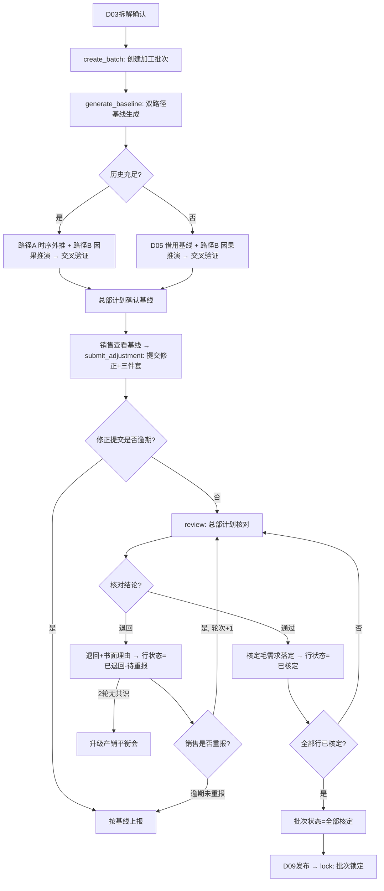

# 毛需求加工（demand_processing）· 应用详设

> **应用名 / 类名**：`demand_processing` / `DemandProcessing`
> **聚合根编号**：4（parts-fc 组）
> **输入来源**：`app/parts-fc/architecture.md` 聚合根卡 + `app/parts-fc/brd/毛需求管理详设.md` §2.3
> **创建日期**：2026-08-08
> **文档状态**：已完成

---

## 1. 需求概览

### 1.1 基本信息
- **需求名称**: 毛需求加工（DemandProcessing）
- **需求编号**: REQ-PFC-DP-001
- **所属模块**: parts-fc / 毛需求加工链 · 阶段2-4
- **需求来源**: 《汽车零部件行业产销协同框架（寄售模式）》§1.1.2 步骤2-4
- **创建日期**: 2026-08-08
- **优先级**: P0

### 1.2 需求背景
#### 1.2.1 为什么需要这个需求？

毛需求加工是需求链的核心加工环节。D03 产出真实消耗（true_qty）后，需将其加工为"核定毛需求"——这个加工过程涉及统计基线生成、销售修正、修正核对三个紧密耦合的阶段，且"三件套登记"（原因类别 + 数据依据 + 责任人）必须在任何改数动作中强制落地、不可拆分。若将五层结构（单头、基线明细、修正明细、核对明细、调整登记）拆散为独立应用，则三件套登记的事务性保证将无法实现，FVA 归因与追责也无数据基础。

#### 1.2.2 期望达到什么目标？

产出核定毛需求（消耗口径），作为 D07/D08/D09 的唯一消耗量输入。通过"基线锚定 + 三件套强制登记 + 多因素核对 + 退回返工循环"四道机制，保证每一次数值调整可追溯、可归因、可衡量 FVA。

### 1.3 需求范围
#### 1.3.1 包含哪些功能？

统计基线生成（双路径+交叉验证）、销售修正（三件套强制登记+分级举证）、修正核对（七视角多因素校准+退回返工循环+2轮升级）、批次管理（创建/状态跟踪/锁定）、调整登记日志。

#### 1.3.2 不包含哪些功能？

通用件汇总去重（D07）、牛鞭修正（D08）、毛需求发布（D09）、信号拆解（属 D03）、独立事件管理（D06）、基线借用登记（D05）、策略拟合（D10）。核定毛需求不含独立事件加项——事件在 D09 发布单上汇合。

### 1.4 涉及角色
**谁会使用这个功能？**

- **总部计划**: 生成基线、确认基线偏差、核对销售修正、校准调整、退回返工、锁定批次。是加工流程的主要操作者与制衡者。
- **一线销售**: 在基线之上提交修正值，登记三件套，响应核对退回并补充证据后重报。仅修正本人负责零件。
- **系统**: 自动生成双路径基线、计算交叉偏差、强制三件套校验、防重提示、逾期催办、轮次跟踪、升级提醒。

---

## 2. 用户故事

### 2.1 核心用户故事

#### 2.1.1 `US-01` 用户故事 -- 基线生成（优先级：P1）

- **故事描述**: 作为总部计划，我想要系统自动生成统计基线（双路径+交叉验证），以便于获得独立于销售偏置的客观锚，作为修正起点与 FVA 标尺。
- **为何赋予此优先级**: 基线是所有后续加工的数据起点。无基线则销售无修正起点、核对无对比基准、FVA 无法衡量。是整个加工链的数据底座。
- **独立测试**: 可通过创建一个加工批次并触发基线生成，验证双路径数值输出、交叉偏差计算、历史不足时的借用联动是否正常运作。
- **前置条件**: D03 已产出 true_qty（拆解已完成）；D10 已提供该零件选定策略 或 D05 已登记借用基线。
- **后置条件**: 每个零件x车型x期间的基线明细行均已生成（含 base_qty / base_path / base_method / source_ref / causal_qty / deviation），基线批次与收集 V 版本绑定。

**验收场景**:

1. `US-01-AC1` **场景: 历史充足时路径A为主基线**
   - **Given** 零件 8210001 有 >=12 个月可用清洗历史且 D10 已选定"指数平滑 α=0.3"，**When** 系统执行 generate_baseline，**Then** 基线路径 = "时序外推"，base_qty = 按指数平滑外推值，base_method = "指数平滑 α=0.3"，source_ref = D10 拟合单号，同时生成路径B参考值 causal_qty 与交叉偏差 deviation。

2. `US-01-AC2` **场景: 交叉偏差超阈时人工确认**
   - **Given** 路径A 时序外推 = 960，路径B 因果 = 1200，deviation = 25% > θ_baseline(15%)，**When** 系统计算偏差，**Then** deviation_reason 必填，人工确认后决定以哪个路径为主基线，原因记录在案。

3. `US-01-AC3` **场景: 历史不足时自动走借用路径**
   - **Given** 零件 8210003（新车型）仅有 2 个月历史、判定历史不足，**When** 系统执行基线生成，**Then** 基线路径 = "借用"，base_qty 取自 D05.get_derived_qty，source_ref = JY 借用单号，路径A 留空并标注历史不足。

4. `US-01-AC4` **场景: 断点零件基线截断**
   - **Given** 零件 8210001-A（旧件）在 2026-10 有断点事件，**When** 系统生成基线，**Then** 断点期及之后的旧件基线不生成（截断），新件基线按 D06 事件启动量衔接。

5. `US-01-AC5` **场景: 上市高后下滑形态禁止线性外推**
   - **Given** 车型生命周期形态 = "上市高后下滑"，**When** 系统生成基线，**Then** 必须使用衰减模型（非简单移动平均/线性外推），否则拒绝生成并报警。

---

#### 2.1.2 `US-02` 用户故事 -- 销售修正（优先级：P1）

- **故事描述**: 作为一线销售，我想要在基线之上提交修正值并登记三件套，以便于注入统计方法看不到的客户侧信息（改款/促销/关系情报），同时保证修正动作全程留痕可追溯。
- **为何赋予此优先级**: 销售修正是"比较优势分工"的落地点——一线有贴近客户的信息优势，基线无法覆盖。同时修正也是放大偏置的源头，必须被三件套与后续核对约束住。
- **独立测试**: 可通过选择一个已生成基线的零件x期间，提交修正值并验证三件套强制校验、幅度率超阈举证拦截、非本人零件拒绝、逾期自动按基线上报。
- **前置条件**: 该零件x期间的基线已生成，状态 = "待修正"；操作人在 D01 中为对应零件的责任销售。
- **后置条件**: 修正明细行生成（含 adj_qty / adj_delta / adj_pct / adj_reason_cat / adj_evidence / adj_owner），调整登记日志在 D04-L 生成一条记录，行状态 = "待核对"（提交后）或保持"待修正"（未提交）。

**验收场景**:

1. `US-02-AC1` **场景: 正常修正提交**
   - **Given** 8210001·2026-09 基线 = 960，销售张三提交 adj_qty = 990，adj_reason_cat = "客户侧情报"，adj_evidence = "邮件记录：客户9月促销备货"，**When** 点击提交，**Then** adj_delta = +30，adj_pct = +3.1%，提交状态 = "已提交"，D04-L 生成一条记录（前值 960 → 后值 990，角色 = 销售）。

2. `US-02-AC2` **场景: 超阈修正未举证被拦截**
   - **Given** 基线 = 960，销售提交 adj_qty = 1200（adj_pct = +25% > θ_rev = 20%），adj_evidence 为空，**When** 点击提交，**Then** 系统拒绝："幅度率 25% 超过阈值 20%，必须附数据依据（客户函件/邮件记录/数据截图）方可提交"。

3. `US-02-AC3` **场景: 销售修正非本人负责零件被拒绝**
   - **Given** 8210001 的责任销售为张三（来自 D01），**When** 李四对该零件提交修正，**Then** 系统拒绝："该零件责任销售为张三，您无权修正"。

4. `US-02-AC4` **场景: 未修正期间基线直通**
   - **Given** 8210001·2026-10 基线 = 1100，销售未对该期间操作，**When** 提交窗口关闭，**Then** 修正幅度为 0，无需登记三件套，行状态 = "按基线上报"。

5. `US-02-AC5` **场景: 逾期催办与自动上报**
   - **Given** 修正窗口已到期、尚有零件未提交修正，**When** 系统检测逾期，**Then** 催办通知相关销售；逾期后仍未提交则行状态 = "按基线上报"，视为无意见。

---

#### 2.1.3 `US-03` 用户故事 -- 修正核对（优先级：P1）

- **故事描述**: 作为总部计划（核对人），我想要沿七个视角对销售修正值进行多因素校准与质询，以便于制衡销售放大偏置，产出可采信的核定毛需求。
- **为何赋予此优先级**: 核对是加工链的"质检关"——是唯一能系统性制衡销售偏置、把控总量的环节。无核对则修正值无约束、放大偏置无对冲。
- **独立测试**: 可通过选择一个已提交的修正行，依次执行形式审查、防重校验、七视角核对，验证通过/退回结论、退回理由强制、轮次计数、2轮升级。
- **前置条件**: 该零件x期间的修正已提交，行状态 = "待核对"。
- **后置条件**: 核对明细行生成（含 chk_result / chk_reason / approved_qty / checker / chk_time），行状态 = "已核定"或"已退回·待重报"。

**验收场景**:

1. `US-03-AC1` **场景: 核对通过（七视角无异常）**
   - **Given** 8210002·2026-09 修正值 = 650，三件套完整，防重校验通过，各视角无异常，**When** 核对人确认通过，**Then** chk_result = "通过"，approved_qty = 650，行状态 = "已核定"。

2. `US-03-AC2` **场景: 形式审查不通过（三件套不完整）**
   - **Given** adj_pct = 25%（超 θ_rev）且 adj_evidence 为空，**When** 核对人进行形式审查，**Then** 判定三件套不完整，退回并注明"幅度率超阈但未举证"。

3. `US-03-AC3` **场景: 防重校验识别与 D06 事件重复**
   - **Given** 8210001·2026-09 修正 +240，D06 已登记 EVT-202608-003 水位脉冲 +180（同零件同期），**When** 核对人执行防重校验，**Then** 系统提示"修正量 +240 与事件 EVT-202608-003（+180）疑似重复"，核对人以"与事件重复"退回。

4. `US-03-AC4` **场景: 退回必须书面理由**
   - **Given** 核对人退回某修正行，**When** 填写退回结论，**Then** chk_reason 必填，必须包含"哪个视角不通过 + 需要什么证据/调整"，否则不能提交退回。

5. `US-03-AC5` **场景: 核对人直接调数也须登记三件套**
   - **Given** 核对人在核对时直接修改修正值（chk_adj_qty ≠ 0），**When** 确认结论，**Then** D04-L 必须生成一条角色 = "核对人"的调整记录（前值/后值/原因类别/数据依据/责任人），与销售修正的三件套约束双向对等。

6. `US-03-AC6` **场景: 2轮无共识升级**
   - **Given** 同一零件x期间已退回 2 次、销售与核对人仍无共识，**When** 第 2 次退回发生，**Then** 系统自动标记"升级产销平衡会"，该行暂停核对流程，待平衡会裁决后录入结论。

---

#### 2.1.4 `US-04` 用户故事 -- 退回返工（优先级：P2）

- **故事描述**: 作为一线销售，我想要收到核对退回通知及其书面理由，以便于了解哪个视角不通过、需要什么证据，补充证据或修正数值后重新提交。
- **为何赋予此优先级**: 退回返工是核对闭环的必要组成部分。没有退回返工，核对就变成单方面否决而非质询机制。虽为 P2（依赖 US-03），但与 US-03 共同构成完整的制衡闭环。
- **独立测试**: 可通过一个被退回的修正行，验证退回理由的完整展示、销售补充证据后重报、轮次累加、2轮升级触发。
- **前置条件**: 该修正行已被核对退回，行状态 = "已退回·待重报"；退回理由（chk_reason）非空。
- **后置条件**: 行状态 = "待核对"（重报后，轮次+1），D04-L 生成新的调整记录。

**验收场景**:

1. `US-04-AC1` **场景: 补充证据后重报通过**
   - **Given** 8210001·2026-09 被退回（理由："与事件 EVT-202608-003 重复、情报证据不足"），**When** 销售剔除与事件重复的 +180 部分、保留 +30 并附邮件记录作为新依据后重报，**Then** adj_qty = 990，D04-L 生成轮次2记录（前值 1200 → 后值 990），行状态 = "待核对（再核）"，chk_round = 2。

2. `US-04-AC2` **场景: 退回后逾期未重报按基线采纳**
   - **Given** 被退回的行在重报窗口内未操作，**When** 重报窗口过期，**Then** 行按基线值采纳（保守处理），记录逾期未重报日志。

3. `US-04-AC3` **场景: 退回理由完整展示**
   - **Given** 某修正行被退回，**When** 销售查看该行状态，**Then** 必须展示：退回轮次、哪个视角不通过、需要什么证据/调整、核对人、退回时间——五个要素齐全。

---

## 3. 业务场景

### 3.1 业务流程描述

#### 3.1.1 场景1: 完整加工流程（从批次创建到全部核定）



1. **创建批次**: D03 拆解确认后，系统或总部计划创建加工批次（proc_batch = PRC-YYYYMM-NNN），绑定客户x工厂x收集 V 版本。
2. **基线生成**: 系统调用 generate_baseline，按零件x车型x期间粒度自动生成双路径基线（路径A 时序外推 / 路径B 因果推演），计算交叉偏差；历史不足零件调用 D05 借基线。
3. **基线确认**: 总部计划审核基线合理性——交叉偏差超阈、断点、衰退等场景人工裁决并记录原因；日常低偏差基线系统自动确认。
4. **销售修正**: 一线销售查看基线，在修正窗口内提交修正值并强制登记三件套；未修正期间基线直通；逾期按基线上报。
5. **修正核对**: 总部计划按"形式审查 → 防重校验 → 七视角多因素校准"三步逐一核对。通过则落定核定毛需求（消耗口径），退回则附书面理由返步骤3。
6. **退回返工**: 销售补充证据或修正数值后重报；2轮无共识升级产销平衡会；逾期未重报按基线采纳。
7. **全部核定**: 所有行均"已核定"或"按基线上报"后，批次状态 = "全部核定"，等待 D09 发布后联动锁定。

#### 3.1.2 场景2: 退回返工循环（含2轮升级）

1. 核对人发现修正值存在问题（证据不足/与事件重复/外部数据背离等），填写退回理由（视角 + 所需证据）后退回。
2. 销售收到退回通知，查看退回理由的五个要素（轮次/视角/所需证据/核对人/时间）。
3. 销售根据退回理由补充客户侧证据（函件/邮件/数据截图）或调整修正值，重新提交。D04-L 生成新的调整记录。
4. 核对人再核——若通过则落定；若仍不通过则第2次退回。
5. 同一零件x期间 2 次退回后仍无共识，系统自动标记"升级产销平衡会"，暂停核对流程。平衡会裁决结果录入 D04-C（核对轮次仍累加）。

### 3.2 业务规则

#### 3.2.1 `BR-01` 基线生成规则 -- 双路径生成与交叉验证

- **规则描述**: 基线按"零件x客户·车型x期间"粒度，走路径A（时序外推）与路径B（因果推演 = 车型产量x单车用量x份额）双路径生成；历史充足时路径A为主基线、路径B为验证；交叉偏差 dev = |A-B|/A；超阈（>θ_baseline，建议15%）须人工确认并记录原因。
- **适用场景**: 加工批次基线生成阶段。
- **计算方式**: 路径A 按 D10 选定方法与参数对清洗后历史结算量外推；路径B 按外生变量（车型产量、单车用量、份额）因果计算；偏差超阈时排查份额/单车用量变化、外部数据时滞、生命周期转折等。
- **示例**: 8210001·2026-09：路径A = 960（指数平滑），路径B = 990，dev = 3.1% ≤ 15%，直接采路径A。

#### 3.2.2 `BR-02` 基线生成规则 -- 历史不足判定与借用联动

- **规则描述**: 可用清洗历史 < 12 个月 或 无完整季节周期 → 判定"历史不足"；路径A 不可用，必须走 D05 基线借用（五种借法）产生基线，借用单号写入 source_ref；借用基线同样参与与路径B的交叉验证。
- **适用场景**: 新车型、短生命周期车型、断点新件等历史不足场景。
- **计算方式**: 系统自动判定历史月数；不足时调用 baseline_borrowing.get_derived_qty 取借用基线值。
- **示例**: 8210003（车型C，新）：2个月历史 → 历史不足 → 走 D05 JY-202608-001（类比车型A 爬坡曲线，经早期校准），基线 = 430，基线路径 = "借用"。

#### 3.2.3 `BR-03` 基线生成规则 -- D10/D05 联动选择

- **规则描述**: 历史充足 → 查 D10 策略仿真拟合表取选定方法+参数（strategy_fitting.get_strategy）；历史不足 → 走 D05 基线借用；借用时以 OEM 滚动预测做先导指标者，取拆解后真实消耗（true_qty），不取原始要货量。
- **适用场景**: 基线方法/参数的选择与来源追溯。
- **示例**: 8210001 历史充足，D10 选定"指数平滑 α=0.3"（D10-2026Q3-017），基线路径 = "时序外推"。

#### 3.2.4 `BR-04` 修正规则 -- 三件套强制登记

- **规则描述**: 任何销售修正提交必须同时登记"原因类别（adj_reason_cat）+ 数据依据（adj_evidence）+ 责任人（adj_owner）"，缺一不可提交；未修正期间基线直通（无需登记三件套）。每次数值改动在 D04-L 生成一条日志记录。
- **适用场景**: 所有销售修正操作。
- **示例**: 销售张三修正 8210001·2026-09：baseline = 960 → adj_qty = 990，adj_reason_cat = "客户侧情报"，adj_evidence = "邮件记录：客户9月促销备货"，adj_owner = "张三"。

#### 3.2.5 `BR-05` 修正规则 -- 分级举证

- **规则描述**: |修正幅度率| = |adj_qty - base_qty| / base_qty；超过阈值 θ_rev（建议20%）视为"过度修正"，adj_evidence 强制非空且须举证（客户函件/邮件记录/数据截图）；阈值内简述理由即可。
- **适用场景**: 销售修正提交时的系统校验。
- **示例**: 基线 960，修正 1200，幅度率 +25% > 20%，未附举证 → 系统拒绝提交。基线 960，修正 990，幅度率 +3.1% ≤ 20%，简述理由即可通过。

#### 3.2.6 `BR-06` 修正规则 -- 修正权限（owner 校验）

- **规则描述**: 修正仅限销售本人在 D01 项目信息台账中负责的零件（owner 校验）；非责任销售无权修正。
- **适用场景**: 销售修正提交时。
- **示例**: 8210001 责任销售 = 张三（来自 D01），李四提交修正 → 系统拒绝并提示无权。

#### 3.2.7 `BR-07` 修正规则 -- 时限与逾期处理

- **规则描述**: 修正窗口内完成提交；逾期系统催办，窗口关闭后仍未提交则行状态 = "按基线上报"，视为销售无修正意见。
- **适用场景**: 修正窗口管理。

#### 3.2.8 `BR-08` 修正规则 -- 修正边界（不直接改 D06 事件）

- **规则描述**: 销售不直接改动 D06 独立事件（脉冲/断点）的事件量；对事件有信息的走事件反馈通道，由计划确认后在 D06 侧登记。
- **适用场景**: 销售修正时涉及脉冲/断点等事件。

#### 3.2.9 `BR-09` 核对规则 -- 七视角多因素校准

- **规则描述**: 核对必须沿七个视角逐一评估：信任校准（历史达成率/偏差方向）、客户侧情报（证据充分性）、外部验证（销量/上险数/排产）、库存水位（脉冲剥离复核）、份额与量纲、生命周期与断点、节奏（停产/检修/季节性）。每个视角记录校准结论。
- **适用场景**: 核对人审核销售修正值。
- **示例**: 8210001 核对：水位视角→ +180 已登记 EVT 独立计入 → 修正 +240 重复嫌疑；情报视角→ 证据仅"口头"不充分 → 退回（水位视角+情报视角不通过，需补充书面证据并剔除与事件重复部分）。

#### 3.2.10 `BR-10` 核对规则 -- 退回必须书面理由

- **规则描述**: 退回时必须填写 chk_reason，必须包含"哪个视角不通过 + 需要什么证据/调整"；chk_reason 为空则不能提交退回。
- **适用场景**: 核对结论为"退回"时。
- **示例**: chk_reason = "水位视角：+180 已登记 EVT-202608-003 独立计入，与修正 +240 重复；情报视角：仅有口头说明，无函件。请补充书面证据并剔除与事件重复部分后重报。"

#### 3.2.11 `BR-11` 核对规则 -- 升级机制

- **规则描述**: 同一零件x期间 2 轮退回后仍无共识 → 升级至产销平衡会或总部仲裁，系统自动标记，暂停核对流程。平衡会裁决结果录入 D04-C。
- **适用场景**: 退回返工循环。
- **示例**: chk_round = 2 且 chk_result = "退回" → 系统标记"升级产销平衡会"，后续裁决录入。

#### 3.2.12 `BR-12` 核对规则 -- 核定毛需求口径

- **规则描述**: 核定毛需求（approved_qty）为消耗口径，不含独立事件加项（脉冲/断点）。独立事件在 D09 发布单上与消耗量汇合（叠加结构，防重复）。
- **适用场景**: 核对通过后落定。
- **示例**: approved_qty = 990（消耗口径），EVT-202608-003（+180）另在 D09 加项汇合，最终发布量 = 990 + 180 = 1170。

#### 3.2.13 `BR-13` 核对规则 -- 核对人调数三件套双向约束

- **规则描述**: 核对人直接校准调整值（chk_adj_qty ≠ 0）时，同样必须在 D04-L 生成三件套记录（角色 = "核对人"），与销售修正的三件套约束双向对等。
- **适用场景**: 核对时直接改数。

#### 3.2.14 `BR-14` 聚合一致性规则 -- 五层同事务

- **规则描述**: 加工单头（D04-H）、基线明细（D04-B）、修正明细（D04-A）、核对明细（D04-C）、调整登记（D04-L）同属一个加工批次的事务边界，不可拆分。任何一层的创建/更新必须在同一事务内完成——这是三件套登记可追溯性的数据前提。
- **适用场景**: 整个 DemandProcessing 聚合的一致性边界。

#### 3.2.15 `BR-15` 聚合一致性规则 -- 三件套双向约束

- **规则描述**: 任何数值调整（无论是销售修正还是核对人校准）都必须在 D04-L 生成记录：角色（销售/核对人）、原因类别、数据依据、责任人、前值、后值、时间——七要素齐全。这是 FVA 衡量与追责的数据基础。
- **适用场景**: 所有改数操作。

#### 3.2.16 `BR-16` 状态流转规则 -- 行级状态隧道

- **规则描述**: 行级状态（零件x车型x期间）严格按隧道流转：待生成基线 → 待修正 → 待核对 → 已核定（通过）或 已退回·待重报 → 待核对（重报轮次+1 → 再核通过 → 已核定 或 再退回 → 2轮升级）。状态不可跳跃、不可回退至非相邻状态。
- **适用场景**: 行级状态机。

#### 3.2.17 `BR-17` 状态流转规则 -- 批次级联动锁定

- **规则描述**: D09 R版发布 → 联动锁定对应 D04 加工批次与 D03 V版本（三层同锁）。锁定后任何改数只能走版本修订（新批次），全程留痕。
- **适用场景**: 加工批次生命周期终点。

### 3.3 业务数据

#### 3.3.1 数据1: 加工批次（proc_batch）
- **数据描述**: 一次加工批次的唯一标识，绑定客户x工厂x收集 V 版本，是五层明细的归属容器。
- **数据类型**: 字符串（编码规则 PRC-YYYYMM-NNN）。
- **数据来源**: 系统自动生成。
- **示例值**: PRC-202608-001

#### 3.3.2 数据2: 统计基线值（base_qty）
- **数据描述**: 系统生成的客观锚值，独立于销售偏置，是修正起点与 FVA 基准。
- **数据类型**: 十进制数（件/套）。
- **数据来源**: 路径A（时序外推）或 借用基线（D05）。
- **示例值**: 960

#### 3.3.3 数据3: 交叉偏差（deviation）
- **数据描述**: 双路径基线差异的量化指标，用于识别基线可信度问题。
- **数据类型**: 十进制百分比。
- **数据来源**: 系统自动计算 dev = |A-B|/A。
- **示例值**: 3.1%

#### 3.3.4 数据4: 销售修正值（adj_qty）
- **数据描述**: 销售在基线之上注入客户侧信息后的修正数值，须附三件套登记。
- **数据类型**: 十进制数（件/套）。
- **数据来源**: 一线销售手动输入。
- **示例值**: 990

#### 3.3.5 数据5: 修正幅度率（adj_pct）
- **数据描述**: 修正值相对于基线的偏离百分比，用于分级举证判定。
- **数据类型**: 十进制百分比（带符号，上调+/下调-）。
- **数据来源**: 系统自动计算 (adj_qty - base_qty) / base_qty。
- **示例值**: +3.1%

#### 3.3.6 数据6: 三件套（原因类别 + 数据依据 + 责任人）
- **数据描述**: 每次数值调整必须填写的三要素——可追溯、可归因、可衡量 FVA 的前提。
- **数据类型**: 枚举（adj_reason_cat）/文本（adj_evidence）/用户引用（adj_owner）。
- **数据来源**: 操作人填写，责任人系统自动带出。
- **示例值**: 客户侧情报 / "邮件记录：客户9月促销备货" / 张三

#### 3.3.7 数据7: 核对结论（chk_result）
- **数据描述**: 总部计划对销售修正的审核结论。
- **数据类型**: 枚举值（通过 / 退回）。
- **数据来源**: 核对人操作。
- **示例值**: 退回

#### 3.3.8 数据8: 退回理由（chk_reason）
- **数据描述**: 退回时必填的书面理由，包含不通过的视角与所需证据。
- **数据类型**: 文本。
- **数据来源**: 核对人填写。
- **示例值**: "水位视角：+180 已登记 EVT-202608-003 独立计入，与修正 +240 重复；情报视角：仅有口头说明无函件。请补充书面证据并剔除重复部分后重报。"

#### 3.3.9 数据9: 核定毛需求（approved_qty）
- **数据描述**: 核对通过后落定的最终消耗口径值，是下游 D07/D08/D09 的消耗量输入。
- **数据类型**: 十进制数（件/套）。
- **数据来源**: 核对通过后由系统落定。
- **示例值**: 990（消耗口径，不含事件）

### 3.4 状态机

#### 3.4.1 行级状态机（零件x车型x期间）

```
                    ┌── 逾期未修正 ──→ 按基线上报（流出 D07/D08）
                    │
待生成基线 ──基线生成──→ 待修正 ──销售提交──→ 待核对
                                    │               │
                                    │        ┌──────┘
                                    │        ▼
                                    │   ┌─────────────┐
                                    │   │  核对结论?   │
                                    │   └─────────────┘
                                    │     │         │
                                    │    通过      退回（附书面理由）
                                    │     │         │
                                    │     ▼         ▼
                                    │  已核定   已退回·待重报
                                    │     │         │
                                    │     │    ┌────┴────┐
                                    │     │    │         │
                                    │     │  销售重报   逾期未重报
                                    │     │  (轮次+1)    │
                                    │     │    │         ▼
                                    │     │    │    按基线上报
                                    │     │    ▼
                                    │     │  待核对
                                    │     │    │
                                    │     │    ├── 通过 → 已核定
                                    │     │    └── 退回 → 2轮无共识 → 升级产销平衡会
                                    │     │
                                    └─────┴──→ 已核定 ──→（流出 D07/D08）
```

**行级状态转换规则矩阵:**

| 当前状态 | 目标状态 | 触发动作 | 前置条件 |
|----------|----------|----------|----------|
| (新建) | 待生成基线 | 创建加工批次 | 单头已绑定客户+工厂+V版本 |
| 待生成基线 | 待修正 | 基线生成完成 | 双路径输出或借用基线已生成并确认 |
| 待修正 | 待核对 | 销售提交修正 | 三件套完整；若非超阈则证据可简述；owner 校验通过 |
| 待修正 | 按基线上报 | 逾期未修正 | 修正窗口已关闭，系统自动触发 |
| 待核对 | 已核定 | 核对通过 | 形式审查/防重校验/七视角皆通过 |
| 待核对 | 已退回·待重报 | 核对退回 | chk_reason 必填（视角+所需证据） |
| 已退回·待重报 | 待核对 | 销售重报 | 轮次+1；D04-L 新记录 |
| 已退回·待重报 | 按基线上报 | 逾期未重报 | 重报窗口过期 |
| 已退回·待重报 | 升级产销平衡会 | 2轮无共识 | chk_round ≥ 2 且 chk_result = "退回" |

#### 3.4.2 批次级状态机

```
进行中 ──全部行核定──→ 全部核定 ──D09 R版发布──→ 已锁定
```

**批次级状态转换规则矩阵:**

| 当前状态 | 目标状态 | 触发动作 | 前置条件 |
|----------|----------|----------|----------|
| (新建) | 进行中 | 创建批次 | D03 拆解已确认 |
| 进行中 | 全部核定 | 全部行进入"已核定"或"按基线上报" | 每行均已终态 |
| 全部核定 | 已锁定 | D09 R版发布，调用 lock() | D09 发布完成，D03 对应 V 版本同步锁定 |

> 已锁定与 D03 联动：D09 发布后，对应 D04 批次与 D03 V 版本同步锁定；锁定后任何改数只能走版本修订（新批次），全程留痕。

---

## 4. 功能描述

### 4.1 功能清单

| 一级菜单/模块 | 一级模块编号 | 二级菜单/模块 | 二级模块编号 | 三级功能 | 三级功能编号 | 功能类型 | 优先级 | 三级功能简述 |
|---|---|---|---|---|---|---|---|---|
| 毛需求加工 | F01 | 加工批次管理 | F01-01 | 创建加工批次 | F01-01-01 | 接口 | P1 | 绑定客户/工厂/V版本，创建加工批次单头，初始化五层结构 |
| 毛需求加工 | F01 | 加工批次管理 | F01-01 | 批次状态查询 | F01-01-02 | 接口 | P1 | 查询批次整体状态（进行中/全部核定/已锁定） |
| 毛需求加工 | F01 | 加工批次管理 | F01-01 | 锁定加工批次 | F01-01-03 | 接口 | P1 | D09 R版发布后联动锁定，三层同锁 |
| 毛需求加工 | F01 | 基线管理 | F01-02 | 生成统计基线 | F01-02-01 | 定时任务/接口 | P1 | 双路径生成+交叉验证+历史不足D05联动+基线确认 |
| 毛需求加工 | F01 | 基线管理 | F01-02 | 查询基线明细 | F01-02-02 | 接口 | P1 | 按批次/零件/期间取基线明细 |
| 毛需求加工 | F01 | 销售修正 | F01-03 | 提交销售修正 | F01-03-01 | 表单页/接口 | P1 | 三件套强制登记+分级举证+owner校验+逾期处理 |
| 毛需求加工 | F01 | 修正核对 | F01-04 | 执行修正核对 | F01-04-01 | 表单页/接口 | P1 | 七视角多因素校准+退回返工+2轮升级+调整日志 |
| 毛需求加工 | F01 | 修正核对 | F01-04 | 查询核定毛需求 | F01-04-02 | 接口 | P1 | 供 D07/D08/D09 取消耗口径核定值 |

### 4.2 功能模块结构图

```
F01 毛需求加工（应用：demand_processing）
├── F01-01 加工批次管理
│   ├── F01-01-01 创建加工批次（接口，P1）
│   ├── F01-01-02 批次状态查询（接口，P1）
│   └── F01-01-03 锁定加工批次（接口，P1）
├── F01-02 基线管理
│   ├── F01-02-01 生成统计基线（定时任务/接口，P1）
│   └── F01-02-02 查询基线明细（接口，P1）
├── F01-03 销售修正
│   └── F01-03-01 提交销售修正（表单页/接口，P1）
└── F01-04 修正核对
    ├── F01-04-01 执行修正核对（表单页/接口，P1）
    └── F01-04-02 查询核定毛需求（接口，P1）
```

### 4.3 功能详细说明

---

#### 4.3.1 F01-01 加工批次管理

##### 4.3.1.1 功能1: F01-01-01 创建加工批次

**功能描述**:
D03 拆解确认后，系统或总部计划创建加工批次，绑定客户x工厂x收集 V 版本，初始化五层结构（单头+基线明细空表+修正明细空表+核对明细空表+调整登记空表）。加工批次是五层明细的统一事务容器。

**用户操作流程**:
1. 系统检测 D03 收集单状态变为"已拆解"。
2. 系统自动创建加工批次（或总部计划手动触发）：生成 proc_batch 编号、绑定 oem_code / plant_code / fcst_version。
3. 系统初始化五层空表，批次状态 = "进行中"。
4. 系统自动触发基线生成（F01-02-01）。

**输入数据**:
- oem_code: 客户编码 - 引用客户主数据 - 示例：主机厂A
- plant_code: OEM工厂 - 引用客户主数据 - 示例：一工厂
- fcst_version: 收集V版本 - 引用 D03-H.fcst_version - 示例：V2026-08

**输出数据**:
- proc_batch: 加工批次号 - 编码 PRC-YYYYMM-NNN - 示例：PRC-202608-001
- status: 批次状态 - 进行中 - 示例：进行中
- start_time: 创建时间 - 系统时间 - 示例：2026-08-06 10:00:00

**业务规则**:
- 同一客户+工厂+V版本只能有一个加工批次（唯一约束）。
- 创建后五层表同步初始化，不可部分创建。
- D03 未进入"已拆解"状态时不能创建批次（前置状态校验）。

**特殊处理**:
- 调用路径：create_batch 可能由 D03 拆解确认事件自动触发，也可能由总部计划手动触发（事后补建）。

**业务实体**:
- **D04-H 加工单头**: 批次容器，绑定客户x工厂xV版本，聚合根入口。

**D04-H 加工单头字段**

| 字段名称 | 字段类型 | 是否必填 | 默认值 | 业务逻辑 |
|---|---|---|---|---|
| proc_batch | 文本 | 否 | - | PK，系统自动生成，编码规则 `PRC-YYYYMM-NNN` |
| oem_code | 文本（引用） | 是 | - | 引用客户主数据，创建时绑定 |
| plant_code | 文本（引用） | 是 | - | 引用客户主数据，同一主机厂多工厂分别加工 |
| fcst_version | 文本（引用） | 是 | - | FK→D03-H，绑定收集V版本 |
| status | 枚举值 | 是 | 进行中 | 进行中 / 全部核定 / 已锁定 |
| start_time | 时间 | 是 | 系统时间 | 批次创建时间 |
| finish_time | 时间 | 否 | - | 全部核定时间，状态流转时回填 |

---

##### 4.3.1.2 功能2: F01-01-02 批次状态查询

**功能描述**:
查询指定加工批次的整体状态，返回批次状态 + 各行状态的汇总统计（待修正数/待核对数/已核定数/退回数等）。

**输出数据**:
- proc_batch + status + 统计摘要（total_lines / pending_adj / pending_review / approved / returned / escalated）

---

##### 4.3.1.3 功能3: F01-01-03 锁定加工批次

**功能描述**:
D09 R版发布后联动调用，将加工批次状态置为"已锁定"，锁定后任何修改禁止。同步触发 D03 V 版本锁定（三层同锁）。

**输入数据**:
- proc_batch: 加工批次号
- caller: 调用方标识（D09发布单号）

**业务规则**:
- 仅"全部核定"状态可锁定。
- 锁定后所有五层数据只读，改数必须走新批次。

---

#### 4.3.2 F01-02 基线管理

##### 4.3.2.1 功能1: F01-02-01 生成统计基线

**功能描述**:
系统按"零件x客户·车型x期间"粒度自动生成统计基线。核心逻辑包括：① 双路径生成（路径A 时序外推 + 路径B 因果推演）；② 交叉验证计算偏差；③ 历史充足判定与 D10/D05 联动选择；④ 断点/衰退等特殊场景处理。生成的基线明细行存入 D04-B。

**用户操作流程**:
1. 系统自动遍历批次关联的 D03 收集明细（按 D01 项目台账筛选进行中项目）。
2. 对每个零件x车型x期间：
   a. 判定历史充足性（>=12个月可用清洗历史且覆盖完整季节周期）。
   b. 历史充足 → 调用 strategy_fitting.get_strategy 取选定方法+参数，执行路径A 时序外推。
   c. 历史不足 → 调用 baseline_borrowing.get_derived_qty 取借用基线作为路径A替代。
   d. 计算路径B 因果值 = 车型产量预测 x 单车用量（D02）x 份额（D01）。
   e. 计算交叉偏差 dev = |A-B|/A。
   f. dev ≤ θ_baseline(15%) → 自动确认；超阈 → 标红待人工确认，deviation_reason 必填。
   g. 断点期旧件基线截断（不生成），新件按 D06 事件启动量衔接。
   h. 上市高后下滑形态强制使用衰减模型。
3. 所有基线明细行写入 D04-B，行状态 = "待修正"。
4. 总部计划审核确认后基线生效。

**输入数据**:
- proc_batch: 加工批次号
- true_qty（来自 D03-S，generate_baseline 内部调 demand_collection.get_true_qty）
- D10 选定策略（来自 strategy_fitting.get_strategy）
- D05 借用基线（来自 baseline_borrowing.get_derived_qty，仅历史不足时）
- 外生变量：车型产量预测、单车用量（D02）、份额（D01）

**输出数据**:
- D04-B 基线明细行（见字段表）

**业务规则**:
- BR-01（双路径交叉验证）、BR-02（历史不足判定）、BR-03（D10/D05 联动）。
- 脉冲/事件不进基线：基线输入为 true_qty（已拆解剥离脉冲）。
- 上市高后下滑形态禁止线性外推。
- 通用件按客户分别生成基线，不汇总。

**特殊处理**:
- 跨应用调用：self.fde.call strategy_fitting.get_strategy（取方法+参数）；self.fde.call strategy_fitting.forecast（执行外推计算，按 §8 算法规格）；self.fde.call baseline_borrowing.get_derived_qty（取借用基线）；self.fde.call demand_collection.get_true_qty（取真实消耗）。
- 基线批次与 V 版本绑定，策略/数据变化触发重生成时历史版本不覆盖。

**业务实体**:
- **D04-B 基线明细**: 每个零件x车型x期间一行，记录双路径输出与交叉验证结果。

**D04-B 基线明细字段**

| 字段名称 | 字段类型 | 是否必填 | 默认值 | 业务逻辑 |
|---|---|---|---|---|
| proc_batch | 文本（引用） | 是 | - | FK→D04-H，归属批次 |
| base_batch | 文本 | 是 | 系统生成 | 基线批次/版本号，格式 `B-YYYYMM-NNN`，绑定收集 V 版本 + 期间 |
| part_no | 文本（引用） | 是 | - | 引用物料主数据，基线粒度 |
| veh_model | 文本（引用） | 是 | - | 客户车型，引用 vehicle_part_map |
| period | 日期（YYYY-MM） | 是 | - | 基线生成期间，如 2026-09 |
| base_qty | 数字 | 是 | - | 统计基线值，路径A 或借用路径的输出 |
| base_path | 枚举值 | 是 | - | 时序外推 / 因果推演 / 借用 |
| base_method | 文本 | 是 | - | 方法+参数，如"指数平滑 α=0.3"；借用则记借法+来源 |
| source_ref | 文本 | 是 | - | D10 拟合单号 或 D05 借用单号 |
| causal_qty | 数字 | 是 | - | 路径B 参考值 = 车型产量 x 单车用量 x 份额 |
| deviation | 数字（百分比） | 是 | - | 交叉偏差 = \|A-B\|/A，系统自动计算 |
| deviation_reason | 文本 | 条件必填 | - | 交叉偏差超阈时必填，记录排查原因 |
| generator | 文本（引用） | 是 | - | 生成人（系统/总部计划） |
| gen_time | 时间 | 是 | 系统时间 | 生成时间 |

---

##### 4.3.2.2 功能2: F01-02-02 查询基线明细

**功能描述**:
按批次/零件/期间等条件取基线明细，供销售修正页面展示和下游取数使用。

**输入数据**:
- proc_batch（必填）
- part_no（可选，筛选指定零件）
- period（可选，筛选指定期间）

**输出数据**:
- D04-B 基线明细行列表。

---

#### 4.3.3 F01-03 销售修正

##### 4.3.3.1 功能1: F01-03-01 提交销售修正

**功能描述**:
一线销售在基线之上提交修正值，系统强制登记三件套（原因类别+数据依据+责任人），执行分级举证校验、owner 校验、防重复校验。修正值存 D04-A，每次调整在 D04-L 生成日志。

**用户操作流程**:
1. 销售在修正页面查看基线值（来自 D04-B）与事件提示（来自 D06）。
2. 对需要修正的零件x期间，输入 adj_qty。
3. 选择 adj_reason_cat（原因类别枚举）。
4. 填写 adj_evidence（数据依据——幅度率超 θ_rev 时强制非空）。
5. 点击提交。
6. 系统执行校验：
   a. owner 校验：该零件在 D01 中的责任销售是否为当前用户。
   b. 三件套完整性：adj_reason_cat + adj_evidence + adj_owner 齐全。
   c. 分级举证：若 |adj_pct| > θ_rev(20%) 且 adj_evidence 为空，拒绝。
   d. 防重提示：系统调 independent_event.list 比对修正量与事件量，提示疑似重复（不硬阻断，留核对环节裁决）。
7. 校验通过后写入 D04-A（修正明细），同时写入 D04-L（调整登记日志）。
8. 行状态 = "待核对"，submit_status = "已提交"。

**输入数据**:
- proc_batch: 加工批次号
- part_no: 零件号
- period: 期间
- adj_qty: 销售修正值
- adj_reason_cat: 原因类别（枚举）
- adj_evidence: 数据依据（文本，超阈强制）

**输出数据**:
- D04-A 修正明细行（当前修正值）
- D04-L 调整登记日志行

**业务规则**:
- BR-04（三件套强制）、BR-05（分级举证）、BR-06（owner校验）、BR-07（时限逾期）、BR-08（边界-不直接改D06事件）。
- 未修正期间基线直通（修正幅度0，无需登记三件套）。
- 修正窗口过期后系统自动将未修正行标记为"按基线上报"。

**特殊处理**:
- 跨应用调用：submit_adjustment → 调 independent_event.list 做防重校验（修正量不得与事件重复）。
- 通用件各销售只修各自客户份额，汇总去重归步骤5/D07，本步不汇总。

**业务实体**:
- **D04-A 修正明细**: 每个零件x车型x期间存当前修正值，历史版本在 D04-L。

**D04-A 修正明细字段**

| 字段名称 | 字段类型 | 是否必填 | 默认值 | 业务逻辑 |
|---|---|---|---|---|
| proc_batch | 文本（引用） | 是 | - | FK→D04-H |
| part_no | 文本（引用） | 是 | - | 引用物料主数据 |
| veh_model | 文本（引用） | 是 | - | 客户车型 |
| period | 日期（YYYY-MM） | 是 | - | 修正期间 |
| base_qty | 数字 | 是 | - | 统计基线（快照自 D04-B） |
| adj_qty | 数字 | 是 | - | 销售修正值 |
| adj_delta | 数字 | 是 | - | 修正幅度 = adj_qty - base_qty，系统计算 |
| adj_pct | 数字（百分比） | 是 | - | 幅度率 = adj_delta / base_qty，系统计算 |
| adj_reason_cat | 枚举值 | 是 | - | 原因类别：客户侧情报/份额量纲/生命周期/节奏/外部验证背离/水位校准/其他 |
| adj_evidence | 文本 | 条件必填 | - | 幅度率超 θ_rev 时强制非空，须举证 |
| adj_owner | 文本（引用） | 是 | - | 责任人（操作销售），系统自动带出 |
| submit_status | 枚举值 | 是 | 待提交 | 待提交 / 已提交 / 逾期 |
| submit_time | 时间 | 是 | 系统时间 | 提交时间 |

---

#### 4.3.4 F01-04 修正核对

##### 4.3.4.1 功能1: F01-04-01 执行修正核对

**功能描述**:
总部计划对销售修正值进行质询与多因素校准。核对流程分四步：① 形式审查（三件套完整性+分级举证）；② 防重校验（与D06事件交叉检查）；③ 七视角多因素校准；④ 结论与登记（通过→落定核定毛需求 / 退回→附书面理由返步骤3）。核对人直接调数时同样登记三件套。

**用户操作流程**:
1. 核对人打开待核对行列表（按批次+状态筛选）。
2. 选择一行进入核对详情页，系统展示：
   - 统计基线及来源（来自 D04-B）
   - 销售修正值及三件套（来自 D04-A）
   - D06 事件清单（同期同零件，防重）
   - 七视角参考数据（信任折扣/外生变量/水位/份额/生命周期/节奏）
3. **Step 1 形式审查**: 核对人检查三件套完整性，幅度率超阈是否举证，逾期未修正按基线处理。
4. **Step 2 防重校验**: 系统高亮提示修正量与 D06 事件的交叉重复嫌疑；核对人判定是否重复。
5. **Step 3 多因素校准**: 核对人逐一沿七视角填写校准结论（无异常 = "视角通过"）。
6. **Step 4 结论**:
   - 通过 → chk_result = "通过"，approved_qty 落定（消耗口径），行状态 = "已核定"。
   - 退回 → chk_result = "退回"，chk_reason 必填（视角+所需证据），行状态 = "已退回·待重报"。
   - 若核对人直接校准 chk_adj_qty ≠ 0 → 必在 D04-L 登记三件套（角色 = "核对人"）。
7. 写入 D04-C（核对明细），轮次+1；若 chk_adj_qty 非零则写入 D04-L。

**输入数据**:
- proc_batch + part_no + period: 定位待核对行
- chk_result: 核对结论（通过/退回）
- chk_reason: 退回理由（退回必填）
- chk_adj_qty: 核对人校准调整值（可选，调数时填）

**输出数据**:
- D04-C 核对明细行
- D04-L 调整登记日志行（若核对人调数）

**业务规则**:
- BR-09（七视角多因素校准）、BR-10（退回必须书面理由）、BR-11（2轮升级）、BR-12（核定毛需求为消耗口径）、BR-13（核对人调数三件套双向约束）。

**特殊处理**:
- 跨应用调用：review 内部引用 D06 事件清单（independent_event.list）、D12 信任折扣、外部爬取数据等（只读展示，不修改）。
- 2 轮退回后仍无共识 → 系统标记"升级产销平衡会"，暂停核对流程。平衡会裁决结果后续以人工方式录入 D04-C。
- 退回后销售逾期未重报 → 按基线采纳（保守处理）。

**业务实体**:
- **D04-C 核对明细**: 每个零件x车型x期间x轮次一行，记录核对结论与校准调整。

**D04-C 核对明细字段**

| 字段名称 | 字段类型 | 是否必填 | 默认值 | 业务逻辑 |
|---|---|---|---|---|
| proc_batch | 文本（引用） | 是 | - | FK→D04-H |
| part_no | 文本（引用） | 是 | - | 引用物料主数据 |
| veh_model | 文本（引用） | 是 | - | 客户车型 |
| period | 日期（YYYY-MM） | 是 | - | 核对期间 |
| chk_round | 整数 | 是 | 1 | 核对轮次，首次核对=1，每次退回重报后+1 |
| base_qty | 数字 | 是 | - | 统计基线（快照自 D04-B） |
| adj_qty | 数字 | 是 | - | 当前提交的销售修正值 |
| chk_result | 枚举值 | 是 | - | 通过 / 退回 |
| chk_reason | 文本 | 条件必填 | - | 退回必填：视角 + 所需证据/调整 |
| chk_adj_qty | 数字 | 否 | 0 | 核对人校准调整值，非零时须在 D04-L 登记三件套 |
| approved_qty | 数字 | 条件必填 | - | 通过后落定的核定毛需求（消耗口径），退回时为空 |
| checker | 文本（引用） | 是 | - | 核对人（总部计划） |
| chk_time | 时间 | 是 | 系统时间 | 核对时间 |

---

##### 4.3.4.2 功能2: F01-04-02 查询核定毛需求

**功能描述**:
供下游聚合（D07/D08/D09/FVA）取核定毛需求。返回消耗口径的核定值列表，不含独立事件加项。

**输入数据**:
- proc_batch（可选，指定批次）
- part_no（可选，筛选零件）
- period（可选，筛选期间）

**输出数据**:
- 列表：[proc_batch, part_no, veh_model, period, approved_qty, checker, chk_time, ...]

**特殊处理**:
- 仅返回 chk_result = "通过" 的行的 approved_qty；退回/待核对行不返回。
- 供 D07.create（通用件汇总取核定值）、D08.create（牛鞭修正取核定值）、D09.create_draft（发布取消耗量）、FA.create（FVA 取基线/修正快照）。

---

#### 4.3.5 D04-L 调整登记表（子实体）

**功能描述**:
D04-L 是五层结构中的"审计日志层"——所有数值调整动作（销售修正提交、销售重报、核对人校准）都在此生成一条记录。D04-A 存当前值，D04-L 存调整历史。追责与 FVA 归因查 D04-L。

**用户操作流程**:
- 非独立操作——由 F01-03-01（销售修正）和 F01-04-01（核对校准）自动触发写入，无独立用户界面。

**D04-L 调整登记表字段**

| 字段名称 | 字段类型 | 是否必填 | 默认值 | 业务逻辑 |
|---|---|---|---|---|
| proc_batch | 文本（引用） | 是 | - | FK→D04-H |
| part_no | 文本（引用） | 是 | - | 引用物料主数据 |
| veh_model | 文本（引用） | 是 | - | 客户车型 |
| period | 日期（YYYY-MM） | 是 | - | 调整期间 |
| adj_seq | 整数 | 是 | - | 同一零件x车型x期间内的调整序号，递增 |
| actor_role | 枚举值 | 是 | - | 销售 / 核对人 |
| before_qty | 数字 | 是 | - | 调整前值 |
| after_qty | 数字 | 是 | - | 调整后值 |
| reason_cat | 枚举值 | 是 | - | 原因类别（见 D04-A.adj_reason_cat 枚举） |
| evidence | 文本 | 是 | - | 数据依据（三件套之一） |
| actor | 文本（引用） | 是 | - | 操作人（三件套之一） |
| action_time | 时间 | 是 | 系统时间 | 操作时间 |

> 三件套双向约束：任何数值调整（销售修正或核对人校准）必须在 D04-L 生成一条包含 actor_role + reason_cat + evidence + actor + before_qty + after_qty + action_time 七要素的记录。

---

## 5. 权限要求

### 5.1 功能权限

| 功能名称 | 权限标识 | 总部计划 | 一线销售 | 系统 |
|---|---|---|---|---|
| 创建加工批次 | `demand_processing:batch:create` | 可访问 | 不可访问 | 自动触发 |
| 批次状态查询 | `demand_processing:batch:query` | 可访问 | 可访问 | - |
| 锁定加工批次 | `demand_processing:batch:lock` | 可访问 | 不可访问 | D09联动自动触发 |
| 生成统计基线 | `demand_processing:baseline:generate` | 可访问 | 不可访问 | 自动执行 |
| 查询基线明细 | `demand_processing:baseline:query` | 可访问 | 可访问 | - |
| 提交销售修正 | `demand_processing:adjustment:submit` | 不可访问 | 可访问（仅本人负责零件） | - |
| 执行修正核对 | `demand_processing:review:execute` | 可访问 | 不可访问 | - |
| 查询核定毛需求 | `demand_processing:approved:query` | 可访问 | 可访问 | - |

> 权限标识遵循项目约定：`{module}:{resource}:{action}`。

### 5.2 数据权限

#### 5.2.1 角色1: 总部计划
- 可以查看和操作所有客户、所有零件的加工批次（全局视角）。
- 可以生成基线、确认基线偏差、核对所有销售修正、退回返工、锁定批次。
- 是加工流程的主要操作者与制衡者。

#### 5.2.2 角色2: 一线销售
- 只能查看本人负责零件（D01.owner = 本人）的基线与修正明细。
- 只能提交本人负责零件的修正值（owner 校验）。
- 不能查看其他销售负责零件的修正值与核对记录。
- 不能生成基线、不能执行核对、不能锁定批次。
- 可查看本人负责零件的核定毛需求。

---

## 6. 验收标准

### 6.1 功能验收标准

#### 6.1.1 标准1: 基线生成完整性
- **关联用户故事**: US-01
- **关联业务规则**: BR-01, BR-02, BR-03
- **验证方式**: 创建加工批次后触发基线生成，检查所有进行中项目零件的基线明细是否全覆盖。
- **测试数据**: 使用 BRD §2.3.3 h) 表样数据（8210001/8210002/8210003/STD-M6）。
- **预期结果**: 每个零件x车型x期间均有 base_qty、base_path、base_method、source_ref、causal_qty、deviation；历史充足的走时序外推，历史不足的走借用；deviation 超阈的行 deviation_reason 非空。

#### 6.1.2 标准2: 三件套强制登记
- **关联用户故事**: US-02
- **关联业务规则**: BR-04, BR-05
- **验证方式**: (a) 正常提交修正（含三件套）→校验通过；(b) 提交修正但缺 adj_reason_cat → 拒绝；(c) 幅度率超阈但 adj_evidence 为空 → 拒绝。
- **测试数据**: 基线=960，修正=990（+3.1%需简述）、修正=1200（+25%需举证）。
- **预期结果**: (a) 成功，D04-L 生成记录；(b) 拒绝并提示缺原因类别；(c) 拒绝并提示"幅度率超阈必须附数据依据"。

#### 6.1.3 标准3: Owner 校验
- **关联用户故事**: US-02
- **关联业务规则**: BR-06
- **验证方式**: 非责任销售尝试修正 → 系统拒绝。
- **测试数据**: 8210001 责任销售=张三（D01），李四提交修正。
- **预期结果**: 系统拒绝并提示"该零件责任销售为张三，您无权修正"。

#### 6.1.4 标准4: 核对通过与退回
- **关联用户故事**: US-03
- **关联业务规则**: BR-09, BR-10, BR-13
- **验证方式**: (a) 七视角无异常的修正 → 通过，approved_qty 落定；(b) 退回时不填 chk_reason → 拒绝；(c) 核对人直接改 chk_adj_qty → D04-L 必须生成核对人三件套记录。
- **测试数据**: 使用 BRD §2.3.5 i) 表样数据。
- **预期结果**: (a) 行状态=已核定；(b) 拒绝并提示"退回必须填写理由"；(c) D04-L 生成一条 actor_role="核对人"的记录。

#### 6.1.5 标准5: 退回返工循环与升级
- **关联用户故事**: US-04, US-03
- **关联业务规则**: BR-11
- **验证方式**: 同一零件x期间连续2次退回 → 第2次退回后系统标记升级。
- **测试数据**: 模拟2轮退回流程。
- **预期结果**: chk_round=2 且 chk_result="退回" → 系统标记"升级产销平衡会"，暂停核对。

#### 6.1.6 标准6: 调整登记日志完整性
- **关联用户故事**: US-02, US-03, US-04
- **关联业务规则**: BR-14, BR-15
- **验证方式**: 查询 D04-L，验证每次改数动作均有记录。
- **测试数据**: 执行一轮完整的"基线→修正（退回）→重报→核对通过"流程。
- **预期结果**: D04-L 至少包含3条记录（首次提交、重报、核对校准），每条含七要素。

#### 6.1.7 标准7: 批次状态流转
- **关联用户故事**: US-01, US-02, US-03, US-04
- **关联业务规则**: BR-16, BR-17
- **验证方式**: 全部行核定后检查批次状态 → "全部核定"；触发 lock → "已锁定"。
- **预期结果**: 状态流转按隧道规则，不可跳跃；锁定后禁止任何修改。

### 6.2 非功能验收标准
- **性能要求**: 基线生成（含双路径计算、D10/D05 联动调用）响应时间 < 30 秒（批处理场景）。
- **安全性要求**: Owner 校验不可绕过；三件套强制在服务端校验（非仅前端校验）。
- **事务性要求**: 五层（D04-H/B/A/C/L）同一加工批次内的写入操作必须在同一事务中完成。
- **兼容性要求**: 接口（get_approved 等）支持适配 D07/D08/D09/FVA 调用方的数据格式。

### 6.3 已知问题或限制
- 基线生成中的历史充足判定阈值（12个月）为建议值，需在试运行后校准。
- 交叉偏差阈值 θ_baseline（15%）、修正幅度率阈值 θ_rev（20%）为建议值，需在试运行后按业务表现校准。
- 七视角中的"外部验证"视角依赖外部爬取数据的完整性与时效性——外部数据不可得时该视角降级为"跳过（数据不可得）"，由核对人自行判断。
- 升级至产销平衡会后的裁决结果录入为人工操作，系统暂不提供平衡会裁决的线上流程。
- 通用件的修正提交不感知其他销售的加码（各销售独立提交），汇总虚高风险由 D07 环节消解。

---

## 7. 参考资料

### 7.1 相关文档
- 《汽车零部件行业产销协同框架（寄售模式）》§1.1.2 步骤2-4、§1.1.5、§1.1.8、§1.1.9 — 毛需求加工的业务框架与分工逻辑
- `app/parts-fc/brd/毛需求管理详设.md` §2.3（D04 加工表，行 601-1001）— 步骤2/3/4 的完整详设与表样
- `app/parts-fc/architecture.md` 聚合根卡 #4 — 毛需求加工的聚合根识别与边界
- `design/应用设计.md` — 本详设文档的模板规格与填写契约

### 7.2 相关功能（上下游聚合根）
- **project_ledger（D01）**: 提供项目阶段、责任销售信息（修正权限校验、生命周期视角）
- **vehicle_part_map（D02）**: 提供单车用量/份额（因果路径B量纲转换、量纲校准视角）
- **demand_collection（D03）**: 提供 true_qty（基线输入），拆解确认后触发 create_batch
- **strategy_fitting（D10）**: 提供选定预测策略与参数（基线方法来源）
- **baseline_borrowing（D05）**: 提供借用基线（历史不足时）
- **independent_event（D06）**: 提供事件清单（防重校验视角）
- **common_parts_agg（D07）**: 消费通用件核定值（汇总去重）
- **bullwhip_correction（D08）**: 消费核定值（终端口径修正）
- **demand_release（D09）**: 消费核定消耗量（发布汇合）+ 发布后联动 lock
- **forecast_assessment（D12）**: 消费基线/修正/核定/实际四列数据（FVA 衡量）

### 7.3 外部依赖
- **客户主数据（MDM）**: oem_code / plant_code 的权威源，本域只读引用
- **物料主数据（MDM）**: part_no 的权威源，本域只读引用
- **车型主数据（MDM）**: veh_model 的权威源，本域只读引用（通过 vehicle_part_map 桥接）
- **外部爬取数据**: 市场销量/上险数/排产/整车库存系数（七视角-外部验证视角的数据源）
- **寄售仓系统**: 库存/水位/发运/结算数据（七视角-库存水位视角的数据源）
- **D10 策略仿真拟合**: 通过 self.fde.call 调用 get_strategy
- **D05 基线借用**: 通过 self.fde.call 调用 get_derived_qty
- **D03 需求收集**: 通过 self.fde.call 调用 get_true_qty
- **D06 独立事件**: 通过 self.fde.call 调用 list（防重校验）
- **D10 策略仿真拟合**: 通过 self.fde.call 调用 get_strategy + forecast
- **参数配置表（system_config）**: θ_baseline（交叉偏差阈值，默认15%）、θ_rev（过度修正举证阈值，默认20%）、核对升级轮次（默认2轮）等可配置参数，本域只读引用（BRD §2.16.2）
- **日历主数据（md_calendar）**: 工作日历 + 停产检修日历，步骤4"节奏"校准视角的数据来源（BRD §2.17 实体⑤），通过 IF-M5 接口同步

### 7.4 备注
- 本聚合根是 parts-fc 组中**最复杂的聚合根**，五层结构（H/B/A/C/L）必须在同一事务边界内——这是三件套登记可追溯性的数据前提。拆分则 FVA 归因与追责无数据基础。
- D04-A 存当前修正值，D04-L 存调整历史——追责与 FVA 归因查 D04-L，当前状态展示查 D04-A/C。这一"当前值+日志"双层设计保证了"当时的口径"可回溯。
- 核定毛需求为消耗口径——独立事件（脉冲/断点）不在核对范围内叠加，由 D06 在 D09 发布单上汇合。这是"叠加结构"的关键设计——趋势归趋势、事件归事件，防止重复计入。
- 通用件（如 STD-M6）在 D04 内按客户分别生成基线与修正，汇总去重由 D07 环节完成。核对人对通用件修正值的"通过"仅表示该销售修正"有理可循"，不代表最终采用值——最终采用值由 D07 去重修正后确定。
- **路径A 时序外推的具体算法**：generate_baseline 不自行实现预测算法，而是通过以下链路获取预测值：
  1. 历史充足 → `self.fde.call("strategy_fitting", "get_strategy", part_no, veh_model)` 获取选定方法+参数 → 调用 `self.fde.call("strategy_fitting", "forecast", method, params, history_data, horizon)` 执行外推计算
  2. 历史不足 → `self.fde.call("baseline_borrowing", "get_derived_qty", jy_no)` 直接获取已算好的各期借用基线值
  3. 各预测方法的数学定义见 `strategy_fitting/应用详设.md` §8.1~§8.5（SMA / Holt-Winters / 季节分解+趋势外推 / Gompertz / 类比法）
  4. 五种借法的数学定义见 `baseline_borrowing/应用详设.md` §8.1~§8.5（先导指标 / 类比法 / 模板拟合 / 上移 / 池化）
- **strategy_fitting 需新增 `forecast` 服务**：供 D04 在获取选定策略后执行实际的外推计算。该服务封装 §8 各方法的 forecast 函数，输入 (method, params, history_data, horizon)，输出各期预测值列表。
