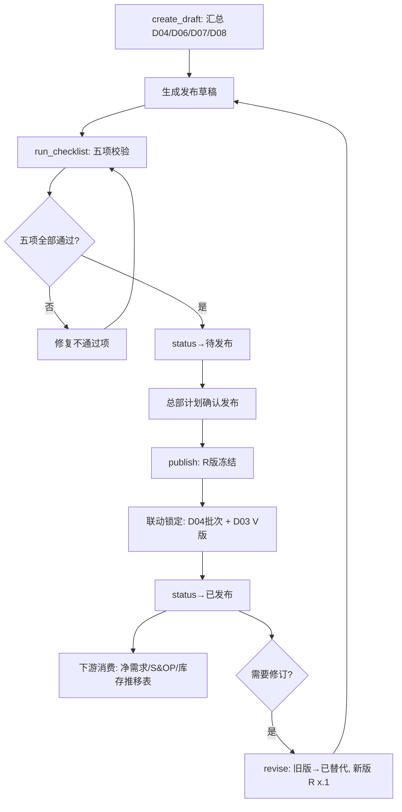

# demand_release · 应用详设（毛需求发布）

> **来源**：聚合根识别第①步 `architecture.md` 聚合根 9
> **日期**：2026-08-08
> **对应 BRD**：`brd/毛需求管理详设.md` §2.8 D09 毛需求发布单

---

## 1. 需求概览

### 1.1 基本信息
- **需求名称**: 毛需求发布
- **需求编号**: REQ-parts-fc-D09
- **所属模块**: parts-fc · 毛需求加工链
- **需求来源**: BRD §2.8
- **创建日期**: 2026-08-08
- **优先级**: P0

### 1.2 需求背景
#### 1.2.1 为什么需要这个需求？

毛需求加工链从 D03 收集到 D08 牛鞭修正，所有口径都是"进行中"状态。加工完成与客户对齐后，必须有一个正式定稿下达的机制——发布即冻结口径（R 版），未经发布的口径不得被下游（净需求计算、S&OP、产销平衡会）消费。D09 是加工链的终点和下游消费的唯一入口。

#### 1.2.2 期望达到什么目标？

以发布单形式将"消耗驱动量（D08 终端口径）+ 独立事件加项（D06）"最终合成并冻结发布（R 版），建立发布即冻结的纪律——当期口径不可改，修订只能发新版本。发布单成为净需求计算与产销平衡会的唯一输入。

### 1.3 需求范围
#### 1.3.1 包含哪些功能？

发布草稿自动生成（汇总 D04/D06/D07/D08）、发布详情查看（含构成列示+链路线索）、列表筛选查询、checklist 五项校验、正式发布（R版冻结+联动锁定 D04/D03）、版本修订（子版本）、版本差异比对

#### 1.3.2 不包含哪些功能？

客户对齐执行（是发布前动作非单据，结论记入 basis 栏）、净需求计算（下游消费者非本应用）、S&OP 产销平衡会（下游消费者非本应用）、库存推移表（下游消费者非本应用）

### 1.4 涉及角色
**谁会使用这个功能？**

- **总部计划（发布人）**: checklist 复核、发布决策、版本修订审批——对发布口径负责
- **一线销售**: 客户对齐执行、对齐结论回传给总部计划记入 basis
- **系统**: 汇总生成发布稿、checklist 校验、构成加和强制、版本差异视图、联动锁定、版本永久保留

---

## 2. 用户故事

### 2.1 核心用户故事

#### 2.1.1 `US-01` 用户故事 — 生成发布草稿（优先级：P1）

- **故事描述**: 作为总部计划，我想要系统自动汇总 D04/D06/D07/D08 结果生成发布草稿，以便于减少手工汇总错误、快速进入 checklist 校验
- **为何赋予此优先级**：发布草稿是所有后续操作的起点——没有草稿无法进行 checklist 校验和发布
- **独立测试**：可通过指定 base_period 生成草稿，验证系统自动汇总各上游应用数据、构成列示正确来独立测试
- **前置条件**: 当前期间 D04 核定完成、D07 汇总修正完成、D08 口径修正完成、D06 事件状态齐备
- **后置条件**: 发布单状态为"草稿"；单头 + 明细均已填充；rel_qty = cons_qty + Σ事件量（系统强制计算）

**验收场景**：

1. `US-01-AC1` **场景**: 正常生成发布草稿
   - **Given** base_period=2026-08, D04/D07/D08 均有核定结论, D06 事件 EVT-202608-003 已生效（+180@2026-09）, EVT-202608-006 待确认，**When** 总部计划执行 `create_draft("2026-08")`，**Then** 自动汇总生成草稿：cons_qty 列示正确；event_items 仅含 EVT-202608-003（待确认事件未计入）；rel_qty = cons_qty + 180（系统强制）；status="草稿"

2. `US-01-AC2` **场景**: 通用件拆回列正确
   - **Given** 通用件 STD-M6 D07 修正总量=82000 且 split_qty 已分配，**When** 生成草稿，**Then** 明细行中 cons_qty=82000（取 D07 修正总量），split_qty 列示各客户拆回量

3. `US-01-AC3` **场景**: 断点成对落位
   - **Given** 旧件 8210001-A（断点截断）和新件 8210001-B（断点启动）均为生效事件，**When** 生成草稿，**Then** 旧件 cons_qty=420, event_items=[{event_no: "EVT-...-004", qty: -420}], rel_qty=0；新件 cons_qty=0, event_items=[{event_no: "EVT-...-005", qty: +400}], rel_qty=400

---

#### 2.1.2 `US-02` 用户故事 — 查看发布单详情（优先级：P1）

- **故事描述**: 作为总部计划或一线销售，我想要查看发布单全貌（含构成列示和链路线索），以便于了解发布口径、事件加项以及数据来源追溯
- **为何赋予此优先级**：查看是发布决策和下游消费的基础操作
- **独立测试**：可通过 rel_no 查询发布单全貌来独立测试
- **前置条件**: 发布单已创建
- **后置条件**: 无变化（只读）

**验收场景**：

1. `US-02-AC1` **场景**: 查看发布单含构成列示
   - **Given** 发布单 REL-202608-001 已生成，**When** 总部计划执行 `get("REL-202608-001")`，**Then** 返回单头+明细；明细中每行展示 cons_qty / event_items / rel_qty 构成列示；lineage 含 D04批次/D07单号/D08单号可追溯

---

#### 2.1.3 `US-03` 用户故事 — 筛选发布单列表（优先级：P2）

- **故事描述**: 作为总部计划，我想要按状态、期间等条件筛选发布单列表
- **为何赋予此优先级**：列表查询是日常管理操作，不直接影响发布流程
- **独立测试**：可通过不同筛选条件查询发布单列表来独立测试
- **前置条件**: 系统中存在发布单
- **后置条件**: 无变化（只读）

**验收场景**：

1. `US-03-AC1` **场景**: 按状态筛选
   - **Given** 系统中存在"草稿"和"已发布"状态的发布单，**When** 筛选 `status="已发布"`，**Then** 列表仅展示已发布的发布单

---

#### 2.1.4 `US-04` 用户故事 — 执行发布前 checklist 校验（优先级：P0）

- **故事描述**: 作为总部计划，我想要执行发布前 checklist 五项校验，以便于确保所有前置条件满足后才可发布
- **为何赋予此优先级**：checklist 是发布的质量关口——任何一项不通过都不得发布
- **独立测试**：可通过 run_checklist 验证五项校验全部通过/部分失败的场景来独立测试
- **前置条件**: 发布单状态为"草稿"
- **后置条件**: checklist 结果输出（通过/不通过及不通过项明细）；如全部通过，状态 → "待发布"

**验收场景**：

1. `US-04-AC1` **场景**: 五项全部通过
   - **Given** D04 全部核定, D08 全部有结论, D06 无待确认事件, 客户对齐完成并记录, 版本差异完整，**When** 执行 `run_checklist("REL-202608-001")`，**Then** checklist 五项全部返回 PASS，状态→"待发布"

2. `US-04-AC2` **场景**: D04 未全部核定
   - **Given** 某零件×期间的 D04 修正处于"待核对"状态，**When** 执行 run_checklist，**Then** 第1项返回 FAIL:"以下零件未核定: 8210001@2026-09"，状态保持"草稿"

3. `US-04-AC3` **场景**: D06 有待确认事件
   - **Given** EVT-202608-006 处于"待确认"，**When** 执行 run_checklist，**Then** 第3项返回 FAIL:"以下事件未确认/处于疑似状态，不得进入发布加项: EVT-202608-006"

4. `US-04-AC4` **场景**: 客户对齐未完成
   - **Given** 发布单 basis 栏未填写客户对齐结论，**When** 执行 run_checklist，**Then** 第4项返回 FAIL:"客户对齐结论未记录于主要依据栏"

---

#### 2.1.5 `US-05` 用户故事 — 正式发布（R版冻结）（优先级：P0）

- **故事描述**: 作为总部计划，我想要确认发布毛需求，以便于 R 版冻结、联动锁定 D04/D03，发布口径成为净需求/S&OP 的唯一输入
- **为何赋予此优先级**：发布是本应用的终极动作——发布即冻结，下游唯一入口
- **独立测试**：可通过 publish 操作验证 R 版冻结、三层联动锁定来独立测试
- **前置条件**: 状态为"待发布"（checklist 五项全部通过）
- **后置条件**: 状态 → "已发布"；publisher / publish_date 记录；D04 加工批次锁定（通过 `self.fde.call`）；D03 V 版本锁定（通过 `self.fde.call`）；R 版永久保留

**验收场景**：

1. `US-05-AC1` **场景**: 正常发布
   - **Given** 发布单 REL-202608-001 checklist 全部通过, status="待发布"，**When** 总部计划执行 `publish("REL-202608-001")`，**Then** 状态→"已发布", rel_version="R2026-08", publisher+date 记录, D04 proc_batch 锁定, D03 collect_no 锁定, R版永久保留

2. `US-05-AC2` **场景**: 未通过 checklist 不可发布
   - **Given** 发布单 status="草稿"（checklist 未全部通过或未执行），**When** 执行 publish，**Then** 系统拒绝并提示"请先完成 checklist 校验，五项全部通过后方可发布"

3. `US-05-AC3` **场景**: 联动锁定
   - **Given** 发布单 REL-202608-001 调用 publish，**When** publish 执行成功，**Then** D04 关联批次的 status→"已锁定"；D03 关联收集版本的 status→"已锁定"（通过 `self.fde.call` 分别调用 `demand_processing.lock` 和 `demand_collection.lock`）

---

#### 2.1.6 `US-06` 用户故事 — 版本修订（子版本 R x.1）（优先级：P2）

- **故事描述**: 作为总部计划，对于重大变化（如断点新增、OEM 需求塌方），我想要发布修订版本（R x.1），以便于在保持旧版永久保留的前提下更新发布口径
- **为何赋予此优先级**：版本修订是发布后的例外流程，频率低但必须有
- **独立测试**：可通过 revise 操作验证新版本生成和旧版标记为"已替代"来独立测试
- **前置条件**: 存在已发布的发布单；修订原因充分
- **后置条件**: 旧版 status → "已替代"（永久保留）；新版 rel_version=R+YYYYMM.1，含新 rel_no

**验收场景**：

1. `US-06-AC1` **场景**: 版本修订
   - **Given** 发布单 REL-202608-001 已发布（R2026-08），因断点新增需修订，**When** 总部计划执行 `revise("REL-202608-001", reason="断点 ECN-A-119 新增", adjustments={...})`，**Then** 旧版 status→"已替代"，生成新版 rel_version="R2026-08.1", prev_version="R2026-08"，修订原因留痕

---

#### 2.1.7 `US-07` 用户故事 — 版本差异比对（优先级：P2）

- **故事描述**: 作为总部计划，我想要查看 R_n vs R_{n-1} 逐零件×期间的差异，以便于了解修订的影响范围和重大变化原因
- **为何赋予此优先级**：差异比对是 checklist 第5项和版本修订时的辅助功能
- **独立测试**：可通过 get_version_diff 验证两个版本间逐行差异来独立测试
- **前置条件**: 存在至少两个版本的发布单
- **后置条件**: 无变化（只读）

**验收场景**：

1. `US-07-AC1` **场景**: 版本差异比对
   - **Given** R2026-08 和 R2026-08.1 两个版本，R2026-08.1 中 STD-M6 的 rel_qty 从 82000 调整为 85000，**When** 执行 `get_version_diff("REL-202608-002")`，**Then** 返回逐零件×期间差异：STD-M6@2026-09 rel_qty: 82000→85000（+3000），附修订原因

---

## 3. 业务场景

### 3.1 业务流程描述

#### 3.1.1 场景1: 毛需求发布完整流程



1. 系统自动汇总 D04/D06/D07/D08 结果（通过 `self.fde.call` 调用各聚合的 get 方法）生成发布草稿
2. 执行 checklist 五项校验：D04 齐套 / D08 全结论 / D06 齐备 / 客户对齐 / 版本差异
3. 五项全部通过 -> 状态变为"待发布"
4. 总部计划确认发布 -> 状态变为"已发布"
5. 联动锁定：D04 批次锁定 + D03 V 版锁定
6. R 版永久保留，下游开始消费
7. 如需重大修订 -> 产生子版本 R x.1，旧版标记为"已替代"

#### 3.1.2 场景2: 发布口径的构成列示

```
毛需求发布量(零件×期间) = cons_qty（D08 修正后预测，消耗口径）
                        + Σ event_items（仅 D06 生效事件: 脉冲/断点/其他）
```

- cons_qty 来自 D08 final_qty，消耗口径——趋势量可随版本演化
- event_items 来自 D06 生效事件，[{event_no, qty}]——事件量必须履约
- rel_qty 系统强制计算，禁止手工修改总量
- 明细按零件×期间纵向存储，展示层可透视宽表

### 3.2 业务规则

#### 3.2.1 `BR-01` 规则: 唯一入口
- **规则描述**: 净需求 / S&OP 只消费已发布 R 版；草稿、加工中口径一律不得外流
- **适用场景**: 发布状态管控；下游消费校验
- **示例**: D09 草稿状态 rel_qty -> 净需求计算接口拒绝引用，必须已发布

#### 3.2.2 `BR-02` 规则: 构成加和强制
- **规则描述**: rel_qty = cons_qty + Σ event_items.qty，由系统强制计算；禁止手工修改 rel_qty 造成口径隐含
- **适用场景**: 发布草稿生成和修订时
- **示例**: cons_qty=990, event_items=[{qty: 180}] -> rel_qty=1170，界面不可编辑，修改只能改 cons_qty 或 event_items

#### 3.2.3 `BR-03` 规则: 疑似不发布
- **规则描述**: D06 待确认/疑似事件不得进入发布加项（event_items）；仅生效事件可计入；事件确认后后续版本再补计
- **适用场景**: create_draft 和 revise 时取 D06 事件
- **示例**: EVT-202608-006（待确认，+3000）-> 本次发布不纳入 event_items，后续确认后下一个 R 版本再计入

#### 3.2.4 `BR-04` 规则: 发布节奏
- **规则描述**: 月度滚动发布，与收集—加工节奏对齐；延迟发布将挤压净需求与 S&OP 计算时间
- **适用场景**: 运营管控，超时告警
- **示例**: 每月 15 日前完成 R 版发布 -> 延迟则触发告警

#### 3.2.5 `BR-05` 规则: 对齐留痕
- **规则描述**: 偏离客户原始需求而未调整的，basis 中必须说明原因与风险评估；对齐不成且客户坚持无依据的量 -> 升级产销平衡会，不带 unresolved 分歧发布
- **适用场景**: publish 前 checklist 第4项校验
- **示例**: 主机厂A 坚持 35000 但核定 32000 -> basis 记录"客户坚持原因+未调整的风险评估（可转量其他供应商）"

#### 3.2.6 `BR-06` 规则: 发布即冻结
- **规则描述**: R 版发布 -> D04 加工批次锁定 -> D03 V 版本锁定，三层同时冻结（通过 `self.fde.call` 联动）
- **适用场景**: publish 操作
- **示例**: publish 成功后 -> demand_processing.lock(proc_batch) -> demand_collection.lock(collect_no)，三层均不可再修改

#### 3.2.7 `BR-07` 规则: 版本永久保留
- **规则描述**: 发布单（含旧版本）永久保留，支持考核追责、FVA 基准、审计引用；旧版标记"已替代"但数据不删除
- **适用场景**: 版本管理
- **示例**: R2026-08 -> R2026-08.1，旧版保留并标记"已替代"，forecast_assessment 引用 R2026-08 快照

#### 3.2.8 `BR-08` 规则: 发布稿自动生成、发布决策不自动化
- **规则描述**: 系统汇总生成发布草稿 + checklist 校验报告 -> 人工确认后发布；汇总可自动化，发布决策必须人工
- **适用场景**: create_draft 和 publish 之间
- **示例**: create_draft 自动执行，publish 须总部计划角色主动确认

#### 3.2.9 `BR-09` 规则: checklist 全部通过方可发布
- **规则描述**: 发布前置 checklist 五项——①D04核定齐套②D08全结论③D06状态齐备④客户对齐完成⑤版本差异完整——全部通过后状态方可转"待发布"并允许 publish
- **适用场景**: publish 前置校验

#### 3.2.10 `BR-10` 规则: 字段级校验规则（单头）
- **rel_no**: 必填，格式 `REL-YYYYMM-NNN`，唯一
- **rel_version**: 必填，格式 `R+YYYYMM(.x)`，每期内主版本唯一
- **base_period**: 必填，格式 YYYY-MM，M0 对应会计期间
- **prev_version**: 可选，修订时填写上一版本号
- **status**: 必填，Enum: 草稿 / 待发布 / 已发布 / 已替代
- **publisher / publish_date**: 条件必填（publish 时），发布人（总部计划）与发布时间

#### 3.2.11 `BR-11` 规则: 字段级校验规则（明细）
- **rel_no + line_no**: 联合主键
- **part_no**: 必填，引用物料主数据
- **veh_model**: 必填，通用件记"多客户"
- **period**: 必填，格式 YYYY-MM，覆盖 M0~M+N
- **cons_qty**: 必填，Decimal >= 0，来自 D08 final_qty
- **event_items**: 可选，Json [{event_no, qty}]，仅 D06 生效事件
- **rel_qty**: 必填，Decimal >= 0，系统强制 = cons_qty + Σ event_items.qty
- **split_qty**: 可选，Json，通用件客户拆回量
- **basis**: 必填，Text，基线来源+修正/核对要点+客户对齐结论
- **lineage**: 必填，Json {proc_batch, agg_no?, bw_no}，链路线索可追溯

### 3.3 业务数据

#### 3.3.1 数据1: 发布单号 (rel_no)
- **数据描述**: 毛需求发布单的唯一标识
- **数据类型**: String
- **数据来源**: 系统自动生成，格式 `REL-YYYYMM-NNN`
- **示例值**: `REL-202608-001`

#### 3.3.2 数据2: 发布版本 (rel_version)
- **数据描述**: R 版版本号，每期一个主版本，修订产生子版本
- **数据类型**: String
- **数据来源**: 系统自动分配
- **示例值**: `R2026-08` / `R2026-08.1`

#### 3.3.3 数据3: 消耗驱动量 (cons_qty)
- **数据描述**: D08 修正后预测，消耗口径——趋势量可随版本演化
- **数据类型**: Decimal
- **数据来源**: `bullwhip_correction.get` -> final_qty；或 `common_parts_agg.get` -> dedup_qty（通用件）
- **示例值**: 990

#### 3.3.4 数据4: 事件加项 (event_items)
- **数据描述**: 仅 D06 生效事件，[{event_no, qty}]，不含待确认/疑似事件
- **数据类型**: Json
- **数据来源**: `independent_event.get_active_events`，仅 status="生效"的事件
- **示例值**: `[{"event_no": "EVT-202608-003", "qty": 180}]`

#### 3.3.5 数据5: 发布量 (rel_qty)
- **数据描述**: 最终发布口径 = cons_qty + Σ事件量
- **数据类型**: Decimal
- **数据来源**: 系统强制计算，不可手工编辑
- **示例值**: 1170

#### 3.3.6 数据6: 链路线索 (lineage)
- **数据描述**: 追溯链：D04 批次 / D07 单号 / D08 单号，可逐环节回溯
- **数据类型**: Json
- **数据来源**: 系统在 create_draft 时自动关联
- **示例值**: `{"proc_batch": "PRC-202609-001", "agg_no": "AGG-202609-001", "bw_no": "BW-202609-001"}`

### 3.4 状态机

```
(新建) --create_draft()--> 草稿 --run_checklist(全部通过)--> 待发布 --publish()--> 已发布
                                                                                    │
                                                                    已发布 --revise()--> 已替代（旧版）
                                                                                         │
                                                                    已替代 --(新草稿)--> 草稿（新版 R x.1）
```

**状态转换规则矩阵：**

| 当前状态 | 目标状态 | 触发动作 | 前置条件 |
|----------|----------|----------|----------|
| (新建) | 草稿 | create_draft(base_period) | 至少存在一条可汇总数据（D04/D08 有结果） |
| 草稿 | 待发布 | run_checklist(rel_no) | checklist 五项全部通过：D04 核定齐套、D08 全结论、D06 状态齐备、客户对齐完成、版本差异完整 |
| 待发布 | 已发布 | publish(rel_no) | status="待发布"；publisher 为总部计划角色；联动锁定 D04/D03 成功 |
| 已发布 | 已替代 | revise(rel_no, reason, adjustments) | 存在已发布的发布单；修订原因充分；生成新版草稿 |
| 已替代 | (终态) | — | 旧版永久保留，数据不删除，仅供审计/考核引用 |

---

## 4. 功能描述

### 4.1 功能清单

| 一级菜单/模块 | 一级模块编号 | 二级菜单/模块 | 二级模块编号 | 三级功能 | 三级功能编号 | 功能类型 | 优先级 | 三级功能简述 |
|--------------|------------|--------------|------------|---------|------------|--------|-------|------------|
| 毛需求发布 | F01 | — | — | 生成发布草稿 | F01-01 | 接口 | P1 | 自动汇总D04/D06/D07/D08结果，生成发布草稿含构成列示 |
| 毛需求发布 | F01 | — | — | 查看发布单详情 | F01-02 | 详情页 | P1 | 查看发布单全貌，含构成列示（cons+events）和链路线索 |
| 毛需求发布 | F01 | — | — | 发布单列表查询 | F01-03 | 列表页 | P2 | 按状态、期间等条件筛选发布单列表 |
| 毛需求发布 | F01 | — | — | checklist五项校验 | F01-04 | 接口 | P0 | 执行发布前五项校验，全部通过则状态→待发布 |
| 毛需求发布 | F01 | — | — | 正式发布·R版冻结 | F01-05 | 接口 | P0 | 发布即冻结，联动锁定D04/D03，R版永久保留 |
| 毛需求发布 | F01 | — | — | 版本修订 | F01-06 | 接口 | P2 | 重大变化时发布子版本R x.1，旧版→已替代 |
| 毛需求发布 | F01 | — | — | 版本差异比对 | F01-07 | 详情页 | P2 | R_n vs R_{n-1} 逐零件×期间差异视图 |

### 4.2 功能模块结构图

```
毛需求发布 (F01, P0)
├── F01-01 生成发布草稿 (接口, P1)
├── F01-02 查看发布单详情 (详情页, P1)
├── F01-03 发布单列表查询 (列表页, P2)
├── F01-04 checklist五项校验 (接口, P0)
├── F01-05 正式发布·R版冻结 (接口, P0)
├── F01-06 版本修订 (接口, P2)
└── F01-07 版本差异比对 (详情页, P2)
```

### 4.3 功能详细说明

#### 4.3.1 F01-01 生成发布草稿

**功能描述**:
总部计划指定锚定期间（base_period），系统自动汇总 D04/D06/D07/D08 结果生成发布草稿。通过 `self.fde.call` 依次调用各上游聚合的 get 方法，汇总 cons_qty 和 event_items，系统强制计算 rel_qty = cons_qty + event_items，构成列示。

**用户操作流程**:
1. 用户指定 base_period (如 "2026-08")
2. 系统调用 `demand_processing.get_approved` 取核定消耗量（专用件）
3. 系统调用 `common_parts_agg.get` 取通用件修正总量
4. 系统调用 `bullwhip_correction.get` 取终端口径修正结果（cons_qty 最终来源）
5. 系统调用 `independent_event.get_active_events` 取生效事件加项（过滤待确认/疑似事件）
6. 系统按零件×期间逐行构建明细：cons_qty + event_items -> rel_qty
7. 系统填充 lineage（D04批次/D07单号/D08单号）
8. 生成成功，status="草稿"

**业务实体**:
- **DemandRelease（单头）**: 毛需求发布单头，聚合根
- **DemandReleaseDetail（明细）**: 发布明细行，随单头生死

**DemandRelease（单头）字段**

| 字段名称 | 字段类型 | 是否必填 | 默认值 | 业务逻辑 |
|----------|---------|---------|--------|---------|
| rel_no | 文本 | 否（自动生成） | REL-YYYYMM-NNN | 系统自动生成，全局唯一；格式 REL+8位年月+3位流水 |
| rel_version | 文本 | 否（自动生成） | R+YYYYMM | 系统自动分配，每期内主版本唯一；修订产生子版本 R+YYYYMM.x |
| base_period | 文本(YYYY-MM) | 是 | — | M0 对应会计期间（同 D03），发布覆盖 M0~M+N |
| prev_version | 文本 | 否 | — | 修订时填写上一版本号，作为差异比对基线 |
| status | 枚举 | 是 | 草稿 | 草稿 / 待发布 / 已发布 / 已替代 |
| publisher | 引用(User) | 条件必填 | — | 发布人，须为总部计划角色，publish 时记录 |
| publish_date | DateTime | 条件必填 | — | 发布时间，publish 时系统自动记录 |

**DemandReleaseDetail（明细）字段**

| 字段名称 | 字段类型 | 是否必填 | 默认值 | 业务逻辑 |
|----------|---------|---------|--------|---------|
| rel_no | 引用 | 是 | — | 关联单头，FK |
| line_no | Int | 是 | — | 明细行号，与 rel_no 联合主键 |
| part_no | 引用 | 是 | — | 零件号，引用物料主数据 |
| veh_model | 引用 | 是 | — | 客户·车型；通用件记"多客户" |
| period | 文本(YYYY-MM) | 是 | — | 期间，覆盖 M0~M+N |
| cons_qty | Decimal | 是 | 0 | D08 修正后预测（消耗口径）；通用件取 D07 修正总量 |
| event_items | Json | 否 | [] | 事件加项 [{event_no, qty}]，仅 D06 生效事件，过滤待确认/疑似 |
| rel_qty | Decimal | 否（自动计算） | — | 系统强制 = cons_qty + Σ event_items.qty，不可手动编辑 |
| split_qty | Json | 否 | — | 通用件客户拆回量 [{oem_code, qty}]，发运参考 |
| basis | 文本 | 是 | — | 基线来源 + 修正/核对要点 + 客户对齐结论 |
| lineage | Json | 是 | — | {proc_batch, agg_no?, bw_no}，链路线索可逐环节追溯 |

**特殊处理**:
- `create_draft` 内部调 `demand_processing.get_approved` -> cons_qty 基础
- `create_draft` 内部调 `bullwhip_correction.get` -> final_qty 作为 cons_qty 最终口径
- `create_draft` 内部调 `common_parts_agg.get` -> 通用件取 D07 修正总量
- `create_draft` 内部调 `independent_event.get_active_events` -> event_items（过滤 status != "生效" 的事件）
- rel_qty 系统强制计算，不可手工编辑（BR-02）
- event_items 仅含生效事件（BR-03）——"宁可后续版本补计，不带疑似量发布"

---

#### 4.3.2 F01-02 查看发布单详情

**功能描述**:
返回发布单全貌：单头信息 + 明细（零件×期间，cons_qty / event_items / rel_qty 构成列示）+ lineage 链路线索。总部计划可查看全貌，一线销售可查看与自己客户相关的部分。

**用户操作流程**:
1. 用户提供 rel_no
2. 系统返回单头 + 明细 + lineage

---

#### 4.3.3 F01-03 发布单列表查询

**功能描述**:
按状态、期间等条件筛选发布单列表，支持分页。

**用户操作流程**:
1. 用户输入筛选条件（可选）：status / base_period / rel_version
2. 系统返回符合条件的发布单列表（分页）

---

#### 4.3.4 F01-04 checklist 五项校验

**功能描述**:
执行发布前 checklist 五项校验，全部通过则状态转为"待发布"并允许 publish。任何一项不通过则返回 FAIL 及不通过明细。

**用户操作流程**:
1. 用户指定 rel_no
2. 系统依次执行五项校验：
   a. **D04 核定齐套**: 调 `demand_processing.get_status` 验证全部行已核定；通用件 D07 已确认
   b. **D08 全结论**: 调 `bullwhip_correction.list` 验证所有相关处理单已维持或已修正（非"待处理"）
   c. **D06 状态齐备**: 调 `independent_event.get_active_events` 验证无待确认/疑似事件混入
   d. **客户对齐完成**: 验证明细 basis 栏含客户对齐结论（非空）
   e. **版本差异完整**: 如 prev_version 存在，验证 R_n vs R_{n-1} 差异视图可用且重大变化均有说明
3. 五项全部 PASS -> status -> "待发布"
4. 任一项 FAIL -> 返回失败明细，status 保持"草稿"

**业务规则**:
- checklist 五项全部通过是 publish 的必要条件（BR-09）
- 每项校验失败均需给出具体不通过项明细，方便定位修复

**特殊处理**:
- 通用件场景：第1项需额外验证 D07 汇总修正单已确认
- 第5项（版本差异）首次发布无 prev_version 时自动通过

---

#### 4.3.5 F01-05 正式发布·R版冻结

**功能描述**:
总部计划确认发布，R 版冻结。联动锁定 D04 加工批次（通过 `self.fde.call` 调 `demand_processing.lock`）和 D03 V 版本（通过 `self.fde.call` 调 `demand_collection.lock`），三层同时冻结。发布后发布口径成为净需求/S&OP 唯一输入。

**用户操作流程**:
1. 用户指定 rel_no
2. 系统校验：status 必须为"待发布"；checklist 五项已全部通过
3. 记录 publisher / publish_date
4. 系统调用 `demand_processing.lock(proc_batch)` -> D04 批次锁定
5. 系统调用 `demand_collection.lock(collect_no)` -> D03 V 版本锁定
6. 状态 -> "已发布"
7. R 版发布快照永久保留

**业务规则**:
- 发布即冻结：当期口径不可改，修订只能发新版本（BR-06）
- 联动锁定三层：D09 发布 -> D04 锁定 -> D03 锁定（BR-06）
- 发布后数据永久保留，供考核追责/FVA基准/审计引用（BR-07）

**特殊处理**:
- `publish` 内部调 `demand_processing.lock(proc_batch)` -> 锁定关联加工批次
- `publish` 内部调 `demand_collection.lock(collect_no)` -> 锁定关联收集版本
- publish 操作不可逆：已发布状态不可回退，只能走 revise 产生新版本

---

#### 4.3.6 F01-06 版本修订

**功能描述**:
对于重大变化，总部计划发布修订版本（子版本 R x.1）。旧版标记为"已替代"（永久保留），产生新版草稿（含新 rel_no 和新 rel_version），修订原因留痕。

**用户操作流程**:
1. 用户指定已发布发布单 rel_no
2. 系统校验：status="已发布"；修订原因充分
3. 旧版 status -> "已替代"（数据不删除）
4. 生成新版：rel_version=R+YYYYMM.1（子版本号递增），prev_version=旧版版本号
5. 新版以旧版数据为基础 + adjustments（调整项）-> 新草稿
6. 新版需重新走 checklist -> 待发布 -> publish 流程

---

#### 4.3.7 F01-07 版本差异比对

**功能描述**:
R_n vs R_{n-1} 逐零件×期间差异视图。系统自动比对两个版本的明细行，生成差异报告（含修改前后的 rel_qty、cons_qty、event_items 差异）。

**用户操作流程**:
1. 用户指定 rel_no（新版）
2. 系统取该发布单的 prev_version -> 定位旧版
3. 系统按 (part_no, period) 匹配两版明细行
4. 逐行输出：旧值 / 新值 / 差异量 / 差异说明
5. 标记新增行 / 删除行 / 变更行

---

## 5. 权限要求

### 5.1 功能权限

| 功能名称 | 权限标识 | 总部计划 | 一线销售 | 系统 |
|----------|---------|---------|---------|------|
| 生成发布草稿 | `parts-fc:demand-release:create-draft` | 可访问 | 不可访问 | 可访问(自动触发) |
| 查看发布单详情 | `parts-fc:demand-release:query` | 可访问 | 可访问(本客户相关) | 可访问 |
| 发布单列表查询 | `parts-fc:demand-release:list` | 可访问 | 可访问 | 可访问 |
| checklist校验 | `parts-fc:demand-release:run-checklist` | 可访问 | 不可访问 | 可访问(自动触发) |
| 正式发布·R版冻结 | `parts-fc:demand-release:publish` | 可访问 | 不可访问 | 不可访问 |
| 版本修订 | `parts-fc:demand-release:revise` | 可访问 | 不可访问 | 不可访问 |
| 版本差异比对 | `parts-fc:demand-release:get-version-diff` | 可访问 | 可访问(只读) | 可访问 |

### 5.2 数据权限

#### 5.2.1 总部计划（发布人）
- 可查看和操作所有发布单（全量）
- 可执行 publish / revise / run_checklist
- 对发布口径负责

#### 5.2.2 一线销售
- 只可查看发布单中与自己客户相关的零件明细
- 不可执行 publish / revise
- 职责：客户对齐执行、对齐结论回传至 basis 栏

#### 5.2.3 系统
- 可自动触发 create_draft / run_checklist
- 联动锁定 D04 / D03

---

## 6. 验收标准

### 6.1 功能验收标准

#### 6.1.1 标准1: 发布草稿自动汇总
- **关联用户故事**: US-01
- **关联业务规则**: BR-02, BR-03
- **验证方式**: 指定 base_period 生成草稿
- **测试数据**: period=2026-08, 零件 8210001 cons_qty=990, 生效事件 +180
- **预期结果**: rel_qty=1170（系统强制计算）；待确认事件 EVT-202608-006 未进入 event_items

#### 6.1.2 标准2: 构成加和强制
- **关联用户故事**: US-01
- **关联业务规则**: BR-02
- **验证方式**: 尝试手工修改 rel_qty
- **测试数据**: cons_qty=990, event_items.qty=180, rel_qty 应=1170
- **预期结果**: rel_qty 字段界面不可编辑；系统拒绝非 cons_qty + Σevent_items 的赋值

#### 6.1.3 标准3: checklist 五项全部通过
- **关联用户故事**: US-04
- **关联业务规则**: BR-09
- **验证方式**: 准备满足全部条件的发布单，执行 run_checklist
- **测试数据**: D04全部核定, D08全部有结论, D06无待确认事件, basis含客户对齐结论, prev_version差异完整
- **预期结果**: 五项全部 PASS，status→"待发布"

#### 6.1.4 标准4: checklist 单项失败
- **关联用户故事**: US-04
- **关联业务规则**: BR-03, BR-09
- **验证方式**: D06 存在待确认事件，执行 run_checklist
- **测试数据**: 待确认事件 EVT-202608-006 存在于 event_items（应被过滤但假设手动绕过）
- **预期结果**: 第3项 FAIL，提示具体事件号和原因

#### 6.1.5 标准5: 发布即冻结·三层联动
- **关联用户故事**: US-05
- **关联业务规则**: BR-06, BR-07
- **验证方式**: publish 操作
- **测试数据**: REL-202608-001, status="待发布"
- **预期结果**: status→"已发布"；D04 对应批次锁定；D03 对应收集版本锁定；R版发布快照永久保留

#### 6.1.6 标准6: 未通过checklist不可发布
- **关联用户故事**: US-05
- **关联业务规则**: BR-09
- **验证方式**: status="草稿"（checklist未全部通过）
- **测试数据**: REL-202608-001 status="草稿"
- **预期结果**: publish 拒绝，提示"请先完成 checklist 校验"

#### 6.1.7 标准7: 版本修订
- **关联用户故事**: US-06
- **关联业务规则**: BR-07
- **验证方式**: revise 操作
- **测试数据**: REL-202608-001 已发布，修订理由充分
- **预期结果**: 旧版 status→"已替代"；新版 rel_version="R2026-08.1", prev_version="R2026-08"

#### 6.1.8 标准8: 版本差异比对
- **关联用户故事**: US-07
- **关联业务规则**: BR-09(第5项校验)
- **验证方式**: get_version_diff 操作
- **测试数据**: R2026-08 vs R2026-08.1, STD-M6@2026-09 从 82000 变更为 85000
- **预期结果**: 差异视图包含该行变更（82000→85000, +3000），附修订原因

### 6.2 非功能验收标准
- **性能要求**: 发布草稿生成（跨 4 个聚合取数）响应时间 < 15 秒
- **安全性要求**: publish 操作仅总部计划可执行；已发布内容不可被一线销售修改；联动锁定操作事务性保证
- **数据一致性**: rel_qty 由系统强制计算；publish 联动锁定 D04/D03 须在同一事务中完成
- **可追溯性**: lineage 链路线索可从 D09 追溯至 D04/D07/D08，支持审计和 FVA 复盘

### 6.3 已知问题或限制
- 客户对齐结论（basis 栏）为总部计划手工填写，系统不自动校验对齐质量——仅校验非空
- 联动锁定（D04/D03）如果部分失败（如 D03 锁定成功但 D04 锁定失败），需支持回滚整个 publish 操作——事务性保证
- 版本修订产生新 rel_no，流水号随新单递增——不保证连续
- 首次发布无 prev_version 时第5项 checklist（版本差异）自动通过

---

## 7. 参考资料

### 7.1 相关文档
- 聚合根识别: `app/parts-fc/architecture.md` 聚合根 9
- BRD 原始需求: `app/parts-fc/brd/毛需求管理详设.md` §2.8 (行 1411-1527)
- 模板规格: `design/应用设计.md`

### 7.2 相关功能
- **demand_processing (D04)**: 提供核定消耗量（cons_qty 基础）+ publish 联动锁定
- **bullwhip_correction (D08)**: 提供终端口径预测（cons_qty 最终口径）
- **common_parts_agg (D07)**: 提供通用件修正总量
- **independent_event (D06)**: 提供生效事件加项（event_items）
- **demand_collection (D03)**: publish 联动锁定 V 版本
- **forecast_assessment (D12)**: 消费发布快照作为考核基准
- **净需求计算 / S&OP / 库存推移表**: 下游消费者（非 parts-fc 应用）

### 7.3 外部依赖
| 依赖 | 调用方式 | 说明 |
|------|---------|------|
| demand_processing.get_approved | `self.fde.call` | 取核定消耗量（create_draft 时调用） |
| bullwhip_correction.get | `self.fde.call` | 取终端口径修正结果作为 cons_qty 最终口径（create_draft 时调用） |
| common_parts_agg.get | `self.fde.call` | 通用件取 D07 修正总量（create_draft 时调用） |
| independent_event.get_active_events | `self.fde.call` | 取生效事件加项（create_draft 时调用） |
| demand_processing.lock | `self.fde.call` | 联动锁定 D04 加工批次（publish 时调用） |
| demand_collection.lock | `self.fde.call` | 联动锁定 D03 收集版本（publish 时调用） |
| 物料主数据 / 客户主数据 | 接口只读引用 | 权威源在外部 MDM/ERP |

### 7.4 备注
- 发布即冻结是系统纪律：已发布数据不可回退修改，修订只能走新版本——这是考核追责和 FVA 基准的前提
- 客户对齐是发布前动作（非本应用单据），结论由一线销售回传、总部计划记入 basis 栏
- 发布草稿自动生成、发布决策不自动化——系统汇总可完全自动化，但人工确认发布确保责任归属
- R 版发布快照是 forecast_assessment (D12) 考核的"当时发布了什么"基准，不可变是考核可信的前提
