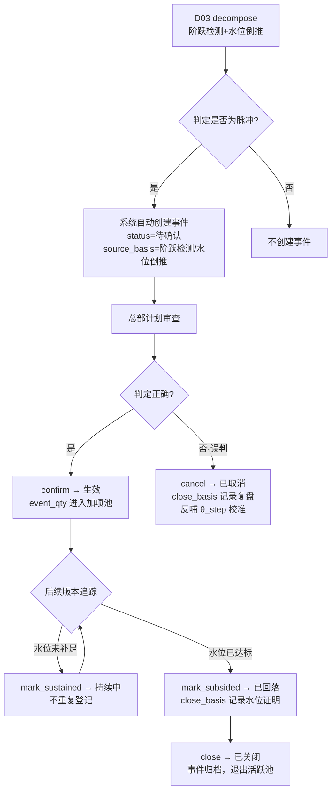
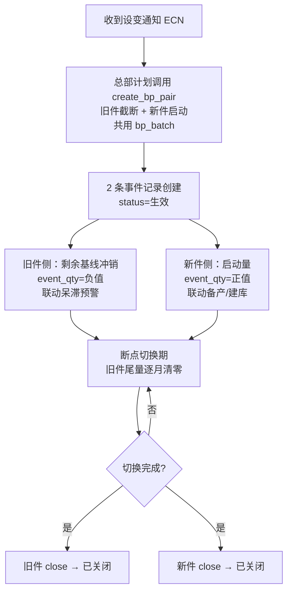

# 独立事件登记 · 应用详设

> **应用组**：parts-fc | **应用名**：independent_event | **类名**：IndependentEvent
> **聚合根编号**：6 | **对应单据**：D06 独立事件登记表
> **日期**：2026-08-08 | **版本**：v1.0
> **上游输入**：`app/parts-fc/architecture.md` 聚合根卡 + `app/parts-fc/brd/毛需求管理详设.md` §2.4

---

## 1. 需求概览

### 1.1 基本信息
- **需求名称**: 独立事件登记（Independent Event）
- **需求编号**: REQ-PARTS-FC-IE-001
- **所属模块**: parts-fc / independent_event
- **需求来源**: 业务方（产销协同框架 §1.1.2 callout、§2.5），本单据为 BRD §1.4 的"补设"单据
- **创建日期**: 2026-08-08
- **优先级**: P0

### 1.2 需求背景
#### 1.2.1 为什么需要这个需求？

毛需求是叠加结构——`毛需求(当期) = 消耗驱动预测量 + 一次性水位脉冲 + 其他独立事件(断点等)`。框架确立了"趋势归趋势、事件归事件"的原则：预测引擎只对消耗建模外推，脉冲与断点属"事件驱动"的独立加项——当期计入、必须履约，但**不进趋势外推**。

然而，框架中原本没有独立承载这些"事件项"的单据。若不补设 D06：
- 脉冲混进趋势 → 未来各期虚高超储；
- 漏登记水位脉冲/断点 → 当期漏要货、断线；
- 脉冲回落无法跟踪 → 反馈回路造成重复登记或错误登记为新负脉冲。

#### 1.2.2 期望达到什么目标？

建立独立事件台账，作为叠加结构中"事件项"的**唯一载体**：
- 水位脉冲：从 D03 拆解产出 → D06 登记 → 跟踪生命周期（生效→持续中→回落→关闭）；
- 断点（ECN/零件切换）：成对登记（旧件截断+新件启动），联动备产与呆滞预警；
- 其他一次性事件：人工登记+举证确认 → 计入当期毛需求；
- 所有生效事件汇入 D09 发布单的独立加项。

### 1.3 需求范围
#### 1.3.1 包含哪些功能？

登记事件（单条或成对断点）、查看事件详情、按条件筛选事件列表、确认事件（待确认→生效）、标记持续中（水位未补足）、标记已回落（水位达标关闭）、关闭事件（断点切换完成/履约完成）、取消事件（误判留痕）、取生效事件清单（供 D09 加项）、成对登记断点（旧件截断+新件启动）。

#### 1.3.2 不包含哪些功能？

- 趋势预测与外推（归 D04 demand_processing / D10 strategy_fitting）；
- 常规需求的录入与修正（归 D03/D04）；
- 库存推移表推演（仅向库存推移表供给事件输入，推演逻辑在产销协同层）；
- 呆滞/断货的物控执行动作（由物控系统联动，本应用只登记事件量）。

### 1.4 涉及角色
**谁会使用这个功能？**

- **系统**：D03 拆解自动生成脉冲疑似项（阶跃检测/水位倒推）；回落检测建议；断点日期/尾量计算提示。
- **总部计划**：疑似项确认（待确认→生效）、断点成对登记与关闭、事件取消裁决、回落/关闭判定。
- **一线销售**：提供事件线索（客户口头提水位、设变信息、展会/政策采购等）；不直接激活/关闭事件。

---

## 2. 用户故事

### 2.1 核心用户故事

#### 2.1.1 `US-01` 用户故事 — 登记事件 (优先级: P1)

- **故事描述**: 作为总部计划（或系统调用），我想要登记一条独立事件（水位脉冲/断点/其他），登记后状态为"待确认"（系统生成）或"生效"（人工登记+举证），以便于事件进入叠加结构的独立加项通道。
- **为何赋予此优先级**：事件登记是 D06 的唯一数据入口，无此功能则所有独立事件无法进入体系，叠加结构无法落地。
- **独立测试**：可通过调用 `create(event_type, part_no, period, event_qty, source_basis, ...)` 登记事件，验证 event_no 自动生成、in_demand 恒为 true、in_trend 恒为 false、必填字段校验通过。
- **前置条件**: part_no 在物料主数据中存在；断点类事件 bp_batch/bp_date 必填。
- **后置条件**: 事件记录写入，event_no 按规则生成，状态依据来源自动判定（系统生成→待确认，人工登记+举证→生效）。

**验收场景**：

1. `US-01-AC1` **场景**: 系统生成脉冲疑似项
   - **Given** D03 decompose 调用 create，event_type="水位脉冲"，part_no="8210001"，period="2026-09"，event_qty=+180，source_basis="阶跃检测+水位倒推"，**When** 调用 create，**Then** 事件创建成功，event_no="EVT-202608-003"，status="待确认"，in_demand=true，in_trend=false。

2. `US-01-AC2` **场景**: 人工登记其他事件（须举证）
   - **Given** 总部计划收到销售线索（展会整车备料），**When** 调用 create(event_type="其他", event_qty=+3000, source_basis="人工登记", source_basis_desc="一次性展会整车备料（客户函件 OEM-A-0806）")，**Then** 事件创建成功，status="待确认"（须计划确认后才生效）。

3. `US-01-AC3` **场景**: 人工登记无举证被拒绝
   - **Given** 总部计划试图人工登记事件但 source_basis 为空或仅"人工登记"无说明，**When** 调用 create，**Then** 系统拒绝并返回"人工登记必须附依据（函件/设变通知/倒推计算）"。

4. `US-01-AC4` **场景**: 断点类事件 bp_date 缺失被拒绝
   - **Given** event_type="断点·旧件截断"但 bp_date 为空，**When** 调用 create，**Then** 系统拒绝并返回"断点类事件必须填写断点时点（bp_date）"。

---

#### 2.1.2 `US-02` 用户故事 — 查看事件与筛选列表 (优先级: P1)

- **故事描述**: 作为总部计划或系统调用方，我想要查看事件详情或按条件筛选事件列表，以便于了解事件状态、进行防重校验、或取数用于下游发布。
- **为何赋予此优先级**：事件查询是日常操作（确认/关闭/回落前需查看）和下游集成（D04防重、D09加项取数）的基础。
- **独立测试**：可通过 `get(event_no)` 获取事件详情，通过 `list(part_no?, event_type?, status?, period?)` 筛选列表。
- **前置条件**: 事件记录已存在。
- **后置条件**: get 返回完整事件记录；list 返回分页的匹配事件列表。

**验收场景**：

1. `US-02-AC1` **场景**: 获取事件详情
   - **Given** EVT-202608-003 已存在，**When** 调用 get("EVT-202608-003")，**Then** 返回完整事件记录（含 event_qty=+180, status="生效", bp_batch 及回落记录等）。

2. `US-02-AC2` **场景**: 按零件+状态筛选
   - **Given** 系统中存在 8210001 的 2 条生效事件和 1 条已回落事件，**When** 调用 list(part_no="8210001", status="生效")，**Then** 返回 2 条事件。

3. `US-02-AC3` **场景**: 事件不存在
   - **Given** EVT-999999-999 不存在，**When** 调用 get，**Then** 返回空或"事件不存在"错误。

---

#### 2.1.3 `US-03` 用户故事 — 确认事件 (优先级: P1)

- **故事描述**: 作为总部计划，我想要将"待确认"的事件（系统生成的脉冲疑似项或人工登记的事件）确认为"生效"，以便于事件量进入当期毛需求加项计算。
- **为何赋予此优先级**：待确认事件不计入 D09 发布加项——确认是事件从"疑似"到"生效"的必经节点，是叠加结构落地的关键控制点。
- **独立测试**：对"待确认"事件调用 `confirm(event_no)`，验证状态→"生效"。
- **前置条件**: 事件状态为"待确认"。
- **后置条件**: 状态→"生效"，事件量进入当期毛需求加项池。

**验收场景**：

1. `US-03-AC1` **场景**: 确认脉冲疑似项
   - **Given** EVT-202608-003 状态为"待确认"，总部计划审查拆解结果后认为脉冲判定正确，**When** 调用 confirm，**Then** 状态→"生效"，事件量 +180 进入加项池。

2. `US-03-AC2` **场景**: 确认非待确认状态被拒绝
   - **Given** 事件状态为"已关闭"，**When** 调用 confirm，**Then** 系统拒绝并返回"仅待确认状态的事件可确认"。

---

#### 2.1.4 `US-04` 用户故事 — 标记持续中 (优先级: P2)

- **故事描述**: 作为总部计划，我想要将生效中的水位脉冲标记为"持续中"，以便于标注该脉冲对应的水位缺口尚未补足、后续版本的要货量仍含该脉冲量，防止重复登记。
- **为何赋予此优先级**：持续中是脉冲生命周期的一个中间状态，防止反馈回路造成重复登记——相对确认/关闭优先级略低，但对防重机制至关重要。
- **独立测试**：对"生效"脉冲事件调用 `mark_sustained(event_no)`，验证状态→"持续中"。
- **前置条件**: 事件类型为"水位脉冲"，状态为"生效"；水位未达标（寄售仓水位低于目标水位）。
- **后置条件**: 状态→"持续中"。

**验收场景**：

1. `US-04-AC1` **场景**: 脉冲水位未补足标记持续中
   - **Given** EVT-202608-003 状态为"生效"，寄售仓水位 2.8 天 vs 目标 3.5 天（未达标），**When** 调用 mark_sustained，**Then** 状态→"持续中"。

2. `US-04-AC2` **场景**: 非脉冲事件标记持续中被拒绝
   - **Given** 事件类型为"断点·旧件截断"，**When** 调用 mark_sustained，**Then** 系统拒绝并返回"仅水位脉冲类型支持持续中状态"。

---

#### 2.1.5 `US-05` 用户故事 — 标记已回落 (优先级: P1)

- **故事描述**: 作为总部计划（或系统自动检测），我想要在脉冲归属期后水位补足、要货下降时将事件标记为"已回落"，以便于正确关闭脉冲事件——**回落不等于新负脉冲，不得重复登记**。
- **为何赋予此优先级**：回落是脉冲生命周期的正常终点——错误地将回落登记为新的负向脉冲会导致需求被人为压低、断线。回落机制的完整性直接关系到叠加结构的正确性。
- **独立测试**：对"生效"或"持续中"脉冲事件调用 `mark_subsided(event_no, close_basis)`，验证状态→"已回落"，close_basis 记录水位达标证明。
- **前置条件**: 事件类型为"水位脉冲"，状态为"生效"或"持续中"；寄售仓水位已达标或后续版本脉冲量下降至 0。
- **后置条件**: 状态→"已回落"，close_basis 记录回落依据（水位、结算量等）。

**验收场景**：

1. `US-05-AC1` **场景**: 水位达标脉冲回落
   - **Given** EVT-202607-002 状态为"生效"，8 月寄售仓水位已达 3.5 天（目标达标），**When** 调用 mark_subsided(close_basis="8月水位达标 3.5 天，结算量回归正常")，**Then** 状态→"已回落"。

2. `US-05-AC2` **场景**: 回落未填依据被拒绝
   - **Given** 脉冲事件状态为"生效"，**When** 调用 mark_subsided 但 close_basis 为空，**Then** 系统拒绝并返回"回落/关闭依据不能为空"。

---

#### 2.1.6 `US-06` 用户故事 — 关闭事件 (优先级: P2)

- **故事描述**: 作为总部计划，我想要关闭已完成履约的事件（断点切换完成、其他事件履约完成、已回落脉冲后续确认关闭），以便于事件退出活跃池、不再进入发布加项。
- **为何赋予此优先级**：关闭是事件的终态操作，使事件退出活跃池。优先级略低于确认/回落，但对事件池的正确性至关重要。
- **独立测试**：对"已回落"/"生效"事件调用 `close(event_no, close_basis)`，验证状态→"已关闭"。
- **前置条件**: 
  - 脉冲事件：状态为"已回落"；
  - 断点事件：旧/新件切换完成（旧件尾量清零、新件稳定）；
  - 其他事件：履约完成。
- **后置条件**: 状态→"已关闭"，事件退出活跃池。

**验收场景**：

1. `US-06-AC1` **场景**: 已回落脉冲关闭
   - **Given** EVT-202607-002 状态为"已回落"，**When** 调用 close(close_basis="回落确认完成，事件归档")，**Then** 状态→"已关闭"。

2. `US-06-AC2` **场景**: 断点切换完成关闭
   - **Given** EVT-202608-004（旧件截断）和 EVT-202608-005（新件启动）状态均为"生效"，断点日期已过且新件排产稳定，**When** 依次调用 close，**Then** 两条事件均→"已关闭"。

---

#### 2.1.7 `US-07` 用户故事 — 取消事件（误判留痕） (优先级: P2)

- **故事描述**: 作为总部计划，我想要取消被误判的事件（如拆解脉冲疑似项被外生/库存证据否定），以便于误判事件退出活跃池，且取消记录反哺拆解参数校准。
- **为何赋予此优先级**：取消是异常流程出口，留痕反哺拆解参数（θ_step 等）是控制层"不断把缺乏考虑的因素纳入体系"的数据依据。
- **独立测试**：对"待确认"事件调用 `cancel(event_no, close_basis)`，验证状态→"已取消"，close_basis 记录复盘结论。
- **前置条件**: 事件状态为"待确认"（已生效事件不可取消，应走关闭流程）。
- **后置条件**: 状态→"已取消"，close_basis 记录误判复盘（反哺拆解参数校准）。

**验收场景**：

1. `US-07-AC1` **场景**: 误判脉冲取消
   - **Given** EVT-202608-006 状态为"待确认"，经核实为 OEM 排产上量而非水位脉冲，**When** 调用 cancel(close_basis="经外生变量交叉验证：OEM 排产 9 月上量 +15%，非水位脉冲。θ_step 单期阈值偏敏感，建议上调")，**Then** 状态→"已取消"，复盘结论留痕。

2. `US-07-AC2` **场景**: 已生效事件取消被拒绝
   - **Given** 事件状态为"生效"，**When** 调用 cancel，**Then** 系统拒绝并返回"已生效事件不可取消，请走关闭流程"。

---

#### 2.1.8 `US-08` 用户故事 — 取生效事件清单 (优先级: P1)

- **故事描述**: 作为 D09 毛需求发布模块（系统调用），我想要获取指定零件×期间的生效事件清单及事件量，以便于在发布单中汇合"消耗驱动量 + Σ 生效事件量 = 发布量"。
- **为何赋予此优先级**：D09 发布加项取数是 D06 的最核心下游消费场景——发布量不含事件项则当期需求缺失。
- **独立测试**：调用 `get_active_events(part_no?, period?)`，验证返回状态为"生效"或"持续中"（非"待确认"/"已回落"/"已关闭"/"已取消"）的事件。
- **前置条件**: 系统中存在生效/持续中事件。
- **后置条件**: 返回生效事件清单。

**验收场景**：

1. `US-08-AC1` **场景**: 取零件所有生效事件
   - **Given** 8210001 存在 1 条生效脉冲(EVT-202608-003, +180)和 1 条生效断点(EVT-202608-004, -420)，**When** 调用 get_active_events(part_no="8210001")，**Then** 返回 2 条事件及对应事件量。

2. `US-08-AC2` **场景**: 待确认事件不进入加项
   - **Given** EVT-202608-006 状态为"待确认"，**When** 调用 get_active_events，**Then** 返回列表中不含该事件。

---

#### 2.1.9 `US-09` 用户故事 — 成对登记断点 (优先级: P1)

- **故事描述**: 作为总部计划，我想要一次性成对登记断点事件（旧件截断 + 新件启动，共用 bp_batch），以便于系统自动关联旧件呆滞预警与新件备货启动。
- **为何赋予此优先级**：断点成对登记是 BRD 的强制业务规则——"禁止单边登记"。只盯新件会漏掉旧件呆滞，只盯旧件会漏掉新件断货。成对登记的接口设计是落锁的关键。
- **独立测试**：调用 `create_bp_pair(old_part_no, new_part_no, bp_date, old_qty, new_qty, ...)`，验证生成 2 条事件记录（event_type 分别为"断点·旧件截断"和"断点·新件启动"），共享同一 bp_batch。
- **前置条件**: 旧件号和新件号均在物料主数据中存在；bp_date（断点时点）已确定。
- **后置条件**: 2 条事件记录创建成功，bp_batch 格式为 `BP-YYYYMM-NN`，状态均为"待确认"或"生效"。

**验收场景**：

1. `US-09-AC1` **场景**: 正常成对登记
   - **Given** 设变通知 ECN-A-118：旧件 8210001-A 切换为新件 8210001-B，断点时点 2026-10-11，**When** 调用 create_bp_pair(old_part_no="8210001-A", new_part_no="8210001-B", bp_date="2026-10-11", old_qty=-420, new_qty=+400)，**Then** 生成 2 条事件，bp_batch="BP-202608-01"，source_ref="ECN-A-118"。

2. `US-09-AC2` **场景**: bp_batch 自动关联
   - **Given** 上一步成对登记成功，**When** 分别 get 两条事件，**Then** 两条事件的 bp_batch 相同，互为可追溯。

---

## 3. 业务场景

### 3.1 业务流程描述

#### 3.1.1 场景1: 水位脉冲全生命周期（主流程）



1. **D03 拆解触发**：D03 decompose 的 Step 2（水位脉冲识别与剥离）识别出脉冲疑似项，系统自动调用 `independent_event.create()` 创建事件（status="待确认"），event_no 回写 D03-S。
2. **总部计划审查**：检索待确认事件列表，逐条审查系统判定结果——核对拆解依据、跨版本差异、水位倒推数据、外生变量。
3. **确认或取消**：确认 → 状态变为"生效"，事件量进入 D09 发布加项池；误判 → cancel，复盘结论写入 close_basis 并反哺拆解参数。
4. **后续版本追踪**：D03 后续版本收集时，系统比对脉冲归属期间的要货变化——水位未补足 → mark_sustained（持续中，不重复登记）；水位已达标 → mark_subsided（已回落，关联原事件关闭，**不得登记为新的负向脉冲**）。
5. **最终关闭**：已回落脉冲经确认后 close，事件归档。

#### 3.1.2 场景2: 断点事件全生命周期



1. **收到设变通知**：客户协同给出设变通知（ECN），明确旧件号/新件号/断点时点。
2. **成对登记**：总部计划调用 `create_bp_pair`，系统一次性创建 2 条事件记录（event_type="断点·旧件截断" 和 "断点·新件启动"），共用 bp_batch。
3. **联动处理**：旧件侧 event_qty 为负值（剩余各期基线冲销量），联动物控系统触发呆滞预警；新件侧 event_qty 为正值（启动量），联动备产/建库。
4. **切换跟踪**：断点日期过后，旧件需求逐步清零、新件逐步稳定，总部计划跟踪切换进度。
5. **关闭**：切换完成（旧件尾量清零、新件排产稳定）后，分别 close 两条事件。

#### 3.1.3 场景3: 其他一次性事件

1. **线索提供**：一线销售获知客户将进行一次性大批量采购（如展会整车备料、政策突击采购），提供客户函件/通知作为证据。
2. **登记+确认**：总部计划核实证据后调用 create（source_basis="人工登记" + 说明），并 confirm（生效）。
3. **履约完成**：事件量计入当期毛需求，采购/生产履约后 close。

### 3.2 业务规则

#### `BR-01` in_demand 恒"是"、in_trend 恒"否"
- **规则描述**: 事件的 in_demand 字段恒为 true（计入当期毛需求），in_trend 字段恒为 false（不进趋势外推）。这是系统常量，界面不可更改。在数据层落锁叠加结构——"趋势归趋势、事件归事件"。
- **适用场景**: create 创建事件时系统自动设置，全生命周期不可变。
- **示例**: 任何类型的事件创建后 in_demand 均为 true、in_trend 均为 false——无论水位脉冲、断点还是其他。

#### `BR-02` 断点必须成对登记
- **规则描述**: 断点类事件（旧件截断 + 新件启动）必须通过 `create_bp_pair` 成对创建，共用 bp_batch 关联。禁止单边登记——只登新件漏掉旧件呆滞，只登旧件漏掉新件断货。
- **适用场景**: create_bp_pair 成对登记时；create 单条创建时若 event_type 含"断点"则校验 bp_batch 非空且可关联对端。
- **示例**: 设变 ECN-A-118：create_bp_pair(old_part_no="8210001-A", new_part_no="8210001-B", bp_batch="BP-202608-01") → 生成 EVT-202608-004（旧件截断, -420）和 EVT-202608-005（新件启动, +400）。

#### `BR-03` 脉冲回落不等于新负脉冲
- **规则描述**: 水位脉冲归属期后，由于库存反馈回路——前期多发（脉冲期） → 后期少要（回落期）——寄售仓水位达标后要货量下降，这是脉冲回落的预期表现。系统不得将回落登记为新的负向脉冲事件。回落应通过 `mark_subsided` 在原事件上标记。
- **适用场景**: 后续版本比对发现脉冲归属期间量下降且水位达标时。
- **示例**: EVT-202607-002（+120, 7月脉冲）→ 8月要货量下降 120 且水位达标 → mark_subsided 标记回落，**不创建新的 EVT-202608-xxx（-120）**。

#### `BR-04` 人工登记必须附依据
- **规则描述**: 人工登记的事件（source_basis 为"人工登记"）必须附带具体的依据说明（函件编号/设变通知号/倒推计算过程）；纯文字"人工登记"且无详细说明的拒绝创建。
- **适用场景**: create 且 source_basis="人工登记"时。
- **示例**: source_basis="人工登记", source_basis_desc="" → 拒绝；source_basis="人工登记", source_basis_desc="客户函件 OEM-A-0806：9月展会整车备料 3000 套" → 通过。

#### `BR-05` 脉冲持续中期间不重复登记
- **规则描述**: 水位脉冲在"持续中"状态期间（水位未补足），后续 D03 版本不得对同一零件×期间重复创建脉冲事件。系统在 decompose→create 时做防重校验。
- **适用场景**: D03 decompose 调用 create 时。
- **示例**: EVT-202608-003（8210001, 2026-09, +180）状态为"持续中" → 下期 V2026-09 拆解时同零件同期不得再生成新脉冲事件。

#### `BR-06` 系统生成的疑似项须计划确认后才生效
- **规则描述**: D03 拆解自动生成的事件（source_basis 非"人工登记"）初始状态为"待确认"，必须经总部计划 `confirm` 后才变为"生效"、进入加项池。
- **适用场景**: 系统自动创建事件后。
- **示例**: D03 decompose 自动生成 EVT-202608-003（status="待确认"）→ 总部计划 confirm → status="生效" → 进入 D09 加项池。

#### `BR-07` 事件量只计入归属期间，不自动滚动、不进外推
- **规则描述**: 事件的 event_qty 只计入其 period（归属期间），不自动滚动到后续期间，不参与任何趋势外推计算。这是与常规需求的核心区别。
- **适用场景**: D09 发布加项取数时、D04 基线生成时。
- **示例**: EVT-202608-003 归属 period="2026-09"，event_qty=+180 仅加在 2026-09 的发布量中——10月、11月不受影响。

#### `BR-08` 取消留痕并反哺拆解参数
- **规则描述**: 误判事件的取消操作必须填写 close_basis（复盘结论），记录为什么误判、参数如何调整。复盘结论反馈至拆解参数库（θ_step 等阈值校准）。
- **适用场景**: cancel 时。
- **示例**: cancel(close_basis="经外生变量交叉验证：OEM 排产 9 月上量 +15%，非水位脉冲。θ_step 单期阈值偏敏感，建议上调至 max(15%×期量, 80件)")。

#### `BR-09` 关闭/回落/取消依据必填
- **规则描述**: 事件的 close、mark_subsided、cancel 操作必须填写 close_basis（关闭依据），不可为空。
- **适用场景**: close / mark_subsided / cancel 时。
- **示例**: mark_subsided(close_basis="") → 拒绝"关闭依据不能为空"。

#### `BR-10` 待确认/已取消事件不进发布加项
- **规则描述**: `get_active_events` 只返回状态为"生效"或"持续中"的事件。待确认、已回落、已关闭、已取消的事件均不计入 D09 发布加项。
- **适用场景**: get_active_events 调用时。
- **示例**: 某零件存在 3 条事件（生效、待确认、已关闭各 1）→ get_active_events 只返回 1 条。

### 3.3 业务数据

#### 3.3.1 数据1: 独立事件（D06，单表设计）

| 数据 | 代码 | 数据类型 | 数据来源 | 说明 |
|------|------|----------|----------|------|
| 事件编号 | event_no | String(20) | 系统生成 | PK，格式 `EVT-YYYYMM-NNN` |
| 事件类型 | event_type | Enum | 用户/系统 | 水位脉冲 / 断点·旧件截断 / 断点·新件启动 / 其他 |
| 零件号 | part_no | Ref | 物料主数据（外部 MDM） | 关联零件 |
| 客户 | oem_code | Ref | 客户主数据（外部 MDM） | 关联客户 |
| 车型 | veh_model | Ref | 车型主数据（外部 MDM） | 关联车型 |
| 归属期间 | period | String(7) | 用户/系统 | YYYY-MM，事件量计入的期间（一次性，不滚动） |
| 事件量 | event_qty | Decimal(18,4) | 用户/系统 | 带符号；水位上调+/下调-；断点旧件负/新件正 |
| 计入当期毛需求 | in_demand | Bool | 系统常量 | **恒 true**，系统强制 |
| 进趋势外推 | in_trend | Bool | 系统常量 | **恒 false**，系统强制 |
| 来源依据 | source_basis | Enum | 用户/系统 | 阶跃检测 / 发运−结算倒推 / 设变通知 / 人工登记 |
| 来源依据说明 | source_basis_desc | Text | 用户/系统 | 依据详细描述（人工登记时必填） |
| 关联单据 | source_ref | String | 用户/系统 | D03 收集单号·期间 / 设变通知号 / 客户函件号 |
| 断点批次 | bp_batch | String | 用户/系统 | 成对断点关联号 `BP-YYYYMM-NN`（旧/新两行共用） |
| 断点时点 | bp_date | Date | 用户 | 断点类必填：切换生效日 |
| 事件状态 | status | Enum | 系统维护 | 待确认 / 生效 / 持续中 / 已回落 / 已关闭 / 已取消 |
| 登记人 | creator | Ref(User) | 系统自动 | 系统生成或计划登记 |
| 登记日期 | create_date | Date | 系统自动 | 创建日期 |
| 关闭依据 | close_basis | Text | 用户 | 关闭/回落/取消时必填 |

### 3.4 状态机

#### 3.4.1 水位脉冲状态机

```
待确认（拆解"疑似"）──计划确认──→ 生效（计入当期）
                                   ├─水位已补足──→ 已回落 ──确认归档──→ 已关闭
                                   └─水位未补足──→ 持续中（不重复登记）
                                                   │
                                                   └─水位达标──→ 已回落（同上）

待确认 ──误判（外生/库存证据否定）──→ 已取消（留痕 + 反哺拆解参数）
```

**水位脉冲状态转换规则矩阵：**

| 当前状态 | 目标状态 | 触发动作 | 前置条件 | 后置条件 |
|----------|----------|----------|----------|----------|
| (新建) | 待确认 | create（系统生成） | event_type=水位脉冲, source_basis≠人工登记 | 事件创建，待计划审查 |
| (新建) | 生效 | create（人工登记+举证） | event_type=水位脉冲, source_basis=人工登记, 举证通过 | 事件创建即生效 |
| 待确认 | 生效 | confirm | 总部计划确认脉冲判定正确 | 事件量进入加项池 |
| 待确认 | 已取消 | cancel | 总部计划判定误判，close_basis 记录复盘 | 事件退出活跃池，复盘反哺参数 |
| 生效 | 持续中 | mark_sustained | 后续版本显示水位未补足 | 不重复登记 |
| 生效 | 已回落 | mark_subsided | 寄售仓水位已达标，close_basis 必填 | 事件量退出加项池 |
| 持续中 | 已回落 | mark_subsided | 寄售仓水位最终达标，close_basis 必填 | 事件量退出加项池 |
| 已回落 | 已关闭 | close | 回落确认完成，close_basis 必填 | 事件归档，永久只读 |

#### 3.4.2 断点状态机

```
登记（收到设变通知）──→ 生效（切换在途）
                           ├─旧件：尾量清零──→ 已关闭
                           └─新件：排产稳定──→ 已关闭
```

**断点状态转换规则矩阵：**

| 当前状态 | 目标状态 | 触发动作 | 前置条件 | 后置条件 |
|----------|----------|----------|----------|----------|
| (新建) | 生效 | create_bp_pair（成对） | 旧件+新件同时创建，bp_batch 关联 | 2 条事件创建并生效 |
| 生效 | 已关闭 | close | 旧件：尾量清零；新件：排产稳定；close_basis 必填 | 事件归档 |

#### 3.4.3 其他事件状态机

```
待确认（人工登记）──计划确认──→ 生效 ──履约完成──→ 已关闭
     └─误判──→ 已取消
```

**其他事件状态转换规则矩阵：**

| 当前状态 | 目标状态 | 触发动作 | 前置条件 | 后置条件 |
|----------|----------|----------|----------|----------|
| (新建) | 待确认 | create（人工登记） | source_basis=人工登记, 举证通过 | 事件创建待确认 |
| 待确认 | 生效 | confirm | 总部计划确认 | 事件量进入加项池 |
| 待确认 | 已取消 | cancel | 误判，close_basis 记录复盘 | 事件退出活跃池 |
| 生效 | 已关闭 | close | 履约完成，close_basis 必填 | 事件归档 |

---

## 4. 功能描述

### 4.1 功能清单

| 一级菜单/模块 | 一级编号 | 二级菜单/模块 | 二级编号 | 三级功能 | 三级编号 | 功能类型 | 优先级 | 三级功能简述 |
|-------------|---------|-------------|---------|---------|---------|---------|--------|------------|
| 独立事件登记 | F01 | 事件管理 | F01-01 | 登记事件（单条） | F01-01-01 | 接口 | P1 | 登记水位脉冲/断点/其他事件 |
| 独立事件登记 | F01 | 事件管理 | F01-01 | 成对登记断点 | F01-01-02 | 接口 | P1 | 一次性创建旧件截断+新件启动 |
| 独立事件登记 | F01 | 事件管理 | F01-01 | 查看事件详情 | F01-01-03 | 接口 | P1 | 取事件完整记录 |
| 独立事件登记 | F01 | 事件管理 | F01-01 | 筛选事件列表 | F01-01-04 | 接口 | P1 | 按零件/类型/状态/期间筛选 |
| 独立事件登记 | F01 | 事件管理 | F01-01 | 确认事件 | F01-01-05 | 接口 | P1 | 待确认→生效 |
| 独立事件登记 | F01 | 事件管理 | F01-01 | 标记持续中 | F01-01-06 | 接口 | P2 | 生效→持续中（水位未补足） |
| 独立事件登记 | F01 | 事件管理 | F01-01 | 标记已回落 | F01-01-07 | 接口 | P1 | 水位达标关闭脉冲 |
| 独立事件登记 | F01 | 事件管理 | F01-01 | 关闭事件 | F01-01-08 | 接口 | P2 | 断点切换完成/履约完成 |
| 独立事件登记 | F01 | 事件管理 | F01-01 | 取消事件 | F01-01-09 | 接口 | P2 | 误判留痕+反哺参数 |
| 独立事件登记 | F01 | 下游取数 | F01-02 | 取生效事件清单 | F01-02-01 | 接口 | P1 | 供 D09 发布加项取数 |

### 4.2 功能模块结构图

```
独立事件登记 (F01) [P0]
├── 事件管理 (F01-01)
│   ├── F01-01-01 登记事件（单条） [接口, P1]
│   ├── F01-01-02 成对登记断点 [接口, P1]
│   ├── F01-01-03 查看事件详情 [接口, P1]
│   ├── F01-01-04 筛选事件列表 [接口, P1]
│   ├── F01-01-05 确认事件 [接口, P1]
│   ├── F01-01-06 标记持续中 [接口, P2]
│   ├── F01-01-07 标记已回落 [接口, P1]
│   ├── F01-01-08 关闭事件 [接口, P2]
│   └── F01-01-09 取消事件 [接口, P2]
└── 下游取数 (F01-02)
    └── F01-02-01 取生效事件清单 [接口, P1]
```

### 4.3 功能详细说明

#### 4.3.1 F01-01-01 登记事件（单条） (FUNC-01)

**功能描述**:
创建一条独立事件记录。来源为系统生成（如 D03 decompose 调用）时 status 初始为"待确认"；来源为人工登记时 status 初始为"生效"（须举证通过）。系统强制设置 in_demand=true、in_trend=false。

**输入数据**:
- event_type: 事件类型 - 水位脉冲/断点·旧件截断/断点·新件启动/其他 - 示例："水位脉冲"
- part_no: 零件号 - 示例："8210001"
- oem_code: 客户编码 - 示例："主机厂A"
- veh_model: 车型 - 示例："车型A"
- period: 归属期间 - YYYY-MM - 示例："2026-09"
- event_qty: 事件量（带符号） - 示例：+180
- source_basis: 来源依据 - 阶跃检测/发运−结算倒推/设变通知/人工登记 - 示例："阶跃检测+水位倒推"
- source_basis_desc: 来源依据说明 - 示例："V07→V08 M+1 跳增 200，水位 2.1→目标 3.5 天"
- source_ref: 关联单据 - 示例："COL-202608-001"
- bp_batch: 断点批次（断点类必填） - 示例："BP-202608-01"
- bp_date: 断点时点（断点类必填） - 示例："2026-10-11"

**输出数据**:
- event_no: 事件编号 - 示例："EVT-202608-003"
- status: 事件状态 - 示例："待确认"
- in_demand: true（系统强制）
- in_trend: false（系统强制）

**业务规则**:
- BR-01: in_demand 恒 true、in_trend 恒 false
- BR-04: source_basis="人工登记"时 source_basis_desc 必填（举证）
- 断点类 event_type（含"断点"）时 bp_date 必填
- event_no 按编码规则自动生成：前缀 EVT + 日期8位 + 流水码3位

**特殊处理**:
- 系统生成（source_basis="阶跃检测"/"发运−结算倒推"）→ status="待确认"
- 人工登记（source_basis="人工登记"/"设变通知"）→ status="生效"（举证通过的前提下）
- 防重校验：检查同一 part_no + period + event_type 是否已存在生效/持续中事件（BR-05）

**业务实体**:
- **独立事件 (D06)**: 叠加结构中"事件项"的唯一载体，单表设计。记录水位脉冲/断点/其他一次性事件的量、来源、状态与生命周期。

**独立事件字段**

| 字段名称 | 字段类型 | 是否必填 | 默认值 | 业务逻辑 |
|----------|----------|----------|--------|----------|
| event_no | String(20) | 否 | 自动生成 | PK，编码规则 `EVT-YYYYMM-NNN` |
| event_type | Enum | 是 | — | 水位脉冲/断点·旧件截断/断点·新件启动/其他 |
| part_no | Ref | 是 | — | FK → 物料主数据 |
| oem_code | Ref | 是 | — | FK → 客户主数据 |
| veh_model | Ref | 是 | — | FK → 车型主数据 |
| period | String(7) | 是 | — | YYYY-MM 格式，归属期间 |
| event_qty | Decimal(18,4) | 是 | — | 带符号，精度 4 位小数 |
| in_demand | Bool | 是 | true | 系统常量，不可改——恒 true |
| in_trend | Bool | 是 | false | 系统常量，不可改——恒 false |
| source_basis | Enum | 是 | — | 阶跃检测/发运−结算倒推/设变通知/人工登记 |
| source_basis_desc | Text | 条件必填 | — | source_basis="人工登记"时必填，最大 500 字符 |
| source_ref | String | 否 | — | 关联单据号，最大 100 字符 |
| bp_batch | String | 条件必填 | — | 断点类必填，格式 `BP-YYYYMM-NN` |
| bp_date | Date | 条件必填 | — | 断点类必填，切换生效日 |
| status | Enum | 是 | 待确认（系统生成）/ 生效（人工登记） | 待确认/生效/持续中/已回落/已关闭/已取消 |
| creator | Ref(User) | 是 | 当前用户/系统 | 登记人 |
| create_date | Date | 是 | 当前日期 | 登记日期 |
| close_basis | Text | 条件必填 | — | close/cancel/mark_subsided 时必填，最大 500 字符 |

---

#### 4.3.2 F01-01-02 成对登记断点 (FUNC-02)

**功能描述**:
一次性创建断点事件的旧件截断和新件启动两条记录，共用 bp_batch 关联。确保"断点成对登记"的业务规则在接口层面强制执行。

**输入数据**:
- old_part_no: 旧件号 - "8210001-A"
- new_part_no: 新件号 - "8210001-B"
- bp_date: 断点时点 - "2026-10-11"
- old_qty: 旧件事件量（负值，剩余期基线冲销量） - -420
- new_qty: 新件事件量（正值，启动量） - +400
- oem_code / veh_model: 客户·车型
- source_ref: 设变通知号 - "ECN-A-118"

**输出数据**:
- 两条事件记录（event_type 分别为"断点·旧件截断"和"断点·新件启动"），共用 bp_batch

**业务规则**:
- BR-02: 必须成对创建，禁止单边登记
- bp_batch 格式 `BP-YYYYMM-NN`，系统自动生成序号
- old_qty 应为负值（防呆滞口径），new_qty 应为正值（启动口径）
- 两条事件在同一事务中创建（要么全成功，要么全回滚）

**特殊处理**:
- bp_batch 自动生成并一致赋给两条记录
- source_basis 自动设为"设变通知"
- status 建议初始为"生效"（设变通知具有权威性），也可设为"待确认"由计划最终确认
- 旧件侧联动触发呆滞预警（物控联动，非本应用职责）
- 新件侧联动触发备产/建库建议（物控联动，非本应用职责）

---

#### 4.3.3 F01-01-03 查看事件详情 (FUNC-03)

**功能描述**:
按事件编号获取完整的事件记录，供各方了解事件状态、量、来源及生命周期轨迹。

**输入数据**:
- event_no: 事件编号

**输出数据**:
- 完整事件记录（含全部字段）

**业务规则**:
- 事件不存在时返回空或明确错误

---

#### 4.3.4 F01-01-04 筛选事件列表 (FUNC-04)

**功能描述**:
按零件号、事件类型、状态、期间等条件筛选事件列表，支持分页。供 D04 防重校验、D09 加项范围确认、总部计划事件管理使用。

**输入数据**:
- part_no: 零件号（可选）
- event_type: 事件类型（可选）
- status: 状态（可选）
- period: 期间（可选）
- oem_code: 客户（可选）
- page/size: 分页参数

**输出数据**:
- 分页的事件摘要列表

**业务规则**:
- 支持分页，默认每页 20 条
- 所有筛选条件为 AND 关系
- 空条件返回全部（按创建时间倒序）

---

#### 4.3.5 F01-01-05 确认事件 (FUNC-05)

**功能描述**:
将"待确认"状态的事件确认为"生效"——事件量进入当期毛需求加项池（可供 D09 取数）。

**输入数据**:
- event_no: 事件编号

**输出数据**:
- 更新后的事件（status="生效"）

**业务规则**:
- BR-06: 仅"待确认"状态可确认
- 确认后事件量即时进入 get_active_events 返回范围

---

#### 4.3.6 F01-01-06 标记持续中 (FUNC-06)

**功能描述**:
将生效中的水位脉冲标记为"持续中"——表示该脉冲对应的水位缺口尚未补足，后续版本的要货量仍含该脉冲量。防止 D03 后续版本重复登记同一脉冲。

**输入数据**:
- event_no: 事件编号

**输出数据**:
- 更新后的事件（status="持续中"）

**业务规则**:
- BR-05: 持续中状态期间不得重复登记
- 仅 event_type="水位脉冲" 且 status="生效" 可标记
- 持续中事件仍计入 get_active_events（仍为当期加项）

---

#### 4.3.7 F01-01-07 标记已回落 (FUNC-07)

**功能描述**:
在脉冲归属期后水位补足、要货下降时，将事件标记为"已回落"。回落是脉冲生命周期的正常终点——不等于新负脉冲。

**输入数据**:
- event_no: 事件编号
- close_basis: 回落依据（必填）

**输出数据**:
- 更新后的事件（status="已回落"）

**业务规则**:
- BR-03: 回落不等于新负脉冲
- BR-09: close_basis 必填（水位达标证明/结算量等）
- 仅 event_type="水位脉冲" 且 status∈{"生效", "持续中"} 可标记
- 已回落事件退出 get_active_events 返回范围

---

#### 4.3.8 F01-01-08 关闭事件 (FUNC-08)

**功能描述**:
关闭已完成生命周期的事件：断点切换完成、其他事件履约完成、已回落脉冲确认归档。

**输入数据**:
- event_no: 事件编号
- close_basis: 关闭依据（必填）

**输出数据**:
- 更新后的事件（status="已关闭"）

**业务规则**:
- BR-09: close_basis 必填
- 脉冲事件：仅"已回落"状态可关闭
- 断点事件："生效"状态且切换完成可关闭
- 其他事件："生效"状态且履约完成可关闭
- 已关闭事件退出 get_active_events 返回范围

---

#### 4.3.9 F01-01-09 取消事件 (FUNC-09)

**功能描述**:
取消误判事件（待确认状态），复盘结论写入 close_basis，反哺拆解参数校准。

**输入数据**:
- event_no: 事件编号
- close_basis: 取消依据/复盘结论（必填）

**输出数据**:
- 更新后的事件（status="已取消"）

**业务规则**:
- BR-08: 取消留痕+反哺拆解参数
- BR-09: close_basis 必填
- 仅"待确认"状态可取消；已生效事件不可取消（应走关闭流程）

---

#### 4.3.10 F01-02-01 取生效事件清单 (FUNC-10)

**功能描述**:
供 D09 毛需求发布单取数——返回指定条件的生效/持续中事件及事件量，汇入发布加项公式：`发布量 = cons_qty + Σ事件量`。

**输入数据**:
- part_no: 零件号（可选）
- period: 期间（可选）
- oem_code: 客户（可选）

**输出数据**:
- 满足条件的生效/持续中事件列表（含 event_no, event_type, event_qty, period, source_ref）

**业务规则**:
- BR-10: 仅返回 status∈{"生效", "持续中"} 的事件；待确认/已回落/已关闭/已取消均不返回
- 此接口被 D09 demand_release.create_draft 调用

---

## 5. 权限要求

### 5.1 功能权限

| 功能名称 | 权限标识 | 总部计划 | 一线销售 | 系统 |
|----------|----------|----------|----------|------|
| 登记事件（单条） | `ie:event:create` | PERM-01 可访问 | — | PERM-01 可访问（D03 调用） |
| 成对登记断点 | `ie:event:create-bp-pair` | PERM-02 可访问 | — | — |
| 查看事件详情 | `ie:event:query` | PERM-03 可访问 | PERM-03 可访问 | PERM-03 可访问 |
| 筛选事件列表 | `ie:event:list` | PERM-04 可访问 | PERM-04 可访问 | PERM-04 可访问 |
| 确认事件 | `ie:event:confirm` | PERM-05 可访问 | — | — |
| 标记持续中 | `ie:event:mark-sustained` | PERM-06 可访问 | — | — |
| 标记已回落 | `ie:event:mark-subsided` | PERM-07 可访问 | — | — |
| 关闭事件 | `ie:event:close` | PERM-08 可访问 | — | — |
| 取消事件 | `ie:event:cancel` | PERM-09 可访问 | — | — |
| 取生效事件清单 | `ie:event:query-active` | PERM-10 可访问 | — | PERM-10 可访问（D09 调用） |

> 权限标识遵循 `{module}:{resource}:{action}` 约定。

### 5.2 数据权限

#### 5.2.1 角色1: 总部计划
- 可以查看和管理所有事件（含所有客户、所有零件）
- 可以确认、关闭、取消任意事件
- 对断点的成对登记与关闭负责

#### 5.2.2 角色2: 一线销售
- 只能查看与自己负责客户/零件相关的事件（基于 D01 项目归属）
- 可以提供事件线索（通过工作流/消息通知总部计划），但**不直接操作事件的创建/确认/关闭**
- 可以查看事件状态以了解脉冲/断点对自身负责零件的影响

#### 5.2.3 角色3: 系统
- D03 decompose 调用 `create` 生成脉冲疑似项（权限受限于 source_basis 非"人工登记"）
- D04 submit_adjustment 调用 `list` 进行防重校验
- D09 create_draft 调用 `get_active_events` 取生效事件加项
- 不可执行 confirm / cancel / close 等面向人工决策的操作

---

## 6. 验收标准

### 6.1 功能验收标准

#### 6.1.1 标准1: 事件登记完整流程
- **关联用户故事**: US-01, US-03, US-08
- **关联业务规则**: BR-01, BR-04, BR-06, BR-09
- **验证方式**: 模拟 D03 拆解调用 create（系统生成脉冲）、人工登记其他事件（附举证）、确认事件、取生效事件清单。
- **测试数据**: 
  - 脉冲: 8210001, 2026-09, +180, 阶跃检测+水位倒推
  - 其他: STD-M6, 2026-09, +3000, 人工登记+客户函件
- **预期结果**: 
  - 脉冲事件创建成功，status="待确认"，in_demand=true, in_trend=false
  - 人工登记事件创建成功，status="待确认"
  - 无举证的人工登记被拒绝
  - confirm 后 status="生效"
  - get_active_events 返回生效事件，不含待确认事件

#### 6.1.2 标准2: 断点成对登记
- **关联用户故事**: US-09
- **关联业务规则**: BR-02
- **验证方式**: 调用 create_bp_pair 创建断点对，验证生成 2 条事件、bp_batch 一致。
- **测试数据**: 旧件 8210001-A, 新件 8210001-B, bp_date 2026-10-11, old_qty=-420, new_qty=+400
- **预期结果**: 生成 EVT-X（旧件截断, -420）和 EVT-Y（新件启动, +400），bp_batch 相同，source_basis="设变通知"

#### 6.1.3 标准3: 脉冲生命周期完整流转
- **关联用户故事**: US-01, US-03, US-04, US-05, US-06
- **关联业务规则**: BR-03, BR-05, BR-06, BR-07, BR-09
- **验证方式**: 遍历待确认 → confirm → mark_sustained → mark_subsided → close 的完整链路。
- **测试数据**: 脉冲事件 EVT-202607-002 (+120, 7月)
- **预期结果**: 
  - 待确认 → confirm → 生效
  - 生效 → mark_sustained → 持续中（水位未补足）
  - 持续中 → mark_subsided → 已回落（水位达标，close_basis 必填）
  - 已回落 → close → 已关闭

#### 6.1.4 标准4: 误判取消与留痕
- **关联用户故事**: US-07
- **关联业务规则**: BR-08, BR-09
- **验证方式**: 对待确认脉冲事件执行 cancel，验证 close_basis 必填且状态正确。
- **预期结果**: cancel(close_basis="复盘结论") → status="已取消"；close_basis 为空时被拒绝；已生效事件取消被拒绝。

#### 6.1.5 标准5: 防回落重复登记
- **关联用户故事**: US-05
- **关联业务规则**: BR-03
- **验证方式**: 验证回落不创建新事件——mark_subsided 仅更新原事件状态。
- **预期结果**: 原事件 EVT-202607-002 status="已回落"；系统中未创建新的负向脉冲事件。

### 6.2 非功能验收标准
**性能要求**: get_active_events 响应时间 < 500ms（单次查询，正常数据量）。
**数据一致性要求**: create_bp_pair 的两条事件在同一事务中写入（要么全成功、要么全回滚）。
**可审计性要求**: 状态变更（confirm/cancel/close/mark_sustained/mark_subsided）的操作人、时间、依据全量留存。

### 6.3 已知问题或限制
- **断点联动物控系统**：旧件呆滞预警与新件备产建库的具体执行在物控系统，本应用只负责登记事件量与状态，联动通知机制待跨系统集成设计。
- **回落自动检测**：当前回落检测由总部计划手动执行；后续可考虑系统自动检测寄售仓水位达标后触发 mark_subsided 建议。
- **拆解参数反哺通路**：cancel 的复盘结论（如 θ_step 阈值建议）当前写入 close_basis 文本，自动提取并更新系统配置参数的通路待建设。

---

## 7. 参考资料

### 7.1 相关文档
- **架构设计**: `app/parts-fc/architecture.md` —— 聚合根卡（聚合根 6：独立事件登记）
- **BRD**: `app/parts-fc/brd/毛需求管理详设.md` —— §2.4 D06 独立事件登记表（行 1002-1111）、§1.4 补设说明（行 122-127）、§2.2 信号拆解中脉冲与回落机制（行 383-600）
- **应用设计模板**: `design/应用设计.md`

### 7.2 相关功能
- **demand_collection (D03)**: `decompose` 调用 `create` 生成/关联水位脉冲事件，event_no 回写 D03-S.event_no
- **demand_release (D09)**: `create_draft` 调用 `get_active_events` 取生效事件加项，汇入发布量公式
- **demand_processing (D04)**: `submit_adjustment` 调用 `list` 进行防重校验（修正量不得与事件重复）
- **库存推移表（产销协同层）**: 读取事件数据用于库存推演——脉冲→水位抬高→次月要货被压制的反馈预警；断点→新旧件库存推移

### 7.3 外部依赖
- **物料主数据（外部 MDM）**: part_no 的权威源，本域只读引用
- **客户主数据（外部 MDM）**: oem_code 的权威源，本域只读引用
- **车型主数据（外部 MDM）**: veh_model 的权威源，本域只读引用
- **设变通知（ECN）**: 断点来源，通过客户协同获取
- **寄售仓数据**: 水位达标判定所需，通过接口获取（非本域维护）

### 7.4 备注
- **补设单据**：D06 独立事件登记表是 BRD 详设阶段的补设产出（框架中无对应单据），设立依据为叠加结构中"事件项"需要独立承载，否则"趋势归趋势、事件归事件"无法落地。
- **叠加结构的数据层落锁**：in_demand 恒 true、in_trend 恒 false 是系统常量——这是叠加结构在数据层的硬约束，不是可配置参数。
- **断点成对登记的 bp_batch 编码规则**：`BP-YYYYMM-NN`（前缀 BP + 年月 + 两位流水号），断点对的两行共用同一 bp_batch。
- **事件量带符号约定**：水位上调/新件启动/正向事件 → 正值；水位下调/旧件截断/负向事件 → 负值。发布加项公式中的 Σ事件量 直接代数求和。
