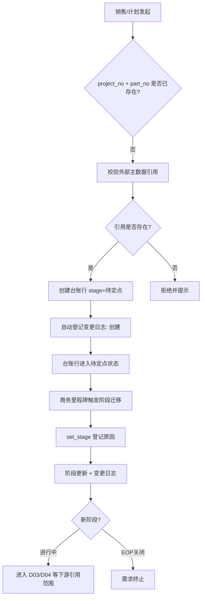

# 项目信息台账 · 应用详设

> **应用名 / 类名**: `project_ledger` / `ProjectLedger`
> **输入来源**: `app/parts-fc/architecture.md` 聚合根卡 1 + `app/parts-fc/brd/毛需求管理详设.md` BRD §2.11
> **日期**: 2026-08-08

---

## 1. 需求概览

### 1.1 基本信息
- **需求名称**: 项目信息台账
- **需求编号**: REQ-PARTSFC-D01
- **所属模块**: parts-fc · 主数据底座
- **需求来源**: BRD §2.11 / architecture.md 聚合根 1
- **创建日期**: 2026-08-08
- **优先级**: P0

### 1.2 需求背景
#### 1.2.1 为什么需要这个需求？
毛需求加工链的全部过程单据（D03 收集、D04 加工、D06 事件、D07 汇总、D08 牛鞭、D09 发布、D12 考核）都需要一个统一的"项目 x 零件"主数据底座作为参照维度。当前缺少集中管理的项目台账，导致各单据各自维护项目信息，口径不一致、阶段不同步、责任人不清。

#### 1.2.2 期望达到什么目标？
建立项目 x 零件的六维主数据底座（客户、产品、车型/平台、量纲口径、生命周期节点、项目责任人），作为全链路的单一权威源。项目阶段决定需求去向（进行中 -> 近端毛需求主线；待定点/定点中 -> 长期产能规划输入），阶段迁移全程留痕可审计。

### 1.3 需求范围
#### 1.3.1 包含哪些功能？
项目台账行的新建、详情查询、条件筛选列表、属性更新（触发变更日志）、阶段迁移（含原因登记）、取进行中项目清单

#### 1.3.2 不包含哪些功能？
- 客户主数据维护（权威源在外部 MDM，本域只读引用）
- 物料主数据维护（权威源在外部 MDM）
- 用量/份额的历史版本管理（权威源在 vehicle_part_map，本项目引用展示）
- 前端展示层宽表视图（属前端设计范畴）

### 1.4 涉及角色
**谁会使用这个功能？**

- **一线销售**: 维护客户/阶段/责任人维度；在 D03 录入时校验项目是否存在，在 D04 修正时校验本人负责零件
- **总部计划**: 维护产品/生命周期维度（SOP/EOP/lc_shape）；跨应用场景中被 D04/D05/D06/D10/D12 引用
- **系统**: 自动校验一致性（物料/车型主数据存在性、映射完备性）；阶段迁移时自动登记变更日志

---

## 2. 用户故事

### 2.1 核心用户故事

#### 2.1.1 `US-01` 用户故事 -- 新建项目台账行（优先级: P1）

- **故事描述**: 作为销售，我想要新建一条项目台账行（project_no + part_no），以便于后续需求收集时有项目参照、其他过程单据可引用
- **为何赋予此优先级**: 主数据必须先存在，否则 D03/D04 等下游单据无法校验与引用
- **独立测试**: 可通过输入合规字段值调用 create 接口，验证记录写入成功且可被 get 查询来独立测试
- **前置条件**: 客户主数据中 oem_code/plant_code 已存在；物料主数据中 part_no 已存在；vehicle_part_map 中对应的 veh_model 映射行已存在
- **后置条件**: 台账行创建成功，stage 初始为"待定点"，change_log 自动生成第一条创建记录

**验收场景**:

1. `US-01-AC1` **场景**: 合法参数创建成功
   - **Given** 系统中不存在该 project_no + part_no 组合，且引用的 oem_code、part_no、veh_model 均存在于外部主数据, **When** 销售提交完整必填字段（含 stage=待定点、oem_code、plant_code、veh_model、platform、part_kind、sop、eop、owner）, **Then** 台账行创建成功，返回完整记录，change_log 自动登记一条"创建"记录（字段=全部/前值=-/后值=当前值/原因=新建/日期=当前日期）

2. `US-01-AC2` **场景**: 联合主键重复被拒绝
   - **Given** 系统中已存在 project_no="PRJ-001" + part_no="8210001" 的记录, **When** 销售再次以相同 project_no + part_no 调用 create, **Then** 系统拒绝保存并返回"该组合已存在"

3. `US-01-AC3` **场景**: 必填字段缺失被拒绝
   - **Given** 销售提交请求缺少 oem_code, **When** 调用 create, **Then** 系统拒绝并返回"oem_code 为必填"

4. `US-01-AC4` **场景**: 引用外部主数据不存在被拒绝
   - **Given** 销售提交 part_no 在物料主数据中不存在, **When** 调用 create, **Then** 系统拒绝并返回"零件号不存在"

---

#### 2.1.2 `US-02` 用户故事 -- 取项目详情（优先级: P1）

- **故事描述**: 作为销售/计划，我想要按 project_no + part_no 查询台账详情，以便于查看项目完整信息（六维属性 + 变更日志）
- **为何赋予此优先级**: 详情查询是后续所有操作（修改、阶段迁移、下游引用）的前提
- **独立测试**: 可通过已知存在的 project_no + part_no 查询，验证返回完整字段来独立测试
- **前置条件**: 台账行已创建
- **后置条件**: 返回项目六维属性全貌（含 change_log 列表）

**验收场景**:

1. `US-01-AC1` **场景**: 正常查询返回完整详情
   - **Given** 系统中存在 project_no="PRJ-001" + part_no="8210001" 的台账行, **When** 调用 get("PRJ-001", "8210001"), **Then** 返回该行所有核心属性（project_no, part_no, stage, award_prob, oem_code, plant_code, veh_model, platform, part_kind, usage, share, sop, eop, lc_shape, owner）及完整 change_log 列表

2. `US-01-AC2` **场景**: 不存在的记录返回空
   - **Given** 系统中不存在 project_no="PRJ-999" + part_no="9999999" 的组合, **When** 调用 get("PRJ-999", "9999999"), **Then** 返回 null 或空结果

---

#### 2.1.3 `US-03` 用户故事 -- 按条件筛选项目列表（优先级: P2）

- **故事描述**: 作为销售/计划，我想要按阶段、客户、责任人等条件筛选台账列表，以便于快速定位关心的项目
- **为何赋予此优先级**: 列表查询是日常运营的基础操作，但在主数据量不大的场景下优先级略低于创建/详情
- **独立测试**: 可通过输入不同筛选条件组合，验证返回记录正确来独立测试
- **前置条件**: 系统中存在多条台账记录
- **后置条件**: 返回符合条件的记录列表，支持分页

**验收场景**:

1. `US-03-AC1` **场景**: 按阶段筛选
   - **Given** 系统中存在 3 条"进行中"记录和 2 条"待定点"记录, **When** 调用 list(stage="进行中"), **Then** 返回 3 条记录，均为"进行中"

2. `US-03-AC2` **场景**: 按客户筛选
   - **Given** 系统中有"主机厂A"的 2 条记录和"主机厂B"的 1 条记录, **When** 调用 list(oem_code="主机厂A"), **Then** 返回 2 条记录

3. `US-03-AC3` **场景**: 多条件组合筛选
   - **Given** 系统中有多条记录, **When** 调用 list(stage="进行中", owner="张三"), **Then** 返回 stage=进行中 AND owner=张三 的记录

4. `US-03-AC4` **场景**: 无筛选条件返回全部
   - **Given** 系统中有 N 条记录, **When** 调用 list() 不传参数, **Then** 返回全部记录（分页）

---

#### 2.1.4 `US-04` 用户故事 -- 更新项目属性（优先级: P1）

- **故事描述**: 作为销售/计划（按分工各自维护），我想要更新台账的属性字段，以便于反映项目最新的客户/产品/生命周期/责任人信息
- **为何赋予此优先级**: 台账信息随商务活动持续变化，更新是高频操作，且每次变更必须留痕以支持审计与追溯
- **独立测试**: 可通过传入变更字段，验证字段值更新成功且 change_log 新增对应记录来独立测试
- **前置条件**: 目标台账行已存在
- **后置条件**: 字段值更新成功；仅变更的字段生成 change_log 记录（字段/前值/后值/原因/日期）

**验收场景**:

1. `US-04-AC1` **场景**: 更新单个字段成功并留痕
   - **Given** 存在台账行 project_no="PRJ-001" + part_no="8210001"，当前 owner="张三", **When** 调用 update 将 owner 改为"李四"并填写原因="人员调整", **Then** owner 更新为"李四"，change_log 新增一条"owner/张三/李四/人员调整/当前日期"

2. `US-04-AC2` **场景**: 更新多个字段各留痕
   - **Given** 存在台账行，当前 sop="2024-03", eop="2027-06", **When** 同时更新 sop="2024-06", eop="2027-12", **Then** 两个字段均更新；change_log 新增两条记录，分别记录 sop 和 eop 变更

3. `US-04-AC3` **场景**: 无变更时不做留痕
   - **Given** 存在台账行, **When** 调用 update 传入全部字段值均与当前值相同, **Then** 不产生新的 change_log 记录，返回当前记录

4. `US-04-AC4` **场景**: 更新 part_kind 为"通用"时校验客户数
   - **Given** 台账行关联了 1 个客户且未标记单一客户通用, **When** 调用 update 将 part_kind 改为"通用", **Then** 系统提示"通用件须关联 >=2 客户或显式标记单一客户通用"（不强行阻断但告警）

---

#### 2.1.5 `US-05` 用户故事 -- 阶段迁移（优先级: P1）

- **故事描述**: 作为销售/计划，我想要按项目里程碑迁移台账的阶段，以便于让项目阶段准确反映实际情况、自动控制需求去向
- **为何赋予此优先级**: 阶段是决定需求去向的核心维度（进行中进毛需求主线 vs 待定点进长期规划），阶段迁移必须严格留痕
- **独立测试**: 可通过不同阶段迁移路径，验证新阶段生效且 change_log 登记来独立测试
- **前置条件**: 目标台账行已存在，且迁移符合状态机规则
- **后置条件**: stage 更新为新阶段；change_log 登记迁移记录（字段=stage/前值/后值/原因/日期）

**验收场景**:

1. `US-05-AC1` **场景**: 待定点 --定点立项--> 定点中
   - **Given** 台账行 stage="待定点", **When** 调用 set_stage(new_stage="定点中", reason="客户确认立项"), **Then** stage 更新为"定点中"，change_log 登记"stage/待定点/定点中/客户确认立项/当前日期"

2. `US-05-AC2` **场景**: 定点中 --获得定点--> 进行中
   - **Given** 台账行 stage="定点中", award_prob=60%, **When** 调用 set_stage(new_stage="进行中", reason="定点确认"), **Then** stage 更新为"进行中"

3. `US-05-AC3` **场景**: 进行中 --EOP--> EOP关闭
   - **Given** 台账行 stage="进行中", **When** 调用 set_stage(new_stage="EOP关闭", reason="产品生命周期结束"), **Then** stage 更新为"EOP关闭"，change_log 登记

4. `US-05-AC4` **场景**: 阶段回退（商务变化）
   - **Given** 台账行 stage="进行中", **When** 商务变化需要回退到"定点中"并附原因="客户取消SOP", **Then** stage 更新为"定点中"并留痕

5. `US-05-AC5` **场景**: 缺少 reason 被拒绝
   - **Given** 台账行 stage="待定点", **When** 调用 set_stage(new_stage="定点中") 不传 reason, **Then** 系统拒绝并返回"阶段迁移必须填写原因"

---

#### 2.1.6 `US-06` 用户故事 -- 取进行中项目清单（优先级: P2）

- **故事描述**: 作为系统（被 D03 录入校验调用），我想要获取进行中项目的清单，以便于在 D03 录入时校验零件是否属于进行中项目
- **为何赋予此优先级**: 纯跨应用接口，优先级略低于面向用户的 CRUD 操作
- **独立测试**: 可通过准备不同阶段的数据，验证只返回进行中项目来独立测试
- **前置条件**: 系统中存在各阶段的台账记录
- **后置条件**: 返回 stage="进行中" 的项目列表

**验收场景**:

1. `US-06-AC1` **场景**: 按客户过滤进行中项目
   - **Given** 系统中"主机厂A"有 2 条进行中、1 条待定点, **When** 调用 get_active_projects(oem_code="主机厂A"), **Then** 返回 2 条进行中记录

2. `US-06-AC2` **场景**: 不传客户返回全部进行中
   - **Given** 系统中有 5 条进行中记录（跨客户）, **When** 调用 get_active_projects() 不传 oem_code, **Then** 返回全部 5 条进行中记录

---

## 3. 业务场景

### 3.1 业务流程描述

#### 3.1.1 场景 1: 项目台账新建与维护



#### 3.1.2 场景 2: 项目属性日常更新

1. 销售/计划发现台账属性变化（份额变动、责任人调整、SOP 延期等）
2. 按分工调用 update：销售维护客户/阶段/责任人，计划维护产品/生命周期
3. 系统比对变更字段，仅变更字段生成 change_log（字段/前值/后值/原因/日期）
4. 变更日志永久保留，支持审计回溯

### 3.2 业务规则

#### 3.2.1 `BR-01` 联合主键唯一性
- **规则描述**: project_no + part_no 联合唯一标识一条台账记录；同一组合不可重复创建
- **适用场景**: create 操作
- **来源**: architecture.md 关键不变量 1

#### 3.2.2 `BR-02` 阶段迁移强制留痕
- **规则描述**: 每次阶段迁移（set_stage）必须登记变更日志，字段=stage、前值、后值、原因、日期，可审计
- **适用场景**: set_stage 操作
- **来源**: architecture.md 关键不变量 2

#### 3.2.3 `BR-03` 通用件客户关联校验
- **规则描述**: part_kind="通用"时，须关联 >=2 客户或显式标记单一客户通用；不满足时系统告警但不硬阻断
- **适用场景**: create / update 操作
- **来源**: architecture.md 关键不变量 3

#### 3.2.4 `BR-04` 映射完备性校验
- **规则描述**: stage="进行中" 的项目，其 part_no + veh_model 必须在 vehicle_part_map 中存在 status="生效" 的映射行；缺失时告警
- **适用场景**: set_stage(进行中) 操作
- **来源**: architecture.md 关键不变量 4

#### 3.2.5 `BR-05` project_no 必填
- **规则描述**: project_no 为必填字段，不能为空或空字符串
- **适用场景**: create 操作

#### 3.2.6 `BR-06` part_no 必填且引用存在
- **规则描述**: part_no 为必填，且必须在物料主数据中存在
- **适用场景**: create / update 操作

#### 3.2.7 `BR-07` stage 枚举校验
- **规则描述**: stage 取值必须为 待定点 / 定点中 / 进行中 / EOP关闭 之一
- **适用场景**: create / set_stage 操作

#### 3.2.8 `BR-08` award_prob 取值范围
- **规则描述**: award_prob 为定点概率百分比，取值范围 0~100；仅在 stage=待定点 或 定点中 时填写有业务意义
- **适用场景**: create / update 操作

#### 3.2.9 `BR-09` oem_code / plant_code 引用存在
- **规则描述**: oem_code 和 plant_code 为必填，且必须在客户主数据中存在
- **适用场景**: create / update 操作

#### 3.2.10 `BR-10` veh_model / platform 引用存在
- **规则描述**: veh_model 为必填，且必须在车型主数据中存在；platform 为必填
- **适用场景**: create / update 操作

#### 3.2.11 `BR-11` part_kind 枚举校验
- **规则描述**: part_kind 取值必须为 专用 / 通用 之一
- **适用场景**: create / update 操作

#### 3.2.12 `BR-12` usage / share 引用展示
- **规则描述**: usage 和 share 在本表为引用展示字段，权威源在 vehicle_part_map；update 操作不能修改本表的 usage/share（应从 vehicle_part_map 同步展示）
- **适用场景**: 所有查询操作
- **来源**: BRD §2.11.2 字段规则 "权威源在 D02（单一权威原则），本表引用展示"

#### 3.2.13 `BR-13` sop < eop 日期约束
- **规则描述**: sop 必须早于 eop（SOP 日期 < EOP 日期）
- **适用场景**: create / update 操作

#### 3.2.14 `BR-14` owner 必填
- **规则描述**: owner（责任销售）为必填，且必须在用户主数据中存在
- **适用场景**: create / update 操作

#### 3.2.15 `BR-15` 变更日志字段完整性
- **规则描述**: 每次 update/set_stage 产生的变更日志必须包含：字段名、前值、后值、变更原因、变更日期
- **适用场景**: update / set_stage 操作

#### 3.2.16 `BR-16` lc_shape 枚举校验
- **规则描述**: lc_shape（生命周期形态标签）取值必须为 传统 / 上市高后下滑 之一，或为空
- **适用场景**: create / update 操作

### 3.3 业务数据

#### 3.3.1 数据 1: 项目号 (project_no)
- **数据描述**: 项目的唯一业务标识，与 part_no 联合形成业务键
- **数据类型**: 文本
- **数据来源**: 销售录入/外部 ERP
- **示例值**: PRJ-001

#### 3.3.2 数据 2: 零件号 (part_no)
- **数据描述**: 引用物料主数据的零件号，与 project_no 联合形成业务键
- **数据类型**: 引用（物料主数据）
- **数据来源**: 外部 MDM
- **示例值**: 8210001

#### 3.3.3 数据 3: 项目阶段 (stage)
- **数据描述**: 项目所处的生命周期阶段，决定需求去向
- **数据类型**: 枚举值
- **数据来源**: 系统维护（由 stage 迁移驱动）
- **示例值**: 进行中

#### 3.3.4 数据 4: 变更日志 (change_log)
- **数据描述**: 每次属性变更的审计记录子表
- **数据类型**: 子表（字段/前值/后值/原因/日期）
- **数据来源**: 系统自动生成
- **示例值**: stage / 待定点 / 定点中 / 客户确认立项 / 2026-08-05

### 3.4 状态机

台账行按 project_no + part_no 粒度的阶段状态流转：

```
(新建) --定点立项--> 待定点 --获得定点--> 定点中 --SOP--> 进行中 --EOP--> EOP关闭
```

各阶段均可因商务变化直接迁移（如进行中回退到定点中），每次迁移登记变更日志。

**状态转换规则矩阵**:

| 当前状态 | 目标状态 | 触发动作 | 前置条件 | 业务含义 |
|----------|----------|----------|----------|----------|
| (新建) | 待定点 | create | 必填字段完整 | 项目初始化，长期规划阶段 |
| 待定点 | 定点中 | set_stage("定点中") | 客户确认立项 | 项目进入定点流程 |
| 定点中 | 进行中 | set_stage("进行中") | 定点确认/SOP | 项目进入近端需求主线 |
| 进行中 | EOP关闭 | set_stage("EOP关闭") | EOP 到达 | 需求终止，残余转物控 |
| 任意 | 任意 | set_stage(new_stage, reason) | reason 必填 | 商务变化直接迁移，留痕 |

---

## 4. 功能描述

### 4.1 功能清单

| 一级菜单/模块 | 一级模块编号 | 二级菜单/模块 | 二级模块编号 | 三级功能 | 三级功能编号 | 功能类型 | 优先级 | 三级功能简述 |
|---|---|---|---|---|---|---|---|---|
| 项目信息台账 | F01 | 台账管理 | F01-01 | 新建台账行 | F01-01-01 | 接口 | P1 | 创建新的 project_no + part_no 台账行，校验外部引用 |
| 项目信息台账 | F01 | 台账管理 | F01-01 | 取项目详情 | F01-01-02 | 接口 | P1 | 按联合主键查询六维属性与变更日志全貌 |
| 项目信息台账 | F01 | 台账管理 | F01-01 | 筛选项目列表 | F01-01-03 | 接口 | P2 | 按 stage/oem_code/owner 等条件分页筛选 |
| 项目信息台账 | F01 | 台账管理 | F01-01 | 更新项目属性 | F01-01-04 | 接口 | P1 | 更新六维属性，自动比对变更字段并登记变更日志 |
| 项目信息台账 | F01 | 阶段管理 | F01-02 | 阶段迁移 | F01-02-01 | 接口 | P1 | 按里程碑迁移 stage，强制登记原因与变更日志 |
| 项目信息台账 | F01 | 阶段管理 | F01-02 | 取进行中项目清单 | F01-02-02 | 接口 | P2 | 供 D03 录入校验，返回 stage=进行中的项目列表 |

### 4.2 功能模块结构图

```
项目信息台账 (F01) [主数据底座, P0]
├── F01-01 台账管理 [CRUD, P1]
│   ├── FUNC-01 新建台账行 (接口, P1)
│   ├── FUNC-02 取项目详情 (接口, P1)
│   ├── FUNC-03 筛选项目列表 (接口, P2)
│   └── FUNC-04 更新项目属性 (接口, P1)
└── F01-02 阶段管理 [生命周期, P1]
    ├── FUNC-05 阶段迁移 (接口, P1)
    └── FUNC-06 取进行中项目清单 (接口, P2)
```

### 4.3 功能详细说明

#### 4.3.1 F01-01 台账管理

##### 4.3.1.1 `FUNC-01` 新建台账行

**功能描述**: 创建一条新的项目 x 零件台账记录，校验所有外部引用（客户、物料、车型主数据），成功后 stage 初始为"待定点"，自动生成首条变更日志。

**用户操作流程**:
1. 销售调用 create 接口，传入 project_no、part_no 及完整六维属性
2. 系统校验 project_no + part_no 唯一性
3. 系统校验 oem_code/plant_code 在客户主数据中存在
4. 系统校验 part_no 在物料主数据中存在
5. 系统校验 veh_model 在车型主数据中存在
6. 系统校验必填字段完整性和枚举值合法性
7. 写入台账主表，stage 默认"待定点"
8. 自动写入 change_log（首条"创建"记录）

**输入数据**:
- project_no: 项目号 - 文本 - 示例: PRJ-001
- part_no: 零件号 - 文本 - 示例: 8210001
- stage: 项目阶段 - 枚举 - 默认: 待定点
- award_prob: 定点概率 - 百分比 - 示例: 60
- oem_code: 客户编码 - 文本 - 示例: OEM-A
- plant_code: 工厂编码 - 文本 - 示例: PLANT-1
- veh_model: 车型 - 文本 - 示例: 车型A
- platform: 平台 - 文本 - 示例: MQB
- part_kind: 专用/通用 - 枚举 - 示例: 专用
- sop: SOP 日期 - 日期 - 示例: 2024-03-01
- eop: EOP 日期 - 日期 - 示例: 2027-06-30
- lc_shape: 生命周期形态 - 枚举 - 示例: 传统
- owner: 责任销售 - 文本(用户ID) - 示例: 张三

**输出数据**:
- 完整台账记录（含 ID）
- change_log 首条创建记录

**业务规则**:
- BR-01: project_no + part_no 唯一
- BR-05: project_no 必填
- BR-06: part_no 必填且引用存在
- BR-07: stage 枚举校验
- BR-08: award_prob 取值范围 0~100
- BR-09: oem_code/plant_code 引用存在
- BR-10: veh_model/platform 引用存在
- BR-11: part_kind 枚举校验
- BR-13: sop < eop
- BR-14: owner 必填
- BR-16: lc_shape 枚举校验
- BR-03: 通用件客户关联告警

**特殊处理**:
- usage 和 share 字段在创建时从 vehicle_part_map 同步展示（不直接写入，查询时实时引用）

**业务实体**:
- **ProjectLedger（台账主表）**: 项目 x 零件的六维属性
- **ChangeLog（变更日志子表）**: 每次属性变更的审计记录

**台账主表字段**:

| 字段名称 | 字段类型 | 是否必填 | 默认值 | 业务逻辑 |
|---|---|---|---|---|
| project_no | 文本 | 是 | - | 项目号，与 part_no 联合唯一，最长 50 字符 |
| part_no | 文本 | 是 | - | 零件号，引用物料主数据，联合唯一 |
| stage | 枚举值 | 是 | 待定点 | 待定点/定点中/进行中/EOP关闭 |
| award_prob | 数字 | 否 | - | 定点概率 0~100，仅待定点/定点中时填写 |
| oem_code | 文本 | 是 | - | 客户编码，引用客户主数据 |
| plant_code | 文本 | 是 | - | 工厂编码，引用客户主数据 |
| veh_model | 文本 | 是 | - | 车型，引用车型主数据 |
| platform | 文本 | 是 | - | 平台，引用车型主数据 |
| part_kind | 枚举值 | 是 | - | 专用/通用；通用件须关联 >=2 客户或标记单一客户通用 |
| usage | 数字 | 否 | - | 单车用量（引用展示，权威源在 vehicle_part_map） |
| share | 数字 | 否 | - | 供应份额%（引用展示，权威源在 vehicle_part_map） |
| sop | 日期 | 是 | - | SOP 日期，必须早于 eop |
| eop | 日期 | 是 | - | EOP 日期，必须晚于 sop |
| lc_shape | 枚举值 | 否 | - | 传统/上市高后下滑 |
| owner | 文本 | 是 | - | 责任销售，引用用户主数据 |

**变更日志子表字段**:

| 字段名称 | 字段类型 | 是否必填 | 默认值 | 业务逻辑 |
|---|---|---|---|---|
| field_name | 文本 | 是 | - | 变更的字段名 |
| old_value | 文本 | 否 | - | 变更前的值 |
| new_value | 文本 | 否 | - | 变更后的值 |
| reason | 文本 | 是 | - | 变更原因 |
| change_date | 日期时间 | 是 | - | 变更日期，系统自动生成 |

---

##### 4.3.1.2 `FUNC-02` 取项目详情

**功能描述**: 按联合主键 project_no + part_no 查询台账完整信息，含六维属性与变更日志列表。

**用户操作流程**:
1. 调用方传入 project_no + part_no
2. 系统查询主表
3. 系统查询 change_log 子表
4. 组装返回完整记录

**输入数据**:
- project_no: 项目号 - 文本
- part_no: 零件号 - 文本

**输出数据**:
- 完整台账记录 + change_log 列表

**业务规则**: 无额外规则

---

##### 4.3.1.3 `FUNC-03` 筛选项目列表

**功能描述**: 按可选条件（stage / oem_code / owner / part_kind 等）筛选台账列表，支持分页。

**用户操作流程**:
1. 调用方传入筛选条件（均可选，不传=查全部）
2. 系统按 AND 逻辑组合条件
3. 返回分页结果

**输入数据**:
- stage: 项目阶段 - 枚举 - 可选
- oem_code: 客户编码 - 文本 - 可选
- owner: 责任销售 - 文本 - 可选
- part_kind: 专用/通用 - 枚举 - 可选
- veh_model: 车型 - 文本 - 可选
- page/page_size: 分页参数 - 数字 - 可选

**输出数据**:
- 台账记录列表 + 总数

**业务规则**: 无额外规则

---

##### 4.3.1.4 `FUNC-04` 更新项目属性

**功能描述**: 更新台账的六维属性字段。系统自动比对变更字段，仅变更字段生成 change_log 记录。未变更字段不产生留痕。

**用户操作流程**:
1. 调用方传入 project_no + part_no + 要更新的字段键值对
2. 系统校验记录存在性
3. 系统校验引用字段（如改 oem_code 则校验客户主数据）
4. 系统逐字段比对前后值
5. 变更字段写入主表 + change_log 子表（每条变更一条日志）

**输入数据**: 同 FUNC-01 的字段（全部可选，仅传入要变更的字段）

**输出数据**: 更新后的完整记录

**业务规则**:
- 除 BR-01 外的所有 BR 规则（按变更字段逐条校验）
- BR-15: 变更日志字段完整性
- BR-12: usage/share 不可直接修改（权威源在 vehicle_part_map）

**特殊处理**:
- 维护分工: 销售维护客户/阶段/责任人维度，计划维护产品/生命周期维度（业务约定，技术上不做硬阻断，但变更互通知）
- usage/share 字段为引用展示，更新操作不应修改其值；量纲变化应通过 vehicle_part_map 同步

---

#### 4.3.2 F01-02 阶段管理

##### 4.3.2.1 `FUNC-05` 阶段迁移

**功能描述**: 按项目里程碑迁移台账的阶段状态，每次迁移强制登记原因，自动生成变更日志。

**用户操作流程**:
1. 调用方传入 project_no + part_no + new_stage + reason
2. 系统校验记录存在性
3. 系统校验 new_stage 是否为有效枚举值
4. 系统校验 reason 非空
5. 更新 stage 字段
6. 写入 change_log（字段=stage/前值/后值/reason/日期）
7. 若新阶段="进行中"，触发 BR-04 映射完备性校验

**输入数据**:
- project_no + part_no: 联合主键
- new_stage: 目标阶段 - 枚举 - 必填
- reason: 迁移原因 - 文本 - 必填

**输出数据**: 更新后的记录 + change_log

**业务规则**:
- BR-02: 阶段迁移强制留痕
- BR-04: 进行中项目映射完备性告警
- BR-07: new_stage 枚举校验

**特殊处理**:
- 阶段迁移不限制转换路径：各阶段均可因商务变化直接迁移（如进行中回退到定点中）
- 迁移到 EOP关闭 后，下游 D03 录入应拦截该项目零件的新增录入（待确认：是否由本应用主动通知下游）

---

##### 4.3.2.2 `FUNC-06` 取进行中项目清单

**功能描述**: 返回 stage="进行中" 的项目列表，供 D03 录入时校验项目是否处于可录入状态。支持按 oem_code 过滤。

**用户操作流程**:
1. 调用方（系统/D03）传入可选的 oem_code
2. 系统查询 stage="进行中" 的记录
3. 若传入 oem_code，追加过滤条件
4. 返回列表

**输入数据**:
- oem_code: 客户编码 - 文本 - 可选

**输出数据**: 进行中项目列表（project_no, part_no, oem_code, veh_model, owner 等摘要字段）

**业务规则**: 无额外规则

**特殊处理**:
- 此接口为跨应用调用入口，被 demand_collection.create 调用，用于 D03 录入校验

---

## 5. 权限要求

### 5.1 功能权限

| 功能名称 | 权限标识 | 一线销售 | 总部计划 |
|---|---|---|---|
| 新建台账行 | `project_ledger:record:create` | PERM-01 可访问 | PERM-01 可访问 |
| 取项目详情 | `project_ledger:record:query` | PERM-02 可访问 | PERM-02 可访问 |
| 筛选项目列表 | `project_ledger:record:list` | PERM-03 可访问 | PERM-03 可访问 |
| 更新项目属性 | `project_ledger:record:update` | PERM-04 可访问（仅客户/阶段/责任人维度） | PERM-05 可访问（仅产品/生命周期维度） |
| 阶段迁移 | `project_ledger:record:set_stage` | PERM-06 可访问 | PERM-06 可访问 |
| 取进行中项目清单 | `project_ledger:record:get_active` | PERM-07 系统调用 | PERM-07 系统调用 |

> PERM-04 / PERM-05 的维度限制为业务约定，技术上不做硬阻断（BRD §2.11.4: "变更互通知"）。

### 5.2 数据权限

#### 5.2.1 角色 1: 一线销售
- 查看范围: 可查看所有台账记录
- 编辑范围: 业务约定仅修改本人负责零件的客户/阶段/责任人维度（技术上不做硬阻断）
- 变更互通知: 计划侧修改产品/生命周期维度时通知对应销售

#### 5.2.2 角色 2: 总部计划
- 查看范围: 可查看所有台账记录
- 编辑范围: 业务约定仅修改产品/生命周期维度（SOP/EOP/lc_shape 等）
- 变更互通知: 销售侧修改客户/阶段/责任人维度时通知对应计划

#### 5.2.3 角色 3: 系统（跨应用调用）
- 查看范围: 调用 get_active_projects 读取进行中项目清单
- 编辑范围: 不可编辑

---

## 6. 验收标准

### 6.1 功能验收标准

#### 6.1.1 标准 1: 台账行 CRUD 完整闭环
- **关联用户故事**: US-01, US-02, US-03, US-04
- **关联业务规则**: BR-01, BR-05~BR-14, BR-16
- **验证方式**: 执行 create -> get 验证写入 -> update 验证变更 -> list 验证筛选 -> 检查 change_log 完整性
- **测试数据**: project_no="PRJ-TEST-001", part_no="8210001", oem_code="主机厂A", stage="待定点", owner="张三"
- **预期结果**: 全生命周期操作成功，change_log 正确记录每一笔变更（字段/前值/后值/原因/日期）

#### 6.1.2 标准 2: 阶段迁移全路径覆盖
- **关联用户故事**: US-05
- **关联业务规则**: BR-02, BR-04, BR-07
- **验证方式**: 按状态机依次执行所有合法转换路径，验证 new_stage 生效且 change_log 登记；测试非法路径被拒绝
- **测试数据**: 待定点->定点中->进行中->EOP关闭，每条路径附 reason
- **预期结果**: 合法路径全部通过并留痕；reason 为空的请求被拒绝；迁移到"进行中"时若映射不完备，系统告警

#### 6.1.3 标准 3: 联合主键唯一性约束
- **关联用户故事**: US-01
- **关联业务规则**: BR-01
- **验证方式**: 用相同 project_no + part_no 两次调用 create
- **测试数据**: project_no="PRJ-DUP", part_no="8210001"
- **预期结果**: 第二次创建被拒绝，返回"该组合已存在"

#### 6.1.4 标准 4: 外部引用校验
- **关联用户故事**: US-01, US-04
- **关联业务规则**: BR-06, BR-09, BR-10, BR-14
- **验证方式**: 分别传入不存在的 oem_code / part_no / veh_model / owner
- **测试数据**: 不存在的客户编码/零件号/车型/用户
- **预期结果**: 每次均被拒绝，并返回明确的字段级错误提示

#### 6.1.5 标准 5: 交叉应用调用 (get_active_projects)
- **关联用户故事**: US-06
- **关联业务规则**: -
- **验证方式**: 准备 stage 混合数据（进行中 + 待定点 + EOP关闭），调用 get_active_projects，验证只返回进行中
- **测试数据**: 3 条进行中 + 2 条待定点 + 1 条 EOP关闭
- **预期结果**: 返回 3 条进行中记录；传入 oem_code 过滤后返回正确子集

### 6.2 非功能验收标准
- **性能要求**: 单条 CRUD 操作响应时间 < 500ms；list 分页查询（page_size=50）< 1s
- **安全性要求**: 变更日志不可被删除或篡改（append-only）
- **数据完整性**: change_log 子表与主表同事务写入，不允许部分成功

### 6.3 已知问题或限制
- usage/share 在本表为引用展示，不可直接修改；量纲变更须通过 vehicle_part_map 同步（BRD §2.11.2 单一权威原则）
- 维护分工（销售 vs 计划维度）为业务约定，技术上不做硬阻断（BRD §2.11.4）
- 阶段回退（如进行中 -> 定点中）允许但属于异常商务场景，需登记充分原因
- 项目号编码规则待确认（BRD 表样使用 PRJ-NNN 格式，但未明确编码规则）

---

## 7. 参考资料

### 7.1 相关文档
- `app/parts-fc/architecture.md` -- 聚合根卡 1（核心属性 / 对外操作 / 关键不变量 / 状态机）
- `app/parts-fc/brd/毛需求管理详设.md` -- BRD §2.11 D01 项目信息台账（业务背景 / 六维度 / 维护规则 / 表样）
- `design/应用设计.md` -- 详设模板规格

### 7.2 相关功能
- `demand_collection` (D03): 引用本表进行项目阶段校验（get_active_projects）
- `demand_processing` (D04): 引用本表校验销售修正权限（owner）和生命周期视角
- `baseline_borrowing` (D05): 引用本表的生命周期信息
- `independent_event` (D06): 断点事件关联项目
- `forecast_assessment` (D12): 引用本表考核维度
- `vehicle_part_map` (D02): 本表 veh_model 和 usage/share 的权威源

### 7.3 外部依赖
- **客户主数据 (MDM)**: oem_code / plant_code 的权威源，本域通过接口同步本地冗余后只读引用
- **物料主数据 (MDM)**: part_no 的权威源，本域通过接口同步本地冗余后只读引用
- **车型主数据 (MDM)**: veh_model / platform 的权威源，本域通过接口同步本地冗余后只读引用
- **用户主数据 (HR)**: owner 的权威源，本域通过接口同步本地冗余后只读引用

### 7.4 备注
- 本应用为纯主数据，被多方引用；无跨应用调用（self.fde.call）发出
- project_no 编码规则待确认（BRD 中未明确规范）
- "单一客户通用"的显式标记方式（flag 字段或备注）待确认
- 阶段迁移到 EOP关闭 后是否主动通知下游（D03 拦截）待确认
