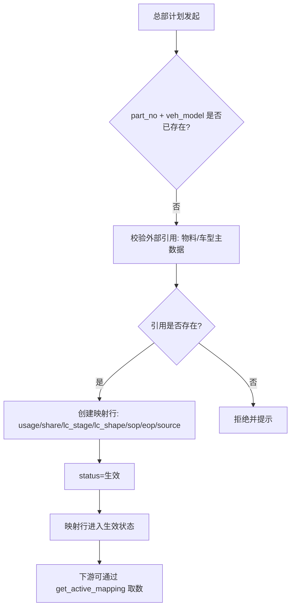
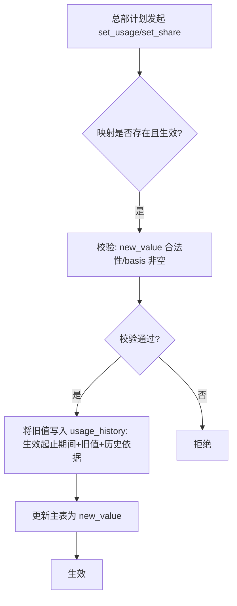

# 车型—零件映射 · 应用详设

> **应用名 / 类名**: `vehicle_part_map` / `VehiclePartMap`
> **输入来源**: `app/parts-fc/architecture.md` 聚合根卡 2 + `app/parts-fc/brd/毛需求管理详设.md` BRD §2.12
> **日期**: 2026-08-08

---

## 1. 需求概览

### 1.1 基本信息
- **需求名称**: 车型—零件映射
- **需求编号**: REQ-PARTSFC-D02
- **所属模块**: parts-fc · 主数据底座
- **需求来源**: BRD §2.12 / architecture.md 聚合根 2
- **创建日期**: 2026-08-08
- **优先级**: P0

### 1.2 需求背景
#### 1.2.1 为什么需要这个需求？
毛需求加工链中，车型需求量纲转换为零件需求的因果路径（车型产量 x 单车用量 x 份额）是基线生成双路径之一，也是外部验证的关键输入。此外，外部爬取的车型级数据（市场销量、上险数、生命周期）需要通过映射桥接到零件级。当前没有一个集中的映射权威源，单车用量和份额在 project_ledger 和 vehicle_part_map 之间存在双头维护风险。

#### 1.2.2 期望达到什么目标？
建立车型 -> 零件量纲映射的单一权威源。单车用量与供应份额的唯一定义和维护点。用量/份额变更自动生成历史版本（生效期间保留），保证"当时的口径"可回溯。外部车型级数据通过映射桥接到零件级，支撑基线因果路径、外部验证、牛鞭修正。

### 1.3 需求范围
#### 1.3.1 包含哪些功能？
映射行的新建、详情查询、条件筛选列表、属性更新、单车用量变更（生成历史版本）、供应份额变更（生成历史版本）、停用映射、取当前生效映射

#### 1.3.2 不包含哪些功能？
- 物料主数据维护（权威源在外部 MDM）
- 车型主数据维护（权威源在外部 MDM）
- 外部数据的爬取与清洗（本表只做映射桥接，数据爬取属外部系统职责）
- project_ledger 中 usage/share 的同步推送（待确认：同步机制）

### 1.4 涉及角色
**谁会使用这个功能？**

- **总部计划**: 映射表的唯一维护者。维护零件与车型的映射关系、单车用量、供应份额、生命周期阶段/形态、SOP/EOP。量纲变更时生成历史版本。停用旧映射。
- **系统（跨应用调用）**: 被 demand_processing（D04）、demand_collection（D03）、bullwhip_correction（D08）、baseline_borrowing（D05）、strategy_fitting（D10）调用 get_active_mapping
- **一线销售**: 只读引用（通过 project_ledger 查看当前量纲值）

---

## 2. 用户故事

### 2.1 核心用户故事

#### 2.1.1 `US-01` 用户故事 -- 新建映射行（优先级: P1）

- **故事描述**: 作为总部计划，我想要新建一条零件->车型的映射行，以便于后续外部数据可见、因果路径可用
- **为何赋予此优先级**: 映射行是量纲数据的载体，必须先存在，否则外部数据不可用、基线因果路径不具备量纲转换能力
- **独立测试**: 可通过传入合规字段调用 create，验证记录写入成功来独立测试
- **前置条件**: part_no 在物料主数据中存在；veh_model 在车型主数据中存在；相同 part_no + veh_model 组合不存在
- **后置条件**: 映射行创建成功，status 默认为"生效"

**验收场景**:

1. `US-01-AC1` **场景**: 合法参数创建成功
   - **Given** 系统中不存在该 part_no + veh_model 组合，且引用均存在于外部主数据, **When** 总部计划提交完整必填字段（part_no, veh_model, usage, share, lc_stage, lc_shape, sop, eop, source）, **Then** 映射行创建成功，status="生效"，返回完整记录

2. `US-01-AC2` **场景**: 联合主键重复被拒绝
   - **Given** 系统中已存在 part_no="8210001" + veh_model="车型A" 的记录, **When** 再次以相同组合调用 create, **Then** 系统拒绝并返回"该映射已存在"

3. `US-01-AC3` **场景**: 必填字段缺失被拒绝
   - **Given** 提交请求缺少 usage, **When** 调用 create, **Then** 系统拒绝并返回"单车用量为必填"

4. `US-01-AC4` **场景**: 外部引用不存在被拒绝
   - **Given** 提交 part_no 在物料主数据中不存在, **When** 调用 create, **Then** 系统拒绝并返回"零件号不存在"

---

#### 2.1.2 `US-02` 用户故事 -- 取映射详情（优先级: P1）

- **故事描述**: 作为总部计划/系统，我想要按 part_no + veh_model 查询映射详情，以便于了解当前量纲值、生命周期信息和历史版本
- **为何赋予此优先级**: 详情查询是所有后续操作的前提
- **独立测试**: 可通过已知存在的映射查询，验证返回完整字段来独立测试
- **前置条件**: 映射行已存在
- **后置条件**: 返回映射全貌（含 usage_history 历史版本列表）

**验收场景**:

1. `US-02-AC1` **场景**: 正常查询返回完整详情
   - **Given** 系统中存在 part_no="8210001" + veh_model="车型A" 的映射, **When** 调用 get("8210001", "车型A"), **Then** 返回所有核心属性（part_no, veh_model, platform, usage, share, lc_stage, lc_shape, sop, eop, status, source）及 usage_history 子表列表

2. `US-02-AC2` **场景**: 不存在的记录返回空
   - **Given** 系统中不存在该组合, **When** 调用 get, **Then** 返回 null 或空

---

#### 2.1.3 `US-03` 用户故事 -- 筛选映射列表（优先级: P2）

- **故事描述**: 作为总部计划，我想要按零件号、车型、状态等条件筛选映射列表，以便于快速定位特定映射行
- **为何赋予此优先级**: 日常运维查询，优先级略低于核心 CRUD
- **独立测试**: 可通过不同筛选条件组合，验证返回正确来独立测试
- **前置条件**: 系统中存在多条映射记录
- **后置条件**: 返回符合条件的记录列表，支持分页

**验收场景**:

1. `US-03-AC1` **场景**: 按零件号筛选
   - **Given** 系统中 part_no="STD-M6" 有 3 条映射（对应 3 个车型）, **When** 调用 list(part_no="STD-M6"), **Then** 返回 3 条记录

2. `US-03-AC2` **场景**: 按状态筛选
   - **Given** 系统中有 8 条"生效"和 2 条"停用"映射, **When** 调用 list(status="生效"), **Then** 返回 8 条记录

3. `US-03-AC3` **场景**: 多条件组合
   - **Given** 多条记录, **When** 调用 list(part_no="STD-M6", status="生效"), **Then** 返回对应记录

---

#### 2.1.4 `US-04` 用户故事 -- 更新映射属性（优先级: P2）

- **故事描述**: 作为总部计划，我想要更新映射行的一般属性（platform、lc_stage、lc_shape、sop、eop、status、source），以便于保持映射信息准确
- **为何赋予此优先级**: 一般属性更新不如量纲变更（用量/份额）高频和关键
- **独立测试**: 可通过更新生命周期阶段或 SOP 等字段，验证变更生效来独立测试
- **前置条件**: 目标映射行已存在
- **后置条件**: 字段值更新成功

**验收场景**:

1. `US-04-AC1` **场景**: 更新生命周期阶段
   - **Given** 映射行 lc_stage="爬坡", **When** 调用 update 将 lc_stage 改为"成熟", **Then** lc_stage 更新为"成熟"

2. `US-04-AC2` **场景**: 批量更新 SOP/EOP
   - **Given** 映射行 sop="2024-03", eop="2027-06", **When** 同时更新 sop="2024-06", eop="2027-12", **Then** 两个字段均更新成功

---

#### 2.1.5 `US-05` 用户故事 -- 变更单车用量（优先级: P1）

- **故事描述**: 作为总部计划，我想要变更某零件在特定车型上的单车用量（如设变导致用量从 1 变为 2），以便于保持量纲准确，同时旧版本按期间保留支持"当时口径"回溯
- **为何赋予此优先级**: 单车用量是因果路径的核心因子，变更需要版本管理保证可追溯
- **独立测试**: 可通过执行 set_usage，验证新用量生效、旧版本写入 usage_history 来独立测试
- **前置条件**: 目标映射行已存在且 status="生效"
- **后置条件**: 主表 usage 更新为新值；usage_history 子表新增一条记录（旧值+生效起止期间+变更依据）

**验收场景**:

1. `US-05-AC1` **场景**: 正常用量变更生成历史版本
   - **Given** 映射行 usage=1, current_date=2026-06-01, **When** 调用 set_usage(new_usage=2, effective_date="2026-06-01", basis="设变通知 ECN-2026-045"), **Then** usage 更新为 2；usage_history 新增一条：旧值=1/生效起=原生效起/生效止=2026-05-31/变更依据="设变通知 ECN-2026-045"

2. `US-05-AC2` **场景**: 新用量 <= 0 被拒绝
   - **Given** 映射行 usage=1, **When** 调用 set_usage(new_usage=0), **Then** 系统拒绝并返回"单车用量必须大于 0"

3. `US-05-AC3` **场景**: 缺少变更依据被拒绝
   - **Given** 映射行 usage=1, **When** 调用 set_usage(new_usage=2, effective_date="2026-06-01") 不传 basis, **Then** 系统拒绝并返回"量纲变更必须登记变更依据"

---

#### 2.1.6 `US-06` 用户故事 -- 变更供应份额（优先级: P1）

- **故事描述**: 作为总部计划，我想要变更某零件在特定车型上的供应份额（如商务谈判后份额从 55% 变为 60%），以便于保持商务口径准确，同时旧版本按期间保留
- **为何赋予此优先级**: 份额是因果路径的核心因子，商务变化频繁
- **独立测试**: 可通过执行 set_share，验证新份额生效、旧版本写入 usage_history 来独立测试
- **前置条件**: 目标映射行已存在且 status="生效"
- **后置条件**: 主表 share 更新为新值；usage_history 子表新增一条记录

**验收场景**:

1. `US-06-AC1` **场景**: 正常份额变更生成历史版本
   - **Given** 映射行 share=55%, current_date=2026-06-01, **When** 调用 set_share(new_share=60, effective_date="2026-06-01", basis="客户商务确认函 2026-05"), **Then** share 更新为 60%；usage_history 新增一条

2. `US-06-AC2` **场景**: 份额超出 0~100 范围被拒绝
   - **Given** 映射行 share=60%, **When** 调用 set_share(new_share=120), **Then** 系统拒绝并返回"份额必须在 0~100% 之间"

3. `US-06-AC3` **场景**: 份额为 0 允许（退出供应）
   - **Given** 映射行 share=30%, **When** 调用 set_share(new_share=0, effective_date="2026-07-01", basis="商务退出确认"), **Then** share 更新为 0；usage_history 新增一条

---

#### 2.1.7 `US-07` 用户故事 -- 停用映射（优先级: P2）

- **故事描述**: 作为总部计划，我想要停用一条映射行（如 EOP 后或设变替代后旧映射不再需要），以便于防止下游继续引用过时映射
- **为何赋予此优先级**: 停用是低频管理操作，但对数据质量有重要意义
- **独立测试**: 可通过 disable 操作验证 status 变为"停用"来独立测试
- **前置条件**: 目标映射行已存在
- **后置条件**: status 更新为"停用"；停用后 get_active_mapping 不再返回该行

**验收场景**:

1. `US-07-AC1` **场景**: 正常停用
   - **Given** 映射行 status="生效", **When** 调用 disable(reason="设变替代，产品已切换至新件"), **Then** status 更新为"停用"

2. `US-07-AC2` **场景**: 已停用映射再次停用
   - **Given** 映射行 status="停用", **When** 调用 disable, **Then** 系统拒绝或返回"该映射已处于停用状态"

3. `US-07-AC3` **场景**: 缺少停用原因被拒绝
   - **Given** 映射行 status="生效", **When** 调用 disable 不传 reason, **Then** 系统拒绝并返回"停用必须填写原因"

---

#### 2.1.8 `US-08` 用户故事 -- 取当前生效映射（优先级: P1）

- **故事描述**: 作为系统（被 D04/D03/D08/D05/D10 调用），我想要获取某零件当前生效的车型映射，以便于量纲校验、生命周期判定、外部数据桥接
- **为何赋予此优先级**: 是最重要的跨应用调用接口，被 5 个应用引用
- **独立测试**: 可通过准备生效和停用混合数据，验证只返回生效行来独立测试
- **前置条件**: 系统中存在该零件的映射记录
- **后置条件**: 返回 status="生效" 的映射列表

**验收场景**:

1. `US-08-AC1` **场景**: 取单个零件生效映射
   - **Given** part_no="8210001" 有 1 条生效映射, **When** 调用 get_active_mapping("8210001"), **Then** 返回该生效映射行

2. `US-08-AC2` **场景**: 通用件返回多车型映射
   - **Given** part_no="STD-M6" 有 3 条生效映射（车型A/B/C）, **When** 调用 get_active_mapping("STD-M6"), **Then** 返回 3 条生效映射

3. `US-08-AC3` **场景**: 无生效映射返回空
   - **Given** part_no="8210001" 的所有映射均为"停用", **When** 调用 get_active_mapping("8210001"), **Then** 返回空列表

---

## 3. 业务场景

### 3.1 业务流程描述

#### 3.1.1 场景 1: 新建映射与量纲初次登记



#### 3.1.2 场景 2: 量纲变更与历史版本管理



#### 3.1.3 场景 3: 映射停用流程

1. 总部计划收到设变通知或 EOP 确认
2. 调用 disable 接口，传入停用原因
3. 系统将 status 更新为"停用"
4. 下游 get_active_mapping 不再返回该映射行
5. 已有历史版本永久保留

### 3.2 业务规则

#### 3.2.1 `BR-01` 联合主键唯一性
- **规则描述**: part_no + veh_model 联合唯一标识一条映射记录；同一组合不可重复创建
- **适用场景**: create 操作
- **来源**: architecture.md 关键不变量 1

#### 3.2.2 `BR-02` 量纲变更强制生成历史版本
- **规则描述**: 每次 set_usage 或 set_share 变更，必须将旧值写入 usage_history 子表（生效起止期间/旧值/变更依据）；旧版本按生效期间保留，保证"当时的口径"可回溯
- **适用场景**: set_usage / set_share 操作
- **来源**: architecture.md 关键不变量 2

#### 3.2.3 `BR-03` 进行中项目映射完备性
- **规则描述**: 进行中项目的零件（来自 project_ledger）必须在 vehicle_part_map 中存在 status="生效" 的映射行；缺失则外部数据不可用、基线退回纯时序
- **适用场景**: 被 project_ledger.set_stage(进行中) 交叉校验
- **来源**: architecture.md 关键不变量 3

#### 3.2.4 `BR-04` 上市高后下滑形态标注
- **规则描述**: lc_shape="上市高后下滑" 必须显式标注；标注后驱动基线生成使用衰减模型（禁止按峰值线性外推）
- **适用场景**: create / update 操作
- **来源**: architecture.md 关键不变量 4

#### 3.2.5 `BR-05` part_no 必填且引用存在
- **规则描述**: part_no 为必填，且必须在物料主数据中存在
- **适用场景**: create 操作

#### 3.2.6 `BR-06` veh_model 必填且引用存在
- **规则描述**: veh_model 为必填，且必须在车型主数据中存在
- **适用场景**: create 操作

#### 3.2.7 `BR-07` usage 必填且 >= 0
- **规则描述**: 单车用量为必填，必须 >= 0；值为 0 的映射为占位映射（如待定阶段的零件，量纲尚未确定），待确认是否允许
- **适用场景**: create / set_usage 操作

#### 3.2.8 `BR-08` share 必填且 0~100
- **规则描述**: 供应份额为必填百分比，取值范围 [0, 100]；0 表示退出供应，100 表示独家供应
- **适用场景**: create / set_share 操作

#### 3.2.9 `BR-09` lc_stage 枚举校验
- **规则描述**: lc_stage 取值必须为 爬坡 / 成熟 / 衰退 / EOP临近 之一
- **适用场景**: create / update 操作

#### 3.2.10 `BR-10` lc_shape 枚举校验
- **规则描述**: lc_shape 取值必须为 传统 / 上市高后下滑 之一
- **适用场景**: create / update 操作

#### 3.2.11 `BR-11` sop < eop 日期约束
- **规则描述**: sop 必须早于 eop（SOP 日期 < EOP 日期）
- **适用场景**: create / update 操作

#### 3.2.12 `BR-12` status 枚举校验
- **规则描述**: status 取值必须为 生效 / 停用 之一
- **适用场景**: create / disable 操作

#### 3.2.13 `BR-13` source 必填
- **规则描述**: 映射依据（source）为必填，记录映射来源（BOM/设变通知/商务确认）
- **适用场景**: create 操作

#### 3.2.14 `BR-14` 量纲变更 basis 必填
- **规则描述**: set_usage / set_share 的变更依据（basis）为必填，须附设变通知号或商务函件号
- **适用场景**: set_usage / set_share 操作

#### 3.2.15 `BR-15` disable reason 必填
- **规则描述**: 停用映射必须填写 reason
- **适用场景**: disable 操作

#### 3.2.16 `BR-16` 量纲历史版本不可删除
- **规则描述**: usage_history 子表记录不可删除，只能追加
- **适用场景**: 所有历史版本查询

### 3.3 业务数据

#### 3.3.1 数据 1: 单车用量 (usage)
- **数据描述**: 每台车所需该零件的数量，量纲转换的核心因子
- **数据类型**: 数字（Decimal）
- **数据来源**: BOM / 设变通知
- **示例值**: 1

#### 3.3.2 数据 2: 供应份额 (share)
- **数据描述**: 该供应商在该车型该零件上的供应份额百分比
- **数据类型**: 百分比
- **数据来源**: 商务协议 / 客户确认函
- **示例值**: 60%

#### 3.3.3 数据 3: 生命周期阶段 (lc_stage)
- **数据描述**: 车型-零件的当前生命周期阶段，影响外推方法与策略选择
- **数据类型**: 枚举值
- **数据来源**: 产品计划维护
- **示例值**: 成熟

#### 3.3.4 数据 4: 量纲历史版本 (usage_history)
- **数据描述**: 用量/份额每次变更时产生的历史快照子表，按生效期间保留旧值
- **数据类型**: 子表
- **数据来源**: 系统自动生成
- **示例值**: 55% / 2025-01~2026-05 / 初始商务协议

### 3.4 状态机

映射行按 part_no + veh_model 粒度的状态流转：

```
生效 --设变替代--> 停用
```

- 新建映射默认 status="生效"
- 停用后旧映射行保留，量纲历史版本不删除
- 停用不可逆（如需重新启用，建议新建映射行）

**状态转换规则矩阵**:

| 当前状态 | 目标状态 | 触发动作 | 前置条件 | 业务含义 |
|----------|----------|----------|----------|----------|
| (新建) | 生效 | create | 必填字段完整 | 映射初次登记，可供下游引用 |
| 生效 | 停用 | disable | reason 必填 | 设变替代/EOP/商务退出，下游不再引用 |

---

## 4. 功能描述

### 4.1 功能清单

| 一级菜单/模块 | 一级模块编号 | 二级菜单/模块 | 二级模块编号 | 三级功能 | 三级功能编号 | 功能类型 | 优先级 | 三级功能简述 |
|---|---|---|---|---|---|---|---|---|
| 车型—零件映射 | F01 | 映射管理 | F01-01 | 新建映射行 | F01-01-01 | 接口 | P1 | 创建 part_no + veh_model 映射，校验外部引用 |
| 车型—零件映射 | F01 | 映射管理 | F01-01 | 取映射详情 | F01-01-02 | 接口 | P1 | 按联合主键查询映射属性与量纲历史版本 |
| 车型—零件映射 | F01 | 映射管理 | F01-01 | 筛选映射列表 | F01-01-03 | 接口 | P2 | 按零件号/车型/状态等条件分页筛选 |
| 车型—零件映射 | F01 | 映射管理 | F01-01 | 更新映射属性 | F01-01-04 | 接口 | P2 | 更新 platform/lc_stage/lc_shape/sop/eop/source |
| 车型—零件映射 | F01 | 量纲管理 | F01-02 | 变更单车用量 | F01-02-01 | 接口 | P1 | 变更 usage，旧值写入 usage_history |
| 车型—零件映射 | F01 | 量纲管理 | F01-02 | 变更供应份额 | F01-02-02 | 接口 | P1 | 变更 share，旧值写入 usage_history |
| 车型—零件映射 | F01 | 生命周期 | F01-03 | 停用映射 | F01-03-01 | 接口 | P2 | 将映射状态置为停用，reason 必填 |
| 车型—零件映射 | F01 | 生命周期 | F01-03 | 取当前生效映射 | F01-03-02 | 接口 | P1 | 供跨应用调用，返回 status=生效的映射列表 |

### 4.2 功能模块结构图

```
车型—零件映射 (F01) [主数据底座, P0]
├── F01-01 映射管理 [CRUD, P1]
│   ├── FUNC-01 新建映射行 (接口, P1)
│   ├── FUNC-02 取映射详情 (接口, P1)
│   ├── FUNC-03 筛选映射列表 (接口, P2)
│   └── FUNC-04 更新映射属性 (接口, P2)
├── F01-02 量纲管理 [版本变更, P1]
│   ├── FUNC-05 变更单车用量 (接口, P1)
│   └── FUNC-06 变更供应份额 (接口, P1)
└── F01-03 生命周期 [状态管理, P2]
    ├── FUNC-07 停用映射 (接口, P2)
    └── FUNC-08 取当前生效映射 (接口, P1)
```

### 4.3 功能详细说明

#### 4.3.1 F01-01 映射管理

##### 4.3.1.1 `FUNC-01` 新建映射行

**功能描述**: 创建一条新的零件->车型映射记录，作为量纲数据的载体。校验所有外部引用，成功后 status 默认为"生效"。

**用户操作流程**:
1. 总部计划调用 create 接口
2. 系统校验 part_no + veh_model 唯一性
3. 系统校验 part_no 在物料主数据中存在
4. 系统校验 veh_model 在车型主数据中存在
5. 校验必填字段和枚举值合法性
6. 写入主表，默认 status="生效"

**输入数据**:
- part_no: 零件号 - 文本 - 示例: 8210001
- veh_model: 车型 - 文本 - 示例: 车型A
- platform: 平台 - 文本 - 示例: MQB
- usage: 单车用量 - Decimal - 示例: 1
- share: 供应份额 - 百分比 - 示例: 100
- lc_stage: 生命周期阶段 - 枚举 - 示例: 爬坡
- lc_shape: 生命周期形态 - 枚举 - 示例: 传统
- sop: SOP 日期 - 日期 - 示例: 2024-03-01
- eop: EOP 日期 - 日期 - 示例: 2027-06-30
- source: 映射依据 - 文本 - 示例: BOM v2.3

**输出数据**: 完整映射记录

**业务规则**:
- BR-01: 联合主键唯一
- BR-05: part_no 引用存在
- BR-06: veh_model 引用存在
- BR-07: usage >= 0
- BR-08: share 0~100
- BR-09: lc_stage 枚举
- BR-10: lc_shape 枚举
- BR-11: sop < eop
- BR-13: source 必填

**业务实体**:
- **VehiclePartMap（映射主表）**: 车型->零件的量纲映射与生命周期属性
- **UsageHistory（量纲历史版本子表）**: 用量/份额变更的历史快照，按生效期间保留

**映射主表字段**:

| 字段名称 | 字段类型 | 是否必填 | 默认值 | 业务逻辑 |
|---|---|---|---|---|
| part_no | 文本 | 是 | - | 零件号，引用物料主数据，与 veh_model 联合唯一 |
| veh_model | 文本 | 是 | - | 车型，引用车型主数据，与 part_no 联合唯一 |
| platform | 文本 | 否 | - | 平台，上移预测/池化的层级参照 |
| usage | 数字 | 是 | - | 单车用量，>=0，变更走 set_usage 生成历史版本 |
| share | 数字 | 是 | - | 供应份额 %，0~100，变更走 set_share 生成历史版本 |
| lc_stage | 枚举值 | 是 | - | 爬坡/成熟/衰退/EOP临近 |
| lc_shape | 枚举值 | 是 | - | 传统/上市高后下滑 |
| sop | 日期 | 是 | - | SOP 日期，必须早于 eop |
| eop | 日期 | 是 | - | EOP 日期（计划），必须晚于 sop |
| status | 枚举值 | 是 | 生效 | 生效/停用；停用后下游不再引用 |
| source | 文本 | 是 | - | 映射依据（BOM/设变通知/商务确认） |

**量纲历史版本子表字段**:

| 字段名称 | 字段类型 | 是否必填 | 默认值 | 业务逻辑 |
|---|---|---|---|---|
| part_no | 文本 | 是 | - | 与 veh_model 联合引用主表 |
| veh_model | 文本 | 是 | - | 与 part_no 联合引用主表 |
| effective_from | 日期 | 是 | - | 该版本生效起始日期 |
| effective_to | 日期 | 否 | - | 该版本生效截止日期（至今=null） |
| field_type | 枚举值 | 是 | - | usage/share（记录变更类型） |
| old_value | 数字 | 是 | - | 旧值 |
| change_basis | 文本 | 是 | - | 变更依据（设变通知号/商务函件号） |
| changed_at | 日期时间 | 是 | - | 变更时间，系统自动生成 |

---

##### 4.3.1.2 `FUNC-02` 取映射详情

**功能描述**: 按联合主键 part_no + veh_model 查询映射完整信息，含映射属性与量纲历史版本列表。

**用户操作流程**:
1. 调用方传入 part_no + veh_model
2. 系统查询主表
3. 系统查询 usage_history 子表
4. 组装返回完整记录

**输入数据**:
- part_no: 零件号 - 文本
- veh_model: 车型 - 文本

**输出数据**: 完整映射记录 + usage_history 列表

**业务规则**: 无额外规则

---

##### 4.3.1.3 `FUNC-03` 筛选映射列表

**功能描述**: 按可选条件筛选映射列表，支持分页。

**用户操作流程**:
1. 调用方传入筛选条件（均可选）
2. 系统按 AND 逻辑组合条件
3. 返回分页结果

**输入数据**:
- part_no: 零件号 - 文本 - 可选
- veh_model: 车型 - 文本 - 可选
- status: 映射状态 - 枚举 - 可选
- lc_stage: 生命周期阶段 - 枚举 - 可选
- page/page_size: 分页参数 - 数字 - 可选

**输出数据**: 映射记录列表 + 总数

**业务规则**: 无额外规则

---

##### 4.3.1.4 `FUNC-04` 更新映射属性

**功能描述**: 更新映射行的一般属性（platform、lc_stage、lc_shape、sop、eop、source）。量纲字段（usage/share）不可通过此接口修改，须走专用接口 set_usage/set_share。

**用户操作流程**:
1. 调用方传入 part_no + veh_model + 要更新的字段
2. 系统校验记录存在性
3. 系统校验枚举值和业务约束
4. 写入更新后的值

**输入数据**:
- part_no + veh_model: 联合主键
- platform / lc_stage / lc_shape / sop / eop / source: 可选更新字段

**输出数据**: 更新后的完整记录

**业务规则**:
- BR-04: lc_shape="上市高后下滑" 显式标注
- BR-09: lc_stage 枚举
- BR-10: lc_shape 枚举
- BR-11: sop < eop

**特殊处理**:
- 用量/份额字段不通过此接口修改，须走 FUNC-05 / FUNC-06 专用接口

---

#### 4.3.2 F01-02 量纲管理

##### 4.3.2.1 `FUNC-05` 变更单车用量

**功能描述**: 变更某零件在特定车型上的单车用量。系统自动将旧值写入 usage_history 子表，记录生效起止期间与变更依据，保证"当时的口径"可回溯。

**用户操作流程**:
1. 总部计划调用 set_usage
2. 系统校验映射存在且 status="生效"
3. 系统校验 new_usage > 0
4. 系统校验 basis 非空
5. 系统在 usage_history 写入旧版本记录（旧值/生效起/effective_date-1天/变更依据）
6. 系统更新主表 usage 为新值

**输入数据**:
- part_no + veh_model: 联合主键
- new_usage: 新单车用量 - Decimal - 必填
- effective_date: 生效日期 - 日期 - 必填
- basis: 变更依据 - 文本 - 必填（设变通知号/商务函件号）

**输出数据**: 更新后的映射记录 + 新生成的 usage_history 记录

**业务规则**:
- BR-02: 旧值写入 usage_history
- BR-07: new_usage >= 0
- BR-14: basis 必填
- BR-16: usage_history 不可删除

**特殊处理**:
- 若映射存在历史多条 usage_history，effective_date 必须晚于最新一条的 effective_from（时序约束，待确认）

---

##### 4.3.2.2 `FUNC-06` 变更供应份额

**功能描述**: 变更某零件在特定车型上的供应份额。系统自动将旧值写入 usage_history 子表。

**用户操作流程**: 同 FUNC-05，字段替换为 share

**输入数据**:
- part_no + veh_model: 联合主键
- new_share: 新供应份额 - 百分比 - 必填
- effective_date: 生效日期 - 日期 - 必填
- basis: 变更依据 - 文本 - 必填

**输出数据**: 更新后的映射记录 + 新生成的 usage_history 记录

**业务规则**:
- BR-02: 旧值写入 usage_history
- BR-08: new_share 0~100
- BR-14: basis 必填
- BR-16: usage_history 不可删除

---

#### 4.3.3 F01-03 生命周期

##### 4.3.3.1 `FUNC-07` 停用映射

**功能描述**: 将映射行状态更新为"停用"。停用后下游 get_active_mapping 不再返回该行。已有历史版本永久保留。

**用户操作流程**:
1. 总部计划调用 disable 接口
2. 系统校验映射存在
3. 系统校验 reason 非空
4. 更新 status 为"停用"

**输入数据**:
- part_no + veh_model: 联合主键
- reason: 停用原因 - 文本 - 必填

**输出数据**: 更新后的记录（status=停用）

**业务规则**:
- BR-12: status 只能从生效变为停用
- BR-15: reason 必填

---

##### 4.3.3.2 `FUNC-08` 取当前生效映射

**功能描述**: 返回指定零件当前 status="生效" 的映射列表。供跨应用调用（D03/D04/D08/D05/D10）。

**用户操作流程**:
1. 调用方（系统）传入 part_no
2. 系统查询 status="生效" 的记录
3. 返回列表

**输入数据**:
- part_no: 零件号 - 文本 - 必填

**输出数据**: 生效映射列表（含 usage / share / lc_stage / lc_shape / sop / eop / veh_model 等）

**业务规则**: 无额外规则

**特殊处理**:
- 跨应用调用入口。被下列应用引用：
  - `demand_collection.create`: 量纲校验
  - `demand_processing.generate_baseline`: 因果路径量纲转换
  - `bullwhip_correction.create`: 外部映射终端需求取数
  - `baseline_borrowing.create`: 生命周期形态/相似车型选源
  - `strategy_fitting.create`: 需求形态分类输入

---

## 5. 权限要求

### 5.1 功能权限

| 功能名称 | 权限标识 | 总部计划 | 一线销售 | 系统 |
|---|---|---|---|---|
| 新建映射行 | `vehicle_part_map:mapping:create` | PERM-01 可访问 | PERM-01 不可访问 | PERM-01 不可访问 |
| 取映射详情 | `vehicle_part_map:mapping:query` | PERM-02 可访问 | PERM-02 可访问 | PERM-02 可访问 |
| 筛选映射列表 | `vehicle_part_map:mapping:list` | PERM-03 可访问 | PERM-03 可访问 | PERM-03 可访问 |
| 更新映射属性 | `vehicle_part_map:mapping:update` | PERM-04 可访问 | PERM-04 不可访问 | PERM-04 不可访问 |
| 变更单车用量 | `vehicle_part_map:usage:set` | PERM-05 可访问 | PERM-05 不可访问 | PERM-05 不可访问 |
| 变更供应份额 | `vehicle_part_map:share:set` | PERM-06 可访问 | PERM-06 不可访问 | PERM-06 不可访问 |
| 停用映射 | `vehicle_part_map:mapping:disable` | PERM-07 可访问 | PERM-07 不可访问 | PERM-07 不可访问 |
| 取当前生效映射 | `vehicle_part_map:mapping:get_active` | PERM-08 可访问 | PERM-08 可访问 | PERM-08 可访问（跨应用调用） |

### 5.2 数据权限

#### 5.2.1 角色 1: 总部计划
- 查看范围: 可查看全部映射记录（含历史版本）
- 编辑范围: 可编辑全部映射（新建、更新属性、量纲变更、停用）
- 职责: 量纲权威源的唯一维护者（BRD §2.12.1 单一权威原则）

#### 5.2.2 角色 2: 一线销售
- 查看范围: 可查看全部映射记录（只读，通常通过 project_ledger 间接引用）
- 编辑范围: 不可编辑

#### 5.2.3 角色 3: 系统（跨应用调用）
- 查看范围: 调用 get_active_mapping 读取生效映射
- 编辑范围: 不可编辑

---

## 6. 验收标准

### 6.1 功能验收标准

#### 6.1.1 标准 1: 映射行 CRUD 完整闭环
- **关联用户故事**: US-01, US-02, US-03, US-04
- **关联业务规则**: BR-01, BR-05~BR-13
- **验证方式**: 执行 create -> get -> update -> list，验证全链路
- **测试数据**: part_no="8210001", veh_model="车型A", usage=1, share=100, lc_stage="爬坡", lc_shape="传统"
- **预期结果**: 创建成功，详情查询正确，更新生效，列表筛选准确

#### 6.1.2 标准 2: 单车用量变更生成历史版本
- **关联用户故事**: US-05
- **关联业务规则**: BR-02, BR-07, BR-14, BR-16
- **验证方式**: 创建映射(usage=1) -> set_usage(new_usage=2, basis="ECN-001") -> get 验证 usage=2 -> 验证 usage_history 有旧版本记录
- **测试数据**: usage: 1 -> 2, effective_date="2026-06-01", basis="设变通知 ECN-2026-045"
- **预期结果**: 主表 usage=2；usage_history 新增 1 条记录：旧值=1, effective_from=创建日期, effective_to=2026-05-31

#### 6.1.3 标准 3: 供应份额变更生成历史版本
- **关联用户故事**: US-06
- **关联业务规则**: BR-02, BR-08, BR-14, BR-16
- **验证方式**: 创建映射(share=55%) -> set_share(new_share=60, basis="商务函件") -> 验证 share=60% -> 验证历史版本
- **测试数据**: share: 55% -> 60%, effective_date="2026-06-01", basis="客户商务确认函 2026-05"
- **预期结果**: 主表 share=60%；usage_history 新增 1 条记录

#### 6.1.4 标准 4: 停用映射
- **关联用户故事**: US-07
- **关联业务规则**: BR-12, BR-15
- **验证方式**: 创建映射 -> disable(reason="EOP") -> get 验证 status="停用" -> get_active_mapping 验证不返回该行
- **测试数据**: reason="设变替代，产品已切换至新件"
- **预期结果**: status 变为停用，get_active_mapping 不再返回

#### 6.1.5 标准 5: 跨应用调用 get_active_mapping
- **关联用户故事**: US-08
- **关联业务规则**: -
- **验证方式**: 为 part_no="STD-M6" 创建 3 条生效映射 + 1 条停用映射 -> 调用 get_active_mapping("STD-M6") -> 验证返回 3 条
- **测试数据**: 3 生效 + 1 停用
- **预期结果**: 返回 3 条生效映射；停用映射不在结果中

#### 6.1.6 标准 6: 量纲变更非法参数拦截
- **关联用户故事**: US-05, US-06
- **关联业务规则**: BR-07, BR-08, BR-14
- **验证方式**: 分别测试 usage<=0 / share>100 / basis 为空 -> 验证全部被拒绝
- **测试数据**: usage=0; share=120; basis=空
- **预期结果**: 三个请求均被拒绝并返回明确错误信息

### 6.2 非功能验收标准
- **性能要求**: 单条 CRUD < 500ms；get_active_mapping < 200ms（高频跨应用调用）
- **数据完整性**: usage_history 子表记录只追加不可删除或篡改
- **并发控制**: 同一映射行的 set_usage/set_share 操作需处理并发冲突（乐观锁或事务隔离）

### 6.3 已知问题或限制
- usage_history 的生效期间是否需与 set_usage/set_share 时序约束（新版本的生效日期必须 >= 最新版本的 effective_from）待确认
- 映射停用后是否可重新启用，还是必须新建映射行，待确认
- 与 project_ledger 的 usage/share 同步机制（单向引用展示还是双向同步推送）待确认
- 外部数据爬取的合规性与数据获取渠道（BRD §2.12.3 提及"公开数据有时滞、口径不一、爬取须合规"）不属本应用范围

---

## 7. 参考资料

### 7.1 相关文档
- `app/parts-fc/architecture.md` -- 聚合根卡 2（核心属性 / 对外操作 / 关键不变量 / 状态机）
- `app/parts-fc/brd/毛需求管理详设.md` -- BRD §2.12 D02 车型—零件映射表（业务背景 / 字段设计 / 外部数据桥接 / 维护规则 / 表样）
- `design/应用设计.md` -- 详设模板规格

### 7.2 相关功能
- `project_ledger` (D01): 引用展示本表的 usage/share；进行中项目依赖本表映射完备性
- `demand_processing` (D04): 调用 get_active_mapping 获取量纲用于因果路径和份额/量纲校准视角
- `demand_collection` (D03): 调用 get_active_mapping 获取量纲用于合理性校验
- `bullwhip_correction` (D08): 调用 get_active_mapping 获取外部映射作为终端需求来源
- `baseline_borrowing` (D05): 调用 get_active_mapping 获取生命周期形态用于类比选源
- `strategy_fitting` (D10): 调用 get_active_mapping 获取需求形态分类输入

### 7.3 外部依赖
- **物料主数据 (MDM)**: part_no 的权威源，本域通过接口同步本地冗余后只读引用
- **车型主数据 (MDM)**: veh_model 的权威源，本域通过接口同步本地冗余后只读引用
- **BOM 系统**: 单车用量的初始数据来源（BRD §2.12.2 source 字段含 BOM）
- **设变通知 (ECN)**: 用量/份额变更的触发依据
- **外部爬取系统**（不属本域）: 市场销量/上险数/整车库存系数等外部数据的获取方，通过本表映射桥接到零件级

### 7.4 备注
- 本应用为纯主数据，被多方引用；无跨应用调用（self.fde.call）发出
- BRD §2.12.1 确立"单一权威原则"：单车用量、份额以本表为权威源，project_ledger 引用展示
- 量纲历史版本是 FVA（预测增值分析）与基线校准的关键数据支撑（保证"当时的口径"可回溯）
- platform 字段为可选值，但在 BRD §2.12.2 标注为"上移预测/池化的层级参照"，上移预测场景必须填写
