# 产销协同应用组 · 架构设计

> 产出技能：fde-aggregate-identification（第①步，规格 design-plus/架构设计.md）
> 输入：app/psc/brd/（01~08 共 8 章：行业挑战 / 体系概述 / 销售预测 / 库存策略 / 毛需求与净需求 / 需求池 / 策略拟合 / 系统实现）
> 组名：`psc`（逐字绑定，不改写）

---

## ① 聚合根清单总表

| # | 聚合根 | 应用名 | 类名 | 一句话定义 | 标识 | 是否主数据 |
|---|--------|--------|------|-----------|------|----------|
| 1 | 客户主数据 | `md_customer` | `MdCustomer` | 客户基础信息、结算模式与线边缓冲参数 | `customer_no` | 是 |
| 2 | 物料主数据 | `md_material` | `MdMaterial` | 物料基础属性、预测方法参数、库存策略参数（拟合回填目标） | `material_no` | 是 |
| 3 | 项目台账 | `md_project` | `MdProject` | 项目生命周期信息：阶段/SOP/EOP | `project_no` | 是 |
| 4 | 项目零件映射 | `md_project_part` | `MdProjectPart` | 项目×零件×车型的用量/份额量纲关系 | `project_no + material_no` | 是 |
| 5 | 断点基础数据 | `md_breakpoint` | `MdBreakpoint` | 新旧件断点切换关系（客户×原/新件×切换时间） | `bp_id` | 是 |
| 6 | 替换关系 | `md_part_replace` | `MdPartReplace` | 零件间替换关系（原件→替换件） | `rel_no` | 是 |
| 7 | 月度版本 | `md_monthly_version` | `MdMonthlyVersion` | 计划周期节奏载体：版本号、锚定期间、锁定状态流转 | `version_no`（YYYYMM） | 是 |
| 8 | 达成率与置信度 | `attainment` | `Attainment` | 客户×物料的历史达成率派生指标（MAPE / bias），供预测调整客户值 | `customer_no + material_no` | 否 |
| 9 | 销售预测 | `sales_forecast` | `SalesForecast` | 预测清单→处理→汇总；四种预测方法；异常/最终预测决策；断点追溯 | `version_no + material_no + customer_no + rolling_month` | 否 |
| 10 | 库存策略 | `inventory_strategy` | `InventoryStrategy` | 三层水位（最低/安全/组批）计算与品种分层（库存/速度对冲） | `version_no + material_no` | 否 |
| 11 | 毛需求与净需求 | `demand` | `Demand` | 毛需求合成发布（草稿→发布→冻结）+ 净需求公式运算 | `version_no + material_no + rolling_month` | 否 |
| 12 | 主计划 | `master_plan` | `MasterPlan` | 线下产能平衡结果导回、按计划版本号版本化 | `plan_version + material_no + rolling_month` | 否 |
| 13 | 库存推移表 | `inventory_projection` | `InventoryProjection` | 逐日推演库存水位，产出缺货/击穿/呆滞/超储预警 | `material_no + biz_date` | 否 |
| 14 | 需求池 | `demand_pool` | `DemandPool` | 三类补库单，状态机流转（待下达→已下达→生产中→已完成/已取消） | `replenish_no` | 否 |
| 15 | 策略拟合 | `strategy_fitting` | `StrategyFitting` | 按物料滚动回测拟合最优预测方法与库存参数，人工复核后回填 | `fit_version + material_no` | 否 |
| 16 | 历史台账 | `sales_history` | `SalesHistory` | 物料×客户×月度历史干净需求，ERP 冗余回写，供预测/库存/拟合取数 | `material_no + customer_no + period` | 否 |
| 17 | 出库计划 | `outbound_plan` | `OutboundPlan` | 手工登记对客户的出库计划（客户/物料/数量/日期/实际出库单号），到期自动关闭、可延期恢复，供推移表预计出库量取数 | `plan_no` | 否 |

> **未独立建模的实体及理由**：
> - **物料销售历史（§8.4.1 历史/派生）**：已落地为本地冗余聚合 `sales_history`（聚合根 16，2026-08）；消费端经 `history_sequence`/`purchasing_customers` 取数并保留空兜底。
> - **当前库存 / 在途工单 / 未发订单（§8.4.1 ERP 同步执行数据）**：来自 ERP 的实时执行数据，不建聚合；通过 `_load_inventory` / `_load_in_transit` / `_load_open_order` 适配器访问。
> - **客户滚动预测（§8.4.1 客户输入）**：客户 N+1~N+3 填报值，作为 `sales_forecast` 收集客户预测时的输入数据，不独立成聚合。
> - **产能平衡（§5.5）**：在线下完成，结果作为主计划导回系统，不在本系统建模。

---

## ② 聚合根卡

> 说明：本步「关键不变量」只写**界定一致性边界**的约束（解释"为何这些实体必须同聚合/同事务"）；
> 逐字段校验与业务规则（金额、比例、阈值、异常决策等）留第二步《应用详设》的 BR，最终成为方法内 `raise FdeError` 校验。

### 聚合根 1：客户主数据（md_customer）

```
应用名 / 类名：md_customer / MdCustomer
业务定义：客户基础信息、结算模式与线边缓冲参数；线边库存天数/调拨提前期是
         最低库存 A 与"不设安全库存硬条件"的关键输入。
标识（主键）：customer_no
数据来源类型：独立创建（ERP 冗余同步，本地只读引用，不维护源数据）

核心属性：
  - customer_no: 文本 — 客户编码
  - customer_name: 文本 — 客户名称
  - settle_mode: 枚举 — 结算模式
  - line_stock_days: 数字 — 线边库存天数（可用缓冲，默认 0）
  - transfer_lead_days: 数字 — 调拨提前期（天）

对外操作（将成公共方法）：
  - create(customer_no, customer_name, settle_mode, line_stock_days, transfer_lead_days)
  - get(customer_no)
  - list(customer_no, customer_name, page, size)
  - update(customer_no, ...)
  - import_batch(rows) — 批量导入/更新（ERP 同步）

关键不变量（界定一致性边界）：
  - customer_no 全局唯一（主数据边界：一条客户记录一个标识）

引用的聚合（by ID 弱引用）：无
跨应用调用（self.fde.call）：无
状态机：无
```

### 聚合根 2：物料主数据（md_material）

```
应用名 / 类名：md_material / MdMaterial
业务定义：物料基础属性 + 预测方法参数（基线方法/参数）+ 库存策略参数
         （生产/物流时间、满足率目标、组批窗口、价值/变更风险/切线成本），
         是预测、库存策略、拟合三方的参数来源与回填目标。
标识（主键）：material_no
数据来源类型：独立创建（ERP/PLM 冗余同步，本地只读引用；拟合结果回填参数）

核心属性：
  - material_no: 文本 — 物料号
  - material_name: 文本 — 物料名称
  - status: 枚举 — 正常 / EOP / 停用（外部维护，只读）
  - unit_value: 数字 — 单位货值（元/件，持有成本 h）
  - value_class: 枚举 — 高 / 低（品种分层）
  - change_cost: 数字 — 切线成本（元/次）
  - prod_days: 数字 — 生产时间（天）
  - logistics_days: 数字 — 物流时间（天）
  - change_risk: 枚举 — 高 / 低（品种分层）
  - service_level: 数字 — 满足率目标（如 0.95）
  - batch_window: 数字 — 组批窗口（天存储/周展示）
  - base_method: 枚举 — 基线方法（移动平均/指数平滑/阶跃检测/借用参考）
  - base_params: 文本 — 基线参数（JSON 字符串，含借用参考 ref_material/scale 等）

对外操作（将成公共方法）：
  - create(material_no, ...) / get(material_no) / list(...) / update(material_no, ...)
  - import_batch(rows) — 批量导入/更新（ERP 同步）
  - set_fit_params(material_no, base_method, base_params, batch_window, service_level, fit_version) — 拟合回填参数（带版本记录）

关键不变量（界定一致性边界）：
  - material_no 全局唯一（主数据边界：一条物料一个标识）

引用的聚合（by ID 弱引用）：无
跨应用调用（self.fde.call）：无
状态机：正常 → EOP → 停用（外部维护，本系统只读）
```

### 聚合根 3：项目台账（md_project）

```
应用名 / 类名：md_project / MdProject
业务定义：项目生命周期信息（阶段/SOP/EOP），SOP/EOP 是阶跃检测、爬坡期
         与清尾管理（离 EOP 判定）的关键输入。
标识（主键）：project_no
数据来源类型：独立创建（PLM 冗余同步，本地只读引用）

核心属性：
  - project_no: 文本 — 项目号
  - project_name: 文本 — 项目名称
  - stage: 枚举 — 进行中 / SOP / EOP
  - sop_date: 日期 — SOP 时间
  - eop_date: 日期 — EOP 时间
  - owner: 文本 — 责任销售

对外操作（将成公共方法）：
  - create(project_no, ...) / get(project_no) / list(...) / update(project_no, ...)
  - import_batch(rows) — 批量导入/更新

关键不变量（界定一致性边界）：
  - project_no 全局唯一（主数据边界：一个项目一个标识）

引用的聚合（by ID 弱引用）：无
跨应用调用（self.fde.call）：无
状态机：进行中 --SOP--> SOP --EOP--> EOP
```

### 聚合根 4：项目零件映射（md_project_part）

```
应用名 / 类名：md_project_part / MdProjectPart
业务定义：项目×零件×车型的用量/份额量纲关系（单车用量/供应份额），
         是借用参考 scale、预测分摊等量纲折算的潜在依据。
标识（主键）：project_no + material_no
数据来源类型：独立创建（PLM 冗余同步，本地只读引用）

核心属性：
  - project_no: 文本 — 项目号
  - material_no: 文本 — 物料号
  - veh_model: 文本 — 车型
  - usage: 数字 — 单车用量
  - share: 数字 — 供应份额（0~1）

对外操作（将成公共方法）：
  - create(project_no, material_no, veh_model, usage, share) / get / list / update
  - list_by_material(material_no) — 按物料查所有项目映射
  - import_batch(rows)

关键不变量（界定一致性边界）：
  - 同一项目+物料唯一（映射关系边界：一个项目对一个物料一条量纲）

引用的聚合（by ID 弱引用）：
  - md_project.project_no
  - md_material.material_no

跨应用调用（self.fde.call）：
  - create/update → md_project.get(project_no) 校验项目存在
  - create/update → md_material.get(material_no) 校验物料存在

状态机：无（量纲随项目阶段隐式演进）
```

### 聚合根 5：断点基础数据（md_breakpoint）

```
应用名 / 类名：md_breakpoint / MdBreakpoint
业务定义：新旧件断点切换关系，驱动销售预测的断点追溯（原件历史+新件历史拼接）。
标识（主键）：bp_id（业务唯一：customer_no + old_material_no + new_material_no + switch_time）
数据来源类型：独立创建（PLM 冗余同步；上游无此数据时本地录入）

核心属性：
  - bp_id: 整数 — 断点标识
  - customer_no: 文本 — 客户
  - old_material_no: 文本 — 原物料号
  - new_material_no: 文本 — 新物料号
  - switch_time: 日期 — 切换时间
  - ecn_no: 文本 — 变更单号

对外操作（将成公共方法）：
  - create(customer_no, old_material_no, new_material_no, switch_time, ecn_no)
  - get(bp_id) / list(customer_no, old_material_no, new_material_no, page, size) / update / disable(bp_id)
  - trace(new_material_no) — 沿断点向上追溯原物料号链（供预测断点追溯）

关键不变量（界定一致性边界）：
  - 同一客户+原物料+新物料+切换时间唯一（断点关系边界：一条断点一个标识）

引用的聚合（by ID 弱引用）：
  - md_customer.customer_no
  - md_material.material_no（old/new）

跨应用调用（self.fde.call）：
  - create/update → md_material.get(old_material_no / new_material_no) 校验物料存在

状态机：无（断点关系为事实记录，不可变）
```

### 聚合根 6：替换关系（md_part_replace）

```
应用名 / 类名：md_part_replace / MdPartReplace
业务定义：零件间替换关系（原件→替换件），毛需求发布的替换件合并处理输入。
标识（主键）：rel_no（业务唯一：old_material_no + new_material_no）
数据来源类型：独立创建（PLM 冗余同步，本地只读引用）

核心属性：
  - rel_no: 文本 — 关系号
  - old_material_no: 文本 — 原物料号
  - new_material_no: 文本 — 替换物料号
  - ecn_no: 文本 — ECN 依据
  - status: 枚举 — 生效 / 失效

对外操作（将成公共方法）：
  - create(old_material_no, new_material_no, ecn_no) / get(rel_no) / list(...) / update / disable(rel_no)

关键不变量（界定一致性边界）：
  - 同一原物料+替换物料唯一（替换关系边界：一对新旧件一条关系）

引用的聚合（by ID 弱引用）：
  - md_material.material_no（old/new）

跨应用调用（self.fde.call）：
  - create/update → md_material.get(old_material_no / new_material_no) 校验物料存在

状态机：生效 → 失效
```

### 聚合根 7：月度版本（md_monthly_version）

```
应用名 / 类名：md_monthly_version / MdMonthlyVersion
业务定义：计划周期节奏载体：版本号（自然月）、锚定期间、锁定状态；
         锁定状态流转（草稿→发布→冻结）贯穿销售预测与毛需求发布。
标识（主键）：version_no（YYYYMM）
数据来源类型：独立创建（本系统定义，非外部冗余）

核心属性：
  - version_no: 文本 — 版本号 YYYYMM
  - anchor_period: 文本 — 锚定期间
  - opening_date: 日期 — opening 日
  - lock_status: 枚举 — 草稿 / 发布（锁定）/ 冻结

对外操作（将成公共方法）：
  - create(version_no, anchor_period, opening_date) / get(version_no) / list(...)
  - publish(version_no) — 发布（草稿→发布，锁定预测不可改）
  - freeze(version_no) — 净需求运算后冻结
  - get_active() — 取当前活跃版本

关键不变量（界定一致性边界）：
  - version_no 全局唯一
  - 同一时刻仅一个活跃版本（版本节奏边界）

引用的聚合（by ID 弱引用）：无
跨应用调用（self.fde.call）：无
状态机：草稿 --publish--> 发布（锁定） --freeze--> 冻结
```

### 聚合根 8：达成率与置信度（attainment）

```
应用名 / 类名：attainment / Attainment
业务定义：客户×物料的历史预测达成率派生指标（MAPE 幅度准确性 / bias 方向性偏差），
         由 ERP 统计后冗余到本地，供销售预测调整客户原始预测值。
标识（主键）：customer_no + material_no
数据来源类型：自动参考创建（ERP 统计后冗余回，禁止前端创建入口）

核心属性：
  - customer_no: 文本 — 客户编码
  - material_no: 文本 — 物料号
  - mape: 数字 — 平均绝对百分比误差（幅度准确性）
  - bias: 数字 — 预测偏差（历史预测合计−历史实际合计）÷ 历史实际合计，多报为正

对外操作（将成公共方法）：
  - upsert(customer_no, material_no, mape, bias) — ERP 冗余回写
  - get(customer_no, material_no)
  - list(customer_no, material_no, page, size)

关键不变量（界定一致性边界）：
  - 同一客户+物料唯一（派生指标边界：一条记录一个客户×物料）

引用的聚合（by ID 弱引用）：
  - md_customer.customer_no
  - md_material.material_no

跨应用调用（self.fde.call）：无
外部适配器：MAPE/bias 由 ERP 统计，经 _load_attainment 适配器冗余回后 upsert（非跨应用调用）

状态机：无
```

### 聚合根 9：销售预测（sales_forecast）

```
应用名 / 类名：sales_forecast / SalesForecast
业务定义：预测清单→处理表→汇总表三阶段推进；收集客户预测、自主预测形成基线
         （四种方法）、双源对比、事件调整、异常标记与最终预测决策；断点追溯前置。
标识（主键）：version_no + material_no + customer_no + rolling_month（处理表行）
              （清单 = material_no + customer_no；汇总 = material_no + rolling_month）

核心属性：
  [清单]
  - material_no: 文本 — 物料号（正常状态物料）
  - customer_no: 文本 — 客户（历史发生采购的客户）

  [处理表]
  - rolling_month: 枚举 — N+1 / N+2 / N+3
  - orig_qty: 数字 — 原始需求数量（客户填报，可空）
  - mape / bias: 数字 — 客户置信度（派生指标，引用 attainment）
  - adj_qty: 数字 — 调整后需求数量（= orig_qty × (1 − bias)，系统修正人工可调）
  - base_method / base_params: 文本 — 基线方法/参数（引用物料主数据）
  - base_qty: 数字 — 基线数量（方法+参数作用于历史干净需求）
  - event_analysis: 文本 — 事件分析（促销/SOP/断点）
  - event_adj: 数字 — 事件调整量（只作用归属期，不外推）
  - base_event_qty: 数字 — 基线和事件合计量（= base_qty + event_adj）
  - bp_material_no / switch_time: 文本/日期 — 断点物料号/切换时间（断点追溯）
  - abnormal_flag: 布尔 — 异常标记（双源分歧需人工介入）
  - final_qty: 数字 — 最终预测量（异常行不自动填写）

  [汇总表]
  - final_qty_sum: 数字 — 该物料所有客户最终预测量合计

对外操作（将成公共方法）：
  - open_version(version_no) — 按正常状态物料×历史采购客户笛卡尔组合生成清单，拆 N+1/N+2/N+3 进处理表
  - fill_customer(version_no, material_no, customer_no, rolling_month, orig_qty) — 填客户预测
  - calc_baseline(version_no, material_no, customer_no, rolling_month) — 基线计算（含断点追溯前置）
  - adjust_event(version_no, material_no, customer_no, rolling_month, event_adj, event_analysis) — 事件调整
  - decide(version_no, material_no, customer_no, rolling_month) — 异常标记 + 最终预测决策
  - set_final(version_no, material_no, customer_no, rolling_month, final_qty) — 异常行人工填最终预测
  - summarize(version_no) — 按物料×滚动月度汇总最终预测量（产出汇总表）
  - get(version_no, material_no, customer_no, rolling_month) / list(...) / get_summary(version_no, material_no=None) — 取汇总（不传物料=整版本，供毛需求合成批量取）

关键不变量（界定一致性边界）：
  - 清单/处理表/汇总表须同月度版本一致（三表是同一版本的递进加工阶段，须同聚合同事务——本聚合存在前提）
  - 处理表行（物料×客户×版本×滚动月度）唯一
  - 汇总表是处理表的派生合计，随处理表重算，不得独立编辑

引用的聚合（by ID 弱引用）：
  - md_material.material_no（正常状态物料 + 基线方法/参数）
  - md_customer.customer_no（历史采购客户）
  - md_breakpoint（断点追溯）
  - md_monthly_version.version_no
  - attainment.customer_no + material_no（MAPE/bias）

跨应用调用（self.fde.call）：
  - open_version → md_material.list(status=正常) 取预测范围物料
  - open_version → md_monthly_version.get(version_no) 校验版本
  - open_version → sales_history.purchasing_customers(material_no) 按物料取历史采购客户（无历史 → 空客户仅一行）
  - fill_customer → md_material.get(material_no) 校验物料存在
  - fill_customer → md_customer.get(customer_no) 校验客户存在
  - calc_baseline → md_breakpoint.trace(new_material_no) 断点追溯
  - calc_baseline → md_material.get(material_no) 取基线方法/参数
  - fill_customer/decide → attainment.get(customer_no, material_no) 取 MAPE/bias
  - calc_baseline → _load_sales_history(material_no, ...) 取历史干净需求（适配器）

状态机：无独立状态列；随月度版本锁定状态流转（草稿期可编辑，发布后锁定不可改）
```

### 聚合根 10：库存策略（inventory_strategy）

```
应用名 / 类名：inventory_strategy / InventoryStrategy
业务定义：按物料计算三层水位（最低 A / 安全 C / 组批 B），判定品种分层
         （库存对冲 vs 速度对冲），产出月度库存策略表，供毛需求叠加与推移表对照。
标识（主键）：version_no + material_no
数据来源类型：业务单据（月度，系统计算）

核心属性：
  - material_no: 文本 — 物料号
  - version_no: 文本 — 月度版本
  - hedge_tool: 枚举 — 库存 / 速度（品种分层判定）
  - min_level: 数字 — 最低库存水位 A
  - service_factor: 数字 — 服务系数（满足率目标查标准正态表）
  - resp_volatility: 数字 — 响应窗口需求波动（滚动 L 期累计标准差）
  - safety_level: 数字 — 安全库存水位 C
  - batch_window: 数字 — 组批窗口（天）
  - batch_level: 数字 — 组批库存水位 B
  - basis: 文本 — 设定依据

对外操作（将成公共方法）：
  - calc(version_no, material_no) — 计算三层水位与对冲工具判定
  - calc_batch(version_no) — 整版本批量计算
  - get(version_no, material_no) / list(version_no, material_no, hedge_tool, page, size)
  - get_water_level(version_no, material_no) — 取三层水位（供毛需求/推移表）

关键不变量（界定一致性边界）：
  - 同一物料×版本的三层水位（A/C/B）须同事务一次算出（三层同源于同一批参数与历史，须一致——本聚合存在前提）
  - 库存策略表行（物料×版本）唯一

引用的聚合（by ID 弱引用）：
  - md_material.material_no（生产/物流时间、满足率目标、组批窗口、单位货值、切线成本、价值/变更风险分类）
  - md_customer.customer_no（线边库存天数、调拨提前期）
  - md_monthly_version.version_no

跨应用调用（self.fde.call）：
  - calc → md_material.get(material_no) 取参数
  - calc → md_customer.get(customer_no) 取线边/调拨提前期
  - calc → _load_sales_history(material_no, N期) 取历史干净需求（日需求/σ/响应窗口波动，适配器）

状态机：无（月度计算，版本化）
```

### 聚合根 11：毛需求与净需求（demand）

```
应用名 / 类名：demand / Demand
业务定义：毛需求合成（销售预测 + 库存策略）与发布冻结，叠加未发订单、扣减
         当前库存与在途工单，运算生成净需求；净需求是驱动生产的真正数量。
标识（主键）：version_no + material_no + rolling_month
数据来源类型：业务单据（月度，毛需求发布 + 净需求运算）

核心属性：
  - version_no: 文本 — 月度版本
  - material_no: 文本 — 物料号
  - rolling_month: 枚举 — N+1 / N+2 / N+3
  - forecast_qty: 数字 — 销售预测（第 3 章最终预测量）
  - inventory_qty: 数字 — 库存策略（最低+安全+组批目标水位，期末 N+3 不逐期分摊）
  - gross_qty: 数字 — 毛需求（= forecast_qty + inventory_qty）
  - open_order_qty: 数字 — 未发订单（已接收未发运）
  - onhand_qty: 数字 — 当前库存（自有仓+寄售仓）
  - in_transit_qty: 数字 — 在途工单（在制/在途）
  - net_qty: 数字 — 净需求（= gross_qty + open_order − onhand − in_transit）

对外操作（将成公共方法）：
  - build_gross(version_no) — 合成毛需求（零件级处理：通用件合并/替换件合并/断点处理 + 叠加库存策略）
  - publish(version_no) — 发布冻结毛需求（草稿→发布→冻结，联动月度版本）
  - calc_net(version_no) — 净需求运算（叠加未发、扣减库存与在途）
  - get(version_no, material_no, rolling_month) / list(...)
  - export_net(version_no) — 净需求导出（供线下产能平衡）

关键不变量（界定一致性边界）：
  - 毛需求与净需求同属一个版本，净需求是毛需求的强一致函数（= 毛需求 + 未发 − 库存 − 在途），故同聚合同事务——本聚合存在前提
  - 毛需求发布后冻结，作为净需求运算的唯一需求输入（不可改）
  - 净需求系统强制加和，禁止手工改总量

引用的聚合（by ID 弱引用）：
  - sales_forecast（最终预测量汇总；通用件识别依据：物料×客户维度）
  - inventory_strategy（三层水位）
  - md_monthly_version.version_no
  - md_part_replace（替换件合并）
  - md_breakpoint（断点处理）
  - md_material.material_no

跨应用调用（self.fde.call）：
  - build_gross → sales_forecast.get_summary(version_no) 取最终预测量（含识别通用件）
  - build_gross → inventory_strategy.get_water_level(version_no, material_no) 取水位
  - build_gross → md_part_replace.list(...) 替换件合并
  - build_gross → md_breakpoint.list(...) 断点处理
  - publish → md_monthly_version.publish(version_no) 联动版本锁定
  - calc_net → md_monthly_version.freeze(version_no) 净需求运算后冻结版本
  - calc_net → _load_open_order / _load_inventory / _load_in_transit（ERP 适配器）

状态机：随月度版本（草稿 --publish--> 发布 --freeze--> 冻结）
```

### 聚合根 12：主计划（master_plan）

```
应用名 / 类名：master_plan / MasterPlan
业务定义：线下产能平衡结果导回系统，按计划版本号版本化（每次变更 +1），
         是库存推移表"预计入库量"的输入来源。
标识（主键）：plan_version + material_no + rolling_month
数据来源类型：业务单据（月度，线下产能平衡后导回）

核心属性：
  - material_no: 文本 — 物料号
  - version_no: 文本 — 月度版本
  - rolling_month: 枚举 — N+1 / N+2 / N+3
  - plan_version: 整数 — 计划版本号（每次变更 +1）
  - plan_qty: 数字 — 需求量（计划生产量）
  - latest_inbound_date: 日期 — 最迟入库日期

对外操作（将成公共方法）：
  - import_plan(version_no, rows) — 导入线下产能平衡结果（导回系统，版本 +1）
  - get(plan_version, material_no, rolling_month) / list(version_no, material_no, page, size)
  - get_latest(version_no, material_no) — 取最新计划版本

关键不变量（界定一致性边界）：
  - 主计划行（版本+物料+滚动月度）唯一
  - 计划版本号随每次变更单调递增（版本可追溯、可回滚）

引用的聚合（by ID 弱引用）：
  - demand（净需求为产能平衡输入，线下处理）
  - md_material.material_no

跨应用调用（self.fde.call）：
  - import_plan 前 → demand.export_net(version_no) 导出净需求供线下平衡

状态机：无显式状态机（计划版本号表达版本演进）
```

### 聚合根 13：库存推移表（inventory_projection）

```
应用名 / 类名：inventory_projection / InventoryProjection
业务定义：每日 0 点以 ERP 最新库存为锚点，逐日推演未来 3 个月库存水位，
         产出缺货/击穿水位/呆滞/超储预警，是需求池补库与降储治理的驱动引擎。
标识（主键）：material_no + biz_date
数据来源类型：业务单据（日度，逐日刷新）

核心属性：
  - material_no: 文本 — 物料号
  - biz_date: 日期 — 日期（未来 3 个月自然日）
  - inbound_qty: 数字 — 预计入库量（主计划 + 需求池已下达/生产中补库单）
  - outbound_qty: 数字 — 预计出库量（出库计划「待出库」单据，outbound_plan）
  - balance: 数字 — 库存余额（起始=ERP 库存，其后=上日余额+入库−出库）
  - alert_type: 枚举 — 无 / 缺货 / 击穿最低 / 击穿安全 / 呆滞 / 超储

对外操作（将成公共方法）：
  - refresh(material_no, biz_date, opening_stock) — 以 ERP 库存为锚点逐日推演
  - refresh_batch(biz_date) — 整批刷新（每日 0 点）
  - get(material_no, biz_date) / list(material_no, biz_date, alert_type, page, size)
  - scan_alert(material_no) — 对照水位线扫描预警（<0 / <A / <A+C / 超 B）

关键不变量（界定一致性边界）：
  - 库存余额逐日递推：balance(t) = balance(t−1) + 入库(t) − 出库(t)，起始锚定 ERP 库存（递推一致性是本聚合存在前提）
  - 推移表行（物料×日期）唯一

引用的聚合（by ID 弱引用）：
  - master_plan（预计入库量）
  - demand_pool（在途补库单入库）
  - outbound_plan（待出库计划出库）
  - inventory_strategy（水位对照线 A / A+C / B）
  - md_material.material_no

跨应用调用（self.fde.call）：
  - refresh → master_plan.get_latest(version_no, material_no) 取预计入库（主计划）
  - refresh → demand_pool.list(material_no, status=已下达/生产中) 取在途补库单入库
  - refresh → outbound_plan.list(material_no, status=待出库) 取预计出库
  - refresh → inventory_strategy.get_water_level(...) 取水位对照线
  - refresh → _load_inventory（ERP 库存锚点，适配器）
  - scan_alert → demand_pool.create(...) 生成三类补库单（缺货/最低/安全）

状态机：无（逐日快照，已结束的日隐藏不删除）
```

### 聚合根 14：需求池（demand_pool）

```
应用名 / 类名：demand_pool / DemandPool
业务定义：三类补库单（缺货/最低库存/安全库存），由库存推移表击穿触发；
         按产能松紧分档补货量，状态机流转并经 ERP 下达/回传闭环。
标识（主键）：replenish_no
数据来源类型：业务单据（周/日度，状态机）

核心属性：
  - replenish_no: 文本 — 补库单号
  - material_no: 文本 — 物料号
  - replenish_type: 枚举 — 缺货补库 / 最低库存补库 / 安全库存补库
  - replenish_qty: 数字 — 补库数量（按产能松紧分档）
  - required_inbound: 日期 — 要求入库时间（推演出的缺货/击穿时点）
  - promised_inbound: 日期 — 承诺入库时间（产能平衡后）
  - status: 枚举 — 待下达 / 已下达 / 生产中（在途）/ 已完成 / 已取消

对外操作（将成公共方法）：
  - create(material_no, replenish_type, replenish_qty, required_inbound) — 推移表击穿触发
  - release(replenish_no) — 下达生产（待下达→已下达，下发 ERP）
  - on_workorder_started(replenish_no) — ERP 回传开工（已下达→生产中）
  - on_inbound(replenish_no) — ERP 回传入库（生产中→已完成）
  - cancel(replenish_no) — 需求消失/库存已补作废
  - get(replenish_no) / list(material_no, replenish_type, status, page, size)

关键不变量（界定一致性边界）：
  - replenish_no 唯一（一张补库单一个标识）
  - 补库单状态流转须遵循状态机（见下），非法跳转拒绝

引用的聚合（by ID 弱引用）：
  - inventory_projection（击穿触发）
  - md_material.material_no

跨应用调用（self.fde.call）：
  - release → _dispatch_to_erp 适配器（下发生产计划给 ERP，出向）
  - on_workorder_started / on_inbound → 由 ERP 回传驱动（回执模拟 on_*_result）

状态机：
  待下达 --release--> 已下达 --on_workorder_started--> 生产中/在途 --on_inbound--> 已完成
  待下达 --cancel--> 已取消
  已下达 --cancel--> 已取消
```

### 聚合根 15：策略拟合（strategy_fitting）

```
应用名 / 类名：strategy_fitting / StrategyFitting
业务定义：按物料滚动回测（Walk-Forward）拟合最优预测方法/参数与库存水位/组批窗口，
         结果落拟合结果表，人工复核通过后回填物料主数据；每月异步执行。
标识（主键）：fit_version + material_no
数据来源类型：业务单据（月度，异步批量，状态机）

核心属性：
  - material_no: 文本 — 物料号
  - fit_version: 文本 — 拟合版本 YYYYMM
  - pred_method: 枚举 — 最优预测方法
  - pred_params: 文本 — 最优预测参数（JSON）
  - smape: 数字 — 预测误差（sMAPE）
  - service_factor: 数字 — 最优服务系数
  - safety_level: 数字 — 最优安全水位
  - batch_window: 数字 — 最优组批窗口
  - fulfill_rate: 数字 — 回测满足率
  - inv_days: 数字 — 回测库存天数
  - changeover_cnt: 数字 — 回测切线次数
  - status: 枚举 — 待复核 / 已生效 / 已否决

对外操作（将成公共方法）：
  - run(material_no, fit_version) — 单物料拟合（预测拟合 + 库存拟合）
  - run_batch(fit_version) — 整批异步拟合（任务队列）
  - approve(fit_version, material_no) — 人工复核通过→回填物料主数据（已生效）
  - reject(fit_version, material_no) — 否决（已否决）
  - rollback(fit_version, material_no) — 回滚到上一版参数
  - get(fit_version, material_no) / list(fit_version, material_no, status, page, size)

关键不变量（界定一致性边界）：
  - 拟合结果行（拟合版本×物料）唯一
  - 拟合结果与回填分离：先落表、人工复核通过（已生效）才回填物料主数据（回填带版本可回滚）

引用的聚合（by ID 弱引用）：
  - md_material.material_no（当前参数 + 回填目标）

跨应用调用（self.fde.call）：
  - run → _load_sales_history(material_no, 近 N 期) 取历史干净需求（适配器）
  - run → md_material.get(material_no) 取单位货值/切线成本/生产物流时间
  - approve → md_material.set_fit_params(material_no, ...) 回填参数

状态机：
  (拟合生成) --人工复核--> 已生效（回填物料主数据）
  (拟合生成) --否决--> 已否决
  已生效 --回滚--> 上一版参数
```

### 聚合根 17：出库计划（outbound_plan）

```
应用名 / 类名：outbound_plan / OutboundPlan
业务定义：业务人员手工登记对客户的出库计划（客户/物料/数量/计划出库日期/实际出库单号）；
         到期自动关闭（惰性结算），关闭后可编辑延期恢复；库存推移表预计出库量仅取「待出库」。
标识（主键）：plan_no（OB+日期+流水，系统生成）
数据来源类型：手工参考创建

核心属性：
  - customer_no: 文本 — 客户编码（弱引用 md_customer）
  - material_no: 文本 — 物料号（弱引用 md_material）
  - qty: 数字 — 出库数量（>0）
  - out_date: 日期 — 计划出库日期（到期关闭与推移表归集依据）
  - actual_out_no: 文本 — 实际出库单号（执行后回填，可选）
  - status: 枚举 — 待出库 / 已关闭（系统按日期判定，不接受手工指定）

对外操作（将成公共方法）：
  - create(customer_no, material_no, qty, out_date, actual_out_no) — 手工新建
  - update(plan_no, ...) — 编辑/延期（已关闭亦可；状态按最终日期重算）
  - delete(plan_no) — 仅待出库可删（历史留痕保护）
  - close_expired() — 到期批量关闭（幂等）
  - get(plan_no) / list(material_no, customer_no, status, page, size)

关键不变量（界定一致性边界）：
  - 计划号全局唯一；状态由 out_date 与今日唯一确定（待出库 ⇔ out_date ≥ 今日）
  - 已关闭记录不可删除，仅可延期恢复（历史留痕）

引用的聚合（by ID 弱引用）：
  - md_customer.customer_no
  - md_material.material_no

跨应用调用（self.fde.call）：
  - create / update → md_material.get / md_customer.get 校验主数据存在性（主数据引用铁律）
  - （被消费）inventory_projection.refresh → outbound_plan.list(status=待出库) 预计出库量

状态机：待出库 --到期（out_date<今日，惰性结算）--> 已关闭；已关闭 --编辑延期至未来--> 待出库
```

---

## ③ 聚合关系图

```mermaid
graph TB
    subgraph 主数据层
        MC[md_customer<br/>客户主数据]
        MM[md_material<br/>物料主数据]
        MP[md_project<br/>项目台账]
        MPP[md_project_part<br/>项目-零件映射]
        MBP[md_breakpoint<br/>断点基础数据]
        MPR[md_part_replace<br/>替换关系]
        MV[md_monthly_version<br/>月度版本]
    end

    subgraph 业务链
        SF[sales_forecast<br/>销售预测]
        IS[inventory_strategy<br/>库存策略]
        DM[demand<br/>毛需求与净需求]
        MPL[master_plan<br/>主计划]
        IP[inventory_projection<br/>库存推移表]
        DP[demand_pool<br/>需求池]
        SFIT[strategy_fitting<br/>策略拟合]
        AT[attainment<br/>达成率与置信度]
        OP[outbound_plan<br/>出库计划]
    end

    subgraph 外部系统
        ERP[ERP/PLM/CRM<br/>主数据/库存/在途/未发/历史/达成率]
    end

    %% 主数据引用关系（虚线 = ID 弱引用）
    SF -. "material_no" .-> MM
    SF -. "customer_no" .-> MC
    SF -. "customer_no+material_no" .-> AT
    SF -. "bp_id" .-> MBP
    SF -. "version_no" .-> MV
    IS -. "material_no" .-> MM
    IS -. "customer_no" .-> MC
    IS -. "version_no" .-> MV
    DM -. "material_no" .-> MM
    DM -. "version_no" .-> MV
    DM -. "rel_no" .-> MPR
    DM -. "bp_id" .-> MBP
    MPL -. "material_no" .-> MM
    IP -. "material_no" .-> MM
    DP -. "material_no" .-> MM
    OP -. "material_no" .-> MM
    OP -. "customer_no" .-> MC
    SFIT -. "material_no" .-> MM
    AT -. "customer_no" .-> MC
    AT -. "material_no" .-> MM
    MPP -. "project_no" .-> MP
    MPP -. "material_no" .-> MM
    MBP -. "material_no" .-> MM
    MPR -. "material_no" .-> MM

    %% 业务链调用关系（粗实线 = self.fde.call）
    SF == "calc_baseline: trace" ==> MBP
    SF == "calc_baseline: get" ==> MM
    SF == "decide: get" ==> AT
    SF == "open_version: get" ==> MV
    IS == "calc: get" ==> MM
    IS == "calc: get" ==> MC
    DM == "build_gross: get_summary" ==> SF
    DM == "build_gross: get_water_level" ==> IS
    DM == "build_gross: list" ==> MPR
    DM == "build_gross: list" ==> MBP
    DM == "publish: publish" ==> MV
    MPL == "import_plan: export_net" ==> DM
    IP == "refresh: get_latest" ==> MPL
    IP == "refresh: list" ==> DP
    IP == "refresh: list" ==> OP
    IP == "refresh: get_water_level" ==> IS
    IP == "scan_alert: create" ==> DP
    OP == "create/update: get" ==> MM
    OP == "create/update: get" ==> MC
    SFIT == "approve: set_fit_params" ==> MM

    %% 外部系统适配器访问（点线 = _ 前缀适配器，非聚合）
    SF -. "历史干净需求" .-> ERP
    IS -. "历史干净需求" .-> ERP
    DM -. "库存/在途/未发" .-> ERP
    IP -. "库存" .-> ERP
    SFIT -. "历史干净需求" .-> ERP
    AT -. "MAPE/bias 冗余回" .-> ERP
    DP -. "下达生产/回传" .-> ERP
```



**关系说明**：
- 虚线（`-.->`）= ID 弱引用（by ID 引用，非事务耦合）
- 粗实线（`==>`）= 跨应用调用（`self.fde.call`）
- 点线（`-. "说明" .->`）= 外部系统 ERP/PLM 通过 `_` 前缀适配器访问，不建模为聚合

**主数据被引用矩阵**：

| 主数据 | 被引用的业务聚合 |
|--------|-----------------|
| md_customer | sales_forecast, inventory_strategy, attainment, outbound_plan |
| md_material | sales_forecast, inventory_strategy, demand, master_plan, inventory_projection, demand_pool, strategy_fitting, attainment, outbound_plan, md_project_part, md_breakpoint, md_part_replace |
| md_project | md_project_part |
| md_project_part | （无明确业务消费者；借用参考量纲/预测分摊用途待确认，见 Q7） |
| md_breakpoint | sales_forecast（断点追溯）, demand（断点处理） |
| md_part_replace | demand（替换件合并） |
| md_monthly_version | sales_forecast, inventory_strategy, demand |
| attainment | sales_forecast |

---

## ④ 关键设计决策

| # | 决策 | 理由 |
|---|------|------|
| D1 | 物料销售历史建本地冗余聚合 `sales_history` | 历史干净需求由 ERP 经 `import_batch`/`upsert` 冗余回写为本地聚合（2026-08 落地，取代纯 stub）；消费端经 `sales_history.history_sequence`/`purchasing_customers` 取数，保留空兜底。V1 原决策为「不建聚合、纯适配器」，现已演进 |
| D2 | 当前库存/在途工单/未发订单不建聚合 | ERP 实时执行数据，经 `_load_inventory` / `_load_in_transit` / `_load_open_order` 适配器访问；漏扣库存→多下单、漏扣在途→重复下单，其时效性是净需求前提（§5.4） |
| D3 | 毛需求与净需求合并为一个 `demand` 聚合 | §8.2 模块「毛需求与净需求运算」同属一章；净需求是毛需求的强一致函数，强耦合 |
| D4 | 产能平衡不建模 | §5.5 在线下完成，结果作为主计划导回；主计划仅版本化 + 只读 |
| D5 | 主数据全部独立建模为 `md_*` 应用 | 主数据铁律（规则 10）：客户/物料/项目/映射/断点/替换/月度版本被多方引用，须独立建模并生成前端页面录入 |
| D6 | 客户达成率 MAPE/bias 独立为 `attainment` 聚合 | 有独立标识（客户×物料）、独立派生逻辑（ERP 统计回写）、被预测跨应用调用 |
| D7 | 销售预测清单/处理/汇总三表合一为 `sales_forecast` 聚合 | 三表是同一月度版本的递进加工阶段（清单→逐行加工→按物料合计），须同版本一致，无独立用户操作可拆 |
| D8 | 库存推移表与需求池拆为两个聚合 | 推移表是日度推演快照（预警引擎），需求池是带状态机的补库单（ERP 闭环）；生命周期与节奏不同 |
| D9 | 客户滚动预测不独立成聚合 | §8.4.1 客户输入，作为 `sales_forecast.open_version/fill_customer` 的输入数据（原始需求数量） |
| D10 | 通用件合并依据 sales_forecast 物料×客户维度识别 | 通用件=同一物料被多客户使用；sales_forecast 处理表天然含物料×客户维度，无需另建主数据（§5.2 通用件合并） |

---

## ⑤ 待确认清单

| # | 项 | 说明 |
|---|-----|------|
| Q1 | 历史/ERP 执行数据的本地副本粒度 | BRD §8.4.1 明确「冗余副本到本地」；当前按适配器直连建模（D1/D2），若需本地缓存（性能/离线），后续可独立为 `sales_history` / `erp_execution` 同步应用 |
| Q2 | 断点基础数据与替换关系是否合并 | 当前拆为 `md_breakpoint` + `md_part_replace` 两个应用（字段/用途不同）；若业务方认为同属「零件切换关系」可合并为一个 |
| Q3 | 可配置参数落点 | §8.8 参数清单（MAPE 阈值/偏离阈值/年持有费率/N 窗口/组批分档等）当前分散于各应用；是否需独立「策略配置」主数据应用，待业务方确认 |
| Q4 | 毛需求与净需求是否拆两个应用 | D3 暂合并为 `demand`；若净需求需独立版本/独立发布节奏，可拆为 `gross_demand` + `net_demand` |
| Q5 | 拟合触发与调度 | §7.8 计算量大需异步任务队列；本体系无内置调度，触发方式（定时/手动）与队列实现待实施设计确认 |
| Q6 | 主计划「计划版本号」粒度 | 计划版本号按物料还是按整版本递增，需业务方确认（当前按物料×滚动月度） |
| Q7 | 项目零件映射（md_project_part）消费场景 | §8.4.1 列出单车用量/份额，但 BRD 未明确哪条流程消费（借用参考 scale 量纲 / 预测按份额分摊？）；待业务方确认，否则可能属冗余主数据 |
