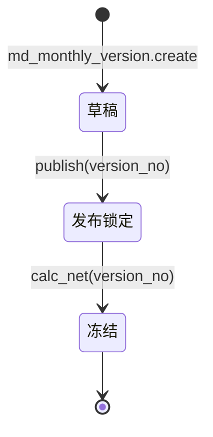

# 毛需求与净需求 · 应用详设

> 应用名：`demand` | 类名：`Demand` | 聚合根：毛需求与净需求
> 输入来源：`app/psc/architecture.md` 聚合根卡 #11 + `app/psc/brd/05-毛需求发布和净需求运算.md`（§5.1~§5.5）+ `app/psc/brd/08-管理系统设计实现.md`（§8.6）
> 数据来源类型：手工参考创建（基于销售预测汇总 + 库存策略水位，前端保留"发布"入口，标注上游来源）

---

## 1. 需求概览

### 1.1 基本信息
- **需求名称**: 毛需求与净需求运算
- **需求编号**: REQ-PSC-DMD-001
- **所属模块**: 产销协同-毛需求与净需求运算
- **需求来源**: 业务方（计划）
- **创建日期**: 2026-08-14
- **优先级**: P0

### 1.2 需求背景
#### 1.2.1 为什么需要这个需求？

销售预测（第 3 章）给出了客户需求，库存策略（第 4 章）给出了库存目标水位，但二者尚未合并为可供生产的正式需求；且已有库存、在途工单已覆盖其中一部分。若直接用毛需求驱动生产，会漏扣库存、在途，导致多下单/重复下单。

#### 1.2.2 期望达到什么目标？

把销售预测与库存策略合并为毛需求并发布冻结，再叠加未发订单、扣减当前库存与在途工单，运算出净需求——净需求才是驱动生产的真正数量，经产能平衡后成为主计划。

### 1.3 需求范围
#### 1.3.1 包含哪些功能？

合成毛需求（build_gross）、发布冻结毛需求（publish）、净需求运算（calc_net）、毛需求/净需求查询（get/list）、净需求导出（export_net）

#### 1.3.2 不包含哪些功能？

- 不做产能平衡（产能约束、优先级排序、产线排程在线下完成，结果作为主计划导回，见 §5.5）
- 不做主计划维护（属于 `master_plan` 聚合根）
- 不做销售预测/库存策略本身的计算（属于 `sales_forecast` / `inventory_strategy` 聚合根）
- 不做 ERP 库存/在途/未发数据同步（经 `_load_*` 适配器只读引用）

> **数据来源类型**: 手工参考创建 —— 毛需求基于上游 `sales_forecast`（销售预测汇总）与 `inventory_strategy`（库存策略水位）的结果，由用户**手工决定何时发布**。前端保留"发布"入口，创建表单须展示上游数据摘要（最终预测量、三层水位）以供确认，并标注上游来源。US/FUNC 清单中不包含 `create` 功能的用户故事（发布动作即 `publish`）。

### 1.4 涉及角色
**谁会使用这个功能？**

- **计划**: 合成并发布毛需求、运算净需求、查看/导出净需求供线下产能平衡

---

## 2. 用户故事

### 2.1 核心用户故事

#### 2.1.1 `US-01` 用户故事 — 合成毛需求 build_gross（优先级：P1）

- **故事描述**: 作为计划，我想要按月度版本合成毛需求（合并加工 + 叠加库存策略），以便于得到每个物料的正式总需求
- **为何赋予此优先级**：毛需求是净需求运算的需求侧输入，合成是发布/运算的前置，缺此则全链无法推进
- **独立测试**：可通过对某一草稿状态月度版本执行合成，验证每个物料按 N+1/N+2/N+3 拆分出 `forecast_qty`、期末 N+3 叠加 `inventory_qty`、`gross_qty = forecast_qty + inventory_qty` 来独立测试
- **前置条件**: 该月度版本已存在（`md_monthly_version`），且 `sales_forecast` 已产出最终预测量汇总、`inventory_strategy` 已算出三层水位
- **后置条件**: 生成该版本下每个物料的毛需求记录（标识 `version_no + material_no + rolling_month`）

**验收场景**：

1. `US-01-AC1` **场景**: 正常合成毛需求
   - **Given** 版本 202608 为草稿态，物料 M1 的 sales_forecast 汇总为 N+1=100 / N+2=80 / N+3=60，库存策略目标水位 = 30，**When** 执行 build_gross(202608)，**Then** M1 生成三行：N+1 `forecast_qty=100, gross_qty=100`；N+2 `forecast_qty=80, gross_qty=80`；N+3 `forecast_qty=60, inventory_qty=30, gross_qty=90`

> **口径调整（2026-08，优先于 US-01-AC1/AC2）**：经业务确认，**每个滚动月度**毛需求 = 销售预测 + 库存策略水位（min+safety+batch），即 N+1/N+2/N+3 同口径叠加水位，不再"只加期末 N+3"。
> **净需求口径（同期确认）**：**近期净额、远期毛额**——N+1 净 = 毛 + 未发 − 库存 − 在途（当前已知，≥0）；N+2/N+3 库存/在途未知且当前库存已被近期预留，不扣减，净 = 毛（远期按毛额，留给滚动周期再净额）。

2. `US-01-AC2` **场景**: 库存策略目标水位只加期末 N+3 不逐期分摊
   - **Given** 物料 M1 库存策略目标水位 = 30，**When** 执行 build_gross，**Then** N+1/N+2 行 `inventory_qty=0`，仅 N+3 行 `inventory_qty=30`（总量口径，不逐期分摊）

3. `US-01-AC3` **场景**: 版本不存在或已发布被拒绝
   - **Given** 版本 202608 不存在或 `lock_status` 已非草稿，**When** 执行 build_gross(202608)，**Then** 系统拒绝并提示"版本不存在"或"版本已发布，不可合成"

---

#### 2.1.2 `US-02` 用户故事 — 发布冻结毛需求 publish（优先级：P1）

- **故事描述**: 作为计划，我想要发布并冻结毛需求，以便于将其锁定为净需求运算的唯一需求输入
- **为何赋予此优先级**：发布冻结是需求侧定型的关键动作，不冻结则毛需求可被篡改、净需求无稳定输入
- **独立测试**：可通过对草稿版本执行发布，验证毛需求冻结不可改、且联动 `md_monthly_version` 状态草稿→发布来独立测试
- **前置条件**: 该版本毛需求已合成（build_gross 已执行），月度版本处于草稿态
- **后置条件**: 毛需求冻结不可改，`md_monthly_version.lock_status` 由草稿流转为发布（锁定）

**验收场景**：

1. `US-02-AC1` **场景**: 正常发布冻结
   - **Given** 版本 202608 毛需求已合成、版本草稿态，**When** 执行 publish(202608)，**Then** 发布成功，`md_monthly_version.lock_status` 变为发布（锁定），毛需求行禁止再改

2. `US-02-AC2` **场景**: 未合成即发布被拒绝
   - **Given** 版本 202608 尚未 build_gross，**When** 执行 publish(202608)，**Then** 系统拒绝并提示"毛需求未合成，请先执行合成"

3. `US-02-AC3` **场景**: 已发布版本重复发布被拒绝
   - **Given** 版本 202608 已处于发布（锁定）态，**When** 再次执行 publish(202608)，**Then** 系统拒绝并提示"版本已发布，不可重复发布"

---

#### 2.1.3 `US-03` 用户故事 — 净需求运算 calc_net（优先级：P1）

- **故事描述**: 作为计划，我想要运算净需求，以便于得到扣除已有库存/在途后真正需要生产的数量
- **为何赋予此优先级**：净需求是驱动生产的最终数量，是全链核心产出
- **独立测试**：可对已发布版本执行运算，验证 `net_qty = gross_qty + open_order − onhand − in_transit` 且各层非负、并联动版本冻结来独立测试
- **前置条件**: 该版本毛需求已发布冻结，ERP 执行数据（未发订单/当前库存/在途工单）经适配器可取到
- **后置条件**: 生成净需求值，`md_monthly_version.lock_status` 由发布流转为冻结

**验收场景**：

1. `US-03-AC1` **场景**: 正常运算净需求
   - **Given** M1 N+3 行 `gross_qty=90`、未发订单=10、当前库存=40、在途=15，**When** 执行 calc_net(202608)，**Then** `net_qty = 90 + 10 − 40 − 15 = 45`

2. `US-03-AC2` **场景**: 净需求各层非负
   - **Given** M1 行 `gross_qty=90`、未发=10、库存=120、在途=0，**When** 执行 calc_net，**Then** 公式结果为 −20，系统置 `net_qty=0`（已被库存覆盖，无需生产）

3. `US-03-AC3` **场景**: 未发布即运算被拒绝
   - **Given** 版本 202608 毛需求仍为草稿态，**When** 执行 calc_net(202608)，**Then** 系统拒绝并提示"毛需求未发布冻结，不可运算净需求"

---

#### 2.1.4 `US-04` 用户故事 — 查看毛需求/净需求列表 list（优先级：P2）

- **故事描述**: 作为计划，我想要按版本/物料/滚动月度筛选查看毛需求与净需求列表，以便于核对需求结果
- **为何赋予此优先级**：查询是核对与导出的前置操作，属日常基础浏览
- **独立测试**：可进入需求列表页，按版本/物料筛选并验证结果来独立测试
- **前置条件**: 系统中已存在毛需求/净需求记录
- **后置条件**: 返回符合条件的分页列表

**验收场景**：

1. `US-04-AC1` **场景**: 按版本筛选
   - **Given** 存在版本 202608 与 202607 的需求记录，**When** 筛选 version_no=202608 查询，**Then** 仅展示 202608 版本记录

2. `US-04-AC2` **场景**: 按物料筛选
   - **Given** 存在多个物料记录，**When** 筛选 material_no=M1，**Then** 仅展示 M1 的三行（N+1/N+2/N+3）

---

#### 2.1.5 `US-05` 用户故事 — 查看毛需求/净需求详情 get（优先级：P2）

- **故事描述**: 作为计划，我想要按版本+物料+滚动月度查看单条毛需求/净需求详情，以便于核对逐项数值（各层拆解）
- **为何赋予此优先级**：详情展示是分层拆解（毛需求/未发/库存/在途）核对的手段
- **独立测试**：可通过 get(version_no, material_no, rolling_month) 取单行并核对各层字段来独立测试
- **前置条件**: 目标行已存在
- **后置条件**: 返回该行全部字段（含 forecast/inventory/gross/open_order/onhand/in_transit/net 分层拆解）

**验收场景**：

1. `US-05-AC1` **场景**: 按主键取详情
   - **Given** 存在行 (202608, M1, N+3)，**When** 执行 get(202608, M1, N+3)，**Then** 返回该行完整字段

2. `US-05-AC2` **场景**: 取不存在的行被拒绝
   - **Given** 不存在行 (202608, M1, N+1)，**When** 执行 get，**Then** 返回"记录不存在"

---

#### 2.1.6 `US-06` 用户故事 — 导出净需求 export_net（优先级：P2）

- **故事描述**: 作为计划，我想要导出某版本的净需求结果，以便于交给线下产能平衡
- **为何赋予此优先级**：净需求导出是产能平衡（线下）的输入，是主计划导回的前置
- **独立测试**：可对已运算版本执行导出，验证生成完整净需求清单来独立测试
- **前置条件**: 该版本净需求已运算（calc_net 已执行）
- **后置条件**: 导出该版本所有物料×滚动月度的净需求明细（供线下产能平衡）

**验收场景**：

1. `US-06-AC1` **场景**: 正常导出净需求
   - **Given** 版本 202608 已完成 calc_net，**When** 执行 export_net(202608)，**Then** 返回该版本全部物料净需求清单（物料号/滚动月度/net_qty）

2. `US-06-AC2` **场景**: 未运算即导出被拒绝
   - **Given** 版本 202608 尚未 calc_net，**When** 执行 export_net(202608)，**Then** 系统拒绝并提示"净需求未运算"

---

## 3. 业务场景

### 3.1 业务流程描述

#### 3.1.1 场景1: 合成并发布毛需求
1. 计划进入"毛需求发布"页面，选择月度版本（草稿态）
2. 系统展示该版本的上游数据摘要：`sales_forecast` 最终预测量汇总、`inventory_strategy` 三层水位（标注上游来源）
3. 计划点击"合成毛需求"
4. 系统执行合并加工（通用件合并 / 替换件合并 / 断点处理）并叠加库存策略
5. 系统生成每个物料的毛需求（按 N+1/N+2/N+3 拆分，库存策略加在期末 N+3）
6. 计划核对无误后点击"发布"
7. 系统冻结毛需求并联动 `md_monthly_version` 状态草稿→发布（锁定）

#### 3.1.2 场景2: 运算并导出净需求
1. 计划进入"净需求运算"页面，选择已发布版本
2. 系统经 ERP 适配器取该版本的未发订单/当前库存/在途工单
3. 计划点击"运算净需求"
4. 系统按 `毛需求 + 未发 − 库存 − 在途` 逐行运算，各层非负
5. 系统联动 `md_monthly_version` 状态发布→冻结
6. 计划点击"导出净需求"
7. 系统导出净需求清单，交由线下产能平衡（结果导回 `master_plan`）

### 3.2 业务规则

#### 3.2.1 `BR-01` 毛需求合成公式
- **规则描述**: 毛需求 = 销售预测 + 库存策略，即 `gross_qty = forecast_qty + inventory_qty`
- **适用场景**: build_gross 合成毛需求
- **计算方式**: `forecast_qty` 取自 `sales_forecast.get_summary` 的最终预测量汇总；`inventory_qty` 取自 `inventory_strategy.get_water_level` 的三层目标水位（最低 A + 安全 C + 组批 B）
- **示例**: 某物料 N+3 销售预测 60、库存策略目标水位 30，则毛需求 = 60 + 30 = 90

#### 3.2.2 `BR-02` 库存策略叠加口径
- **规则描述**: 库存策略目标水位是"期末目标"，按**总量口径**加在期末 N+3，**不逐期分摊**
- **适用场景**: build_gross 叠加库存策略
- **示例**: 目标水位 30 只加在 N+3 行；N+1/N+2 行 `inventory_qty = 0`

#### 3.2.3 `BR-03` 销售预测拆分口径
- **规则描述**: 销售预测按 N+1/N+2/N+3 **逐期拆分**进入各滚动月度行
- **适用场景**: build_gross 合成毛需求
- **示例**: 某物料汇总为 N+1=100 / N+2=80 / N+3=60，则三行 forecast_qty 分别为 100/80/60

#### 3.2.4 `BR-04` 净需求运算公式
- **规则描述**: 净需求 = 毛需求 + 未发订单 − 当前库存 − 在途工单，即 `net_qty = gross_qty + open_order_qty − onhand_qty − in_transit_qty`
- **适用场景**: calc_net 运算净需求
- **计算方式**: 展开即 `净需求 = （销售预测 + 库存策略）+ 未发订单 − 当前库存 − 在途工单`
- **示例**: gross=90、未发=10、库存=40、在途=15，则净需求 = 90 + 10 − 40 − 15 = 45

#### 3.2.5 `BR-05` 净需求是毛需求的强一致函数
- **规则描述**: 净需求是毛需求的强一致函数（`net = f(gross)`），二者同属一个版本、须同聚合、同事务运算；毛需求一旦发布冻结即为净需求运算的唯一需求输入，禁止独立编辑净需求总量
- **适用场景**: publish / calc_net 全程
- **示例**: 修改毛需求后净需求须随之重算，二者不允许版本错位

#### 3.2.6 `BR-06` 当前库存扣减口径
- **规则描述**: 当前库存 = 自有仓 + 寄售仓；寄售库存仍是我方资产，**必须扣减**
- **适用场景**: calc_net 扣减库存
- **示例**: 自有仓 30 + 寄售仓 10 = 当前库存 40，均须从毛需求中扣减

#### 3.2.7 `BR-07` 在途工单扣减（防重复下单）
- **规则描述**: 在途工单（在制/在途）须从毛需求中扣减；漏扣在途会导致重复下单
- **适用场景**: calc_net 扣减在途
- **示例**: 已下达在制工单 15 件，须扣减，否则会再排产 15 件造成重复

#### 3.2.8 `BR-08` 净需求各层非负
- **规则描述**: 净需求运算支持分层拆解（毛需求/未发/库存/在途逐层展示），且各层结果非负；`net_qty` 公式结果为负时置 0（已被现有库存/在途覆盖，无需生产）
- **适用场景**: calc_net 运算
- **示例**: gross=90、未发=10、库存=120、在途=0，净需求 = −20 → 置 0

#### 3.2.9 `BR-09` 毛需求合并加工
- **规则描述**: 发布前完成零件级合并加工：通用件合并（同一物料被多客户使用，基于 `sales_forecast` 物料×客户维度识别后合并到物料级）、替换件合并（按 `md_part_replace` 原件→替换件关系合并）、断点处理（按 `md_breakpoint` 切换时间处理新旧件需求归属）
- **适用场景**: build_gross 合并加工
- **示例**: 物料 M_old 存在替换件 M_new，则 M_old 的毛需求合并入 M_new

#### 3.2.10 `BR-10` 发布冻结
- **规则描述**: 毛需求发布后冻结，作为净需求运算的唯一需求输入（不可改）；发布联动 `md_monthly_version` 状态机：`草稿 → 发布（锁定）→ 冻结`（草稿期可编辑预测，发布后锁定不可改，净需求运算后冻结）
- **适用场景**: publish / calc_net
- **示例**: 版本 202608 发布后，任何对毛需求行的修改被拒绝；calc_net 后版本冻结

#### 3.2.11 `BR-11` 标识唯一性
- **规则描述**: 需求行标识 `version_no + material_no + rolling_month` 唯一，同一版本同一物料同一滚动月度仅一条记录
- **适用场景**: build_gross（幂等重算更新，不重复插入）
- **示例**: 版本 202608 物料 M1 的 N+1 行唯一，重复合成时更新该行而非新增

#### 3.2.12 `BR-12` 主数据引用铁律
- **规则描述**: `material_no` 引用主数据应用 `md_material`（物料主数据），禁止手工录入；`version_no` 引用 `md_monthly_version`
- **适用场景**: 全部功能
- **示例**: 需求行的 material_no 必须为 `md_material` 中已存在的物料号，来源标注"来源：md_material.list 下拉选择"

### 3.3 业务数据

#### 3.3.1 数据1: 销售预测 forecast_qty
- **数据描述**: 第 3 章产出的最终预测量（客户需求），按 N+1/N+2/N+3 逐期拆分
- **数据类型**: 数字（数量）
- **数据来源**: `sales_forecast.get_summary(version_no)`
- **示例值**: 100 / 80 / 60

#### 3.3.2 数据2: 库存策略 inventory_qty
- **数据描述**: 三层目标水位（最低 A + 安全 C + 组批 B），期末 N+3 不逐期分摊
- **数据类型**: 数字（数量）
- **数据来源**: `inventory_strategy.get_water_level(version_no, material_no)`
- **示例值**: 30

#### 3.3.3 数据3: 毛需求 gross_qty
- **数据描述**: 销售预测 + 库存策略，代表该物料未来各期需满足的全部需求
- **数据类型**: 数字（数量）
- **数据来源**: 系统计算 `forecast_qty + inventory_qty`
- **示例值**: 90

#### 3.3.4 数据4: 未发订单 open_order_qty
- **数据描述**: 已接收未发运的订单/调拨单，承接当前月及近端实际需求
- **数据类型**: 数字（数量）
- **数据来源**: ERP 销售/订单模块，经 `_load_open_order` 适配器
- **示例值**: 10

#### 3.3.5 数据5: 当前库存 onhand_qty
- **数据描述**: 自有仓 + 寄售仓（寄售仍我方资产须扣减）
- **数据类型**: 数字（数量）
- **数据来源**: ERP 库存模块，经 `_load_inventory` 适配器
- **示例值**: 40

#### 3.3.6 数据6: 在途工单 in_transit_qty
- **数据描述**: 在制/在途数量，防重复下单
- **数据类型**: 数字（数量）
- **数据来源**: ERP 生产/采购模块，经 `_load_in_transit` 适配器
- **示例值**: 15

#### 3.3.7 数据7: 净需求 net_qty
- **数据描述**: 真正驱动生产的数量
- **数据类型**: 数字（数量）
- **数据来源**: 系统计算 `gross_qty + open_order_qty − onhand_qty − in_transit_qty`（各层非负）
- **示例值**: 45

### 3.4 状态机

本聚合无独立状态列，**随 `md_monthly_version.lock_status` 流转**：



| 当前状态 | 目标状态 | 触发动作 | 前置条件 |
|----------|----------|----------|----------|
| 草稿 | 发布（锁定） | publish(version_no) | 毛需求已合成（build_gross 已执行） |
| 发布（锁定） | 冻结 | calc_net(version_no) | 毛需求已发布，ERP 执行数据可取到 |

> 草稿期可编辑预测并重新合成；发布后毛需求锁定不可改；冻结后净需求定型，供导出与主计划。

---

## 4. 功能描述

### 4.1 功能清单

| 一级菜单/模块 | 一级编号 | 二级菜单/模块 | 二级编号 | 三级功能 | 三级编号 | 功能类型 | 优先级 | 三级功能简述 |
|---|---|---|---|---|---|---|---|---|
| 毛需求与净需求 | F01 | 毛需求发布 | F01-01 | 合成毛需求 | FUNC-01 | 接口（事务后端） | P1 | 合并加工 + 叠加库存策略，生成毛需求 |
| 毛需求与净需求 | F01 | 毛需求发布 | F01-01 | 发布冻结毛需求 | FUNC-02 | 接口（事务后端） | P1 | 冻结毛需求并联动月度版本发布 |
| 毛需求与净需求 | F01 | 净需求运算 | F01-02 | 净需求运算 | FUNC-03 | 接口（事务后端） | P1 | 叠加未发、扣减库存与在途，运算净需求 |
| 毛需求与净需求 | F01 | 需求查询 | F01-03 | 毛需求/净需求列表查询 | FUNC-04 | 列表页 | P2 | 按版本/物料/滚动月度筛选查看 |
| 毛需求与净需求 | F01 | 需求查询 | F01-03 | 毛需求/净需求详情查询 | FUNC-05 | 详情页 | P2 | 查看单行各层拆解数值 |
| 毛需求与净需求 | F01 | 净需求运算 | F01-02 | 净需求导出 | FUNC-06 | 报表/接口 | P2 | 导出净需求供线下产能平衡 |

### 4.2 功能模块结构图
```
毛需求与净需求 F01
├── 毛需求发布 F01-01
│   ├── FUNC-01 合成毛需求（接口，P1）
│   └── FUNC-02 发布冻结毛需求（接口，P1）
├── 净需求运算 F01-02
│   ├── FUNC-03 净需求运算（接口，P1）
│   └── FUNC-06 净需求导出（报表/接口，P2）
└── 需求查询 F01-03
    ├── FUNC-04 毛需求/净需求列表查询（列表页，P2）
    └── FUNC-05 毛需求/净需求详情查询（详情页，P2）
```

### 4.3 功能详细说明

#### 4.3.1 F01-01 毛需求发布

##### 4.3.1.1 FUNC-01 合成毛需求（build_gross）

**功能描述**:
按月度版本合成毛需求：先做零件级合并加工（通用件合并/替换件合并/断点处理），再叠加库存策略三层目标水位。产出每个物料按 N+1/N+2/N+3 拆分的毛需求行。此为手工参考创建——前端保留"发布"入口，创建表单展示上游数据摘要。

**用户操作流程**:
1. 计划进入"毛需求发布"页面，选择月度版本（草稿态）
2. 系统展示上游数据摘要：`sales_forecast` 最终预测量汇总、`inventory_strategy` 三层水位（标注来源）
3. 计划点击"合成毛需求"
4. 系统执行合并加工：通用件合并（物料×客户维度识别）、替换件合并（md_part_replace）、断点处理（md_breakpoint）
5. 系统叠加库存策略目标水位到期末 N+3
6. 系统生成毛需求行（幂等：重复合成更新已有行）

**输入数据**:
- version_no: 月度版本号 - 必填，YYYYMM - 示例：202608
- 上游数据（自动取数，非手工录入）: sales_forecast 最终预测量汇总、inventory_strategy 三层水位

**输出数据**:
- 毛需求行集合: { version_no, material_no, rolling_month, forecast_qty, inventory_qty, gross_qty }
- 成功消息: "毛需求合成成功，共 N 个物料"
- 错误消息: "版本不存在" / "版本已发布，不可合成"

**业务规则**:
- BR-01: gross_qty = forecast_qty + inventory_qty
- BR-02: inventory_qty 只加期末 N+3，不逐期分摊
- BR-03: forecast_qty 按 N+1/N+2/N+3 逐期拆分
- BR-09: 合并加工（通用件/替换件/断点）
- BR-11: 标识 version_no + material_no + rolling_month 唯一（幂等重算更新）
- BR-12: material_no 引用 md_material

**特殊处理**:
- **通用件合并**: 同一物料被多客户使用（`sales_forecast` 处理表物料×客户维度识别），其各客户最终预测量已在汇总表按物料合计，`sales_forecast.get_summary` 返回物料级合计即完成通用件合并
- **替换件合并**: 存在 `md_part_replace` 关系（原件→替换件）时，将原物料毛需求合并到替换物料（调用 `md_part_replace.list`）
- **断点处理**: 存在 `md_breakpoint` 断点关系（旧件→新件，切换时间）时，切换后需求归属新物料（调用 `md_breakpoint.list`）
- 替换件/断点的精确转移口径（全额转移 vs 按切换时间分段）BRD 未明确，标记**待确认**

**业务实体**:
- **Demand（毛需求与净需求）**: 每个物料在各滚动月度的需求，标识为 version_no + material_no + rolling_month

**Demand 字段**

| 字段名称 | 字段类型 | 是否必填 | 默认值 | 业务逻辑 |
|---|---|---|---|---|
| version_no | 文本 | 是 | - | 月度版本号 YYYYMM，来源：md_monthly_version.list 下拉选择 |
| material_no | 文本 | 是 | - | 物料号，来源：md_material.list 下拉选择（主数据引用铁律） |
| rolling_month | 枚举值 | 是 | - | N+1 / N+2 / N+3 |
| forecast_qty | 数字 | 是 | 0 | 销售预测最终预测量，来源：sales_forecast.get_summary，逐期拆分 |
| inventory_qty | 数字 | 是 | 0 | 库存策略目标水位（A+C+B），只加期末 N+3，来源：inventory_strategy.get_water_level |
| gross_qty | 数字 | 是 | - | = forecast_qty + inventory_qty，系统计算禁止手工改 |
| open_order_qty | 数字 | 否 | 0 | 未发订单，来源：_load_open_order 适配器 |
| onhand_qty | 数字 | 否 | 0 | 当前库存（自有仓+寄售仓），来源：_load_inventory 适配器 |
| in_transit_qty | 数字 | 否 | 0 | 在途工单（在制/在途），来源：_load_in_transit 适配器 |
| net_qty | 数字 | 否 | 0 | = gross_qty + open_order − onhand − in_transit，各层非负，系统计算禁止手工改 |

---

##### 4.3.1.2 FUNC-02 发布冻结毛需求（publish）

**功能描述**:
将已合成的毛需求发布并冻结，作为净需求运算的唯一需求输入，同时联动 `md_monthly_version` 状态草稿→发布（锁定）。

**用户操作流程**:
1. 计划在"毛需求发布"页面核对毛需求
2. 计划点击"发布"
3. 系统校验毛需求已合成
4. 系统冻结毛需求（禁止修改）
5. 系统调用 `md_monthly_version.publish(version_no)` 锁定版本
6. 发布成功提示

**输入数据**:
- version_no: 月度版本号 - 必填，YYYYMM - 示例：202608

**输出数据**:
- 成功消息: "毛需求发布成功"
- 错误消息: "毛需求未合成，请先执行合成" / "版本已发布，不可重复发布"

**业务规则**:
- BR-10: 发布后冻结，作为净需求唯一输入（不可改）
- BR-11: 版本唯一性校验

**特殊处理**:
- 跨应用调用 `md_monthly_version.publish(version_no)` 联动版本锁定
- 发布后任何对毛需求行的修改被拒绝（`raise FdeError`）

**业务实体**:
- **Demand**: 同 FUNC-01（字段表见 FUNC-01）

---

#### 4.3.2 F01-02 净需求运算

##### 4.3.2.1 FUNC-03 净需求运算（calc_net）

**功能描述**:
对已发布版本运算净需求：叠加未发订单、扣减当前库存与在途工单，输出各层非负的净需求，并联动 `md_monthly_version` 状态发布→冻结。

**用户操作流程**:
1. 计划进入"净需求运算"页面，选择已发布版本
2. 系统经 ERP 适配器取未发订单/当前库存/在途工单
3. 计划点击"运算净需求"
4. 系统逐行按 `net_qty = gross_qty + open_order − onhand − in_transit` 运算，各层非负
5. 系统调用 `md_monthly_version.freeze(version_no)` 冻结版本
6. 运算完成提示

**输入数据**:
- version_no: 月度版本号 - 必填，YYYYMM - 示例：202608
- ERP 执行数据（自动取数）: open_order_qty / onhand_qty / in_transit_qty

**输出数据**:
- 净需求行集合: { version_no, material_no, rolling_month, net_qty }
- 成功消息: "净需求运算成功"

**业务规则**:
- BR-04: net_qty = gross_qty + open_order − onhand − in_transit
- BR-05: 净需求是毛需求的强一致函数
- BR-06: 当前库存含寄售仓，必须扣减
- BR-07: 在途工单必须扣减（防重复下单）
- BR-08: 各层非负（负数置 0）

**特殊处理**:
- 跨应用调用 `md_monthly_version.freeze(version_no)` 冻结版本
- ERP 适配器取数（`_load_open_order` / `_load_inventory` / `_load_in_transit`）
- 分层拆解展示：逐层展示毛需求/未发/库存/在途，各层非负

**业务实体**:
- **Demand**: 同 FUNC-01（字段表见 FUNC-01）

---

##### 4.3.2.2 FUNC-06 净需求导出（export_net）

**功能描述**:
导出某版本的净需求清单，供线下产能平衡使用（结果导回 `master_plan`）。

**用户操作流程**:
1. 计划在"净需求运算"页面点击"导出净需求"
2. 系统校验该版本净需求已运算
3. 系统生成净需求清单（物料号/滚动月度/net_qty）
4. 导出文件供线下产能平衡

**输入数据**:
- version_no: 月度版本号 - 必填，YYYYMM - 示例：202608

**输出数据**:
- 净需求清单: { version_no, material_no, rolling_month, net_qty } 全量明细

**业务规则**:
- BR-05: 净需求是毛需求强一致函数（导出值即运算值）
- BR-08: 各层非负

**特殊处理**:
- 导出结果供 `master_plan.import_plan` 前调用（线下产能平衡输入）
- 未运算版本导出被拒绝

**业务实体**:
- **Demand**: 同 FUNC-01（字段表见 FUNC-01）

---

#### 4.3.3 F01-03 需求查询

##### 4.3.3.1 FUNC-04 毛需求/净需求列表查询（list）

**功能描述**:
提供毛需求/净需求分页列表，支持按版本、物料、滚动月度筛选。

**用户操作流程**:
1. 计划进入"需求查询"列表页
2. 计划填写筛选条件（version_no / material_no / rolling_month，均可选）
3. 计划点击"查询"
4. 系统返回符合条件的分页列表

**输入数据**:
- version_no: 月度版本号 - 选填，精确匹配 - 示例：202608
- material_no: 物料号 - 选填，精确/模糊匹配 - 示例：M1
- rolling_month: 滚动月度 - 选填，精确匹配 - 示例：N+3
- page: 页码 - 默认 1
- size: 每页条数 - 默认 20

**输出数据**:
- 列表字段: version_no, material_no, rolling_month, forecast_qty, inventory_qty, gross_qty, net_qty
- 分页信息: total, page, size

**业务规则**:
- 筛选条件均为可选，条件之间 AND 关系

**特殊处理**:
- 默认按 version_no + material_no + rolling_month 排序

**业务实体**:
- **Demand**: 同 FUNC-01

---

##### 4.3.3.2 FUNC-05 毛需求/净需求详情查询（get）

**功能描述**:
按 `version_no + material_no + rolling_month` 取单条需求详情，展示分层拆解数值。

**用户操作流程**:
1. 计划在列表页点击目标行
2. 系统返回该行全部字段（含 forecast/inventory/gross/open_order/onhand/in_transit/net 分层拆解）

**输入数据**:
- version_no: 月度版本号 - 必填
- material_no: 物料号 - 必填
- rolling_month: 滚动月度 - 必填

**输出数据**:
- 详情字段: 全部 Demand 字段（分层拆解展示）

**业务规则**:
- BR-11: 按标识 version_no + material_no + rolling_month 定位

**特殊处理**:
- 行不存在返回"记录不存在"

**业务实体**:
- **Demand**: 同 FUNC-01

---

## 5. 权限要求

### 5.1 功能权限

| 功能名称 | 权限标识 | 计划 |
|---|---|---|
| 合成毛需求 | `demand:gross:build` | 可访问 |
| 发布冻结毛需求 | `demand:gross:publish` | 可访问 |
| 净需求运算 | `demand:net:calc` | 可访问 |
| 毛需求/净需求列表查询 | `demand:demand:query` | 可访问 |
| 毛需求/净需求详情查询 | `demand:demand:query` | 可访问 |
| 净需求导出 | `demand:net:export` | 可访问 |

> 每行对应需求分析阶段一个权限 ID：PERM-01 `demand:gross:build`、PERM-02 `demand:gross:publish`、PERM-03 `demand:net:calc`、PERM-04 `demand:demand:query`（列表+详情共用）、PERM-05 `demand:net:export`。

### 5.2 数据权限
#### 5.2.1 角色: 计划
- 可查看和操作所有版本、所有物料的毛需求与净需求数据（无物料级数据隔离）
- 可执行合成、发布、运算、导出全流程

---

## 6. 验收标准

### 6.1 功能验收标准

#### 6.1.1 标准1: 毛需求合成正确
- **关联用户故事**: US-01
- **关联业务规则**: BR-01, BR-02, BR-03, BR-11
- **验证方式**: 对草稿版本执行 build_gross，核对各期 forecast_qty/inventory_qty/gross_qty
- **测试数据**: M1 汇总 N+1=100/N+2=80/N+3=60，库存策略目标水位 30
- **预期结果**: 生成三行，仅 N+3 行 inventory_qty=30、gross_qty=90；N+1/N+2 行 gross_qty=100/80

#### 6.1.2 标准2: 净需求公式与非负
- **关联用户故事**: US-03
- **关联业务规则**: BR-04, BR-06, BR-07, BR-08
- **验证方式**: 对已发布版本执行 calc_net，核对 net_qty 及负数截断
- **测试数据**: 行 gross=90/未发=10/库存=40/在途=15（net=45）；行 gross=90/未发=10/库存=120/在途=0（net 应截断为 0）
- **预期结果**: 第一行 net=45，第二行 net=0

#### 6.1.3 标准3: 发布冻结与状态流转
- **关联用户故事**: US-02, US-03
- **关联业务规则**: BR-05, BR-10
- **验证方式**: 依次执行 build_gross → publish → calc_net，观察 md_monthly_version.lock_status
- **测试数据**: 版本 202608
- **预期结果**: 状态依次流转 草稿 → 发布（锁定）→ 冻结，发布后毛需求修改被拒绝

#### 6.1.4 标准4: 查询与导出
- **关联用户故事**: US-04, US-05, US-06
- **关联业务规则**: BR-11
- **验证方式**: list 按版本/物料筛选、get 取单行、export_net 导出整版本
- **测试数据**: 版本 202608（已完成 calc_net）
- **预期结果**: 列表筛选正确、详情分层拆解完整、导出净需求清单齐全

### 6.2 非功能验收标准
**性能要求**: 列表查询（5000 行以内）页面加载时间 < 2 秒；整版本净需求运算 < 5 秒（单版本物料数 ≤ 1000）
**安全性要求**: 毛需求发布后冻结不可改，净需求总量禁止手工改
**兼容性要求**: 支持 Chrome、Edge 浏览器

### 6.3 已知问题或限制
- 替换件/断点合并的精确转移口径（全额转移 vs 按切换时间分段）BRD 未明确，待业务方确认（对应 architecture.md Q2）
- 毛需求与净需求是否拆两个应用待确认（architecture.md Q4，当前暂合并为 `demand`）
- ERP 库存/在途/未发数据的时效与准确性是净需求前提，漏扣库存→多下单、漏扣在途→重复下单；数据缺失时 net_qty 会系统性算错

---

## 7. 参考资料

### 7.1 相关文档
- `app/psc/architecture.md` - 聚合根卡 #11 毛需求与净需求（demand）
- `app/psc/brd/05-毛需求发布和净需求运算.md` - §5.1 构成 / §5.2 发布 / §5.3 净需求 / §5.4 依赖 ERP / §5.5 主计划
- `app/psc/brd/08-管理系统设计实现.md` - §8.6 关键实现要点（净需求运算引擎、各层非负）

### 7.2 相关功能
- `sales_forecast` - 销售预测：提供最终预测量汇总（get_summary），通用件识别依据（物料×客户维度）
- `inventory_strategy` - 库存策略：提供三层目标水位（get_water_level）
- `master_plan` - 主计划：净需求导出后经线下产能平衡导回
- `inventory_projection` - 库存推移表：期间内时点缺货由推移表逐期前推捕获
- `md_monthly_version` - 月度版本：版本节奏载体与状态机
- `md_material` - 物料主数据：material_no 来源
- `md_part_replace` - 替换关系：替换件合并
- `md_breakpoint` - 断点基础数据：断点处理

### 7.3 外部依赖
- `sales_forecast` - build_gross 调用 `get_summary(version_no)` 取最终预测量汇总（含通用件识别）
- `inventory_strategy` - build_gross 调用 `get_water_level(version_no, material_no)` 取三层目标水位
- `md_part_replace` - build_gross 调用 `list(...)` 替换件合并
- `md_breakpoint` - build_gross 调用 `list(...)` 断点处理
- `md_monthly_version` - publish 调用 `publish(version_no)`、calc_net 调用 `freeze(version_no)`
- `md_material` - material_no 主数据引用校验
- `_load_open_order` - ERP 适配器（未发订单，已接收未发运）
- `_load_inventory` - ERP 适配器（当前库存，自有仓+寄售仓）
- `_load_in_transit` - ERP 适配器（在途工单，在制/在途）

### 7.4 备注
- 本应用数据来源类型为"手工参考创建"，前端保留"发布"入口，创建表单展示上游数据摘要（最终预测量、三层水位）并标注来源，不包含 `create` 用户故事
- 净需求是毛需求的强一致函数，二者同聚合、同事务（architecture.md D3）
- 状态机随 `md_monthly_version` 流转，本聚合无独立状态列
