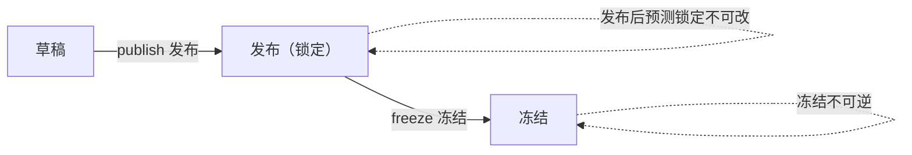

# 月度版本主数据 · 应用详设

> 应用名：`md_monthly_version` | 类名：`MdMonthlyVersion` | 聚合根：月度版本
> 输入来源：`app/psc/architecture.md` 聚合根卡 #7 + `app/psc/brd/03-销售预测.md` §3.9 + `app/psc/brd/05-毛需求发布和净需求运算.md` §5.2 + `app/psc/brd/08-管理系统设计实现.md` §8.4.1
> 数据来源类型：独立创建（本系统定义，非外部冗余）

---

## 1. 需求概览

### 1.1 基本信息
- **需求名称**: 月度版本主数据管理
- **需求编号**: REQ-PSC-MDV-001
- **所属模块**: 产销协同-主数据层
- **需求来源**: 业务方（计划）
- **创建日期**: 2026-08-14
- **优先级**: P0

### 1.2 需求背景
#### 1.2.1 为什么需要这个需求？
月度版本是产销协同体系的「计划周期节奏载体」：销售预测、库存策略、毛需求发布、净需求运算、主计划维护、策略拟合全部按自然月版本展开。必须有统一的月度版本主数据作为版本键的权威来源，并用「草稿→发布（锁定）→冻结」的锁定状态流转贯穿销售预测与毛需求发布，保证同一版本内的预测、库存、需求数据一致且可追溯。

#### 1.2.2 期望达到什么目标？
建立月度版本台账（版本号/锚定期间/opening 日/锁定状态），提供版本键校验与生命周期管理（发布锁定、冻结归档），为全链提供「同一时刻仅一个活跃版本」的节奏边界。

### 1.3 需求范围
#### 1.3.1 包含哪些功能？
月度版本创建、列表查询、发布（锁定）、冻结、获取当前活跃版本。

#### 1.3.2 不包含哪些功能？
- 不做版本删除/回滚（冻结为终态、不可逆）
- 不做销售预测数据本身的编辑（由 `sales_forecast` 应用负责，本应用只提供版本锁定语义）
- 不做 ERP 同步（版本为本系统定义，非外部冗余，无同步接口）

> **数据来源类型**: 独立创建 —— 数据由用户在本系统内独立录入，无上游依赖，前端保留"新建"按钮。

### 1.4 涉及角色
**谁会使用这个功能？**

- **计划员**: 创建月度版本、查看版本列表、发布版本（锁定预测）、冻结版本

---

## 2. 用户故事

### 2.1 核心用户故事

#### 2.1.1 `US-01` 用户故事 — 创建月度版本（优先级：P1）

- **故事描述**: 作为计划员，我想要创建新的月度版本（version_no + 锚定期间 + opening 日），以便于开启新一轮的预测与计划周期
- **为何赋予此优先级**：月度版本是全链（销售预测→库存策略→毛需求→净需求）的版本键与节奏起点，无版本则全链无法启动
- **独立测试**：可通过进入月度版本页面，点击"新建"，填写必填字段后保存并验证记录以「草稿」状态入库来独立测试
- **前置条件**: 用户已登录，拥有月度版本创建权限；当前不存在未冻结的活跃版本
- **后置条件**: 系统生成一条新的月度版本记录，lock_status=草稿，version_no 全局唯一

**验收场景**：

1. `US-01-AC1` **场景**: 合法参数创建成功
   - **Given** 系统中不存在 version_no=202608 且当前无活跃版本，**When** 填写 version_no=202608, anchor_period=某锚定期间, opening_date=2026-08-01 后点击保存，**Then** 记录创建成功，lock_status=草稿，可通过 get(202608) 查询到完整记录

2. `US-01-AC2` **场景**: 重复版本号被拒绝
   - **Given** 系统中已存在 version_no=202608，**When** 再次创建 version_no=202608，**Then** 系统拒绝保存并提示"该版本号已存在"

3. `US-01-AC3` **场景**: 版本号格式非法被拒绝
   - **Given** 用户在新建表单中，**When** 填写 version_no=2026-13 或 version_no=abc 后提交，**Then** 系统拒绝保存并提示"版本号格式必须为 YYYYMM"

4. `US-01-AC4` **场景**: 存在活跃版本时拒绝再建
   - **Given** 当前已存在一个草稿或发布（锁定）状态的活跃版本，**When** 尝试再创建新版本，**Then** 系统拒绝保存并提示"已存在活跃版本"

---

#### 2.1.2 `US-02` 用户故事 — 查看月度版本列表/详情（优先级：P1）

- **故事描述**: 作为计划员，我想要按条件筛选查看月度版本列表与详情，以便于快速定位目标版本及其锁定状态
- **为何赋予此优先级**：列表查询是最基础的数据浏览入口，是发布/冻结操作的前置操作
- **独立测试**：可通过进入月度版本列表页，使用不同筛选条件查询并验证结果来独立测试
- **前置条件**: 系统中已有月度版本记录
- **后置条件**: 返回符合条件的版本列表（支持分页）或单条版本详情

**验收场景**：

1. `US-02-AC1` **场景**: 按版本号查询
   - **Given** 系统中存在多个版本记录，**When** 输入 version_no=202608 后查询，**Then** 返回 version_no=202608 的单条详情

2. `US-02-AC2` **场景**: 按锁定状态筛选
   - **Given** 系统中存在草稿/发布（锁定）/冻结状态的版本，**When** 筛选 lock_status=冻结 后查询，**Then** 列表仅展示冻结状态的版本

3. `US-02-AC3` **场景**: 查询不存在的版本
   - **Given** 系统中不存在 version_no=199901，**When** 执行 get(199901)，**Then** 系统提示"版本记录不存在"

---

#### 2.1.3 `US-03` 用户故事 — 发布月度版本（优先级：P1）

- **故事描述**: 作为计划员，我想要发布月度版本，以便于锁定该版本下的预测数据，作为毛需求发布的唯一需求输入
- **为何赋予此优先级**：发布是版本生命周期从「可编辑」到「锁定」的关键节点，发布后预测不可改，是需求一致性的前提
- **独立测试**：可通过对一个草稿版本执行发布操作，验证状态变更为「发布（锁定）」且后续预测不可改来独立测试
- **前置条件**: 目标版本存在且 lock_status=草稿
- **后置条件**: 版本状态变为「发布（锁定）」，该版本下预测数据被锁定不可改

**验收场景**：

1. `US-03-AC1` **场景**: 草稿版本发布成功
   - **Given** 存在 version_no=202608 且 lock_status=草稿，**When** 执行 publish(202608)，**Then** 状态变更为「发布（锁定）」，版本锁定预测不可改

2. `US-03-AC2` **场景**: 非草稿状态发布被拒绝
   - **Given** version_no=202608 已为「发布（锁定）」或「冻结」状态，**When** 再次执行 publish(202608)，**Then** 系统拒绝并提示"仅草稿状态可发布"

---

#### 2.1.4 `US-04` 用户故事 — 冻结月度版本（优先级：P1）

- **故事描述**: 作为计划员，我想要在净需求运算后冻结月度版本，以便于将版本归档、保证计划可追溯可回滚
- **为何赋予此优先级**：冻结是版本生命周期的终态，净需求运算后必须冻结才能保证需求不可再变
- **独立测试**：可通过对一个「发布（锁定）」版本执行冻结操作，验证状态变更为「冻结」且不可再变更来独立测试
- **前置条件**: 目标版本存在且 lock_status=发布（锁定）
- **后置条件**: 版本状态变为「冻结」，冻结不可逆

**验收场景**：

1. `US-04-AC1` **场景**: 发布版本冻结成功
   - **Given** 存在 version_no=202608 且 lock_status=发布（锁定），**When** 执行 freeze(202608)，**Then** 状态变更为「冻结」，版本归档

2. `US-04-AC2` **场景**: 草稿直接冻结被拒绝
   - **Given** version_no=202608 仍为草稿状态，**When** 执行 freeze(202608)，**Then** 系统拒绝并提示"仅发布（锁定）状态可冻结"

3. `US-04-AC3` **场景**: 已冻结版本重复冻结被拒绝
   - **Given** version_no=202608 已为「冻结」状态，**When** 再次执行 freeze(202608)，**Then** 系统拒绝并提示"版本已冻结，不可逆"

---

#### 2.1.5 `US-05` 用户故事 — 获取当前活跃版本（优先级：P2）

- **故事描述**: 作为计划员（及下游应用），我想要获取当前活跃版本，以便于销售预测/库存策略等业务在正确的版本下展开
- **为何赋予此优先级**：活跃版本是业务链的默认版本锚点，为接口级能力，供本应用前端与其他应用调用
- **独立测试**：可通过在存在/不存在活跃版本的两种场景下调用 get_active 验证返回结果来独立测试
- **前置条件**: 无
- **后置条件**: 返回当前唯一活跃版本（草稿或发布（锁定）状态）

**验收场景**：

1. `US-05-AC1` **场景**: 存在活跃版本
   - **Given** 存在一个草稿或发布（锁定）状态的版本，**When** 执行 get_active()，**Then** 返回该活跃版本记录

2. `US-05-AC2` **场景**: 无活跃版本
   - **Given** 所有版本均已冻结或不存在任何版本，**When** 执行 get_active()，**Then** 返回空（无活跃版本）

---

## 3. 业务场景

### 3.1 业务流程描述

#### 3.1.1 场景1: 新建月度版本
1. 计划员进入"月度版本"页面，点击"新建"
2. 系统展示月度版本表单（version_no, anchor_period, opening_date）
3. 计划员填写必填字段：version_no（YYYYMM）、anchor_period、opening_date
4. 计划员点击"保存"
5. 系统校验 version_no 唯一性、格式合法性，并校验当前无活跃版本
6. 校验通过 → 记录入库（lock_status 默认草稿）；校验不通过 → 提示冲突

#### 3.1.2 场景2: 版本生命周期流转（创建 → 发布 → 冻结）
1. 计划员创建版本（草稿），期间销售预测可编辑
2. 预测完成后，计划员执行"发布"：草稿 → 发布（锁定），预测锁定不可改
3. 毛需求发布与净需求运算在「发布（锁定）」版本下展开
4. 净需求运算完成后，计划员执行"冻结"：发布（锁定）→ 冻结，版本归档不可逆



### 3.2 业务规则

#### 3.2.1 `BR-01` 版本号全局唯一
- **规则描述**: version_no 全局唯一，为单字段主键
- **适用场景**: 创建
- **示例**: version_no=202608 已存在，则不可再建 version_no=202608

#### 3.2.2 `BR-02` 版本号格式校验
- **规则描述**: version_no 必须为 YYYYMM 格式（6 位数字，年 4 位 + 月 2 位，月取值 01~12）
- **适用场景**: 创建
- **示例**: version_no=202608 合法；2026-13、20268、abc 非法

#### 3.2.3 `BR-03` 必填字段校验
- **规则描述**: version_no, anchor_period, opening_date 为必填，不可为空；anchor_period 格式须为 `YYYY-MM`（与历史台账期间一致），否则提示"锚定期间格式必须为 YYYY-MM（与历史台账期间一致）"
- **适用场景**: 创建
- **示例**: 创建时 anchor_period 为空 → 拒绝保存，提示"锚定期间不能为空"

#### 3.2.4 `BR-04` opening_date 合法日期校验
- **规则描述**: opening_date 必须为合法日期
- **适用场景**: 创建
- **示例**: opening_date=2026-08-01 合法；opening_date=2026-13-40 非法

#### 3.2.5 `BR-05` 锁定状态枚举约束
- **规则描述**: lock_status 仅限「草稿」「发布（锁定）」「冻结」三个取值
- **适用场景**: 创建、发布、冻结
- **示例**: lock_status 默认草稿；非法取值被拒绝

#### 3.2.6 `BR-06` 同一时刻仅一个活跃版本
- **规则描述**: 同一时刻至多存在一个未冻结（草稿或发布（锁定））的版本作为当前活跃版本；冻结为终态，不再视为活跃
- **适用场景**: 创建
- **示例**: 已存在草稿版本时，创建新版本被拒绝，须先发布/冻结当前活跃版本

#### 3.2.7 `BR-07` 发布规则（前置条件 + 锁定语义）
- **规则描述**: 仅「草稿」状态可发布；发布后锁定，该版本下预测数据不可再改
- **适用场景**: 发布
- **示例**: 草稿版本 publish → 发布（锁定）；冻结版本 publish → 拒绝

#### 3.2.8 `BR-08` 冻结规则（前置条件 + 不可逆语义）
- **规则描述**: 仅「发布（锁定）」状态可冻结；冻结后版本归档，不可逆
- **适用场景**: 冻结
- **示例**: 发布（锁定）版本 freeze → 冻结；草稿版本 freeze → 拒绝；已冻结版本再次 freeze → 拒绝

### 3.3 业务数据

#### 3.3.1 数据1: 版本号 version_no
- **数据描述**: 月度版本的自然月标识（YYYYMM），全局主键，被销售预测/库存策略/毛需求作为版本键
- **数据类型**: 文本
- **数据来源**: 用户录入（本系统定义，非外部冗余）
- **示例值**: 202608

#### 3.3.2 数据2: 锚定期间 anchor_period
- **数据描述**: 版本锚定的期间，格式固定 `YYYY-MM`（与历史台账 sales_history.period 一致，便于按期间对齐取数）；非法格式拒绝
- **数据类型**: 文本
- **数据来源**: 用户录入
- **示例值**: 待确认（如 N+1~N+3 或期间区间）

#### 3.3.3 数据3: opening 日 opening_date
- **数据描述**: 版本的开局（opening）日期，标记版本周期起点
- **数据类型**: 日期
- **数据来源**: 用户录入
- **示例值**: 2026-08-01

#### 3.3.4 数据4: 锁定状态 lock_status
- **数据描述**: 版本生命周期状态，贯穿销售预测与毛需求发布
- **数据类型**: 枚举值
- **数据来源**: 系统自动维护（随状态机流转）
- **示例值**: 草稿 / 发布（锁定）/ 冻结

### 3.4 状态机

月度版本存在明确的锁定状态流转，须画出状态图与状态清单。

**状态清单**：

| 状态 | 含义 | 可编辑性 |
|------|------|----------|
| 草稿 | 版本创建后的初始状态，预测与计划可编辑 | 预测可编辑 |
| 发布（锁定） | 已发布，预测锁定不可改，作为毛需求发布的唯一需求输入 | 预测锁定不可改 |
| 冻结 | 净需求运算后冻结，版本归档，不可逆 | 只读 |

**状态转换规则矩阵**：

| 当前状态 | 目标状态 | 触发动作 | 前置条件 |
|----------|----------|----------|----------|
| (新建) | 草稿 | create 创建 | version_no 唯一且格式为 YYYYMM；anchor_period/opening_date 非空；同一时刻仅一个活跃版本（BR-06） |
| 草稿 | 发布（锁定） | publish 发布 | 当前状态为草稿（BR-07）；发布后该版本下预测锁定不可改 |
| 发布（锁定） | 冻结 | freeze 冻结 | 当前状态为发布（锁定）（BR-08）；净需求运算完成后触发；冻结不可逆 |

**状态流转约束**：
- 单向流转：`草稿 --publish--> 发布（锁定） --freeze--> 冻结`，禁止逆向、禁止跳级
- 发布后锁定预测不可改（BR-07）
- 冻结不可逆（BR-08）

---

## 4. 功能描述

### 4.1 功能清单

| 一级菜单/模块 | 一级编号 | 二级菜单/模块 | 二级编号 | 三级功能 | 三级编号 | 功能类型 | 优先级 | 三级功能简述 |
|---|---|---|---|---|---|---|---|---|
| 主数据管理 | F01 | 月度版本 | F01-01 | 创建月度版本 | FUNC-01 | 表单页 | P1 | 新建版本号/锚定期间/opening 日，默认草稿 |
| 主数据管理 | F01 | 月度版本 | F01-01 | 月度版本列表查询 | FUNC-02 | 列表页 | P1 | 按版本号/锁定状态筛选查看版本列表与详情 |
| 主数据管理 | F01 | 月度版本 | F01-01 | 发布月度版本 | FUNC-03 | 其他（状态流转） | P1 | 草稿→发布（锁定），锁定预测 |
| 主数据管理 | F01 | 月度版本 | F01-01 | 冻结月度版本 | FUNC-04 | 其他（状态流转） | P1 | 发布（锁定）→冻结，版本归档 |
| 主数据管理 | F01 | 月度版本 | F01-01 | 获取当前活跃版本 | FUNC-05 | 接口 | P2 | 返回当前唯一活跃版本，供业务链取版本锚点 |

### 4.2 功能模块结构图
```
主数据管理 F01
└── 月度版本 F01-01
    ├── FUNC-01 创建月度版本（表单页，P1）
    ├── FUNC-02 月度版本列表查询（列表页，P1）
    ├── FUNC-03 发布月度版本（状态流转，P1）
    ├── FUNC-04 冻结月度版本（状态流转，P1）
    └── FUNC-05 获取当前活跃版本（接口，P2）
```

### 4.3 功能详细说明

#### 4.3.1 F01-01 月度版本

##### 4.3.1.1 FUNC-01 创建月度版本

**功能描述**:
提供月度版本的创建表单，计划员录入版本号/锚定期间/opening 日后保存。此功能为独立创建——前端保留"新建"按钮。

**用户操作流程**:
1. 计划员进入"月度版本"列表页，点击"新建"按钮
2. 系统展示创建表单（version_no, anchor_period, opening_date）
3. 计划员填写 version_no（必填，YYYYMM）、anchor_period（必填）、opening_date（必填）
4. 计划员点击"保存"
5. 系统校验 version_no 唯一性、格式合法性，并校验当前无活跃版本
6. 校验通过 → 记录入库（lock_status 默认草稿）；校验不通过 → 提示冲突

**输入数据**:
- version_no: 版本号 - 必填，格式 YYYYMM - 示例：202608
- anchor_period: 锚定期间 - 必填，文本 - 示例：待确认（BRD 未展开口径）
- opening_date: opening 日 - 必填，日期 - 示例：2026-08-01

**输出数据**:
- 成功消息: "月度版本创建成功"
- 错误消息: "该版本号已存在" / "版本号格式必须为 YYYYMM" / "已存在活跃版本" / "XX字段不能为空"

**业务规则**:
- BR-01: version_no 全局唯一
- BR-02: version_no 格式 YYYYMM
- BR-03: version_no, anchor_period, opening_date 必填
- BR-04: opening_date 合法日期
- BR-06: 同一时刻仅一个活跃版本

**特殊处理**:
- lock_status 由系统默认置为「草稿」，不在创建表单中录入
- 创建前校验当前无活跃版本（BR-06），避免同一时刻多版本并行

**业务实体**:
- **MdMonthlyVersion**: 版本号/锚定期间/opening 日/锁定状态基础信息，标识为 version_no

**MdMonthlyVersion 字段**

| 字段名称 | 字段类型 | 是否必填 | 默认值 | 业务逻辑 |
|---|---|---|---|---|
| version_no | 文本 | 是 | - | 版本号，PK，全局唯一，格式 YYYYMM（6 位数字，月 01~12） |
| anchor_period | 文本 | 是 | - | 锚定期间，文本；具体格式/口径待确认（BRD §3.9/§8.4.1 未展开） |
| opening_date | 日期 | 是 | - | opening 日，合法日期 |
| lock_status | 枚举值 | 是 | 草稿 | 草稿/发布（锁定）/冻结，随状态机流转，默认草稿 |

---

##### 4.3.1.2 FUNC-02 月度版本列表查询

**功能描述**:
提供月度版本的分页列表与详情，支持按版本号、锁定状态筛选。

**用户操作流程**:
1. 计划员进入"月度版本"列表页
2. 计划员可选填写筛选条件：version_no（精确/模糊）、lock_status（精确）
3. 计划员点击"查询"
4. 系统返回符合条件的版本列表（分页）；点击某行查看详情

**输入数据**:
- version_no: 版本号 - 选填，精确匹配 - 示例：202608
- lock_status: 锁定状态 - 选填，精确匹配（草稿/发布（锁定）/冻结）
- page: 页码 - 默认1
- size: 每页条数 - 默认20

**输出数据**:
- 列表字段: version_no, anchor_period, opening_date, lock_status
- 分页信息: total, page, size

**业务规则**:
- 筛选条件均为可选，条件之间 AND 关系

**特殊处理**:
- 默认按 version_no 降序排列（新版本在前）

**业务实体**:
- **MdMonthlyVersion**: 同 FUNC-01

**MdMonthlyVersion 列表展示字段**

| 展示字段 | 字段来源 | 可筛选 | 说明 |
|---|---|---|---|
| 版本号 | version_no | 是（精确） | PK，YYYYMM |
| 锚定期间 | anchor_period | 否 | 显示用 |
| opening 日 | opening_date | 否 | 显示用 |
| 锁定状态 | lock_status | 是（精确） | 草稿/发布（锁定）/冻结 |

---

##### 4.3.1.3 FUNC-03 发布月度版本

**功能描述**:
将草稿版本发布为「发布（锁定）」，锁定该版本下预测数据，作为毛需求发布的唯一需求输入。

**用户操作流程**:
1. 计划员在列表页定位目标草稿版本
2. 计划员点击"发布"
3. 系统校验当前状态为「草稿」（BR-07）
4. 校验通过 → lock_status 变更为「发布（锁定）」；校验不通过 → 提示"仅草稿状态可发布"

**输入数据**:
- version_no: 版本号 - 必填，定位目标版本

**输出数据**:
- 成功消息: "版本发布成功，预测已锁定"
- 错误消息: "仅草稿状态可发布"

**业务规则**:
- BR-07: 仅草稿状态可发布；发布后锁定预测不可改

**特殊处理**:
- 发布后锁定语义：该版本下关联的销售预测数据不可再改（本应用只维护版本状态，预测数据锁定由 `sales_forecast` 按版本状态约束）
- 被 `demand.publish` 联动调用（毛需求发布时锁定版本）

**业务实体**:
- **MdMonthlyVersion**: 同 FUNC-01

---

##### 4.3.1.4 FUNC-04 冻结月度版本

**功能描述**:
净需求运算完成后，将「发布（锁定）」版本冻结归档，保证计划可追溯、可回滚。

**用户操作流程**:
1. 计划员在列表页定位目标「发布（锁定）」版本
2. 计划员点击"冻结"
3. 系统校验当前状态为「发布（锁定）」（BR-08）
4. 校验通过 → lock_status 变更为「冻结」；校验不通过 → 提示"仅发布（锁定）状态可冻结"

**输入数据**:
- version_no: 版本号 - 必填，定位目标版本

**输出数据**:
- 成功消息: "版本冻结成功"
- 错误消息: "仅发布（锁定）状态可冻结" / "版本已冻结，不可逆"

**业务规则**:
- BR-08: 仅发布（锁定）状态可冻结；冻结不可逆

**特殊处理**:
- 冻结为终态，不可逆（BR-08）
- 被 `demand.calc_net` 联动调用（净需求运算后冻结版本）

**业务实体**:
- **MdMonthlyVersion**: 同 FUNC-01

---

##### 4.3.1.5 FUNC-05 获取当前活跃版本

**功能描述**:
返回当前唯一活跃版本（草稿或发布（锁定）状态），供本应用前端与其他业务应用取版本锚点。

**用户操作流程**:
1. 调用方执行 get_active()
2. 系统查找未冻结（草稿或发布（锁定））的版本
3. 存在 → 返回该版本记录；不存在 → 返回空

**输入数据**:
- 无

**输出数据**:
- 活跃版本记录: { version_no, anchor_period, opening_date, lock_status }
- 无活跃版本时: 返回空

**业务规则**:
- BR-06: 同一时刻至多一个活跃版本（保证返回值唯一）

**特殊处理**:
- 接口级功能，无独立前端页面；被下游业务应用通过 `self.fde.call` 调用获取版本锚点

**业务实体**:
- **MdMonthlyVersion**: 同 FUNC-01

---

## 5. 权限要求

### 5.1 功能权限

| 功能名称 | 权限标识 | 计划员 |
|---|---|---|
| 创建月度版本 | `md:monthly_version:create` | 可访问 |
| 月度版本列表查询 | `md:monthly_version:query` | 可访问 |
| 发布月度版本 | `md:monthly_version:publish` | 可访问 |
| 冻结月度版本 | `md:monthly_version:freeze` | 可访问 |

> 权限标识遵循项目约定：`{module}:{resource}:{action}`。获取当前活跃版本（get_active）为后端接口，无独立权限项。

### 5.2 数据权限
#### 5.2.1 角色1: 计划员
- 可查看和操作所有月度版本（无版本级数据隔离，版本为共享节奏主数据）

---

## 6. 验收标准

### 6.1 功能验收标准

#### 6.1.1 标准1: 版本生命周期完整闭环
- **关联用户故事**: US-01, US-03, US-04
- **关联业务规则**: BR-01, BR-06, BR-07, BR-08
- **验证方式**: 依次执行创建（草稿）→ 发布（锁定）→ 冻结
- **测试数据**: version_no=202608, anchor_period=某锚定期间, opening_date=2026-08-01
- **预期结果**: 创建后 lock_status=草稿；发布后为发布（锁定）；冻结后为冻结，且全程状态单向流转、无逆向

#### 6.1.2 标准2: 版本号唯一性与格式校验
- **关联用户故事**: US-01
- **关联业务规则**: BR-01, BR-02
- **验证方式**: 重复创建相同 version_no；创建非法格式 version_no
- **测试数据**: 重复 version_no=202608；非法 version_no=2026-13 / 20268
- **预期结果**: 重复创建被拒绝提示"该版本号已存在"；非法格式被拒绝提示"版本号格式必须为 YYYYMM"

#### 6.1.3 标准3: 单一活跃版本约束
- **关联用户故事**: US-01, US-05
- **关联业务规则**: BR-06
- **验证方式**: 已存在草稿版本时创建新版本；调用 get_active()
- **测试数据**: 已存在草稿 version_no=202608，尝试创建 version_no=202609
- **预期结果**: 新版本创建被拒绝提示"已存在活跃版本"；get_active() 返回 version_no=202608

#### 6.1.4 标准4: 状态机非法流转拦截
- **关联用户故事**: US-03, US-04
- **关联业务规则**: BR-07, BR-08
- **验证方式**: 冻结版本执行 publish、草稿版本执行 freeze、已冻结版本重复 freeze
- **测试数据**: version_no=202608 分别处于草稿/发布（锁定）/冻结
- **预期结果**: 非法流转均被拒绝并给出对应提示；冻结不可逆

### 6.2 非功能验收标准
**性能要求**: 列表查询页面加载时间 < 2 秒
**安全性要求**: 无敏感加密需求（基础数据）
**兼容性要求**: 支持 Chrome、Edge 浏览器

### 6.3 已知问题或限制
- anchor_period（锚定期间）的具体格式/口径 BRD 未展开（§3.9 仅列字段名），待业务方确认后补全校验规则
- 「活跃版本」的精确定义（草稿或发布（锁定）状态，即未冻结）由状态机推导，未在 BRD 中逐字定义，实施时需与业务方确认
- V1 不提供版本删除/回滚（冻结为终态、不可逆）

---

## 7. 参考资料

### 7.1 相关文档
- `app/psc/architecture.md` - 聚合根卡 #7 月度版本（md_monthly_version）
- `app/psc/brd/03-销售预测.md` - §3.9 基础数据（月度版本主数据）
- `app/psc/brd/05-毛需求发布和净需求运算.md` - §5.2 毛需求发布（版本状态流转）
- `app/psc/brd/08-管理系统设计实现.md` - §8.4.1 基础数据表（月度版本主数据表）

### 7.2 相关功能
- `sales_forecast` - 销售预测：以其 version_no 作为版本键，open_version 调 get 校验版本
- `inventory_strategy` - 库存策略：引用 version_no 作为版本键（by ID 弱引用）
- `demand` - 毛需求与净需求：publish 联动调 publish 锁定版本，calc_net 联动调 freeze 冻结版本

### 7.3 外部依赖
- 无出向跨应用调用（本应用不调用其他聚合）
- 被引用（入向，`self.fde.call`）：
  - `sales_forecast.open_version → md_monthly_version.get(version_no)` 校验版本存在
  - `demand.publish → md_monthly_version.publish(version_no)` 联动版本锁定
  - `demand.calc_net → md_monthly_version.freeze(version_no)` 净需求运算后冻结版本

### 7.4 备注
- 本应用属主数据层，数据来源类型为"独立创建"，前端保留"新建"按钮
- version_no（YYYYMM）是全链计划节奏的版本键，其唯一性与「同一时刻仅一个活跃版本」保证各业务同一版本一致
- 被引用矩阵（architecture.md）：sales_forecast, inventory_strategy, demand
