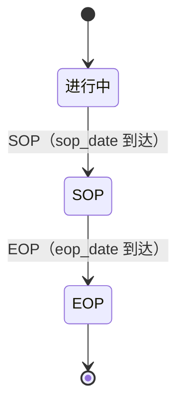

# 项目台账 · 应用详设

> 应用名：`md_project` | 类名：`MdProject` | 聚合根：项目台账
> 输入来源：`app/psc/architecture.md` 聚合根卡 #3 + `app/psc/brd/04-库存策略.md` §4.8.2 + `app/psc/brd/08-管理系统设计实现.md` §8.4.1
> 数据来源类型：独立创建（PLM 冗余同步 + 本地录入）

---

## 1. 需求概览

### 1.1 基本信息
- **需求名称**: 项目台账管理
- **需求编号**: REQ-PSC-MDM-003
- **所属模块**: 产销协同-主数据层
- **需求来源**: 业务方（责任销售/计划）
- **创建日期**: 2026-08-14
- **优先级**: P1

### 1.2 需求背景
#### 1.2.1 为什么需要这个需求？
项目台账记录项目生命周期信息（阶段/SOP/EOP）。SOP/EOP 是销售预测阶跃检测、爬坡期识别与库存策略清尾管理（离 EOP 判定）的关键输入。若无统一的项目台账，各业务环节无法判断项目所处阶段，阶跃检测与清尾管理无从谈起。

#### 1.2.2 期望达到什么目标？
建立项目号的生命周期台账（项目号/名称/阶段/SOP/EOP/责任销售/车型/份额），为阶跃检测、爬坡期识别与清尾管理提供项目阶段基准。其中 **veh_model（项目对应车型）** 与 **share（我公司供应份额，0~1 小数）** 为项目级业务抬头信息（与 md_project_part 的零件级 用量/份额 不同粒度，互不冲突）。

### 1.3 需求范围
#### 1.3.1 包含哪些功能？
项目台账的创建、列表查询、更新、批量导入/更新。

#### 1.3.2 不包含哪些功能？
- 不做项目立项/审批流程管理（不在产销协同域范围）
- 不做 PLM 实时集成接口（V1 以批量导入起步）

> **数据来源类型**: 独立创建 —— 数据由用户在本应用内独立录入，前端保留"新建"按钮；同时通过 import_batch 承接 PLM 冗余同步。

### 1.4 涉及角色
**谁会使用这个功能？**

- **责任销售**: 负责项目台账的新建与维护（owner 字段记录责任销售）
- **计划**: 查看项目台账，SOP/EOP 时间作为阶跃检测、爬坡期、清尾管理的输入

---

## 2. 用户故事

### 2.1 核心用户故事

#### 2.1.1 `US-01` 用户故事 — 创建项目台账（优先级：P1）

- **故事描述**: 作为责任销售，我想要创建项目台账记录，以便于后续预测与库存策略识别项目所处阶段
- **为何赋予此优先级**：项目台账是 SOP/EOP 阶段基准的来源，无项目则阶跃检测与清尾管理无法运作
- **独立测试**：可通过进入项目台账页面，点击"新建"，填写必填字段后保存并验证记录已入库来独立测试
- **前置条件**: 用户已登录，拥有项目台账创建权限
- **后置条件**: 系统生成一条新的项目台账记录，project_no 全局唯一，stage 默认"进行中"

**验收场景**：

1. `US-01-AC1` **场景**: 合法参数创建成功
   - **Given** 系统中不存在 project_no=P2026001 的记录，**When** 填写 project_no=P2026001, project_name=某车型项目, owner=张三 后点击保存，**Then** 记录创建成功，stage 默认"进行中"，可通过 get(P2026001) 查询到完整记录

2. `US-01-AC2` **场景**: 重复项目号被拒绝
   - **Given** 系统中已存在 project_no=P2026001，**When** 再次创建 project_no=P2026001，**Then** 系统拒绝保存并提示"该项目号已存在"

3. `US-01-AC3` **场景**: 必填字段为空被拒绝
   - **Given** 用户在新建表单中，**When** project_no 或 project_name 或 owner 为空提交，**Then** 系统拒绝保存并提示具体缺失字段

4. `US-01-AC4` **场景**: 非法阶段枚举被拒绝
   - **Given** 用户在新建表单中，**When** stage 传入非法值（如"已停产"）提交，**Then** 系统拒绝保存并提示"阶段仅支持进行中/SOP/EOP"

---

#### 2.1.2 `US-02` 用户故事 — 查看项目台账列表（优先级：P1）

- **故事描述**: 作为责任销售/计划，我想要按条件筛选查看项目台账列表，以便于快速定位目标项目
- **为何赋予此优先级**：列表查询是最基础的数据浏览入口，是更新/维护与阶段识别的前置操作
- **独立测试**：可通过进入项目台账列表页，使用不同筛选条件查询并验证结果来独立测试
- **前置条件**: 系统中已有项目台账记录
- **后置条件**: 返回符合条件的项目列表，支持分页

**验收场景**：

1. `US-02-AC1` **场景**: 按项目号模糊查询
   - **Given** 系统中存在多条项目记录，**When** 输入 project_no=P2026 后查询，**Then** 列表展示所有 project_no 包含"P2026"的项目

2. `US-02-AC2` **场景**: 按阶段筛选
   - **Given** 系统中存在进行中、SOP、EOP 的项目，**When** 筛选 stage=SOP 后查询，**Then** 列表仅展示阶段为 SOP 的记录

3. `US-02-AC3` **场景**: 按项目名称模糊查询
   - **Given** 系统中存在多条项目记录，**When** 输入 project_name=车型 后查询，**Then** 列表展示所有 project_name 包含"车型"的项目

---

#### 2.1.3 `US-03` 用户故事 — 更新项目台账（优先级：P2）

- **故事描述**: 作为责任销售，我想要修改项目台账的阶段、SOP/EOP 时间，以便于推进项目生命周期
- **为何赋予此优先级**：项目阶段随生命周期推进（进行中→SOP→EOP），阶段与时间需持续维护
- **独立测试**：可通过查询一条已有记录，推进其 stage 后保存并验证生效来独立测试
- **前置条件**: 目标记录已存在
- **后置条件**: 记录更新成功，阶段遵循状态机单向推进

**验收场景**：

1. `US-03-AC1` **场景**: 阶段推进成功
   - **Given** 存在项目 project_no=P2026001 stage=进行中，**When** 填写 sop_date=2026-09-30 并将 stage 改为 SOP 后保存，**Then** 更新成功，重新查询 stage=SOP、sop_date=2026-09-30

2. `US-03-AC2` **场景**: 非法状态跳转被拒绝
   - **Given** 存在项目 stage=SOP，**When** 将 stage 回退为"进行中"后保存，**Then** 系统拒绝并提示"阶段仅可单向推进（进行中→SOP→EOP）"

3. `US-03-AC3` **场景**: 更新不存在的记录被拒绝
   - **Given** 系统中不存在 project_no=NOTEXIST，**When** 尝试更新该项目号，**Then** 系统拒绝并提示"项目记录不存在"

4. `US-03-AC4` **场景**: 日期格式非法被拒绝
   - **Given** 用户在编辑表单中，**When** sop_date 填写"2026/09/30"（非 YYYY-MM-DD）后保存，**Then** 系统拒绝并提示"SOP 时间格式须为 YYYY-MM-DD"

---

#### 2.1.4 `US-04` 用户故事 — 批量导入项目台账（优先级：P2）

- **故事描述**: 作为责任销售/计划，我想要通过 Excel 批量导入项目台账，以便于 PLM 冗余同步或新项目集中上线时高效建账
- **为何赋予此优先级**：主数据以 PLM 冗余同步起步，批量导入是初始化与同步阶段的核心入口
- **独立测试**：可通过准备合法的 Excel 文件，执行导入并验证所有行均已入库来独立测试
- **前置条件**: 导入文件格式符合规范（列：project_no, project_name, stage, sop_date, eop_date, owner, veh_model, share）
- **后置条件**: 导入成功的行入库，失败的行返回错误明细

**验收场景**：

1. `US-04-AC1` **场景**: 全部合法行导入成功
   - **Given** 导入文件含5条合法项目记录且无主键冲突，**When** 执行导入，**Then** 5条均入库，返回成功计数

2. `US-04-AC2` **场景**: 冲突行更新
   - **Given** 导入文件含5条，其中2条 project_no 与已有记录冲突，**When** 执行导入，**Then** 3条新增入库，2条已有记录的 project_name/stage/sop_date/eop_date/owner 被更新（upsert）

3. `US-04-AC3` **场景**: 必填缺失—该行失败
   - **Given** 导入文件某行 project_no 为空，**When** 执行导入，**Then** 该行导入失败，错误明细提示"项目号不能为空"，其他合法行正常导入

---

## 3. 业务场景

### 3.1 业务流程描述

#### 3.1.1 场景1: 新建项目台账
1. 用户进入"项目台账"页面，点击"新建"
2. 系统展示项目台账表单（project_no, project_name, stage, sop_date, eop_date, owner）
3. 用户填写必填字段：project_no, project_name, owner
4. 用户点击"保存"
5. 系统校验 project_no 唯一性、stage 枚举值、日期格式
6. 校验通过，记录入库（stage 默认"进行中"）；校验不通过，提示冲突

#### 3.1.2 场景2: 批量导入项目台账
1. 用户进入"项目台账"页面，点击"批量导入"
2. 系统弹出文件上传对话框，附带模板下载链接
3. 用户选择符合模板的 Excel 并上传
4. 系统逐行校验：project_no 非空唯一、project_name/owner 非空、stage 枚举、sop_date/eop_date 日期格式
5. 已存在主键行 → 更新（upsert），新行 → 新增
6. 系统返回导入结果摘要（成功数、失败数、错误明细）

#### 3.1.3 场景3: 阶段推进（SOP/EOP）
1. 用户进入项目台账列表，定位目标项目进入编辑
2. 项目到达 SOP 时点，用户填写 sop_date 并将 stage 改为 SOP
3. 系统校验状态机（进行中→SOP 合法）与日期格式
4. 项目到达 EOP 时点，用户填写 eop_date 并将 stage 改为 EOP
5. 系统校验状态机（SOP→EOP 合法）、eop_date 晚于 sop_date
6. 校验通过，记录更新；校验不通过，提示非法跳转

### 3.2 业务规则

#### 3.2.1 `BR-01` 项目号全局唯一
- **规则描述**: project_no 全局唯一，为单字段主键
- **适用场景**: 创建、导入
- **示例**: project_no=P2026001 已存在，则不可再建 project_no=P2026001

#### 3.2.2 `BR-02` 必填字段校验
- **规则描述**: project_no, project_name, owner 为必填，不可为空字符串；stage 默认"进行中"；sop_date/eop_date 可选
- **适用场景**: 创建、导入、更新
- **示例**: 创建时 project_name 为空 → 拒绝保存，提示"项目名称不能为空"

#### 3.2.3 `BR-03` 阶段枚举约束
- **规则描述**: stage 仅限"进行中 / SOP / EOP"三值
- **适用场景**: 创建、导入、更新
- **示例**: stage=已停产 → 拒绝保存，提示"阶段仅支持进行中/SOP/EOP"

#### 3.2.4 `BR-04` SOP/EOP 日期格式校验
- **规则描述**: sop_date、eop_date 为日期类型，格式须为 YYYY-MM-DD
- **适用场景**: 创建、导入、更新
- **示例**: sop_date=2026/09/30 → 拒绝保存，提示"SOP 时间格式须为 YYYY-MM-DD"

#### 3.2.5 `BR-05` 阶段时间先后约束
- **规则描述**: 同时填写 sop_date 与 eop_date 时，eop_date 须晚于 sop_date（SOP 先于 EOP）
- **适用场景**: 创建、导入、更新
- **示例**: sop_date=2026-09-30、eop_date=2026-08-31 → 拒绝保存，提示"EOP 时间须晚于 SOP 时间"

#### 3.2.6 `BR-06` 状态机单向流转约束
- **规则描述**: stage 仅可按"进行中 → SOP → EOP"单向推进，禁止跳级与回退；推进到 SOP 须已填写 sop_date，推进到 EOP 须已填写 eop_date
- **适用场景**: 更新、导入（含阶段推进）
- **示例**: stage 从 SOP 回退为进行中 → 拒绝；stage 从进行中直接改为 EOP → 拒绝

### 3.3 业务数据

#### 3.3.1 数据1: 项目号 project_no
- **数据描述**: 项目的唯一编码，全局主键，被项目零件映射（md_project_part）作为项目键引用
- **数据类型**: 文本
- **数据来源**: 用户录入 / PLM 冗余同步（Excel 导入）
- **示例值**: P2026001

#### 3.3.2 数据2: 项目名称 project_name
- **数据描述**: 项目的中文名称
- **数据类型**: 文本
- **数据来源**: 用户录入 / PLM 冗余同步（Excel 导入）
- **示例值**: 某车型项目

#### 3.3.3 数据3: 阶段 stage
- **数据描述**: 项目生命周期阶段，是阶跃检测、爬坡期、清尾管理的输入基准
- **数据类型**: 枚举值
- **数据来源**: 用户录入 / PLM 冗余同步（Excel 导入），随生命周期推进维护
- **示例值**: 进行中 / SOP / EOP

#### 3.3.4 数据4: SOP 时间 sop_date
- **数据描述**: 开始量产（Start of Production）时间，阶跃检测、爬坡期的输入
- **数据类型**: 日期（YYYY-MM-DD）
- **数据来源**: 用户录入 / PLM 冗余同步（Excel 导入）
- **示例值**: 2026-09-30

#### 3.3.5 数据5: EOP 时间 eop_date
- **数据描述**: 停产（End of Production）时间，离 EOP 判定、清尾管理的输入
- **数据类型**: 日期（YYYY-MM-DD）
- **数据来源**: 用户录入 / PLM 冗余同步（Excel 导入）
- **示例值**: 2029-12-31

#### 3.3.6 数据6: 责任销售 owner
- **数据描述**: 项目的责任销售（姓名/工号），项目台账的归属维护人
- **数据类型**: 文本
- **数据来源**: 用户录入 / PLM 冗余同步（Excel 导入）；用户主数据来源待确认
- **示例值**: 张三

### 3.4 状态机

项目台账存在生命周期状态流转，状态图如下：



**状态清单：**

| 状态 | 含义 |
|------|------|
| 进行中 | 项目立项后、SOP 前（爬坡期前） |
| SOP | 开始量产（Start of Production），阶跃检测/爬坡期起点 |
| EOP | 停产（End of Production），清尾管理/离 EOP 判定 |

**状态转换规则矩阵：**

| 当前状态 | 目标状态 | 触发动作 | 前置条件 |
|----------|----------|----------|----------|
| (新建) | 进行中 | 创建项目台账 | 必填字段校验通过，project_no 唯一 |
| 进行中 | SOP | 阶段推进（SOP 时点到达） | sop_date 已填写（YYYY-MM-DD） |
| SOP | EOP | 阶段推进（EOP 时点到达） | eop_date 已填写且晚于 sop_date |

> 阶段推进通过 `update` / `import_batch` 更新 stage 字段实现，须遵循 BR-06 单向流转约束，禁止跳级与回退。推进的触发方式（人工 update vs 按日期自动）待业务方确认（见 §6.3）。

---

## 4. 功能描述

### 4.1 功能清单

| 一级菜单/模块 | 一级编号 | 二级菜单/模块 | 二级编号 | 三级功能 | 三级编号 | 功能类型 | 优先级 | 三级功能简述 |
|---|---|---|---|---|---|---|---|---|
| 主数据管理 | F01 | 项目台账 | F01-03 | 创建项目台账 | FUNC-01 | 表单页 | P1 | 新建项目号/名称/阶段/SOP/EOP/责任销售 |
| 主数据管理 | F01 | 项目台账 | F01-03 | 项目台账列表查询 | FUNC-02 | 列表页 | P1 | 按项目号/名称/阶段筛选查看项目台账 |
| 主数据管理 | F01 | 项目台账 | F01-03 | 更新项目台账 | FUNC-03 | 表单页 | P2 | 修改阶段/SOP/EOP时间/责任销售 |
| 主数据管理 | F01 | 项目台账 | F01-03 | 批量导入项目台账 | FUNC-04 | 表单页 | P2 | Excel 批量导入/更新项目台账（PLM 冗余同步） |

### 4.2 功能模块结构图
```
主数据管理 F01
└── 项目台账 F01-03
    ├── FUNC-01 创建项目台账（表单页，P1）
    ├── FUNC-02 项目台账列表查询（列表页，P1）
    ├── FUNC-03 更新项目台账（表单页，P2）
    └── FUNC-04 批量导入项目台账（表单页，P2）
```

### 4.3 功能详细说明

#### 4.3.1 F01-03 项目台账

##### 4.3.1.1 FUNC-01 创建项目台账

**功能描述**:
提供项目台账的创建表单，用户录入项目号/名称/阶段/SOP/EOP/责任销售后保存。此功能为独立创建——前端保留"新建"按钮。

**用户操作流程**:
1. 用户进入"项目台账"列表页，点击"新建"按钮
2. 系统展示创建表单（project_no, project_name, stage, sop_date, eop_date, owner）
3. 用户填写 project_no（必填）、project_name（必填）、owner（必填）、sop_date/eop_date（选填）
4. 用户点击"保存"
5. 系统校验 project_no 唯一性、stage 枚举值、日期格式
6. 校验通过 → 记录入库（stage 默认"进行中"），提示保存成功；校验不通过 → 提示具体错误

**输入数据**:
- project_no: 项目号 - 必填，最大50字符 - 示例：P2026001
- project_name: 项目名称 - 必填，最大100字符 - 示例：某车型项目
- stage: 阶段 - 选填，枚举（进行中\|SOP\|EOP），默认进行中 - 示例：进行中
- sop_date: SOP 时间 - 选填，日期 YYYY-MM-DD - 示例：2026-09-30
- eop_date: EOP 时间 - 选填，日期 YYYY-MM-DD，晚于 sop_date - 示例：2029-12-31
- owner: 责任销售 - 必填，最大50字符 - 示例：张三

**输出数据**:
- 成功消息: "项目台账创建成功"
- 错误消息: "该项目号已存在" / "XX字段不能为空" / "阶段仅支持进行中/SOP/EOP" / "SOP 时间格式须为 YYYY-MM-DD"

**业务规则**:
- BR-01: project_no 全局唯一
- BR-02: project_no, project_name, owner 必填
- BR-03: stage 枚举约束（进行中/SOP/EOP）
- BR-04: sop_date/eop_date 日期格式 YYYY-MM-DD
- BR-05: eop_date 晚于 sop_date

**特殊处理**:
- stage 未填时默认"进行中"（状态机起点）

**业务实体**:
- **MdProject**: 项目号/名称/阶段/SOP/EOP/责任销售，标识为 project_no

**MdProject 字段**

| 字段名称 | 字段类型 | 是否必填 | 默认值 | 业务逻辑 |
|---|---|---|---|---|
| project_no | 文本 | 是 | - | 项目号，PK，全局唯一，最大50字符 |
| project_name | 文本 | 是 | - | 项目名称，最大100字符 |
| stage | 枚举值 | 是 | 进行中 | 进行中\|SOP\|EOP，仅可单向推进（BR-06） |
| sop_date | 日期 | 否 | - | SOP 时间，格式 YYYY-MM-DD；进行中阶段可为空 |
| eop_date | 日期 | 否 | - | EOP 时间，格式 YYYY-MM-DD；晚于 sop_date（BR-05） |
| owner | 文本 | 是 | - | 责任销售姓名/工号；用户主数据来源待确认 |

---

##### 4.3.1.2 FUNC-02 项目台账列表查询

**功能描述**:
提供项目台账的分页列表，支持按项目号、项目名称、阶段等条件筛选。

**用户操作流程**:
1. 用户进入"项目台账"列表页
2. 用户可选填写筛选条件：project_no（模糊匹配）、project_name（模糊匹配）、stage（精确匹配）
3. 用户点击"查询"
4. 系统返回符合条件的项目列表（分页）

**输入数据**:
- project_no: 项目号 - 选填，模糊匹配 - 示例：P2026
- project_name: 项目名称 - 选填，模糊匹配 - 示例：车型
- stage: 阶段 - 选填，精确匹配 - 示例：SOP
- page: 页码 - 默认1
- size: 每页条数 - 默认20

**输出数据**:
- 列表字段: project_no, project_name, stage, sop_date, eop_date, owner
- 分页信息: total, page, size

**业务规则**:
- 筛选条件均为可选，条件之间 AND 关系
- project_no / project_name 支持模糊匹配（LIKE %value%）

**特殊处理**:
- 默认按 project_no 升序排列

**业务实体**:
- **MdProject**: 同上 FUNC-01

**MdProject 列表展示字段**

| 展示字段 | 字段来源 | 可筛选 | 说明 |
|---|---|---|---|
| 项目号 | project_no | 是（模糊） | PK |
| 项目名称 | project_name | 是（模糊） | 显示用 |
| 阶段 | stage | 是（精确） | 进行中/SOP/EOP |
| SOP 时间 | sop_date | 否 | 显示用 |
| EOP 时间 | eop_date | 否 | 显示用 |
| 责任销售 | owner | 否 | 显示用 |

---

##### 4.3.1.3 FUNC-03 更新项目台账

**功能描述**:
对已有项目台账记录修改 project_name、stage、sop_date、eop_date、owner。project_no 作为主键不允许修改。

**用户操作流程**:
1. 用户在列表页点击目标行 → 进入编辑模式
2. 系统回填当前值到表单
3. 用户修改 project_name / stage / sop_date / eop_date / owner
4. 用户点击"保存"
5. 系统校验 stage 枚举值、日期格式、状态机单向流转（BR-06）、eop_date 晚于 sop_date
6. 校验通过 → 更新入库

**输入数据**:
- project_no: 项目号 - 不可修改，仅作为定位键
- project_name: 项目名称 - 可修改，最大100字符
- stage: 阶段 - 可修改，枚举（进行中\|SOP\|EOP），须单向推进
- sop_date: SOP 时间 - 可修改，日期 YYYY-MM-DD
- eop_date: EOP 时间 - 可修改，日期 YYYY-MM-DD，晚于 sop_date
- owner: 责任销售 - 可修改，最大50字符

**输出数据**:
- 成功消息: "项目台账更新成功"
- 错误消息: "项目记录不存在" / "阶段仅支持进行中/SOP/EOP" / "阶段仅可单向推进（进行中→SOP→EOP）" / "SOP 时间格式须为 YYYY-MM-DD"

**业务规则**:
- BR-01: project_no 不可修改（主键不可变）
- BR-02: project_name, owner 不能更新为空
- BR-03: stage 枚举约束
- BR-04: sop_date/eop_date 日期格式
- BR-05: eop_date 晚于 sop_date
- BR-06: 状态机单向流转约束

**特殊处理**:
- 无

---

##### 4.3.1.4 FUNC-04 批量导入项目台账

**功能描述**:
通过上传 Excel 文件（列：project_no, project_name, stage, sop_date, eop_date, owner），系统逐行校验入库。已存在的主键行执行更新（upsert），不存在的新增。此功能是 PLM 冗余同步的承接通道。

**用户操作流程**:
1. 用户点击"批量导入"按钮
2. 系统弹出文件上传对话框，附带模板下载链接
3. 用户选择符合格式的 Excel 文件上传
4. 系统逐行校验（必填、枚举值、日期格式、状态机）
5. 导入完成 → 系统返回摘要（成功数、失败数、错误明细列表）

**输入数据**:
- Excel 文件，列：project_no, project_name, stage, sop_date, eop_date, owner

**输出数据**:
- 导入摘要: { total: N, success: N, fail: N, errors: [{ row, field, message }] }

**业务规则**:
- BR-01: 主键已存在行 → 更新 project_name/stage/sop_date/eop_date/owner（upsert），非冲突拒绝
- BR-02: 必填字段为空行 → 失败，记录错误明细
- BR-03: stage 不在枚举范围内 → 失败，记录错误明细
- BR-04: 日期格式非法 → 失败，记录错误明细
- BR-05: eop_date 早于 sop_date → 失败，记录错误明细
- BR-06: 状态机跳级/回退 → 失败，记录错误明细

**特殊处理**:
- Upsert 策略：已存在主键 → 更新 project_name, stage, sop_date, eop_date, owner
- 提供模板下载：含表头行（project_no, project_name, stage, sop_date, eop_date, owner）的空白 Excel
- PLM 冗余同步经此通道落地（增量/日度，见 §8.5.1）

---

## 5. 权限要求

### 5.1 功能权限

| 功能名称 | 权限标识 | 责任销售 | 计划 |
|---|---|---|---|
| 创建项目台账 | `md:project:create` | 可访问 | 不可访问 |
| 项目台账列表查询 | `md:project:query` | 可访问 | 可访问 |
| 更新项目台账 | `md:project:update` | 可访问 | 不可访问 |
| 批量导入项目台账 | `md:project:import` | 可访问 | 可访问 |

> 权限标识遵循项目约定：`{module}:{resource}:{action}`，如 `md:project:create`。

### 5.2 数据权限
#### 5.2.1 角色1: 责任销售
- 负责项目台账的新建与维护（owner 字段记录责任销售）
- 可查看全部项目台账

#### 5.2.2 角色2: 计划
- 可查看全部项目台账，SOP/EOP 时间作为阶跃检测、爬坡期、清尾管理的输入
- 通过批量导入完成 PLM 冗余同步，不做项目级数据隔离

---

## 6. 验收标准

### 6.1 功能验收标准

#### 6.1.1 标准1: 项目台账 CRUD 完整闭环
- **关联用户故事**: US-01, US-02, US-03
- **关联业务规则**: BR-01, BR-02, BR-03
- **验证方式**: 依次执行创建→查询→更新→再查询
- **测试数据**: project_no=P2026001, project_name=某车型项目, owner=张三
- **预期结果**: 创建成功（stage=进行中）并通过 list/get 可查询；推进 stage=SOP 后再次查询值已变更

#### 6.1.2 标准2: 项目号唯一性校验
- **关联用户故事**: US-01
- **关联业务规则**: BR-01
- **验证方式**: 创建两条 project_no 完全相同的记录
- **测试数据**: 重复创建 project_no=P2026001
- **预期结果**: 第二条创建被拒绝，提示"该项目号已存在"

#### 6.1.3 标准3: 批量导入正常+异常混合场景
- **关联用户故事**: US-04
- **关联业务规则**: BR-01, BR-02, BR-03, BR-04, BR-05
- **验证方式**: 导入含5行数据（3行合法新记录、1行已有主键、1行缺必填字段）
- **测试数据**: 合法新记录3条 + 已有主键1条 + 缺 project_name 行1条
- **预期结果**: 3条新增入库，已有主键行被更新，缺必填行失败并返回错误明细

#### 6.1.4 标准4: 阶段枚举与状态机校验
- **关联用户故事**: US-01, US-03
- **关联业务规则**: BR-03, BR-06
- **验证方式**: 创建/更新时 stage 传入非法值（如"已停产"）或非法跳转（SOP→进行中）
- **测试数据**: stage=已停产；stage 从 SOP 回退为进行中
- **预期结果**: 保存被拒绝，提示"阶段仅支持进行中/SOP/EOP"或"阶段仅可单向推进"；进行中→SOP→EOP 顺序推进合法

#### 6.1.5 标准5: 日期校验
- **关联用户故事**: US-01, US-03
- **关联业务规则**: BR-04, BR-05
- **验证方式**: 创建/更新时 sop_date 传入非法格式或 eop_date 早于 sop_date
- **测试数据**: sop_date=2026/09/30；sop_date=2026-09-30 + eop_date=2026-08-31
- **预期结果**: 保存被拒绝，提示"SOP 时间格式须为 YYYY-MM-DD"或"EOP 时间须晚于 SOP 时间"；合法 YYYY-MM-DD 且 eop_date>sop_date 通过

### 6.2 非功能验收标准
**性能要求**: 列表查询（5000条以内）页面加载时间<2秒
**安全性要求**: 无敏感加密需求（基础数据）
**兼容性要求**: 支持 Chrome、Edge 浏览器

### 6.3 已知问题或限制
- V1 无 PLM 实时集成接口，项目台账以批量导入（import_batch）承接冗余同步；实时接口在实施设计阶段补
- 项目删除功能暂不提供（V1 只增不改删，避免被 md_project_part 引用的级联问题）
- 责任销售（owner）字段的用户主数据来源待确认：聚合清单中未建模用户主数据（md_user），当前按文本字段维护
- 阶段推进的触发方式（人工 update vs 按 sop_date/eop_date 自动）待业务方确认

---

## 7. 参考资料

### 7.1 相关文档
- `app/psc/architecture.md` - 聚合根卡 #3 项目台账
- `app/psc/brd/04-库存策略.md` - §4.8.2 项目台账字段（项目号/阶段/SOP/EOP）
- `app/psc/brd/08-管理系统设计实现.md` - §8.4.1 项目台账表、§8.5.2 PLM 冗余同步接口

### 7.2 相关功能
- `md_project_part` - 项目零件映射：create/update 时通过 `self.fde.call → md_project.get(project_no)` 校验项目存在

### 7.3 外部依赖
- 无跨应用调用（本应用不调用其他聚合）
- 被 `md_project_part` 引用：其 create/update 调用本应用的 get 校验项目存在

### 7.4 备注
- 本应用属主数据层，数据来源类型为"独立创建"，前端保留"新建"按钮；同时 import_batch 承接 PLM 冗余同步
- project_no 唯一性保证被 md_project_part 引用校验的一致性
- SOP/EOP 时间作为销售预测阶跃检测/爬坡期、库存策略清尾管理（离 EOP 判定）的关键输入（architecture.md 聚合根卡）；当前架构关系图中仅 md_project_part 显式引用 project_no
