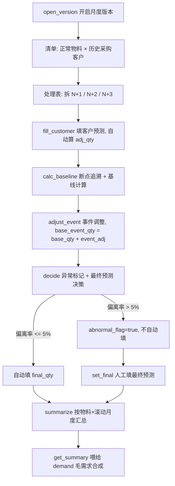

# 销售预测 · 应用详设

> 应用名：`sales_forecast` | 聚合根类名：`SalesForecast` | 聚合根：销售预测
> 数据来源类型：**手工参考创建**（用户开启月度版本后，基于正常状态物料 × 历史采购客户生成清单；前端保留"开启版本"入口，标注上游来源）
> 产出技能：fde-aggregate-application-design（第②步）
> 输入来源：`app/psc/architecture.md` 聚合根卡 #9 + `app/psc/brd/03-销售预测.md`

---

## 1. 需求概览

### 1.1 基本信息
- **需求名称**: 销售预测管理
- **需求编号**: PSC-SF-001
- **所属模块**: 产销协同-销售预测
- **需求来源**: 产品经理 / 业务方
- **创建日期**: 2026-08-14
- **优先级**: P0

### 1.2 需求背景
#### 1.2.1 为什么需要这个需求？

销售预测是产销协同体系的需求起点，其输出经加工发布后构成毛需求的客户需求部分。当前缺少一条系统化的"预测清单→处理表→汇总表"加工链，无法完成「收集客户预测 → 自主预测形成基线 → 双源对比 → 事件调整 → 异常判定 → 最终预测」的闭环，导致计划只能线下拍数，不可追溯、不可审计。

#### 1.2.2 期望达到什么目标？

建立销售预测三阶段加工链：按正常状态物料 × 历史采购客户生成预测清单，逐行完成客户预测调整、基线计算（四种方法）、事件调整、异常标记与最终预测决策，最后按物料×滚动月度汇总，为毛需求发布提供物料级预测输入。

### 1.3 需求范围
#### 1.3.1 包含哪些功能？

开启月度版本生成清单、填写客户预测、基线计算（含断点追溯）、事件调整、异常标记与最终预测决策、异常行人工填最终预测、物料预测汇总、处理表/汇总表查询

#### 1.3.2 不包含哪些功能？

- 物料销售历史、当前库存/在途/未发订单的采集（来自 ERP，经 `_load_sales_history` 等适配器访问，不建聚合）
- 客户滚动预测的独立建模（作为 `fill_customer` 的输入数据，不独立成聚合）
- 毛需求合成与净需求运算（由 `demand` 聚合消费本应用汇总结果）
- 基线方法与参数的最优回测拟合（由 `strategy_fitting` 负责，回填物料主数据）
- MAPE/bias 的统计计算（由 `attainment` 聚合派生，本应用只消费）

> **数据来源类型**: 手工参考创建 —— 数据引用上游结果（正常状态物料、历史采购客户），由用户手工决定何时开启月度版本；前端保留"开启版本"入口，并新增「新建组合」`create` 入口（物料×客户，客户可空）以补充开启版本未覆盖的组合。物料来自 `md_material`、客户来自 `md_customer`（可空）、版本来自 `md_monthly_version`。

### 1.4 涉及角色
**谁会使用这个功能？**

- **客户**: 填报本客户各物料的 N+1~N+3 滚动预测（原始需求数量），不参与基线/事件/决策环节
- **一线销售**: 收集/代填客户预测、提供事件线索（促销/SOP/断点），只读查看预测结果
- **总部计划**: 开启月度版本、执行基线计算、事件调整、异常标记与最终预测决策、人工填写异常行最终预测、汇总并交付毛需求

---

## 2. 用户故事

### 2.1 核心用户故事

#### 2.1.1 `US-01` 用户故事 — 开启月度版本生成预测清单（优先级：P1）

- **故事描述**: 作为总部计划，我想要对指定月度版本开启销售预测，以便于系统按「正常状态物料 × 该物料的历史采购客户」生成清单，并拆 N+1/N+2/N+3 进处理表；某物料无历史采购记录时客户字段为空、仅初始化一行。
- **为何赋予此优先级**：清单是销售预测的起点，没有清单就无法进行任何后续加工。
- **独立测试**：可通过对一个草稿版本执行 open_version，验证清单行数与处理表行数是否正确展开。
- **前置条件**: 目标版本 `md_monthly_version` 已存在且处于草稿状态。
- **后置条件**: 生成该版本的清单（物料×客户）与处理表行（物料×客户×滚动月度）。

**验收场景**：

1. `US-01-AC1` **正常开启版本**：
   - **Given** 版本 202608 处于草稿，存在 3 个正常状态物料（M1、M2、M3），其中 M1 历史采购客户为 {C1, C2}、M2 为 {C1}、M3 无任何历史采购记录，**When** 计划执行 `open_version("202608")`，**Then** 清单生成 4 行（M1/C1、M1/C2、M2/C1、M3/空客户），处理表生成 12 行（每组合拆 N+1/N+2/N+3）。

2. `US-01-AC2` **版本不存在被拒绝**：
   - **Given** 版本 202609 不存在，**When** 执行 `open_version("202609")`，**Then** 系统拒绝并提示"月度版本不存在"。

3. `US-01-AC3` **已发布版本拒绝开启**：
   - **Given** 版本 202608 已发布（锁定），**When** 执行 `open_version("202608")`，**Then** 系统拒绝并提示"版本已锁定，不可开启预测"。

---

#### 2.1.2 `US-02` 用户故事 — 填写客户预测（优先级：P1）

- **故事描述**: 作为客户/一线销售，我想要在指定处理表行填写客户原始预测数量，以便于系统自动修正出调整后需求。
- **为何赋予此优先级**：客户预测是双源对比的一源，是预测链的核心输入之一。
- **独立测试**：可通过填写/留空 orig_qty，验证调整后需求自动计算与校验。
- **前置条件**: 版本已开启，目标处理表行已存在，版本处于草稿状态。
- **后置条件**: 记录原始需求数量，系统自动计算调整后需求（人工可调）。

**验收场景**：

1. `US-02-AC1` **填写并自动调整**：
   - **Given** 行 (202608, M1, C1, N+1) 存在，该客户×物料 bias=+0.1，**When** 填写 orig_qty=1000，**Then** adj_qty 自动 = 1000 × (1 − 0.1) = 900。

2. `US-02-AC2` **客户不填报留空**：
   - **Given** 客户未提供预测，**When** 不填 orig_qty 保存，**Then** orig_qty 为空，adj_qty 为空，后续决策走"MAPE 不存在/默认信基线"路径。

3. `US-02-AC3` **物料或客户不存在被拒绝**：
   - **Given** 传入 material_no=NOTEXIST 或 customer_no=NOTEXIST，**When** 执行 fill_customer，**Then** 系统拒绝并提示"物料不存在"/"客户不存在"。

---

#### 2.1.3 `US-03` 用户故事 — 基线计算（含断点追溯前置）（优先级：P1）

- **故事描述**: 作为总部计划，我想要对指定行执行基线计算，以便于系统先做断点追溯、再按物料基线方法+参数作用于历史干净需求，得到基线数量。
- **为何赋予此优先级**：基线是双源对比的另一源，自主预测能力的核心。
- **独立测试**：可通过对指定行执行 calc_baseline，验证断点追溯与四种方法计算是否正确。
- **前置条件**: 版本草稿状态，行已存在，物料主数据已配置 base_method/base_params。
- **后置条件**: 记录 bp_material_no/switch_time（如有断点）、base_qty、base_event_qty（= base_qty + event_adj）。

**验收场景**：

1. `US-03-AC1` **移动平均计算基线**：
   - **Given** 物料 M1 base_method=移动平均、base_params={"window":3}，历史干净需求近 3 期为 [100, 110, 120]，**When** 执行 calc_baseline，**Then** base_qty = (100+110+120)/3 = 110。

2. `US-03-AC2` **断点追溯拼接历史**：
   - **Given** 物料 M2 为断点新件，md_breakpoint.trace 追溯到原物料 M0，**When** 执行 calc_baseline，**Then** 历史序列 = 原件历史 + 新件历史拼接（量比 1.0），base_qty 基于拼接序列计算，并记录 bp_material_no=M0、switch_time。

3. `US-03-AC3` **物料无基线方法被拒绝**：
   - **Given** 物料 M1 未配置 base_method，**When** 执行 calc_baseline，**Then** 系统拒绝并提示"物料未配置基线方法"。

---

#### 2.1.4 `US-04` 用户故事 — 事件调整（优先级：P1）

- **故事描述**: 作为总部计划，我想要对指定行填写事件分析（促销/SOP/断点）与事件调整量，以便于将事件影响纳入基线和事件合计量。
- **为何赋予此优先级**：事件（促销、SOP）是基线与客户值之外的重要修正源。
- **独立测试**：可通过对指定行填写 event_adj，验证 base_event_qty 自动重算且不外推。
- **前置条件**: 版本草稿状态，行已存在。
- **后置条件**: 记录 event_analysis、event_adj，base_event_qty = base_qty + event_adj。

**验收场景**：

1. `US-04-AC1` **事件调整叠加**：
   - **Given** 行 base_qty=110，**When** 填写 event_adj=+20、event_analysis="客户促销"，**Then** base_event_qty = 110 + 20 = 130。

2. `US-04-AC2` **事件调整只作用归属期**：
   - **Given** 行 (M1, C1, N+1) 填 event_adj=+20，**When** 查询 (M1, C1, N+2)，**Then** N+2 行 event_adj 仍为空/0，不外推。

---

#### 2.1.5 `US-05` 用户故事 — 异常标记与最终预测决策（优先级：P1）

- **故事描述**: 作为总部计划，我想要对指定行执行决策，以便于系统按 MAPE 与偏离率自动标记异常并给出最终预测建议（异常行不自动填写）。
- **决策口径（2026-08 调整，优先于下述旧 AC）**：基线 `base_qty` 为**物料级**（全客户合计），故偏离率改为对比 **基线数量 vs 该品种调整后需求合计 adj_sum**（=Σ 各客户 adj_qty，同版本+物料+滚动月度）。`dev=|base−adj_sum|/adj_sum`，`dev>5%` → 该物料该月全部客户行标记异常、final 待人工；否则单客户 final=各自 adj_qty。视图以【事件调整量】（event_adj）与【该品种调整后需求合计】两列展示，取代原【基线和事件合计】列。
- **为何赋予此优先级**：决策是销售预测的收口环节，直接决定最终预测量质量与人工介入范围。
- **独立测试**：可通过构造不同 MAPE/偏离率组合，验证异常标记与最终预测值是否正确。
- **前置条件**: 版本草稿状态，行已完成客户预测（或明确留空）与基线计算。
- **后置条件**: 记录 abnormal_flag 与 final_qty（异常行不自动填写）。

**验收场景**：

1. `US-05-AC1` **MAPE 小且偏离小 → 取客户值**：
   - **Given** MAPE=0.10（小）、adj_qty=900、base_event_qty=920、偏离率=|920−900|/900≈2.2%≤5%，**When** 执行 decide，**Then** 不标记异常，final_qty=900（客户调整后值）。

2. `US-05-AC2` **MAPE 大且偏离小 → 取基线**：
   - **Given** MAPE=0.30（大）、偏离率≤5%，**When** 执行 decide，**Then** 不标记异常，final_qty=base_event_qty。

3. `US-05-AC3` **偏离大 → 标记异常**：
   - **Given** MAPE 存在且偏离率=8%>5%，**When** 执行 decide，**Then** abnormal_flag=true，final_qty 不自动填写（待人工 set_final）。

4. `US-05-AC4` **MAPE 不存在 → 默认信基线**：
   - **Given** 无 MAPE（客户未填报/无达成率数据），**When** 执行 decide，**Then** 不标记异常，final_qty=base_event_qty。

---

#### 2.1.6 `US-06` 用户故事 — 异常行人工填最终预测（优先级：P2）

- **故事描述**: 作为总部计划，我想要对标记异常的行人工填写最终预测量，以便于完成人工判断收口。
- **为何赋予此优先级**：异常行需人工介入，是决策环节的必要补充。
- **独立测试**：可对异常行执行 set_final，验证 final_qty 覆盖与对非异常行的拒绝。
- **前置条件**: 版本草稿状态，行为异常标记（abnormal_flag=true）。
- **后置条件**: 记录 final_qty。

**验收场景**：

1. `US-06-AC1` **异常行人工填写成功**：
   - **Given** 行 abnormal_flag=true，**When** 执行 `set_final(..., final_qty=880)`，**Then** final_qty=880。

2. `US-06-AC2` **非异常行拒绝人工覆盖**：
   - **Given** 行 abnormal_flag=false 且已自动填 final_qty，**When** 执行 set_final，**Then** 系统拒绝并提示"该行非异常行，无需人工填写"。

---

#### 2.1.7 `US-07` 用户故事 — 物料预测汇总（优先级：P1）

- **故事描述**: 作为总部计划，我想要对指定版本执行汇总，以便于系统按物料×滚动月度合计所有客户最终预测量，产出物料预测汇总表。
- **为何赋予此优先级**：汇总表是销售预测的最终输出，直接喂给毛需求合成。
- **独立测试**：可对版本执行 summarize，验证同物料×滚动月度合计正确。
- **前置条件**: 版本处理表各行已完成最终预测（异常行已人工填）。
- **后置条件**: 生成/刷新汇总表，final_qty_sum = 该物料×滚动月度所有客户 final_qty 合计。

**验收场景**：

1. `US-07-AC1` **汇总合计正确**：
   - **Given** 物料 M1、N+1 下 C1 final_qty=900、C2 final_qty=300，**When** 执行 summarize，**Then** 汇总表 (M1, N+1) final_qty_sum=1200。

2. `US-07-AC2` **汇总随处理表重算**：
   - **Given** 汇总已生成，某行 final_qty 变更，**When** 再次 summarize，**Then** final_qty_sum 重新合计，覆盖旧值。

---

#### 2.1.8 `US-08` 用户故事 — 处理表详情查询（优先级：P2）

- **故事描述**: 作为总部计划/一线销售，我想要查询指定处理表行详情，以便于查看各加工字段。
- **为何赋予此优先级**：详情是核对与追溯的基础入口。
- **独立测试**：通过 `get(version_no, material_no, customer_no, rolling_month)` 查询。
- **前置条件**: 行已存在。
- **后置条件**: 返回该行全部字段。

**验收场景**：

1. `US-08-AC1` **按主键取详情**：
   - **Given** 行 (202608, M1, C1, N+1) 已存在，**When** 执行 get，**Then** 返回该行完整字段（orig_qty/adj_qty/base_qty/base_event_qty/abnormal_flag/final_qty 等）。

---

#### 2.1.9 `US-09` 用户故事 — 处理表列表查询（优先级：P2）

- **故事描述**: 作为总部计划/一线销售，我想要按版本、物料、客户、滚动月度、异常标记等条件筛选处理表，以便于掌握预测进度。
- **为何赋予此优先级**：列表是日常浏览与进度管理入口。
- **独立测试**：通过 list 筛选查询并分页。
- **前置条件**: 预测数据已存在。
- **后置条件**: 返回符合条件的分页列表。

**验收场景**：

1. `US-09-AC1` **按版本+异常标记筛选**：
   - **Given** 存在多个版本、多行异常行，**When** 查询 list(version_no=202608, abnormal_flag=true)，**Then** 仅返回该版本的异常行。

---

#### 2.1.10 `US-10` 用户故事 — 取汇总（供毛需求合成）（优先级：P1）

- **故事描述**: 作为下游 demand 聚合（经跨应用调用），我想要取指定版本（可指定物料）的汇总，以便于批量合成毛需求。
- **为何赋予此优先级**：汇总表是毛需求销售预测部分的输入，接口必须稳定。
- **独立测试**：通过 `get_summary(version_no, material_no=None)` 查询。
- **前置条件**: 汇总已生成。
- **后置条件**: 返回汇总行（不传物料=整版本，传物料=单物料）。

**验收场景**：

1. `US-10-AC1` **整版本取汇总**：
   - **Given** 版本 202608 已汇总，**When** 执行 `get_summary("202608")`，**Then** 返回该版本全部物料×滚动月度汇总行。

2. `US-10-AC2` **按物料取汇总**：
   - **Given** 物料 M1 已汇总，**When** 执行 `get_summary("202608", "M1")`，**Then** 仅返回 M1 的汇总行。

---

## 3. 业务场景

### 3.1 业务流程描述

#### 3.1.1 场景1: 月度销售预测完整流程



1. 总部计划对草稿版本执行 `open_version`，系统按正常状态物料 × 历史采购客户生成清单，并拆 N+1/N+2/N+3 进处理表
2. 客户/一线销售 `fill_customer` 填写原始需求数量，系统按 bias 自动算调整后需求（人工可调）
3. 计划 `calc_baseline`：先断点追溯（沿断点向上追原物料、拼接历史），再按物料基线方法+参数作用于历史干净需求得基线数量
4. 计划 `adjust_event` 填写事件调整量，系统算基线和事件合计量
5. 计划 `decide`：按 MAPE 与偏离率自动标记异常并给出最终预测建议（异常行不自动填）
6. 异常行由计划 `set_final` 人工填写最终预测量
7. 计划 `summarize` 按物料×滚动月度汇总所有客户最终预测量
8. 汇总表经 `get_summary` 交付 `demand` 合成毛需求

#### 3.1.2 场景2: 双源分歧人工介入

1. 计划 `decide` 发现某行偏离率 > 5%（客户预测与基线严重分歧）
2. 系统标记 abnormal_flag=true，不自动填写 final_qty
3. 计划线下与销售核对原因（客户口径、事件、断点等）
4. 计划 `set_final` 人工填写最终预测量（可附调整依据）
5. 汇总时该人工值计入 final_qty_sum

### 3.2 业务规则

#### 3.2.1 `BR-01` 清单/处理表/汇总表同月度版本同聚合同事务
- **规则描述**: 清单、处理表、汇总表是同一月度版本的递进加工阶段（清单→逐行加工→按物料合计），须保持同一版本一致，作为同一聚合、同一事务维护。
- **适用场景**: open_version、fill_customer、calc_baseline、adjust_event、decide、set_final、summarize 全流程。
- **示例**: open_version 时清单 + 处理表行同事务写入，任一失败全回滚。

#### 3.2.2 `BR-02` 处理表行唯一
- **规则描述**: 处理表行按（版本 + 物料 + 客户 + 滚动月度）唯一。
- **适用场景**: open_version、fill_customer 等所有对处理表行的写操作。
- **示例**: 同一版本同一物料同一客户同一滚动月度只能有一行，不可重复生成。

#### 3.2.3 `BR-03` 汇总表是处理表派生合计，禁止独立编辑
- **规则描述**: 汇总表 final_qty_sum 由处理表同物料×版本×滚动月度所有客户 final_qty 合计而来，随处理表重算，禁止手工新增/修改汇总行。
- **适用场景**: summarize。
- **示例**: 处理表 final_qty 变更后重新 summarize 覆盖旧汇总值，不可直接改 final_qty_sum。

#### 3.2.4 `BR-04` 清单范围：正常状态物料 × 该物料的历史采购客户（按物料收窄）
- **规则描述**: 清单枚举「物料主数据中所有正常状态物料」×「该物料历史发生过采购行为的客户」；某物料无任何历史采购记录时，客户字段为空、仅初始化一行（避免 300 客户 × 3 月铺满）。
- **适用场景**: open_version。
- **计算方式**: `md_material.list(status=正常)` × `sales_history.purchasing_customers(material_no)` 按物料取客户。
- **示例**: M1×{C1,C2} + M2×{C1} + M3×{空} = 4 行清单。

#### 3.2.5 `BR-05` 每个组合拆 N+1/N+2/N+3 三行进处理表
- **规则描述**: 清单每个「物料×客户」组合在指定月度版本下，按滚动月度拆成 N+1、N+2、N+3 三行进入处理表（空客户组合同样拆三行）。
- **适用场景**: open_version。
- **示例**: 4 行清单 → 12 行处理表。

#### 3.2.6 `BR-06` 随月度版本状态：草稿期可编辑，发布后锁定不可改
- **规则描述**: 销售预测无独立状态列，随 `md_monthly_version.lock_status` 流转。版本草稿期可执行全部写操作；版本发布（锁定）后禁止任何编辑（fill_customer/calc_baseline/adjust_event/decide/set_final/summarize 均拒绝）。
- **适用场景**: 全部写操作前校验版本状态。
- **示例**: 版本已发布后调用 fill_customer → 拒绝并提示"版本已锁定，预测不可修改"。

#### 3.2.7 `BR-07` 填写客户预测前校验物料存在
- **规则描述**: fill_customer 的 material_no 须通过 `md_material.get` 校验存在，否则拒绝。
- **适用场景**: fill_customer。
- **示例**: material_no=NOTEXIST → 拒绝"物料不存在"。

#### 3.2.8 `BR-08` 填写客户预测前校验客户存在
- **规则描述**: fill_customer 的 customer_no 须通过 `md_customer.get` 校验存在，否则拒绝。
- **适用场景**: fill_customer。
- **示例**: customer_no=NOTEXIST → 拒绝"客户不存在"。

#### 3.2.9 `BR-09` 原始需求数量可空
- **规则描述**: orig_qty 为客户填报值，客户不填报时为空；为空时调整后需求亦为空，后续决策走"MAPE 不存在/默认信基线"路径。
- **适用场景**: fill_customer。
- **示例**: 客户未提供预测 → orig_qty 空。

#### 3.2.10 `BR-10` bias 口径
- **规则描述**: bias = (历史预测合计 − 历史实际合计) ÷ 历史实际合计。多报为正、少报为负，衡量客户一贯的方向性偏差。
- **适用场景**: fill_customer 自动修正时取值（来源 attainment）。
- **示例**: 历史预测合计 110、历史实际合计 100 → bias = +0.1。

#### 3.2.11 `BR-11` 调整后需求计算
- **规则描述**: 调整后需求数量 = 原始需求数量 × (1 − bias)。系统自动修正，人工可调。
- **适用场景**: fill_customer。
- **示例**: orig_qty=1000、bias=+0.1 → adj_qty = 1000 × 0.9 = 900。

#### 3.2.12 `BR-12` 偏离率计算
- **规则描述**: 偏离率 = |基线值 − 客户值| ÷ 客户值；其中客户值 = 客户调整后需求数量，基线值 = 基线和事件合计量。客户值为 0 时按绝对值判定（偏离率 = |基线值 − 客户值|）。
- **适用场景**: decide。
- **示例**: 客户值 900、基线值 920 → 偏离率 = |920−900|/900 ≈ 2.2%。

#### 3.2.13 `BR-13` MAPE 阈值判定
- **规则描述**: MAPE ≤ 阈值（可配置，默认 20%）视为「小」（客户可信）；MAPE > 阈值视为「大」（客户不可信）。
- **适用场景**: decide。
- **示例**: MAPE=0.10 ≤ 0.20 → 小；MAPE=0.30 > 0.20 → 大。

#### 3.2.14 `BR-14` 异常标记规则
- **规则描述**: MAPE 存在 且 偏离率 > 5% → 标记异常（abnormal_flag=true）；MAPE 不存在 或 偏离率 ≤ 5% → 不标记（abnormal_flag=false）。
- **适用场景**: decide。
- **计算方式**:
  - MAPE 小 且 偏离率 > 5% → 标记异常
  - MAPE 大 且 偏离率 > 5% → 标记异常
  - MAPE 不存在 → 不标记
  - 其余（偏离率 ≤ 5%）→ 不标记
- **示例**: 偏离率 8% 且 MAPE 存在 → 标记异常；偏离率 2% → 不标记。

#### 3.2.15 `BR-15` 最终预测决策规则
- **规则描述**: 按 MAPE 大小与偏离率决定最终预测量：
  - MAPE 小 且 偏离率 ≤ 5% → 取【客户调整后需求数量】
  - MAPE 大 且 偏离率 ≤ 5% → 取【基线和事件合计量】
  - MAPE 不存在 → 取【基线和事件合计量】（默认信基线）
  - 标记异常（偏离率 > 5%）→ 不自动填写，人工填
- **适用场景**: decide。
- **示例**: MAPE=0.10、偏离率 2% → final_qty=客户调整后值；MAPE=0.30、偏离率 2% → final_qty=基线和事件合计；无 MAPE → final_qty=基线和事件合计；偏离率 8% → 不填，待 set_final。

#### 3.2.16 `BR-16` 偏离/误差阈值与 MAPE 阈值可配置
- **规则描述**: 偏离阈值（默认 5%）与 MAPE 阈值（默认 20%）均为可配置参数，不写死，避免调优改代码。
- **适用场景**: decide。
- **示例**: 配置偏离阈值 5%、MAPE 阈值 20% 后，决策按配置生效。

#### 3.2.17 `BR-17` 基线数量计算
- **规则描述**: 基线数量 = 基线方法 + 基线参数（base_params，JSON）作用于历史干净需求的结果。
- **适用场景**: calc_baseline。
- **示例**: 移动平均 window=3、历史 [100,110,120] → base_qty=110。

#### 3.2.18 `BR-18` 移动平均（MA）参数约束
- **规则描述**: base_params JSON `{"window": N}`，window 取值范围 3~12（月），默认 6；要求历史 ≥ window 期。
- **适用场景**: calc_baseline（base_method=移动平均）。
- **计算方式**: F = (D_t + D_{t-1} + … + D_{t-n+1}) / n。
- **示例**: `{"window": 6}`。

#### 3.2.19 `BR-19` 指数平滑（ES）参数约束
- **规则描述**: base_params JSON 参数：alpha（水平平滑系数，0~1，默认 0.3）、trend（是否启用趋势项，默认 false）、beta（趋势平滑系数，trend=true 生效，0~1，默认 0.1）、seasonal（是否启用季节项，默认 false）、gamma（季节平滑系数，seasonal=true 生效，0~1，默认 0.1）、period（季节周期，seasonal=true 生效，默认 12）。
- **适用场景**: calc_baseline（base_method=指数平滑）。
- **计算方式**: F_{t+1} = α·D_t + (1−α)·F_t，初始值 F₀ 取训练窗口内历史需求均值。
- **示例**: `{"alpha":0.3,"trend":false}`。

#### 3.2.20 `BR-20` 阶跃检测（Step Detection）参数约束
- **规则描述**: base_params JSON 参数：threshold（阶跃判定阈值，相对变化率 0~1，默认 0.3）、confirm_periods（阶跃需持续确认期数 1~3，默认 2）、lookback（阶跃前水平回溯窗口 3~12，默认 6）。
- **适用场景**: calc_baseline（base_method=阶跃检测）。
- **计算方式**: 回溯 lookback 期估计当前水平 → 检测相邻期相对变化率 (D_t − D_{t-1}) ÷ D_{t-1} 是否超 threshold → 持续 confirm_periods 期才认定永久阶跃 → 基线切换到阶跃后水平。
- **示例**: `{"threshold":0.3,"confirm_periods":2,"lookback":6}`。

#### 3.2.21 `BR-21` 借用参考（Reference）参数约束
- **规则描述**: base_params JSON 参数：ref_material（参考物料号，必填）、scale（缩放系数，>0，默认 1.0）、mode（借用模式 trend/season/lifecycle，默认 trend）、offset（偏移量，实数，默认 0）。
- **适用场景**: calc_baseline（base_method=借用参考）。
- **示例**: `{"ref_material":"M12345","scale":1.0,"mode":"trend"}`。

#### 3.2.22 `BR-22` 事件调整只作用归属期、不外推
- **规则描述**: 事件调整量只加在归属期（该滚动月度）行上，不自动顺延至后续各期。
- **适用场景**: adjust_event。
- **示例**: N+1 期 event_adj=+20，N+2/N+3 期不受影响。

#### 3.2.23 `BR-23` 基线和事件合计量计算
- **规则描述**: 基线和事件合计量 = 基线数量 + 事件调整量。
- **适用场景**: calc_baseline、adjust_event（重算）。
- **示例**: base_qty=110、event_adj=+20 → base_event_qty=130。

#### 3.2.24 `BR-24` 断点追溯前置
- **规则描述**: 在运行历史数据、生成基线之前，先做断点追溯：若物料是断点后的「新物料号」，沿断点基础数据向上追溯「原物料号」，将【原件历史】+【新件历史】按时间拼接成一条连续序列，再送入预测方法（量比固定 1.0）。
- **适用场景**: calc_baseline 前置步骤。
- **示例**: 新件 M2 追溯原物料 M0 → 历史 = M0 历史 + M2 历史拼接。

#### 3.2.25 `BR-25` 汇总表合计规则
- **规则描述**: 汇总表 = 同物料 × 月度版本 × 滚动月度下所有客户的最终预测量（final_qty）合计。
- **适用场景**: summarize。
- **示例**: M1/N+1 下 C1=900、C2=300 → final_qty_sum=1200。

#### 3.2.26 `BR-26` 异常行最终预测量不自动填写
- **规则描述**: 标记异常的行，最终预测量不自动填写，交由人工 `set_final` 判断。
- **适用场景**: decide 与 set_final。
- **示例**: abnormal_flag=true → final_qty 留空，set_final 后才有值。

### 3.3 业务数据

#### 3.3.1 数据1: 最终预测量 (final_qty)
- **数据描述**: 该行最终预测值，由决策规则自动填写（异常行人工填），是汇总与毛需求的基础。
- **数据类型**: 数字
- **数据来源**: 系统按 BR-15 决策 / 异常行人工 set_final
- **示例值**: 900

#### 3.3.2 数据2: 基线数量 (base_qty)
- **数据描述**: 基线方法+参数作用于历史干净需求的预测结果。
- **数据类型**: 数字
- **数据来源**: 系统计算（calc_baseline）
- **示例值**: 110

#### 3.3.3 数据3: 调整后需求数量 (adj_qty)
- **数据描述**: 客户原始预测经 bias 修正后的值，系统自动算、人工可调。
- **数据类型**: 数字
- **数据来源**: 系统计算（= orig_qty × (1 − bias)）
- **示例值**: 900

#### 3.3.4 数据4: 偏离率
- **数据描述**: 双源（基线 vs 客户调整后值）分歧程度，判定异常与取值依据。
- **数据类型**: 数字（百分比）
- **数据来源**: 系统计算（BR-12）
- **示例值**: 2.2%

#### 3.3.5 数据5: MAPE（平均绝对百分比误差）
- **数据描述**: 客户×物料历史达成率派生指标，衡量幅度准确性（越小越准）。
- **数据类型**: 数字
- **数据来源**: attainment（ERP 统计后冗余，只读引用）
- **示例值**: 0.10

#### 3.3.6 数据6: bias（预测偏差）
- **数据描述**: 客户×物料历史预测方向性偏差，多报为正、少报为负。
- **数据类型**: 数字（带符号）
- **数据来源**: attainment（ERP 统计后冗余，只读引用）
- **示例值**: +0.1

#### 3.3.7 数据7: 异常标记 (abnormal_flag)
- **数据描述**: 双源分歧需人工介入的行标记。
- **数据类型**: 布尔值
- **数据来源**: 系统计算（BR-14）
- **示例值**: true / false

### 3.4 状态机

销售预测无独立状态列，随 `md_monthly_version.lock_status` 状态流转：

```
草稿 --publish--> 发布（锁定） --freeze--> 冻结
  ↑                    │
  └────（预测可编辑）    └──（预测不可改，只读）
```

| 当前状态（版本） | 目标状态 | 触发动作 | 对销售预测的影响 |
|----------|----------|----------|----------|
| 草稿 | 草稿 | open_version / fill_customer / calc_baseline / adjust_event / decide / set_final / summarize | 可执行全部写操作 |
| 草稿 | 发布（锁定） | md_monthly_version.publish | 预测全部只读，任何写操作拒绝 |
| 发布（锁定） | 冻结 | md_monthly_version.freeze（净需求运算后） | 预测只读（终态） |

> 本聚合不维护 lock_status 字段，写操作前通过 `md_monthly_version.get(version_no)` 校验版本状态；发布/冻结由 `demand` 聚合联动 `md_monthly_version` 完成。

---

## 4. 功能描述

### 4.1 功能清单

| 一级菜单/模块 | 一级模块编号 | 二级菜单/模块 | 二级模块编号 | 三级功能 | 三级功能编号 | 功能类型 | 优先级 | 三级功能简述 |
|---|---|---|---|---|---|---|---|---|
| 销售预测 | F03 | 版本开启 | F03-01 | 开启月度版本 | FUNC-01 | 表单页 | P1 | 按正常物料×历史客户生成清单并拆处理表 |
| 销售预测 | F03 | 客户预测 | F03-02 | 填写客户预测 | FUNC-02 | 表单页 | P1 | 填原始需求并自动算调整后需求 |
| 销售预测 | F03 | 基线计算 | F03-03 | 基线计算 | FUNC-03 | 表单页 | P1 | 断点追溯+四方法基线计算 |
| 销售预测 | F03 | 事件调整 | F03-04 | 事件调整 | FUNC-04 | 表单页 | P1 | 填写事件分析/调整量 |
| 销售预测 | F03 | 异常决策 | F03-05 | 异常标记与最终预测决策 | FUNC-05 | 表单页 | P1 | 按 MAPE/偏离率自动决策 |
| 销售预测 | F03 | 异常决策 | F03-05 | 异常行人工填最终预测 | FUNC-06 | 表单页 | P2 | 异常行人工收口 |
| 销售预测 | F03 | 汇总 | F03-06 | 物料预测汇总 | FUNC-07 | 报表页 | P1 | 按物料×滚动月度合计最终预测 |
| 销售预测 | F03 | 查询 | F03-07 | 处理表详情 | FUNC-08 | 详情页 | P2 | 查看单行全字段 |
| 销售预测 | F03 | 查询 | F03-07 | 处理表列表 | FUNC-09 | 列表页 | P2 | 按条件筛选分页查询 |
| 销售预测 | F03 | 查询 | F03-07 | 汇总查询 | FUNC-10 | 列表页/接口 | P1 | 取汇总供毛需求合成 |

### 4.2 功能模块结构图

```
销售预测 (F03)
├── 版本开启 (F03-01)
│   └── FUNC-01 开启月度版本 (表单页, P1)
├── 客户预测 (F03-02)
│   └── FUNC-02 填写客户预测 (表单页, P1)
├── 基线计算 (F03-03)
│   └── FUNC-03 基线计算 (表单页, P1)
├── 事件调整 (F03-04)
│   └── FUNC-04 事件调整 (表单页, P1)
├── 异常决策 (F03-05)
│   ├── FUNC-05 异常标记与最终预测决策 (表单页, P1)
│   └── FUNC-06 异常行人工填最终预测 (表单页, P2)
├── 汇总 (F03-06)
│   └── FUNC-07 物料预测汇总 (报表页, P1)
└── 查询 (F03-07)
    ├── FUNC-08 处理表详情 (详情页, P2)
    ├── FUNC-09 处理表列表 (列表页, P2)
    └── FUNC-10 汇总查询 (列表页/接口, P1)
```

### 4.3 功能详细说明

#### 4.3.1 F03-01 版本开启

##### FUNC-01 开启月度版本

**功能描述**:
总部计划对草稿状态的月度版本执行 open_version。系统按「正常状态物料 × 该物料的历史采购客户」生成清单（某物料无历史 → 客户为空仅一行），并拆 N+1/N+2/N+3 三行进处理表。

**用户操作流程**:
1. 计划进入"销售预测"页面，点击"开启版本"
2. 系统展示可选版本（仅草稿状态），并预览上游数据摘要（正常物料数、历史客户数）
3. 计划选择版本，点击"开启"
4. 系统校验版本存在且草稿 → 生成清单与处理表行

**输入数据**:
- version_no: 月度版本 - 必填 - 示例：202608

**输出数据**:
- 清单行数: 物料×客户组合数 - 示例：4
- 处理表行数: 清单行数 × 3 - 示例：12

**业务规则**:
- BR-01 三表同版本同事务
- BR-02 处理表行唯一
- BR-04 清单范围
- BR-05 拆 N+1/N+2/N+3
- BR-06 版本草稿可编辑

**特殊处理**:
- 跨应用调用：`md_monthly_version.get(version_no)` 校验版本存在与锁定状态
- 跨应用调用：`md_material.list(status=正常)` 取预测范围物料
- 跨应用调用：`sales_history.purchasing_customers(material_no)` 按物料取历史采购客户（清单客户维度；无历史 → 空客户仅一行）

**业务实体**:
- **销售预测清单 (SalesForecastList)**: 版本下的「物料×客户」组合，标识 material_no + customer_no
- **销售预测处理表 (SalesForecastLine)**: 清单拆 N+1/N+2/N+3 后的逐行加工表，本聚合主表

**销售预测清单字段**

| 字段名称 | 字段类型 | 是否必填 | 默认值 | 业务逻辑 |
|---|---|---|---|---|
| version_no | 文本 | 是 | - | 月度版本；来源：`md_monthly_version.list` |
| material_no | 文本 | 是 | - | 正常状态物料；来源：`md_material.list(status=正常)` |
| customer_no | 文本 | 是 | - | 该物料的历史采购客户（无历史 → 空字符串）；来源：`sales_history.purchasing_customers(material_no)` |

---

#### 4.3.2 F03-02 客户预测

##### FUNC-02 填写客户预测

**功能描述**:
客户/一线销售在指定处理表行填写原始需求数量。系统按 bias 自动计算调整后需求（人工可调），记录该行客户置信度（MAPE/bias）。

**用户操作流程**:
1. 客户/销售进入处理表，定位到（物料×客户×滚动月度）行
2. 填写原始需求数量 orig_qty（可留空）
3. 系统从 attainment 取 MAPE/bias 并回显
4. 系统自动算 adj_qty = orig_qty × (1 − bias)，人工可调
5. 保存

**输入数据**:
- version_no / material_no / customer_no / rolling_month: 定位键 - 必填
- orig_qty: 原始需求数量 - 选填（客户不填报为空）- 示例：1000

**输出数据**:
- adj_qty: 调整后需求数量 - 示例：900
- mape / bias: 回显客户置信度 - 示例：0.10 / +0.1

**业务规则**:
- BR-02 处理表行唯一
- BR-06 版本草稿可编辑
- BR-07 物料校验
- BR-08 客户校验
- BR-09 原始需求可空
- BR-10 bias 口径
- BR-11 调整后需求计算

**特殊处理**:
- 跨应用调用：`md_material.get(material_no)` 校验物料存在
- 跨应用调用：`md_customer.get(customer_no)` 校验客户存在
- 跨应用调用：`attainment.get(customer_no, material_no)` 取 MAPE/bias

---

#### 4.3.3 F03-03 基线计算

##### FUNC-03 基线计算

**功能描述**:
计划对指定行执行基线计算。系统先做断点追溯（若为断点新件，沿断点追原物料、拼接历史），再按物料基线方法+参数（base_params JSON）作用于历史干净需求，得到基线数量，并算基线和事件合计量。

**用户操作流程**:
1. 计划定位处理表行，点击"基线计算"
2. 系统先执行断点追溯（若存在断点关系）
3. 系统读取物料 base_method/base_params
4. 系统取历史干净需求，按方法+参数计算 base_qty
5. 系统算 base_event_qty = base_qty + event_adj（event_adj 初始 0）
6. 保存

**输入数据**:
- version_no / material_no / customer_no / rolling_month: 定位键 - 必填

**输出数据**:
- bp_material_no / switch_time: 断点物料号/切换时间 - 选填（有断点时）
- base_qty: 基线数量 - 示例：110
- base_event_qty: 基线和事件合计量 - 示例：110

**业务规则**:
- BR-06 版本草稿可编辑
- BR-17 基线数量计算
- BR-18 MA 参数
- BR-19 ES 参数
- BR-20 阶跃检测参数
- BR-21 借用参考参数
- BR-23 基线和事件合计
- BR-24 断点追溯前置

**特殊处理**:
- 跨应用调用：`md_breakpoint.trace(new_material_no)` 断点追溯（沿断点向上追原物料链）
- 跨应用调用：`md_material.get(material_no)` 取 base_method/base_params
- 跨应用调用：`_load_sales_history(material_no, ...)` 适配器取历史干净需求（断点场景为拼接序列）

---

#### 4.3.4 F03-04 事件调整

##### FUNC-04 事件调整

**功能描述**:
计划对指定行填写事件分析（促销/SOP/断点）与事件调整量。事件调整只作用归属期，不外推；系统重算基线和事件合计量。

**用户操作流程**:
1. 计划定位处理表行，点击"事件调整"
2. 填写事件分析 event_analysis、事件调整量 event_adj
3. 系统算 base_event_qty = base_qty + event_adj
4. 保存

**输入数据**:
- event_analysis: 事件分析 - 选填 - 示例：客户促销
- event_adj: 事件调整量 - 选填，默认 0 - 示例：+20

**输出数据**:
- base_event_qty: 基线和事件合计量 - 示例：130

**业务规则**:
- BR-06 版本草稿可编辑
- BR-22 事件调整只作用归属期
- BR-23 基线和事件合计

**特殊处理**:
- 事件调整不外推，仅当前行生效

---

#### 4.3.5 F03-05 异常决策

##### FUNC-05 异常标记与最终预测决策

**功能描述**:
计划对指定行执行决策。系统按 MAPE 大小与偏离率自动标记异常，并按决策规则给出最终预测量（异常行不自动填写）。

**用户操作流程**:
1. 计划定位处理表行，点击"决策"
2. 系统计算偏离率 = |基线值 − 客户值| ÷ 客户值（客户值为 0 按绝对值）
3. 系统按 MAPE 阈值判定大小
4. 系统执行异常标记（BR-14）与最终预测决策（BR-15）
5. 保存 abnormal_flag 与 final_qty

**输入数据**:
- version_no / material_no / customer_no / rolling_month: 定位键 - 必填

**输出数据**:
- abnormal_flag: 异常标记 - 示例：false
- final_qty: 最终预测量 - 示例：900（异常行留空）

**业务规则**:
- BR-06 版本草稿可编辑
- BR-12 偏离率计算
- BR-13 MAPE 阈值判定
- BR-14 异常标记规则
- BR-15 最终预测决策规则
- BR-16 阈值可配置

**特殊处理**:
- 跨应用调用：`attainment.get(customer_no, material_no)` 取 MAPE/bias（MAPE 不存在时走"默认信基线"路径）
- 客户值为 0 时偏离率按绝对值判定（|基线值 − 客户值|）

##### FUNC-06 异常行人工填最终预测

**功能描述**:
对标记异常的行，计划人工填写最终预测量，完成判断收口。

**用户操作流程**:
1. 计划在异常行上点击"填写最终预测"
2. 填写 final_qty
3. 保存（校验该行确为异常行）

**输入数据**:
- final_qty: 最终预测量 - 必填 - 示例：880

**输出数据**:
- final_qty 更新

**业务规则**:
- BR-06 版本草稿可编辑
- BR-26 异常行最终预测量不自动填写（仅异常行可人工填）
- 非异常行拒绝人工覆盖

---

#### 4.3.6 F03-06 汇总

##### FUNC-07 物料预测汇总

**功能描述**:
计划对指定版本执行汇总。系统按「物料 × 月度版本 × 滚动月度」合计所有客户最终预测量，产出物料预测汇总表（作为毛需求发布输入）。

**用户操作流程**:
1. 计划进入"汇总"页面，选择版本
2. 点击"汇总"
3. 系统按物料×滚动月度分组合计 final_qty，写汇总表

**输入数据**:
- version_no: 月度版本 - 必填 - 示例：202608

**输出数据**:
- 汇总行（version_no, material_no, rolling_month, final_qty_sum）

**业务规则**:
- BR-03 汇总表派生禁止独立编辑
- BR-06 版本草稿可编辑
- BR-25 汇总合计规则

**特殊处理**:
- 汇总表随处理表重算，每次 summarize 覆盖旧值
- 汇总表是销售预测最终输出，供 `demand.build_gross` 经 `get_summary` 消费

---

#### 4.3.7 F03-07 查询

##### FUNC-08 处理表详情

按（version_no + material_no + customer_no + rolling_month）取单行全部字段。

##### FUNC-09 处理表列表

按 version_no、material_no、customer_no、rolling_month、abnormal_flag 等条件筛选分页查询处理表。

##### FUNC-10 汇总查询

`get_summary(version_no, material_no=None)`：不传物料返回整版本全部汇总行（供 `demand.build_gross` 批量取），传物料返回单物料汇总行。

**业务实体字段（处理表行 SalesForecastLine）**

| 字段名称 | 字段类型 | 是否必填 | 默认值 | 业务逻辑 |
|---|---|---|---|---|
| version_no | 文本 | 是 | - | 月度版本；来源：`md_monthly_version.list` |
| material_no | 文本 | 是 | - | 物料号（正常状态物料）；来源：`md_material.list` |
| customer_no | 文本 | 是 | - | 客户（该物料的历史采购客户，无历史 → 空字符串）；来源：`sales_history.purchasing_customers(material_no)` |
| rolling_month | 枚举 | 是 | - | N+1 / N+2 / N+3 |
| orig_qty | 数字 | 否 | - | 原始需求数量（客户填报，可空） |
| mape | 数字 | 否 | - | 客户置信度 MAPE；来源：`attainment` |
| bias | 数字 | 否 | - | 预测偏差；来源：`attainment` |
| adj_qty | 数字 | 否 | - | 调整后需求 = orig_qty × (1 − bias)，系统修正人工可调 |
| base_method | 文本 | 是 | - | 基线方法（移动平均/指数平滑/阶跃检测/借用参考）；来源：`md_material` |
| base_params | 文本 | 是 | - | 基线参数 JSON；来源：`md_material` |
| base_qty | 数字 | 否 | - | 基线数量（方法+参数作用于历史干净需求） |
| event_analysis | 文本 | 否 | - | 事件分析（促销/SOP/断点） |
| event_adj | 数字 | 否 | 0 | 事件调整量（只作用归属期，不外推） |
| base_event_qty | 数字 | 否 | - | 基线和事件合计量 = base_qty + event_adj |
| bp_material_no | 文本 | 否 | - | 断点物料号（断点追溯）；来源：`md_breakpoint.trace` |
| switch_time | 日期 | 否 | - | 切换时间；来源：`md_breakpoint.trace` |
| abnormal_flag | 布尔值 | 否 | false | 异常标记（双源分歧需人工介入） |
| final_qty | 数字 | 否 | - | 最终预测量（异常行不自动填写） |

**业务实体字段（汇总表 SalesForecastSummary）**

| 字段名称 | 字段类型 | 是否必填 | 默认值 | 业务逻辑 |
|---|---|---|---|---|
| version_no | 文本 | 是 | - | 月度版本 |
| material_no | 文本 | 是 | - | 物料号；来源：`md_material` |
| rolling_month | 枚举 | 是 | - | N+1 / N+2 / N+3 |
| final_qty_sum | 数字 | 是 | - | 该物料所有客户最终预测量合计（派生，禁止独立编辑） |

---

## 5. 权限要求

### 5.1 功能权限

| 功能名称 | 权限标识 | 客户 | 一线销售 | 总部计划 |
|---|---|---|---|---|
| 开启月度版本 | `psc:sales_forecast:open-version` | 不可访问 | 不可访问 | 可访问 |
| 填写客户预测 | `psc:sales_forecast:fill-customer` | 可访问（仅本客户） | 可访问 | 可访问 |
| 基线计算 | `psc:sales_forecast:calc-baseline` | 不可访问 | 不可访问 | 可访问 |
| 事件调整 | `psc:sales_forecast:adjust-event` | 不可访问 | 不可访问 | 可访问 |
| 异常标记与最终预测决策 | `psc:sales_forecast:decide` | 不可访问 | 不可访问 | 可访问 |
| 异常行人工填最终预测 | `psc:sales_forecast:set-final` | 不可访问 | 不可访问 | 可访问 |
| 物料预测汇总 | `psc:sales_forecast:summarize` | 不可访问 | 不可访问 | 可访问 |
| 处理表详情 | `psc:sales_forecast:get` | 不可访问 | 可访问 | 可访问 |
| 处理表列表 | `psc:sales_forecast:list` | 不可访问 | 可访问 | 可访问 |
| 汇总查询 | `psc:sales_forecast:get-summary` | 不可访问 | 可访问 | 可访问（供 demand 调用） |

> 权限标识遵循 `{module}:{resource}:{action}` 约定；每行对应一个 PERM-{n} ID。

### 5.2 数据权限

#### 5.2.1 客户
- 只能填报/查看本客户（customer_no）名下的处理表行，不可见其他客户数据
- 不可执行基线、事件、决策、汇总

#### 5.2.2 一线销售
- 可查看和代填其负责客户的处理表行（只读 + 填客户预测）
- 不可执行基线计算、事件调整、异常决策、人工最终预测、汇总

#### 5.2.3 总部计划
- 可查看和操作全部版本、全部物料的预测数据
- 是基线计算、事件调整、异常决策、人工最终预测、汇总的唯一执行角色

---

## 6. 验收标准

### 6.1 功能验收标准

#### 6.1.1 标准1: 开启版本清单与处理表展开
- **关联用户故事**: US-01
- **关联业务规则**: BR-01, BR-02, BR-04, BR-05, BR-06
- **验证方式**: 对草稿版本执行 open_version
- **测试数据**: 2 正常物料 × 2 历史客户
- **预期结果**: 清单 4 行、处理表 12 行；重复开启被拒绝；已发布版本开启被拒绝。

#### 6.1.2 标准2: 客户预测调整计算
- **关联用户故事**: US-02
- **关联业务规则**: BR-09, BR-10, BR-11
- **验证方式**: 填写 orig_qty 后验证 adj_qty
- **测试数据**: orig_qty=1000, bias=+0.1
- **预期结果**: adj_qty=900；orig_qty 留空时 adj_qty 为空。

#### 6.1.3 标准3: 基线计算（含断点追溯）
- **关联用户故事**: US-03
- **关联业务规则**: BR-17, BR-18, BR-19, BR-20, BR-21, BR-23, BR-24
- **验证方式**: 用移动平均计算并验证断点追溯拼接
- **测试数据**: window=3、历史 [100,110,120]
- **预期结果**: base_qty=110；断点新件历史为原件+新件拼接序列。

#### 6.1.4 标准4: 异常标记与最终预测决策
- **关联用户故事**: US-05
- **关联业务规则**: BR-12, BR-13, BR-14, BR-15, BR-16
- **验证方式**: 构造 MAPE 小/大、偏离率大/小、无 MAPE 组合逐一决策
- **测试数据**: 见 US-05-AC1~AC4
- **预期结果**: 异常标记与 final_qty 严格符合 BR-14/BR-15，覆盖完整无遗漏。

#### 6.1.5 标准5: 汇总正确性
- **关联用户故事**: US-07
- **关联业务规则**: BR-03, BR-25
- **验证方式**: 多客户最终预测后 summarize
- **测试数据**: M1/N+1 下 C1=900、C2=300
- **预期结果**: final_qty_sum=1200；重算覆盖旧值；禁止独立编辑汇总行。

### 6.2 非功能验收标准
- **性能要求**: open_version 生成 500 物料 × 50 客户清单应在 5 秒内完成
- **安全性要求**: final_qty 与 final_qty_sum 系统强制计算，异常行外不可手工篡改
- **兼容性要求**: 支持 Chrome、Edge 浏览器

### 6.3 已知问题或限制
- MAPE/bias 由 `attainment`（ERP 统计后冗余）提供，本应用只消费结果，不参与统计
- 物料销售历史经 `_load_sales_history` 适配器直连 ERP（architecture D1），本地副本粒度待确认（Q1）
- 偏离阈值（5%）与 MAPE 阈值（20%）为可配置参数，默认值待业务方确认落点（Q3）
- 断点基础数据与替换关系是否合并待确认（Q2），本应用仅使用 `md_breakpoint.trace`
- 版本发布/冻结由 `demand` 联动 `md_monthly_version`，本应用不维护锁状态字段

---

## 7. 参考资料

### 7.1 相关文档
- `app/psc/architecture.md` - 聚合根清单与聚合根卡 #9 销售预测（第①步产物）
- `app/psc/brd/03-销售预测.md` - §3.1~§3.9 工作机制/数据流程/清单/处理表/四种方法/断点追溯/异常决策/汇总/基础数据

### 7.2 相关功能
- **毛需求与净需求 (demand)**: 消费 `get_summary(version_no)` 的最终预测量汇总，合成毛需求（下游消费者）
- **策略拟合 (strategy_fitting)**: 回测拟合基线方法/参数，回填 `md_material`，影响本应用基线计算参数

### 7.3 外部依赖
- **md_material (物料主数据)**: 提供 material_no 校验（正常状态物料）与基线方法/参数（base_method/base_params）
- **md_customer (客户主数据)**: 提供 customer_no 校验（历史采购客户）
- **md_monthly_version (月度版本)**: 提供 version_no 校验与锁定状态（草稿/发布/冻结）
- **md_breakpoint (断点基础数据)**: `trace(new_material_no)` 断点追溯原物料链
- **attainment (达成率与置信度)**: 提供 MAPE/bias（客户×物料派生指标）
- **_load_sales_history 适配器 (ERP)**: 提供历史采购客户集（清单客户维度）与历史干净需求（基线计算）

### 7.4 备注
- 数据来源类型为"手工参考创建"：开启版本基于正常状态物料 × 历史采购客户，由计划手工决定何时开启；前端保留"开启版本"入口，须展示上游数据摘要并标注来源
- 主数据引用铁律：material_no 标注 `md_material` 来源、customer_no 标注 `md_customer` 来源，不设计为手工录入
- 偏离率、MAPE 阈值、四种方法参数均为关键业务规则，全部落 BR，后续实现为方法内 `raise FdeError` 校验
- 断点追溯与借用参考的区别：断点前后=同一零件（历史直接拼接，量比 1.0，数据准备阶段）；借用参考=相似但不同零件（借用参考曲线，量比可调，预测阶段）
