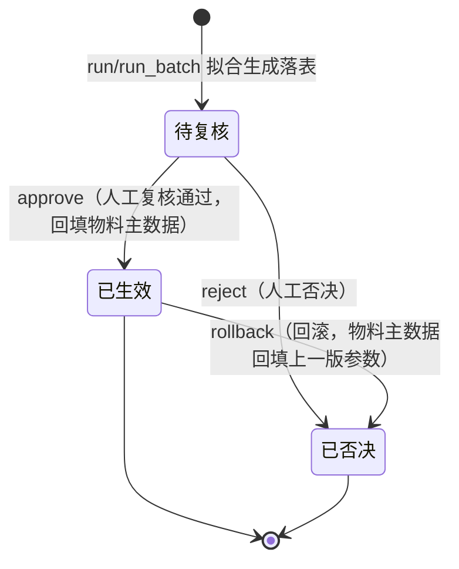

# 策略拟合 · 应用详设

> 应用名：`strategy_fitting` | 类名：`StrategyFitting` | 聚合根：策略拟合
> 输入来源：`app/psc/architecture.md` 聚合根卡 #15 + `app/psc/brd/07-基于历史数据的最佳策略拟合.md`（§7.1~§7.8）
> 数据来源类型：手工参考创建

---

## 1. 需求概览

### 1.1 基本信息
- **需求名称**: 策略拟合——基于历史数据的最佳策略拟合
- **需求编号**: REQ-PSC-FIT-001
- **所属模块**: 产销协同-策略拟合（治理闭环）
- **需求来源**: 业务方（计划/拟合复核人）
- **创建日期**: 2026-08-14
- **优先级**: P1

### 1.2 需求背景
#### 1.2.1 为什么需要这个需求？

预测方法和库存参数在各章只给了「默认值」，但「最优值」因物料而异。用「一刀切的经验值」会导致预测误差偏大、库存水位不合理（要么缺货、要么呆滞/切线频繁）。

#### 1.2.2 期望达到什么目标？

用历史数据**回测拟合**，为每个物料找到最适合的预测方法与库存参数，把「一刀切的经验值」变成「按物料的定制参数」，回填物料主数据作为日常运行的参数来源。

### 1.3 需求范围
#### 1.3.1 包含哪些功能？

发起单物料拟合、整批异步拟合、拟合结果列表/详情查询、人工复核通过（回填物料主数据）、否决、回滚到上一版参数。

#### 1.3.2 不包含哪些功能？

- 不做产能平衡（线下完成，本系统不重复实现，见 architecture D4）
- 不做绩效指标统计（由 ERP/BI 承担）
- 不做拟合任务调度器的底层实现（仅定义 run_batch 接口，队列实现待实施设计确认）

> **数据来源类型**: 手工参考创建 —— 数据引用上游结果（历史干净需求来自 ERP、参数来自 md_material），但由用户**手工决定**何时基于哪些上游数据创建。前端**保留"发起拟合"入口**（run/run_batch），并须明确标注上游数据来源：历史干净需求（ERP `_load_sales_history`）、物料当前参数（`md_material`）。

### 1.4 涉及角色
**谁会使用这个功能？**

- **计划（计划岗）**: 发起月度拟合（单物料/整批），查看拟合结果列表与详情
- **拟合复核人**: 复核拟合结果，执行通过（回填物料主数据）、否决、回滚

---

## 2. 用户故事

### 2.1 核心用户故事

#### 2.1.1 `US-01` 用户故事 — 发起单物料拟合（优先级：P1）

- **故事描述**: 作为计划，我想要对指定物料发起一次策略拟合，以便于得到该物料最优的预测方法与库存参数建议值
- **为何赋予此优先级**：run 是拟合的最小闭环（单物料可独立出结果），是整批拟合与后续复核回填的基础
- **独立测试**：可通过在拟合页面选择某个物料、填入拟合版本后发起拟合，验证预测拟合（选 sMAPE 最小）与库存拟合（约束优化选成本最小）均落表来独立测试
- **前置条件**: 物料在 md_material 中存在；该物料有足够历史干净需求（≥ k_min 期，否则走借用参考）
- **后置条件**: 生成一条状态为「待复核」的拟合结果记录，pred_method/pred_params/smape/service_factor/safety_level/batch_window/fulfill_rate/inv_days/changeover_cnt 已填

**验收场景**：

1. `US-01-AC1` **场景**: 有足够历史的物料拟合成功
   - **Given** 物料 M 有 24 期干净需求且 md_material 有参数，**When** 计划调用 run(M, 202608) 发起拟合，**Then** 系统完成预测拟合+库存拟合，落表 status=待复核，smape/服务系数等字段均已填写

2. `US-01-AC2` **场景**: 数据不足新品走借用参考
   - **Given** 物料 N 历史不足 k_min 期（新品/断点新件），**When** 发起 run(N, 202608)，**Then** 预测拟合跳过网格搜索，直接走借用参考（或断点历史拼接后拟合），pred_method=借用参考

3. `US-01-AC3` **场景**: 物料不存在被拒绝
   - **Given** 系统中不存在 material_no=NOTEXIST，**When** 发起 run(NOTEXIST, 202608)，**Then** 系统拒绝并提示"物料不存在"（跨应用校验 md_material.get 失败）

---

#### 2.1.2 `US-02` 用户故事 — 整批异步拟合（优先级：P1）

- **故事描述**: 作为计划，我想要按月对全部物料整批发起拟合，以便于每月一次性产出全量最优参数建议
- **为何赋予此优先级**：计算量大（SKU 数 × 方法 × 参数组合 × 滚动步），必须进任务队列异步执行，是月度例行治理的核心入口
- **独立测试**：可通过对某 fit_version 调用 run_batch，验证其逐物料（或分批）异步执行、结果离线缓存、不阻塞在线业务来独立测试
- **前置条件**: 当前月度版本已确定；fit_version 合法（YYYYMM）
- **后置条件**: 该版本下所有适用物料逐条生成「待复核」拟合结果记录

**验收场景**：

1. `US-02-AC1` **场景**: 整批拟合入队异步执行
   - **Given** 系统中存在若干正常状态物料，**When** 调用 run_batch(202608)，**Then** 任务入队列逐物料异步执行，返回已受理，各物料拟合结果陆续落表

2. `US-02-AC2` **场景**: 同一版本重复发起幂等
   - **Given** fit_version=202608 已有部分拟合结果，**When** 再次 run_batch(202608)，**Then** 系统对已有结果的物料跳过或覆盖（幂等），不重复计算

---

#### 2.1.3 `US-03` 用户故事 — 查看拟合结果列表（优先级：P1）

- **故事描述**: 作为计划/拟合复核人，我想要按条件筛选查看拟合结果列表，以便于定位待复核或异常的物料
- **为何赋予此优先级**：列表是复核的前置操作，是拟合结果的统一浏览入口
- **独立测试**：可通过进入拟合结果列表页，按物料/版本/状态筛选并验证结果来独立测试
- **前置条件**: 系统中已有拟合结果记录
- **后置条件**: 返回符合条件的拟合结果列表，支持分页

**验收场景**：

1. `US-03-AC1` **场景**: 按状态筛选待复核
   - **Given** 存在待复核/已生效/已否决的拟合结果，**When** 筛选 status=待复核，**Then** 列表仅展示待复核记录

2. `US-03-AC2` **场景**: 按异常标记筛选
   - **Given** 部分拟合结果 abnormal_flag=true（参数跳变过大），**When** 筛选异常标记，**Then** 列表仅展示需人工确认的异常记录

---

#### 2.1.4 `US-04` 用户故事 — 查看拟合结果详情（优先级：P2）

- **故事描述**: 作为计划/拟合复核人，我想要查看单条拟合结果的完整字段，以便于复核时对比当前参数与建议参数、判断是否异常
- **为何赋予此优先级**：详情是复核决策的依据，但可在列表基础上展开，优先级略低于列表
- **独立测试**：可通过点击列表某行进入详情，验证所有字段完整展示来独立测试
- **前置条件**: 目标记录已存在
- **后置条件**: 返回该记录的完整字段

**验收场景**：

1. `US-04-AC1` **场景**: 详情完整展示
   - **Given** 存在拟合结果 fit_version=202608 & material_no=M，**When** 调用 get(202608, M)，**Then** 返回 pred_method/pred_params/smape/服务系数/安全水位/组批窗口/满足率/库存天数/切线次数/status 等完整字段

2. `US-04-AC2` **场景**: 不存在的记录返回错误
   - **Given** 不存在 fit_version=202608 & material_no=NOTEXIST，**When** 调用 get，**Then** 系统提示"拟合结果不存在"

---

#### 2.1.5 `US-05` 用户故事 — 复核通过并回填（优先级：P1）

- **故事描述**: 作为拟合复核人，我想要复核拟合结果并置为已生效，以便于把最优参数回填物料主数据供日常运行使用
- **为何赋予此优先级**：approve 是拟合产出「生效」的唯一通道，回填物料主数据是拟合价值的落地
- **独立测试**：可通过对一条待复核结果执行 approve，验证状态变已生效且 md_material 参数被回填（带版本）来独立测试
- **前置条件**: 目标记录状态为「待复核」；若 abnormal_flag=true 须先人工确认异常
- **后置条件**: 记录状态变「已生效」，md_material 的基线方法/参数/水位/组批窗口被回填（带 fit_version 版本记录）

**验收场景**：

1. `US-05-AC1` **场景**: 正常复核通过回填
   - **Given** 存在待复核记录（abnormal_flag=false），**When** 拟合复核人执行 approve(202608, M)，**Then** 状态变已生效，md_material.set_fit_params 被调用回填参数（带版本）

2. `US-05-AC2` **场景**: 异常记录强制人工确认
   - **Given** 待复核记录 abnormal_flag=true（参数跳变过大），**When** 执行 approve，**Then** 系统要求人工二次确认后才允许生效，未确认则拒绝

3. `US-05-AC3` **场景**: 非待复核状态拒绝通过
   - **Given** 记录状态已为已生效或已否决，**When** 执行 approve，**Then** 系统拒绝并提示状态不允许

---

#### 2.1.6 `US-06` 用户故事 — 否决拟合结果（优先级：P2）

- **故事描述**: 作为拟合复核人，我想要否决不合理/异常且无法接受的拟合结果，以便于不将错误参数回填主数据
- **为何赋予此优先级**：reject 是复核的负向分支，保证错误建议不生效
- **独立测试**：可通过对一条待复核结果执行 reject，验证状态变已否决且不回填来独立测试
- **前置条件**: 目标记录状态为「待复核」
- **后置条件**: 记录状态变「已否决」，物料主数据不被回填

**验收场景**：

1. `US-06-AC1` **场景**: 否决成功
   - **Given** 待复核记录存在，**When** 执行 reject(202608, M)，**Then** 状态变已否决，md_material 未被回填

---

#### 2.1.7 `US-07` 用户故事 — 回滚到上一版参数（优先级：P2）

- **故事描述**: 作为拟合复核人，我想要把已生效的拟合结果回滚到上一版参数，以便于新参数导致缺货/超储恶化时快速退回
- **为何赋予此优先级**：rollback 是拟合生效后的兜底治理手段，保证参数变更可逆
- **独立测试**：可通过对一条已生效结果执行 rollback，验证物料主数据回填上一版参数、本记录作废来独立测试
- **前置条件**: 目标记录状态为「已生效」，且存在上一版已生效参数（历史回填记录）
- **后置条件**: 物料主数据回填上一版参数，本拟合记录标记为已否决（作废）

**验收场景**：

1. `US-07-AC1` **场景**: 回滚成功
   - **Given** 记录已生效且存在上一版参数，**When** 执行 rollback(202608, M)，**Then** md_material 回填上一版参数，本记录状态变已否决

2. `US-07-AC2` **场景**: 无上一版可回滚被拒绝
   - **Given** 记录已生效但无历史版本，**When** 执行 rollback，**Then** 系统拒绝并提示"无上一版参数可回滚"

---

## 3. 业务场景

### 3.1 业务流程描述

#### 3.1.1 场景1: 发起月度拟合
1. 计划进入"策略拟合"页面，点击"发起拟合"（选择单物料或整批）
2. 系统展示上游数据来源标注：历史干净需求（ERP）、物料当前参数（md_material）
3. 计划填写 fit_version（月度 YYYYMM），单物料拟合需选择 material_no
4. 计划提交
5. 系统取该物料近 N 期（如 24 个月）干净需求（断点前后拼接）
6. 系统执行预测拟合：遍历方法×参数网格 → 滚动回测 → 选 sMAPE 最小
7. 系统执行库存拟合：用实际干净需求回放库存推移 → 遍历服务系数×组批窗口 → 满足率约束下选成本最小
8. 系统将拟合结果落表（status=待复核），整批场景异步执行、离线缓存

#### 3.1.2 场景2: 人工复核与回填
1. 拟合复核人进入拟合结果列表，筛选「待复核」
2. 复核人打开详情，对比当前参数与建议参数
3. 若 abnormal_flag=true（参数跳变过大），系统强制人工二次确认
4. 复核人选择「通过」→ 系统调用 md_material.set_fit_params 回填参数（带版本），状态变已生效
5. 复核人选择「否决」→ 状态变已否决，不回填

#### 3.1.3 场景3: 参数回滚
1. 拟合复核人发现已生效的新参数导致缺货/超储恶化
2. 复核人对该记录执行「回滚」
3. 系统回填物料主数据上一版参数，本记录作废

### 3.2 业务规则

#### 3.2.1 `BR-01` 拟合结果行唯一
- **规则描述**: 拟合结果行以 fit_version + material_no 为复合主键，全局唯一
- **适用场景**: run / run_batch 落表
- **示例**: 同一物料在 fit_version=202608 下仅一条拟合结果，重复拟合覆盖（幂等）

#### 3.2.2 `BR-02` 预测拟合与库存拟合完全解耦
- **规则描述**: 预测拟合用滚动回测选「方法×参数」（让基线尽量准）；库存拟合用**实际干净需求回放**选「水位×窗口」（让水位覆盖波动、窗口摊薄切线）。**库存拟合不依赖预测结果**——安全库存 C 覆盖需求波动 σ，预测的残余误差最终也体现为需求波动被 C 一并覆盖；客户预测的系统性偏差由第 3 章置信度 MAPE/bias 在预测层先行修正
- **适用场景**: run 的预测拟合阶段与库存拟合阶段
- **示例**: 库存拟合的回放输入是历史实际干净需求 D[t]，而非预测拟合产出的预测值

#### 3.2.3 `BR-03` 滚动回测 Walk-Forward 只用当时已知数据
- **规则描述**: 对每个 (method, params) 组合，k 从 k_min（最小训练窗口，如 12）滚到 n−1：`train = D[1..k]`，`pred = method.forecast(train, params)`，对比 `D[k+1]`。**只用「当时已知」数据预测「当时未知」未来**，避免用未来数据预测过去的作弊
- **适用场景**: 预测拟合
- **示例**: 预测第 13 期只能用 D[1..12]，不能用到 D[13] 及以后

#### 3.2.4 `BR-04` sMAPE 误差计算（需求为 0 期跳过）
- **规则描述**: 每个滚动步误差 `sMAPE = |pred − D| / ((|pred| + D) / 2)`；`D ≤ 0` 的期跳过，不计入误差；取所有滚动步 sMAPE 的平均为该组合误差。用 sMAPE（对称 MAPE）替代 MAPE：既避免需求为 0 时除零，也消除 MAPE「高估无上限、低估最多 100%」的系统性偏低倾向
- **适用场景**: 预测拟合误差评价
- **计算方式**: `error = mean( sMAPE_k )`，其中 k 遍历所有 D[k+1] > 0 的滚动步
- **示例**: pred=100, D=120 → sMAPE = 20 / 110 ≈ 18.2%；若 D[k+1]=0 则该步跳过

#### 3.2.5 `BR-05` 预测候选方法×参数网格
- **规则描述**: 预测拟合遍历以下「方法×参数」网格：
  - 移动平均 MA：window ∈ {3, 6, 12}
  - 指数平滑 ES：alpha ∈ {0.1, 0.3, 0.5}，trend ∈ {false, true}
  - 阶跃检测：threshold ∈ {0.2, 0.3, 0.5}，confirm_periods ∈ {1, 2, 3}
  - 借用参考：ref_material（人工指定），scale ∈ {0.5, 1.0, 1.5}
- **适用场景**: 预测拟合
- **示例**: ES 方法下组合数为 3(alpha) × 2(trend) = 6 组

#### 3.2.6 `BR-06` 预测拟合取 sMAPE 最小者为最优
- **规则描述**: 遍历「方法×参数」组合各自滚动回测，取平均 sMAPE 最小者作为最优预测方法/参数（pred_method/pred_params）
- **适用场景**: 预测拟合结果选择
- **示例**: 组合 A sMAPE=15%、组合 B sMAPE=20%，选 A

#### 3.2.7 `BR-07` 数据不足跳过网格走借用参考
- **规则描述**: 数据不足的新品/断点新件（历史期数 < k_min 或 < 24 期），跳过网格搜索，直接走「借用参考」（或断点历史拼接后拟合）
- **适用场景**: 预测拟合
- **示例**: 新品历史仅 3 期，无法滚动回测，直接指定 ref_material 借用参考

#### 3.2.8 `BR-08` 库存拟合候选网格
- **规则描述**: 库存拟合遍历以下候选网格：
  - 服务系数：对应满足率 {90%, 95%, 98%, 99%} → {1.28, 1.65, 2.05, 2.33}（标准正态表固定映射）
  - 组批窗口：{2 周, 4 周, 8 周, 12 周, 16 周}
- **适用场景**: 库存拟合
- **示例**: 服务系数×组批窗口 = 4 × 5 = 20 个组合

#### 3.2.9 `BR-09` 库存拟合回放 + warmup 预热期
- **规则描述**: 用实际干净需求回放库存推移，评估参数组合（与预测拟合解耦）：
  ```
  给定（服务系数→C，组批窗口→B；最低 A 由生产+物流时间算出）：
    库存 = 期初库存
    for t in [warmup+1 .. n]:            # warmup 预热期不计入统计
      库存 −= D[t]                        # 实际干净需求消耗
      if 库存 < 0:     缺货量 += −库存; 库存 = 0
      elif 库存 < A:  触发最低补库
      elif 库存 < A+C: 触发安全补库
      if 触发补库: 补货量 = B − 当前库存（补到组批水位 B，假设产能富余）; 切线次数++; 记录 L 期后入库
      库存 += 本期末到期的补货入库
      记录当期库存
    满足率 = 1 − 缺货量/总需求；平均库存 = mean(库存序列)；库存天数 = 平均库存/日均需求
  ```
  **warmup 预热期**（长度 = 一个组批窗口对应的期数）先让库存到稳态、再统计，避免期初库存初始化污染指标。模拟粒度逐日（或逐周）推进，与第 6 章库存推移表一致（逐月粒度会漏掉月内需求集中导致的时点缺货、高估满足率）
- **适用场景**: 库存拟合
- **示例**: 组批窗口 4 周，则 warmup = 4 周对应的期数，这 4 周不进入满足率/库存天数/切线次数统计

#### 3.2.10 `BR-10` 缺货记量不记次、满足率按量计算
- **规则描述**: 缺货**记量不记次**（累计缺货量，而非缺货次数）；满足率 = 1 − 缺货量 / 总需求，与第 1 章「准时交付率/满足率」口径一致
- **适用场景**: 库存拟合回测指标
- **示例**: 总需求 1000、累计缺货量 50 → 满足率 = 1 − 50/1000 = 95%

#### 3.2.11 `BR-11` 约束优化选成本最小
- **规则描述**: 在 `满足率 ≥ 目标（如 95%）` 的候选组合中，选「库存持有成本 + 切线成本」最小者作为最优库存参数（service_factor/safety_level/batch_window）。满足率与库存天然矛盾，采用约束优化框架而非单指标
- **适用场景**: 库存拟合结果选择
- **示例**: 组合 X 满足率 96% 成本 1000、组合 Y 满足率 94% 成本 500，因 Y 不满足约束，选 X

#### 3.2.12 `BR-12` 成本折算公式
- **规则描述**: 成本折算：
  ```
  库存持有成本 = 平均库存 × 单位货值 × 年持有费率
               = 库存天数 × 日均需求 × 单位货值 × 年持有费率
  切线成本     = 切线次数 × (12 ÷ 回测月数) × 每次切线成本
  ```
  其中单位货值、每次切线成本来自物料主数据（md_material），年持有费率来自策略配置
- **适用场景**: 库存拟合成本评价
- **示例**: 库存天数 30、日均需求 10、单位货值 5、年持有费率 20% → 持有成本 = 30×10×5×0.2 = 300

#### 3.2.13 `BR-13` 拟合结果先落表、人工复核通过才回填
- **规则描述**: 拟合结果先落**拟合结果表**（status=待复核），人工复核通过（已生效）才回填物料主数据（基线方法/参数/水位/组批窗口）。拟合与回填分离
- **适用场景**: approve
- **示例**: run 完成后物料主数据未被改动，只有 approve 成功才触发 md_material.set_fit_params

#### 3.2.14 `BR-14` 参数跳变过大自动标记异常强制人工确认
- **规则描述**: 参数相对上月**跳变过大**时自动标记异常（abnormal_flag=true），强制人工确认后方可生效
- **适用场景**: approve（异常记录）
- **计算方式**: 参数突变阈值建议 30%（如 service_factor、batch_window、pred_params 中关键参数相对上月变动 > 30%），实现时做成配置项
- **示例**: 服务系数从 1.65 突变为 2.33（+41%）→ 标记异常，approve 须二次确认

#### 3.2.15 `BR-15` 回填带版本记录、支持回滚
- **规则描述**: 参数回填带版本记录（fit_version + 生效时间），支持**回滚**到上一版参数——若新参数导致缺货/超储恶化，可快速退回
- **适用场景**: approve 回填、rollback
- **示例**: 回填时记录 fit_version=202608 与生效时间；rollback 时按上一版记录回填

#### 3.2.16 `BR-16` 状态机流转约束
- **规则描述**: 拟合结果状态流转须遵循状态机（见 §3.4），非法跳转拒绝
- **适用场景**: approve / reject / rollback
- **示例**: 已否决记录不可再 approve；已生效记录不可再 approve

#### 3.2.17 `BR-17` 物料主数据引用铁律
- **规则描述**: material_no 为物料主数据字段，**来源：md_material**（`md_material.list` 下拉选择），禁止手工录入；run 前须通过 `md_material.get` 校验物料存在
- **适用场景**: run 创建拟合结果
- **示例**: run(NOTEXIST, ...) 因 md_material.get 失败被拒绝

#### 3.2.18 `BR-18` 拟合历史窗口要求
- **规则描述**: 拟合需足够历史（建议 ≥ 24 期）；不足者用借用参考/断点拼接
- **适用场景**: run 数据准备
- **示例**: 历史 24 期可正常拟合；历史 5 期走借用参考

#### 3.2.19 `BR-19` 干净需求剔除一次性脉冲
- **规则描述**: 拟合前剔除一次性脉冲事件，否则脉冲会污染参数（σ、MAPE 均虚高）
- **适用场景**: run 数据准备（经 `_load_sales_history` 取「干净需求」）
- **示例**: 某月一次性促销脉冲不计入拟合历史

### 3.3 业务数据

#### 3.3.1 数据1: 物料号 material_no
- **数据描述**: 被拟合物料的唯一编码，复合主键之一
- **数据类型**: 文本
- **数据来源**: md_material（主数据引用铁律，下拉选择）
- **示例值**: M-10001

#### 3.3.2 数据2: 拟合版本 fit_version
- **数据描述**: 拟合版本（月度 YYYYMM），复合主键之一，标识本次拟合归属的月度版本
- **数据类型**: 文本
- **数据来源**: 用户发起拟合时指定
- **示例值**: 202608

#### 3.3.3 数据3: 最优预测方法/参数 pred_method / pred_params
- **数据描述**: 预测拟合选出的最优方法及其参数（JSON）
- **数据类型**: 枚举值 / 文本(JSON)
- **数据来源**: 预测拟合（滚动回测选 sMAPE 最小）自动计算
- **示例值**: 指数平滑 / {"alpha":0.3,"trend":false}

#### 3.3.4 数据4: 预测误差 smape
- **数据描述**: 最优预测方法的平均 sMAPE 误差
- **数据类型**: 数字
- **数据来源**: 预测拟合自动计算
- **示例值**: 0.152（15.2%）

#### 3.3.5 数据5: 最优库存参数 service_factor / safety_level / batch_window
- **数据描述**: 库存拟合选出的最优服务系数、安全水位 C、组批窗口
- **数据类型**: 数字
- **数据来源**: 库存拟合（约束优化选成本最小）自动计算
- **示例值**: 1.65 / 200 / 4

#### 3.3.6 数据6: 回测指标 fulfill_rate / inv_days / changeover_cnt
- **数据描述**: 最优库存参数组合的回测满足率、库存天数、切线次数
- **数据类型**: 数字
- **数据来源**: 库存拟合回放自动计算
- **示例值**: 0.96 / 30 / 3

#### 3.3.7 数据7: 拟合状态 status
- **数据描述**: 拟合结果的生命周期状态
- **数据类型**: 枚举值
- **数据来源**: 系统自动维护
- **示例值**: 待复核 / 已生效 / 已否决

### 3.4 状态机

存在状态流转，须画状态图和状态清单。

**状态清单**：

| 状态 | 含义 |
|------|------|
| 待复核 | 拟合生成后落表的初始态，等待人工复核 |
| 已生效 | 人工复核通过，参数已回填物料主数据 |
| 已否决 | 人工否决 / 回滚作废，参数未生效或已退回 |

**状态图**：



**状态转换规则矩阵**：

| 当前状态 | 目标状态 | 触发动作 | 前置条件 |
|----------|----------|----------|----------|
| (拟合生成) | 待复核 | run / run_batch | 拟合结果成功落表 |
| 待复核 | 已生效 | approve | 人工复核通过；abnormal_flag=false 或异常已人工二次确认；md_material.set_fit_params 回填成功 |
| 待复核 | 已否决 | reject | 人工否决 |
| 已生效 | 已否决 | rollback | 存在上一版已生效参数；md_material 回填上一版参数成功 |

> 说明：rollback 后本拟合记录标记为「已否决」（作废），物料主数据回填上一版参数。architecture 卡仅定义「待复核/已生效/已否决」三态，故回滚的落点复用「已否决」表达「本版作废」，不新增第四态。

---

## 4. 功能描述

### 4.1 功能清单

| 一级菜单/模块 | 一级编号 | 二级菜单/模块 | 二级编号 | 三级功能 | 三级编号 | 功能类型 | 优先级 | 三级功能简述 |
|---|---|---|---|---|---|---|---|---|
| 策略拟合 | F01 | 策略拟合 | F01-01 | 发起拟合（单物料） | FUNC-01 | 表单页 | P1 | run：对指定物料执行预测拟合+库存拟合 |
| 策略拟合 | F01 | 策略拟合 | F01-01 | 整批拟合 | FUNC-02 | 定时任务 | P1 | run_batch：整批异步拟合（任务队列） |
| 策略拟合 | F01 | 策略拟合 | F01-01 | 拟合结果列表 | FUNC-03 | 列表页 | P1 | list：按物料/版本/状态筛选拟合结果 |
| 策略拟合 | F01 | 策略拟合 | F01-01 | 拟合结果详情 | FUNC-04 | 详情页 | P2 | get：查看单条拟合结果完整字段 |
| 策略拟合 | F01 | 策略拟合 | F01-01 | 复核通过 | FUNC-05 | 表单页 | P1 | approve：人工复核通过→回填物料主数据 |
| 策略拟合 | F01 | 策略拟合 | F01-01 | 否决 | FUNC-06 | 表单页 | P2 | reject：否决拟合结果 |
| 策略拟合 | F01 | 策略拟合 | F01-01 | 回滚 | FUNC-07 | 表单页 | P2 | rollback：回滚到上一版参数 |

### 4.2 功能模块结构图

```
策略拟合 F01
└── 策略拟合 F01-01
    ├── FUNC-01 发起拟合（单物料）（表单页，P1）
    ├── FUNC-02 整批拟合（定时任务，P1）
    ├── FUNC-03 拟合结果列表（列表页，P1）
    ├── FUNC-04 拟合结果详情（详情页，P2）
    ├── FUNC-05 复核通过（表单页，P1）
    ├── FUNC-06 否决（表单页，P2）
    └── FUNC-07 回滚（表单页，P2）
```

### 4.3 功能详细说明

#### 4.3.1 F01-01 策略拟合

##### 4.3.1.1 FUNC-01 发起拟合（单物料）

**功能描述**:
对指定物料执行一次策略拟合（预测拟合 + 库存拟合），结果落表（待复核）。此为手工参考创建——前端保留"发起拟合"入口，须标注上游数据来源（历史干净需求来自 ERP、参数来自 md_material）。

**用户操作流程**:
1. 用户进入"策略拟合"页面，点击"发起拟合"
2. 系统展示上游数据来源标注：历史干净需求（ERP `_load_sales_history`）、物料当前参数（`md_material`）
3. 用户填写 fit_version（必填，YYYYMM）、选择 material_no（必填，md_material.list 下拉）
4. 用户提交
5. 系统调用 md_material.get(material_no) 校验物料存在，取单位货值/切线成本/生产物流时间/当前参数
6. 系统调用 `_load_sales_history(material_no, 近 N 期)` 取历史干净需求（断点前后拼接、剔除一次性脉冲）
7. 系统执行预测拟合：statsforecast 统计模型池（常规 AutoTheta/AutoARIMA/AutoETS，间歇 Croston/TSB，按非零占比分流）→ cross_validation 滚动回测 → 逐序列按 MASE 选 winner → winner 全量 refit → predict(h=1) 出下月预测 + 80% 区间
8. 系统执行库存拟合：实际干净需求回放 → 遍历服务系数×组批窗口 → 满足率约束下选成本最小
9. 系统落表拟合结果，status=待复核

**输入数据**:
- material_no: 物料号 - 必填，来源 md_material.list 下拉 - 示例：M-10001
- fit_version: 拟合版本 - 必填，YYYYMM - 示例：202608

**输出数据**:
- 拟合结果记录: fit_version + material_no 定位，含 pred_method/pred_params/smape/service_factor/safety_level/batch_window/fulfill_rate/inv_days/changeover_cnt，status=待复核
- 错误消息: "物料不存在" / "拟合历史不足，已走借用参考"（提示非错误）

**业务规则**:
- BR-01: fit_version + material_no 唯一
- BR-02: 预测拟合与库存拟合解耦
- BR-03/BR-04/BR-05/BR-06/BR-07: 预测拟合算法（Walk-Forward、sMAPE、网格、取最小、数据不足借用参考）
- BR-08/BR-09/BR-10/BR-11/BR-12: 库存拟合算法（网格、回放、warmup、满足率、约束优化、成本折算）
- BR-17: material_no 主数据引用铁律
- BR-18/BR-19: 历史窗口要求、干净需求

**特殊处理**:
- 跨应用调用：`md_material.get(material_no)` 取参数；`_load_sales_history` 适配器取历史干净需求
- 数据不足新品/断点新件跳过网格搜索，直接走借用参考（或断点历史拼接后拟合）
- 计算量大，run_batch 场景须异步执行（见 FUNC-02）

**业务实体**:
- **StrategyFitting**: 拟合结果，标识为 fit_version + material_no，承载预测拟合与库存拟合的产出

**StrategyFitting 字段**

| 字段名称 | 字段类型 | 是否必填 | 默认值 | 业务逻辑 |
|---|---|---|---|---|
| material_no | 文本 | 是 | - | 物料号，复合主键之一；来源：md_material.list 下拉选择（BR-17），禁止手工录入 |
| fit_version | 文本 | 是 | - | 拟合版本 YYYYMM，复合主键之一 |
| pred_method | 枚举值 | 否 | - | 最优预测方法：移动平均/指数平滑/阶跃检测/借用参考；预测拟合完成后回填 |
| pred_params | 文本 | 否 | - | 最优预测参数 JSON（如 {"alpha":0.3,"trend":false}）；预测拟合完成后回填 |
| smape | 数字 | 否 | - | 预测误差 sMAPE（BR-04），预测拟合完成后回填 |
| service_factor | 数字 | 否 | - | 最优服务系数（BR-08），库存拟合完成后回填 |
| safety_level | 数字 | 否 | - | 最优安全水位 C，库存拟合完成后回填 |
| batch_window | 数字 | 否 | - | 最优组批窗口（天存储/周展示），库存拟合完成后回填 |
| fulfill_rate | 数字 | 否 | - | 回测满足率 = 1 − 缺货量/总需求（BR-10） |
| inv_days | 数字 | 否 | - | 回测库存天数（BR-09） |
| changeover_cnt | 数字 | 否 | - | 回测切线次数（BR-09） |
| abnormal_flag | 布尔值 | 否 | false | 参数跳变过大异常标记（BR-14）；true 时 approve 须人工二次确认 |
| status | 枚举值 | 是 | 待复核 | 待复核/已生效/已否决（BR-16 状态机） |

---

##### 4.3.1.2 FUNC-02 整批拟合

**功能描述**:
按 fit_version 对全部正常状态物料整批发起拟合，逐物料（或分批）异步执行，结果离线缓存，不阻塞在线业务。

**用户操作流程**:
1. 用户点击"整批拟合"
2. 用户填写 fit_version（必填，YYYYMM）
3. 系统将任务入队列，逐物料（或分批）异步执行（复用 FUNC-01 的 run 逻辑）
4. 各物料拟合结果陆续落表（status=待复核）
5. 系统返回已受理状态与执行进度

**输入数据**:
- fit_version: 拟合版本 - 必填，YYYYMM - 示例：202608

**输出数据**:
- 受理回执 + 批量执行进度（成功数/失败数/错误明细）
- 逐物料拟合结果记录（异步落表）

**业务规则**:
- BR-01: 每个物料的 fit_version + material_no 唯一
- 其余算法规则同 FUNC-01（BR-02~BR-19）

**特殊处理**:
- 幂等：同 fit_version 已有结果的物料跳过或覆盖，不重复计算
- 任务队列实现（定时/手动触发、队列技术选型）待实施设计确认（architecture Q5）

**业务实体**:
- **StrategyFitting**: 同 FUNC-01

---

##### 4.3.1.3 FUNC-03 拟合结果列表

**功能描述**:
提供拟合结果分页列表，支持按物料号、拟合版本、状态、异常标记筛选。

**用户操作流程**:
1. 用户进入"拟合结果"列表页
2. 用户可选填写筛选条件：material_no（模糊）、fit_version（精确）、status（精确）、abnormal_flag（布尔）
3. 用户点击"查询"
4. 系统返回符合条件的拟合结果列表（分页）

**输入数据**:
- material_no: 物料号 - 选填，模糊匹配 - 示例：M-10
- fit_version: 拟合版本 - 选填，精确 - 示例：202608
- status: 状态 - 选填，待复核/已生效/已否决 - 示例：待复核
- abnormal_flag: 异常标记 - 选填，布尔 - 示例：true
- page/size: 分页 - 默认 1/20

**输出数据**:
- 列表字段: material_no, fit_version, pred_method, smape, service_factor, batch_window, fulfill_rate, status, abnormal_flag
- 分页信息: total, page, size

**业务规则**:
- 筛选条件均为可选，AND 关系
- material_no 支持模糊匹配

**特殊处理**:
- 默认按 fit_version 降序、material_no 升序排列

**业务实体**:
- **StrategyFitting**: 同 FUNC-01

---

##### 4.3.1.4 FUNC-04 拟合结果详情

**功能描述**:
查看单条拟合结果的完整字段，供复核人对比当前参数与建议参数。

**用户操作流程**:
1. 用户在列表页点击目标行
2. 系统返回该记录完整字段（含 pred_params JSON 展开、回测三指标、异常标记）

**输入数据**:
- fit_version: 拟合版本 - 必填
- material_no: 物料号 - 必填

**输出数据**:
- 完整拟合结果字段（同 StrategyFitting 字段表）
- 错误消息: "拟合结果不存在"

**业务规则**:
- BR-01: fit_version + material_no 定位唯一记录

**特殊处理**:
- pred_params 为 JSON，详情页可展开为可读形式

**业务实体**:
- **StrategyFitting**: 同 FUNC-01

---

##### 4.3.1.5 FUNC-05 复核通过

**功能描述**:
拟合复核人对「待复核」结果执行通过，置为「已生效」并回填物料主数据（带版本）。

**用户操作流程**:
1. 复核人在详情页点击"通过"
2. 系统检查 status=待复核；若 abnormal_flag=true，弹出异常提示要求二次确认
3. 复核人确认
4. 系统调用 md_material.set_fit_params(material_no, base_method, base_params, batch_window, service_level, fit_version) 回填参数（带版本记录）
5. 系统置 status=已生效

**输入数据**:
- fit_version: 拟合版本 - 必填
- material_no: 物料号 - 必填
- （异常场景）人工二次确认标记

**输出数据**:
- 回填结果 + 记录状态变已生效
- 错误消息: "仅待复核状态可生效" / "参数跳变过大，需人工确认" / "回填失败"

**业务规则**:
- BR-13: 先落表、复核通过才回填
- BR-14: 参数跳变过大强制人工确认
- BR-15: 回填带版本可回滚
- BR-16: 状态机流转约束

**特殊处理**:
- 跨应用调用：`md_material.set_fit_params(...)` 回填参数
- 回填内容：基线方法/参数（pred_method/pred_params）、组批窗口（batch_window）、服务系数/满足率目标（service_factor/service_level）、安全水位（safety_level）

**业务实体**:
- **StrategyFitting**: 同 FUNC-01
- **MdMaterial**: 回填目标，接收 set_fit_params 回填参数

---

##### 4.3.1.6 FUNC-06 否决

**功能描述**:
拟合复核人对「待复核」结果执行否决，置为「已否决」，不回填物料主数据。

**用户操作流程**:
1. 复核人在详情页点击"否决"
2. 系统检查 status=待复核
3. 系统置 status=已否决

**输入数据**:
- fit_version: 拟合版本 - 必填
- material_no: 物料号 - 必填
- 否决原因: 文本 - 选填

**输出数据**:
- 记录状态变已否决
- 错误消息: "仅待复核状态可否决"

**业务规则**:
- BR-13: 否决不回填
- BR-16: 状态机流转约束

**特殊处理**:
- 无

**业务实体**:
- **StrategyFitting**: 同 FUNC-01

---

##### 4.3.1.7 FUNC-07 回滚

**功能描述**:
拟合复核人对「已生效」结果执行回滚，物料主数据回填上一版参数，本记录作废。

**用户操作流程**:
1. 复核人在详情页点击"回滚"
2. 系统检查 status=已生效且存在上一版已生效参数
3. 系统调用 md_material.set_fit_params 回填上一版参数
4. 系统置 status=已否决（本版作废）

**输入数据**:
- fit_version: 拟合版本 - 必填
- material_no: 物料号 - 必填

**输出数据**:
- 回滚结果 + 记录状态变已否决
- 错误消息: "仅已生效状态可回滚" / "无上一版参数可回滚"

**业务规则**:
- BR-15: 回填带版本、支持回滚
- BR-16: 状态机流转约束

**特殊处理**:
- 跨应用调用：`md_material.set_fit_params(...)` 回填上一版参数
- 依赖历史回填记录（带版本的参数快照）定位上一版

**业务实体**:
- **StrategyFitting**: 同 FUNC-01
- **MdMaterial**: 回填目标，回填上一版参数

---

## 5. 权限要求

### 5.1 功能权限

| 功能名称 | 权限标识 | 计划 | 拟合复核人 |
|---|---|---|---|
| 发起拟合（单物料） | `psc:strategy_fitting:run` | 可访问 | 可访问 |
| 整批拟合 | `psc:strategy_fitting:run_batch` | 可访问 | 不可访问 |
| 拟合结果列表 | `psc:strategy_fitting:query` | 可访问 | 可访问 |
| 拟合结果详情 | `psc:strategy_fitting:get` | 可访问 | 可访问 |
| 复核通过 | `psc:strategy_fitting:approve` | 不可访问 | 可访问 |
| 否决 | `psc:strategy_fitting:reject` | 不可访问 | 可访问 |
| 回滚 | `psc:strategy_fitting:rollback` | 不可访问 | 可访问 |

### 5.2 数据权限

#### 5.2.1 角色1: 计划
- 可发起拟合（单物料/整批），查看所有物料的拟合结果列表与详情
- 不可执行复核通过/否决/回滚

#### 5.2.2 角色2: 拟合复核人
- 可查看所有物料的拟合结果列表与详情，执行复核通过/否决/回滚
- 可发起单物料拟合，不可发起整批拟合

---

## 6. 验收标准

### 6.1 功能验收标准

#### 6.1.1 标准1: 预测拟合算法正确性
- **关联用户故事**: US-01
- **关联业务规则**: BR-03, BR-04, BR-05, BR-06
- **验证方式**: 给定已知历史序列，独立复算各方法×参数组合的滚动回测 sMAPE，比对系统选出的最优组合
- **测试数据**: 某物料 24 期干净需求（含若干 D=0 期）
- **预期结果**: 系统遍历网格、Walk-Forward 只用当时已知数据、D=0 期跳过、取 sMAPE 最小者为 pred_method/pred_params

#### 6.1.2 标准2: 库存拟合算法正确性
- **关联用户故事**: US-01
- **关联业务规则**: BR-08, BR-09, BR-10, BR-11, BR-12
- **验证方式**: 给定已知需求与参数，独立复算回放（含 warmup、缺货记量、满足率、成本），比对系统选出的最优组合
- **测试数据**: 某物料 24 期干净需求，服务系数×组批窗口 20 组
- **预期结果**: warmup 不计入统计、缺货记量不记次、满足率=1−缺货量/总需求、在满足率≥目标下选成本最小

#### 6.1.3 标准3: 拟合结果先落表、复核通过才回填
- **关联用户故事**: US-01, US-05
- **关联业务规则**: BR-13, BR-15, BR-16
- **验证方式**: 依次执行 run → 检查主数据未变 → approve → 检查主数据已回填（带版本）
- **测试数据**: material_no=M, fit_version=202608
- **预期结果**: run 后 status=待复核且主数据未变；approve 后 status=已生效且 md_material 参数被回填（带 fit_version 版本记录）

#### 6.1.4 标准4: 参数跳变异常强制确认
- **关联用户故事**: US-05
- **关联业务规则**: BR-14
- **验证方式**: 构造服务系数跳变 > 阈值（如 1.65→2.33）的拟合结果，执行 approve
- **测试数据**: service_factor 上月 1.65、本月 2.33
- **预期结果**: abnormal_flag=true，approve 被拦截要求人工二次确认，确认后生效

#### 6.1.5 标准5: 状态机与回滚
- **关联用户故事**: US-05, US-06, US-07
- **关联业务规则**: BR-15, BR-16
- **验证方式**: 对已生效记录执行 rollback，对已否决记录执行 approve
- **测试数据**: material_no=M, fit_version=202608（已生效且有上一版）
- **预期结果**: rollback 后主数据回填上一版、本记录变已否决；已否决记录 approve 被拒绝

### 6.2 非功能验收标准
**性能要求**: 拟合为异步离线计算，不阻塞在线业务；单物料拟合在历史 24 期内可接受时长内完成（具体阈值待实施设计确认）
**安全性要求**: 拟合结果落表后不回填，仅拟合复核人有 approve/reject/rollback 权限
**兼容性要求**: 支持 Chrome、Edge 浏览器

### 6.3 已知问题或限制
- 拟合触发与调度（定时/手动）及任务队列实现待实施设计确认（architecture Q5）
- 拟合历史窗口 N=24、最小训练窗口 k_min=12、参数突变阈值 30% 属「待定默认值」，实现时做成配置项（BRD §8.8）
- 借用参考的 ref_material 由人工指定，不在自动网格内
- abnormal_flag 字段承载异常标记（BRD §7.8.5 隐含），architecture 卡核心属性未显式列出，字段落点待确认

---

## 7. 参考资料

### 7.1 相关文档
- `app/psc/architecture.md` - 聚合根卡 #15 策略拟合
- `app/psc/brd/07-基于历史数据的最佳策略拟合.md` - §7.1 定位 / §7.2 两大对象 / §7.3 滚动回测 / §7.4 预测拟合 / §7.5 库存拟合 / §7.6 流程 / §7.7 注意事项 / §7.8 系统实现机制
- `app/psc/brd/08-管理系统设计实现.md` - §8.8 可配置参数清单（年持有费率、参数突变阈值、N/k_min）

### 7.2 相关功能
- `md_material` - 物料主数据：拟合的当前参数来源与回填目标（基线方法/参数、水位/组批窗口）
- `inventory_strategy` - 库存策略：拟合回填的水位/窗口参数在月度运行时被其消费
- `sales_forecast` - 销售预测：拟合回填的基线方法/参数在其 calc_baseline 时被消费

### 7.3 外部依赖
- `md_material.get(material_no)` - run 取单位货值/切线成本/生产物流时间/当前参数，校验物料存在
- `md_material.set_fit_params(material_no, base_method, base_params, batch_window, service_level, fit_version)` - approve 回填参数（带版本）、rollback 回填上一版参数
- `_load_sales_history(material_no, 近 N 期)` - ERP 适配器，取历史干净需求（非聚合，外部系统访问）

### 7.4 备注
- 本应用数据来源类型为「手工参考创建」：前端保留"发起拟合"入口，须标注上游数据来源（历史干净需求 ERP / 参数 md_material）
- 主数据引用铁律：material_no 来源 md_material，禁止手工录入（BR-17）
- 拟合结果与回填分离：先落表、人工复核通过（已生效）才回填物料主数据，回填带版本可回滚
- 拟合结果表被引用矩阵（architecture.md）：strategy_fitting 仅弱引用 md_material（material_no），无其他业务聚合引用本应用
