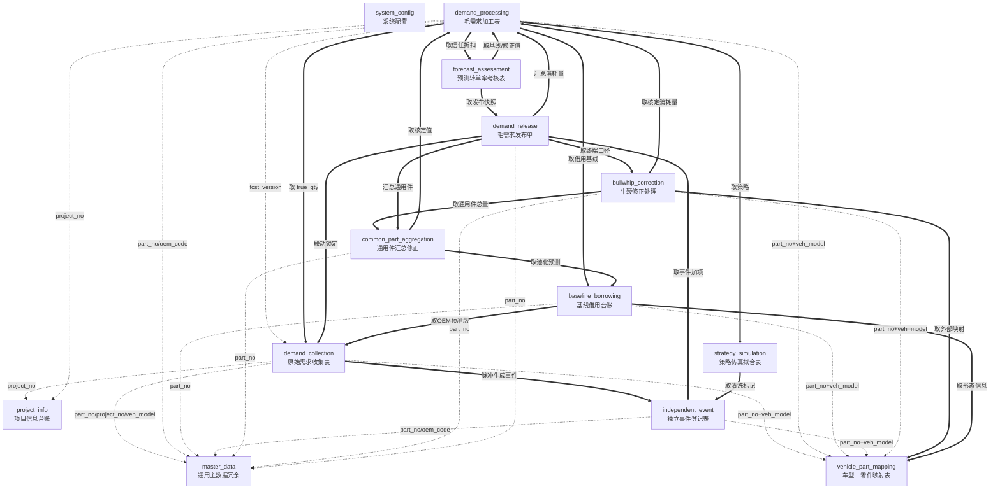

# sales-forecast 应用组 · 架构设计（聚合根识别）

> **产出步骤**：第①步 `fde-aggregate-identification`
> **输入**：`app/sales-forecast/brd/毛需求管理详设.md`（11 张单据 + 完整详设）
> **日期**：2026-08-08

---

## ① 聚合根清单总表

| # | 聚合根 | 应用名 | 类名 | 一句话定义 | 标识 | 是否主数据 |
|---|--------|--------|------|-----------|------|----------|
| 1 | 项目信息台账 | `project_info` | `ProjectInfo` | 毛需求加工的主数据底座，记录项目×零件的六维属性与生命周期 | `project_no` + `part_no` | 是 |
| 2 | 车型—零件映射表 | `vehicle_part_mapping` | `VehiclePartMapping` | 车型级外部数据到零件级的桥接，量纲（单车用量/份额）的权威源 | `part_no` + `veh_model` | 是 |
| 3 | 主机厂原始需求收集表 | `demand_collection` | `DemandCollection` | 毛需求加工链入口，OEM 滚动预测的版本化收集与信号拆解 | `collect_no` | 否 |
| 4 | 毛需求加工表 | `demand_processing` | `DemandProcessing` | 加工链总账：统计基线→销售修正→修正核对，产出核定毛需求 | `proc_batch` | 否 |
| 5 | 基线借用台账 | `baseline_borrowing` | `BaselineBorrowing` | 历史不足零件的基线例外登记，保证"借来的基线"可复核可回溯 | `jy_no` | 否 |
| 6 | 独立事件登记表 | `independent_event` | `IndependentEvent` | 水位脉冲/断点/其他一次性事件的独立加项载体 | `event_no` | 否 |
| 7 | 通用件汇总修正表 | `common_part_aggregation` | `CommonPartAggregation` | 通用件跨销售汇总去重，总部计划对总量负责 | `agg_no` | 否 |
| 8 | 牛鞭修正处理表 | `bullwhip_correction` | `BullwhipCorrection` | 发布前最后一道口径修正：派生需求→终端口径，锚定 OEM 消耗 | `bw_no` | 否 |
| 9 | 毛需求发布单 | `demand_release` | `DemandRelease` | 加工链终点，冻结口径 R 版下达，净需求/S&OP 的唯一输入 | `rel_no` | 否 |
| 10 | 策略仿真拟合表 | `strategy_simulation` | `StrategySimulation` | 基线方法的"军火库"：回测选优，为每个物料选定预测策略与参数 | `fit_no` | 否 |
| 11 | 预测转单率考核表 | `forecast_assessment` | `ForecastAssessment` | 事后闭环：转单率+FVA+归因，反哺信任折扣/策略/参数 | `fa_no` | 否 |
| 12 | 通用主数据 | `master_data` | `MasterData` | 五类外部主数据的本地冗余（客户/物料/车型/用户/日历）+ 域扩展属性 | 各表独立 PK | 是 |
| 13 | 系统配置 | `system_config` | `SystemConfig` | 参数配置表 + 沉淀库（模板/类比/信任折扣）+ 外部数据源台账 | 各表独立 PK | 是 |

> **共 13 个聚合根 = 13 个 FDE 应用。**
> 其中 #1–#2 为域内主数据底座；#3–#9 为加工链主线（D03→D04→D07→D08→D09）+ 旁路支撑（D05/D06/D10）+ 闭环（D12）；#12–#13 为通用基础设施。

---

## ② 聚合根卡

### 聚合根 1：项目信息台账

```
应用名 / 类名：project_info / ProjectInfo
业务定义：毛需求加工的主数据底座。记录项目×零件的客户/产品/车型/量纲/生命周期/责任人六维属性，
         项目阶段决定需求去向（进行中→近端毛需求；待定点/定点中→长期产能规划）。
标识（主键）：project_no + part_no（联合业务键）

核心属性：
  - project_no: 文本 — 项目号
  - part_no: 文本 — 零件号（引用物料主数据）
  - stage: 枚举 — 待定点/定点中/进行中/EOP关闭
  - award_prob: 数字(%) — 定点概率（待定点/定点中项目用）
  - oem_code: 文本 — 客户编码
  - plant_code: 文本 — OEM 工厂
  - veh_model: 文本 — 车型
  - platform: 文本 — 平台
  - part_kind: 枚举 — 专用/通用
  - usage: 数字 — 单车用量（引用展示，权威源在 D02）
  - share: 数字(%) — 供应份额（引用展示，权威源在 D02）
  - sop: 日期 — SOP
  - eop: 日期 — EOP
  - lc_shape: 枚举 — 传统/上市高后下滑
  - owner_sales: 文本 — 责任销售（用户编号）

对外操作（将成公共方法）：
  - create(project_no, part_no, ...) — 新建项目-零件关联
  - get(project_no, part_no) — 获取详情
  - list(stage, oem_code, owner_sales, ...) — 按条件列表
  - update(project_no, part_no, ...) — 更新属性（含阶段迁移）
  - set_stage(project_no, part_no, new_stage, reason) — 阶段迁移（记录变更日志）

关键不变量（界定一致性边界）：
  - 项目×零件组合唯一（同一项目下同一零件不可重复登记）
  - 阶段迁移必须记录变更日志（旧阶段/新阶段/操作人/时点/原因）
  - 通用件必须关联 ≥2 客户或显式标记"单一客户通用"

引用的聚合（by ID 弱引用）：
  - master_data.md_customer.oem_code
  - master_data.md_part.part_no
  - master_data.md_vehicle.veh_model
  - vehicle_part_mapping.usage / vehicle_part_mapping.share（量纲权威源）

跨应用调用（self.fde.call）：
  - 无（被全部过程单据引用，属于被调方）

状态机：
  (新建) --定点立项--> 定点中 --获得定点--> 进行中 --EOP--> EOP关闭
  待定点 --定点立项--> 定点中
  任意阶段 --年型/改款--> 记录变更日志（阶段不变）
```

### 聚合根 2：车型—零件映射表

```
应用名 / 类名：vehicle_part_mapping / VehiclePartMapping
业务定义：车型级外部数据到零件级的桥接载体。单车用量与供应份额的权威源（单一权威原则），
         含量纲历史版本子表，支撑因果推演路径（车型需求×单车用量×份额=零件毛需求）。
标识（主键）：part_no + veh_model（联合业务键）

核心属性：
  - part_no: 文本 — 零件号
  - veh_model: 文本 — 车型
  - platform: 文本 — 平台（上移预测/池化层级参照）
  - usage: 数字 — 单车用量（权威源）
  - share: 数字(%) — 供应份额（权威源）
  - lc_stage: 枚举 — 爬坡/成熟/衰退/EOP临近
  - lc_shape: 枚举 — 传统/上市高后下滑
  - sop: 日期 — SOP
  - eop: 日期 — EOP（计划）
  - status: 枚举 — 生效/停用
  - source: 文本 — 映射依据（BOM/设变通知/商务确认）

对外操作（将成公共方法）：
  - create(part_no, veh_model, ...) — 新建映射
  - get(part_no, veh_model) — 获取映射详情
  - list(part_no, veh_model, lc_stage, ...) — 按条件列表
  - update(part_no, veh_model, ...) — 更新映射属性
  - set_usage(part_no, veh_model, new_usage, effective_date, basis) — 变更单车用量（生成历史版本）
  - set_share(part_no, veh_model, new_share, effective_date, basis) — 变更供应份额（生成历史版本）
  - get_usage_history(part_no, veh_model) — 查询量纲历史版本
  - disable(part_no, veh_model, reason) — 停用映射

关键不变量（界定一致性边界）：
  - 零件×车型组合唯一
  - 量纲字段（用量/份额）变更必须生成历史版本（旧版本按生效期间保留），不可覆盖
  - 进行中项目零件必须有生效映射行（映射完备性）

引用的聚合（by ID 弱引用）：
  - master_data.md_part.part_no
  - master_data.md_vehicle.veh_model

跨应用调用（self.fde.call）：
  - 无（被 D03/D04/D05/D08/D10 引用，属于被调方）

状态机：生效 ←→ 停用（设变替代）
```

### 聚合根 3：主机厂原始需求收集表

```
应用名 / 类名：demand_collection / DemandCollection
业务定义：毛需求加工链的流程入口（步骤1）。记录 OEM 各期滚动预测的版本化收集，
         承载信号拆解（滤噪声/剥脉冲/留真实消耗），拆解结果随版本冻结。
         三层结构：收集单头（D03-H）→ 收集明细（D03-D，纵表）→ 拆解快照（D03-S）。
标识（主键）：collect_no（编码规则 COL-YYYYMM-NNN）

核心属性：
  - collect_no: 文本 — 收集单号 PK
  - oem_code: 文本 — 客户编码
  - plant_code: 文本 — OEM 工厂
  - fcst_version: 文本 — 预测版本 V+YYYYMM(.x)
  - base_period: 文本 — 锚定期间 YYYY-MM
  - demand_type: 枚举 — 月度滚动预测/年度需求
  - source_channel: 枚举 — EDL/EDI·OEM门户·邮件Excel·销售转录
  - recv_date: 日期 — 接收日期
  - collector: 文本 — 收集人（用户编号）
  - status: 枚举 — 草稿/已拆解/已锁定/已替代
  - prev_version: 文本 — 上一版本号
  - remark: 文本 — 备注

明细层（D03-D，纵表存储 零件×期间）：
  - line_no: 整数 — 明细行号
  - part_no: 文本 — 零件号
  - project_no: 文本 — 项目号
  - veh_model: 文本 — 客户车型
  - proj_stage: 枚举 — 项目阶段
  - period: 文本 — 期间 YYYY-MM
  - orig_qty: 数字 — 原始需求量（录入后永不修改）
  - uom: 枚举 — 计量单位
  - data_flag: 枚举 — 正常/OEM未提供

拆解快照层（D03-S，1:1 对应明细行）：
  - noise_adj: 数字 — 噪声调整量（带符号，跨期总额守恒）
  - pulse_qty: 数字 — 水位脉冲量（带符号）
  - true_qty: 数字 — 真实消耗量（=orig_qty−pulse_qty−noise_adj）
  - has_pulse: 布尔 — 是否有脉冲
  - event_no: 文本 — 关联事件号（FK→D06）
  - method: 枚举 — 拆解方法
  - basis: 文本 — 拆解依据
  - decomposer: 文本 — 拆解人
  - decompose_date: 日期 — 拆解日期

对外操作（将成公共方法）：
  - create(oem_code, plant_code, fcst_version, base_period, ...) — 新建收集单头
  - add_lines(collect_no, [(part_no, project_no, veh_model, period, orig_qty, ...)]) — 批量录入明细
  - get(collect_no) — 获取收集单（含明细+拆解快照）
  - list(oem_code, fcst_version, status, ...) — 按条件列表
  - set_decomposition(collect_no, line_no, period, noise_adj, pulse_qty, method, basis, ...) — 记录拆解结果
  - confirm_decomposition(collect_no) — 拆解确认（草稿→已拆解）
  - lock(collect_no) — 锁定（已拆解→已锁定，由发布联动触发）
  - supersede(collect_no, new_collect_no) — 版本替代
  - cancel(collect_no, reason) — 作废（须填原因）
  - version_diff(collect_no) — 版本比对（V_n vs V_{n-1} 逐零件×期间差异）

关键不变量（界定一致性边界）：
  - 收集单头+明细行+拆解快照同事务落库（三层属于同一聚合，明细行为值对象）
  - orig_qty 录入后永不修改，任何改动必须产生新版本（快照不可变）
  - 拆解恒等式强制：true_qty = orig_qty − pulse_qty − noise_adj（系统强制，不可绕过）
  - 客户+工厂+预测版本唯一（同一客户/工厂/版本不可重复收集）
  - "OEM未提供"期间不拆解不补0，显式标记保留

引用的聚合（by ID 弱引用）：
  - master_data.md_customer.oem_code
  - master_data.md_part.part_no
  - project_info.project_no
  - vehicle_part_mapping.part_no + veh_model
  - independent_event.event_no（拆解快照回写）

跨应用调用（self.fde.call）：
  - confirm_decomposition → 调 independent_event.create（脉冲确认后生成事件）
  - get → 调 project_info.get（校验项目阶段）

状态机：
  草稿 --拆解确认--> 已拆解 --D09 R版发布--> 已锁定
  草稿 --作废--> (终止)
  已拆解/已锁定 --新版本替代--> 已替代
```

### 聚合根 4：毛需求加工表

```
应用名 / 类名：demand_processing / DemandProcessing
业务定义：加工链总账（步骤2–4）。记录"统计基线→销售修正→修正核对"全过程，
         承载调整登记三件套（原因类别+数据依据+责任人），产出核定毛需求（消耗口径）。
         五层结构：加工单头(D04-H) + 基线明细(D04-B) + 修正明细(D04-A) + 核对明细(D04-C) + 调整登记(D04-L)。
标识（主键）：proc_batch（编码规则 PRC-YYYYMM-NNN）

核心属性（单头 D04-H）：
  - proc_batch: 文本 — 加工批次号 PK
  - oem_code: 文本 — 客户编码
  - plant_code: 文本 — OEM 工厂
  - fcst_version: 文本 — 绑定的收集 V 版本
  - status: 枚举 — 进行中/全部核定/已锁定
  - start_time: 时间 — 批次创建时间
  - finish_time: 时间 — 全部核定时间

基线明细（D04-B，零件×车型×期间）：
  - part_no / veh_model / period — 粒度
  - base_qty: 数字 — 统计基线值
  - base_path: 枚举 — 时序外推/因果推演/借用
  - base_method: 文本 — 基线方法+参数
  - source_ref: 文本 — D10 策略单号 或 D05 借用单号
  - causal_qty: 数字 — 路径B 因果参考值
  - deviation: 数字 — 交叉偏差 |A−B|/A
  - deviation_reason: 文本 — 超阈原因
  - generator: 文本 — 生成人
  - gen_time: 时间 — 生成时间

修正明细（D04-A，零件×车型×期间，当前值）：
  - base_qty: 数字 — 基线快照
  - adj_qty: 数字 — 销售修正值
  - adj_delta: 数字 — 修正幅度
  - adj_pct: 数字 — 幅度率
  - adj_reason_cat: 枚举 — 原因类别（客户侧情报/份额量纲/生命周期/节奏/外部验证背离/水位校准/其他）
  - adj_evidence: 文本 — 数据依据
  - adj_owner: 文本 — 责任人
  - submit_status: 枚举 — 待提交/已提交/逾期

核对明细（D04-C，零件×车型×期间×轮次）：
  - chk_round: 整数 — 核对轮次
  - chk_result: 枚举 — 通过/退回
  - chk_reason: 文本 — 退回理由（视角+所需证据）
  - chk_adj_qty: 数字 — 核对校准调整值
  - approved_qty: 数字 — 核定毛需求（消耗口径）
  - checker: 文本 — 核对人
  - chk_time: 时间 — 核对时间

调整登记（D04-L，每次改数一条）：
  - adj_seq: 整数 — 序号
  - actor_role: 枚举 — 销售/核对人
  - before_qty / after_qty: 数字 — 前后值
  - reason_cat / evidence / actor / action_time

对外操作（将成公共方法）：
  - create_batch(fcst_version, oem_code, plant_code) — 创建加工批次（由拆解确认触发）
  - generate_baseline(proc_batch) — 生成双路径基线（系统预计算）
  - confirm_baseline(proc_batch, part_no, veh_model, period, ...) — 确认基线（计划确认/裁决）
  - submit_adjustment(proc_batch, part_no, veh_model, period, adj_qty, reason_cat, evidence) — 销售提交修正
  - check_line(proc_batch, part_no, veh_model, period, chk_result, chk_reason, chk_adj_qty) — 核对（通过/退回）
  - get(proc_batch) — 获取批次全貌
  - list(oem_code, status, ...) — 批次列表
  - get_line_status(proc_batch, part_no, veh_model, period) — 查看行级状态
  - lock_batch(proc_batch) — 锁定批次（联动 D09 发布）

关键不变量（界定一致性边界）：
  - 五层数据（H/B/A/C/L）同属一个加工批次，批次内状态流转必须一致
  - 三件套强制：任何数值调整（修正或校准）必须登记原因类别+数据依据+责任人到 D04-L
  - 销售修正以基线为起点，偏离全程可见；幅度率超 θ_rev（20%）须强制举证
  - 核对退回须书面理由（哪个视角不通过+需要什么证据）；2轮无共识→提示升级
  - 核定毛需求为消耗口径（不含独立事件），事件加项在 D09 汇合

引用的聚合（by ID 弱引用）：
  - master_data.md_customer / md_part（客户/零件校验）
  - project_info.project_no（项目阶段/责任销售）
  - vehicle_part_mapping.part_no + veh_model（量纲/形态）
  - demand_collection.collect_no（fcst_version 绑定）
  - strategy_simulation.fit_no（基线 source_ref）
  - baseline_borrowing.jy_no（借用基线 source_ref）
  - independent_event.event_no（防重校验）

跨应用调用（self.fde.call）：
  - generate_baseline → 调 strategy_simulation.get_strategy（获取选定策略）
  - generate_baseline → 调 baseline_borrowing.get（历史不足时取借用基线）
  - generate_baseline → 调 demand_collection.get（取 true_qty 做基线输入）
  - check_line → 调 independent_event.list（防重校验视角）
  - submit_adjustment → 调 project_info.get（校验销售负责范围）

状态机（行级）：
  待生成基线 --基线生成--> 待修正 --销售提交--> 待核对 --核对通过--> 已核定
  待核对 --退回--> 已退回·待重报 --重报--> 待核对（轮次+1）
  待修正 --逾期未修正--> 按基线上报
  已退回 --2轮无共识--> 升级产销平衡会

状态机（批次级）：
  进行中 --全部行核定--> 全部核定 --D09 R版发布--> 已锁定
```

### 聚合根 5：基线借用台账

```
应用名 / 类名：baseline_borrowing / BaselineBorrowing
业务定义：历史不足零件的基线例外登记。五种借法（先导指标/类比/模板拟合/上移/池化）
         保证"借来的基线"可复核、可回溯。与 D10 分工：历史充足→D10 选策略；历史不足→D05 借基线。
标识（主键）：jy_no（编码规则 JY-YYYYMM-NNN）

核心属性：
  - jy_no: 文本 — 借用单号 PK
  - part_no: 文本 — 零件号
  - veh_model: 文本 — 适用车型
  - hist_months: 整数 — 可用清洗历史月数
  - borrow_method: 枚举 — 先导指标/类比/模板拟合/上移/池化
  - borrow_source: 文本 — 借用来源（相似车型/模板编号/OEM预测版本/平台层级）
  - source_params: 文本 — 来源参数（峰值/衰减率/分摊权重）
  - calibration: 文本 — 早期校准记录
  - derived_qty: JSON — 推导基线 M0~M+N 各期值
  - proc_batch: 文本 — 关联 D04 加工批次
  - status: 枚举 — 待审核/生效/已转自产/已关闭
  - reviewer: 文本 — 审核人
  - review_date: 日期 — 审核日期

对外操作（将成公共方法）：
  - create(part_no, veh_model, borrow_method, borrow_source, ...) — 新建借用单
  - get(jy_no) — 获取详情
  - list(part_no, status, ...) — 按条件列表
  - review(jy_no, approved, comment) — 审核（通过/驳回）
  - calibrate(jy_no, calibration_data) — 早期校准更新
  - close(jy_no, reason) — 关闭（转自产/不再使用）
  - get_derived_baseline(jy_no) — 获取推导基线值

关键不变量（界定一致性边界）：
  - 无登记不借用：历史不足零件未经借用登记不得产生基线
  - 有早期数据必须校准参数，纯照搬模板不予审核通过
  - 历史转充足后系统提示切换自产策略，防止"永久借用"
  - 借用的基线同样不受脉冲/事件影响（锚纪律同等适用）

引用的聚合（by ID 弱引用）：
  - master_data.md_part.part_no
  - vehicle_part_mapping.part_no + veh_model
  - demand_collection.collect_no（先导指标取 true_qty 时）

跨应用调用（self.fde.call）：
  - create → 调 demand_collection.get（先导指标法取 OEM 预测版本）
  - create → 调 vehicle_part_mapping.get（取形态/生命周期信息）

状态机：
  (新建) --提交--> 待审核 --审核通过--> 生效 --历史转充足--> 已转自产 → 已关闭
  待审核 --驳回--> (修改重报)
  生效 --不再使用--> 已关闭
```

### 聚合根 6：独立事件登记表

```
应用名 / 类名：independent_event / IndependentEvent
业务定义：叠加结构中独立加项的唯一载体。承载三类事件：水位脉冲（拆解产出）、
         断点（ECN/零件切换）、其他一次性事件。事件量当期计入、不进趋势外推。
标识（主键）：event_no（编码规则 EVT-YYYYMM-NNN）

核心属性：
  - event_no: 文本 — 事件编号 PK
  - event_type: 枚举 — 水位脉冲/断点·旧件截断/断点·新件启动/其他
  - part_no: 文本 — 零件号
  - oem_code: 文本 — 客户编码
  - veh_model: 文本 — 客户车型
  - period: 文本 — 归属期间 YYYY-MM
  - event_qty: 数字 — 事件量（带符号）
  - in_demand: 布尔 — 计入当期毛需求（恒"是"，系统常量）
  - in_trend: 布尔 — 进趋势外推（恒"否"，系统常量）
  - source_basis: 文本 — 来源依据（阶跃检测/发运−结算倒推/设变通知/人工登记+说明）
  - source_ref: 文本 — 关联单据号（D03收集单号/设变通知号/客户函件号）
  - bp_batch: 文本 — 断点批次号 BP-YYYYMM-NN（成对断点关联）
  - bp_date: 日期 — 断点时点
  - status: 枚举 — 待确认/生效/持续中/已回落/已关闭/已取消
  - creator: 文本 — 登记人
  - create_date: 日期 — 登记日期
  - close_basis: 文本 — 关闭依据

对外操作（将成公共方法）：
  - create(event_type, part_no, period, event_qty, source_basis, ...) — 新建事件
  - get(event_no) — 获取详情
  - list(part_no, event_type, status, period, ...) — 按条件列表
  - confirm(event_no) — 确认事件（待确认→生效）
  - mark_sustained(event_no) — 标记持续中
  - mark_subsided(event_no, close_basis) — 标记已回落
  - close(event_no, close_basis) — 关闭事件
  - cancel(event_no, close_basis) — 取消（误判）
  - create_bp_pair(old_part_no, new_part_no, bp_date, ...) — 创建成对断点

关键不变量（界定一致性边界）：
  - in_demand 恒"是"、in_trend 恒"否"——系统强制，不可修改（叠加结构的数据层落锁）
  - 断点必须成对登记（旧件截断+新件启动，bp_batch 关联），禁止单边登记
  - 脉冲"持续中"期间后续版本不得重复登记；回落不得登记为新的负向脉冲
  - 疑似/待确认事件不得进入 D09 发布加项
  - 人工登记必须附依据（函件/设变通知/倒推计算）；取消须记录复盘结论

引用的聚合（by ID 弱引用）：
  - master_data.md_part.part_no
  - master_data.md_customer.oem_code
  - vehicle_part_mapping.part_no + veh_model

跨应用调用（self.fde.call）：
  - 无（被 demand_collection / demand_processing / demand_release 引用）

状态机（水位脉冲）：
  待确认 --计划确认--> 生效 --水位达标--> 已回落 --关闭--> 已关闭
  生效 --水位未达标--> 持续中（不重复登记）
  待确认 --误判--> 已取消

状态机（断点）：
  登记 --切换在途--> 生效 --旧件清零+新件稳定--> 已关闭
```

### 聚合根 7：通用件汇总修正表

```
应用名 / 类名：common_part_aggregation / CommonPartAggregation
业务定义：步骤5 承载单据。通用件跨销售汇总去重修正，总部计划对总量负责。
         对抗"公地悲剧"——多个销售各自加码，汇总必然虚高，须总量层修正。
         仅通用件经过；专用件从 D04 直入 D08。
标识（主键）：agg_no（编码规则 AGG-YYYYMM-NNN）

核心属性：
  - agg_no: 文本 — 汇总单号 PK
  - part_no: 文本 — 通用件号
  - period: 文本 — 期间 YYYY-MM
  - sum_qty: 数字 — 汇总合计（Σ各客户份额核定值）
  - anchor_ref: JSON — 锚参照（历史实际用量/池化预测/因果合计）
  - dedup_qty: 数字 — 去重修正值（总部修正后的总量）
  - dedup_pct: 数字 — 修正率
  - dedup_reason: 文本 — 修正说明（折减逻辑+数据依据）
  - split_qty: JSON — 拆回分配（客户维度×分摊依据）
  - status: 枚举 — 待汇总/已修正/已确认
  - reviser: 文本 — 修正人
  - revise_time: 时间 — 修正时间

明细（客户份额）：
  - oem_code: 文本 — 客户
  - owner_sales: 文本 — 责任销售
  - approved_qty: 数字 — D04 核定值
  - evidence_qty: 数字 — 函件加码部分
  - verbal_qty: 数字 — 口头加码部分
  - deducted_qty: 数字 — 折减量
  - split_result: 数字 — 拆回量

对外操作（将成公共方法）：
  - create(part_no, period) — 新建汇总单（系统自动拉取各客户 D04 核定值）
  - get(agg_no) — 获取汇总单（含明细+锚对照）
  - list(part_no, period, status, ...) — 按条件列表
  - set_dedup(agg_no, dedup_qty, dedup_reason) — 去重修正
  - set_split(agg_no, split_detail) — 拆回分配
  - confirm(agg_no) — 确认（转 D08 牛鞭修正）

关键不变量（界定一致性边界）：
  - 仅通用件进入（按 D01/D02 标记自动分流），专用件跳过
  - 折减必有依据：无锚、无证据清单不得拍脑袋折减
  - 承诺量保护：函件/承诺部分不参与折减（下限约束）
  - 总量层修正不回退个体份额（各份额已过 D04 核对）

引用的聚合（by ID 弱引用）：
  - master_data.md_part.part_no
  - demand_processing.proc_batch（取各客户 D04 核定值）

跨应用调用（self.fde.call）：
  - create → 调 demand_processing.get（取通用件各客户核定值）
  - create → 调 baseline_borrowing.get（取池化预测做锚）

状态机：
  待汇总 --去重修正--> 已修正 --确认--> 已确认（转 D08）
```

### 聚合根 8：牛鞭修正处理表

```
应用名 / 类名：bullwhip_correction / BullwhipCorrection
业务定义：发布前最后一道口径修正（D04/D07 之后、D09 之前）。记录"下游订单（派生）vs 终端需求
         （OEM 消耗口径）"对比、放大系数与修正动作，把毛需求锚定终端需求。
         Tier 1 直供且已拆解→简化确认；Tier 2/Tier 3→主战场。
标识（主键）：bw_no（编码规则 BW-YYYYMM-NNN）

核心属性：
  - bw_no: 文本 — 处理单号 PK
  - part_no: 文本 — 零件号
  - period: 文本 — 期间 YYYY-MM
  - tier: 枚举 — Tier 1直供/Tier 2/Tier 3
  - derived_qty: 数字 — 下游订单（派生需求）
  - end_qty: 数字 — 终端需求（消耗口径真值）
  - end_source: 枚举 — 结算/OEM消耗/外部映射/排产
  - amp_factor: 数字 — 放大系数（derived/end）
  - amp_verdict: 枚举 — 容忍内·维持/超阈·修正
  - corr_action: 文本 — 修正动作（机制菜单+说明）
  - final_qty: 数字 — 修正后预测（终端口径最终值）
  - checker: 文本 — 核对人
  - chk_date: 日期 — 核对日期
  - status: 枚举 — 待处理/维持/已修正/已确认

对外操作（将成公共方法）：
  - create(part_no, period, tier) — 新建处理单（系统自动计算放大系数）
  - get(bw_no) — 获取详情
  - list(part_no, period, tier, status, ...) — 按条件列表
  - set_correction(bw_no, corr_action, final_qty) — 执行修正
  - maintain(bw_no) — 容忍内维持
  - confirm(bw_no) — 确认（转发布）

关键不变量（界定一致性边界）：
  - 全覆盖、分轨处理：Tier 1 直供+已拆解→简化确认；Tier 2/3→强制修正分析
  - 终端来源按优先级不可跳级：结算>OEM消耗>外部映射>排产
  - 禁止"无机制纯减数"：修正须登记所落机制与依据
  - 修正不改合理修订：D08 调口径锚，不推翻 D04 有据修正

引用的聚合（by ID 弱引用）：
  - master_data.md_part.part_no
  - demand_processing.proc_batch（取核定消耗量）
  - common_part_aggregation.agg_no（通用件取 D07 修正总量）
  - vehicle_part_mapping（取外部映射做终端来源）

跨应用调用（self.fde.call）：
  - create → 调 demand_processing.get（取核定毛需求消耗量）
  - create → 调 common_part_aggregation.get（通用件取 D07 总量）
  - create → 调 vehicle_part_mapping.get（外部数据映射终端需求）

状态机：
  待处理 --容忍内--> 维持 --确认--> 已确认
  待处理 --超阈--> 已修正 --确认--> 已确认
```

### 聚合根 9：毛需求发布单

```
应用名 / 类名：demand_release / DemandRelease
业务定义：加工链终点（步骤5+牛鞭修正后）。与客户对齐后正式定稿下达，
         是净需求计算与产销平衡会的唯一输入。发布即冻结口径 R 版。
         发布口径=消耗驱动量(D08终端口径)+Σ生效事件量(D06)，构成列示。
标识（主键）：rel_no（编码规则 REL-YYYYMM-NNN）

核心属性（单头 D09-H）：
  - rel_no: 文本 — 发布单号 PK
  - rel_version: 文本 — 发布版本 R+YYYYMM(.x)
  - base_period: 文本 — 锚定期间 YYYY-MM
  - prev_version: 文本 — 上一版本号
  - status: 枚举 — 草稿/待发布/已发布/已替代
  - publisher: 文本 — 发布人
  - publish_date: 日期 — 发布日期

明细（D09-D，零件×期间 纵向存储）：
  - line_no: 整数 — 行号
  - part_no: 文本 — 零件号
  - veh_model: 文本 — 客户·车型
  - period: 文本 — 期间 YYYY-MM
  - cons_qty: 数字 — 消耗驱动量（D08 修正后预测）
  - event_items: JSON — 事件加项 [{event_no, qty}]
  - rel_qty: 数字 — 发布量（=cons_qty+Σ事件量，系统强制）
  - split_qty: JSON — 通用件客户拆回
  - basis: 文本 — 主要依据（基线来源+修正/核对要点+客户对齐结论）
  - lineage: JSON — 链路线索 {D04批次, D07单号, D08单号}

对外操作（将成公共方法）：
  - create_draft(base_period) — 生成发布草稿（系统汇总 D04/D06/D07/D08）
  - get(rel_no) — 获取发布单（含构成列示）
  - list(rel_version, status, ...) — 按条件列表
  - checklist_verify(rel_no) — 发布前 checklist 校验
  - publish(rel_no) — 正式发布（联动锁定 D04/D03）
  - revise(rel_no, reason) — 版本修订（产生子版本 R x.1）
  - version_diff(rel_no) — 版本比对

关键不变量（界定一致性边界）：
  - 唯一入口：净需求/S&OP 只消费已发布 R 版；草稿口径不得外流
  - 构成可加和：rel_qty = cons_qty + Σ事件量，系统强制，禁止手工改总量
  - 疑似不发布：D06 待确认事件不得进入发布加项
  - 发布联动锁定：R 版发布→D04 批次锁定→D03 V 版锁定，三层同时冻结
  - 发布前 checklist 五项全部通过（D04全部核定/D08全部有结论/D06事件齐备/客户对齐完成/版本差异完整）

引用的聚合（by ID 弱引用）：
  - master_data.md_part.part_no
  - demand_processing.proc_batch（消耗量+链路线索）
  - common_part_aggregation.agg_no（通用件拆回）
  - bullwhip_correction.bw_no（终端口径）
  - independent_event.event_no（事件加项，仅生效事件）

跨应用调用（self.fde.call）：
  - create_draft → 调 demand_processing.get（取核定消耗量）
  - create_draft → 调 common_part_aggregation.get（通用件修正总量）
  - create_draft → 调 bullwhip_correction.get（终端口径预测）
  - create_draft → 调 independent_event.list（取生效事件加项）
  - publish → 调 demand_processing.lock_batch（联动锁定）
  - publish → 调 demand_collection.lock（联动锁定 D03 V版）

状态机：
  草稿 --checklist通过+客户对齐--> 待发布 --发布--> 已发布 --新版本替代--> 已替代
```

### 聚合根 10：策略仿真拟合表

```
应用名 / 类名：strategy_simulation / StrategySimulation
业务定义：基线方法的"军火库"。在历史数据上滚动回测，为每个物料选出拟合最优的
         预测策略（方法+参数+配套库存策略），定期重拟合。输出方法+参数，不直接输出基线值。
标识（主键）：fit_no（编码规则 D10-YYYYQN-NNN）

核心属性（单头 D10-H）：
  - fit_no: 文本 — 拟合单号 PK
  - part_no: 文本 — 零件号
  - veh_model: 文本 — 客户·车型
  - demand_shape: 枚举 — 稳定/波动/季节/短生命周期/断续
  - data_range: 文本 — 清洗后可用的历史数据区间
  - backtest_spec: 文本 — 回测规格（训练窗口/验证步长/滚动次数）
  - status: 枚举 — 拟合中/已选定/生效中/已替代
  - fitter: 文本 — 拟合人
  - fit_date: 日期 — 拟合日期

候选明细（D10-D）：
  - cand_no: 整数 — 候选序号
  - strategy: 文本 — 策略（方法+参数）
  - inv_policy: 文本 — 配套库存策略
  - mape: 数字 — MAPE
  - bias: 数字 — Bias
  - service_level: 数字 — 服务水平
  - inv_cost: 数字 — 库存代价
  - score: 数字 — 综合分
  - rank: 整数 — 排名
  - selected: 布尔 — 选定标记

对外操作（将成公共方法）：
  - create(part_no, veh_model, demand_shape, ...) — 新建拟合任务
  - add_candidate(fit_no, strategy, inv_policy) — 添加候选策略
  - run_backtest(fit_no) — 执行滚动回测
  - select_strategy(fit_no, cand_no) — 选定策略
  - get(fit_no) — 获取拟合详情（含候选+打分）
  - list(part_no, status, ...) — 按条件列表
  - get_strategy(part_no, veh_model) — 供 D04 调用：获取当前生效策略
  - refit(fit_no) — 重拟合（月度轻量/季度全量）

关键不变量（界定一致性边界）：
  - 回测数据必须清洗（脉冲/断点/异常已标记剔除），否则方法学到噪声
  - 滚动回测严禁未来信息泄漏（验证段只用当时点可见数据）
  - 不强行选定：最优候选综合分低于可接受线→转借用基线(D05)或人工判断
  - 策略切换须登记依据，新旧策略影子并行1~2期对比，防盲目切换

引用的聚合（by ID 弱引用）：
  - master_data.md_part.part_no
  - vehicle_part_mapping.part_no + veh_model

跨应用调用（self.fde.call）：
  - run_backtest → 调 independent_event.list（取清洗标记，剔除脉冲/断点期间）

状态机：
  拟合中 --选定策略--> 已选定 --生效--> 生效中 --重拟合新单--> 已替代
```

### 聚合根 11：预测转单率考核表

```
应用名 / 类名：forecast_assessment / ForecastAssessment
业务定义：毛需求加工链的事后闭环。跟踪预测转为实际订单/调拨单的比例，
         支撑激励考核（转单率+呆滞归因）与数据闭环（FVA/准确率反哺信任折扣/策略/参数）。
         双口径：消耗口径评预测能力，发运口径评报数质量。
标识（主键）：fa_no（编码规则 FA-YYYYMM-NNN）

核心属性：
  - fa_no: 文本 — 考核单号 PK
  - part_no: 文本 — 零件号
  - veh_model: 文本 — 客户·车型
  - period: 文本 — 被考核期间 YYYY-MM
  - fcst_qty: 数字 — 预测值（核定毛需求发布口径，含事件加项）
  - actual_qty: 数字 — 实际转单值（发运口径）
  - conv_rate: 数字 — 转单率
  - dev_qty: 数字 — 偏差量
  - settle_qty: 数字 — 结算实际（消耗口径）
  - base_qty: 数字 — 基线值快照
  - adj_qty: 数字 — 修正值快照
  - attribution: 文本 — 归因（枚举+证据）
  - result: 枚举 — 计入考核/免责剔除/归因流程·策略
  - cycle: 文本 — 考核期
  - assessor: 文本 — 考核人

对外操作（将成公共方法）：
  - create(period) — 创建考核期批次
  - calculate(fa_no) — 计算指标（系统自动，取快照）
  - attribute(fa_no, attribution, result, evidence) — 归因认定
  - get(fa_no) — 获取考核详情
  - list(part_no, period, result, ...) — 按条件列表
  - get_fva_view(part_no, period) — FVA 视图（基线误差 vs 核定误差）
  - get_trust_discount(oem_code) — 供 D04 调用：客户信任折扣

关键不变量（界定一致性边界）：
  - 考核引用发布快照（R版）与实际结算快照，不引用实时值
  - 可控性区分：销售多报计入考核，OEM需求塌方免责剔除
  - 塌方认定须举证（外部减产信息/销量骤降/结算趋势/客户函件）
  - 通用件呆滞考核上移到总量/后端层面，不下沉个人

引用的聚合（by ID 弱引用）：
  - master_data.md_part.part_no
  - demand_release.rel_no（预测快照，发布口径）

跨应用调用（self.fde.call）：
  - calculate → 调 demand_release.get（取发布口径预测快照）
  - calculate → 调 demand_processing.get（取基线/修正值快照）
  - get_trust_discount → 内部计算后返回（供 demand_processing.check_line 信任校准视角使用）

状态机：
  (新建) --计算--> 待归因 --归因认定--> 已完成 --反哺--> (触发 D10重拟合/参数校准/信任折扣更新)
```

### 聚合根 12：通用主数据

```
应用名 / 类名：master_data / MasterData
业务定义：五类外部主数据的本地冗余（客户/物料/车型/用户/日历）。
         权威源在外部（MDM/ERP/HR），本地只读主体字段 + 维护域扩展属性。
         同步策略：日增量+周全量核对；月度与权威源对账留快照。
标识（主键）：各子表独立 PK（customer_no / part_no / veh_model_no / userno / date）

核心子表：
  md_customer：客户编码、名称、工厂子表、结算模式(寄售/非寄售)、预测行为标签(域扩展)
  md_part：零件号、名称、单位、物料类型(成品/原材料)、状态(在用/停用)
  md_vehicle：车型编码、名称、平台、细分、动力形式、价格带、所属主机厂
  md_user：用户编码、姓名、部门、角色(一线销售/总部计划/销售管理)、负责范围(JSON)
  md_calendar：日期、工作日标记、停产检修子表(客户·工厂×起止日期×类型×来源)

对外操作（将成公共方法）：
  # 客户
  - get_customer(oem_code) / list_customers(...)
  # 物料
  - get_part(part_no) / list_parts(...)
  # 车型
  - get_vehicle(veh_model) / list_vehicles(...)
  # 用户
  - get_user(userno) / list_users(role, ...)
  # 日历
  - get_calendar(date) / list_calendars(date_from, date_to, ...)
  # 同步
  - sync_customers(data) / sync_parts(data) / sync_vehicles(data) / sync_users(data) / sync_calendars(data)

关键不变量（界定一致性边界）：
  - 主体字段本地只读（同步覆盖），扩展属性本地可维护
  - 缺失阻断：零件/客户/车型在本地冗余表不存在→阻断相应单据录入
  - 同步以权威源覆盖本地主体字段；扩展属性以本地为准
  - 接口失败降级：使用本地缓存并显示"同步时点"

引用的聚合（by ID 弱引用）：无（属于最底层基础应用，被全部业务应用引用）

跨应用调用（self.fde.call）：无（纯被调方）

状态机：无（纯主数据，无状态流转）
```

### 聚合根 13：系统配置

```
应用名 / 类名：system_config / SystemConfig
业务定义：系统级配置与知识沉淀的载体。含三部分：①参数配置表（全部可调阈值与规则）；
         ②沉淀库（生命周期模板库/类比库/信任折扣库）；③外部数据源台账。
         让"逻辑与参数分离、经验可积累可回溯"。
标识（主键）：各子表独立 PK

核心子表：
  param_config：参数代码/名称、配置维度(全局/客户/零件/层级/形态)、当前值/默认值、
               生效期间(版本化)、校准依据(回测单号/对账结论)、变更审批
  沉淀库-模板库：模板编号 TPL-NNN、形状参数(峰值/衰减率/持续期)、来源车型/适用细分、使用记录/效果
  沉淀库-类比库：类比对(新车型→相似车型)、类比依据(定位/价格带/细分/动力形式)、历史效果
  沉淀库-信任折扣库：客户×零件维度、折扣系数与方向、生成方式(D12自动计算/人工调整)
  外部数据源台账：来源编号 EXT-NNN、数据类别/渠道/口径、更新频率/时滞、合规状态、映射覆盖率、使用方

对外操作（将成公共方法）：
  # 参数
  - get_param(param_code) / list_params(dimension) / set_param(param_code, value, basis, approver)
  # 模板库
  - list_templates(...) / get_template(tpl_no) / create_template(...)
  # 类比库
  - list_analogies(...) / get_analogy(ana_no) / create_analogy(...)
  # 信任折扣
  - get_trust_discount(oem_code, part_no) / update_trust_discount(oem_code, part_no, coefficient, basis)
  # 外部数据源
  - list_ext_sources(...) / get_ext_source(src_no) / register_ext_source(...)

关键不变量（界定一致性边界）：
  - 参数变更须审批+校准依据（回测/对账），历史值版本化保留
  - 沉淀库条目须来源可溯（模板出处、类比依据、折扣计算依据）
  - 信任折扣以自动生成为主（D12 闭环驱动），人工覆盖须理由留痕
  - 外部数据源先登记后使用，未登记不得被消费

引用的聚合（by ID 弱引用）：无（属于底层配置应用）

跨应用调用（self.fde.call）：无（纯被调方，被 D04/D05/D10 等取参数/沉淀引用）

状态机：无
```

---

## ③ 聚合关系图



**关系说明**：

| 关系类型 | 含义 | 图例 |
|---------|------|------|
| 弱引用（by ID） | 虚线 `-.->` | 持有目标聚合的标识字段，不 import，不共享事务 |
| 跨应用调用 | 实线 `==>` | `self.fde.call("应用","服务")`，按名调用、运行期绑定 |
| 主数据被引用 | 被大多数应用引用 | MD/PI/VPM/SC 属于底层基础应用 |
| 联动锁定 | R版发布→D04→D03 | 三层同时冻结，不可逆 |

**数据流主链**：
```
D03 收集+拆解 → D04 基线+修正+核对 → D07 通用件汇总 → D08 牛鞭修正 → D09 发布
       ↑D05借用/D10策略喂基线          ↑只通用件经过      ↑全部零件经过      ↑D06事件加项
                                                                              ↓
                                                                        D12 考核闭环
                                                                     (反哺信任折扣/
                                                                      策略/参数)
```

---

## ④ 关键设计决策

| # | 决策 | 理由 |
|---|------|------|
| 1 | D03 三层（H/D/S）合并为一个聚合 | 收集单头+明细+拆解快照必须同事务、同版本冻结；拆解结果离开收集版本无独立意义 |
| 2 | D04 五层（H/B/A/C/L）合并为一个聚合 | 同一加工批次内的基线/修正/核对/调整登记必须一致；L 层是 A/C 的调整日志，不能脱离批次 |
| 3 | D05 独立于 D04 | D05 有自己的生命周期（审核→生效→转自产→关闭），D04 仅 by ID 引用；可独立演进 |
| 4 | D06 独立于 D03 | 事件（脉冲/断点）被 D04/D09/D12 独立消费，生命周期独立于收集版本（脉冲可能跨版本持续） |
| 5 | D07 独立于 D04 | D07 是独立加工步骤（总量层），仅通用件经过，D04 是逐客户份额的；分步处理、分人负责 |
| 6 | D08 独立于 D04/D07 | 口径修正是独立步骤，全部零件经过但 Tier 1/2/3 分轨处理；独立状态机 |
| 7 | D09 独立为发布单聚合 | 发布是独立动作（checklist+冻结+联动锁定），且发布口径=消耗+事件构成列示，不可混入加工表 |
| 8 | D10/D05/D12 各自独立 | 分别是策略选择（历史充足）、基线借用（历史不足）、事后考核——三种不同的业务场景与生命周期 |
| 9 | 五类 md_* 表合并为 master_data | 共享同步基础设施、都很薄、业务逻辑少；合并为一个应用减少应用数量但保持内部表独立 |
| 10 | 参数+沉淀库+外部源合并为 system_config | 都是系统级配置，共享"配置版本化"机制；合并减少碎片应用 |
| 11 | 外部系统（MDM/ERP/SAP）不建聚合 | CONVENTION §12.2：外部系统不建聚合，在自有聚合内以 `_` 前缀适配器方法接入 |
| 12 | 信号拆解作为 D03 内部方法 | 拆解是 D03 的内在处理逻辑（§2.2），产物存 D03-S 快照，不独立成应用 |

---

## ⑤ 待确认清单

1. **外部系统适配器**：IF-A1~A4（结算/发运/库存）的实际接口形式待与 ERP/履约系统确认
2. **客户协同**：客户对齐动作（D09 发布前）的协同渠道与权限待确认
3. **参数初始值**：全部 θ 系列阈值（θ_step/θ_noise/θ_rev/θ_amp 等）的初始值均为建议值，待试运行后校准
4. **主数据同步**：五类 md_* 表的同步接口协议（IF-M1~M5）待与 MDM/ERP/HR 系统确认
5. **外部数据合规**：爬取数据（上险数/销量/库存系数）的合规审查状态待法务确认
