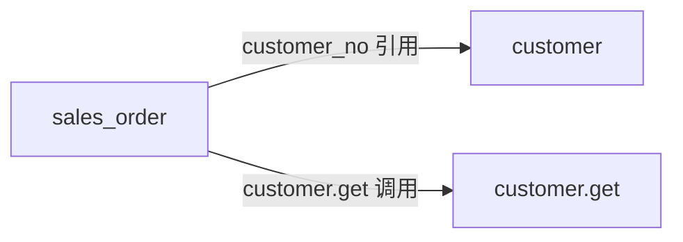
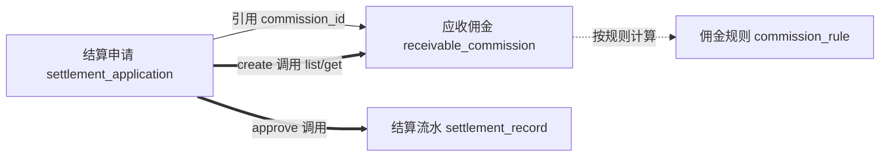

# Skill 规格：fde-aggregate-identification

> **Skill 名**：`fde-aggregate-identification`
> **类型**：分析 Skill（产出文档，不产出代码）
> **对应方法论**：第九章 · 本体驱动（本体 = 实体/属性/关系/约束）+ DDD 聚合（Aggregate / Bounded Context）
> **对齐规范**：`fde-v2/CONVENTION.md`（一个聚合根 = 一个 FDE 应用）
> **后置 Skill**：逐聚合根详细设计（用《需求规格说明书模板.md》）→ 按 CONVENTION 生成应用

---

## 定义

> 给【一个业务的整体说明（背景 / 流程 / 涉及数据 / 角色）】，产出【聚合根清单 + 每个聚合根的边界卡 + 聚合关系图】，解决【拿到一个业务，不知道要拆成哪些 FDE 应用（聚合根）、每个应用管什么、应用之间怎么协作】。

| 维度 | 内容 |
|------|------|
| **输入** | ① 业务整体说明（业务背景、目标、范围）② 业务流程描述（用户旅程 / 操作步骤）③ 涉及的业务数据与角色 ④（可选）行业通用本体、已有应用清单 |
| **输出** | ① 聚合根清单总表 ② 每个聚合根的「聚合根卡」（标识 / 属性 / 操作 / 关键不变量（边界） / 引用 / 跨应用调用 / 状态机）③ 聚合关系图（引用 + 跨应用调用方向） |
| **作用** | 把「一坨业务」切成「一组边界清晰、可独立成应用的聚合根」——这是把业务变成 FDE v2 应用的第一步，决定后续有几个应用、各管什么、如何协作 |

---

## 使用方式（输入契约）

**调用时必给**：**英文应用组名 `<组>`**（snake_case），逐字绑定工作目录 `app/<组>/`。

**组名规则（铁律）**：

- **按字面取用**：用户给什么名就是什么名，技能**不改写、不另起别名、不因"名字太泛"而替换**。例：「设计 sales 应用组」⇒ `<组>` = `sales` ⇒ 工作目录 `app/sales/`。
- **目录不存在则创建**：新组尚无 `app/<组>/` 时由技能建立（产出 `architecture.md` 落在这里）。
- **`brd/` 缺省允许**：`app/<组>/brd/` 不存在或为空均可，此时仅凭来源 ② 推进。

**业务设计有两个来源，可单用或并用**：

| 来源 | 位置 / 形式 | 说明 |
|---|---|---|
| ① 组级业务设计目录 | `app/<组>/brd/`（BRD = Business Requirements Document） | 存放整个应用组的整体业务设计；**可能为空——允许**，为空时仅凭来源 ② 推进 |
| ② 随调用的文字输入 | 用户使用本技能时直接给出的一段业务设计文字 | 背景 / 流程 / 数据 / 角色，自然语言即可 |

> 两个来源互补：`brd/` 提供成体系的整组设计，文字输入可补充或替代。技能读取后产出聚合根清单 + 聚合根卡 + 关系图（内容见 §核心概念 / §输出结构）。

**输入完备性（不臆造）**：若 `app/<组>/brd/` 为空 **且** 用户未给任何文字业务说明，则**没有可分析的业务输入**——技能**停下来向用户索取业务说明**，**不得自行填充或套用内置样例**（呼应核心规则 #8「不臆造」）。

> **输出落点（固定、唯一）**：`app/<组>/architecture.md`——落在应用组文件夹下、命名固定明确，内含聚合根清单总表 + 各聚合根卡 + 关系图（即 §输出结构 的 ①②③，全部写入这一个文件）。

---

## 在应用构建九步法中的位置

构建一个 FDE v2 应用（含浏览器工作台）分九步（后端五步 + 前端四步，全景见《工具链使用说明.md》），本 Skill 是**第①步**：

```
★ 第①步  fde-aggregate-identification   业务整体说明 → 聚合根清单（每个聚合根一张卡）
              ↓
  第②步  逐聚合根详细设计               每个聚合根卡 → 一份《需求规格说明书》（模板）
              ↓
  第③步  按 CONVENTION 生成应用         详细设计 → app/{名}/{名}.py + schema.sql（聚合根类 + DDL + 公共方法 + README）
              ↓
  第④⑤步  后端测试用例 → 测试执行       整组联通验收（app/<组>/tests/verify_chain_<组>.py）
              ↓（契约冻结后）
  第⑥–⑨步  前端设计 → 编码 → 测试用例 → 测试执行   工作台验收（逐应用 app/<组>/tests/verify_view_<组>_<应用>.py + 组级 app/<组>/tests/verify_view_<组>.py）
```

> 第①步回答「**有哪几个应用、各管什么**」；第②步回答「**每个应用内部的业务规则/功能/权限**」；第③步回答「**怎么落成代码**」；第④⑤步验证整组联通；第⑥–⑨步产出并验收浏览器工作台。
> 本 Skill 只产出**分析文档**，不写代码、不画原型——后续各步才逐步精化到字段级、代码级与视图级。

### 为什么「聚合根 = 应用」

CONVENTION v2 的根基（§2 / §8）：

- **一个应用 = 一个同名文件夹 = 一个聚合根类 = 一个同名库 = 一个独立事务/一致性边界。**
- 聚合根的**公共方法**就是对外**服务**（§3）；聚合之间**按名调用**（`self.fde.call`，§5），不 import、不共享事务，一致性靠幂等/补偿（§8）。

所以「识别聚合根」本质上是「**划定一致性边界、决定应用怎么拆**」——这是整个应用架构的第一块砖。

---

## 核心概念

| 概念 | 在 FDE v2 里是什么 | 例子 |
|------|------------------|------|
| **聚合（Aggregate）** | 一组**必须保持一致性**的实体/值对象，作为整体对外提供操作 | 「结算申请」连同其明细行 |
| **聚合根（Aggregate Root）** | 聚合的**唯一对外门面**；外部只能通过它访问聚合内部 | `SettlementApplication` 类 |
| **实体（Entity）** | 有**独立标识**、有生命周期的对象 | 一张结算申请（有申请编号） |
| **值对象（Value Object）** | **无独立标识**、依附于实体、用属性值定义的对象 | 申请里的一个金额项、一个地址 |
| **标识（Identity）** | 聚合根的唯一键：业务主键或自增 id | 销售组织用 `org_no`；销售订单用 `so_no` |
| **不变量（Invariant）** | 聚合内**必须始终成立**的业务规则。架构阶段**只关注界定一致性边界的少数关键不变量**（解释「为何这些实体必须同一聚合一事务」）；逐字段校验规则留到第二步 | 边界：「申请与明细同事务落库」「同项目+机构+日期仅一条生效规则」；字段级：「金额>0」「比例必填」属第二步详设 |
| **一致性边界** | 必须**原子地一起成功**的范围 = 一个聚合 = 一个应用 = 一个库 | 申请与明细同事务；申请→生成流水可跨应用最终一致 |

> **本体视角（Ch.9）**：识别聚合根就是在回答——业务里**有什么**（实体）、**是什么**（属性）、**怎么关联**（关系）、**什么规则**（约束）。把这四问的答案按「一致性边界」聚成一个个聚合根。

---

## 识别方法与步骤

### Step 1：提取业务对象（列实体清单）

从业务说明中抽取所有**名词性业务概念**，列成实体清单（先不判断谁是聚合根）。

- 来源：业务背景、流程步骤里反复出现的名词（「佣金规则」「应收佣金」「结算申请」「机构」「项目」……）。
- 同时记录每个实体的：关键属性、谁创建它、谁使用它、有无状态流转。
- **去重与对齐**：同一概念在不同语境可能叫不同名（「客户需求 / 要货计划 / 原始需求」），合并为一个术语（本体对齐，Ch.9 §9.4）。

### Step 2：区分三类对象

| 判别 | 归类 | 是否单独成应用 |
|------|------|--------------|
| 有**独立标识**、有独立生命周期、需要被**独立创建/查询/修改/删除/引用** | **候选聚合根**（实体） | ✅ 是 |
| **依附**于某对象、无独立标识、生命周期随宿主、不被外部单独引用 | **值对象 / 子实体** | ❌ 归入宿主聚合 |
| 被多方引用的**主数据 / 字典**（部门、客户、产品、数据字典） | **独立聚合根** | ✅ 是（常作被引用的基础应用） |

### Step 3：划定聚合边界（最关键）

> **第一原则：按一致性边界划分，不按 UI 页面、不按数据库表划分。**

- **必须强一致（同一事务原子成功）的 → 放同一个聚合。** 例：结算申请与其明细行必须一起落库 → 同一聚合。
- **可容忍短暂不一致（最终一致）的 → 拆成不同聚合**，用跨应用调用 + 幂等/补偿协作。例：「审批通过后生成结算流水」可拆——申请聚合调用流水聚合，失败可重试/补偿（CONVENTION §8 无分布式事务）。
- **聚合尽量小**：只包含「必须一起变」的最小实体集。大聚合 = 并发差、耦合重。
- **聚合之间用 ID 引用（弱引用），不共享对象、不共享事务。** 例：`sales_order.customer_no` 引用 `customer.customer_no`，但 sales_order 应用**不 import** customer（§5）。

### Step 4：确定每个聚合根（填聚合根卡）

对每个候选聚合根，明确：

1. **标识（主键）**：业务主键（如 `org_no`）或自增 `id`。被多方引用的倾向用业务主键。
2. **核心属性**：聚合根自有的关键字段（只列业务关心的，不是 ERP 全字段）。
3. **对外操作（服务）**：这个聚合根对外提供哪些操作——将成为**公共方法**（§3）。一般是 CRUD + 业务动作（如 `submit`/`approve`/`enact`）。
4. **关键不变量（界定一致性边界）**：只写**解释「为何这些实体必须在同一聚合/同一事务内」的少数关键约束**（2–5 条）——它们是划分聚合的依据。**不要**逐条罗列字段级校验规则（如「金额>0」「比例必填」），那些属于第二步《需求规格说明书》的业务规则（BR），最终成为方法内校验（违反抛 `FdeError`，§7）。
5. **引用的聚合**：by ID 引用了哪些其他聚合的哪个标识。
6. **跨应用调用**：本聚合的哪个操作需要调哪个聚合的哪个服务（`self.fde.call("应用","服务")`，§5）——**列全，供静态扫描器校验**（§10.8）。
7. **状态机（可选）**：有状态流转的聚合，列状态与转换规则。

### Step 5：绘制聚合关系图

画出聚合根之间的：
- **引用关系**（谁 by ID 引用谁，虚线/标注引用键）；
- **跨应用调用方向**（谁的哪个操作 → 调谁的哪个服务，实线箭头）。

这张图就是未来跨应用调用图，也是静态扫描器的校验依据。

### Step 6：命名与审核

- 每个聚合根 → 一个 **snake_case 应用名**（= 文件夹名），类名 **PascalCase**（`sales_order` → `SalesOrder`）。
- 与业务方审核：聚合划分、边界、命名、跨应用关系是否正确；修正 AI 的理解偏差（Ch.9 §9.4 ⑤）。

---

## 聚合根识别判定准则（启发式）

| 信号 | 倾向 |
|------|------|
| 需要被**独立列表/详情/管理**（有自己的「列表页/详情页」） | 独立聚合根 |
| 是**流程单据**（订单/申请/结算单），有**状态机** | 独立聚合根 |
| 是**主数据/字典**（部门/客户/产品），被多方引用 | 独立聚合根（基础应用） |
| 「整体-部分」中，部分**离开整体无意义、不被独立引用** | 部分归入整体聚合（不独立成应用） |
| 两个对象**必须原子地一起改** | 同一聚合 |
| 两个对象**可短暂不一致、各自独立演进** | 拆成两个聚合，跨应用调用 |

**两个反模式要避免**：
- **上帝聚合**：把一切都塞进一个聚合 → 并发差、难维护、违背「聚合尽量小」。
- **过度拆分**：把必须强一致的拆散 → 无分布式事务下无法保证一致性（§8）。

> **拿不准时问一句**：「这两部分能不能容忍 A 已成功、B 暂失败、稍后补偿？」能 → 拆开；不能 → 合并。

---

## 输出结构

> **唯一产出文件：`app/<组>/architecture.md`**（落在应用组文件夹下，命名固定）。下述 ①②③ 全部写入这一个文件。

### ① 聚合根清单总表

| # | 聚合根 | 应用名 | 类名 | 一句话定义 | 标识 | 是否主数据 |
|---|--------|--------|------|-----------|------|----------|
| 1 | 销售组织 | `sales_org` | `SalesOrg` | 销售组织主数据 | `org_no` | 是 |
| 2 | 销售订单 | `sales_order` | `SalesOrder` | 客户合同 + 履约量账本 | `so_no` | 否 |

### ② 聚合根卡（每个聚合根一张）

```
聚合根：{名称}
应用名 / 类名：{snake_case} / {PascalCase}
业务定义：{一句话}
标识（主键）：{业务主键 or 自增 id}

核心属性：
  - {字段}: {类型} — {含义}

对外操作（将成公共方法）：
  - {方法名}({参数}) — {说明}

关键不变量（界定一致性边界，2–5 条；字段级校验规则留第二步）：
  - {解释为何这些实体必须同聚合/同事务的关键约束}

引用的聚合（by ID 弱引用）：
  - {哪个聚合}.{哪个标识}

跨应用调用（self.fde.call）：
  - 本聚合 {操作} → 调 {应用}.{服务}

状态机（可选）：
  {状态} --{动作/条件}--> {状态}
```

### ③ 聚合关系图（mermaid 或 ASCII）



---

## 如何喂给后两步（映射表）

聚合根卡是承上启下的枢纽：

| 聚合根卡的内容 | → 第二步《需求规格说明书》 | → 第三步 CONVENTION 应用 |
|--------------|--------------------------|------------------------|
| 业务定义 / 核心属性 | §1 需求概览、§3.3 业务数据、§4 实体字段表 | `schema.sql` 建表字段 |
| 对外操作 | §4 功能清单（每个操作一个功能） | **公共方法**（§3） |
| 关键不变量（边界） | §3.2 业务规则（BR）的种子，第二步补全逐字段规则 | 边界约束 + 方法内校验 `raise FdeError`（§7） |
| 状态机 | §3.4 状态机 | 状态字段 + 转换方法 |
| 引用的聚合 / 跨应用调用 | §7 外部依赖 / 相关功能 | `self.fde.call(...)`（§5） |
| 涉及角色 | §5 权限要求（**平台层**实现，应用无关） | 应用不实现鉴权，仅读 `self.ctx`（§4.1） |

> **权限提示**：聚合根卡里的「角色」只用于第二步写清功能/数据权限需求；**权限本身由平台实现（服务级授权 + 前端页面授权，后者见《视图生成.md》），应用与权限无关**——第三步生成代码时，应用不写任何鉴权逻辑。

---

## 核心规则

1. **一个聚合根 = 一个 FDE 应用**（文件夹 / 类 / 库 / 事务边界，§2 §8）。识别聚合根就是在决定应用怎么拆。
2. **按一致性边界划分**，不按 UI 页面、不按数据库表划分。
3. **聚合尽量小**；聚合间用 **ID 弱引用 + 跨应用调用**，不共享对象、不共享事务。
4. **每个聚合根必须有明确标识**（业务主键或自增 id）。
5. **对外操作只列「服务」**（将成公共方法）；内部辅助（`_` 前缀）不算。
6. **跨应用调用要列全**（`应用.服务`），供静态扫描器校验（§10.8）。
7. **权限是平台的事**：应用与权限无关，卡里的角色只服务于第二步的权限需求描述。
8. **不臆造**：业务说明未明确的标「待确认」，留到第二步与业务方澄清。
9. **组名按字面绑定（铁律）**：用户给定的应用组名逐字作为 `<组>`、绑定 `app/<组>/`，不改写、不另起别名；完全无业务输入（`brd/` 空且无文字）时停下来索取，不自行填充（见 §使用方式）。
10. **主数据铁律**：应用组中被多个应用引用的基础数据（客户 / 物料 / 车型 / 用户 / 日历等），若不通过外部接口（MDM/ERP）获取，则**必须**在组内独立建模为主数据应用（`md_*`），并为其生成前端页面以供录入。组内所有应用的对应字段**必须**通过主数据应用加载下拉选项——**禁止手工录入主数据标识**。已在架构总表中识别出被多方引用的主数据实体而未为其独立建模的，视为架构设计不完整。

---

## 验收标准（TDD）

| 场景 | 给定 | 当 | 那么 |
|------|------|-----|------|
| **完整性** | 业务说明 | 产出聚合根清单 | 业务里所有需独立管理的对象都被识别为聚合根，无遗漏 |
| **边界正确** | 必须强一致的两部分 | 检查聚合划分 | 在同一聚合内；可最终一致的拆成不同聚合 |
| **聚合不过大** | 任一聚合根 | 检查包含的实体 | 只含「必须一起变」的最小集合，无上帝聚合 |
| **标识明确** | 任一聚合根 | 检查标识 | 有明确业务主键或自增 id |
| **操作即服务** | 任一聚合根卡 | 检查对外操作 | 每个操作可成为一个公共方法，含参数与说明 |
| **边界不变量到位** | 任一聚合根卡 | 检查关键不变量 | 有 2–5 条界定一致性边界的关键不变量（说明为何这些实体同聚合）；未混入逐字段校验规则 |
| **跨应用列全** | 聚合关系图 | 对照跨应用调用 | 每个 `self.fde.call` 的目标应用/服务都在清单内（扫描器可通过） |
| **弱引用** | 聚合间关系 | 检查引用方式 | 用 ID 引用，不要求 import 目标聚合 |
| **权限归平台** | 聚合根卡 | 检查角色描述 | 角色只用于权限需求描述，应用本身不含鉴权逻辑 |
| **可衔接** | 聚合根卡 | 套映射表 | 每张卡都能展开为一份需求规格说明书、并落到 CONVENTION 应用 |

- **覆盖度门禁**：本步产出须经独立的覆盖度检查——对照本规格规定的上游输入，逐项验证覆盖完整性。覆盖度 < 100% 不得进入下一步。具体门禁条件见 `design-plus/工具链使用说明.md` 对应步骤的「完成门禁」段。

---

## Demo 案例：财务结算-应收佣金

> 以《需求规格说明书模板》里的「应收佣金管理」为例，演示第一步如何识别聚合根。

### 输入：业务整体说明（摘要）

- 财务人员配置佣金规则（项目+机构+比例）；系统按回款自动算应收佣金。
- 财务人员从应收佣金列表选佣金、申请结算 → 进入审批；财务负责人审批（金额分级）；通过后生成结算流水。
- 角色：财务人员、调诉机构、财务负责人。

### Step 1-2：提取并归类

| 业务对象 | 判别 | 归类 |
|---------|------|------|
| 佣金规则 | 有独立标识、独立增删改、被计算引用 | **聚合根** |
| 应收佣金 | 有标识、需独立列表/筛选/选择申请 | **聚合根** |
| 结算申请 | 流程单据、有状态机、需审批 | **聚合根** |
| 结算流水 | 有标识、需独立查询 | **聚合根** |
| 结算明细行 | 依附申请、无独立标识、随申请生死 | **值对象**（归入结算申请聚合） |
| 项目 / 机构 / 案件 | 主数据、被多方引用 | **独立聚合根**（基础应用，常已存在，by ID 引用） |

### Step 3-4：聚合根卡（示例两张）

```
聚合根：佣金规则
应用名 / 类名：commission_rule / CommissionRule
业务定义：定义项目与机构的佣金计算方式
标识（主键）：rule_id（业务键：项目+机构+生效日期 唯一）

核心属性：
  - project_code: 文本 — 项目编码（引用 项目）
  - org_code: 文本 — 机构编码（引用 机构）
  - calc_type: 枚举 — 按比例 / 固定金额
  - ratio / fixed_amount: 数字 — 比例或固定金额
  - effective_date: 日期 — 生效日期
  - status: 枚举 — 生效 / 失效

对外操作（将成公共方法）：
  - create(...) / get(rule_id) / list(筛选) / update(rule_id,...) / disable(rule_id)

关键不变量（界定一致性边界）：
  - 同项目+同机构+同生效日期仅一条生效规则（规则唯一性是本聚合的存在前提）
  （calc_type 取值与 ratio/fixed_amount 必填等字段校验属第二步详设）

引用的聚合（by ID）：项目.project_code、机构.org_code
跨应用调用：无（被 应收佣金 计算时引用）
```

```
聚合根：结算申请
应用名 / 类名：settlement_application / SettlementApplication
业务定义：基于应收佣金发起的结算流程单据
标识（主键）：application_no（业务键）

核心属性：
  - application_no: 文本 — 申请编号
  - total_amount: 金额 — 结算金额（= 所选佣金合计）
  - applicant_no: 文本 — 申请人工号（来自 ctx.userno）
  - status: 枚举 — 待审批/已审批/已驳回/已结算
  - items: [值对象] — 结算明细行（佣金ID+金额）

对外操作（将成公共方法）：
  - create(commission_ids,...) — 选佣金生成申请
  - submit(application_no) — 提交审批
  - approve(application_no) / reject(application_no, reason) — 审批
  - get / list(按状态筛选)

关键不变量（界定一致性边界）：
  - 申请与其明细行（items）必须同事务落库（明细为值对象，随申请生死 → 同聚合的依据）
  - 只能对「待结算」的应收佣金发起申请（与外部聚合的状态契约）
  （结算金额>0 等字段校验属第二步详设；状态流转见状态机）

引用的聚合（by ID）：应收佣金.commission_id
跨应用调用（self.fde.call）：
  - approve → 调 settlement_record.create（审批通过生成结算流水）
  - create → 调 receivable_commission.list / get（取佣金明细、校验状态）

状态机：
  (新建) --submit--> 待审批 --approve--> 已审批 --生成流水--> 已结算
                       待审批 --reject--> 已驳回
```

### Step 5：聚合关系图



### Step 6：应用清单（第一步产出）

| # | 聚合根 | 应用名 | 标识 | 说明 |
|---|--------|--------|------|------|
| 1 | 佣金规则 | `commission_rule` | rule_id | 被计算引用 |
| 2 | 应收佣金 | `receivable_commission` | commission_id | 列表/筛选/被申请选择 |
| 3 | 结算申请 | `settlement_application` | application_no | 流程单据 + 状态机 + 审批 |
| 4 | 结算流水 | `settlement_record` | record_id | 审批通过后生成 |
| 5 | 项目 / 机构 | `project` / `org` | 业务键 | 主数据（可能已存在，by ID 引用） |

> 这 5（含主数据）个聚合根 = 5 个 FDE 应用。**第二步**对每个聚合根用《需求规格说明书模板》写详细设计（如「结算申请」对应模板示例里的 US-03/US-04、状态机、分级审批规则、§5 权限矩阵）；**第三步**按 CONVENTION 生成 `app/settlement_application/settlement_application.py` 等，其中「对外操作」→公共方法、「业务规则（BR，含关键不变量）」→`FdeError` 校验、「跨应用调用」→`self.fde.call`、权限交平台。

---

## 与既有方法论的关系

- **承接 Ch.9 本体驱动**：识别聚合根 = 把业务本体（实体/属性/关系/约束）按一致性边界聚成应用单元。本 Skill 是「本体 → 应用拆分」的桥梁。
- **DDD 对齐**：聚合根 / 聚合 / 值对象 / 一致性边界 / Bounded Context 均取 DDD 标准含义；一个 Bounded Context 内的若干聚合 → 若干 FDE 应用。
- **区别于 v1 的 `fde-app-generation`**：那是 v1「九服务目录 + run() 函数」的代码生成 Skill；本 Skill 服务于 **v2 聚合根范式**，且只产出**分析文档**（聚合根清单 + 卡 + 关系图），代码生成在第三步。
